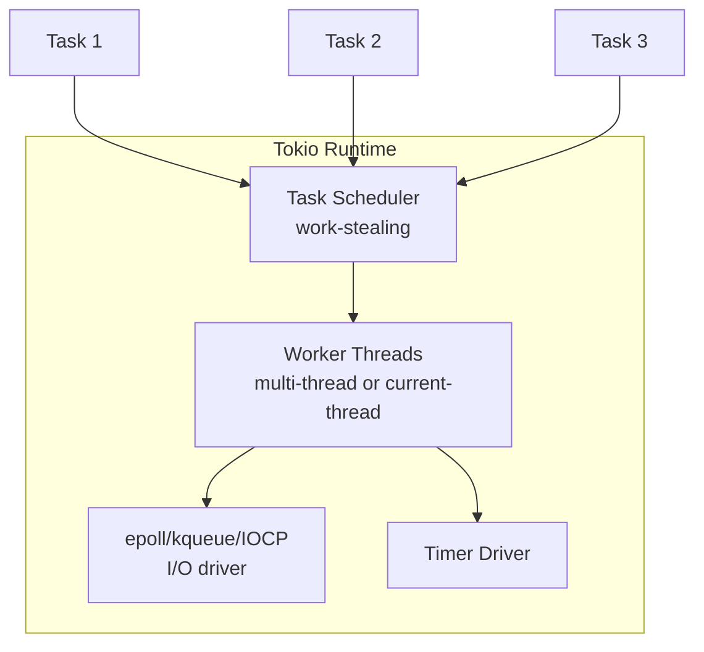

# Tokio

## Overview

Tokio is an asynchronous runtime for Rust, providing the building blocks for writing reliable, asynchronous, and lightweight applications. It's the most popular async runtime in the Rust ecosystem.

## Architecture



## Core Concepts

### Runtime

```rust
use tokio::runtime::Builder;

// Multi-threaded runtime (default)
#[tokio::main]
async fn main() {
    // This creates a multi-threaded runtime
}

// Current-thread runtime (single thread)
#[tokio::main(flavor = "current_thread")]
async fn main() {
    // All tasks on one thread
}

// Manual runtime creation
fn main() {
    let rt = Builder::new_multi_thread()
        .worker_threads(4)
        .enable_all()
        .build()
        .unwrap();
    
    rt.block_on(async {
        // async code here
    });
}
```

### Tasks

```rust
use tokio::task;

// Spawn a task
let handle = task::spawn(async {
    expensive_computation().await
});

// Wait for result
let result = handle.await?;

// Spawn blocking (for sync code)
let result = task::spawn_blocking(|| {
    std::fs::read_to_string("file.txt")
}).await??;

// Join multiple tasks
let (a, b) = tokio::join!(
    fetch_data("url1"),
    fetch_data("url2")
);

// Select (first to complete)
tokio::select! {
    val = future1 => { /* future1 completed */ }
    val = future2 => { /* future2 completed */ }
    _ = tokio::time::sleep(Duration::from_secs(5)) => { /* timeout */ }
}
```

### Channels

```rust
use tokio::sync::{mpsc, oneshot, broadcast, watch};

// mpsc: multiple producer, single consumer
let (tx, mut rx) = mpsc::channel(32);

tokio::spawn(async move {
    tx.send("hello").await.unwrap();
});

while let Some(msg) = rx.recv().await {
    println!("{}", msg);
}

// oneshot: single value
let (tx, rx) = oneshot::channel();
tokio::spawn(async move { tx.send(42).unwrap() });
let val = rx.await?;

// broadcast: multiple producer, multiple consumer
let (tx, _) = broadcast::channel(16);
let mut rx1 = tx.subscribe();
let mut rx2 = tx.subscribe();

// watch: single producer, multiple consumer (latest value)
let (tx, rx) = watch::channel("initial");
```

### Synchronization

```rust
use tokio::sync::{Mutex, RwLock, Semaphore};

// Async mutex
let data = Arc::new(Mutex::new(Vec::new()));
let mut guard = data.lock().await;
guard.push(1);

// Async rwlock
let data = Arc::new(RwLock::new(HashMap::new()));
let reader = data.read().await;  // Multiple readers
let mut writer = data.write().await; // Exclusive writer

// Semaphore
let sem = Arc::new(Semaphore::new(3)); // Max 3 concurrent
let permit = sem.acquire().await?;
// ... do work
drop(permit); // Release
```

### I/O

```rust
use tokio::io::{AsyncReadExt, AsyncWriteExt};
use tokio::net::{TcpListener, TcpStream};

// TCP server
let listener = TcpListener::bind("127.0.0.1:8080").await?;
loop {
    let (socket, addr) = listener.accept().await?;
    tokio::spawn(async move {
        handle_connection(socket).await
    });
}

// Read/Write
async fn handle_connection(mut stream: TcpStream) {
    let mut buf = [0u8; 1024];
    let n = stream.read(&mut buf).await?;
    stream.write_all(&buf[..n]).await?;
}
```

### Timers

```rust
use tokio::time::{sleep, timeout, interval, Duration};

// Sleep
sleep(Duration::from_secs(1)).await;

// Timeout
match timeout(Duration::from_secs(5), async_operation()).await {
    Ok(result) => { /* completed */ }
    Err(_) => { /* timed out */ }
}

// Interval
let mut interval = interval(Duration::from_secs(1));
loop {
    interval.tick().await;
    do_something();
}
```

## Common Patterns

### Connection Pool

```rust
use tokio::sync::Semaphore;
use std::sync::Arc;

struct Pool {
    connections: Mutex<Vec<Connection>>,
    semaphore: Semaphore,
}

impl Pool {
    async fn get(&self) -> Connection {
        let _permit = self.semaphore.acquire().await.unwrap();
        self.connections.lock().await.pop().unwrap()
    }
}
```

### Graceful Shutdown

```rust
#[tokio::main]
async fn main() {
    let (shutdown_tx, shutdown_rx) = tokio::sync::watch::channel(());
    
    let server = tokio::spawn(run_server(shutdown_rx.clone()));
    
    // Wait for Ctrl+C
    tokio::signal::ctrl_c().await.unwrap();
    
    // Signal shutdown
    drop(shutdown_tx);
    
    // Wait for server to finish
    server.await.unwrap();
}
```

## Interview Questions

1. **What is `Pin`?** — Prevents moving values that contain self-references; required for `Future`
2. **`Send` and `Sync`?** — `Send`: safe to send between threads; `Sync`: safe to share references between threads
3. **How does work-stealing work?** — Each worker has a local queue; idle workers steal from others
4. **`spawn` vs `spawn_blocking`?** — `spawn` for async tasks; `spawn_blocking` for CPU-heavy or sync I/O
5. **What is `select!`?** — Races multiple futures, runs first to complete, cancels others
6. **How to handle errors in tasks?** — `JoinHandle::await` returns `Result`; handle `JoinError` and task error
7. **`current_thread` vs `multi_thread`?** — `current_thread`: single-threaded, lower overhead; `multi_thread`: work-stealing, better for I/O-bound
8. **What is cooperative scheduling?** — Tasks yield at `.await` points; long CPU tasks should use `spawn_blocking` or `yield_now()`

## Related Topics

- [Rust Async](../../languages/rust/async.md) — Async fundamentals in Rust
- [Rust Ownership](../../languages/rust/ownership.md) — Ownership and borrowing
- [Concurrency](../../concurrency/) — General concurrency concepts
- [Go Scheduler](../../languages/go/scheduler.md) — Comparison with goroutines
