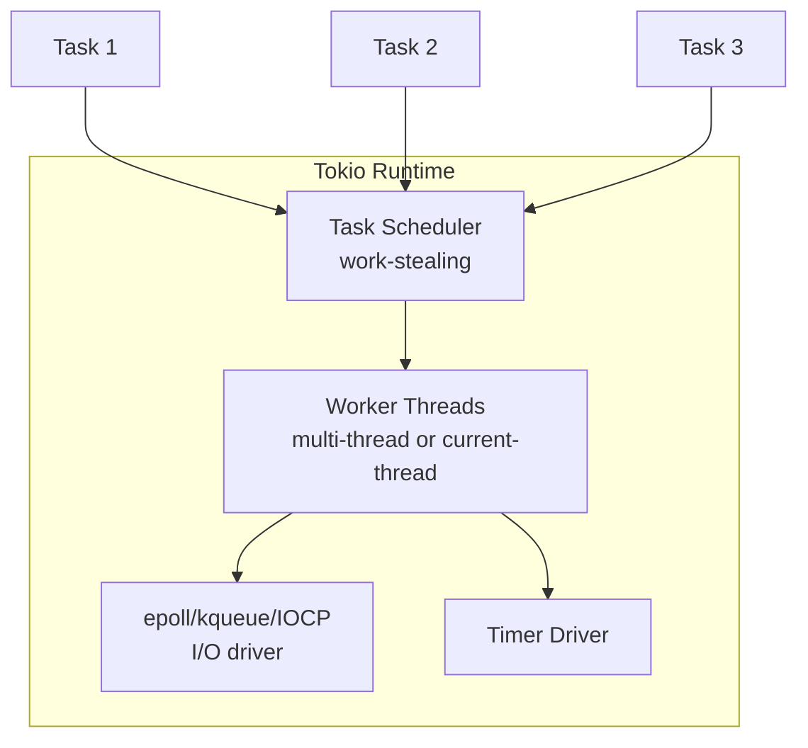
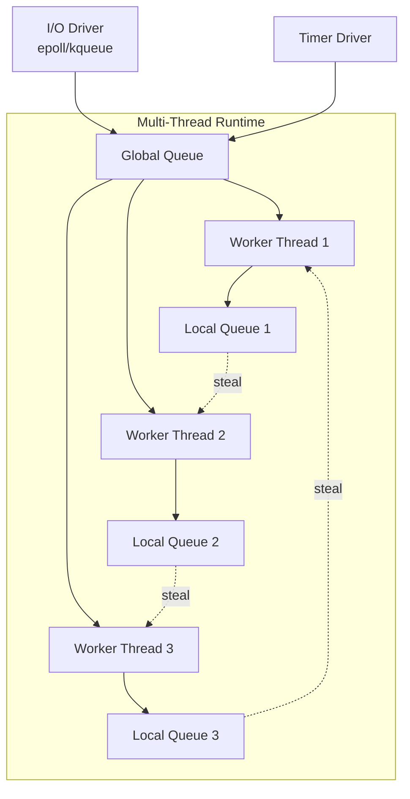
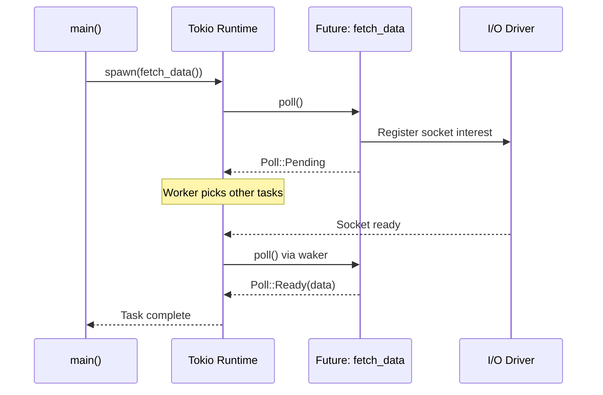
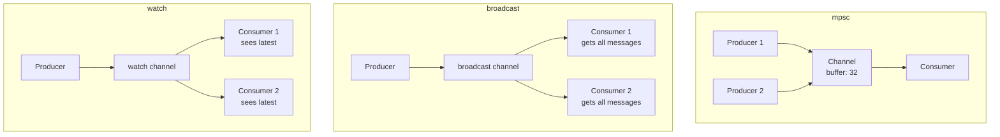

# Tokio

## Overview

Tokio is an asynchronous runtime for Rust, providing the building blocks for writing reliable, asynchronous, and lightweight applications. It's the most popular async runtime in the Rust ecosystem.

## Architecture



## Core Concepts

### Runtime Model



```rust
use tokio::runtime::Builder;

// Multi-threaded runtime (default)
#[tokio::main]
async fn main() {
    // This creates a multi-threaded runtime
    // Worker threads = number of CPU cores
}

// Current-thread runtime (single thread)
#[tokio::main(flavor = "current_thread")]
async fn main() {
    // All tasks on one thread
    // Good for: testing, low-latency, simple apps
}

// Manual runtime creation
fn main() {
    let rt = Builder::new_multi_thread()
        .worker_threads(4)
        .enable_all()        // Enable I/O + time drivers
        .thread_name("my-worker")
        .thread_stack_size(3 * 1024 * 1024)
        .on_thread_start(|| println!("Worker started"))
        .build()
        .unwrap();

    rt.block_on(async {
        // async code here
    });
}
```

### How Async/Await Works in Rust



Key insight: Rust futures are **lazy** — they don't execute until polled. The runtime drives them forward.

```rust
// This does NOTHING until polled
let future = async {
    println!("Hello!");
    42
};

// This spawns it on the runtime
let handle = tokio::spawn(future);
let result = handle.await;  // NOW it executes
```

### Tasks

```rust
use tokio::task;

// Spawn a task (returns JoinHandle)
let handle = task::spawn(async {
    expensive_computation().await
});

// Wait for result
let result = handle.await?;

// Spawn multiple concurrent tasks
let mut handles = vec![];
for url in urls {
    handles.push(tokio::spawn(async move {
        fetch_url(&url).await
    }));
}

// Await all
for handle in handles {
    let result = handle.await??;
}

// Spawn blocking (for sync code in async context)
let result = task::spawn_blocking(|| {
    std::fs::read_to_string("file.txt")
}).await??;
```

### Join, Select, and Spawn

```rust
use tokio::time::{sleep, Duration};

// Join: wait for ALL to complete
let (a, b) = tokio::join!(
    fetch_data("url1"),
    fetch_data("url2")
);

// Select: wait for FIRST to complete, cancel others
tokio::select! {
    val = future1 => { println!("future1: {}", val); }
    val = future2 => { println!("future2: {}", val); }
    _ = sleep(Duration::from_secs(5)) => { println!("timeout!"); }
}

// Biased select: prefer first branch
tokio::select! {
    biased;
    val = priority_future => { /* checked first */ }
    val = other_future => { /* checked second */ }
}

// JoinSet: dynamic number of tasks
let mut set = tokio::task::JoinSet::new();
for url in urls {
    set.spawn(fetch_url(url));
}
while let Some(result) = set.join_next().await {
    println!("Task completed: {:?}", result);
}
```

### Channels

```rust
use tokio::sync::{mpsc, oneshot, broadcast, watch};

// mpsc: multiple producer, single consumer
let (tx, mut rx) = mpsc::channel(32);  // buffer size 32

tokio::spawn(async move {
    tx.send("hello").await.unwrap();
});

while let Some(msg) = rx.recv().await {
    println!("{}", msg);
}

// oneshot: single value, single use
let (tx, rx) = oneshot::channel();
tokio::spawn(async move { tx.send(42).unwrap() });
let val = rx.await?;

// broadcast: multiple producer, multiple consumer (all receive all)
let (tx, _) = broadcast::channel(16);
let mut rx1 = tx.subscribe();
let mut rx2 = tx.subscribe();
tx.send("event").unwrap();

// watch: single producer, multiple consumer (latest value only)
let (tx, mut rx) = watch::channel("initial");
tx.send("updated").unwrap();
println!("{}", *rx.borrow());  // "updated"
```

### Channel Patterns



### Synchronization

```rust
use tokio::sync::{Mutex, RwLock, Semaphore};
use std::sync::Arc;

// Async mutex (use tokio::sync::Mutex, not std!)
let data = Arc::new(Mutex::new(Vec::new()));

// Clone Arc for each task
let data_clone = Arc::clone(&data);
tokio::spawn(async move {
    let mut guard = data_clone.lock().await;
    guard.push(1);
});

// Async rwlock
let data = Arc::new(RwLock::new(HashMap::new()));
let reader = data.read().await;   // Multiple readers OK
let mut writer = data.write().await; // Exclusive writer

// Semaphore: limit concurrency
let sem = Arc::new(Semaphore::new(3)); // Max 3 concurrent
let permit = sem.acquire().await?;
// ... do work
drop(permit); // Release
```

### I/O

```rust
use tokio::io::{AsyncReadExt, AsyncWriteExt};
use tokio::net::{TcpListener, TcpStream};

// TCP server
let listener = TcpListener::bind("127.0.0.1:8080").await?;
loop {
    let (socket, addr) = listener.accept().await?;
    tokio::spawn(async move {
        handle_connection(socket).await
    });
}

// Read/Write
async fn handle_connection(mut stream: TcpStream) {
    let mut buf = [0u8; 1024];
    let n = stream.read(&mut buf).await?;
    stream.write_all(&buf[..n]).await?;
}

// Framed I/O with tokio-util
use tokio_util::codec::{Framed, LengthDelimitedCodec};
let framed = Framed::new(socket, LengthDelimitedCodec::new());
while let Some(msg) = framed.next().await {
    let msg = msg?;
    framed.send(msg).await?;
}
```

### Timers

```rust
use tokio::time::{sleep, timeout, interval, Duration, Instant};

// Sleep
sleep(Duration::from_secs(1)).await;

// Timeout
match timeout(Duration::from_secs(5), async_operation()).await {
    Ok(result) => { /* completed */ }
    Err(_) => { /* timed out */ }
}

// Interval
let mut interval = interval(Duration::from_secs(1));
loop {
    interval.tick().await;
    do_something();
}

// Interval at specific rate (missed tick behavior)
let mut interval = interval_at(
    Instant::now() + Duration::from_secs(1),
    Duration::from_secs(1)
);
interval.set_missed_tick_behavior(tokio::time::MissedTickBehavior::Delay);
```

## Common Patterns

### Connection Pool

```rust
use tokio::sync::Semaphore;
use std::sync::Arc;

struct Pool {
    connections: Mutex<Vec<Connection>>,
    semaphore: Semaphore,
}

impl Pool {
    async fn get(&self) -> PooledConnection {
        let _permit = self.semaphore.acquire().await.unwrap();
        let conn = self.connections.lock().await.pop().unwrap();
        PooledConnection { conn, pool: self }
    }
}
```

### Graceful Shutdown

```rust
#[tokio::main]
async fn main() {
    let (shutdown_tx, shutdown_rx) = tokio::sync::watch::channel(());

    let server = tokio::spawn(run_server(shutdown_rx.clone()));
    let worker = tokio::spawn(run_worker(shutdown_rx.clone()));

    // Wait for Ctrl+C
    tokio::signal::ctrl_c().await.unwrap();

    // Signal shutdown
    drop(shutdown_tx);

    // Wait for tasks to finish (with timeout)
    let _ = tokio::time::timeout(
        Duration::from_secs(30),
        tokio::join!(server, worker)
    ).await;
}
```

### Actor Pattern

```rust
use tokio::sync::{mpsc, oneshot};

enum Command {
    Get { key: String, resp: oneshot::Sender<Option<String>> },
    Set { key: String, value: String, resp: oneshot::Sender<()> },
}

async fn actor(mut rx: mpsc::Receiver<Command>) {
    let mut store = HashMap::new();
    while let Some(cmd) = rx.recv().await {
        match cmd {
            Command::Get { key, resp } => {
                let _ = resp.send(store.get(&key).cloned());
            }
            Command::Set { key, value, resp } => {
                store.insert(key, value);
                let _ = resp.send(());
            }
        }
    }
}
```

## Interview Questions

1. **What is `Pin`?** — Prevents moving values that contain self-references; required for `Future`
2. **`Send` and `Sync`?** — `Send`: safe to send between threads; `Sync`: safe to share references between threads
3. **How does work-stealing work?** — Each worker has a local queue; idle workers steal from others
4. **`spawn` vs `spawn_blocking`?** — `spawn` for async tasks; `spawn_blocking` for CPU-heavy or sync I/O
5. **What is `select!`?** — Races multiple futures, runs first to complete, cancels others
6. **How to handle errors in tasks?** — `JoinHandle::await` returns `Result`; handle `JoinError` and task error
7. **`current_thread` vs `multi_thread`?** — `current_thread`: single-threaded, lower overhead; `multi_thread`: work-stealing, better for I/O-bound
8. **What is cooperative scheduling?** — Tasks yield at `.await` points; long CPU tasks should use `spawn_blocking` or `yield_now()`
9. **Why `tokio::sync::Mutex` instead of `std::sync::Mutex`?** — std Mutex blocks the thread; tokio Mutex yields to the runtime, allowing other tasks to proceed
10. **When to use `spawn_blocking`?** — CPU-intensive work, synchronous I/O, or calling blocking libraries; it runs on a separate thread pool

## References

- [Tokio Official Documentation](https://tokio.rs/)
- [Tokio Tutorial](https://tokio.rs/tokio/tutorial)
- [Rust Async Book](https://rust-lang.github.io/async-book/)
- [Rust Design Patterns: Async](https://rust-unofficial.github.io/patterns/)
- [Asynchronous Programming in Rust](https://rust-lang.github.io/async-book/)

## Related Topics

- [Rust Async](../../languages/rust/async.md) — Async fundamentals in Rust
- [Rust Ownership](../../languages/rust/ownership.md) — Ownership and borrowing
- [Concurrency](../../concurrency/) — General concurrency concepts
- [Go Scheduler](../../languages/go/scheduler.md) — Comparison with goroutines
