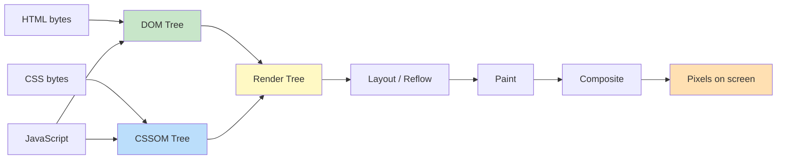
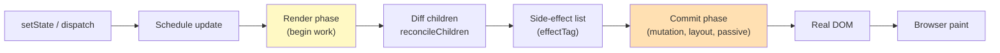

# Frontend Engineering

This page is the deep dive for Section 21 of the master syllabus (`src/index.md`). It covers the full surface of modern frontend engineering — from the browser rendering pipeline and the DOM, through framework internals (virtual DOM, reconciliation, hydration), to the rendering strategies (CSR/SSR/SSG/ISR/RSC), styling architectures, accessibility, and internationalization. Where topics overlap with focused pages ([Browser Rendering](../web-development/browser-rendering.md), [React](./react.md), [CSS Deep Dive](./css-deep.md), [Accessibility](./accessibility.md), [SSR/CSR/SSG](./ssr-csr-ssg.md)), this page cross-references them rather than duplicating detail.

## The Document Object Model (DOM)

The DOM is an in-memory, tree-shaped representation of an HTML document. The HTML parser reads the byte stream, tokenizes it into start/end tags and text, and assembles a tree of `Node` objects. Each element node exposes the `Element` interface; the root is `document`.

```html
<html>                 <!-- documentElement -->
  <head>               <!-- Element: HTMLHeadElement -->
    <title>Page</title>
  </head>
  <body>               <!-- Element: HTMLBodyElement -->
    <div id="app">     <!-- Element: HTMLDivElement -->
      <p>Hello</p>     <!-- Element: HTMLParagraphElement + Text node -->
    </div>
  </body>
</html>
```

Key properties of the DOM:

- **Live and mutable.** `document.getElementById('app').appendChild(node)` immediately re-renders.
- **Language-agnostic spec, JavaScript binding.** The DOM is defined by WHATWG; JS is just one way to manipulate it.
- **Reflow and repaint cost.** Every structural or geometric mutation may trigger layout (reflow) and paint — the foundation of rendering performance work (see [Browser Rendering](../web-development/browser-rendering.md)).

The DOM is the source of truth that every framework eventually writes to. The art of frontend engineering is minimizing how often, and how expensively, we touch it.

## Browser Rendering Pipeline

The browser transforms HTML, CSS, and JS into pixels through six ordered stages. This is the **critical rendering path**.



| Stage | Input | Output | Cost |
|---|---|---|---|
| **Parse HTML** | Byte stream, charset-detected | DOM tree | Cheap; incremental |
| **Parse CSS** | Stylesheet bytes | CSSOM tree | Render-blocking; cascading requires full sheet |
| **Execute JS** | Script bytes | DOM/CSSOM mutations | Parser-blocking unless `async`/`defer` |
| **Render Tree** | DOM + CSSOM | Visible nodes + computed styles | Excludes `display:none`, `<head>`, `<script>` |
| **Layout (Reflow)** | Render tree | Geometry (x, y, w, h) per box | Expensive; can cascade to ancestors |
| **Paint** | Layout + styles | Paint records (draw calls) | Moderate; split into layers |
| **Composite** | Painted layers | Final frame on GPU | Cheap if only `transform`/`opacity` changed |

### Critical Rendering Path Optimizations

- Inline **critical CSS** in `<head>`; lazy-load the rest.
- Mark non-blocking scripts with `defer` (preserve order) or `async` (execute when ready).
- Preconnect to origins (`<link rel="preconnect">`) and preload key assets (`<link rel="preload" as="font">`).
- Animate only `transform` and `opacity` to keep frames on the compositor thread.

Reference: [Critical Rendering Path — web.dev](https://web.dev/articles/critical-rendering-path), [Populating the page: how browsers work — MDN](https://developer.mozilla.org/en-US/docs/Web/Performance/How_browsers_work).

## Core Web Vitals

Google's Core Web Vitals are the field-measured, user-centric metrics that anchor modern frontend performance work.

| Metric | Measures | Good | Needs improvement | Poor |
|---|---|---|---|---|
| **LCP** (Largest Contentful Paint) | Load performance of the largest visible element | ≤ 2.5 s | 2.5 – 4.0 s | > 4.0 s |
| **CLS** (Cumulative Layout Shift) | Visual stability across the page lifetime | ≤ 0.1 | 0.1 – 0.25 | > 0.25 |
| **INP** (Interaction to Next Paint) | Responsiveness to all interactions (replaced FID in 2024) | ≤ 200 ms | 200 – 500 ms | > 500 ms |

Supporting metrics include **FCP** (First Contentful Paint), **TTFB** (Time to First Byte), and **TBT** (Total Blocking Time, the lab counterpart of INP). The shift from FID to INP captured the full distribution of interaction latency, not just the first click.

The Core Web Vitals flow directly from the rendering pipeline: LCP is dominated by the critical path (CSSOM blocking, image decode, font swap), CLS by layout invalidation after first paint, and INP by main-thread blocking (long tasks, hydration work).

## Virtual DOM and Reconciliation

The **virtual DOM** is an in-memory JavaScript object tree that frameworks use as a staging area between state and the real DOM. State changes produce a new virtual tree; the framework diffs it against the previous tree and applies only the resulting patches to the real DOM.

```javascript
// A virtual DOM node is a plain object
const vnode = {
  type: 'div',
  props: { className: 'card', onClick: handler },
  children: [
    { type: 'h2', props: {}, children: ['Hello'] },
    { type: 'p',  props: {}, children: ['World'] }
  ]
};
```

### Why the Virtual DOM?

- **Batched writes.** Multiple state changes coalesce into one DOM commit.
- **Declarative UI.** Components describe the desired state; the reconciler computes the diff.
- **Cross-platform.** The same tree can render to DOM, native (React Native), or strings (SSR).

### React Fiber Reconciler

React 16 replaced the stack-based reconciler with **Fiber** — a linked-list tree of fiber nodes that supports time-slicing, suspension, and concurrent rendering.



The **render phase** is interruptible: React can yield back to the browser between fiber units of work, keeping the main thread responsive. The **commit phase** is synchronous and applies side effects (DOM mutations, refs, lifecycle effects) in three sub-phases: mutation, layout (`useLayoutEffect`), and passive (`useEffect`).

**Keys** let the reconciler match children across renders; using array indices as keys causes unnecessary reconciliation and subtle state bugs when items reorder.

Reference: [React Reconciliation — react.dev](https://react.dev/learn/render-and-commit), [React Fiber Architecture — github.com/acdlite](https://github.com/acdlite/react-fiber-architecture).

## Frontend Framework Comparison

```javascript
// React — explicit function component with hooks
function Counter() {
  const [n, setN] = React.useState(0);
  return <button onClick={() => setN(n + 1)}>{n}</button>;
}

// Vue 3 — composition API
const Counter = defineComponent({
  setup() {
    const n = ref(0);
    return () => h('button', { onClick: () => n.value++ }, n.value);
  }
});

// Svelte 5 — compiled, no runtime VDOM
let n = $state(0);
<button onclick={() => n++}>{n}</button>

// Solid — fine-grained signals, JSX compiled away
function Counter() {
  const [n, setN] = createSignal(0);
  return <button onClick={() => setN(n() + 1)}>{n()}</button>;
}
```

| Framework | Rendering Model | Reactivity | Bundle | Strengths | Weaknesses |
|---|---|---|---|---|---|
| **React** | Virtual DOM + Fiber | One-way, immutable state, hooks | ~45 kB (gzip) | Ecosystem, jobs, concurrent features | Bundle size, runtime overhead |
| **Vue 3** | Virtual DOM + compiler hints | Fine-grained via Proxies/`ref` | ~35 kB (gzip) | Approachable SFCs, two-way binding option | Smaller job market outside Asia |
| **Angular** | Change detection tree (Ivy) | Zone.js / signals | ~110 kB (gzip) | Batteries-included (DI, router, forms) | Steep learning curve, verbose |
| **Svelte 5** | Compile-time; no VDOM at runtime | Runes (`$state`, `$derived`) | ~5 kB runtime | Tiny output, top-to-bottom syntax | Ecosystem size, build-step required |
| **Solid** | Compile JSX to signals; no VDOM | Fine-grained signals | ~7 kB (gzip) | VDOM-level perf with JSX ergonomics | Newer ecosystem, fewer libraries |

Reference: [React docs](https://react.dev/), [Vue docs](https://vuejs.org/guide/introduction.html), [Angular docs](https://angular.dev/), [Svelte docs](https://svelte.dev/docs), [Solid docs](https://www.solidjs.com/docs).

## Rendering Strategies

Modern meta-frameworks (Next.js, Nuxt, SvelteKit, Remix, Astro) blend multiple strategies within a single app.

| Strategy | When HTML is produced | Data freshness | Server cost | SEO | Best for |
|---|---|---|---|---|---|
| **CSR** | In browser after JS loads | Real-time (client fetch) | None (CDN only) | Poor | Authenticated dashboards, internal tools |
| **SSR** | On server per request | Real-time | High (compute per request) | Good | Personalized pages, e-commerce |
| **SSG** | At build time | Stale until rebuild | None at runtime | Best | Marketing, docs, blogs |
| **ISR** | Build + on-demand revalidate | Near real-time (stale-while-revalidate) | Low (regeneration per request, throttled) | Good | Large catalogs, news, inventory |
| **SSR Streaming** | On server, streamed chunks | Real-time | Medium | Good | Pages with slow data sections |
| **RSC** | Server components render to a serializable format on the server | Real-time (server only) | Medium | Good | Data-heavy UIs, zero client JS for static parts |

### Server Components (RSC)

**React Server Components** execute exclusively on the server. They never ship JS to the browser, can read from databases and file systems directly, and pass serializable props to client components. RSC is not the same as SSR — SSR produces HTML that the client then hydrates; RSC produces a serialized component tree that merges into the existing client tree without re-rendering.

```jsx
// app/page.server.js — Server Component (default in App Router)
import { db } from '@/lib/db';
export default async function Page() {
  const users = await db.user.findMany();   // direct DB access, no API hop
  return <UserList users={users} />;          // UserList can be a client component
}
```

Client components are explicitly opted in with the `'use client'` directive and only they can use `useState`, `useEffect`, or DOM event handlers.

Reference: [Server and Client Components — react.dev](https://react.dev/reference/rsc/server-components), [Next.js Rendering — nextjs.org](https://nextjs.org/docs/app/building-your-application/rendering).

## Hydration

**Hydration** is the process of attaching interactivity to server-rendered HTML. The server sends a complete HTML document so the user sees content immediately; the client then "waters" that HTML by bootstrapping the framework, replaying state, and attaching event listeners.

```mermaid
graph LR
    REQ["HTTP request"] --> SSR["Server renders HTML"]
    SSR --> SEND["Send HTML + JS bundle"]
    SEND --> FCP["FCP: user sees content"]
    FCP --> DL["Browser downloads JS"]
    DL --> PARSE["Parse + evaluate JS"]
    PARSE --> HYD["Hydrate: attach listeners"]
    HYD --> TTI["TTI: page is interactive"]

    style FCP fill:#c8e6c9
    style TTI fill:#ffe0b2
```



The gap between FCP and TTI is the hydration tax. Several strategies mitigate it:

| Strategy | How it works | Trade-offs |
|---|---|---|
| **Full hydration** | Re-render entire app on client, replace server HTML | Simple; expensive on large pages; user clicks during hydration are delayed |
| **Partial hydration** | Hydrate only interactive islands; rest stays static | Smaller JS; requires build-time analysis (Astro, Marko) |
| **Islands architecture** | Each interactive region is its own self-contained widget | Strong isolation; great for content sites; awkward for highly interactive SPAs |
| **Progressive enhancement** | Server HTML works without JS; JS enhances in place | Best resilience; requires discipline to keep behavior in HTML |
| **Resumability** | Server pauses execution; client resumes from same state without re-executing | Near-zero hydration tax; framework must serialize full execution state (Qwik) |

```html
<!-- Astro islands example: only the counter ships JS, the rest of the page is static -->
<Layout>
  <article>{markdown content}</article>
  <Counter client:load count={0} />   <!-- hydrated -->
  <Chart client:visible />            <!-- hydrated when scrolled into view -->
</Layout>
```

Resumability, pioneered by **Qwik**, serializes listener bindings and component state into the HTML itself so the client does not need to re-execute component code to attach handlers. The cost is larger HTML payloads and a novel mental model.

Reference: [Hydration — Vue docs](https://vuejs.org/guide/scaling-up/ssr.html#hydration), [Rendering on the Web — web.dev](https://web.dev/articles/rendering-on-the-web), [Qwik resumability — qwik.builder.io](https://qwik.builder.io/docs/concepts/resumable/).

## Web Components and Shadow DOM

**Web Components** are a set of native browser primitives for reusable, encapsulated UI:

- **Custom Elements** — `class MyBadge extends HTMLElement { ... }`, registered via `customElements.define('my-badge', MyBadge)`.
- **Shadow DOM** — an isolated DOM subtree that styles and events do not leak across.
- **HTML Templates** — `<template>` and `<slot>` for reusable markup.

```javascript
class ToggleSwitch extends HTMLElement {
  constructor() {
    super();
    const root = this.attachShadow({ mode: 'open' });   // shadow root
    root.innerHTML = `
      <style>
        :host { display: inline-block; }
        button { background: var(--toggle-bg, #ccc); }
      </style>
      <button part="toggle"><slot>On</slot></button>
    `;
    root.querySelector('button').addEventListener('click', () => {
      this.dispatchEvent(new CustomEvent('toggle', { bubbles: true }));
    });
  }
}
customElements.define('toggle-switch', ToggleSwitch);
```

**Open vs closed shadow root:** `mode: 'open'` exposes `element.shadowRoot` to JS; `mode: 'closed'` returns `null`, providing only weak encapsulation (it is not a security boundary).

**Shadow DOM boundaries** affect event propagation (retargeted to the host), styling (external CSS does not leak in except via CSS custom properties and `::part()`), focus, and accessibility tree wiring.

Reference: [Web Components — MDN](https://developer.mozilla.org/en-US/docs/Web/API/Web_components), [Shadow DOM — MDN](https://developer.mozilla.org/en-US/docs/Web/API/Web_components/Using_shadow_DOM).

## CSS Architecture

CSS approaches trade off scoping, runtime cost, maintainability, and ergonomics.

```css
/* BEM — Block Element Modifier */
.card { /* block */
  padding: 1rem;
}
.card__title { /* element */
  font-weight: 600;
}
.card--featured { /* modifier */
  border: 2px solid gold;
}
```

```css
/* CSS Modules — locally scoped by build tool */
/* Button.module.css */
.btn { background: blue; }
.primary { composes: btn; background: navy; }
```

```jsx
// CSS-in-JS (styled-components / emotion)
const Button = styled.button`
  background: ${props => props.primary ? 'navy' : 'blue'};
`;
```

```jsx
// Tailwind utility classes
<button className="bg-blue-500 hover:bg-blue-700 text-white px-4 py-2 rounded" />
```

| Approach | Scoping | Runtime cost | Ergonomics | Best for |
|---|---|---|---|---|
| **BEM** | Convention (`.block__element--mod`) | None | Verbose; explicit | Large teams with CSS discipline |
| **CSS Modules** | Build-time hash of class names | None | Local by default;Interop with `composes` | Component-driven SPAs |
| **CSS-in-JS** (styled-components, emotion) | JS scope; runtime or zero-runtime (Linaria, Vanilla-Extract) | Runtime variants cost ms; zero-runtime compile away | Dynamic theming; co-located styles | Heavy theming, design-system libs |
| **CSS-in-TS** (Vanilla-Extract, Stitches) | Type-safe tokens; compile-time extraction | None (zero-runtime) | TypeScript autocomplete on tokens | Type-safe design systems |
| **Utility-first** (Tailwind, UnoCSS) | Atomic utilities, PurgeCSS removes unused | None (post-purge) | Verbose `className`, fast iteration | Marketing sites, MVPs, design-system-adjacent apps |

**When to choose which:** Use Tailwind when iteration speed matters and your design system is small; CSS Modules when you want local-by-default scoping in a React codebase; CSS-in-TS (Vanilla-Extract) for a type-safe design system; BEM for legacy codebases that cannot adopt build-time tooling.

Reference: [CSS Modules — github.com/css-modules](https://github.com/css-modules/css-modules), [Tailwind docs](https://tailwindcss.com/docs), [Vanilla-Extract docs](https://vanilla-extract.style/).

## Design Systems

A design system is the single source of truth for visual language: tokens, components, patterns, and the documentation that binds them.

- **Design tokens** — named values (`color.brand.500`, `space.4`, `radius.md`) consumed by both designers (Figma variables) and engineers (CSS custom properties, JS theme objects).
- **Component library** — accessible primitives (`Button`, `Modal`, `Combobox`) built on tokens.
- **Patterns** — composed solutions (e.g. "empty state", "data table with filters").
- **Documentation** — usage guidelines, do/don't examples, live playground. Storybook and Ladle are the standard tools.

```typescript
// tokens.ts — shared by Figma and code via Style Dictionary
export const tokens = {
  color: { brand: { 500: '#3b82f6', 700: '#1d4ed8' } },
  space: { 4: '1rem', 8: '2rem' },
  radius: { md: '0.375rem' }
};
```

Mature open-source design systems to study: Material Design 3 (Google), Carbon (IBM), Polaris (Shopify), Lightning (Salesforce), Radix UI + Tailwind (shadcn/ui).

## Accessibility (a11y)

Accessibility is engineered, not bolted on. The four WCAG principles — **Perceivable, Operable, Understandable, Robust** (POUR) — translate into concrete engineering practices:

| Practice | Why it matters | Example |
|---|---|---|
| **Semantic HTML** | Assistive tech maps native elements to roles for free | `<button>` over `<div onclick>` |
| **ARIA roles/states** | Bridge gaps when no native element exists | `role="combobox"`, `aria-expanded` |
| **Keyboard navigation** | Motor-impaired users rely on keyboard; mobile uses switch devices | All actions reachable via Tab/Enter/Space/Arrow keys |
| **Focus management** | Screen-reader users must follow logical focus order | Move focus to modal on open; restore on close |
| **Color contrast** | Low-vision users need 4.5:1 (AA) or 7:1 (AAA) on body text | Use WCAG contrast checker; never rely on color alone |
| **Live regions** | Announce dynamic updates | `aria-live="polite"` for toasts, `"assertive"` for errors |

**First rule of ARIA:** if a native element does the job, use it. `<button>` already exposes `role="button"`, focus, and Enter/Space activation — a `<div role="button" tabindex="0">` reimplements all of that and usually gets it wrong.

For depth, see [Accessibility](./accessibility.md) and [WCAG 2.2 — W3C](https://www.w3.org/TR/WCAG22/), [ARIA Authoring Practices — w3.org](https://www.w3.org/WAI/ARIA/apg/).

## Internationalization (i18n)

i18n prepares an app to render in multiple locales; **l10n** (localization) is the act of translating for a specific locale. The engineering concerns:

- **Message catalogs** — externalize user-visible strings; never hard-code English. ICU MessageFormat handles plurals, gender, and embedded values.
- **RTL support** — Arabic, Hebrew, Persian use right-to-left. Use logical CSS properties (`margin-inline-start`, `inset-inline-end`) and `<html dir="rtl">`.
- **Date, time, number, currency** — `Intl.DateTimeFormat`, `Intl.NumberFormat`, `Intl.RelativeTimeFormat` handle locale-aware formatting without locale bundles.
- **Bundle splitting** — load only the active locale's messages on demand.

```javascript
// ICU MessageFormat via intl-messageformat
const msg = new IntlMessageFormat(
  `{count, plural, =0 {No items} one {# item} other {# items}}`,
  navigator.language
);
msg.format({ count: 3 });  // "3 items"

// Locale-aware number formatting
new Intl.NumberFormat('de-DE', { style: 'currency', currency: 'EUR' })
  .format(1234.56);        // "1.234,56 €"
```

Reference: [Internationalization — MDN](https://developer.mozilla.org/en-US/docs/Web/JavaScript/Reference/Global_Objects/Intl), [ICU MessageFormat — unicode.org](https://unicode.org/reports/tr35/).

## Bundling, Code Splitting, Lazy Loading

The browser only renders what it has downloaded, parsed, and executed. Bundlers (Vite, esbuild, webpack, Rollup, Turbopack) and module systems (ESM) control how much code reaches the user.

- **Tree shaking** — dead-code elimination based on ES module static imports. Only `export`s that are imported somewhere survive.
- **Code splitting** — split the bundle into chunks loaded on demand. Routes and large libraries are typical split points.
- **Lazy loading** — `React.lazy`, dynamic `import()`, ``, `<link rel="modulepreload">`.
- **Module federation** — Webpack 5 feature that lets separate builds share modules at runtime, enabling micro-frontends.

```javascript
// Route-level code splitting (React Router 6)
const Admin = lazy(() => import('./routes/Admin'));
<Route path="/admin" element={<Suspense fallback={<Spinner />}><Admin /></Suspense>} />

// Prefetch on hover
const prefetchAdmin = () => import('./routes/Admin');
<button onMouseEnter={prefetchAdmin}>Go to Admin</button>
```

For depth, see [Code Splitting](../web-development/code-splitting.md).

## Core Frontend Performance Checklist

- Inline critical CSS; defer non-critical stylesheets.
- Use `defer` on all non-critical scripts; `async` for analytics.
- Preload the LCP image and the hero font; use `font-display: swap`.
- Set explicit `width` and `height` on media to prevent CLS.
- Code-split routes and large dependencies; lazy-load below-the-fold widgets.
- Prefer server components and islands for content-heavy pages.
- Measure with field data (Chrome UX Report, RUM) and lab data (Lighthouse, WebPageTest).

## Interview Questions

**Q1: Explain the browser rendering pipeline from bytes to pixels.**
A: HTML bytes are parsed into the DOM, CSS into the CSSOM; JavaScript can mutate either. The two trees combine into the render tree (only visible nodes), which feeds layout (geometry), paint (draw records), and composite (GPU layer merge). Optimizing the critical path means minimizing render-blocking CSS and parser-blocking JS, inlining critical CSS, and using `defer`/`async` on scripts.

**Q2: What is the virtual DOM and how does React's Fiber reconciler differ from the original stack-based reconciler?**
A: The virtual DOM is an in-memory JS tree that frameworks diff against the previous tree to compute minimal DOM patches. The original React reconciler used recursion on the call stack — once started, it could not be interrupted, so a large update could block the main thread. Fiber (React 16+) represents the tree as a linked list of fiber nodes with `child`, `sibling`, and `return` pointers, letting React pause work between nodes (time-slicing), assign priorities, and resume later. The render phase is interruptible; the commit phase remains synchronous.

**Q3: Compare SSR, SSG, ISR, and RSC. When would you pick each?**
A: SSR renders HTML on the server per request — best for personalized or frequently updated pages (e-commerce, dashboards behind auth that need SEO). SSG renders at build time — best for content that changes rarely (docs, blogs, marketing). ISR is SSG with on-demand revalidation — best for large catalogs where rebuilding all pages is too slow (product pages, news). RSC executes components only on the server and ships zero JS for static parts — best when you have data-heavy UIs and want to minimize client bundle size. They compose: a Next.js App Router app can use RSC for the shell, SSG for marketing routes, ISR for catalog, and SSR for personalized pages.

**Q4: What is hydration and what problems does resumability solve?**
A: Hydration attaches interactivity to server-rendered HTML by re-executing component code on the client and replaying state so event listeners bind to existing DOM. Its costs are: (1) the page is visible but not interactive until hydration finishes (the hydration tax), (2) the client re-executes work the server already did, (3) hydration mismatches can flicker. Resumability (Qwik) serializes component state and listener bindings into the HTML itself, so the client resumes from the exact point the server paused — no re-execution, near-zero hydration cost, at the price of larger HTML and a novel programming model.

**Q5: Compare React, Vue, Svelte, and Solid along the reactivity axis.**
A: React uses one-way immutable state: components re-render on state change, the reconciler diffs the virtual DOM, and only changed DOM nodes are patched. Vue 3 uses Proxies to track reactive dependencies at runtime — when a ref changes, only the effects that read it re-run, but the virtual DOM is still reconciled per component. Svelte 5 compiles reactivity into imperative DOM updates at build time (Runes like `$state` and `$derived`), eliminating the virtual DOM entirely. Solid uses JSX syntax but compiles components into fine-grained signal subscriptions — only the exact DOM binding that reads a signal updates, with no virtual DOM diffing at all.

**Q6: Why is Shadow DOM useful and what does it not protect against?**
A: Shadow DOM provides style and DOM encapsulation: external CSS selectors do not pierce the shadow boundary (except via CSS custom properties and `::part()`), and DOM queries from outside cannot reach nodes inside (in `closed` mode). This makes it ideal for reusable components that must look the same regardless of host page styles. It does not protect against: (1) global inherited properties like `color` and `font-family`, (2) CSS custom properties which intentionally pierce, (3) JavaScript that holds a reference to the shadow root, (4) security — it is encapsulation, not isolation, and never a security boundary.

**Q7: Compare BEM, CSS Modules, CSS-in-JS, and Tailwind. When would you pick each?**
A: BEM is a naming convention with no build step — pick it for legacy CSS codebases without bundler support. CSS Modules gives local-by-default scoping through build-time class-name hashing — pick it for component-driven SPAs that want zero runtime cost. CSS-in-JS (styled-components, emotion) co-locates styles with components and supports dynamic theming, but runtime variants cost ms; pick it for design systems with heavy theming, or use zero-runtime variants (Linaria, Vanilla-Extract) to keep the ergonomics without the runtime. Tailwind ships atomic utilities and purges unused ones — pick it for fast iteration on marketing sites and MVPs where the design system is small.

**Q8: Your Lighthouse report shows LCP 5.2s, CLS 0.18, INP 480ms. How do you debug each?**
A: LCP — open DevTools Performance Insights, identify the LCP element (usually a hero image or large text block); check TTFB (server slow?), render-blocking CSS, image format/size (use AVIF/WebP, set `fetchpriority="high"`), and font swap (use `font-display: swap` and preload). CLS — find shifts in the Layout Shifts track; common culprits are images without `width`/`height`, late-loading fonts, or injected banners; reserve space with aspect-ratio CSS and stable skeletons. INP — profile interactions, find long tasks blocking the main thread (often hydration, large synchronous renders, or third-party scripts); split work with `startTransition`, defer non-critical JS, move heavy computation to Web Workers, and reduce client JS with RSC or islands.

## Cross-References

- [Browser Rendering Pipeline](../web-development/browser-rendering.md) — pipeline deep dive and per-frame optimizations
- [Browser Architecture](../web-development/browser-architecture.md) — multi-process model, GPU/compositor threads
- [DOM](../web-development/dom.md) — DOM APIs and reflow/repaint cost
- [Rendering Performance](../web-development/rendering-performance.md) — long tasks, `requestAnimationFrame`, compositing
- [Code Splitting](../web-development/code-splitting.md) — bundlers, tree shaking, module federation
- [React](./react.md) — hooks, component patterns, virtual DOM recap
- [CSS Deep Dive](./css-deep.md) — specificity, flexbox, grid
- [Accessibility](./accessibility.md) — WCAG, ARIA, focus management
- [SSR, CSR, SSG](./ssr-csr-ssg.md) — rendering strategies with Next.js examples
- [State Management](./state-management.md) — Redux, Zustand, signals, atoms
- [Frontend Testing](./testing.md) — Vitest, Testing Library, Playwright

## References

- [React Documentation — react.dev](https://react.dev/)
- [Vue 3 Documentation — vuejs.org](https://vuejs.org/guide/introduction.html)
- [Angular Documentation — angular.dev](https://angular.dev/)
- [Svelte Documentation — svelte.dev](https://svelte.dev/docs)
- [Solid Documentation — solidjs.com](https://www.solidjs.com/docs)
- [MDN Web Docs — developer.mozilla.org](https://developer.mozilla.org/)
- [web.dev — Learn Performance](https://web.dev/learn/performance/)
- [Critical Rendering Path — web.dev](https://web.dev/articles/critical-rendering-path)
- [Rendering on the Web — web.dev](https://web.dev/articles/rendering-on-the-web)
- [Core Web Vitals — web.dev](https://web.dev/articles/vitals)
- [Next.js Documentation — nextjs.org](https://nextjs.org/docs)
- [Vercel Documentation — vercel.com](https://vercel.com/docs)
- [React Fiber Architecture — github.com/acdlite](https://github.com/acdlite/react-fiber-architecture)
- [Server and Client Components — react.dev](https://react.dev/reference/rsc/server-components)
- [Web Components — MDN](https://developer.mozilla.org/en-US/docs/Web/API/Web_components)
- [WCAG 2.2 — W3C](https://www.w3.org/TR/WCAG22/)
- [ARIA Authoring Practices Guide — W3C WAI](https://www.w3.org/WAI/ARIA/apg/)
- [Internationalization API — MDN](https://developer.mozilla.org/en-US/docs/Web/JavaScript/Reference/Global_Objects/Intl)
- [Tailwind CSS Documentation](https://tailwindcss.com/docs)
- [Vanilla-Extract Documentation](https://vanilla-extract.style/)
