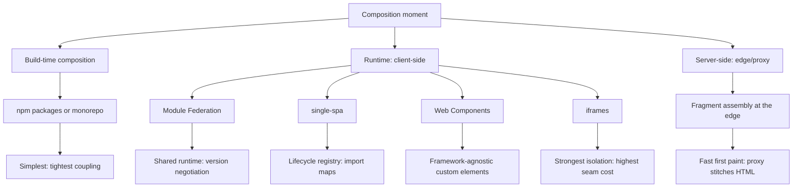
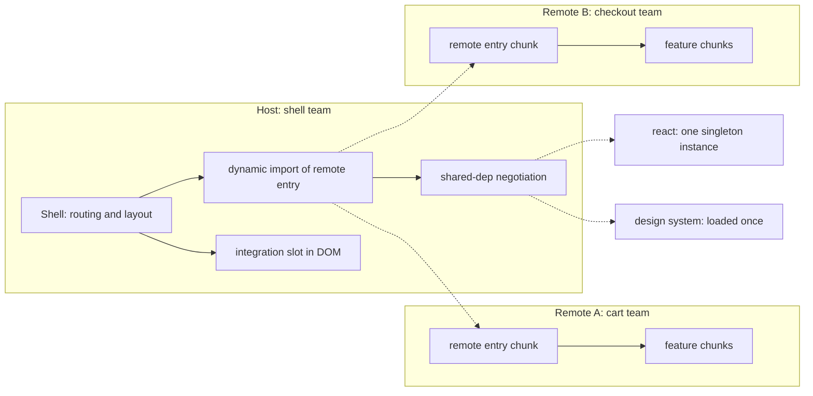

# Micro-Frontends: Integration Patterns and Costs

## Overview

Micro-frontends apply the strategic goal of microservices — independently deployable units owned end-to-end by autonomous teams — to the browser, by decomposing a web application into fragments that different teams build, test, and ship on their own cadence. The hard part is never the decomposition; it is the integration: choosing where fragments compose (build time, in the browser, or at the edge), and paying the isolation, performance, and coordination costs each choice imposes. This page owns the multi-team decomposition problem and assumes you already know the single-app material in [Frontend Engineering Deep Dive](./frontend-engineering.md), bundle-level lazy loading in [Code Splitting](../web-development/code-splitting.md), and rendering strategy trade-offs in [SSR, CSR, and SSG](./ssr-csr-ssg.md). Cross-fragment state contracts extend the in-app patterns from [State Management](./state-management.md), and shared runtimes lean on the component model described in [React](./react.md). The recurring theme: every integration pattern is a different answer to "who is allowed to break whom, and when."

## The Problem: Release Trains, Not Just Code

A 30-engineer organization shipping one SPA has an org chart problem that no bundler can fix. Every feature queues on the same build, the same test suite, the same release train: a checkout experiment, a navigation redesign, and a legal-required cookie banner all wait for one deployment window, and one bad merge rolls everyone back. At that scale, deployment frequency is bounded by coordination cost, not by engineering effort — the bottleneck has moved from code to coupling.

Conway's law predicts the failure: teams mirror the communication structure of the architecture, and a monolithic frontend forces every UI decision through one communication hub. The micro-frontend response is to design the architecture from the org chart instead — **vertical slices**: each team owns a customer journey (browse, cart, checkout, account) end-to-end, including the UI, its BFF/API, data stores, and the deploy pipeline. Backend teams already work this way; the frontend is the last layer forced into a shared release artifact.

**Independent deployability** for a frontend means: a team can move a change to production — new component, dependency upgrade, or route — without coordinating with, redeploying, or even notifying any other team. That definition has teeth: it requires stable contracts (URLs, events, public module interfaces), no shared build artifacts, and tolerance for version skew, because "independent" guarantees nothing about what version of everything else is live when you deploy.

## Integration Pattern Taxonomy

Patterns divide by the moment and the place of composition: build time (one artifact), runtime client-side (many artifacts, one browser), or server-side (many artifacts, stitched into one HTML response at the proxy/edge). Each trades off JS/CSS isolation, user-visible seam risk, runtime performance cost, and team autonomy.



### Build-Time Composition

The fragments are npm packages consumed by a single host (or a monorepo with workspace tooling), so composition happens in the bundler and ships as one bundle. This is the lowest-cost option and the one to default to: one runtime, one deploy, zero seam. Its failure mode is autonomy — because consumers re-bundle at their own release, a shared-package update only reaches production when every consuming team ships, so release trains silently return. Pick it when teams want shared code hygiene more than independent deployment; treat it as "modular monolith frontend," not micro-frontends.

### Module Federation

Webpack 5 and Rspack let a **host** load code from independently built and deployed **remotes** at runtime. Each remote is a container exposing named modules through a small eagerly-loaded entry chunk; the host imports remote modules dynamically (route-based or on demand) via its bundler's module-loading machinery. The headline feature is **shared dependencies with version negotiation**: host and remotes declare, e.g., `react` as a `shared` singleton with a semver range; at runtime the highest compatible version present wins, missing versions fall back to loading the remote's own copy, and `eager: true` inlines a shared lib into the initial chunk to avoid a loading round-trip for first paint. The split to internalize: the remote *entry* is what must be discoverable and stable; the *feature chunks* behind it stay free to change. Get the singleton config wrong and you pay the classic tax — two Reacts on the page, broken hooks, doubled bundle.

The shared-dependency declaration is the cross-team contract, in both host and remote builds:

```javascript
// Both host and remote webpack.config.js
new ModuleFederationPlugin({
  name: 'checkout',                      // remote name; host is 'shell'
  exposes: { './CheckoutPage': './src/CheckoutPage' },
  shared: {
    react:   { singleton: true, requiredVersion: '^18.2.0' },
    'react-dom': { singleton: true, requiredVersion: '^18.2.0' },
    'design-system': { singleton: true, requiredVersion: '^3.0.0' },
    lodash:  { import: false },           // never share: duplicate freely
  },
})
```

`singleton: true` forbids the fallback copy — if the negotiated version is incompatible, the app errors instead of silently loading a second React, which is usually the right failure mode. `requiredVersion` is a *promise to other teams*, so it belongs in code review, not in a config nobody reads.



### single-spa

single-spa is a runtime registry, not a bundler feature: you register applications, each exporting framework-level lifecycles — `bootstrap`, `mount`, `unmount` — plus an `activity` function mapping URL prefixes to apps. The shell mounts and unmounts applications as the URL changes, so teams can mix React, Vue, and Angular on one page. **Import maps** (a browser standard, polyfilled elsewhere) provide URL indirection: code references the bare specifier `@cart/app`, and the map resolves it to a deployable URL — repointing the map is a deploy of a JSON file, not a rebuild of the shell. **Parcels** embed an application inside another application without routing, for framework-agnostic composition of widgets. The cost: lifecycle discipline (every app must clean up after itself on unmount) and CSS/state conventions, since single-spa isolates nothing for you.

```javascript
// Shell registration + import map indirection
const cartApp = registerApplication({
  name: '@cart/app',
  app: () => System.import('@cart/app'),   // resolved via import map
  activeWhen: ['/cart'],                   // URL-prefix ownership
  customProps: { authToken: () => getAuth() },
})

// import map — deployed independently of the shell:
// { "imports": { "@cart/app": "https://cdn.example/cart/app-4f2a9c.js" } }
```

### Web Components

Custom elements (`customElements.define`) are a browser-native contract: the fragment's public API is an HTML tag plus attributes, events, and slots — no framework required on the consumer side. **Shadow DOM** gives style encapsulation: the fragment's CSS cannot leak out, and page CSS cannot leak in, which is exactly the isolation boundary fragments want. The trade-off is the **DOM-as-integration-zone** question: shadow DOM isolation also blocks global design-system styling, theming via plain selectors, and some accessibility tooling, so many teams use light-DOM custom elements (integration through the ordinary DOM) and accept that they must enforce CSS discipline by convention (prefixes, scoping) instead of getting it from the platform. Choose this when consumers span frameworks or when you want a contract that outlives any single framework's lifecycle.

```javascript
class CartBadge extends HTMLElement {
  connectedCallback() {
    this.attachShadow({ mode: 'open' })          // style isolation boundary
      .innerHTML = `<style>:host { display: inline-block }</style>
                    <span part="badge">${this.getAttribute('count') ?? 0}</span>`
    this._onChange = (e) =>                       // domain-event contract
      (this.shadowRoot.querySelector('span').textContent = e.detail.count)
    window.addEventListener('cart:item-added', this._onChange)
  }
  disconnectedCallback() { window.removeEventListener('cart:item-added', this._onChange) }
}
customElements.define('cart-badge', CartBadge)
```

The tag, attributes, and events are the entire API: a Vue host and a React host consume the same element unchanged. Note the cleanup discipline — a fragment that leaks listeners after unmount corrupts every page it ever touched.

### iframes

The iframe is the strongest isolation boundary the browser offers: separate documents, separate JavaScript contexts, separate CSS, and (with partitioning) separate storage and cookies. Teams genuinely cannot break each other. The historical baggage is the seam: routing state must be synced across document boundaries, the parent cannot auto-size to content without `postMessage` round-trips, modals and popups are confined to the iframe viewport, and deep linking needs explicit cooperation. Modern patterns rehabilitate it: treat the iframe as an untrusted remote app and build a small **postMessage RPC layer** (typed requests, response correlation, resize/auth handshake), or wrap an iframe in a custom element so consumers see a clean tag. Pick iframes when embedding third-party or untrusted code where the isolation requirement dominates the UX cost — inside first-party products, Module Federation or single-spa usually wins.

### Server-Side Composition

The oldest pattern, revived: a proxy, edge worker, or CDN assembles the page from HTML fragments. The idea is ESI (Edge Side Includes) — markup like `<esi:include src="...">` that the edge resolves — but modern implementations use reverse proxies (nginx SSI), edge functions, or Tailcall-style transclusion at the CDN. Each fragment is served by its owning team, cached with its own TTL, and stitched into one streamed HTML response; the browser sees a single page with no client-side composition runtime at all. First paint is excellent because composition happens before the response is sent, and a slow fragment (recommendations) can be streamed last without blocking the shell. The costs are edge-infrastructure complexity and the fact that client-side interactivity still needs hydration per fragment.

### Choosing a Pattern

| Pattern | JS/CSS isolation | UX seam risk | Runtime perf cost | Team autonomy | Complexity |
|---|---|---|---|---|---|
| Build-time (npm/monorepo) | None — one bundle | None | Lowest — single bundle | Low — release trains | Low |
| Module Federation | Weak — shared DOM, negotiated singletons | Low | Moderate — negotiation, fallback loads | High — independent remote deploys | High — build config, shared deps |
| single-spa | Weak — DOM shared, CSS by convention | Low–moderate | Moderate — multi-framework runtimes | High | High — registry, import-map discipline |
| Web Components | Style isolation via shadow DOM; JS shared | Low | Low–moderate — shadow reflows, boilerplate | Medium–high | Medium |
| iframe | Strongest — JS/CSS/storage partitioned | High — routing, resize, popups | High — extra documents and loads | Highest | Medium — RPC protocol |
| Server-side fragments | Per-fragment builds; client leaks possible | Low if CSS scoped | Low TTFB penalty; per-fragment hydration | High | High — edge/proxy infra |

## Routing and Nesting

The URL is the primary contract between fragments, so route ownership must be as explicit as API ownership. Top-level routes (`/cart/*` → cart fragment) are assigned in one place — a route table in the shell, an import-map-backed registry, or single-spa activity functions — and each fragment owns everything below its prefix. Conflicts are org bugs made visible: two teams claiming `/settings/*` means the decomposition is wrong, and the fix is a conversation, not a router hack.

**Nested routers** are the hard case: the shell owns segment one; the fragment owns everything below it. Both ends of the boundary must agree on how parameters flow down and how the fragment announces a URL change upward (a `navigate` event, or a history API wrapper injected by the shell). The fragment's internal router must be configured to treat its mount point as the base — React Router's `basename`, Vue Router's `base` — or deep links will resolve relative to the shell's root and 404.

Deep-link and back-button correctness is what separates a real integration from a demo: any composed URL must render correctly on a cold load, with only the fragment for that route fetched, and browser history must interleave shell-level and fragment-level navigations coherently. Fragments that push their own history entries (tabs, wizards) must do so through the shared history integration, not raw `history.pushState` with ad-hoc paths, or back-button behavior becomes order-dependent.

A typical ownership table lives with the shell and reads like infrastructure, not code:

```javascript
const ROUTES = [                 // one line per team-owned prefix
  { prefix: '/browse',  fragment: 'browse@stable'  },  // discovery team
  { prefix: '/cart',    fragment: 'cart@stable'    },  // cart team
  { prefix: '/checkout',fragment: 'checkout@canary' },  // checkout team
]
```

Cross-fragment navigation without a full reload — clicking a cart link rendered by one fragment that mounts a fragment owned by another team — is the payoff of runtime composition. Intercept links, resolve the target route to the owning fragment, load and mount it, and unmount the old one. Always keep the fallback: if the fragment fails to load, a full-page navigation to the same URL is a graceful degradation, not a failure.

## Shared State and Events

The rule is: **no global store across team boundaries**. A shared Redux/React-Context tree couples every fragment's types, middleware, and update timing to every other's, which reintroduces the deploy-order coordination micro-frontends exist to remove. Store state is an implementation detail of a fragment; anything crossing a boundary becomes a published contract.

Contracts between fragments are **domain events** — `CustomEvent` on a well-known DOM target, or a tiny pub-sub bus — with typed, versioned payloads: `cart:item-added`, `auth:session-refreshed`. The **owner-writes-others-read** rule keeps this sane: exactly one fragment (the one owning the domain, e.g., cart) writes a given piece of state; other fragments react to events or read through a narrow, versioned facade. Two fragments both writing session data is a design smell that will produce heisenbugs under skew.

Authentication and session sharing deserve special care because every fragment needs credentials but must not each implement refresh. The simplest correct design is a **domain-scoped cookie** (`Domain=.shop.example`): the browser attaches it to every fragment's same-site API calls, and there is exactly one auth owner. With bearer tokens, one fragment (or the shell) owns refresh with single-flight semantics — concurrent 401s across fragments must trigger *one* refresh, then fan out the new token (event: `auth:token-refreshed`) so sibling fragments retry. Uncoordinated refreshes cause token-family invalidation loops with rotating refresh tokens.

```javascript
// Owner-writes-others-read: cart announces; badge reacts — never the reverse
// cart fragment (writer):
dispatchEvent(new CustomEvent('cart:item-added', {
  detail: { count: cart.items.length, version: 2 },   // payload is schema'd
}))
// cart-badge fragment (reader):
window.addEventListener('cart:item-added', (e) => renderCount(e.detail.count))
```

## Design Systems and Dependency Sharing

Shared code is a spectrum from **duplicate everything** (every fragment bundles its own React, its own buttons: maximal autonomy, minimal coordination, up to 2–3× duplicated JS and visual drift) to **share everything as singletons** (minimal bytes, but every consumer is coupled to the library's release cadence — release trains again). Real deployments pick deliberately per dependency: framework runtimes and the design system as negotiated singletons; utility libraries duplicated without guilt; domain types published as versioned packages or generated from schemas.

A shared component library is a product with versions: publish semver'd releases, support N and N−1 simultaneously, give breaking-change deprecation windows, and let fragments upgrade on their own schedule. The version-negotiation layer (Module Federation `shared`, import maps) then tolerates fragments temporarily on different majors — or fails loudly in contract tests, which is the point.

Singleton footguns are concrete: **two Reacts on the page** (each bundle ships its own copy) breaks hooks across the boundary — context does not cross, `useState` in a host-rendered tree calling into a remote-rendered tree throws "invalid hook call" — and doubles bundle size. **Conflicting CSS resets** are the same bug in a different layer: one fragment's `preflight`, another's `normalize`, a third's `.container { max-width: 960px }` on a bare element selector; the last fragment loaded wins the cascade.

CSS isolation techniques, strongest first: **shadow DOM** (platform-enforced, but blocks global theming), **CSS Modules / scoped hashing** (build-time uniqueness, no runtime cost, requires bundler per fragment), **prefix conventions** (`.mf-cart-` class prefixes, enforced by stylelint — cheap, relies on discipline). Watch the **cascade leaks**: inherited properties (`font`, `color`, `line-height`), bare-element selectors, `* { box-sizing }`, and `!important` wars. Inherited properties pierce shadow DOM, so even "isolated" fragments need an explicit, owned set of tokens (CSS custom properties) as the styling contract.

## Performance Costs

The first cost is **bundle duplication versus shared-chunk negotiation**. Without sharing, N fragments each shipping React and the design system multiply baseline JS; with Module Federation shared deps, the runtime deduplicates — but pays for it in negotiation logic, a risk of loading fallback copies when versions do not line up, and a `shared` config that is itself a cross-team contract to maintain. Neither option is free: measure the composed page's JS bytes against the single-app baseline before adopting, not after.

The second cost is the **fragment waterfall**. A cold route load in a composed app chains: resolve route → fetch manifest/import map → fetch remote entry → negotiate shared deps → fetch feature chunk(s) → parse and evaluate → render → hydrate. Each hop adds latency on mobile networks. Mitigations, in rough order of payoff: prefetch likely fragments (on route hover, on idle via `requestIdleCallback`, or eager-load the highest-traffic fragment), serve the manifest and remote entries from a CDN with long-lived immutable caching, and **SSR the fragments** so the shell streams composed HTML and hydration — not composition — is the first client work.

Hydration overhead multiplies per fragment: three fragments on a page each pay their own hydration tax (re-executing component code, replaying state, binding listeners), serially competing for the main thread, so time-to-interactive for a composed page can be worse than an equivalent single app. Budget accordingly: set **TTFB and LCP budgets for the composed page** as a whole, attribute per-fragment via performance marks the shell collects, and gate deploys on those budgets. The honest summary: micro-frontends almost always cost more client-side performance than the single app they replace; the purchase is autonomy, and the price must be measured and declared.

## Version Skew and Deployment Independence

Independent deployment guarantees skew: the checkout remote may deploy hourly while the host ships weekly, and any user session can mix versions of shell, fragments, and negotiated singletons. This **version skew tax** shows up as nondeterminism — the "highest version wins" shared-dep negotiation means the effective React version on a page depends on which fragments loaded, in which order, in that session — and as bugs that only reproduce in production, because no local environment runs the exact matrix of live versions.

Dependency policy is the first lever: **semver ranges + per-fragment lockfiles** favor freshness (fragments pick up patched shared deps without coordination) at the cost of reproducibility; **strict pins** favor reproducibility but force coordination — the release train returns through the back door. Most organizations land between: ranges for patch/minor on shared singletons, locks within a fragment's own build.

**Contract tests** are what make skew survivable: consumer-driven tests where the host asserts against each remote's published interface (exposed module signatures, custom-event names and payload schemas, route prefixes), run in CI by both sides so a breaking change fails the *producer's* pipeline, not the user's session. Schema the event payloads (JSON Schema/OpenAPI) rather than trusting TypeScript types, which do not survive independent builds.

**Canary a single fragment** to make deployment independence real: the manifest/registry service maps `checkout@stable` and `checkout@canary`, and the shell resolves a percentage of sessions — or a header, or an internal-user flag — to the canary. Rollback is repointing a manifest entry, with no shell redeploy. This is progressive delivery ([Canary Releases](../sre/canary-releases.md)) applied per fragment, and it is the strongest argument for a registry-service layer over hardcoded remote URLs baked into host builds.

## When NOT to Use Micro-Frontends

The anti-pattern section, because interviews increasingly test whether you will argue *against* the buzzword. Do not adopt micro-frontends when: the organization is one or a few teams (the coordination cost you are paying down does not exist); the product has **one design language and a tight surface** (a single app with good module boundaries is strictly simpler); or the motivation is technological rather than organizational ("microservices worked for our backend" is an org claim, not a frontend one — if the backend teams are shared, fragments buy nothing).

The tax is real and paid in three currencies. **Performance**: duplicated or negotiated bundles, per-fragment hydration, waterfall loading — Section "Performance Costs" costs, on every page. **Complexity**: N build pipelines, a registry service, version negotiation, contract test infrastructure, on-call runbooks per fragment. **Debugging**: a stack trace crossing a fragment boundary spans two build systems and two versions of React; reproducing a production version matrix locally is its own project. Teams routinely underestimate the second and third and discover them after the migration.

The sound default is **start modular, split when org pain appears**: enforce module boundaries, lazy loading, and clear ownership *inside* one app (Code Splitting covers the mechanics), and extract a fragment only when two teams demonstrably fight over the same deploy queue or the same directory. Extraction is then a mechanical refactor of an existing boundary — not a discovery expedition through someone else's state management. If you cannot name the two teams whose coordination you are buying down, you are not ready.

## Org Mechanics: Platform Teams and Paved Roads

Micro-frontends do not reduce total work; they move it into a **platform team** whose job is the paved road: a scaffold CLI (new fragment boots with the standard bundler config, test harness, and CI template in minutes), golden CI pipelines with per-fragment performance budgets, shared tooling for the event bus and auth facade, and the integration pattern itself (the Module Federation config or single-spa registration) packaged so product teams never hand-roll it. The platform team runs the road; product teams drive their own vehicles — if product teams must ask the platform team for permission to deploy, independence is fiction.

The linchpin service is the **module registry / manifest service**: an authoritative mapping from fragment name and channel (`checkout@stable`) to deployable artifact URL, version, and metadata. It is what makes import maps dynamic, enables canary and rollback without host redeploys, and provides the audit trail ("which fragment version was serving at 14:03"). Hardcoding remote URLs into host builds quietly re-couples releases and defeats the entire point; the registry is cheap and the coupling is expensive.

Migration follows the **strangler-fig** pattern at the UI layer ([Strangler Fig](../backend/patterns/strangler-fig.md)): stand up a thin shell (routing, auth, layout), then move the legacy SPA's surface into fragments route-by-route — `/cart` first, verified, then `/checkout` — with the legacy app still serving un-migrated routes under the same shell. Each extraction is independently shippable and reversible; the legacy app shrinks until it can be deleted. Never big-bang: a rewrite that requires the whole UI to change at once has recreated the release train you were escaping, with a migration on top.

## Interview Questions

**Q1: What problem do micro-frontends solve, and what problem do they not solve?**
A: They solve organizational scaling — N teams needing independent deploy cadences on one product surface — not technical problems; a single well-modularized app is simpler and faster for a small team. The litmus test is deploy-coupling pain: if teams block each other's releases, decomposition pays; if they don't, you are buying cost with no benefit. Say this explicitly in interviews — arguing against the buzzword when the org pain is absent reads as seniority.

**Q2: Compare build-time, client-side runtime, and server-side composition.**
A: Build-time (npm packages/monorepo) composes in the bundler: simplest runtime, but consumers re-bundle, so release trains return. Client-side runtime (Module Federation, single-spa, Web Components, iframes) composes in the browser: real deploy independence, paid for in bundle negotiation, hydration, and seam management. Server-side composition stitches fragment HTML at the proxy/edge: best first paint and per-fragment caching, paid for in edge infrastructure, with per-fragment hydration still due on the client.

**Q3: How does Module Federation's shared-dependency negotiation work, and what breaks if you misconfigure it?**
A: Host and remotes declare shared libraries with semver ranges and `singleton` flags; at runtime, the highest compatible loaded version wins, a remote without a compatible version loads its own fallback copy, and `eager: true` inlines a shared lib to avoid a pre-paint round-trip. Misconfiguration means two Reacts on the page — hooks throw across the boundary, context doesn't cross, and the bundle roughly doubles. The fix is treating the shared config as a versioned contract covered by contract tests, not copy-pasted build config.

**Q4: What is single-spa's model, and how do import maps help deployment independence?**
A: single-spa registers applications that export `bootstrap`, `mount`, and `unmount` lifecycles plus an activity function mapping URL to app; the shell mounts/unmounts them as the route changes, and parcels allow framework-agnostic app-within-app embedding. Import maps decouple bare specifiers like `@cart/app` from artifact URLs, so redeploying a fragment means updating a JSON mapping rather than rebuilding the shell. That indirection is what makes rollback and canary a config change.

**Q5: Why are iframes the strongest isolation boundary, and why do teams still avoid them internally?**
A: An iframe is a separate document with its own JavaScript context, CSS scope, and storage — fragments literally cannot interfere. The costs are the seam: routing and history must be synced across documents, the parent cannot auto-size without `postMessage`, and modals/popups are confined to the iframe viewport. Internally, weaker isolation with a better seam (Module Federation or single-spa) usually wins; iframes are the right call for untrusted or third-party embeds.

**Q6: How do you share state between fragments without creating a global store?**
A: Publish domain events (`CustomEvent` or a small pub-sub bus) with typed, versioned payloads, and enforce the owner-writes-others-read rule: the fragment owning the domain is the only writer of that state, and others subscribe or read via a narrow facade. A shared Redux tree would couple every fragment's types and deploy order, reintroducing the coordination you decomposed to escape. Authentication is the special case: one owner refreshes tokens with single-flight semantics and broadcasts `auth:session-refreshed`.

**Q7: What is the version skew tax and how do you pay it down?**
A: Independent deploys mean users can run any mix of host, fragment, and negotiated singleton versions, so behavior becomes session-dependent — the "highest version wins" negotiation makes the effective React version depend on load order. Mitigations: semver ranges with lockfiles as deliberate policy, consumer-driven contract tests failing the producer's CI, JSON-Schema'd event payloads instead of TypeScript types, and per-fragment canaries via the manifest service. You don't eliminate skew; you make it survivable and observable.

**Q8: What performance costs should you budget for before adopting micro-frontends?**
A: Bundle duplication or negotiation overhead (shared singletons trade bytes for runtime logic), the cold-load waterfall (route → manifest → remote entry → chunks → render), and multiplied hydration — each fragment re-executes and binds on the main thread, so a three-fragment page can hydrate slower than the equivalent single app. Set TTFB/LCP budgets on the *composed* page, attribute per fragment with performance marks, and prefetch manifests and high-traffic fragments. Measure against the single-app baseline before committing.

**Q9: How would you migrate a monolithic SPA to micro-frontends without a big-bang rewrite?**
A: Strangler-fig at the UI layer: deploy a thin shell owning routing, auth, and layout, then extract fragments route-by-route — the legacy app keeps serving un-migrated routes under the same shell, and each extraction ships and can be rolled back independently. Sequence by team value (the route with the most deploy contention first), not by architectural elegance. The migration ends when the legacy app is small enough to delete, not when a replatform banner ships.

**Q10: A team asks to split their feature into a micro-frontend "for scalability." What do you ask?**
A: Scalability of what — the real question is whether two or more teams deploy-block each other today; one team on one fragment gains nothing but pays the tax. Ask who owns the routes, the shared dependencies, and the event contracts, and whether the platform (registry, CI scaffold, contract testing) exists to support them. If the answers are "no org pain, no platform," recommend modular boundaries plus code splitting inside the single app and revisit when the pain is real.

## Key Takeaways

- Micro-frontends solve the organizational bottleneck — deploy-coupling between teams — not a technical one; the integration pattern is the product, and every pattern is a different isolation/autonomy/perf trade.
- Composition moment determines the trade: build-time (simplest, release trains), client-side runtime (true independence, negotiation and hydration costs), server-side edge assembly (best first paint, most infrastructure).
- Module Federation = shared singletons with version negotiation; single-spa = lifecycle registry + import maps; Web Components = framework-agnostic contract with shadow-DOM isolation; iframes = strongest isolation, worst seam; pick by isolation need versus seam tolerance.
- The URL is the cross-team contract: explicit route ownership, `basename`-aware nested routers, cold-load deep links, and coherent back-button history across fragments.
- No global store: domain events with typed payloads, owner-writes-others-read, single-flight token refresh owned by exactly one fragment.
- Shared singletons are contracts, not config: two Reacts and conflicting CSS resets are the canonical failures; style isolation runs shadow DOM → CSS Modules → prefix conventions, with CSS custom properties as the theming contract.
- The version skew tax is permanent: budget semver policy, consumer-driven contract tests, and per-fragment canary/rollback through a manifest registry service.
- Default to modular monolith; extract fragments only when deploy-coupling pain between real teams appears — and be ready to argue this in interviews.

## Cross-References

- [Frontend Engineering Deep Dive](./frontend-engineering.md) — general frontend architecture and build pipeline
- [SSR, CSR, and SSG](./ssr-csr-ssg.md) — rendering strategies fragments compose into
- [State Management](./state-management.md) — in-app state patterns; micro-frontends add cross-app contracts
- [React](./react.md) — component model shared via singletons or duplicated
- [Frontend Testing](./testing.md) — contract and E2E testing between fragments
- [Code Splitting](../web-development/code-splitting.md) — bundle-level lazy loading within one app
- [Team Dynamics](../software-engineering/team-dynamics.md) — the org design that motivates the split
- [Strangler Fig](../backend/patterns/strangler-fig.md) — incremental migration pattern applied at the UI layer

## References

- [Cam Jackson — Micro Frontends (martinfowler.com)](https://martinfowler.com/articles/micro-frontends.html)
- [micro-frontends.org — demo site](https://micro-frontends.org/)
- [Module Federation — documentation](https://module-federation.io/)
- [single-spa — documentation](https://single-spa.js.org/)
- [Webpack — Module Federation concept docs](https://webpack.js.org/concepts/module-federation/)
