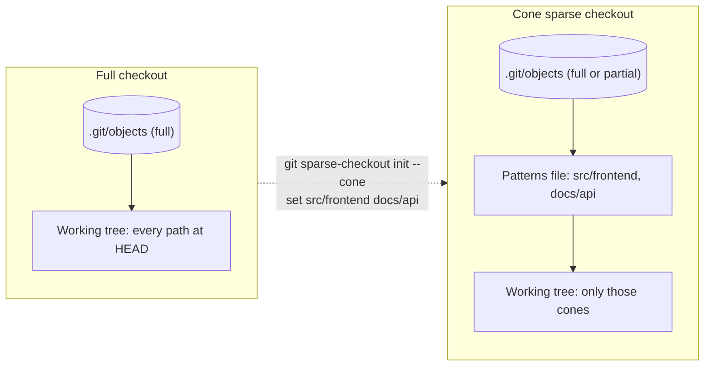
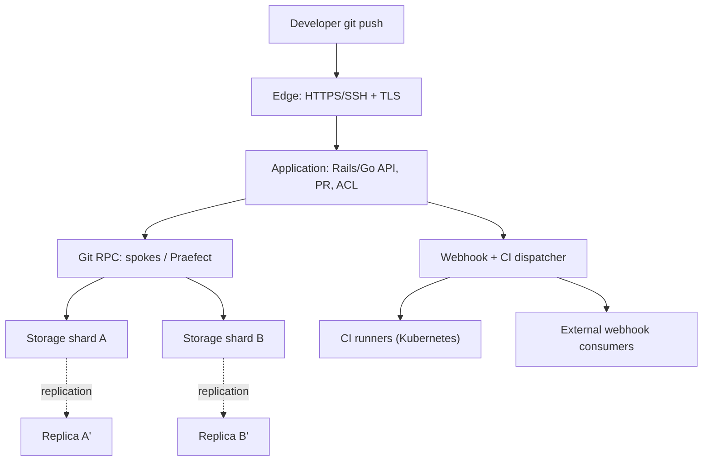
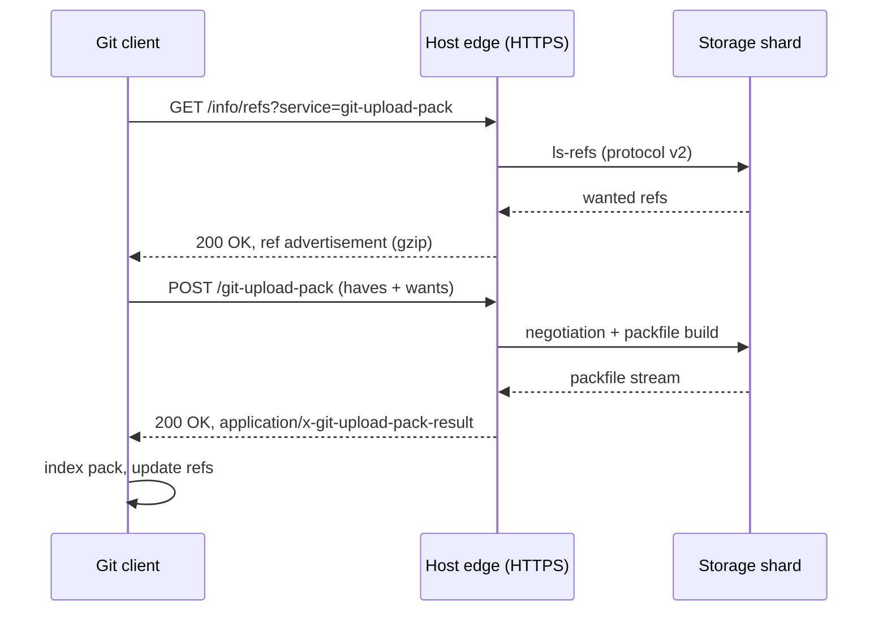

# Sparse Checkout & Git Hosting Architecture

Two §14 topics that close the loop on Git internals are **sparse checkout** (a client-side working-tree filter introduced as a first-class command in Git 2.25, January 2020) and **Git hosting architecture** (the server-side stack that turns a content-addressable object store into a collaborative platform like GitHub, GitLab, or Gitea). The first halves the cost of working inside a monorepo by materializing only the directories you actively edit; the second explains how a single `git push` is fanned out across frontends, storage shards, build agents, and webhook consumers. Both are frequently probed in senior infrastructure interviews because they sit at the intersection of developer experience, filesystem performance, and distributed-systems scaling. This page ties them together and cross-references [`./internals.md`](./internals.md) for the object model, [`./workflows.md`](./workflows.md) for branching strategy, [`./github.md`](./github.md) for PR review etiquette, and [`../backend/containers/kubernetes.md`](../backend/containers/kubernetes.md) for the CI substrate that hosts typically invoke.

## Part 1 — Sparse Checkout

Sparse checkout is the client-side half of Git's answer to the monorepo scale problem. Where [`./worktrees-submodules.md`](./worktrees-submodules.md) covers *additional* working directories and *external* repositories, sparse checkout covers *subsets* of a single repository — same `.git`, same refs, smaller working tree. The feature existed as an experimental `core.sparseCheckout` flag for years before the Git 2.25 release (January 2020) promoted it to a first-class porcelain (`git sparse-checkout init/set/add`) with a sane default mode and discoverable error messages. The sections below walk through the motivation, the cone-vs-non-cone design choice, the patterns file and its lifecycle, the interaction with partial clone and shallow clone, and the operational gotchas that bite in production.

### Motivation and Use Cases

A full clone materializes every file at `HEAD` on disk, even paths the developer will never touch. For a typical web service that is a non-issue; for a monorepo holding tens of thousands of packages, generated assets, and vendored third-party trees, the working tree alone can balloon past 10 GB and take minutes to populate on a cold cache. Sparse checkout solves this by letting the working tree contain **only a subset of paths** while the `.git` object database still references the full repository. The canonical use cases, drawn from the `git-sparse-checkout` manual and the Git 2.25 release notes, are: (1) monorepo navigation where a developer only needs the team's package; (2) partial clones combined with `--filter=blob:none` so that even the packfiles fetched are minimal; (3) build systems and CI runners that only need a slice of the tree to compile a single target; (4) vendoring scenarios where you import a subtree of an upstream project without pulling its tests and fixtures. Software Engineering at Google (Titus Winters et al.) devotes a chapter to this exact pattern: Piper, Google's monorepo, exposes a "client" view conceptually equivalent to a sparse checkout, and the open-source world approximates it with `git sparse-checkout`. The payoff is measurable — IDE indexing, `git status`, and filesystem antivirus scans all scale linearly with the number of in-tree files, so shrinking the tree shrinks the latency of every common Git operation.

### Cone Mode vs Non-Cone Mode

Git 2.25 stabilized the `git sparse-checkout` porcelain and shipped **cone mode** as the default. Cone mode restricts patterns to directory prefixes, which lets Git emit a single recursive tree walk during `git status` instead of per-file `lstat` calls across the whole index. The older **non-cone mode** accepts arbitrary gitignore-style globs but loses this optimization because Git must test every tracked path against every pattern. The trade-off is expressiveness versus performance: cone mode handles 95% of real workflows (give me `src/foo` and `docs/api`), while non-cone is the escape hatch for "everything except `*.pdf`". The table below captures the operational differences.

| Aspect | Cone mode (default) | Non-cone mode (`--no-cone`) |
|---|---|---|
| Pattern grammar | Directory prefixes only, with `/*` wildcards | Full gitignore-style globs |
| `git status` cost | O(cone size) — skips trees outside cones | O(index × patterns) |
| Pattern file shape | One path per line, recursive by default | Negations `!path`, `**`, character classes |
| Recommended for | Monorepo package slices, CI | Selective vendoring, exotic filters |
|Introduced | Git 2.25 (Jan 2020) | Predates 2.25, retained for compatibility |

Cone mode is what every fresh `git sparse-checkout init` produces; you opt out explicitly. Inside a cone, the patterns file lists parent directories and Git treats each as "include this directory and everything beneath it", which is exactly how most teams mentally model their checkout anyway. A useful diagnostic is to inspect the generated patterns file after a `set`:

```bash
$ git sparse-checkout set src/frontend docs/api
$ cat .git/info/sparse-checkout
/*
!/*/
/src/
!/src/*/
/src/frontend/
/docs/
!/docs/*/
/docs/api/
```

The `/*` / `!/*/` pairs are cone-mode's way of saying "include the top-level files but exclude the top-level directories, then re-include the specific cones". Editing this file by hand is supported but fragile — prefer the porcelain subcommands, and reach for `git sparse-checkout reapply` after any manual edit so the working tree is re-materialized consistently.

### The Patterns File and Workflow

Sparse state lives in two files: `.git/info/sparse-checkout` (the patterns) and the `core.sparseCheckout` and `core.sparseCheckoutCone` config keys. The porcelain never edits `.gitignore` — sparse patterns are a working-tree filter, not a content filter, so ignored and sparse are orthogonal concepts. A typical session looks like the following snippet, which mirrors the example in the `git-sparse-checkout` man page.

```bash
# Enable sparse checkout with cone mode (default in Git >= 2.27)
git sparse-checkout init --cone

# Define the cones you want on disk (parent dirs are auto-included)
git sparse-checkout set src/frontend src/api docs/api

# Add a directory without disturbing existing cones
git sparse-checkout add tools/bazel

# Reapply patterns after manually editing .git/info/sparse-checkout
git sparse-checkout reapply

# Turn sparse mode off entirely (materialize the full tree)
git sparse-checkout disable
```

The `set` subcommand rewrites the patterns file atomically and updates the working tree in one pass; `add` merges a new cone without dropping the previous ones, which is important for developer ergonomics because a naive `set` would otherwise evict paths the user still wanted. The `reapply` subcommand is the recovery knob after a config drift, a botched manual edit, or a Git upgrade that changed cone-mode inferences. Under the hood, `init` flips `core.sparseCheckout=true`, writes an empty patterns file, and the next `git read-tree -mu HEAD` performs the actual materialization. Understanding this two-step — patterns file declares intent, `read-tree` enforces it — explains why changing patterns can rewrite large swaths of the working tree: it is a tree-walk delta, not a no-op config update.

### Visualizing the Working Tree

The diagram below contrasts a full checkout against a cone-mode sparse checkout that only materializes `src/frontend` and `docs/api`. The object database and refs are identical in both cases; only the working tree differs, which is why switching cones is fast (no network) but does churn inodes. This is the crucial mental model: sparse checkout is a *filter* applied at `read-tree` time, not a separate copy of the data. A developer can flip between cone configurations in seconds, pay only the local filesystem cost of materializing or evicting inodes, and never touch the network. The trade-off is that the working tree is now a derived view, so any operation that expects a particular file to be on disk (an IDE's go-to-definition, a build script that walks the tree) must respect the current cone or trigger an explicit fetch.



The arrow from `Full` to `Sparse` is a local-only transition: no objects are added or removed from `.git/objects` unless you also run a partial-clone filter. The patterns file is the single source of truth that the index consults when deciding which entries to materialize as inodes on disk.

### Interaction with Partial Clone

Sparse checkout is purely a working-tree concern; **partial clone** (`--filter=blob:none`, `--filter:tree:0`, or `--filter=blob:limit=1m`) is its network-side counterpart. A partial clone omits objects at fetch time and uses a **promisor remote** to fetch them lazily when a command such as `git checkout` or `git cat-file` actually needs them. Combining the two yields the smallest possible on-disk footprint: the working tree only has the cones you edit, and the object database only has the blobs those cones reference. The Git blog post "Partial clones and sparse checkouts" (GitHub Engineering, 2017–2019) demonstrates a Linux-kernel repo shrinking from ~3.5 GB to a few hundred MB. The interaction is not free, however: any operation that touches an out-of-cone path (a `git grep` across the tree, a `git log -- <path>` outside the cone) will trigger a network fetch against the promisor remote, which can stall a CI job that assumed local-only access. Production teams therefore pin partial clones behind a local cache or a fork and document which paths are "promised" so that developers are not surprised by latency spikes.

### Shallow + Sparse Combination

A third orthogonal axis is the **shallow clone** (`--depth N`), which truncates commit history. Stacking shallow + sparse + partial gives the trifecta of minimal clones: limited history, limited working tree, limited object database. This is exactly what large-scale CI providers (GitHub Actions, GitLab CI, Buildkite agents) do to shave minutes off cold cache misses. The combination is safe — each flag operates on a different axis (commits, paths, objects) — but it does constrain operations: shallow clones cannot push new branches back to a non-shallow remote without `--unshallow`, partial clones may stall on missing blobs, and sparse checkouts will rewrite the working tree whenever cones change. The recommended CI invocation is therefore:

```bash
git clone --depth 1 --filter=blob:none --sparse \
  --single-branch --branch main \
  https://github.com/org/monorepo.git
cd monorepo
git sparse-checkout set services/payments
```

This produces a working tree that contains exactly `services/payments` at the tip of `main`, with a near-empty object database and a one-commit history. For a checkout-heavy workload (build → test → discard), this is the cheapest possible local state.

### Comparison with Worktrees and Submodules

Sparse checkout is often confused with two adjacent features covered in [`./worktrees-submodules.md`](./worktrees-submodules.md). The table below disambiguates them so the right tool is picked for the right job. The short version: sparse is for *subsets of one repo*, worktrees are for *multiple branches of one repo*, and submodules are for *composing multiple repos*. The three features compose: a worktree can itself be sparse, and a sparse checkout can include the working directory of a submodule (though the submodule must be explicitly initialized after the cone is set).

| Feature | What it slices | Same `.git`? | Network fetch on switch? | Typical use |
|---|---|---|---|---|
| Sparse checkout | Paths within one branch | Yes | No (local only) | Monorepo package slice |
| Worktree | Branches, into separate dirs | Yes (shared object store) | No | Parallel branch work |
| Submodule | Entire external repos | No (nested `.git`) | Yes (per-submodule fetch) | Vendoring with history |

### Limitations and Gotchas

Sparse checkout is not a panacea and several sharp edges bite in production. First, **changing patterns rewrites the working tree**: a `git sparse-checkout set` that drops a cone will delete those files from disk without confirmation, and uncommitted changes in the dropped paths are preserved only in the index, not the working tree. Second, **`git status` in non-cone mode** regresses to O(index × patterns) and can be visibly slow on a million-file monorepo — always prefer cone mode unless you genuinely need glob negations. Third, **submodule interaction** is subtle: a sparse checkout does not auto-initialize submodules in the cones, so a CI job that forgets `git submodule update --init --recursive` after `set` will silently miss vendored code. Fourth, **IDE integrations** (VS Code, IntelliJ) historically assumed a full tree and reindexed aggressively when cones changed; modern versions detect `core.sparseCheckout` but the first reindex after a `set` is still expensive. Fifth, **`git stash` and `git worktree`** both honor sparse patterns, which is usually what you want but can surprise users who expect a worktree to be a clean slate. Finally, **merges and rebases** that touch out-of-cone paths will fetch the needed objects via the promisor remote in a partial clone, which can fail loudly if the remote is unreachable — pin your network dependencies before long-running merges.

A short checklist for production adoption: (1) start with cone mode and only escalate to non-cone if a real workflow demands it; (2) commit a checked-in `sparse-patterns` file so developers can reproduce a known cone; (3) document which paths are *promised* (omitted by `--filter=blob:none`) so CI does not trip on lazy fetches; (4) pin the Git version across CI runners — sparse-checkout semantics shifted between 2.25 and 2.27, and a version skew will surface as confusing pattern-file rewrites; (5) treat `git sparse-checkout disable` as the emergency escape hatch and audit who has run it on shared build agents.

## Part 2 — Git Hosting Architecture

If sparse checkout is the client-side answer to scale, **Git hosting architecture** is the server-side answer. The host is what stands between `git push origin dev` and a durable, replicated, reviewable artifact — and the engineering that goes into making that pipeline fast, reliable, and observable is substantial. The sections below trace the hosting models (SaaS vs self-hosted), the layered architecture (edge → application → RPC → storage → async), the storage strategies (flat on-disk, hashed shards, object storage), the transfer protocols (SSH, smart HTTP, protocol v2), the webhook/PR/CI fan-out, and the scaling and high-availability techniques that GitHub, GitLab, and Gitea actually deploy. Wherever useful, the page points back to [`./internals.md`](./internals.md) for the object model the storage tier persists.

### Hosting Models

A "Git host" is the service that terminates `git push`/`git pull` traffic, stores the bare repositories, and layers collaboration primitives on top: pull requests, code review, issue tracking, CI, and access control. The market splits cleanly into two models. **SaaS** offerings (GitHub.com, GitLab.com, Bitbucket Cloud) are multi-tenant, managed, and metered; you trade control for ops-free scaling. **Self-hosted** offerings (GitLab CE/EE, Gitea, Forgejo, GitHub Enterprise Server) run inside your VPC, integrate with on-prem identity providers, and satisfy data-residency or air-gapped constraints. A hybrid third model — **SaaS with self-hosted runners** (GitHub Actions self-hosted runners, GitLab Runners behind a NAT) — keeps the control plane in the cloud while pushing the data plane (build execution, container registry pulls) into your network. The choice is rarely binary: regulated industries run self-hosted for source-of-truth and SaaS for open-source mirrors; small teams start on SaaS and migrate inward only when audit costs force it. The table below summarizes the trade-offs.

| Platform | Model | Storage layer | Notable scaling primitive |
|---|---|---|---|
| GitHub.com | SaaS, multi-tenant | Hashed repo shards ("spokes") | Repositories are sharded across storage hosts |
| GitLab.com / self-managed | SaaS + self-hosted | Gitaly shards (virtual storage) | Gitaly cluster with Praefect proxy |
| Bitbucket Cloud | SaaS, multi-tenant | Elastic shard pool | Per-repo shard assignment |
| Gitea / Forgejo | Self-hosted, single-binary | Bare repos on local disk | Horizontal via mirrors, not native sharding |
| GitHub Enterprise Server | Self-hosted appliance | Bare repos on disk + replica | High-availability replica pair |

The platform choice cascades into everything else: which protocols are exposed, how webhooks are delivered, how CI is integrated, and how disaster recovery is run.

### Architecture Layers

Regardless of brand, a Git host stacks five layers. The **edge** terminates TLS and runs the web UI, REST/GraphQL API, and the Git smart HTTP/SSH endpoints. The **application** layer implements PRs, issues, permissions, and webhook fan-out, typically a Rails (GitHub, GitLab) or Go (Gitea) monolith backed by PostgreSQL and Redis. The **Git RPC** layer proxies Git protocol traffic to the storage tier — GitHub's "spokes" and GitLab's "Praefect → Gitaly" both fit here. The **storage** layer holds the bare repositories, either as plain on-disk `.git` directories or as hashed shards. The **async/CI** layer runs webhook delivery, scheduled jobs, and CI orchestration on a separate fleet of workers. The diagram shows how a single `git push` traverses these layers and triggers downstream effects.



Each layer can fail independently: the edge can rate-limit, the application can queue webhooks, the RPC layer can retry storage, and the storage layer can serve from a replica during a failover. The interview-ready insight is that **Git hosting is a fan-out system with strong consistency on the write path** (the push must durably land on a quorum of shards before the client sees `OK`) and **eventual consistency on the read path** (PR status, CI results, webhook deliveries are async). Designing the boundary between these two regimes is the core architectural problem. Concretely, the layers decompose as follows:

- **Edge** — TLS termination, smart-HTTP routing, SSH gateway, rate limiting.
- **Application** — Rails/Go monolith: PRs, issues, ACLs, webhooks, GraphQL/REST.
- **Git RPC** — spokes (GitHub) or Praefect→Gitaly (GitLab); proxies wire protocol to storage.
- **Storage** — bare repos on local disk, hashed shards, or object-storage-backed packs.
- **Async/CI** — webhook delivery, scheduled jobs, CI runner orchestration on a separate fleet.

Each layer is independently scalable and independently replaceable, which is why GitLab can swap its storage backend from local disk to a Gitaly cluster without touching the application layer.

### Repository Storage Strategies

The naive storage layout — one directory per repo under `/var/git/<owner>/<repo>.git` — works for thousands of repos but breaks down at millions because the filesystem cannot enumerate the directory tree in bounded time and inode exhaustion becomes real. Large hosts therefore use **hashed sharding**: the repository ID (or its SHA-1) is hashed, the first few hex characters select a shard, and the rest select a sub-directory. GitHub's "spokes" storage and GitLab's Gitaly cluster both follow this pattern. The trade-offs are captured below.

| Strategy | Layout | Pros | Cons |
|---|---|---|---|
| Flat on-disk | `/srv/git/<owner>/<repo>.git` | Simple, debuggable | O(n) directory scan; inode exhaustion |
| Hashed shard | `/srv/git/ab/cd/<repo-id>.git` | Bounded fan-out, even distribution | Repo movement requires rebalancing |
| Object storage (S3) | Packfiles as keys, no `.git` on disk | Elastic, cheap, durable | High latency, needs caching layer |
| Gitaly virtual storage | Logical name → physical shard | Transparent failover, replication | Adds RPC hop and operational complexity |
| Bundled archives | Snapshot tarballs per push | Trivial cold restore | Slow incremental fetch |

Hybrid strategies are common: GitHub stores packfiles on local NVMe for hot repos and ages cold repos to slower tiers; GitLab supports Gitaly backed by either local disk or, experimentally, object storage via the `gitaly-backup` mechanism. The design pressure is always the same — random I/O on small objects (ref updates, individual blob fetches) does not tolerate S3-class latency, so a local cache is mandatory.

### Git Transfer Protocols

Three protocols carry Git traffic today: **SSH** (the historical default, `git@github.com:org/repo.git`), **smart HTTP/HTTPS** (the web-era default, works through any corporate proxy), and **Git protocol v2 over SSH or HTTP** (the modern stateful protocol that reduces negotiation overhead). A fourth — the **dumb HTTP** protocol, which simply serves loose files over plain HTTP — is unsupported by every major host because it cannot enforce ACLs on a per-object basis. The comparison below is the standard interview answer for "how does Git talk to a server".

| Protocol | Transport | Auth | Stateful | Use case |
|---|---|---|---|---|
| SSH | TCP 22 | SSH keys / certs | Yes (long-lived channel) | Power-user push/pull |
| Smart HTTP | TCP 443 | Token / OAuth / basic | Yes (POST `git-upload-pack`) | Default for web, proxy-friendly |
| Git protocol v2 | SSH or HTTP | Same as carrier | Yes (per-command capability advert) | Modern clients, lower latency |
| Dumb HTTP | TCP 443 | None (or basic) | No | Legacy mirrors, read-only archives |

Protocol v2 (Git 2.18+, 2018) is the headline improvement: it replaces the implicit ref advertisement with an explicit `command=ls-refs` capability and lets the client request exactly the refs it needs, cutting the negotiation phase of a `git fetch` from seconds to milliseconds on repos with hundreds of thousands of refs. Hosts that have not yet enabled v2 are leaving easy latency wins on the table.

### Smart HTTP Protocol Flow

The smart HTTP protocol wraps the Git wire protocol inside two HTTP endpoints: `GET /info/refs?service=git-upload-pack` for the initial ref advertisement, and `POST /git-upload-pack` for the actual negotiation and packfile transfer. The flow below traces a `git fetch` over HTTPS, which is the most common path in CI because it traverses corporate proxies without special firewall rules. Two details matter for operations. First, the `POST` body is sent with `Content-Encoding: gzip`, which is mandatory for repos with large ref lists — without it, the negotiation bytes alone can exceed HTTP body size limits. Second, the host must stream the response back without buffering: a 5 GB packfile that gets buffered in the application layer will OOM the worker. Edge proxies (nginx, HAProxy, Envoy) need `proxy_buffering off` for the upload-pack endpoints, which is a recurring misconfiguration in self-hosted GitLab deployments.



A subtler operational concern is **timeouts**: a slow client on a flaky link can hold an upload-pack worker open for minutes, so hosts enforce per-stage deadlines (ref advertisement, negotiation, packfile stream) and reaping. Self-hosted deployments that proxy through a corporate TLS terminator often inherit that terminator's 60-second idle timeout, which is too short for large clones and produces mysterious 504s mid-transfer.

### Webhooks, PR/MR Flow, and CI Integration

A push does not end at the storage layer; the host must fan the event out to consumers. **Webhooks** are the universal integration primitive: the host POSTs a JSON payload describing the push (or PR event, tag creation, etc.) to a configured URL, retries with exponential backoff on non-2xx responses, and records delivery logs for debugging. **Server-side hooks** (the `pre-receive`, `update`, `post-receive` scripts documented in [`./hooks.md`](./hooks.md)) run synchronously inside the storage layer and can reject a push before it lands — useful for enforcing commit-message conventions or blocking force-pushes to protected branches. The **PR/MR review flow** is an application-layer state machine: push opens a PR, reviewers approve, CI runs against the merge commit, and the host enforces a merge gate. CI integration typically goes through either a hosted runner (GitHub Actions, GitLab CI) or an external system triggered by webhook (Jenkins, Buildkite, Tekton). The hosted-runner path is tighter — the host can stream logs back into the PR UI and block merge until green — while the webhook path is more flexible but requires the external system to call back the host's API to publish status. Either way, the architectural invariant is that **CI status is a first-class ref**: it is attached to the commit SHA and consulted by branch-protection rules at merge time, which means a flaky CI signal can block a release train as surely as a failing test.

### Scaling and Sharding

Scaling a Git host is dominated by two problems: hot repositories and fan-out writes. A single monorepo pushed to by thousands of engineers will saturate any single storage host, so the storage layer must shard and replicate. **GitHub's "spokes"** model (described in the GitHub Engineering blog "How GitHub Uses GitHub to Develop GitHub") stores each repo on three storage hosts chosen by hashing the repo ID; writes go to a primary and are synchronously replicated to two secondaries, with the RPC layer transparently failing over. **GitLab's Gitaly cluster** with the Praefect proxy achieves the same semantics through a "virtual storage" abstraction: the repo appears as one logical name, but Praefect routes writes to a primary and replicates to secondaries, while reads can fan out to any healthy replica. The sharding strategy must also handle **rebalancing** when a shard fills up — moving a live repo between shards without downtime is a multi-step dance:

1. Dual-write: route new pushes to both the old and new shard.
2. Backfill: copy historical objects from old to new.
3. Verify: run `git fsck` and ref-by-ref equality checks.
4. Cutover: atomically flip the routing entry.
5. Drain: stop writes to the old shard after a quarantine period.

Beyond storage, the application layer scales horizontally behind a stateless API tier, and the webhook/CI dispatcher scales on a separate worker fleet so that a backlog of webhook deliveries cannot starve interactive API traffic. The interview-ready mental model: **writes are strongly consistent and sharded by repo; reads are eventually consistent and fan out across replicas; async work is decoupled onto separate fleets**.

### High Availability

High availability for a Git host means surviving the loss of a storage shard, an application node, or an entire availability zone without losing pushed data or rejecting writes. The standard pattern is **synchronous replication to a quorum** for the write path (so an ack implies durability) plus **asynchronous replication to a remote region** for disaster recovery (so a region-wide outage is recoverable within an RPO). GitLab Geo implements exactly this: a primary site replicates to one or more secondary sites, secondaries are read-only for Git but can serve web traffic, and a planned failover promotes a secondary to primary. GitHub Enterprise Server ships a similar high-availability replica pair plus backup-restore snapshots. The subtlety is that **Git's ref model is not transactional across refs**: a push that updates multiple refs is atomic on a single host, but cross-host replication is per-ref, so a partial failover can leave refs in a mixed state. Production HA setups therefore:

- **Fence the failed primary** (STONITH or equivalent) to prevent split-brain writes.
- **Use a quorum witness** (etcd, Consul, or a managed equivalent) to arbitrate leadership.
- **Pin replication lag SLOs** so a failover is only attempted when the secondary is within an acceptable delta.
- **Run periodic failover drills** — untested failovers fail in production.

The takeaway for interviews: **Git hosting borrows heavily from distributed-databases playbooks** (quorum writes, leader election, fenced failover) but adds Git-specific concerns around ref atomicity and packfile streaming that generic databases do not have.

## Interview Questions

### Beginner

**Q: What problem does sparse checkout solve, and how does it differ from a partial clone?**
A: Sparse checkout is a client-side working-tree filter — `.git` still has the full set of refs and (by default) objects, but only the listed cone directories are materialized as files on disk. A partial clone is a network-side filter: `--filter=blob:none` omits blobs at fetch time and lazily fetches them via a promisor remote. They compose: sparse chooses paths, partial chooses objects, and shallow chooses commits.

**Q: Name the three Git transfer protocols and when each is preferred.**
A: SSH (default for power users, key-based auth, long-lived channel), smart HTTPS (default for web and CI, traverses corporate proxies, token auth), and Git protocol v2 (a capability-negotiated upgrade that runs over either SSH or HTTPS and reduces ref-advertisement overhead). Dumb HTTP is legacy and unsupported by major hosts.

**Q: What file does `git sparse-checkout set` write to, and is it tracked in the repository?**
A: It writes `.git/info/sparse-checkout`, which is local to the clone and never tracked in the repository. To share sparse patterns across a team, commit them to a checked-in file and have developers symlink or copy it into `.git/info/sparse-checkout`, or use the upcoming (experimental) `--patterns-file` workflow.

### Intermediate

**Q: Why is cone mode the default for `git sparse-checkout`, and when would you opt out?**
A: Cone mode restricts patterns to directory prefixes, which lets Git perform a single recursive tree walk during `git status` instead of testing every index entry against every pattern. This makes status O(cone size) rather than O(index × patterns), which is decisive on million-file monorepos. Opt out with `--no-cone` only when you need gitignore-style negations or `**` globs that cones cannot express, and accept the performance penalty.

**Q: Sketch the layers a `git push` traverses on a host like GitHub.**
A: Edge (TLS, SSH, smart HTTP) → Application (API, ACL, PR state) → Git RPC (spokes/Praefect) → Storage shard (bare repo on disk or hashed shard) → synchronous replication to secondaries. After the write acks, the application fires webhooks and dispatches CI jobs on an async worker fleet; those are eventually consistent with the durable write.

### Advanced

**Q: How does GitHub's "spokes" storage differ from GitLab's Gitaly cluster, and what trade-off do they share?**
A: Both hash a repo onto a fixed set of storage hosts and replicate writes to a quorum. Spokes uses a custom routing layer over hashed shards; Gitaly uses the Praefect proxy over a "virtual storage" abstraction. The shared trade-off is rebalancing: moving a live repo between shards without downtime requires dual-writing, ref-by-ref verification, and an atomic cutover, which is operationally expensive and usually scheduled.

**Q: A CI job does `git clone --depth 1 --filter=blob:none --sparse` and then `git sparse-checkout set services/payments`. A later step runs `git grep ERROR` across the whole tree. What happens, and how do you fix it?**
A: The grep touches out-of-cone paths, triggering a promisor-remote fetch for every missing blob — the job stalls on the network and may fail if the remote is unreachable. Fixes: (1) scope the grep to the cone (`git grep ERROR -- services/payments`); (2) pre-fetch the needed blobs in a warm-up step; (3) drop `--filter=blob:none` for jobs that need full-tree read access, keeping `--depth` and `--sparse` for the size win.

**Q: Why must a Git host stream the upload-pack response instead of buffering it, and what is the operational consequence?**
A: A packfile for a large fetch can be many gigabytes; buffering it in the application worker's memory risks OOM kills and breaks the back-pressure model. The host must stream `application/x-git-upload-pack-result` straight from the storage shard to the client, and reverse proxies (nginx, Envoy) must disable `proxy_buffering` for the upload-pack endpoints. The consequence is that self-hosted misconfigurations often manifest as intermittent 502s on large clones rather than a clear error.

**Q: How would you design a multi-region Git host with an RPO of zero for pushes and an RTO of minutes?**
A: Synchronously replicate each push to a quorum that spans regions (accept the latency cost on the write path), use a quorum witness (etcd/Consul) for leader election, fence the failed primary on detection to prevent split-brain, and keep a read-only warm standby in each region that can be promoted on failover. Reconcile ref-level divergence after failover by treating the elected primary's ref state as authoritative and replaying any locally diverged refs as new commits. Accept that cross-ref atomicity is best-effort across regions, so use branch-protection rules to forbid operations that span multiple refs.

## Cross-References

- [`./internals.md`](./internals.md) — Git object model, packfiles, reflog; the substrate sparse checkout filters.
- [`./workflows.md`](./workflows.md) — branching strategies that pair with monorepo + sparse workflows.
- [`./github.md`](./github.md) — PR review etiquette and branch protection; the application-layer policy layer.
- [`./hooks.md`](./hooks.md) — server-side `pre-receive` / `post-receive` hooks that run inside the storage tier.
- [`./worktrees-submodules.md`](./worktrees-submodules.md) — alternative multi-checkout strategies; compare with sparse.
- [`../backend/containers/kubernetes.md`](../backend/containers/kubernetes.md) — CI runner substrate invoked by webhook dispatchers.
- [`../interview/system-design/real-world/code-hosting.md`](../interview/system-design/real-world/code-hosting.md) — system-design framing of the same problem.

## References

1. Git documentation — `git-sparse-checkout(1)` manual page, cone mode section.
2. Git 2.25 release notes (January 2020) — stabilization of `git sparse-checkout init --cone`.
3. Git 2.27 release notes (June 2020) — cone mode promoted to default.
4. Git 2.18 release notes (June 2018) — introduction of protocol v2 behind `protocol.version=2`.
5. Git blog — "Partial clones and sparse checkouts" (Stolee, 2017–2019), the original design rationale.
6. GitHub Engineering blog — "How GitHub Uses GitHub to Develop GitHub" and "Spokes: GitHub's replication stack".
7. GitLab documentation — "Gitaly Cluster", "Praefect", and "Geo" architecture pages.
8. Gitea documentation — "Installation and configuration" overview, plus the `docs/` architecture notes.
9. Bitbucket Cloud documentation — "Repository sharding and scaling" architecture notes.
10. Titus Winters, Tom Manshreck, Hyrum Wright — *Software Engineering at Google* (O'Reilly, 2020), the chapter on Piper and monorepo scale.
11. Git protocol v2 specification — `Documentation/technical/protocol-v2.txt` in the Git source tree.
12. Git smart HTTP specification — `Documentation/technical/http-protocol.txt` in the Git source tree.

---

**Summary.** Sparse checkout halves the cost of working inside large repositories by filtering the working tree at `read-tree` time; git hosting architecture turns the content-addressable object store into a multi-tenant, durable, reviewable platform by stacking an edge, application, RPC, storage, and async-CI layer. The two topics share a common theme: both are about *scaling* Git — one on the client side by shrinking what is materialized, the other on the server side by sharding, replicating, and fanning out what is stored. Mastery of both is the dividing line between a Git user and a Git platform engineer.
