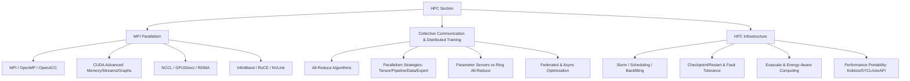

# Section I — High Performance Computing (Topics 801–850)

## Overview

This section covers the systems, programming models, and infrastructure that power scientific computing, large-scale simulations, and distributed AI training at exascale. HPC sits at the intersection of architecture, networking, systems software, and algorithms — making it a fertile area for depth-oriented interview questions at companies running large GPU clusters (Google, Meta, NVIDIA, AWS Trainium/Inferentia, Microsoft Azure).

## Topic Map

## Reading Order

| # | File | Prerequisites | Focus |
|---|------|--------------|-------|
| 1 | `mpi-parallelism.md` | GPU basics, sockets, RDMA concepts | Programming models, interconnects, GPU communication | 
| 2 | `collective-communication.md` | MPI basics, neural network training | Distributed ML communication patterns |
| 3 | `hpc-infra.md` | Linux scheduling, containers | Job scheduling, portability, exascale |

## Cross-References

- **GPU fundamentals**: `../arch/parallelism/gpu.md`, `../arch/parallelism/cuda.md`, `../arch/parallelism/gpu-hpc.md`
- **SIMD/vectorization**: `../arch/parallelism/simd.md`, `../arch/parallelism/avx.md`, `../arch/parallelism/neon.md`
- **Multicore/SMT**: `../arch/parallelism/multicore.md`, `../arch/parallelism/smt.md`
- **Networking fundamentals**: `../networks/overview.md`, `../networks/sockets/tcp.md`
- **Advanced networking**: `../networks/advanced/programmable-networks.md`, `../networks/advanced/datacenter-topology.md`
- **Linux kernel**: `../os/advanced/fast-io.md` (RDMA/DPDK), `../os/kernel-advanced/block-layer.md` (NVMe)

## HPC vs. Cloud: Key Distinctions

| Dimension | HPC | General Cloud |
|-----------|-----|---------------|
| **Workload** | Tightly-coupled MPI jobs, batch simulations | Loosely-coupled microservices |
| **Network** | InfiniBand/RoCE, RDMA, sub-μs latency | Ethernet, TCP/IP, ~100μs latency |
| **Scheduling** | Gang scheduling, rigid node allocations | Bin-packing, overcommit, spot instances |
| **Storage** | Parallel filesystems (Lustre, GPFS) | Object stores (S3), distributed FS (Ceph) |
| **Fault model** | Checkpoint/restart, ULFM | Self-healing, replication, retry |
| **Programming** | MPI, OpenMP, CUDA, Fortran | Containers, serverless, managed services |
| **Target** | FLOPS, time-to-solution | Availability, cost-efficiency, elasticity |