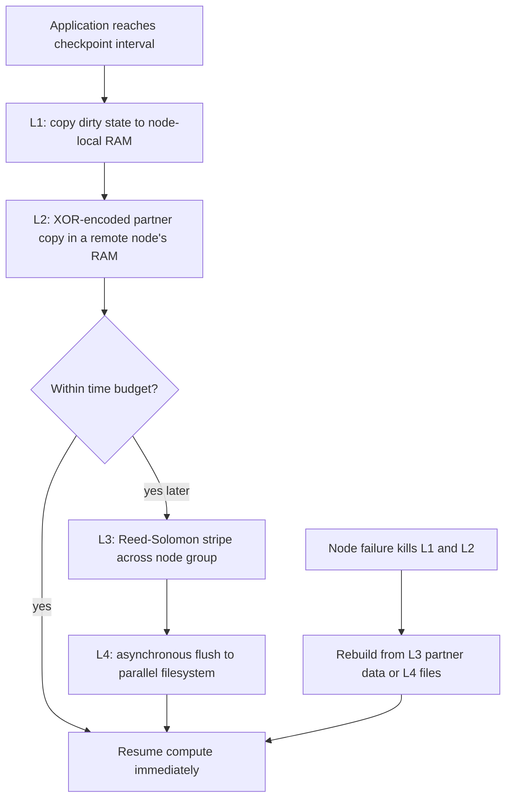
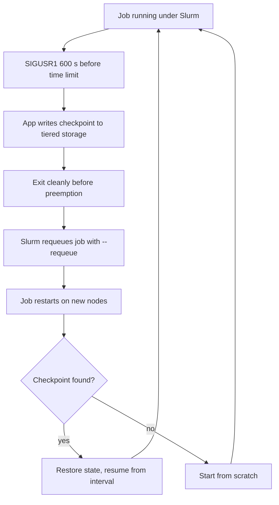

# HPC Fault Tolerance and Checkpoint/Restart

## Overview

Large HPC systems fail constantly: at 10⁵ nodes, even hardware with multi-year individual MTBF produces a system-level failure every few tens of minutes, so a job that runs for weeks must treat failure as a routine event, not an exception. Checkpoint/restart (C/R) is the dominant answer — periodically save enough state to resume — and its core questions (when to checkpoint, where to store it, how to keep a distributed state consistent) generalize directly to cloud and data-intensive systems. Interviews for HPC, infrastructure, and reliability roles test the MTBF arithmetic (Young/Daly interval), the coordinated-vs-logging trade-off, and the practical reality of running C/R under Slurm. This page is the deep dive; the scheduling-level summary is in [HPC Infrastructure](./hpc-infra.md).

## Why Faults Dominate at Scale

Individual node reliability is measured in years, but job-level MTBF divides by node count. If one node's mean time between failures is \\( M_{\\text{node}} \\), a homogeneous \\( N \\)-node system sees:

\\[ M_{\\text{sys}} = \\frac{M_{\\text{node}}}{N} \\]

A 2007 LANL study of 22 clusters (Schroeder & Gibson, SIGMETRICS 2007) measured hardware-driven node MTBF in the range of roughly 10–100 days per node. Plug in modern numbers:

- **10,000-node machine, node MTBF 50 days** → system-wide failure every \\( 50 \\times 24 / 10{,}000 = 0.12 \\) days ≈ **2.9 hours**.
- **Exascale flagships** (Frontier ≈ 9,500 nodes, Aurora ≈ 10,600, El Capitan ≈ 11,000) → with per-node MTBF of ~2 weeks, a failure lands **every ~25–35 minutes**.
- **Projected 100,000-node exascale** → system MTBF drops toward **15–30 minutes** even with highly reliable parts.

The consequence is arithmetic, not anecdote: a 3-week job on a system that fails every 30 minutes will hit ~70 failures. Anything not checkpointed is recomputed, and without C/R the job simply never finishes — expected completion diverges once the checkpoint interval exceeds the failure rate.

The failure mix matters as much as the rate. In the LANL cluster data, hardware root causes dominate (roughly half to two-thirds), with software, human error, and the network sharing the rest — and the tail is heavy: a small set of nodes accounts for a disproportionate share of failures, which is why schedulers support node exclusion. Failures are also **correlated**: a filesystem outage, a switch reboot, a power event, or a bad memory batch takes out many nodes at once, so the independent-failure model \\( M_{\text{sys}} = M_{\text{node}}/N \\) is optimistic precisely at the scales where it matters. Production C/R designs assume correlated bursts: multi-level checkpoints keep the last few *independent* snapshots (not just the last one) so a corruption or a wide outage does not unwind the whole job. Failures are also not only crashes: **silent data corruption** (undetected bit flips in memory or caches) and **transient errors** (errors that vanish on retry) both need detection machinery covered later in this page. Availability math in general is treated in [Failure Detectors](../distributed/fundamentals/failure-detectors.md); here the concern is throughput of long-running batch work.

## Checkpoint Interval Optimization

Checkpointing too often wastes time writing state; too rarely wastes work re-executing after failure. The classic result balances the two.

### Young's Formula

Young (1974) showed the optimal checkpoint interval minimizes total waste — checkpoint cost plus expected lost work. With checkpoint cost \\( C \\) (seconds to write one checkpoint) and system MTBF \\( M \\):

\\[ T_c = \\sqrt{2 \\, C \\cdot M} \\]

**Worked example**: \\( C = 5 \\) min = 300 s, \\( M = 4 \\) h = 14,400 s:
\\( T_c = \\sqrt{2 \\times 300 \\times 14{,}400} = \\sqrt{8{,}640{,}000} \\approx 2{,}939 \\) s ≈ **49 minutes**.

Daly (2006, IEEE TPDS) refined the model to include restart cost \\( R \\) (time to read the checkpoint back and resume) and higher-order loss terms:

\\[ T_c \\approx \\sqrt{2 \\, C \\, (M + R)} \\]

With \\( R = 2 \\) min: \\( T_c = \\sqrt{2 \\times 300 \\times 14{,}520} \\approx 2{,}952 \\) s — nearly identical here because \\( R \\ll M \\); the correction matters only when restarts are expensive (e.g., re-reading hundreds of GB through a contended filesystem).

### Efficiency Arithmetic

The fraction of machine time doing useful work follows the first-order model:

\\[ E = \\frac{1}{1 + \\dfrac{C}{T_c} + \\dfrac{C + R}{M}} \\]

For the numbers above: \\( C/T_c = 300/2939 \\approx 0.10 \\) (checkpoint overhead) and \\( (C+R)/M = 420/14400 \\approx 0.03 \\) (failure recovery) → \\( E \\approx 0.88 \\): about 12% of the machine is spent on fault tolerance. Now the exascale squeeze: at \\( M = 1{,}800 \\) s (30 min) and \\( C = 300 \\) s, Young gives \\( T_c = \\sqrt{2 \\times 300 \\times 1800} \\approx 1{,}039 \\) s ≈ 17 min, and \\( E \\approx 1/(1 + 0.29 + 0.17) \\approx 0.68 \\) — a third of the machine burns on C/R. If checkpointing *full application state* takes longer than the optimal interval itself (a 1 PB state at 1 TB/s aggregate takes ~17 minutes), the naive model breaks and you need the multi-level strategies below. This same arithmetic underlies ML training fault tolerance — a 10,000-GPU run with per-GPU MTBF of ~1 year expects ~200 GPU failures (see [Distributed Training](../llm/advanced/distributed/distributed-training.md)).

## Checkpoint Strategies

| Strategy | Write cost | Recovery granularity | Failure tolerance | Notes |
|---|---|---|---|---|
| **Full** | Largest (all state) | Any failure | Single copy at risk during write | Simple; I/O burst is the bottleneck |
| **Incremental** | Small (dirty pages only) | Requires checkpoint chain | Chain corruption risks all | Needs dirty tracking (bitmap/page tables) |
| **Multi-level (L1–L4)** | Tiered: RAM → local NVMe → parallel FS | Fast local restart, durable global | Levels 2–3 survive node loss | SCR/FTI model; asynchronous flush |
| **Fork/child (copy-on-write)** | Near-zero pause | Whole-job | Child crash loses the checkpoint | Used by DMTCP/CRIU-style tools |

**Full checkpoints** write every byte of application state — for a climate code at 100 TB that is 100 s at 1 TB/s, every interval, from every rank, as a synchronized I/O stampede onto the parallel filesystem.

**Incremental checkpoints** track dirty pages (via page-protection bitmaps or application-level object logs) and write only what changed. Between two iterations of an iterative solver that touches most of the working set, the saving is modest; for long-running simulations with localized activity it is large. The hidden cost is recovery: state must be reconstructed from a chain of checkpoints, and each link adds a failure point.

**Multi-level checkpointing** is the production answer (SCR, FTI, VeloC): stage checkpoints in fast tiers and promote them asynchronously — the flow below is the standard L1→L4 cascade.



The point of the cascade is that the *expensive* durable tier (L4, the parallel filesystem) is written by background threads off the critical path, while recovery from *most* failures (transient, single-node) only needs L1/L2, which are orders of magnitude faster than a filesystem round-trip. Only failures that wipe multiple nodes fall back to L3/L4 data. Performance numbers from the SCR/FTI literature show multi-level schemes cutting time-to-solution overhead by several-fold versus naive full-to-PFS checkpointing at the same resilience level.

### Shaping the I/O Burst

Checkpoint cost decomposes as \\( C = S / B \\): state size \\( S \\) divided by achievable aggregate bandwidth \\( B \\). Both terms are battlegrounds:

- **Reduce S**: skip regenerable scratch (iterative solvers can rebuild multigrid levels), store half-precision mirrors of tolerably lossy fields, compress (FP data compresses 2–3× with byte-plane filters), and checkpoint only every \\( k \\)-th outer iteration of nested time loops.
- **Raise B**: write from all ranks in parallel to object-striped files, use burst buffers (node-local NVMe as the landing zone, like the L2 tier above), and keep the filesystem's cache in mind — a checkpoint written twice (once for redundancy) doubles \\( C \\).
- **Hide the stall**: *staggered* checkpointing rotates which ranks write at a time (leveling the burst, at the cost of a longer vulnerable window), and *asynchronous* staging copies to RAM first, letting compute continue while background threads drain to storage — the standard SCR pattern.
- **Keep the last few checkpoints**: a two-generation policy costs little extra and protects against corrupting the only snapshot during the write itself — a real failure mode on a filesystem mid-reconfiguration.

The failure modes of getting this wrong are I/O-specific too: a checkpoint interrupted mid-write is worse than none unless the file format is crash-safe (checksummed, self-identifying, atomically renamed on completion — the same discipline as the WAL and crash-consistency machinery in [Crash Consistency](../storage/advanced/crash-consistency.md)).

### Formats and Metadata

A checkpoint is only as good as its ability to *resume*, which makes the metadata as important as the payload. Production formats bundle: a schema/version tag (so a restarted binary built after a code change can detect or migrate old state), the iteration/time-step counter, RNG states (so stochastic simulations resume on-stream rather than repeating draws), dataloader/queue positions, and the communication configuration needed to rebuild MPI state (rank counts, decompositions). Portable container formats — HDF5 and ADIOS2 are the common I/O layers in HPC — handle endianness, compression, and layout so state written on one machine reads on another; that portability is what lets restart run on different node counts than the original job (resilient decomposition), which coordinated in-memory schemes cannot do. Whatever the format, the write protocol is the same: write payload, flush, checksum, then atomically publish the new metadata pointer last — restart reads the pointer, never a half-written file.

## Coordinated vs Uncoordinated C/R

A distributed application's checkpoint is only useful if it captures a **consistent global state** — otherwise restart assembles a state that never existed (e.g., rank A's checkpoint reflects receiving a message that rank B's checkpoint shows it never sent).

**Coordinated checkpointing** synchronizes all ranks: on a trigger, every rank flushes in-flight messages and writes its slice simultaneously. With a barrier (and draining or matching of in-flight MPI messages) the result is a consistent snapshot — conceptually the Chandy–Lamport algorithm of taking a snapshot after markers have propagated on all channels (see [Distributed Snapshots](../distributed/advanced/distributed-snapshots.md)). Cost: all ranks pause at once, creating the I/O spike that motivates multi-level staging; and one slow rank stalls every checkpoint. Nearly all MPI C/R in practice is coordinated, because MPI's communication state makes independence expensive.

**Uncoordinated checkpointing with message logging** lets each process checkpoint independently; consistency is restored on recovery by replaying logged messages. Variants:

- **Pessimistic logging**: every send is logged (sender-side payload copy) *before* the send completes — forcing determinism at the cost of message latency.
- **Optimistic logging**: logging is asynchronous; a failure may orphan downstream processes, which must roll back and replay — cheaper steady-state, costlier recovery.
- **Causal logging**: piggybacks log metadata so no process is ever lost to another's failure — no orphan rollback, more complex protocol.

Message logging trades checkpoint synchronization for per-message overhead (payload copying, log I/O) and complicated recovery. It pays off when failures are frequent but I/O bursts are unacceptable, or when processes have very different checkpoint costs (e.g., mixed CPU/GPU pipelines). The domino effect — cascading rollbacks when uncoordinated checkpoints are inconsistent and logging is absent — is the failure mode this family exists to avoid, and the reason plain uncoordinated C/R without logging is rarely shipped. Production designs also hybridize: coordinated global checkpoints at long intervals, plus per-process uncoordinated checkpoints and small message logs in between — recovering most failures locally and falling back to the global snapshot only when replay cannot rebuild a consistent state. The general principle (log the small diff, snapshot the big state) recurs in databases (WAL + checkpoint) and is treated from the storage side in [Crash Consistency](../storage/advanced/crash-consistency.md).

## C/R Libraries

| Library | Origin | Level | Mechanism | Sweet spot |
|---|---|---|---|---|
| **SCR** (scr.sandia.gov) | Sandia | App-level, MPI | Multi-level RAM cache + partner XOR + async PFS flush | Large MPI simulations |
| **FTI** | EU/academic | App-level, MPI | 4 protection levels incl. Reed–Solomon across node groups | Same, with erasure-coded L3 |
| **VeloC** | ECP (ANL/LANL) | App-level | Multi-level, successor generation to SCR ideas | Exascale apps |
| **DMTCP** | Academic | Process-level, user space | Transparent C/R via ptrace-like interception, no kernel mods | Sequential/loosely coupled jobs |
| **CRIU** | Linux community | Process-level, kernel | Dump/restore process tree from `/proc`, namespaces aware | Containers, single hosts — see [CRIU](../os/advanced/criu-checkpoint-restore.md) |
| **BLCR** (legacy) | LBNL | Process-level, kernel module | Freeze + dump from kernel | Predecessor; MPI-1 era |

**SCR** (*Scalable Checkpoint/Restart for the Sciences*, scr.sandia.gov) introduced the multi-level scheme above: checkpoints live first in node RAM, get XOR-encoded into partner nodes' RAM, and only a subset is asynchronously flushed to the parallel filesystem; after a crash, SCR reconstructs the most durable available checkpoint. **FTI** adds explicit Reed–Solomon erasure coding across node groups at L3, tolerating whole-node loss without touching PFS. **DMTCP** is remarkable for being *transparent* — no code changes — but its interception approach struggles with IBverbs/MPI state and GPU contexts, which is why MPI jobs overwhelmingly use application-level libraries. **CRIU** owns the Linux process-level niche (containers, podman, single-node services) and pairs with the OS-level view in [CRIU: Checkpoint/Restore in Userspace](../os/advanced/criu-checkpoint-restore.md).

## Process-Level vs Application-Level C/R

| Dimension | Process-level (CRIU, DMTCP) | Application-level (SCR, FTI) |
|---|---|---|
| Code changes | None (transparent) | Library calls + checkpoint logic in app |
| What is saved | Entire process tree: FDs, mappings, sockets | Application data structures the app chooses |
| MPI state | Hard — IB QPs, collective state opaque | Native — coordinated across ranks by design |
| GPU state | Very hard | App copies device data explicitly (often to host) |
| Checkpoint size | Everything addressable | Only semantically meaningful state |
| Portability | Same kernel/arch constraints | Restore on different topology possible |
| Compression/selectivity | None | App-driven (e.g., skip scratch buffers) |

The dominant HPC pattern is therefore **application-level, coordinated, at iteration boundaries**: the app knows which arrays are live, can skip regenerable scratch, can compress, and can participate in the coordination protocol. Process-level tools remain the answer for opaque binaries, long-running services, and container migration. GPUs widen the gap further — CUDA contexts are not designed for transparent capture, so application-level checkpointing copies device buffers to host memory before tiering, and fault-tolerant frameworks checkpoint optimizer state plus data-loader positions rather than raw GPU memory.

### GPU Checkpointing Arithmetic

The device-to-host copy is often the checkpoint bottleneck. An 80 GB HBM state (an A100/H100-class GPU is fully loaded) over PCIe Gen4 x16 at a practical ~60 GB/s takes ~1.3 s per GPU — acceptable per checkpoint, but multiplied across an 8-GPU node and a 30-minute interval it competes with the interval itself. The standard tricks: checkpoint in the application's reduced precision (FP32 mirror of FP16 training state), overlap the copy with continued compute using double-buffered device allocations, and let the *host-side* tiering (the L1–L4 cascade) proceed asynchronously so GPUs return to work immediately. Framework-level training instead checkpoints *semantic* state — optimizer moments, learning-rate schedule, dataloader position, RNG states for data augmentation — which is both smaller and more portable than raw device memory, and is what makes the ~200-failure training runs discussed above survivable at all.

## Transient Errors and Detection

Crashes are the visible half; the invisible half is data that is *wrong* but not dead. Resilience designs therefore separate faults into **fail-stop** (the process or node stops — detectable, recoverable by rollback) and **fail-silent-then-wrong** (the component keeps running with corrupted data), and the second class drives the detection machinery below. Transient vs permanent matters too: a cosmic-ray flip that disappears on re-execution costs a retry, while a stuck-at fault costs a node replacement — misclassifying one as the other either wastes hardware or loses correctness.

- **ECC memory**: SECDED codes correct single-bit and detect double-bit errors per 64-bit word; **chipkill**-class codes survive an entire DRAM chip failing. GPUs (HBM stacks) carry ECC as standard. ECC fixes *detected* errors, but rates matter — an exascale machine has petabytes of DRAM and nontrivial corrected-error rates per GB-day.
- **Silent data corruption (SDC)**: errors ECC cannot see (CPU compute faults, cache aliasing, firmware bugs) surface as subtly wrong results. Detection strategies: checksum every checkpoint (detect corruption *of saved state*), periodically recompute a reduction redundantly (two ranks compute the same sum and compare), or full-replication of critical ranks.
- **Hardware replay**: Intel cores replay instructions on machine-check indications to decide whether a fault was transient (re-executed cleanly) or permanent (fatal MCE) — the hardware-side analog of retry logic.
- **Algorithm-Based Fault Tolerance (ABFT)**: encode data with checksums so *the algorithm itself* detects and corrects errors — the classic Huang & Abraham (1984) scheme checksums matrix columns, so a corrupted element in a matrix product is detected by the checksum row and recomputed in place. ABFT in BLAS adds O(n) redundant work to O(n³) computation — under 1% overhead for large GEMMs — and is being revived for GPU-resident operations where ECC cannot cover compute units.

Checkpoint integrity deserves emphasis: a checkpoint corrupted by SDC converts every future restart into silent wrong answers. Practical systems store per-checkpoint CRCs (app-level) and rely on the filesystem's end-to-end checksums — see [Crash Consistency](../storage/advanced/crash-consistency.md) for how storage systems keep metadata and data mutually consistent during exactly these partial-write windows.

## Job Restart with Slurm

Slurm treats a checkpointed job as restartable infrastructure state rather than special-casing it:

```bash
#SBATCH --job-name=climate-run
#SBATCH --requeue                # requeue on node failure or preemption (default for many setups)
#SBATCH --signal=B:USR1@600      # send USR1 to batch shell 600 s before time limit
#SBATCH --time=24:00:00

./run.sh   # app traps USR1 -> writes checkpoint -> exits cleanly
```

The operational loop:

1. **Failure or preemption** kills the job; Slurm marks the node failed (`sinfo` shows `*`) and, with `--requeue`, puts the job back in the queue.
2. **Time-limit warning**: `--signal=B:USR1@600` delivers SIGUSR1 to the batch shell 10 minutes before the walltime expires — the app's handler checkpoints and exits *before* the kill, so the preemption costs one interval of lost work at most, not a whole one.
3. **Restart**: the requeued job starts fresh; the app detects prior state (a checkpoint directory plus `SLURM_RESTART_COUNT`) and resumes from the last checkpoint. `scontrol requeue <jobid>` triggers the same path manually.
4. **Failure fencing**: combine with `--exclude` or automatic node exclusion so a flaky node does not kill the job in a loop; scheduler-side mechanics are in [Slurm Scheduling](./slurm-scheduling.md) and [Backfilling Schedulers](./backfilling-schedulers.md).

In practice the checkpoint directory lives on the shared parallel filesystem (or a burst-buffer mount), and the restart logic is a one-line guard in the launcher:

```bash
if [[ -d "$CKPT_DIR/iter_*" && -n "$SLURM_RESTART_COUNT" ]]; then
    RESUME_FROM=$(ls -d "$CKPT_DIR"/iter_* | sort -V | tail -1)
fi
```

The pattern generalizes to cloud preemption ([Spot/Preemptible Instances](../cloud/spot-preemptible.md) covers the cloud-native twin): *periodically persist enough state to resume, catch the preemption signal, exit cleanly, let the scheduler requeue you*. MPI interplay — which ranks checkpoint, how in-flight collectives are drained — is in [MPI Parallelism](./mpi-parallelism.md).



Two operational disciplines make this loop trustworthy rather than theoretical. First, **rehearse restarts**: a checkpoint that has never been restored is a hope, not a backup — production C/R periodically kills jobs deliberately (or uses the scheduler's preemption) to prove the resume path, including on a different node count. Second, **measure the real C and R** from those rehearsals and feed them back into the Young/Daly interval — both constants drift as state grows and filesystems age, and a stale interval is invisible until the efficiency column of the accounting report explains a bad quarter.

## Interview Questions

1. **Derive the checkpoint interval for C = 5 min, M = 4 h. What fraction of the machine is spent on C/R?** Young's formula: \\( T_c = \\sqrt{2CM} = \\sqrt{2 \\times 300 \\times 14{,}400} \\approx 2{,}939 \\) s ≈ 49 min. Efficiency: \\( E = 1/(1 + C/T_c + (C+R)/M) \\) with R = 2 min gives \\( 1/(1 + 0.102 + 0.029) \\approx 0.88 \\) — about 12% overhead, split between steady-state checkpointing (~10%) and failure recovery (~3%). The follow-up to expect: halve M to 2 h and the optimal interval falls by \\( \\sqrt{2} \\) — intervals scale with \\( \\sqrt{M} \\), not linearly.

2. **Why does MTBF degrade linearly with node count, and what does that imply at exascale?** Independent failures with per-node rate \\( 1/M_{\\text{node}} \\) combine to \\( N/M_{\\text{node}} \\) — so 100,000 nodes with 10-year node MTBF fail every ~53 minutes. Implication: checkpoint intervals shrink with \\( \\sqrt{M} \\) while checkpoint *size* grows with problem size; at some point \\( C > T_c \\) and full checkpointing is infeasible, forcing multi-level staging, incremental checkpoints, and compression. This is why exascale resilience research is dominated by reducing C and R, not just tuning T_c.

3. **Coordinated checkpointing vs message logging — when does each win?** Coordinated: all ranks checkpoint a consistent global snapshot simultaneously — simple, no per-message overhead, but creates I/O bursts and couples ranks (one slow rank stalls everyone). Logging: per-process checkpoints + message replay — removes the synchronization and lets heterogeneous ranks proceed independently, but pays payload-copy and log-write costs on every message, plus complex recovery. Coordinated wins for tightly coupled MPI jobs where bursts can be staged through multi-level buffers; logging wins when messages are cheap relative to checkpoints or when processes have wildly different checkpoint costs.

4. **What breaks if you apply CRIU-style process checkpointing to a 1,000-rank MPI job?** Process-level tools capture kernel state (mappings, FDs, sockets) transparently but do not understand MPI's network state: InfiniBand queue pairs, remote keys, and collective algorithm state are opaque, and restoring 1,000 processes onto new node assignments requires re-establishing all of it — which the process snapshot does not model. GPU contexts compound the problem. Hence the MPI standard practice is application-level coordinated checkpointing at iteration boundaries with libraries (SCR/FTI) built for exactly this; CRIU remains excellent for containers and single-host services.

5. **How do you detect a silent data corruption that ECC misses?** ECC only sees memory-level bit flips; SDC from compute units or firmware produces plausible-but-wrong values. Layered detection: checksum checkpoints so corrupted state is caught at restart; redundant recomputation of reductions (two ranks, compare results); ABFT — encode matrices with checksum rows/columns so the BLAS operation itself validates output for O(n) extra work on O(n³) compute; and periodic full-replication of critical ranks. Recovery is rerun from the last validated checkpoint plus, if available, recomputation of the corrupt segment.

6. **Your Slurm job keeps dying at walltime, losing hours of work. What do you change?** Three changes: add `--signal=B:USR1@600` and a USR1 handler that checkpoints and exits cleanly before the kill; add `--requeue` so preemption/failure requeues instead of cancelling; and on startup, detect existing checkpoint state (`SLURM_RESTART_COUNT` + checkpoint directory) and resume instead of reinitializing. Optionally wrap with `scontrol requeue` testing to rehearse the path. With checkpoint cost C inside the 10-minute warning window, a preemption then costs at most C plus one interval of lost work instead of hours.

## Key Takeaways

- System MTBF is per-node MTBF divided by node count: 10,000 nodes × 50-day node MTBF → a failure every ~2 hours; exascale designs plan for failure every ~30 minutes.
- Young's formula \\( T_c = \\sqrt{2CM} \\) (Daly adds restart cost \\( R \\): \\( T_c \\approx \\sqrt{2C(M+R)} \\)) minimizes waste; efficiency \\( E \\approx 1/(1 + C/T_c + (C+R)/M) \\) quantifies the fault-tolerance tax — ~12% in the worked example, ~30%+ at aggressive exascale assumptions.
- Multi-level checkpointing (SCR/FTI: node RAM → partner XOR/Reed–Solomon → parallel FS) decouples the fast local copy from the slow durable copy, cutting both pause time and recovery time.
- Coordinated checkpoints need a consistent global state (Chandy–Lamport style); uncoordinated C/R without logging risks the domino effect, and message logging buys independence at per-message cost.
- Application-level C/R beats process-level for MPI/GPU jobs because the app knows live state, can skip scratch, and understands the communication fabric; CRIU/DMTCP own the transparent, single-host niche.
- ECC handles detected memory errors; SDC needs checksums, redundant reductions, or ABFT (checksum-encoded BLAS at <1% overhead for large GEMMs).
- Slurm's `--requeue` + `--signal=B:USR1@600` + startup-resume pattern is the operational backbone; the same contract generalizes to cloud spot preemption.
- The exascale squeeze — interval shrinking as \\( \\sqrt{M} \\) while state grows — is the research driver behind incremental checkpoints, compression, and resilient (ABFT-style) algorithms.

## References

- SCR — Scalable Checkpoint/Restart for the Sciences, Sandia National Laboratories — <https://scr.sandia.gov/>
- Slurm Workload Manager documentation (`sbatch`, `scontrol`, requeue semantics) — <https://slurm.schedmd.com/>
- Daly, *A Higher Order Estimate of the Optimum Checkpoint Interval for Restart Dumps*, IEEE Transactions on Parallel and Distributed Systems, 2006 (cited by title + venue)
- Young, *A First Order Approximation to the Optimal Checkpoint Interval*, Communications of the ACM, 1974 (cited by title + venue)
- Schroeder & Gibson, *A Large-Scale Study of Failures in High-Performance Computing Systems*, SIGMETRICS 2006/2007 (LANL cluster failure data; cited by title + venue)
- Elnozahy, Alvisi, Wang & Johnson, *A Survey of Rollback-Recovery Protocols in Message-Passing Systems*, ACM Computing Surveys, 2002 (cited by title + venue)
- Chandy & Lamport, *Distributed Snapshots: Determining Global States of Distributed Systems*, ACM TOCS, 1985 (cited by title + venue)
- Huang & Abraham, *Algorithm-Based Fault Tolerance for Matrix Operations*, IEEE Transactions on Computers, 1984 (cited by title + venue)
- Moody, Bronevetsky, Mohror & de Supinski, *Design, Modeling, and Evaluation of a Scalable Multi-Level Checkpointing System*, SC 2010 (SCR design paper; cited by title + venue)
- Di et al., *FTI: High Performance Fault Tolerance Interface for Dynamic Systems*, Scientific Programming, 2013 (cited by title + venue)
- DMTCP — Distributed MultiThreaded CheckPointing — <https://dmtcp.sourceforge.io/>
- CRIU — Checkpoint/Restore In Userspace — <https://criu.org/>
- The HDF5 Group — portable data model used for checkpoint containers — <https://www.hdfgroup.org/>
- ADIOS2 (Oak Ridge National Laboratory) — parallel I/O middleware used for checkpoint containers (cited by name; project pages have moved between ORNL sites)

## Cross-References

- [Slurm Scheduling](./slurm-scheduling.md) — requeue, preemption, and the scheduler view of restartable jobs
- [MPI Parallelism](./mpi-parallelism.md) — which communication state coordinated checkpointing must capture
- [HPC Infrastructure](./hpc-infra.md) — the shorter scheduling-level treatment of C/R and exascale context
- [Backfilling Schedulers](./backfilling-schedulers.md) — how restartable jobs interact with backfill and reservations
- [Crash Consistency](../storage/advanced/crash-consistency.md) — filesystem guarantees that make checkpoint writes durable
- [Distributed Snapshots](../distributed/advanced/distributed-snapshots.md) — the Chandy–Lamport theory behind coordinated checkpoints
- [Failure Detectors](../distributed/fundamentals/failure-detectors.md) — availability math and failure detection in general distributed systems
- [CRIU](../os/advanced/criu-checkpoint-restore.md) — the Linux process-level checkpoint/restore mechanism
- [Disaster Recovery](../cloud/disaster-recovery.md) — the cloud-world sibling: RPO/RTO and cross-region recovery
- [Spot/Preemptible Instances](../cloud/spot-preemptible.md) — the cloud-native requeue-and-resume pattern
