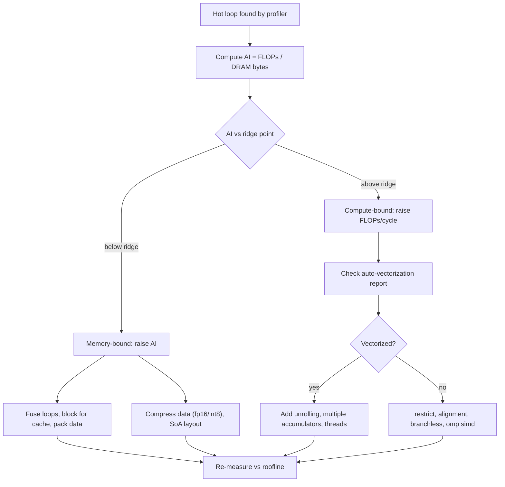

# SIMD Vectorization and the Roofline Model

## Overview

Vectorization and the roofline model are the two tools that tell you *why* a numerical kernel is slow and *whether* it can be made fast: roofline classifies a kernel as memory-bound or compute-bound from its arithmetic intensity, and SIMD vectorization is the main lever for the compute-bound side. Placement interviews for HPC, game-engine, GPU, and performance-engineering roles love this pair because it forces concrete arithmetic (register widths, bandwidth, FLOP rates) instead of hand-waving. This page covers the HPC-kernel angle — the algorithmic view of SIMD is in [SIMD Overview](../dsa/chapters/ch125-simd-overview.md), and the ISA itself in [AVX](../arch/parallelism/avx.md).

## The Roofline Model

The roofline model (Williams, Waterman & Patterson, CACM 2009) plots achievable performance against a single number, the **arithmetic intensity (AI)** — the ratio of work to data movement:

\\[ \\mathrm{AI} = \\frac{\\text{FLOPs executed}}{\\text{Bytes moved to/from DRAM}} \\qquad \\text{(FLOP/byte)} \\]

The attainable performance is then capped by whichever limit is lower:

\\[ P_{\\text{attainable}} = \\min\\left( P_{\\text{peak}},\\; \\mathrm{AI} \\times B_{\\text{peak}} \\right) \\]

where \\( P_{\\text{peak}} \\) is the CPU's peak FLOP rate and \\( B_{\\text{peak}} \\) its peak memory bandwidth. The crossover intensity is the **ridge point**:

\\[ \\mathrm{AI}_{\\text{ridge}} = \\frac{P_{\\text{peak}}}{B_{\\text{peak}}} \\]

Kernels with AI below the ridge are **memory-bandwidth-bound**; above it, **compute-bound**. The key discipline is counting bytes honestly: DRAM traffic, not cache traffic — and counting FLOPs as the hardware does, which for fused multiply-add (FMA) means 2 FLOPs per instruction.

### Worked Example: AVX2 vs AVX-512 Ridge Points

Take an 8-core CPU at 3 GHz with dual-channel DDR4-3200 (~51.2 GB/s theoretical, ~42 GB/s achievable STREAM):

- **AVX2, FP64**: one 256-bit FMA does 4 doubles × 2 FLOPs = 8 FLOPs; with two FMA ports that is 16 FLOPs/cycle/core → \\( 16 \\times 3\\,\\text{GHz} = 48 \\) GFLOP/s per core, 384 GFLOP/s per socket.
  Per-core ridge: \\( 48 / 42 \\approx 1.14 \\) FLOP/B. Socket-level ridge: \\( 384 / 42 \\approx 9.1 \\) FLOP/B.
- **AVX-512, FP64**: 8 doubles × 2 FLOPs × 2 ports = 32 FLOPs/cycle/core → 96 GFLOP/s per core, 768 GFLOP/s per socket.
  Per-core ridge ≈ 2.25 FLOP/B; socket-level ≈ 18.3 FLOP/B.

Two interview-grade observations fall out of the arithmetic. First, the ridge point **scales with core count** because bandwidth is shared but compute is per-core — a kernel with AI = 2 is compute-bound on one core and memory-bound on eight. Second, wider vectors *raise* the ridge point, making memory-boundedness worse: AVX-512 doubles the compute ceiling without touching DRAM bandwidth. AVX-512 also applies frequency licenses on many Intel parts (light/heavy 512-bit code downclocks the core), so measured peak can sit 10–30% under the naive product — always confirm with counters, not datasheets.

The same arithmetic as a compact ceiling table (FP64, 3 GHz, two FMA ports, ~42 GB/s STREAM):

| ISA | Doubles per vector | FLOPs/cycle/core | GFLOP/s per core | GFLOP/s per socket | Socket ridge point |
|---|---|---|---|---|---|
| SSE2 (128-bit) | 2 | 8 | 24 | 192 | ~4.6 FLOP/B |
| AVX2 + FMA (256-bit) | 4 | 16 | 48 | 384 | ~9.1 FLOP/B |
| AVX-512 + FMA | 8 | 32 | 96 | 768 | ~18.3 FLOP/B |

The table is a template, not a constant: plug in the real clock (base vs turbo, AVX offset) and the measured (not theoretical) bandwidth of the actual machine, and the classification may flip for kernels sitting near the ridge.

### Predicting Speedups Before Measuring

The roofline also predicts how much optimization is worth attempting. A 5-point stencil at AI ≈ 0.4 on the AVX2 socket tops out at \\( 42 \\times 0.4 \\approx 17 \\) GFLOP/s. Two candidate interventions:

- **Wider vectors** (scalar → AVX2): raises the compute roof from 24 to 384 GFLOP/s per socket — irrelevant, because the kernel sits at 17, pinned by bandwidth. Expected gain: ~0%.
- **Cache blocking** (2D tiling so each loaded line is reused by all tiles touching it): cuts DRAM traffic per FLOP, raising AI from ~0.4 toward the in-cache intensity (~2–3 FLOP/B against L2 bandwidth of 100+ GB/s). Expected gain: 2–4×.

That asymmetry — compute-roof moves are worthless for memory-bound kernels, traffic-reduction moves are gold — is the single most useful thing the model tells you, and it costs one paragraph of arithmetic to apply. The same reasoning explains why vectorizing SpMV or `memcpy` is a dead end while blocking them (or fusing them with adjacent loops to share loads) pays immediately.

## Auto-Vectorization

The cheapest vectorization is the one the compiler does. With `gcc -O3 -mavx2` (or `clang -O3 -mavx2`, plus `-mfma`), scalar loops are translated into `vfmadd*`/`vaddps` sequences when the compiler can prove safety. The standard failure checklist:

| Condition blocking vectorization | Why it blocks | Typical fix |
|---|---|---|
| Unknown trip count / early `break` | Cannot map iterations to fixed-width vectors | Restructure; main loop in strips of 8 |
| Possible pointer aliasing | Stores through `p` may overwrite reads through `q` | `restrict` qualifiers; local copies |
| Unknown alignment | Costly peeled loads or split cache lines | `__builtin_assume_aligned(p, 32)`, aligned allocators |
| Loop-carried dependency | Iteration `i` needs result of `i-1` | Reformulate (e.g. partial sums), or `#pragma omp simd` if provably false |
| FP reduction reassociation | Changing sum order changes rounding | `-ffast-math` / `-fassociative-math`, or explicit `reduction` clause |
| Branchy body | SIMD executes all lanes | Branchless math with blends/masks |
| Strided or gather access | One element per cache line | Restructure to unit stride; SoA layout |

Verify with the compilers' vectorization reports — `gcc -O3 -mavx2 -fopt-info-vec-optimized` and `clang++ -Rpass=loop-vectorize -Rpass-missed=loop-vectorize` print which loops vectorized, at what vector width, and which failed with the reason. Unchecked "I enabled `-O3`" is how vectorization silently fails: a single un-proven alias makes the compiler emit runtime overlap checks or fall back to scalar entirely.

### Aliasing, `restrict`, and Alignment

The classic example is `void add(float *a, float *b, int n) { for (...) a[i] += b[i]; }`. If the caller does `add(x, x, n)`, a vectorized 8-wide load-store would clobber data mid-loop; without proof the compiler must either version the loop (runtime alias check, vectorized fast path) or stay scalar. Adding `restrict` — `void add(float * restrict a, float * restrict b, int n)` — is a promise of non-overlap and unblocks vectorization. Alignment matters because AVX2 aligned loads (`vmovapd`) fault or slow down on misaligned operands depending on context; `_mm256_load_pd` assumes 32-byte alignment while `_mm256_loadu_pd` does not. Modern practice: use unaligned loads (they cost ~nothing when the address is in fact aligned) and spend effort on cache-line-spanning avoidance instead — e.g. allocate with `posix_memalign(p, 64, n)` so arrays start on a 64-byte line.

### Gather/Scatter Costs

Unit-stride loads fill a whole vector in one transaction. Non-contiguous data needs **gather** (`_mm256_i32gather_pd`) — one address per lane, effectively serialized on AVX2 (tens of cycles, ~8 elements one at a time) — and **scatter**, which only AVX-512 provides (`vscatter*`). A loop over matrix columns (column-major traversal) that vectorizes "successfully" with gathers can end up slower than scalar code. The fixes are data-layout fixes: structure-of-arrays (SoA), blocked/transposed access, or packing tiles into contiguous scratch buffers. If a profile shows gather instructions in the hot loop, the layout is wrong, not the vectorizer.

### Intrinsics Example: FMA Dot Product

Hand-written intrinsics buy you control the auto-vectorizer cannot prove — here, two independent accumulator chains that hide FMA latency:

```c
#include <immintrin.h>
#include <stddef.h>

double dot(const double *__restrict a, const double *__restrict b, size_t n) {
    __m256d acc0 = _mm256_setzero_pd();
    __m256d acc1 = _mm256_setzero_pd();
    size_t i = 0;
    for (; i + 8 <= n; i += 8) {
        __m256d a0 = _mm256_loadu_pd(&a[i]);
        __m256d b0 = _mm256_loadu_pd(&b[i]);
        __m256d a1 = _mm256_loadu_pd(&a[i + 4]);
        __m256d b1 = _mm256_loadu_pd(&b[i + 4]);
        acc0 = _mm256_fmadd_pd(a0, b0, acc0);   /* a0*b0 + acc0 */
        acc1 = _mm256_fmadd_pd(a1, b1, acc1);
    }
    __m256d acc = _mm256_add_pd(acc0, acc1);
    __m128d lo = _mm256_castpd256_pd128(acc);
    __m128d hi = _mm256_extractf128_pd(acc, 1);
    lo  = _mm_add_pd(lo, hi);
    lo  = _mm_add_sd(lo, _mm_unpackhi_pd(lo, lo));
    double s;
    _mm_store_sd(&s, lo);
    for (; i < n; ++i) s += a[i] * b[i];        /* scalar tail */
    return s;
}
```

Compile with `gcc -O3 -mavx2 -mfma`. The two accumulators matter: an FMA has ~4-cycle latency and 2-per-cycle throughput, so a single accumulator serializes at one FMA per 4 cycles — two (or four) independent chains reach full throughput. The horizontal reduction (`_mm_unpackhi_pd` dance) runs once, outside the loop, so its cost is irrelevant. This is also the pattern to check against the auto-vectorizer's output: often `-O3` produces the same code, and the intrinsics are only worth it when they do not.

### OpenMP `simd`

The OpenMP `simd` directive is the portable middle ground between trusting the compiler and writing intrinsics:

```c
#pragma omp parallel for simd
for (int i = 0; i < n; ++i) {
    c[i] = a[i] * b[i];
}

double sum = 0.0;
#pragma omp simd reduction(+:sum) simdlen(8)
for (int i = 0; i < n; ++i) sum += a[i] * b[i];
```

`omp simd` is a **contract**: the programmer asserts the loop has no dependencies the compiler must preserve, so it vectorizes even where safety analysis failed — including FP reassociation for the `reduction`. `simdlen(8)` hints the vector width; `simd` composes with `parallel for` to get threads × vectors. This is usually the right first tool before intrinsics, because it survives ISA changes (AVX2 today, AVX-512 or SVE tomorrow). Full thread-level machinery is in [OpenMP](./openmp.md).

### Threads × Vectors: Assembling the Roof

The full compute roof is the product of three factors — vector width × FMA ports × cores — and forgetting one is a classic interview trap. On the 8-core AVX2 example: 8 lanes × 2 FLOPs × 2 ports × 8 cores = 256 FLOPs/cycle socket-wide, and 384 GFLOP/s at 3 GHz. But the memory roof does not multiply: 8 threads streaming data share one ~42 GB/s memory subsystem, so a memory-bound kernel scales with threads only until one thread's worth of bandwidth is exhausted (often by 1–2 cores on a dual-channel desktop, by most of the socket on a server with 8 channels). Practical consequences:

- For memory-bound loops, add threads until bandwidth saturates, then stop — extra threads only add NUMA traffic and contention.
- For compute-bound loops, thread count × vector width must both be near maximum, or the roofline gap (achieved vs peak) shows up as idle FMA ports.
- Pin threads and data (`OMP_PROC_BIND`, first-touch initialization) so each thread streams from its local NUMA node — otherwise the effective bandwidth roof drops by 20–50% for cross-node traffic.

Hybrid MPI+OpenMP codes follow the same logic across the cluster: MPI ranks own NUMA domains, OpenMP threads fill them, `omp simd` fills the vectors — and the roofline is evaluated at each level with that level's bandwidth.

## Classifying Real Kernels

The roofline classification of the standard kernels is a table worth memorizing:

| Kernel | FLOPs per element | Bytes per element (DRAM) | AI (FP64) | Classification |
|---|---|---|---|---|
| `memcpy` | 0 | 2 (read + write) | 0 | Purely bandwidth-bound |
| `daxpy` (`y = a*x + y`) | 2 | 24 (2 reads + 1 write × 8 B) | 0.083 | Memory-bound (hard) |
| `saxpy` (FP32) | 2 | 12 (3 × 4 B) | 0.167 | Memory-bound |
| 5-point stencil | ~5–9 | 16 effective (with halo reuse) | 0.3–0.6 | Memory-bound unless cache-blocked |
| SpMV (CSR, FP64) | 2 per nnz | ~12 per nnz (8 B value + 4 B index) | ~0.17 | Memory-bound (irregular) |
| `dgemm` (n×n, blocked) | \\( 2n^3 \\) | \\( 3n^2 \\times 8 \\) | \\( n/12 \\) | Compute-bound for n ≳ 100 |

Check the numbers against the AVX2 socket ridge point of ~9 FLOP/B: `saxpy` at 0.167 achieves at most \\( 42\\,\\text{GB/s} \\times 0.167 \\approx 7 \\) GFLOP/s — under 2% of the 384 GFLOP/s peak, and no vectorization change can fix that; the ceiling is DRAM. STREAM-like kernels (memcpy, axpy) are measured bandwidth benchmarks precisely because they push the memory system to its roof. `dgemm`, by contrast, reads each element \\( O(n/B) \\) times thanks to cache blocking, so its AI grows with block size and it can reach 80–95% of peak FLOPs — which is why BLAS libraries obsess over blocking and registers. SpMV is the pathological case: irregular column indices defeat both the prefetcher and vectorization, and real SpMV sits at 5–15% of peak on CPUs and GPUs alike. The practical classification workflow: compute AI on paper, predict the bound, then confirm against measured bandwidth (STREAM) and FLOP rates.



## Measuring: Counters and Static Analysis

Do not reason about vectorization without measuring it:

- **perf** (Linux perf wiki: [perf.wiki.kernel.org](https://perf.wiki.kernel.org/index.php/Main_Page)) exposes the Intel FP-arithmetic events:

```bash
perf stat -e cycles,instructions,\
fp_arith_inst_retired.256b_packed_double,\
fp_arith_inst_retired.256b_packed_single,\
fp_arith_inst_retired.scalar_double ./kernel

# ratio of packed-double FMAs to scalar ops shows real SIMD utilization
perf stat -M TopdownL1 ./kernel     # classify: Backend_Bound -> Memory vs Core
```

  Dividing `fp_arith_inst_retired.256b_packed_double` (each event ≈ 8 FLOPs) by elapsed cycles against the theoretical 32 FLOPs/cycle gives you the *achieved fraction of the compute roof* — the CPU-side complement of measuring achieved bandwidth with STREAM.
- **AVX busy / frequency telemetry**: Intel parts expose execution-unit utilization ("EU busy") and effective core frequency; combined they reveal **AVX-512 license downclocking** — a kernel can show 100% vector throughput while its clock drops 20–30%, which appears in the roofline as a lower-than-expected peak. VTune surfaces this as "Frequency Bound"; with raw perf, compare `CPU_CLK_UNHALTED.THREAD`-derived average frequency while the vector workload runs vs a scalar one.
- **llvm-mca** ([docs](https://llvm.org/docs/CommandGuide/llvm-mca.html)) statically simulates a loop's scheduling model: `llvm-mca -mcpu=znver3 loop.s` reports IPC, port pressure, and block throughput without running the code — ideal for checking whether the FMA ports (not memory) limit your inner loop.
- **uops.info** ([uops.info](https://uops.info/)) provides measured latency/throughput for every instruction — the ground truth for FMA latency (4 cycles on most recent cores) used in accumulator reasoning.
- **Algorithmica HPC** ([en.algorithmica.org/hpc](https://en.algorithmica.org/hpc/)) demonstrates the full measure-and-vectorize loop with real numbers; Agner Fog's optimization manuals ([agner.org/optimize](https://www.agner.org/optimize/)) remain the reference for microarchitectural throughput tables.

## Pitfalls

- **Aliasing you did not declare.** The compiler emits a runtime alias check or, more often, quietly stays scalar. `restrict` and local temporaries are cheaper than profiling later.
- **Branchy loops.** SIMD lanes execute unconditionally; `if (a[i] > 0) b[i] = f(a[i]);` becomes masked/blend code only when the compiler can prove it is safe and cheap. Data-dependent control flow (pointer chasing, early exit) does not vectorize — restructure to branchless arithmetic or masks.
- **Strided access and gathers.** A "vectorized" gather loop can be slower than scalar; profile for `vgather` instructions and fix the layout (SoA, blocking, transpose) instead.
- **FP reductions change results.** Vectorizing `sum += a[i]` reassociates the sum; bit-identical results are impossible. Decide explicitly via `-ffast-math` / `#pragma omp simd reduction` and document the tolerance.
- **Denormals.** Subnormal operands can cost ~100 cycles each; set FTZ/DAZ (`-ffast-math`, or `_MM_SET_FLUSH_ZERO_MODE`) for workloads where tiny values are noise.
- **Short trip counts.** An 8-wide loop over `n = 5` wastes lanes and may spend more on peeling than it saves; strip the main vector loop from the remainder/tail as in the dot-product example.
- **Trusting `-O3` alone.** Without `-mavx2`/`-march=native` the baseline is SSE2 (128-bit) — half the FLOPs/cycle. And `-march=native` binaries are not portable; in HPC build systems pick the machine's microarchitecture explicitly.
- **Forgetting the memory roof.** Vectorizing a 0.08-AI `daxpy` from 128-bit to 512-bit changes nothing measurable: memory-bound kernels need blocking, fusion, and compression — not wider vectors.

## Interview Questions

1. **Compute whether a 5-point stencil is compute-bound on a modern 8-core AVX-2 CPU.** Per grid point: ~5–9 FLOPs and 8 bytes read + 8 written, but neighboring points share halo lines, so effective DRAM traffic is ~16 bytes/point → AI ≈ 0.3–0.6 FLOP/B. The AVX2 socket ridge point is peak-FLOPs/bandwidth = 384 GFLOP/s ÷ 42 GB/s ≈ 9 FLOP/B. AI ≪ 9, so the stencil is memory-bound — SIMD width is irrelevant until you cache-block (raising in-cache AI) or reduce traffic. This arithmetic-first answer is what the interviewer wants before any discussion of intrinsics.

2. **Why do two accumulators beat one in an FMA dot product?** An FMA instruction has ~4-cycle latency but 2-per-cycle throughput on modern cores. A single accumulator creates a serial dependency chain: each FMA waits for the previous one, capping throughput at 1 per 4 cycles. Two (or more) independent accumulator chains overlap their latencies and saturate the ports; the chains are summed once after the loop. This is the standard latency-bound vs throughput-bound distinction measured with `perf` or `llvm-mca`.

3. **What does `restrict` do and when does the compiler not need it?** It is a promise that through this pointer the object is not accessed — so writes through one pointer cannot affect reads through another. Without it the compiler must assume `a[i] += b[i]` may have `a == b` and either emits a runtime alias-checking "versioned" loop or stays scalar. Modern compilers can vectorize simple loops by adding the check themselves, but the check costs a branch per call and complex loops often fail entirely; `restrict` (or copying to locals) makes the fast path unconditional.

4. **You raise `saxpy` from SSE to AVX-512 and see zero speedup. Explain.** `saxpy` has AI ≈ 0.167 FLOP/B (2 FLOPs, 12 bytes). Its roofline ceiling is bandwidth × AI ≈ 42 GB/s × 0.167 ≈ 7 GFLOP/s, far below even the SSE-era compute roof, so it is 100% memory-bound at any vector width. Wider registers fetch the same bytes faster but the DRAM bus is unchanged. The fix list is bandwidth-side: fuse loops (share loads across kernels), stream stores (non-temporal stores skip RFO), or compress data. A good answer quantifies with the ridge point instead of guessing.

5. **How do you verify from perf counters that your loop actually uses AVX2 FMAs?** Count retired FMA events: `perf stat -e fp_arith_inst_retired.256b_packed_double` (each ≈ 8 FLOPs) alongside `cycles` and `instructions`. FLOPs/cycle = events × 8 / cycles; compare against the 32 FLOPs/cycle AVX2 ceiling for the fraction of the compute roof reached. A scalar-heavy code shows the event count near zero and elevated `fp_arith_inst_retired.scalar_double` instead. Cross-check with Topdown (Backend_Bound → Memory vs Core) to confirm the bound classification matches the roofline prediction.

6. **When would you reach for `#pragma omp simd` instead of intrinsics?** When the loop is structurally vectorizable but the compiler refuses (alias it cannot prove, FP reduction it cannot reassociate, loop it cannot analyze). The pragma is a programmer-asserted contract — portable across ISAs, maintained with the source, and combinable with `parallel for`. Intrinsics win when you need horizontal operations, shuffles, masked loads from bitmaps, or precise control the pragma model cannot express — at the cost of ISA lock-in. The escalation ladder: compiler flags → `omp simd` → intrinsics → assembly.

## Key Takeaways

- Arithmetic intensity \\( \\mathrm{AI} = \\text{FLOPs}/\\text{Bytes} \\) and the ridge point \\( P_{\\text{peak}}/B_{\\text{peak}} \\) (~1.1 per AVX2 core, ~9 per 8-core socket) classify every kernel before you optimize it.
- Real kernels cluster on the memory-bound side: memcpy (AI 0), daxpy (0.083), saxpy (0.167), SpMV (~0.17), stencil (0.3–0.6); only blocked `dgemm` (AI = n/12) goes compute-bound.
- Wider vectors raise the compute roof but not the bandwidth roof — vectorizing a memory-bound kernel changes nothing; blocking, fusion, and compression raise AI.
- Auto-vectorization needs provable safety: known trip count, no aliasing (`restrict`), alignment, branchless bodies; verify with `-fopt-info-vec` / `-Rpass=loop-vectorize`, never assume.
- Gathers/scatters are per-lane serialized (AVX2) or AVX-512-only; they signal a data-layout problem, not a vectorization problem.
- Latency ≠ throughput: multiple accumulators hide FMA latency and saturate the 2-per-cycle ports; `llvm-mca` and uops.info give the numbers.
- `#pragma omp simd reduction(...)` is the portable contract that forces vectorization where static analysis fails; intrinsics are the last escalation, not the first.
- Measure with counters: `fp_arith_inst_retired.256b_packed_double` for FLOPs/cycle, Topdown for the bound class, frequency telemetry for AVX-512 license downclocking.

## References

- Williams, Waterman & Patterson, *Roofline: An Insightful Visual Performance Model for Multicore Architectures*, CACM 52(4), 2009 — <https://doi.org/10.1145/1498765.1498785>
- GCC automatic vectorization documentation — <https://gcc.gnu.org/projects/tree-ssa/vectorization.html>
- LLVM auto-vectorization and diagnostics (`-Rpass=loop-vectorize`) — <https://llvm.org/docs/Vectorizers.html>
- llvm-mca: LLVM Machine Code Analyzer — <https://llvm.org/docs/CommandGuide/llvm-mca.html>
- Linux perf wiki (events, `perf stat`) — <https://perf.wiki.kernel.org/index.php/Main_Page>
- Intel Intrinsics Guide (latency/throughput per intrinsic) — <https://www.intel.com/content/www/us/en/docs/intrinsics-guide/index.html>
- uops.info — measured instruction latency/throughput tables — <https://uops.info/>
- Algorithmica, *HPC: SIMD, branch prediction, memory* — <https://en.algorithmica.org/hpc/>
- Agner Fog, *Optimization Manuals* (instruction tables) — <https://www.agner.org/optimize/>
- OpenMP Architecture Review Board, *OpenMP Specification* (`simd` directive) — <https://www.openmp.org/specifications/>
- Easyperf / Perf Ninja (performance-analysis exercises with AVX counters) — <https://easyperf.net/>

## Cross-References

- [OpenMP](./openmp.md) — thread-level parallelism that composes with `omp simd`
- [Kokkos](./kokkos.md) — performance-portable abstractions whose dispatch decisions are roofline-based
- [SYCL / oneAPI](./sycl-oneapi.md) — the portable-vector programming model across CPU/GPU
- [SIMD Overview](../dsa/chapters/ch125-simd-overview.md) — the algorithmic/competitive-programming view of the same ISA details
- [AVX](../arch/parallelism/avx.md) — the x86 vector ISA itself: encodings, register file, port structure
- [Tensor Cores](../arch/advanced/tensor-cores.md) — matrix engines that move the compute roof an order of magnitude past AVX
- [Roofline (memory hierarchy view)](../arch/memory-hierarchy/performance.md) — the shorter cache-centric introduction to the same model
- [CPU Profiling](../performance-engineering/cpu-profiling.md) — the general profiling workflow feeding the "hot loop found" step
