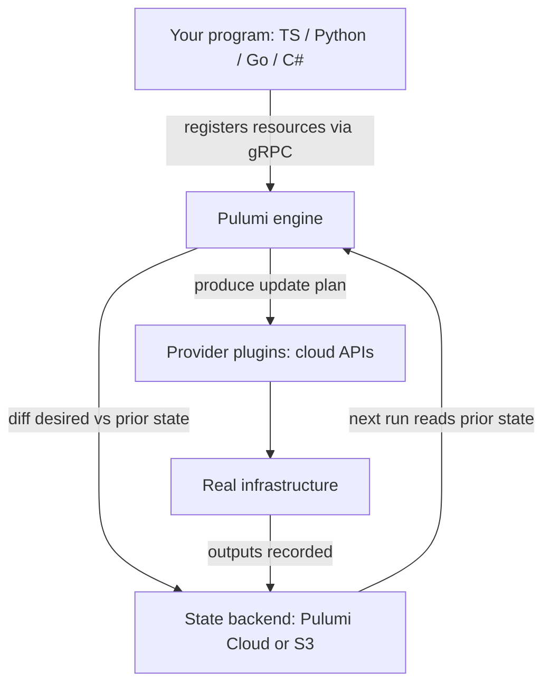
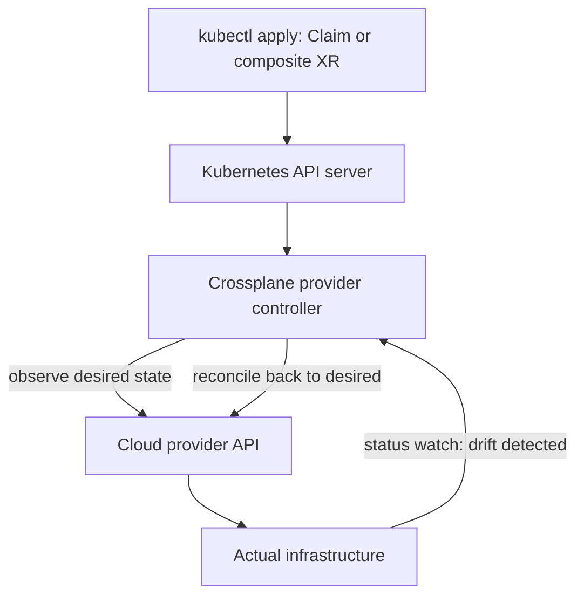
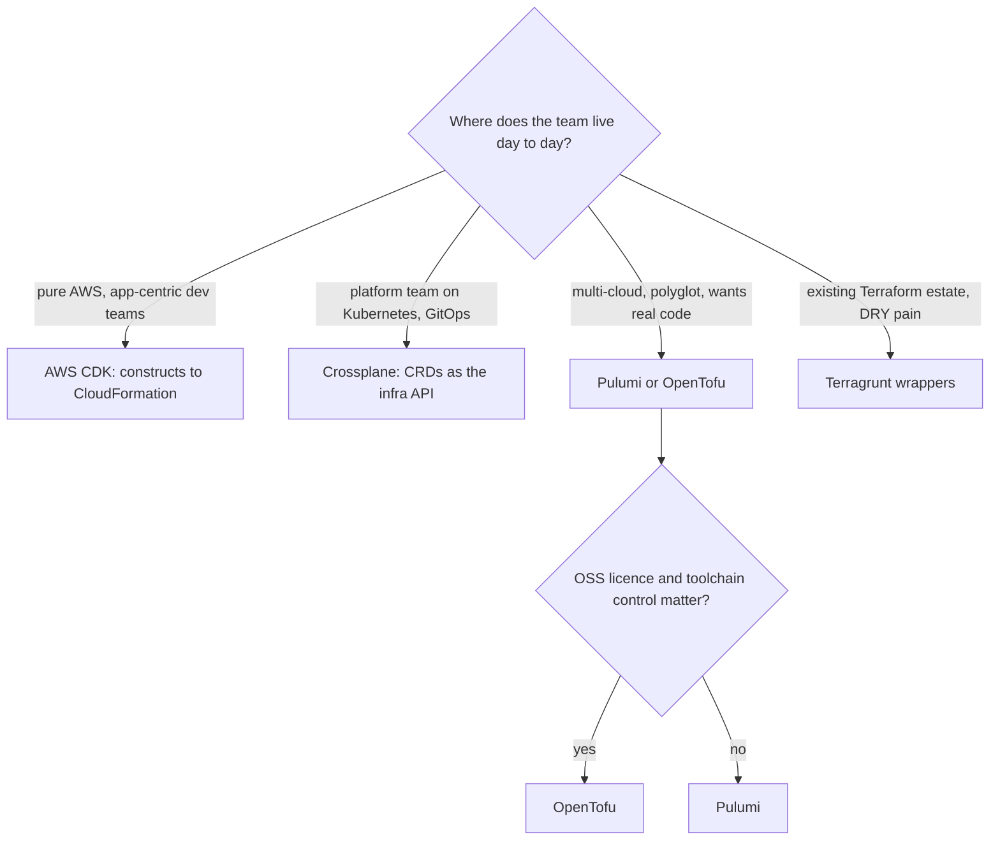

# IaC Beyond Terraform: OpenTofu, Pulumi, CDK & Crossplane

## Overview

Terraform's HCL-plus-state model dominated infrastructure-as-code for a decade, but the 2023 licence change forked its community and, more importantly, clarified what each alternative actually offers: OpenTofu (same model, open licence, faster feature evolution), Pulumi (real programming languages with a state-diff engine), AWS CDK (programming languages compiled down to CloudFormation), Crossplane (infrastructure as Kubernetes CRDs under continuous reconciliation), and Terragrunt (wrappers that make Terraform itself scale). Interviews for platform, DevOps, and SRE roles increasingly ask you to compare these on execution model and state handling — not just syntax. This page gives you the architecture of each, a comparison table, and the reasoning patterns teams actually use to choose. The book's [Terraform](./terraform.md) page covers HCL basics and the core workflow; treat it as the foundation this page builds past.

## The Terraform Licence Fork Story

In August 2023, HashiCorp relicensed Terraform from the permissive MPL 2.0 to the **BUSL 1.1** (Business Source License), restricting competitors from offering Terraform as a service. Each BUSL release converts to MPL after four years, but the community reaction was immediate: within weeks, the OpenTF initiative formed, announced a fork from the last MPL-licensed release (the 1.5.x line), and joined the Linux Foundation as **OpenTofu**. Its first release, 1.6.0, shipped in January 2024, and the project has since moved faster than upstream on several fronts.

What actually differs today is more than a rename of the binary to `tofu`:

- **Licence and governance**: MPL 2.0 under the Linux Foundation, with open design-process RFCs, versus BUSL under HashiCorp's sole stewardship.
- **Registry**: OpenTofu runs its own registry (registry.opentofu.org) with provider and module mirrors, removing the dependence on Terraform Registry infrastructure while remaining protocol-compatible with most providers.
- **State encryption**: native, configurable encryption of state files at rest (introduced in 1.7) — a feature Terraform still requires you to bolt on via backend-side encryption.
- **`removed` blocks**: declarative removal of resources from management without destroying them (1.7), replacing the old `terraform state rm` CLI dance.
- **Early variable/locals validation** (1.6) and **provider-defined functions** (1.7): long-standing community asks that landed in OpenTofu first.
- **Compatibility discipline**: OpenTofu 1.6–1.9 remains drop-in compatible with Terraform 1.5.x state and most modules; divergence is additive, so migration is typically a binary swap plus a state upgrade check.

Two of the flagship features show why the fork matters practically. Native state encryption turns what used to be "trust the S3 bucket policy" into an explicit, versioned config — teams in regulated industries were writing wrapper scripts for this for years. The `removed` block replaces the `terraform state rm` imperative dance with a declarative, reviewable statement of intent:

```hcl
# OpenTofu: stop managing these without destroying them
removed {
  from = aws_cloudwatch_log_group.legacy

  lifecycle {
    destroy = false
  }
}

# and in the backend block: state encryption
terraform {
  backend "s3" {
    bucket = "prod-tofu-state"
    key    = "network/terraform.tfstate"
    encrypt = true
  }
}
```

Interview framing: the fork is less about ideology and more about **who controls the platform's direction**. Expect follow-ups on risk — provider ecosystem compatibility (good so far), module ecosystem split (mitigated by compatibility), and organizational policy on non-OSS toolchains.

## Pulumi: Real Languages, State-First Execution

Pulumi (<https://www.pulumi.com/>) lets you define infrastructure in TypeScript, Python, Go, C#/.NET, Java, or YAML, and keeps the Terraform-style engine but changes the execution model fundamentally: **your program runs**. The Pulumi CLI loads your program, executes it against the engine, and the engine records each resource declaration via an RPC handshake, diffs the desired graph against the prior state, and applies an update plan. This has three architectural consequences.

1. **The language is the abstraction layer.** Loops, functions, classes, type checkers, package managers, and test frameworks all work. No DSL ceiling: if HCL cannot express it, you write a helper; Pulumi never needs `for_each` gymnastics.
2. **Providers ride on Terraform.** The `pulumi-terraform-bridge` wraps thousands of Terraform providers, so resource coverage is inherited rather than rebuilt — a strategic answer to "isn't the ecosystem a blocker?"
3. **State is a first-class product.** The default backend is Pulumi Cloud (state, secrets encryption, policy packs, audit); self-managed backends (S3, Azure Blob, GCS, file) exist for teams that must own state. Secrets are sealed client-side before storage.

The execution flow is the part interviewers drill, so trace it on an example before you walk in:

```typescript
import * as aws from "@pulumi/aws";

const bucket = new aws.s3.Bucket("assets", {
  versioning: { enabled: true },
  serverSideEncryptionConfiguration: {
    rule: { applyServerSideEncryptionByDefault: {
      sseAlgorithm: "aws:kms" } },
  },
});

export const bucketArn = bucket.arn;  // captured into state as an output
```



Trade-offs to state out loud: you inherit a full language runtime in CI (node_modules, venvs, compilation), previews require actually *executing* your program (sandbox or careful review of dynamic behavior), and dynamic resources or multi-language teams can fragment conventions. Pulumi's own policy engine (CrossGuard) and Automation API (embedding deployments in code) are the usual answers to governance and programmatic control.

## AWS CDK: Constructs Down to CloudFormation

The AWS CDK (<https://aws.amazon.com/cdk/>) is a different bet: instead of owning state and planning, it **synthesizes CloudFormation templates**. You write TypeScript/Python/Java/C#/Go against *constructs* — AWS's curated classes — and `cdk synth` compiles your object graph into a CloudFormation template. `cdk diff` shows the CloudFormation change set; `cdk deploy` hands it to CloudFormation, which owns the state.

The construct ladder is the vocabulary interviews expect:

| Level | What it is | Example |
|---|---|---|
| **L1** | Raw CloudFormation resource (generated, `Cfn*` prefix) | `CfnBucket` — every property explicit |
| **L2** | AWS-authored wrapper with sane defaults and methods | `Bucket` — adds encryption defaults, `grantRead()`, `onEvent()` |
| **L3** | Patterns composing multiple resources for an architectural intent | `LambdaRestApi`, `ApplicationLoadBalancedFargateService` |

Because CloudFormation is the substrate you inherit its properties wholesale: drift detection and rollback come from CF, IAM is validated before apply, and there is no separate state file to lock or lose — but also its liabilities: template size limits (53,200 bytes for direct CF, effectively bypassed via nested stacks since CDK stacks are CF stacks), stack update semantics, and the CF provisioning wait times. Bootstrap (an artifacts bucket plus deployment roles) is a recurring operational gotcha in restricted accounts. Governance hooks are strong: **Aspects** can visit every construct during synthesis to enforce policy (this is how `cdk-nag` works), which maps directly onto the policy-as-code patterns in [../cloud/policy-as-code.md](../cloud/policy-as-code.md).

The daily command rhythm is worth knowing cold, since interviewers sometimes ask "walk me through deploying a change":

```bash
cdk synth        # app -> CloudFormation template (inspectable JSON/YAML)
cdk diff         # compare synthesized template against deployed stack
cdk deploy       # hand the change set to CloudFormation and wait
cdk destroy      # tear down the stack and everything it owns
```

Notice what is missing: there is no plan file to store and no state lock to respect — `synth` is deterministic given the same inputs, and CloudFormation owns serialization. That makes CDK pipelines simpler in AWS-only orgs and completely inapplicable outside AWS.

## Crossplane: The Control-Plane Model

Crossplane (<https://www.crossplane.io/>) reframes the question: instead of a pipeline that *converges once per apply*, run a **control plane** — Kubernetes itself — that *reconciles continuously*. Infrastructure types become CRDs; each provider installs controllers that watch those CRDs and drive cloud APIs; desired state lives in the API server; drift is self-healing because the reconcile loop never stops.

The composition machinery is what makes it more than "Terraform in a pod":

- **XRDs (CompositeResourceDefinitions)** define your organization's opinionated resource types — a `PostgreSQLInstance` with exactly the fields platform engineers want to expose (class, size, HA) and nothing else.
- **Compositions** map a composite to a set of managed resources (the actual RDS instance, subnet group, monitoring) with patching logic that translates user intent into provider plumbing.
- **Claims** are namespaced objects application teams create with `kubectl` — self-service infrastructure without portal tickets, reviewable in Git and deployable through GitOps (see [../cloud/cicd/gitops.md](../cloud/cicd/gitops.md)).



The honest trade-off discussion: Crossplane buys continuous reconciliation and a native self-service API, at the cost of running Kubernetes itself as a critical platform component, composing logic in YAML/patches (or function pipelines in recent versions), and thinking in CRD lifecycles. Teams already invested in Kubernetes operators and GitOps adapt quickly; others find the conceptual overhead high.

## Terragrunt: Wrapping Terraform Without Tears

Terragrunt (<https://terragrunt.gruntwork.io/>) is not an alternative engine — it is a wrapper that fixes Terraform's scaling pain points. Its three headline features map directly to the questions in [terraform.md](./terraform.md)'s thin coverage of multi-environment layout:

1. **DRY backend configuration.** A single `remote_state` block in the root `terragrunt.hcl` generates backend config for every module, so fifty environments don't each copy-paste an S3/DynamoDB block. `generate` blocks extend this to provider config and other files.
2. **Dependency wiring.** `dependency` blocks read outputs from other Terragrunt units (e.g., the VPC ID from the network stack), replacing brittle `terraform_remote_state` chains, with explicit dependency graphs.
3. **Bulk operations.** `terragrunt run --all apply` (formerly `run-all`) walks the DAG and applies units in dependency order with concurrency control — the primitive underneath most "Terraform monorepo" setups.

A minimal terragrunt layout makes the DRY mechanics concrete — one root config, one child unit:

```hcl
# root.hcl — shared once for the whole repo
remote_state {
  backend = "s3"
  config = {
    bucket         = "myapp-terraform-state-${get_aws_account_id()}"
    key            = "${path_relative_to_include()}/terraform.tfstate"
    region         = "us-east-1"
    encrypt        = true
    dynamodb_table = "myapp-locks"
  }
}

# prod/network/terragrunt.hcl — a unit
terraform {
  source = "../../modules/vpc"
}
include "root" {
  path = find_in_parent_folders("root.hcl")
}
```

The cost model: one more layer of `.hcl` indirection that new joiners must learn, occasional surprising interactions between Terragrunt caching and Terraform versions, and a wrapper whose features lag or lead upstream depending on the release. In 2024+ the project added first-class "stacks" for unit-of-deployment grouping, and it now explicitly supports OpenTofu as the underlying binary — a common pairing post-fork.

## State Management Across Tools

State is the load-bearing wall of every IaC system, and each tool solves it differently — this is the single most common deep-dive interview topic. Terraform/OpenTofu store a JSON snapshot mapping resource addresses to real infrastructure IDs in a remote backend (S3 + DynamoDB locking, GCS, Azure Blob, Postgres, or TFC/TFE), and every plan is a three-way merge of that snapshot, the config, and a live refresh. Pulumi stores a *resource graph* — richer than a flat map, since it captures dependencies, outputs, and per-operation checkpoints — with secrets sealed client-side before they touch the backend. CDK owns no state file because CloudFormation stacks are the state. Crossplane pushes state into etcd as CR status, with finalizers governing deletion ordering.

The questions to be fluent in: **Who can corrupt state?** (anyone with backend write access, or a broken provider upgrade mid-apply). **What happens on state loss?** (re-import via `import` blocks, CF stack re-adoption, or Crossplane recreating from spec — the recovery story differs sharply). **Where do secrets leak?** (Terraform state stores resource attributes in plaintext unless backend-side encryption covers it; OpenTofu 1.7+ adds client-side encryption; Pulumi seals values before storage). **How do you stage changes safely?** (separate state per environment, never shared). A practical layout to cite: one state per environment per component, locking enabled, least-privilege CI role per state, and backups before any manual `state` surgery.

| Tool | State location | Locking | Encryption | Lost-state recovery |
|---|---|---|---|---|
| Terraform | Remote backend (S3, GCS, Azurerm, TFC) | Backend locks (DynamoDB, etc.) | Backend-side only | `import` blocks, re-adoption |
| OpenTofu | Same backends as Terraform | Same | **Native client-side state encryption** | Same, plus encrypted backup format |
| Pulumi | Pulumi Cloud or object storage | Backend-level | Secrets sealed client-side | Refresh/re-import from graph |
| AWS CDK | CloudFormation stack | CF handles serialization | CF service-side | CF drift detection + re-adoption |
| Crossplane | Kubernetes etcd (CR status) | API-server serialization | k8s secrets mechanics | Controller recreates from spec |

## Plan/Apply Safety and Drift Handling

Interviewers bundle these because they are the operational core of "IaC that does not page you at 2 a.m.". Plan/apply safety is a pipeline design problem: plan in CI on every PR and post the diff to the pull request (the Atlantis pattern, or CDK's `cdk diff`), gate apply behind approval, serialize applies per state with locking, and separate the CI credentials that plan (read-only) from those that apply (scoped role). The policy hook belongs here too — run OPA/conftest-style checks against the plan JSON before an apply is even offered for approval, which is exactly the pipeline described in [../cloud/policy-as-code.md](../cloud/policy-as-code.md).

Drift has three sources worth naming: **console changes** (humans clicking), **actor changes** (AWS autoscaling, controllers, and schedulers mutating resources the config also claims), and **provider version drift** (upgrades that change how the same config reads). Terraform detects drift via plan/apply with refresh (`-refresh-only` makes detection explicit), CDK delegates to CloudFormation drift detection, and Crossplane is the outlier: reconciliation is continuous and self-healing by design. The remediation question is where judgment shows — auto-revert is correct for platform-owned resources and dangerous for production resources someone hand-fixed during an incident, so mature teams encode an exception process (an acknowledged-drift annotation, or moving the resource out of management) rather than choosing uniformly.

## Comparison Table

| Dimension | Terraform / OpenTofu | Pulumi | AWS CDK | Crossplane | Terragrunt |
|---|---|---|---|---|---|
| Language | HCL | TS/Py/Go/C#/Java/YAML | TS/Py/Java/C#/Go | YAML CRDs + compositions (+ functions) | HCL wrapper layers |
| Execution | Plan/apply against state | Your program executes, engine diffs | Synthesize to CloudFormation | Continuous reconciliation | Delegates to Terraform/OpenTofu |
| State store | Remote backend + locking (S3/DynamoDB, etc.) | Pulumi Cloud or self-managed blob | CloudFormation stack (implicit) | Kubernetes etcd | Same as Terraform |
| Drift handling | Detect via plan/refresh; manual fix | Detect via refresh/preview | CF drift detection | **Auto-heals** via reconcile loop | Inherits Terraform behavior |
| Ecosystem | Largest module/provider ecosystem | Bridges most TF providers | AWS-only, first-party | Growing providers, k8s-native | Add-on to TF ecosystem |
| Primary lock-in | HCL + state format | Engine + state backend | AWS + CloudFormation | Kubernetes control plane | Directory conventions |
| Best fit | Multi-cloud standard | Polyglot teams wanting real code | AWS-only orgs standardizing on CF | Platform teams selling self-service | Existing TF estates needing DRY |

## How Teams Actually Choose

In practice the decision is driven less by feature checklists than by team topology and organizational gravity. A useful interview answer walks the decision tree, then concedes reality — most organizations run *two* of these tools simultaneously (e.g., CDK for application teams on AWS, OpenTofu for shared platform resources).



Concrete patterns worth citing:

- **CDK for app teams, Terraform/OpenTofu for platform resources** is extremely common in AWS-heavy orgs; CDK's speed of iteration for app infrastructure beats hand-rolled L1 templates, while the platform team keeps the foundational state.
- **Pulumi wins where the IaC is genuinely programmatic** — dynamic environments, generated resource sets, embedding deployments in product code via Automation API.
- **Crossplane wins where the deliverable is an internal platform**: golden-path resource types, GitOps-native, self-service claims, drift self-healing as a support-cost reducer.
- **Terragrunt is a scaling patch, not a strategy** — it signals Terraform success (many environments/modules) and usually coexists with the chosen engine for years.

Migration is the tiebreaker scenario interviewers add ("we pick X — how do we get there?"). The sane pattern is incremental: pick one subsystem with low blast radius, stand up the new tool alongside the old, import existing resources into the new state model (`tofu import` blocks, Pulumi import, CloudFormation resource re-adoption, Crossplane's ability to adopt pre-existing cloud resources), and only then widen. Dual-running is expensive, so cap it: a dated decommission plan for the old pipeline beats an open-ended "we'll finish migrating eventually". Finally, wire the new tool into the same guardrails as the old one — same plan-review flow, same policy checks — so governance does not regress during transition.

## Interview Traps and How to Answer Them

Certain questions in this space are traps designed to see whether you memorized marketing or understand mechanisms. **"Which tool is best?"** — trap; the answer is a decision procedure, not a name (walk the team-topology tree above, and say out loud that most orgs run two tools). **"Terraform state is lost — what now?"** — do not say "recreate everything"; say: restore from backend versioning/backup first, then re-import what cannot be restored, and the deeper answer is prevention (versioned, locked, encrypted backends; restricted write access). **"Can we just use Ansible for infrastructure?"** — the honest answer is that Ansible is procedural configuration management with no persistent state, so it handles machine configuration well and infrastructure convergence poorly; point at [./ansible.md](./ansible.md) for the boundary. **"Why not keep everything in CloudFormation?"** — fine for AWS-only teams, but you lose multi-cloud portability and the provider ecosystem; that is a legitimate trade if you will never leave AWS.

Finally, when asked to compare tools you have not used, compare *architectures* — state model, execution model, ecosystem — and say you would time-box a proof of concept on the deciding workload. Interviewers consistently reward the candidate who can derive a recommendation from first principles over the one who defends a tool affiliation.

## Cross-References

- [Terraform](./terraform.md) — HCL syntax, resources, plan/apply workflow; deliberately thin, so this page is its scaling-and-alternatives complement.
- [Ansible](./ansible.md) — configuration management vs provisioning; the classic "which tool where" pairing.
- [IaC Overview](./README.md) — section index and core concepts.
- [Packer](../cloud/packer.md) — image building, the piece IaC tools deliberately do not own.
- [GitOps](../cloud/cicd/gitops.md) — how Crossplane and Terraform plans get enforced through Git.
- [Argo CD](../cloud/cicd/argocd.md) — the GitOps controller most Crossplane deployments pair with.
- [Policy as Code: OPA, Kyverno & Falco](../cloud/policy-as-code.md) — guarding plan outputs and cloud APIs with policy engines.

## References

- OpenTofu — open-source Terraform fork: <https://opentofu.org/>
- Pulumi — infrastructure as code in real languages: <https://www.pulumi.com/>
- HashiCorp Terraform documentation: <https://developer.hashicorp.com/terraform>
- AWS CDK documentation: <https://aws.amazon.com/cdk/>
- Crossplane — the cloud-native control plane: <https://www.crossplane.io/>
- Terragrunt — DRY Terraform/OpenTofu wrappers: <https://terragrunt.gruntwork.io/>

## Interview Questions

1. **What actually changed in the Terraform → OpenTofu fork, and what are the migration risks?** HashiCorp moved Terraform from MPL 2.0 to BUSL 1.1 in August 2023; the community forked the last MPL release (1.5.x) as OpenTofu under the Linux Foundation, first releasing 1.6.0 in January 2024. OpenTofu adds native state encryption, `removed` blocks, early variable validation, and provider-defined functions, while keeping state/module compatibility with Terraform 1.5.x. Risks are ecosystem drift over time, registry reliance (mitigated by OpenTofu's own registry), and organizational policy on BUSL. Migration is usually a binary swap plus a state compatibility check.
2. **Describe Pulumi's execution model. Why does "your program runs" matter?** Pulumi executes your TS/Python/Go/C# program, which registers resource declarations with the engine over RPC; the engine diffs the desired graph against prior state and applies a plan — so the language's full expressiveness (loops, functions, types, tests) is available. It matters because it removes the DSL ceiling and enables genuine abstractions and unit tests. The costs are running a language runtime in CI, previews executing real code, and state living in Pulumi Cloud or a self-managed backend.
3. **How does AWS CDK handle state, and what do you inherit from CloudFormation?** CDK has no state file of its own: `cdk synth` compiles constructs into a CloudFormation template, and CloudFormation owns all state. You inherit CF's drift detection, rollback semantics, IAM pre-validation, and change sets, plus its constraints — stack update behavior, provisioning latency, and the bootstrap bucket/roles prerequisite. Constructs come in L1 (raw CF resources), L2 (curated wrappers with defaults and helper methods), and L3 (architectural patterns). Aspects give you synthesis-time policy enforcement across the whole tree.
4. **What is fundamentally different about Crossplane's drift handling compared to Terraform?** Terraform converges once per plan/apply; between applies, manual changes or out-of-band edits persist until someone notices via drift detection and manually reconciles. Crossplane runs continuous reconciliation loops: provider controllers watch CRDs and re-drive cloud APIs back to the declared state, so drift self-heals automatically. That reduces support burden but changes failure modes — controllers must be trusted, out-of-band fixes get reverted, and the Kubernetes control plane becomes critical infrastructure. Expect the follow-up: "do you always want auto-revert?" (Often yes for platform resources, dangerous for hand-fixed production exceptions.)
5. **When would you choose Terragrunt, and what problems does it actually solve?** Terragrunt fits when a Terraform/OpenTofu estate has grown to many environments and modules: it deduplicates backend and provider config via `remote_state`/`generate` blocks, wires cross-module dependencies through `dependency` outputs instead of fragile remote-state chains, and applies units in dependency order with `run --all`. It is a wrapper, not an alternative engine, so you accept an extra HCL layer and version-coupling concerns in exchange for maintainability at scale. It pairs naturally with OpenTofu post-fork.
6. **How do these tools differ on plan/apply safety in CI pipelines?** Terraform/OpenTofu and Pulumi both produce explicit plans that can be posted to PRs and gated on approval; the state file plus locking makes concurrent applies the key hazard, so pipelines must serialize per-state. CDK delegates safety to CloudFormation change sets and stack policies. Crossplane has no plan step at all — safety shifts to Git review of CRD manifests and admission policies before the change even reaches the control plane. A strong answer mentions pairing any of these with OPA/Sentinel-style policy checks on the plan or manifest.
7. **Your team is multi-cloud, polyglot, and has been fighting HCL for two years. What do you recommend and why?** I would shortlist Pulumi and OpenTofu, then decide on governance rather than syntax: Pulumi if the team wants real languages everywhere, strong state tooling, and is comfortable with the engine backend; OpenTofu if OSS licence control and ecosystem continuity with existing modules/providers dominate. Either way, plan the migration incrementally — one subsystem at a time, importing existing resources into the new state model, keeping Terragrunt-style conventions for layout. I would also flag that the "HCL pain" should be audited first: some of it is really module-design problems that will follow you to any tool.
