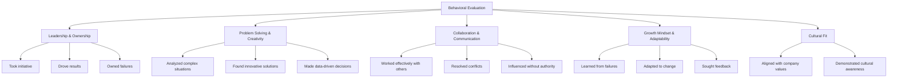
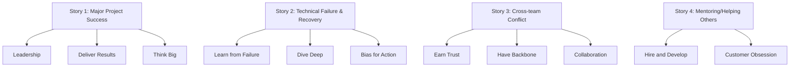

# Behavioral Interview Preparation

> *"People don't care how much you know until they know how much you care."* — Theodore Roosevelt

## Why Behavioral Interviews Matter

Behavioral interviews are often the **most underestimated** part of the interview process. Many candidates focus entirely on coding and system design, only to be eliminated in the behavioral round.

**Key insight:** At Amazon, behavioral interviews carry **equal or greater weight** than technical rounds. At Google, "Googleyness" is a separate signal that can override technical performance. At Meta, "Move Fast" values drive behavioral evaluation.

## What Interviewers Evaluate

## The STAR Method

The STAR method is the gold standard for structuring behavioral answers. Interviewers at Amazon, Google, Microsoft, and Meta explicitly look for STAR-structured responses.

### Structure

| Component | What to Include | Time Allocation |
|-----------|----------------|-----------------|
| **Situation** | Set the scene — context, constraints, stakes | 15-20% |
| **Task** | Your specific responsibility or goal | 10-15% |
| **Action** | What YOU did (not the team) — be specific | 50-60% |
| **Result** | Quantified outcome + what you learned | 15-20% |

### Example: Strong STAR Answer

**Question:** *"Tell me about a time you had to deal with a difficult technical decision under pressure."*

> **Situation:** Our team was building a real-time notification system for 10M+ users. Two weeks before launch, we discovered our message broker (RabbitMQ) couldn't handle the projected peak load — it was dropping messages at 50K msg/sec, but we needed 200K msg/sec.
>
> **Task:** As the tech lead, I needed to decide: delay the launch to re-architect with Kafka, or find a workaround that could ship on time.
>
> **Action:** I ran a 48-hour spike to benchmark three options: (1) RabbitMQ with clustering, (2) Kafka, (3) Redis Streams. I created a decision matrix weighing time-to-implement, operational complexity, and performance. Kafka hit our throughput but required 2 weeks for the team to learn. I proposed a hybrid: use Redis Streams for the hot path (notifications) and keep RabbitMQ for lower-volume audit events. I wrote the migration plan, pair-programmed the critical paths with two engineers, and set up load testing to validate before launch.
>
> **Result:** We shipped on time. Redis Streams handled 300K msg/sec with sub-millisecond latency. The hybrid approach reduced our message infrastructure cost by 40%. The post-mortem led to a new team practice: load testing all critical paths 4 weeks before launch, not 2. This became a standard checklist item for all future launches.

### What Makes This Answer Strong

- **Specific numbers** — 10M users, 50K vs 200K msg/sec, 48-hour spike, 40% cost reduction
- **Shows ownership** — "I ran," "I proposed," "I pair-programmed"
- **Demonstrates technical depth** — Kafka vs RabbitMQ vs Redis Streams trade-offs
- **Includes learning** — New practice adopted by the team
- **Shows leadership** — Made a tough call and executed under pressure

## Common Behavioral Question Categories

### 1. Leadership & Ownership

| Question | What They're Assessing |
|----------|----------------------|
| Tell me about a time you led a project from start to finish | Initiative, planning, execution |
| Describe a situation where you had to make a decision without complete information | Judgment, risk-taking |
| Tell me about a time you took ownership of something outside your job description | Initiative, going above and beyond |
| Give an example of when you had to persuade others to adopt your idea | Influence, communication |

### 2. Problem Solving

| Question | What They're Assessing |
|----------|----------------------|
| Tell me about the most complex technical problem you've solved | Technical depth, analytical thinking |
| Describe a time you had to make a trade-off between speed and quality | Judgment, pragmatism |
| Tell me about a time you used data to make a decision | Data-driven thinking |
| Give an example of when you simplified a complex system | Systems thinking, elegance |

### 3. Collaboration & Conflict

| Question | What They're Assessing |
|----------|----------------------|
| Tell me about a time you disagreed with your manager | Conflict resolution, professionalism |
| Describe a situation where you had to work with a difficult team member | Empathy, communication |
| Tell me about a time you received critical feedback | Humility, growth mindset |
| Give an example of when you helped a struggling teammate | Leadership, empathy |

### 4. Failure & Learning

| Question | What They're Assessing |
|----------|----------------------|
| Tell me about your biggest professional failure | Self-awareness, learning |
| Describe a time a project you were on failed | Accountability, resilience |
| Tell me about a time you made a wrong technical decision | Humility, learning |
| Give an example of when you had to pivot your approach | Adaptability |

### 5. Amazon Leadership Principles (LPs)

Amazon's behavioral interviews are entirely structured around their 16 Leadership Principles:

| Principle | Key Question Pattern |
|-----------|---------------------|
| **Customer Obsession** | "Tell me about a time you went above and beyond for a customer" |
| **Ownership** | "Describe a time you took on something outside your role" |
| **Invent and Simplify** | "Give an example of when you simplified something complex" |
| **Are Right, A Lot** | "Tell me about a time you made a decision that was unpopular but correct" |
| **Learn and Be Curious** | "How do you stay current with technology?" |
| **Hire and Develop the Best** | "Tell me about a time you mentored someone" |
| **Insist on the Highest Standards** | "Describe a time you raised the bar for your team" |
| **Think Big** | "Tell me about a vision you set for your team" |
| **Bias for Action** | "Give an example of when you had to move fast" |
| **Frugality** | "Tell me about a time you accomplished more with less" |
| **Earn Trust** | "Describe a time you had to deliver bad news" |
| **Dive Deep** | "Tell me about a time you found a root cause through deep analysis" |
| **Have Backbone; Disagree and Commit** | "Tell me about a time you disagreed with your team" |
| **Deliver Results** | "Describe your most significant achievement" |

## Preparing Your Story Bank

### The 8-Story Framework

Prepare 8-10 versatile stories that can be adapted to different question types:

### Story Template

For each story, prepare:

| Element | Notes |
|---------|-------|
| **Context** | Company, team size, project, timeline |
| **Challenge** | The specific problem or constraint |
| **Your Role** | What YOU specifically owned |
| **Actions** | 3-5 specific steps you took |
| **Results** | Numbers, metrics, impact |
| **Learning** | What you'd do differently, what you learned |
| **Adaptability** | Which question types can this story answer? |

## Tips for Success

### DO

1. **Quantify everything** — "Reduced latency by 40%" is better than "improved performance"
2. **Use "I" not "we"** — Interviewers want YOUR contribution
3. **Be specific** — Name the technology, the metric, the timeline
4. **Show self-awareness** — Acknowledge what you'd do differently
5. **Practice aloud** — Silent rehearsal doesn't build fluency
6. **Prepare for follow-ups** — Interviewers will probe deeper
7. **Tailor to the company** — Amazon LPs, Googleyness, Meta's Move Fast

### DON'T

1. **Don't be vague** — "We improved things" tells the interviewer nothing
2. **Don't badmouth others** — Even if they were the problem
3. **Don't take all credit** — Acknowledge team contributions while highlighting your role
4. **Don't use ancient examples** — Within 2 years preferred
5. **Don't memorize scripts** — Know the key points, deliver naturally
6. **Don't panic on "Tell me about a failure"** — It's about learning, not perfection

## In This Section

| Guide | Description |
|-------|-------------|
| [STAR Method](./star.md) | Deep dive into structuring your answers |
| [Common Questions](./common.md) | 50+ questions with detailed sample answers |

## Related Sections

- [Company-Specific Behavioral Tips](../companies/README.md) — Each company has different behavioral expectations
- [Revision Notes](../../revision/architecture.md) — Technical leadership questions often overlap with architecture

## References

- [Cracking the Coding Interview — Behavioral Chapter](https://www.crackingthecodinginterview.com/) — Gayle Laakmann McDowell
- [Amazon Leadership Principles](https://www.amazon.jobs/content/en/our-workplace/leadership-principles) — Official Amazon page
- [STAR Method Explained](https://www.themuse.com/advice/star-interview-method) — The Muse
- [The STAR Method: The Secret to Acing Your Next Job Interview](https://www.indeed.com/career-advice/interviewing/how-to-use-the-star-interview-response-technique) — Indeed
- [How to Answer Behavioral Interview Questions](https://www.levels.fyi/blog/common-behavioral-interview-questions.html) — Levels.fyi
