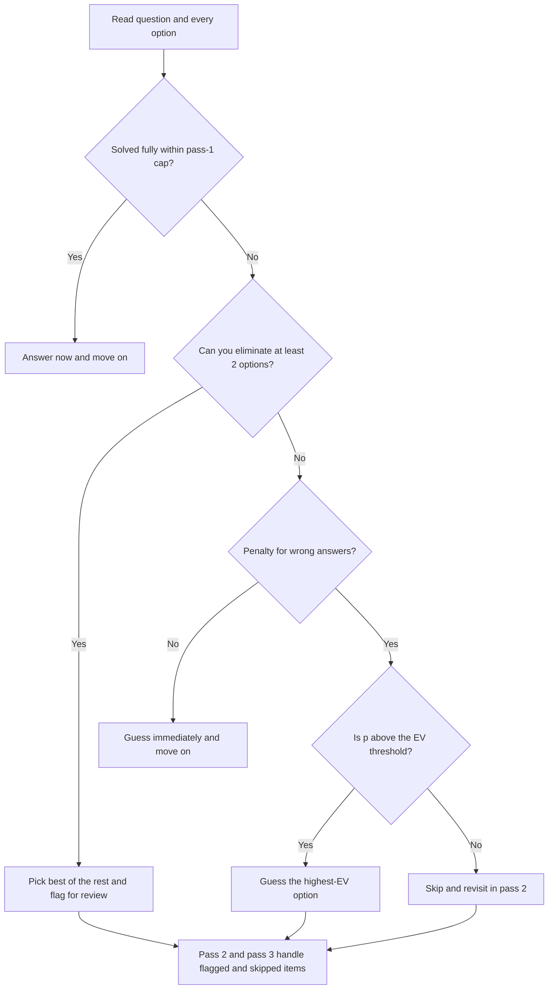

# MCQ Strategies for Online Assessments

## Overview

MCQ sections in OAs test breadth over depth. You face 15–30 questions covering CS fundamentals, output prediction, and sometimes quantitative aptitude, usually with 60–120 seconds available per question. Speed and accuracy both matter, and unlike coding problems, every question is winnable with the right elimination discipline — even when you cannot derive the answer from scratch. This page covers pacing math, the guess-vs-skip decision, elimination techniques, distractor patterns, and section-wise playbooks for the four most common question sources: OS, DBMS, Networks, and OOP.

## High-Yield Topics

| Category | High-Yield Topics | Frequency |
|----------|-------------------|-----------|
| **OS** | Process vs thread, deadlock conditions, scheduling (SJF, RR), virtual memory, page replacement | Very High |
| **DBMS** | SQL joins, normalization (1NF–3NF, BCNF), ACID properties, indexing (B-tree vs hash), isolation levels | Very High |
| **Networks** | TCP vs UDP, TCP 3-way handshake, HTTP methods/status codes, DNS, OSI layers | High |
| **OOP** | Polymorphism, encapsulation, inheritance, abstract class vs interface, virtual functions | High |
| **DSA** | Time complexity of operations, BST vs hash map, stack vs queue use cases, graph representations | Medium |
| **Output Prediction** | C/C++ pointer arithmetic, Python pass-by-object-reference, operator precedence, short-circuit evaluation | Very High |
| **Aptitude** | Probability, permutations/combinations, percentages, work-time problems | Medium |

Treat this table as an inventory for the last 48 hours before the exam, not a syllabus to learn from scratch. Each row maps to one cheat-sheet page in this book, listed under Cross-References at the bottom. If you can answer the three worked questions in each section playbook below without hesitation, your fundamentals are in exam shape.

## Pacing Mathematics for 30Q / 60min Exams

The nominal rate for a 30-question, 60-minute exam is \\( \frac{3600\ \text{s}}{30} = 120\ \text{s per question} \\), but spending the nominal rate on every question guarantees you run out of time on the hard tail. The fix is a three-pass plan that buys time by spending very little on pass 1. For 30 questions at 25 seconds each, pass 1 consumes \\( 30 \times 25 = 750\ \text{s} \approx 12.5\ \text{min} \\), leaving 47.5 minutes for everything else. Pass 2 spends 90 seconds on each flagged question, and pass 3 distributes whatever remains as pure guessing or final verification.

| Exam shape | Nominal rate | Pass-1 cap per Q | Pass-2 cap per Q | Reserve |
|------------|--------------|------------------|------------------|---------|
| 30 Q / 60 min | 120 s | 45 s | 90 s | 5 min |
| 20 Q / 30 min | 90 s | 40 s | 75 s | 3 min |
| 50 Q / 30 min | 36 s | 20 s | 30 s | 3 min |
| 15 Q / 45 min | 180 s | 60 s | 120 s | 5 min |

The pass-1 cap matters more than the nominal rate because it protects you from the most common failure: burning 5 minutes on question 3 and rushing the last 10. If a question resists the cap, mark it and move on without regret — flagged questions get a second, better-funded attempt. The reserve column is untouchable time for transcribing answers, re-checking select-all questions, and recovering from a platform freeze.

## The Three-Pass System

- **Pass 1 — harvest:** answer every question you can solve in one shot, at or under the pass-1 cap. Flag anything uncertain instead of fighting it. The goal is to bank all easy points while your mind is fresh, not to finish the paper.
- **Pass 2 — grind:** return to flagged questions with the full pass-2 budget each. Use elimination, dimensional analysis, and partial derivation. In most exams 60–70% of flagged questions fall in this pass.
- **Pass 3 — sweep:** distribute remaining time across true unknowns. Apply the guess-vs-skip rule from the next section, then spend any leftover reserve re-checking arithmetic in output-prediction questions, where a single flipped sign is the difference between correct and wrong.

**Adaptive tests** (AMCAT, some Codility MCQ modules): You cannot skip or return. Read each question carefully the first time, and mentally commit before confirming — there is no revisit. In adaptive formats the pass-1 cap becomes a hard per-question cap.

## Negative Marking and the Guess-vs-Skip Decision

Whether to guess is not a feeling — it is arithmetic. Let \\( p \\) be your probability of being right and let the marking scheme be \\( +1 \\) for correct and \\( -\tfrac{1}{4} \\) for wrong. Then the expected value of a guess is:

\\[ \text{EV} = p \cdot (+1) + (1 - p) \cdot \left(-\tfrac{1}{4}\right) = 1.25\,p - 0.25 \\]

The guess is profitable exactly when \\( \text{EV} > 0 \\), i.e. when \\( p > 0.2 \\). That threshold is the whole point: with a quarter penalty, a blind 1-in-4 guess is break-even, and *any* elimination that pushes you above 25% makes guessing correct. With a full-value penalty (\\( +1 / -1 \\)) the threshold rises to \\( p > 0.5 \\), and with no penalty the threshold is \\( p > 0 \\) — you always guess.

| Marking scheme | Blind guess (p = 0.25) | 50-50 after elimination | 33% after eliminating 2 | Rule of thumb |
|----------------|------------------------|-------------------------|--------------------------|---------------|
| +1 / −0.25 | EV = 0 (break-even) | EV = +0.375 → **guess** | EV = +0.167 → **guess** | Guess after eliminating even one option |
| +1 / −1 | EV = −0.5 → **skip** | EV = 0 (break-even) | EV = −0.33 → **skip** | Guess only when more likely right than wrong |
| +2 / −0.5 | EV = +0.375 → **guess** | EV = +0.75 → **guess** | EV = +0.5 → **guess** | Almost always guess |
| No penalty | EV = +0.25 → **guess** | EV = +0.5 → **guess** | EV = +0.67 → **guess** | Never leave blanks |
| Partial (0 on wrong, 0 on skip) | EV = +0.25 → **guess** | EV = +0.5 → **guess** | EV = +0.67 → **guess** | Never leave blanks |

Worked example: you have eliminated two of four options on a +1/−0.25 exam, so \\( p \approx \tfrac{1}{2} \\) at worst and EV \\( = 1.25(0.5) - 0.25 = +0.375 \\). Over 10 such questions, guessing nets about \\( +3.75 \\) marks in expectation versus zero for skipping. Declining this edge across a whole paper routinely costs a rank band in GATE-style exams, where 2–3 marks separate thousands of candidates.

## Elimination Techniques

### Process of Elimination (POE)

1. **Eliminate absolutes**: Options with "always" or "never" are usually wrong unless the statement is trivially true. Counter-example to memorize: "A deadlock requires circular wait" is absolute *and* true — absolutes are a prior, not a verdict.
2. **Eliminate nonsensical complexity classes**: If a complexity question about a simple array traversal offers O(n log log n) or O(n³) alongside O(n) and O(log n), the exotic classes are decoys — trivial loops do not hide logarithms of logarithms.
3. **Eliminate contradicted options**: If two options are exact negations of each other, at most one can be correct, and often the exam writer has hidden the true statement in one of them — narrow to that pair and reason carefully.
4. **Eliminate out-of-scope answers**: An OS scheduling question will not have a DBMS-flavored correct answer. Options that belong to a different chapter are usually there to punish skimmers.

**Worked example.** "Which scheduling algorithm can cause starvation? A) FCFS B) Round Robin C) SJF D) None of these." FCFS is not absolutely eliminable, but SJF provably starves long jobs under a stream of short ones, and "None of these" dies once one named algorithm qualifies. Between FCFS and SJF, FCFS is FIFO service — a late long job may wait, but once running it finishes, so it delays rather than starves. Answer: C, reached almost without memorizing the textbook answer key.

### Dimensional and Consistency Checks

For quantitative questions, check units and magnitudes before computing. If the answer should be a count, eliminate options carrying time units; if asking for complexity, O(n log n) and O(n²) are plausible for comparison-based work while O(log n log n) almost never is. For bandwidth or throughput questions, sanity-check that the answer is below the theoretical link capacity — an option claiming 2 Gbps over a 1 Gbps link is a gift. Magnitude works too: an option that is 1000× its neighbors is usually a units error planted on purpose.

### The Sibling-Options Trick

Exam writers build the correct answer first and derive distractors by perturbing it, so distractors cluster. If three options share a structure and one is an outlier ("O(n)", "O(n log n)", "O(n²)" vs. "O(2ⁿ)"), the correct answer is almost always inside the cluster. Similarly, if two options are identical except for one word, the answer usually turns on exactly that word — read the question stem with it in mind.

## Common Distractor Patterns

Distractors are engineered, and recognizing the engineering converts a 2-minute derivation into a 20-second filter. The table below lists the six patterns that account for most wrong answers in technical MCQs, with the defense for each.

| Pattern | What it looks like | Defense |
|---------|--------------------|---------|
| Off-by-one | Options differ by the first or last loop iteration; `to n-1` vs `to n` | Trace with the smallest legal input, n = 1 and n = 2 |
| Swapped complexity | O(n log n) and O(n²) swapped between two algorithms you know | Re-derive in 15 seconds from the master theorem or the loop structure |
| Plausible variable names | Wrong option describes `left`/`right` when the code mutated `low`/`high` | Ignore names; track values in a variable table |
| Near-miss output | Correct output except the first or last element printed | Check loop entry and exit conditions explicitly |
| Reversed operator | `while i < n` vs `while i <= n`; `<` vs `<=` silently changes the count | Count iterations on n = 3 |
| Partial truth | First clause true, second clause false ("…and takes constant time") | Judge each clause independently before judging the option |

The off-by-one family deserves special respect because it hides inside output-prediction questions, not just complexity ones. When two answer options are consecutive integers or lists that differ by one element, the exam is testing whether you counted the boundary iteration. The near-miss pattern pairs with it: whenever options differ only in one element's value, re-trace only the loop boundaries instead of the whole program.

## Decision Flowchart: Answer, Eliminate, or Skip



The flowchart encodes the whole page in one glance: cap your first look, convert elimination into guesses whenever the marking scheme pays for it, and reserve true skips for wrong-answer penalties with low confidence. Practice it on 50 questions in a row until the branching is automatic. Under exam pressure you will fall back to whatever you rehearsed, not to what you read.

## Section-Wise Playbooks

### OS MCQs

OS questions reward exact definitions and small simulations. Memorize the four deadlock conditions (mutual exclusion, hold-and-wait, no preemption, circular wait) as a set, know the Gantt-chart behavior of FCFS, SJF, and Round Robin, and be able to run a page-replacement algorithm by hand on a 3–4 frame reference string. Most OS MCQs are simulations in disguise, so prepare to trace rather than recall.

1. **"Which condition is NOT required for deadlock?"** Options: mutual exclusion, circular wait, preemption, hold-and-wait. Elimination: the classic Coffman set includes three of the four; "preemption" is the opposite of what deadlock needs (deadlock requires *no* preemption). Answer: preemption. The distractor exploits a one-word flip from "no preemption."
2. **"Three processes arrive at t=0 with burst times 5, 2, 8. SJF average waiting time?"** Options: 3.0, 3.33, 5.0, 7.0. Order by burst: 2, 5, 8. Waits are 0, 2, 7, so the average is \\( \tfrac{0+2+7}{3} = 3 \\). Elimination: any option that is not the mean of three small integers comes from wrong ordering (FCFS gives 0 + 5 + 7 = 4) — recompute the sum if your answer differs from 3.0.
3. **"LRU on reference string 1,2,3,1,4 with 3 frames causes how many page faults?"** Trace: 1F, 2F, 3F, 1 hit, 4 evicts 2 → 4 faults. Elimination: options of 3 and 5 are near-misses — 3 ignores the miss on 4, 5 forgets the hit on 1. The variable-table trace above takes 15 seconds and settles it.

### DBMS MCQs

DBMS questions split into SQL semantics and theory (normalization, ACID, indexing). For SQL, the recurring traps are `WHERE` vs `HAVING`, `LEFT JOIN` vs `INNER JOIN`, and `NULL` comparisons returning unknown. For theory, know one crisp sentence per normal form and one concrete anomaly that each level prevents.

1. **"Which join keeps unmatched rows from the left table?"** Options: INNER, LEFT OUTER, RIGHT OUTER, FULL OUTER. Elimination: INNER drops unmatched rows entirely, RIGHT keeps them from the other side, FULL keeps them from both — the stem says "left," so LEFT OUTER. This is a reading-comprehension question wearing a DBMS costume.
2. **"A relation is in 3NF but has a transitive dependency via a non-prime attribute. True or false?"** Elimination: 3NF forbids transitive dependencies on non-prime attributes — that is precisely what BCNF tightens. The pair of options containing "3NF forbids it" versus "3NF allows it" collapses to the definition; answer: false.
3. **"Which index is best for range queries on a column?"** Options: hash index, B+ tree, bitmap, none. Elimination: hash indexes answer equality but scatter ranges, bitmaps suit low-cardinality analytics, so B+ tree. The distractor "hash" is the swapped-complexity pattern applied to data structures — both are "fast indexes," but only one preserves order.

### Networks MCQs

Networks questions cluster on the TCP handshake, DNS resolution, HTTP semantics, and which layer owns which protocol. Layer-mapping questions are free points if you memorize one protocol per layer. Protocol-behavior questions reward knowing what is guaranteed (reliability, ordering) versus what is not (speed, delivery time).

1. **"During the TCP 3-way handshake, the third message carries which flags?"** Options: SYN, SYN+ACK, ACK, FIN. Elimination: SYN starts, SYN+ACK answers, FIN closes — the third message confirms, so ACK. This is a sequence question; near-miss options are the *earlier* steps, exactly the off-by-one pattern applied to a protocol timeline.
2. **"Which transport protocol suits live video streaming?"** Options: TCP, UDP, ICMP, ARP. Elimination: ICMP and ARP are not data transports at all (out-of-scope options), and TCP's retransmission of a stale frame adds delay — streaming tolerates loss, not latency. Answer: UDP.
3. **"Which DNS record maps a hostname to an IPv4 address?"** Options: MX, CNAME, A, AAAA. Elimination: MX routes mail, CNAME aliases names to names, AAAA is IPv6 — the "A" record is the IPv4 answer. The AAAA distractor is a plausible-variable-name trap: same meaning, different width.

### OOP MCQs

OOP questions test definitions and one level of design reasoning: abstract class vs interface, static vs dynamic dispatch, overloading vs overriding. The distractors are usually two correct-sounding definitions swapped between two terms — the swapped-complexity pattern again. Anchor each term to a code-level consequence rather than a slogan.

1. **"A class can implement multiple interfaces but extend only one abstract class. Why?"** Elimination: options blaming syntax are wrong in principle — it is a design choice to avoid ambiguity of inherited state (the diamond problem). Interfaces carry no per-instance state, so multiple inheritance of *type* is safe; the option mentioning state is the only technically grounded one.
2. **"Method overloading is resolved at compile time or run time?"** Elimination: overloading is static binding on the signature; overriding is dynamic dispatch on the receiver's type. The two definitions are always offered swapped — pick "compile time" and move on in 10 seconds.
3. **"Which is true about constructors?"** Options: they can be virtual, they can be inherited, they can be overloaded, they must return void. Elimination: C++ constructors cannot be virtual or inherited; "return void" is a near-miss (constructors have no return type at all, they do not return void). Overloading constructors is legal in essentially every OOP language — that option survives every check.

## Common Trick Questions

Five code-level traps account for a disproportionate share of wrong answers in output-prediction MCQs. Each has a one-line defense, and every one is checkable with a 3-line variable-table trace rather than a full mental run. Review them the night before, then verify them with traces during the exam — recall is fast but traces are what survive pressure.

### 1. Pass-by-Value vs Pass-by-Reference Confusion

```
Python: def modify(lst):
    lst.append(4)
a = [1, 2, 3]
modify(a)
# a is now [1, 2, 3, 4] — list is mutable, passed by object reference
```

Lists mutate through the reference, so the caller sees the change; rebinding the parameter name (`lst = lst + [4]`) would not escape the call. The distractor options are exactly these two behaviors side by side. See [Reading Pseudocode](./pseudocode-reading.md) for the full mutable/immutable table.

### 2. Short-Circuit Evaluation Order

```
# Python: "False and side_effect()" — side_effect() is never called
# C/C++: Same behavior with && and ||
```

Both languages guarantee left-to-right evaluation with short-circuiting, so a guard like `if (p != NULL && p->x > 0)` is safe and an option claiming the second operand "may still execute" is wrong. The mirror trap is `or`/`||`: when the left side is truthy, the right side is skipped. Questions attach side effects (prints, increments) to the skipped operand and ask what ran — the answer is "nothing."

### 3. Integer Division Traps

```
Python 3: 5 / 2 = 2.5  (true division)
Python 2: 5 / 2 = 2    (floor division)
C/Java:   5 / 2 = 2    (integer division)
```

When an MCQ shows the same expression under multiple languages, the exam is testing whether you track the language, not the arithmetic. Negative operands add the floor-vs-truncate split: `-7 // 2` is `-4` in Python but `-7 / 2` is `-3` in C. Options that differ only in sign are the giveaway that this is the trap being tested.

### 4. Operator Precedence

```
# Bitwise & has lower precedence than ==
if (a & b == 0)   # Parses as (a & (b == 0)), NOT ((a & b) == 0)
```

This precedence inversion is a real bug generator in C and a favorite MCQ. The defensive habit is to parenthesize every mixed bitwise-and-comparison expression, and the test-taking habit is to re-derive precedence for `&`, `|`, and `==` instead of trusting intuition. Shift operators sit even lower, so `1 << i == 2` parses as `1 << (i == 2)` — a near-universal wrong answer option.

### 5. Uninitialized Variables

```c
// C: Local variables are garbage. Global/static are zero.
int x;           // garbage
static int y;    // 0
int arr[5];      // garbage (not zeroed)
```

Storage duration, not scope, decides the initial value: globals and statics are zero-initialized, stack locals are whatever was in memory. An option that claims `int x;` is 0 because "C initializes variables" conflates the two. Java members are default-initialized (`0`, `null`, `false`) while Java locals must be explicitly initialized before use — a three-way distinction worth one memorized sentence each.

## Handling "Select All That Apply"

These questions are designed to make you second-guess, and they score binary: all boxes right or nothing. Evaluate each option independently as a true/false statement about that option alone, because selecting A does not change the truth value of B. The main failure mode is contagion — a true option feels less true because its neighbor is false.

1. **Judge clauses, not options** — "Thread switching is done by the OS scheduler" is true; adding "and takes constant time" makes the whole option false. Verify every clause.
2. **Watch for "all of the above"** — if you have independently confirmed three of four options, the fourth is almost certainly correct too.
3. **Count your selections** — if you are selecting all 5 options, re-examine; exam writers rarely make every option true, and universality is itself a red flag.
4. **Guess late, not never** — under +1/−0.25, marking a select-all you have half-solved still beats skipping, because each option you can certify raises \\( p \\) sharply.

## Interview Tips

- For output prediction questions, **trace the code on paper** with a small concrete input — don't try to run it in your head. See [Reading Pseudocode](./pseudocode-reading.md) for the variable-table method that makes tracing mechanical.
- Know the **exact definitions** of ACID, the four deadlock conditions, and what each normal form forbids — MCQ distractors are built by swapping one word inside these definitions.
- Memorize **time complexities** for common operations: hash map lookup O(1) average, balanced BST O(log n), array access O(1), linked list access O(n). Swapped-complexity distractors die instantly against a memorized table.
- For SQL MCQs, know `WHERE` vs `HAVING`, `LEFT JOIN` vs `INNER JOIN`, and `UNION` vs `UNION ALL` — plus the rule that `NULL` compared with anything yields unknown, not false.
- Re-check arithmetic in the last 5 minutes only on questions where two options are numerically adjacent — those are the ones where one transposition changes the answer.

## Interview Questions

1. **In a 30-question, 60-minute MCQ round, why is the nominal 2-minutes-per-question rate a trap?** Because the rate assumes uniform difficulty, but real papers front-load the questions you can bank and back-load simulations that take 3–4 minutes. Spending 120 seconds everywhere means easy questions consume hard-question time and you never reach the tail. A three-pass plan (25 s harvest, 90 s grind, reserve sweep) allocates time where marginal points per minute are highest, and it is robust to the paper being harder than expected because flagged questions get a second funded attempt.
2. **Under +1/−0.25 marking, when exactly should you guess, and why?** When your post-elimination probability \\( p \\) exceeds 0.2, because EV \\( = 1.25p - 0.25 \\) turns positive at that threshold. Eliminating even one of four options puts a blind pick at \\( p = \tfrac{1}{3} \\) and EV \\( \approx +0.083 \\); eliminating two puts it at \\( p = 0.5 \\) and EV \\( = +0.375 \\). Since a guess costs nothing you don't already risk, "guess after any real elimination" is the optimal policy, and skipping is only correct when the penalty equals the reward and you are truly 50-50 or worse.
3. **How do distractor patterns change your reading strategy?** Knowing that distractors are perturbations of the correct answer tells you to diff the options rather than re-derive the answer from scratch. If options differ by one element, trace only the boundary iteration; if they differ by one word, re-read the stem around that word; if two options are negations, at most one is right and the exam is pointing at that pair. This converts most 2-minute questions into 20-second pattern matches, which is exactly the time surplus that funds your pass 2.
4. **What is the fastest way to fail a select-all question, and how do you avoid it?** Failing comes from judging options as a group instead of individually — a true option gets dropped because its neighbor was false, or contagion drags you to select everything. Evaluate each option as an isolated true/false statement, verify every clause (one false clause kills the option), and treat "I selected all five" as a trigger to re-examine. Binary scoring means one unverified clause costs the whole question, so clause-level checking is the only safe unit of analysis.
5. **Why do OS and Networks sections reward simulation over recall?** Because both subjects' MCQs are dominated by traceable artifacts: Gantt charts, page-replacement sequences, handshake timelines, and routing hops. Recall only gets you the algorithm's rules; the answer comes from executing them on the question's concrete instance. Practicing 3–4 frame traces by hand until they are fast converts these from the paper's slowest questions into reliable points, and it also defends against the near-miss distractors that differ from the truth by exactly one step of the trace.

## Key Takeaways

- Compute your pass-1 cap from the exam shape before it starts; the nominal rate is a budget ceiling, not a per-question allowance.
- The guess-vs-skip decision is EV arithmetic: \\( p > 0.2 \\) for +1/−0.25, \\( p > 0.5 \\) for +1/−1, always guess with no penalty.
- Eliminating even one option usually flips a guess from bad to good under quarter penalties — elimination is worth more than knowledge you cannot retrieve.
- Learn the six distractor patterns (off-by-one, swapped complexity, plausible names, near-miss output, reversed operator, partial truth) and diff options instead of re-deriving answers.
- OS/DBMS/Networks/OOP MCQs reward hand simulation: Gantt charts, join semantics, handshake sequences, and dispatch rules run in seconds on paper.
- Select-all questions are scored per-question binary; judge clauses independently and never select everything out of momentum.
- Adaptive formats remove the three-pass safety net — read carefully the first time, because there is no revisit.

## References

- GeeksforGeeks — subject-wise last-minute notes and MCQ banks: <https://www.geeksforgeeks.org/>
- RFC 9293, *Transmission Control Protocol (TCP)* — authoritative handshake and flag semantics: <https://datatracker.ietf.org/doc/rfc9293/>
- PostgreSQL documentation — join types, `HAVING`, and indexing behavior: <https://www.postgresql.org/docs/current/>
- Python 3 official documentation — evaluation order, integer division, mutable defaults: <https://docs.python.org/3/>
- MIT OpenCourseWare — operating-system and algorithm course material for fundamentals: <https://ocw.mit.edu/>
- Teach Yourself CS — curated fundamentals reading list across OS, DBMS, and networking: <https://teachyourselfcs.com/>

## Cross-References

- [Online Assessment Strategies](./oa-strategies.md) — platform quirks, coding-section time allocation, and template library
- [Reading Pseudocode](./pseudocode-reading.md) — the variable-table trace method used by output-prediction questions
- [Complexity Analysis](./complexity.md) — the complexity table that defeats swapped-complexity distractors
- [OS Questions](../os-questions.md) — deep practice bank for the OS MCQ section
- [DBMS Questions](../dbms-questions.md) — deep practice bank for the DBMS MCQ section
- [Network Questions](../network-questions.md) — deep practice bank for the Networks MCQ section
- [OS Cheat Sheet](../../cheatsheets/os.md) — last-48-hours definitions review
- [Revision Notes: OS](../../revision/os.md) — pre-exam rapid refresher
