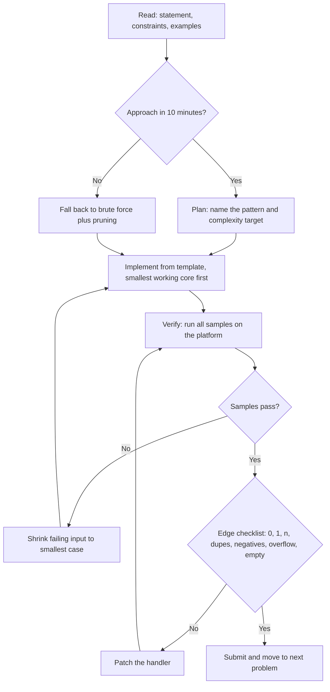

# Online Assessment Strategies

## Overview

Online assessments (OAs) are the gatekeeper to most technical interviews, and they are an entirely different game from live interviews: no one to ask clarifying questions, no hints, and a proctoring system watching for tab switches. Your ability to self-manage — time allocation, template readiness, and a disciplined verify-before-submit loop — determines the outcome more than raw algorithmic talent. This page covers platform-specific behavior, language choice, a reusable template library, the read-plan-implement-verify loop, debugging against hidden tests, and the brute-force-then-prune fallback that turns partial attempts into partial credit.

## Platform Differences: HackerRank, Codility, CodeSignal

| Feature | HackerRank | CodeSignal | Codility | HireVue |
|---------|-----------|-----------|----------|--------|
| Tab switching | Sometimes flagged | Proctored | Proctored | Proctored + video |
| Language support | 30+ | 20+ | 25+ | Limited |
| Copy-paste | Often disabled | Disabled | Allowed | Varies |
| Custom test cases | Yes | Limited | Yes | No |
| Partial scoring | Common | Rare | Yes | Varies |
| Hidden tests | Yes | Yes | Yes | Yes |
| Difficulty curve | Gentle | Steep | Moderate | Gentle |
| Time limits | Per problem | Total session | Per problem | Per problem |

The details below reflect typical configurations, but every platform lets the hiring company toggle proctoring, scoring, and retake rules — read the pre-assessment instructions as carefully as the problems. Assume the strictest configuration unless told otherwise, because violations are rarely forgiven. Never open a second window, even to "just check documentation," during a proctored assessment.

### HackerRank quirks

HackerRank OAs usually run per-problem timers with a shared clock, award partial credit proportional to hidden test cases passed, and allow custom test runs before submission. Tab-switch tracking is frequently enabled and reported to the recruiter even when it does not immediately end your session. Submissions are typically re-runnable, but some company configurations count every attempt or show attempt history — treat each submit as final until you have verified samples and edge cases. The IDE auto-saves, but a browser crash is your problem, not the platform's: submit early checkpoints on long problems.

### Codility quirks

Codility emphasizes per-task time windows and runs a strong plagiarism/similarity check across candidates, so your solution pattern is compared against the pool. Resubmission within a task's window is allowed, but several companies configure Codility to report the *first* score rather than the best, which makes premature submits expensive. The editor allows copy-paste (unlike HackerRank), which helps you keep a scratch template. Codility's hidden tests lean heavily on boundary values and performance cases, so complexity failures are punished harder than on HackerRank.

### CodeSignal quirks

CodeSignal assessments commonly run one timer for the whole question set, with a steep difficulty curve and an overall score that compresses small differences — finishing the last problem's first test case often matters more than polishing the third. Proctoring can include periodic screenshots and copy-paste disabling, so prepare your template mentally, not on a clipboard. Some companies permit retakes only after a fixed cool-down (14–30 days), and they see previous scores. Partial scoring is rarer here, so an almost-correct problem scores like a wrong one; verify before submitting.

## Language Choice Trade-offs for OAs

| Criterion | Python 3 | C++ | Java |
|-----------|----------|-----|------|
| Coding speed | Fastest to write | Moderate | Slowest boilerplate |
| Raw runtime | Slow (6–10× C++) | Fastest | Fast |
| Integer overflow | Never (big ints) | Manual (`long long`) | Manual (`long`) |
| Recursion depth | ~1000 default, raise it | ~10⁵ stack frames | Tunable thread stack |
| Best for | String/graph problems, quick iteration | Performance-critical, tight limits | If it is your strongest language |

The correct rule is: use your fastest *typing* language unless the constraints make the default runtime unviable. For n ≤ 10⁵ with Python, an O(n log n) solution is usually fine, while an O(n²) one is not — compute the operation budget before choosing. Python's big integers silently remove overflow bugs, which eliminates the most common hidden-test failure; C++ removes runtime risk but adds constant-factor tuning (`ios_base::sync_with_stdio(false)`, `'\n'` over `endl`). Switching languages mid-OA is almost never worth the context switch; commit in the first two minutes.

## Template Library

Typing boilerplate under a timer wastes minutes and breeds syntax errors. Keep these templates memorized to the point of muscle memory, because copy-paste is frequently disabled in proctored environments. Every template below is deliberately short enough to retype from memory in under a minute.

### Python: imports and fast I/O

```python
import sys, heapq
from bisect import bisect_left, bisect_right
from collections import Counter, defaultdict, deque
from itertools import accumulate
from math import gcd, inf
from functools import lru_cache

input = sys.stdin.readline                      # single-line fast input
def readints():
    return map(int, sys.stdin.readline().split())

def dump(lines):                                # batched output
    sys.stdout.write("\n".join(map(str, lines)) + "\n")
```

`sys.setrecursionlimit(300000)` is the first line to add for deep-DFS problems, but prefer an explicit stack when depth can exceed ~10⁵ because raising the limit alone can crash the interpreter. `lru_cache(maxsize=None)` turns most top-down recursion into memoized DP in one line. Batch output with one `sys.stdout.write` instead of thousands of `print` calls on large outputs.

### Python: gcd, sieve, and prefix-sum building blocks

```python
def sieve(n):                                   # primes up to n
    is_p = [True] * (n + 1)
    is_p[0:2] = [False, False]
    for i in range(2, int(n ** 0.5) + 1):
        if is_p[i]:
            is_p[i*i::i] = [False] * len(is_p[i*i::i])
    return [i for i, ok in enumerate(is_p) if ok]

def prefix(a):                                  # prefix[0]=0 style
    p = [0]
    for x in a:
        p.append(p[-1] + x)
    return p

def ext_gcd(a, b):                              # gcd + Bezout, for CRT/modular work
    if b == 0:
        return a, 1, 0
    g, x, y = ext_gcd(b, a % b)
    return g, y, x - (a // b) * y
```

### C++: minimal contest template

```cpp
#include <bits/stdc++.h>
using namespace std;
using ll = long long;

int main() {
    ios_base::sync_with_stdio(false);
    cin.tie(nullptr);
    int t = 1;
    cin >> t;                    // remove for single-test problems
    while (t--) {
        // solve(); here
    }
}
```

In C++, use `long long` whenever a product or sum can reach 10¹⁰ — `int` overflow is silent and shows up only in hidden tests. Prefer `'\n'` over `endl` to skip stream flushes in tight loops. `__gcd(a, b)` from `<algorithm>` (or C++17 `std::gcd`) covers the modular-arithmetic cases Python's `math.gcd` handles for free.

## Time Allocation Across Problems

### 2-Problem OA (60 min)

| Phase | Duration | Action |
|-------|----------|--------|
| Read both problems | 5 min | Identify difficulty, note constraints |
| Easier problem | 20 min | Solve completely, test thoroughly |
| Harder problem | 25 min | Aim for optimal or strong brute force |
| Buffer / review | 10 min | Re-test, handle edge cases |

### 3-Problem OA (75–90 min)

| Phase | Duration | Action |
|-------|----------|--------|
| Read all problems | 5 min | Rank by difficulty |
| Easy problem | 12 min | Clean solve, no mistakes |
| Medium problem | 25 min | Full optimal solution |
| Hard problem | 25 min | Brute force first, optimize if time permits |
| Review | 8 min | Edge cases on all three |

**Rule of thumb:** If you haven't made progress in 8 minutes, move on. You can return later. A partial solution scores more than a blank submission.

### Per-difficulty budget

| Difficulty | Read+plan cap | Implementation target | Brute-force floor | At timeout |
|-----------|---------------|----------------------|-------------------|------------|
| Easy | 5 min | 10 min | — | Must be done; do not linger |
| Medium | 10 min | 20 min | 8 min if stuck | Ship brute force, mark for return |
| Hard | 10 min | 25 min | 12 min if stuck | Ship brute force + prune, never blank |

The numbers encode one principle: guaranteed points first, expected points second, lottery tickets last. Easy problems carry the best points-per-minute ratio of anything on the paper, so a medium problem is never worth risking an easy one unfinished. Log your actual times during practice; most people discover they spend 15 minutes on easy problems and that fixing this alone adds a problem per OA.

## Problem Selection Strategy

### Easy-First Approach (recommended for most)

Start with the easiest problem to secure guaranteed points, build confidence, and warm up. Most OAs award full points for correctness regardless of which problem you solve first, so ordering is pure risk management. Finishing one problem early also converts the remaining timer from a threat into a budget.

### Hardest-First Approach (only for strong candidates)

If you're confident in your speed and the hardest problem carries disproportionate weight, tackling it first ensures you have peak mental energy for it. Risk: if you get stuck, you lose time on easy free points. Only choose this when you have measured yourself solving hards in under 25 minutes during practice.

### When to Skip a Problem

- No clear approach after 8 minutes of thinking
- The problem requires knowledge you don't have (e.g., segment trees, advanced DP)
- You have 3+ problems and only 20 minutes remain — focus on testing what you have
- The problem is worth fewer points than time invested elsewhere

**Always submit something.** A brute force O(n²) solution that passes some test cases earns partial credit. An empty submission earns zero.

## The Read → Plan → Implement → Verify Loop



The loop is deliberately circular: verification failures send you back to implementation, not to a full rewrite. The 10-minute plan gate is the loop's most valuable feature because it forces the fallback branch before time evaporates. Internalize the loop on practice assessments until it runs without conscious effort, because under a real timer you will execute whatever you have rehearsed.

## Reading Comprehension Tips

OA problem statements are often verbose by design — parsing them is part of the test. Use this systematic approach:

1. **Read the title and first paragraph** — identifies the problem type
2. **Skip to constraints and input/output format** — tells you the feasible complexity class
3. **Read the examples** — often clarify ambiguity better than the prose
4. **Re-read the full statement** — now you have context to parse details

Common pitfalls:

- **1-indexed vs 0-indexed** arrays — check examples carefully
- **Inclusive vs exclusive** ranges — "between 1 and n" usually means inclusive
- **Return format** — some OAs require a specific output format (e.g., space-separated vs array)
- **Hidden constraints** — negative numbers, empty inputs, duplicate elements

The constraint line is the most information-dense sentence in any statement: n ≤ 10⁵ demands O(n log n) or better, n ≤ 300 invites O(n³), and "answer modulo 10⁹+7" signals big-number arithmetic where you must apply the modulus at every multiply and add. Mapping constraint size to complexity class before planning eliminates entire families of doomed approaches. When the prose and the examples disagree, the examples win — platforms rarely ship wrong expected outputs.

## Edge Case Checklist

Before hitting submit, mentally verify these cases — the mnemonic is **0, 1, n, dupes, negatives, overflow, empty**:

```
□ n = 0 (empty string, empty array, null)
□ n = 1 (single element)
□ n at maximum constraint (overflow and TLE check)
□ All identical elements
□ Already sorted / reverse sorted
□ Negative numbers (if applicable)
□ Maximum and minimum int values (int min/max)
□ Duplicates in input
□ Input at structural boundary (e.g., n=1, n=10⁵)
```

Each checklist row maps to a specific bug class: n = 0 exposes uninitialized accumulators and division by length, n = 1 exposes loops that assume a second element, duplicates break hash-key assumptions and naive "distinct" logic, and negatives break "max subarray" style greedy invariants that assume positivity. Overflow is the sneakiest because sample tests never include 10⁹-scale values — compute the largest intermediate expression in your head and compare it against 2³¹ − 1 ≈ 2.1 × 10⁹. Ten seconds of checklist discipline reliably converts one hidden-test failure into a pass on every assessment.

## Test-Case Debugging Workflow: Sample vs Hidden

Failing samples means a logic or comprehension bug; passing samples but failing hidden tests means an edge case, an overflow, or a complexity miss. The workflow differs accordingly, and the first step is always the same: construct the smallest input that reproduces the failure. Small failing inputs localize bugs faster than staring at code ever does.

| Symptom | Most likely cause | First fix to try |
|---------|-------------------|------------------|
| Sample 1 fails | Misread statement or output format | Re-read output section, compare character-by-character |
| Later sample fails | Logic bug on non-trivial structure | Trace your code on that sample by hand |
| Samples pass, hidden fail | Edge case (0, 1, duplicates) | Run the checklist above |
| Samples pass, TLE on hidden | Wrong complexity class | Recount n against your loop nesting |
| Wrong answer at large n only | Integer overflow | Widen to `long long` / rely on Python ints |
| Runtime error | Empty-input access, recursion depth, index out of range | Guard n = 0, raise recursion limit, check indices |

Keep debug prints out of the final submission — some proctors flag them and they slow large-output cases to a crawl. If the platform allows custom test cases, register the checklist rows as tests before your first submit rather than after a failure. When you cannot find the bug in 5 minutes of shrinking, re-read the problem statement: a large fraction of "impossible" bugs are a misread constraint.

## When to Brute Force and Prune

Brute force is a scoring strategy, not a confession of weakness. On platforms with partial credit (HackerRank, Codility), a correct O(n²) over n ≤ 10⁴ can bank 30–60% of a problem's points while you think about the optimal approach, and it doubles as a reference implementation for testing your optimized version. The discipline is to write the brute force *fast* — 8–10 minutes max — and to keep it in a comment block as a fallback you can re-submit if the optimized version fails.

Pruning makes brute force viable far more often than candidates expect. Sort first so that you can break early when a partial sum exceeds the target; pass running state (current index, current sum) through recursion instead of recomputing it; and add memoization on the state that repeats, which converts many exponential searches into polynomial DP with a two-line change. Meet-in-the-middle (split the input, enumerate each half in 2^(n/2), merge) rescues n ≤ 40 subset-style problems that no polynomial algorithm touches. If the deadline hits and the optimized version is not ready, submit the pruned brute force — it is never zero.

## Test Case Patterns OAs Commonly Use

OAs typically run 5–20 test cases. Knowing the pattern helps you debug faster:

1. **Example test cases** (1–3): Given in the problem. If these fail, you misunderstood the problem.
2. **Small random** (2–4): n ≤ 10. Tests correctness on tiny inputs.
3. **Edge cases** (1–2): Empty input, single element, all same values.
4. **Large input, simple pattern** (1–2): n = 10⁵ but with a simple structure (sorted, all same). Tests complexity.
5. **Large input, complex pattern** (1–3): n = 10⁵ with adversarial data. Tests correctness at scale.
6. **Boundary values** (1): Values at int min/max, n at constraint limit.

**If you pass examples but fail hidden tests**, the issue is almost always an edge case or integer overflow. Add `sys.setrecursionlimit` in Python for deep recursion, and use `long` or explicit big-integer handling in Java/C++. The test-case list doubles as a priority list for your own custom tests: register one input from each category before submitting.

## Handling Partial Scoring

Many platforms (HackerRank, Codility) award points proportional to test cases passed. Strategy:

1. **Submit a brute force first** — guarantees some points even if you can't optimize
2. **Then optimize incrementally** — each improvement may unlock more test cases
3. **Don't delete your brute force** — comment it out, keep it as fallback

Treat each submission as a checkpoint rather than a verdict, especially on platforms that do not count resubmissions against you. On platforms where the *first* score may be reported, flip the strategy: run your full checklist against the brute force before submitting at all. Know which regime you are in by reading the assessment instructions — it is one sentence that changes your entire submission policy.

## Interview Questions

1. **You pass all sample tests but fail hidden ones — what is your debugging order?** First, run the edge-case checklist as actual inputs: n = 0, n = 1, duplicates, negatives, and n at maximum constraint, because that order catches the majority of hidden failures. Second, audit the largest intermediate arithmetic expression for overflow — in C++/Java, products of two ~10⁵-scale values already exceed 32-bit range. Third, recount complexity against the constraint line, since hidden tests include adversarial performance cases that samples never do. This ordered checklist resolves most hidden-test failures in under five minutes without a debugger.
2. **Why does language choice matter in OAs, and when should you override the default rule?** The default rule is "use the language you type fastest," because OA time limits are usually set generously enough for a correct O(n log n) Python solution. Override it only when the constraint math says otherwise: with n ≤ 10⁶ and a tight per-test limit, Python's constant factor can turn a correct algorithm into a TLE, making C++ or Java the pragmatic choice. Python's big integers also delete an entire bug class, so when the problem smells like overflow (products, sums up to 10¹⁸), Python buys safety while C++ buys speed — pick based on which risk the constraints emphasize.
3. **When exactly should you abandon the optimal approach and ship brute force?** At the brute-force floor in the per-difficulty table: 8 minutes stuck on a medium, 12 on a hard, or any moment when the remaining time cannot fund both a new approach and verification. Partial credit turns a pruned brute force into real points, and an optimized solution that fails hidden tests because it was rushed scores the same as nothing. Shipping the brute force first also gives you a working reference to test the optimized version against if time remains.
4. **What makes CodeSignal's format strategically different from HackerRank's?** CodeSignal usually runs one session-wide timer with rare partial scoring and a compressed scoring curve, so a nearly-finished last problem is worth far less than a fully-verified earlier one — the verification step before submit is non-negotiable. HackerRank's per-problem timers and common partial credit reward checkpoint submissions and incremental optimization. These differences invert one habit: on HackerRank submit early and improve, on CodeSignal verify fully then submit once. Candidates who apply one platform's habits to the other systematically leave points behind.
5. **How do you prepare templates for an environment where copy-paste is disabled?** Keep the template set small enough to retype — fast I/O, the sieve, prefix sums, and gcd/ext-gcd fit in roughly 30 lines total — and drill retyping each one under a timer until it is muscle memory. Typing from memory also catches stale details, because you rehearse the current version rather than a possibly outdated clipboard artifact. Practice on the actual platform beforehand: IDE keyboard shortcuts, autocomplete behavior, and even font rendering differ enough to cost real minutes on assessment day.

## Key Takeaways

- Read platform instructions like a problem statement: timer structure, partial scoring, resubmission policy, and proctoring change your entire strategy.
- Budget time per difficulty, not per paper: easy 15 min total, medium 30, hard 25 + brute-force floor — and enforce it with an 8-minute stall rule.
- Keep a retypeable template library (fast I/O, sieve, prefix, gcd) because copy-paste is frequently disabled.
- The read → plan → implement → verify loop with a 10-minute plan gate is the single highest-leverage habit; verification failures go back one step, not to zero.
- Pass samples but fail hidden ⇒ run the 0/1/n/dupes/negatives/overflow/empty checklist, audit overflow, recount complexity — in that order.
- Brute force plus pruning is a scoring strategy: ship it at the time floor, keep it as a test oracle, and reach for meet-in-the-middle when n ≤ 40.
- Constraint lines are instructions: n ≤ 10⁵ means O(n log n); modulo 10⁹+7 means apply the modulus at every arithmetic step.

## References

- HackerRank — official platform and preparation kit: <https://www.hackerrank.com/>
- Codility — official platform and skills-testing documentation: <https://www.codility.com/>
- CodeSignal — official platform: <https://codesignal.com/>
- Python 3 official documentation — `sys`, `collections`, `itertools`, `functools` modules: <https://docs.python.org/3/>
- cppreference — C++ standard library reference (`std::gcd`, I/O tuning): <https://en.cppreference.com/w/>
- LeetCode — practice environment closest to real OA conditions: <https://leetcode.com/>

## Cross-References

- [Coding Framework](./framework.md) — the UMPIRE method this loop operationalizes under a timer
- [Problem Patterns](./patterns.md) — pattern identification during the "plan" step
- [Complexity Analysis](./complexity.md) — mapping constraint sizes to feasible complexity classes
- [MCQ Strategies](./mcq-strategies.md) — the MCQ round that often precedes or accompanies the coding section
- [Reading Pseudocode](./pseudocode-reading.md) — tracing skills for output-prediction questions
- [Pattern Deep Dive: Two Pointers](./pattern-two-pointers.md) — the most frequent OA pattern per this book's frequency analysis
- [Python Cheat Sheet](../../cheatsheets/python.md) — language syntax refresher for the template library
