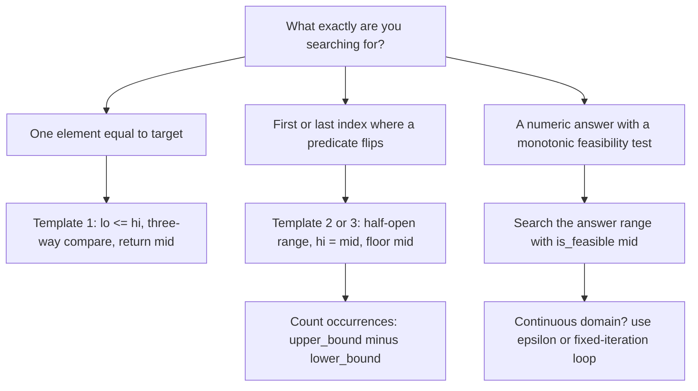

# Pattern Deep Dive: Binary Search

## Overview

Binary search halves the candidate set on every comparison, turning O(n) linear scans into O(log n) probes on sorted or monotonic data. Its most valuable interview form is not array lookup but **binary search on the answer space**, which applies the same halving logic to problems that never mention a sorted array at all. Interviewers love this pattern because it tests loop-invariant discipline: the code is only ten lines, yet Jon Bentley reported in *Programming Pearls* that roughly 90% of professional programmers could not write a correct binary search after an hour of work. Master the three templates below and you will never be in that 90%.

## The Three Core Templates

Almost every binary-search bug comes from mixing two conventions inside one function. Pick one template, write its invariant in a comment, and keep every update consistent with it. All three run in \\(O(\log n)\\) time and O(1) space; they differ in the loop condition, the initial `hi`, and what the returned index means.

### Template 1 — Exact Match

Use this when the target either exists at exactly one position or does not exist. The loop runs while the closed interval `[lo, hi]` is non-empty, and each branch eliminates `mid` entirely.

```python
def binary_search(arr, target):
    lo, hi = 0, len(arr) - 1            # invariant: target, if present, is in [lo, hi]
    while lo <= hi:
        mid = (lo + hi) // 2
        if arr[mid] == target:
            return mid
        elif arr[mid] < target:
            lo = mid + 1                 # everything < mid is now ruled out
        else:
            hi = mid - 1
    return -1
```

This template returns an index or `-1`, which makes it the right choice for membership tests. It is a poor choice when duplicates exist, because it returns *an arbitrary occurrence* of the target rather than the first or last one. If the problem asks for boundaries among duplicates, switch to Template 2 or 3.

### Template 2 — Lower Bound (first index with `arr[i] >= target`)

Use this to find the first position where a value-based predicate flips from false to true. The interval is **half-open** `[lo, hi)`, `hi` starts at `len(arr)` rather than `len(arr) - 1`, and `mid` is never discarded when it still satisfies the predicate — that is why `hi = mid` instead of `hi = mid - 1`.

```python
def lower_bound(arr, target):
    lo, hi = 0, len(arr)                 # invariant: answer is in [lo, hi)
    while lo < hi:
        mid = (lo + hi) // 2             # floor mid: guarantees lo < new_hi
        if arr[mid] < target:
            lo = mid + 1                 # arr[lo-1] < target is settled
        else:
            hi = mid                     # mid stays a candidate
    return lo                            # == len(arr) if every element < target
```

Three properties make this the single most reusable binary-search variant. First, it handles duplicates correctly: on `[1, 2, 2, 2, 3]` with target `2` it returns index `1`, the first occurrence. Second, it doubles as "search insert position", because when the target is absent it returns the index where the target would be inserted. Third, it is exactly what Python's `bisect.bisect_left` and C++'s `std::lower_bound` implement, so you can sanity-check your hand-written version against them.

### Template 3 — Upper Bound (first index with `arr[i] > target`)

The mirror image of the lower bound, changing one comparison. The number of occurrences of `target` is then `upper_bound(target) - lower_bound(target)`, an O(log n) counting trick that answers "how many times does X appear?" without scanning.

```python
def upper_bound(arr, target):
    lo, hi = 0, len(arr)
    while lo < hi:
        mid = (lo + hi) // 2
        if arr[mid] <= target:           # the only changed line
            lo = mid + 1
        else:
            hi = mid
    return lo
```

### Template Comparison

| Property | T1: exact match | T2: lower bound | T3: upper bound |
|---|---|---|---|
| Loop condition | `lo <= hi` | `lo < hi` | `lo < hi` |
| Initial `hi` | `len(arr) - 1` (closed) | `len(arr)` (half-open) | `len(arr)` (half-open) |
| Discard `mid`? | always (`mid ± 1`) | only when predicate false | only when predicate false |
| Returns when absent | `-1` | insertion point | insertion point |
| With duplicates | arbitrary occurrence | first occurrence | one past last occurrence |
| Library twin | `std::binary_search` | `std::lower_bound`, `bisect_left` | `std::upper_bound`, `bisect_right` |

## The Invariant Mindset

The reason `hi = mid` never loops forever is that floor division keeps `mid < hi` whenever `lo < hi`, so the half-open interval strictly shrinks every iteration. Conversely, `lo = mid` with a floor mid can stall: when `lo + 1 == hi`, floor `mid` equals `lo`, and `lo = mid` makes no progress. The safe pairings are therefore **floor mid with `hi = mid`**, and **ceil mid with `lo = mid`** — never mix them. If your search hangs on a two-element range, this pairing is the first thing to check.



## Why It Is O(log n) — The Recurrence Proof

Each iteration performs O(1) work and recurses on at most half the interval, giving the recurrence \\(T(n) = T(n/2) + c\\). Unroll it: after \\(k\\) steps the remaining interval is at most \\(n/2^k\\) elements, and \\(T(n) = ck + T(n/2^k)\\). The recursion bottoms out when \\(n/2^k = 1\\), i.e. \\(k = \log_2 n\\), so \\(T(n) = c\log_2 n + T(1) = O(\log n)\\). This is the Master Theorem case \\(a = 1, b = 2, f(n) = c\\) (case 2), which always yields Θ(log n) for halving recurrences with constant per-level work.

The constant matters when you state numbers in an interview: a million elements need about 20 comparisons and a billion need about 30, because \\(2^{20} \approx 10^6\\) and \\(2^{30} \approx 10^9\\). It is also worth knowing that binary search is cache- and branch-unfriendly — the unpredictable jump to `mid` defeats branch predictors and prefetchers — so for small arrays (roughly under 64 elements) a linear scan is often faster in wall-clock time. Library implementations even switch to linear search for tiny ranges. Mentioning this trade-off signals real systems maturity.

## Overflow-Safe Midpoint

`mid = (lo + hi) / 2` overflows when `lo + hi` exceeds the integer maximum. With 32-bit signed integers that threshold is \\(2^{31} - 1 \approx 2.1 \times 10^9\\), and an array with two billion elements pushes `lo + hi` past it near the right end — exactly the case that famously lived in Java's `Arrays.binarySearch` for nine years before being fixed in 2006. The portable fix computes the midpoint as an offset from `lo` instead of as a sum.

```java
int mid = lo + (hi - lo) / 2;      // safe: (hi - lo) never overflows
int mid2 = (lo + hi) >>> 1;        // also safe in Java: unsigned shift drops the sign bit
```

In C++ the same expression `lo + (hi - lo) / 2` is the standard defensive idiom. Python integers have arbitrary precision, so `(lo + hi) // 2` cannot overflow there, but writing the safe form is still a good habit for language-agnostic interviews. One extra C++ subtlety: integer division of negative numbers truncates toward zero, which can bias a midpoint on signed ranges — another reason the `lo + (hi - lo) / 2` form is preferred, since `hi - lo` stays non-negative in search loops.

## Binary Search on Real Numbers

Continuous domains replace the "did we land exactly?" question with a precision question. Two stopping strategies exist: an epsilon loop that stops when `hi - lo <= eps`, or a fixed-iteration loop that runs, say, 100 times — each iteration halves the interval, so 100 iterations shrink the range by \\(2^{100}\\), far beyond double-precision resolution. The fixed-iteration form is usually safer because it is immune to a bad initial range and to floating-point rounding preventing `hi - lo` from ever reaching epsilon.

```python
def sqrt_real(x, eps=1e-7):
    lo, hi = 0.0, max(1.0, x)            # max() guards x < 1, where sqrt(x) > x
    while hi - lo > eps:
        mid = (lo + hi) / 2
        if mid * mid <= x:
            lo = mid
        else:
            hi = mid
    return lo
```

Choose epsilon relative to both the required output precision and the initial range size. Each iteration reduces the interval width by half, so reaching width \\(\epsilon\\) from range \\(R\\) takes \\(\lceil \log_2 (R/\epsilon) \rceil\\) iterations — for \\(R = 10^6\\) and \\(\epsilon = 10^{-7}\\) that is about 43 iterations. Never test doubles for equality (`mid * mid == x` almost never fires), and keep epsilon a factor of 10 looser than the precision the judge demands, because accumulated rounding can eat one digit. Doubles carry roughly 15–16 significant digits, so a range like `[0, 10^9]` probed to `1e-6` precision fits comfortably.

## Search on Answer Space

This is the pattern that turns binary search from a lookup tool into an optimization tool. It applies when two conditions hold: the answer is a number inside a known range, and feasibility is **monotone** — if speed `k` finishes in time, every speed above `k` also does, so the predicate looks like `F F F F T T T`. Binary search then finds the first `T` in the *predicate sequence* rather than in an array. Total complexity is `O(check) * O(log(range))`, typically `O(n log m)` where `m` is the range width.

```python
def binary_search_on_answer(lo, hi):
    # invariant: is_feasible(hi) is True, is_feasible(lo - 1) is False
    while lo < hi:
        mid = (lo + hi) // 2
        if is_feasible(mid):
            hi = mid          # mid works; something smaller might too
        else:
            lo = mid + 1      # mid too small; answer is strictly larger
    return lo
```

### Worked Example: Koko Eating Bananas

Koko eats at most `k` bananas per hour from one pile; find the minimum `k` finishing all piles within `h` hours. For `piles = [3, 6, 7, 11]` and `h = 8`, the hours needed at speed `k` are the sum of ceiling divisions `ceil(p / k)` — a natural monotone predicate.

| Speed `k` | Hours = Σ ceil(p/k) | Feasible (≤ 8)? |
|---|---|---|
| 3 | 1 + 2 + 3 + 4 = 10 | No |
| 4 | 1 + 2 + 2 + 3 = 8 | **Yes** |
| 6 | 1 + 1 + 2 + 2 = 6 | Yes |
| 11 | 1 + 1 + 1 + 1 = 4 | Yes |

The search over `[1, 11]` proceeds: `mid = 6` → 6 hours, feasible, `hi = 6`; `mid = 3` → 10 hours, infeasible, `lo = 4`; `mid = 5` → 8 hours, feasible, `hi = 5`; `mid = 4` → 8 hours, feasible, `hi = 4`; `lo == hi == 4` → answer **4**. Five feasibility checks replace trying all eleven speeds, and the gap widens as the range grows.

### Choosing Bounds and the Check

| Problem | `lo` | `hi` | Feasibility check (O(n)) |
|---|---|---|---|
| Koko eating bananas (LC 875) | 1 | max(piles) | Σ ceil(p/k) ≤ h |
| Ship packages in D days (LC 1011) | max(weights) | sum(weights) | greedy daily packing ≤ D days |
| Split array largest sum (LC 410) | max(nums) | sum(nums) | greedy partition count ≤ m |
| Minimum days for bouquets (LC 1482) | min(bloom) | max(bloom) | count non-overlapping bouquets ≥ m |
| Kth smallest pair distance (LC 719) | 0 | max − min | count pairs with distance ≤ mid |
| Sqrt(x) (LC 69) | 0 | x (or max(1, x)) | mid·mid ≤ x |

Two bound rules prevent most wrong answers. The lower bound must be the first plausibly feasible value (Koko cannot eat zero bananas per hour), and the upper bound must be certainly feasible (capacity = total weight ships everything in one day). If either bound lies outside the true answer, the invariant stated in the template comment is violated and the returned value is garbage — test your `is_feasible` at both bounds before trusting the loop.

## Rotated Sorted Arrays

A rotated sorted array is sorted, then cut and the halves swapped: `[4, 5, 6, 7, 0, 1, 2]`. The key structural fact is that **at least one half of any `[lo, mid]` / `[mid, hi]` split is still sorted**, because the single rotation point can only lie in one half. You identify the sorted half by comparing endpoints, then test whether the target falls inside the sorted half's range; if yes, search there, otherwise search the other half.

```python
def search_rotated(nums, target):
    lo, hi = 0, len(nums) - 1
    while lo <= hi:
        mid = (lo + hi) // 2
        if nums[mid] == target:
            return mid
        if nums[lo] <= nums[mid]:                 # left half is sorted
            if nums[lo] <= target < nums[mid]:
                hi = mid - 1
            else:
                lo = mid + 1
        else:                                     # right half is sorted
            if nums[mid] < target <= nums[hi]:
                lo = mid + 1
            else:
                hi = mid - 1
    return -1
```

Finding the rotation point itself (the minimum element, LC 153) has a cleaner predicate: compare `nums[mid]` against `nums[hi]`. If `nums[mid] > nums[hi]` the minimum lives strictly to the right of `mid`, otherwise `mid` itself might be the minimum so you must keep it (`hi = mid`).

```python
def find_min(nums):
    lo, hi = 0, len(nums) - 1
    while lo < hi:
        mid = (lo + hi) // 2
        if nums[mid] > nums[hi]:
            lo = mid + 1          # rotation point is right of mid
        else:
            hi = mid              # mid could be the minimum
    return nums[lo]
```

The duplicates variant (LC 81) breaks the endpoint test: when `nums[mid] == nums[hi]` you cannot tell which side is sorted. The fix is to shrink `hi` by one in that case, which degrades the worst case to O(n) — say this out loud in interviews, because it shows you understand why the O(log n) guarantee existed in the first place.

## Common Off-by-One Traps

| Symptom | Root cause | Fix |
|---|---|---|
| Infinite loop on 2-element range | `lo = mid` paired with floor mid | pair floor mid with `hi = mid`, or ceil mid with `lo = mid` |
| Misses the last element | exact-match updates (`hi = mid - 1`) under a `lo < hi` loop | use `lo <= hi` for closed ranges, or half-open ranges with `hi = mid` |
| Wrong answer on duplicates | Template 1 returns an arbitrary occurrence | switch to lower/upper bound templates |
| `len(arr)` returned unexpectedly | lower-bound semantics misread | it means "no element ≥ target"; check before indexing |
| Overflow/crash in Java or C++ | `(lo + hi) / 2` exceeds `INT_MAX` | `mid = lo + (hi - lo) / 2` |
| TLE on answer-space problems | feasibility check is slower than O(n), e.g. O(n²) rescans | make the check a single greedy/counting pass |
| Wrong bounds, garbage answer | `lo` feasible or `hi` infeasible | verify `is_feasible(lo-1)` false and `is_feasible(hi)` true |

## Practice Mappings

| # | Problem (LeetCode) | Template | What the predicate is |
|---|---|---|---|
| 704 | [Binary Search](https://leetcode.com/problems/binary-search/) | exact match | direct comparison |
| 35 | [Search Insert Position](https://leetcode.com/problems/search-insert-position/) | lower bound | `arr[mid] < target` |
| 34 | [Find First and Last Position](https://leetcode.com/problems/find-first-and-last-position-of-element-in-sorted-array/) | lower + upper bound | two runs; count = ub − lb |
| 33 | [Search in Rotated Sorted Array](https://leetcode.com/problems/search-in-rotated-sorted-array/) | rotated exact | sorted-half range test |
| 153 | [Find Minimum in Rotated Sorted Array](https://leetcode.com/problems/find-minimum-in-rotated-sorted-array/) | rotated predicate | `nums[mid] > nums[hi]` |
| 875 | [Koko Eating Bananas](https://leetcode.com/problems/koko-eating-bananas/) | answer space | Σ ceil(p/k) ≤ h |
| 1011 | [Capacity To Ship Packages Within D Days](https://leetcode.com/problems/capacity-to-ship-packages-within-d-days/) | answer space | greedy packing ≤ D days |
| 410 | [Split Array Largest Sum](https://leetcode.com/problems/split-array-largest-sum/) | answer space | same check as 1011 |
| 69 | [Sqrt(x)](https://leetcode.com/problems/sqrtx/) | answer space | mid·mid ≤ x |
| 4 | [Median of Two Sorted Arrays](https://leetcode.com/problems/median-of-two-sorted-arrays/) | partition search | partition correctness test |

## Interview Questions

1. **Prove that binary search runs in O(log n).** State the recurrence \\(T(n) = T(n/2) + c\\): one comparison and index arithmetic per iteration, with the interval at most halved. Unrolling gives \\(T(n) = ck + T(n/2^k)\\), which bottoms out at \\(k = \log_2 n\\) when the interval reaches one element. Concretely, \\(2^{20} \approx 10^6\\) and \\(2^{30} \approx 10^9\\), so a billion-element array needs about 30 comparisons. Optionally add that Master Theorem case 2 (a = 1, b = 2, constant f(n)) yields Θ(log n), and note the cache/branch-prediction caveat that makes linear scan competitive for tiny arrays.

2. **When do you use `lo <= hi` versus `lo < hi`?** The condition follows from the range convention, not from taste. `lo <= hi` goes with a closed interval `[lo, hi]` where both endpoints are candidates and `mid` is discarded with `mid ± 1`; it terminates with `lo > hi` and an empty range. `lo < hi` goes with a half-open interval `[lo, hi)` where `mid` remains a candidate when the predicate holds, so you must write `hi = mid` and rely on floor mid to guarantee progress. Mixing the conventions is the single most common source of both infinite loops and missed elements.

3. **Your binary search on the answer passes the samples but fails on submission. What do you check?** First verify monotonicity of the predicate — if feasibility is not truly monotone (e.g. an interaction between items breaks the "more capacity always at least as good" property), binary search returns an arbitrary boundary. Second, check the bounds: `lo` must be infeasible-or-minimal and `hi` must be certainly feasible, otherwise the invariant "answer in [lo, hi]" is false from iteration one. Third, audit the check function for the classic O(n²) rescan that times out on large inputs. Finally, confirm the loop uses floor mid with `hi = mid` and `lo = mid + 1`, since a ceil mid there loops forever on two-element ranges.

4. **How do you count occurrences of a value in a sorted array in O(log n)?** Run one lower bound and one upper bound; the count is the difference of the two returned indices. For example on `[1, 2, 2, 2, 3]`, `lower_bound(2)` returns 1 and `upper_bound(2)` returns 4, giving 3 occurrences. Both calls are O(log n) and the method never touches the duplicates directly. This is also how you find first and last positions (LC 34) with a single reusable routine rather than two ad-hoc searches with tricky "keep going left" bookkeeping.

5. **How would you search a sorted array whose length is unknown (LC 702)?** Use exponential doubling to bracket the target: probe indices 1, 2, 4, 8, … until `arr[p] >= target` or the access fails, which gives a window `[p/2, p]` of size proportional to the answer's position in O(log n) probes. Then run an ordinary binary search inside that window. Total cost remains O(log n) because the doubling phase dominates and each probe halves the remaining uncertainty. The same doubling idea underlies unbounded search and path-finding when an upper bound is unavailable up front.

6. **Why did Bentley say 90% of programmers get binary search wrong, and what defends you?** The failures were almost all boundary errors: off-by-one in the loop condition, wrong `mid` update around duplicates, or the integer overflow in `(lo + hi) / 2` that shipped in Java's standard library until 2006. The defense is to state the invariant out loud before coding, choose one of the three templates, and verify two corner cases — a one-element array and a two-element array — by hand-tracing. Writing `is_feasible` as a separate named function in answer-space problems also isolates the logic most likely to be wrong. Ten seconds of invariant discipline beats an hour of debugging.

## Key Takeaways

- Binary search finds the flip point of any **monotone predicate**, not just values in sorted arrays — this reframing unlocks the answer-space family.
- Learn the three templates (exact, lower bound, upper bound) and never mix their loop conditions, `hi` initializers, or mid updates inside one function.
- Safe pairings: floor mid goes with `hi = mid` and `lo = mid + 1`; ceil mid goes with `lo = mid`. Any other pairing can stall on two-element ranges.
- Occurrence counting is free once you know lower/upper bounds: `count = ub - lb`, both O(log n).
- Search-on-answer recipes: identify the range, prove monotonicity, write `is_feasible` as one O(n) greedy/counting pass; total O(n log m).
- Always compute `mid = lo + (hi - lo) / 2` in Java/C++ — the overflow bug shipped in real standard libraries for years.
- For real-valued search, prefer a fixed-iteration loop (e.g. 100 iterations) over epsilon checks, and pick eps ≈ 10× looser than the demanded precision.
- Rotated arrays: one half is always sorted; compare endpoints to find which, and remember the duplicates case degrades to O(n).

## References

- Wikipedia — [Binary search algorithm](https://en.wikipedia.org/wiki/Binary_search_algorithm) (history, Bentley's correctness study, Java overflow bug)
- Python docs — [bisect module](https://docs.python.org/3/library/bisect.html) (reference implementation of lower/upper bound semantics)
- Oracle — [java.util.Arrays](https://docs.oracle.com/en/java/javase/17/docs/api/java.base/java/util/Arrays.html) (`binarySearch` contract, including "undefined if not sorted")
- cp-algorithms — [main site](https://cp-algorithms.com/) (Binary Search and Ternary Search chapters)
- Bentley, J., *Programming Pearls*, 2nd ed., Addison-Wesley 1999 — Column 4 "Writing Correct Programs" (binary search correctness study)
- Knuth, D., *The Art of Computer Programming*, Vol. 3, §6.2.1 "Searching a Sorted Table" (first published 1946, first correct published version 1962)

## Cross-References

- [Searching](../../dsa/chapters/ch06-searching.md) — DSA chapter covering binary search basics and variants
- [Searching Expanded](../../dsa/chapters/ch65-searching-expanded.md) — deeper variants including ternary and exponential search
- [Complexity Analysis](../../dsa/chapters/ch03-complexity-analysis.md) — Master Theorem background for the recurrence proof
- [Branch Prediction](../../dsa/chapters/ch124-branch-prediction.md) — why unpredictable jumps make small-range linear scans competitive
- [Two Pointers](./pattern-two-pointers.md) — the other sorted-array workhorse; converging pointers vs halving probes
- [Problem Patterns](./patterns.md) — where binary search sits among the core interview patterns
- [Coding Interview Preparation](./README.md) — section overview and study order
