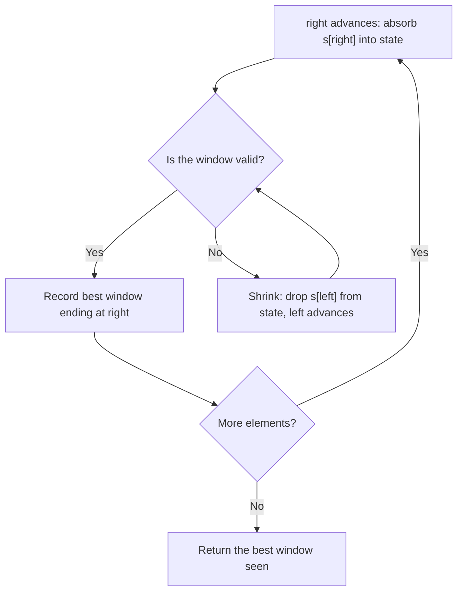

# Pattern Deep Dive: Sliding Window

## Overview

The sliding window pattern answers questions about contiguous subarrays and substrings in O(n) time by maintaining a window `[left, right]` whose state is updated incrementally instead of recomputed. It replaces the O(n²) brute force that enumerates every subarray, and it is the standard answer whenever a problem says "longest/shortest/count of subarrays satisfying X". Interviewers use it to test two skills: recognizing that only contiguity is needed (a mental step down from prefix sums and hashmaps), and keeping the expand/shrink bookkeeping bug-free under pressure. The fixed-size and variable-size variants share one skeleton, and this page covers both, the state containers, the shrink catalog, the monotonic deque upgrade, and the amortized complexity argument.

## Fixed vs Variable Windows

Fixed-size windows advance `right` every step and keep the width at exactly `k`; the only work per step is adding the entering element and removing the leaving one. Variable-size windows grow `right` unconditionally and move `left` only when a constraint is violated — the width is an *output* of the algorithm, not an input. Misidentifying which variant a problem needs is the first cause of wrong approaches: "maximum average of size k" is fixed, while "shortest subarray with sum ≥ target" is variable.

### Fixed-Size Template

```python
def max_sum_subarray_k(arr, k):
    window_sum = sum(arr[:k])                 # O(k) setup, not O(k) per step
    best = window_sum
    for i in range(k, len(arr)):
        window_sum += arr[i] - arr[i - k]     # O(1) slide: add right, drop left
        best = max(best, window_sum)
    return best
```

The template generalizes beyond sums: replace the scalar with a frequency map to detect anagrams of length `k` (LC 438/567), or with a monotonic deque to track the maximum (LC 239). The invariant to state in interviews is that after processing index `i`, the window covers exactly `arr[i-k+1 .. i]`. Updating the answer **before** the window has reached size `k` is the classic fixed-window bug, because the first `k-1` windows are partial.

### Variable-Size Template

```python
def variable_window(s):
    left = 0
    best = 0
    state = {}                                # whatever the constraint needs
    for right in range(len(s)):
        add(s[right], state)                  # expand: absorb s[right]
        while not valid(state):               # shrink: restore validity
            remove(s[left], state)
            left += 1
        best = max(best, right - left + 1)    # window is valid here
    return best
```

Two structural variants exist, and you must decide which one a problem needs before coding. "Longest valid window" (this template) records the answer *after* the `while` loop, when the window is guaranteed valid. "Shortest valid window" (minimum window substring, below) inverts it: once valid, record and then **keep shrinking while still valid**, recording inside the loop. Writing the max-window skeleton for a min-window problem is the second classic bug.

| Aspect | Fixed window | Variable window |
|---|---|---|
| Window width | always `k` (input) | grows/shrinks (output) |
| Loop structure | one `for`, no inner loop | `for` + inner `while` |
| Answer updated | every step after warm-up | after validity restored (max) or during validity (min) |
| Typical question | max/min/count over every size-k block | longest/shortest window meeting a constraint |
| Complexity | O(n) exactly | O(n) amortized (see below) |

### Degenerate Windows: Buy Low, Sell High

Some O(n) problems look like windows but degenerate to a single running variable. Maximum profit from one transaction (LC 121) walks the array once, tracks the minimum price seen so far as an implicit left boundary, and answers `price - min_price` at each step — the "window" is `[argmin, current]` but it never shrinks, so no deque, map, or inner loop is needed.

```python
def max_profit(prices):
    min_price = float('inf')
    best = 0
    for price in prices:
        min_price = min(min_price, price)          # implicit left edge
        best = max(best, price - min_price)        # implicit right edge
    return best
```

Recognizing degenerate cases is a speed skill: if the left boundary is a single aggregate value (a min, a max, a sum) rather than a position determined by a constraint check, the window has collapsed and the one-pass form above is cleaner. Interviewers accept either form, but the one-pass version signals that you know why the window machinery exists — to remember *positions* you cannot otherwise recover.

## Choosing the Window-State Container

The window state is whatever makes `valid(state)` an O(1) or O(26) check. Picking the cheapest sufficient container is a real interview differentiator, because it changes both the constant factor and the code volume.

| Container | Check cost | Use when | Representative problems |
|---|---|---|---|
| Scalar (sum, product) | O(1) | constraint is numeric | LC 209, 643 |
| Hash map / Counter | O(distinct) | arbitrary alphabet or values | LC 76, 904 |
| Array of 26 (a–z) | O(26) | lowercase letters only | LC 424, 567 |
| Array of 128 (ASCII) | O(128) | mixed printable chars | LC 3 variant |
| `matches` integer | O(1) | frequency equality vs target | LC 76, 438, 567 |
| Monotonic deque | O(1) amortized | need window max/min | LC 239 |

The array-of-26 trick replaces hashing with direct indexing: `cnt[ord(c) - ord('a')] += 1` beats dict updates by a constant factor and avoids hashing entirely, which matters in tight loops. For equality checks between two frequency arrays, do **not** compare the arrays at every step (that is O(26·n) overall); instead maintain a `matches` counter of how many of the 26 letters currently agree with the target, updating only the letters touched at each step. That single optimization turns an O(26n) solution into O(n) and is the expected follow-up on LC 567 and LC 438.

## The Shrink-Condition Catalog

Every variable-window problem reduces to one question: *when is the window invalid, and how do I restore it?* Catalog your constraint into one of the rows below before writing code.

| Constraint | Shrink while… | State needed | Example |
|---|---|---|---|
| No repeated characters | any count > 1 | counts | LC 3 |
| At most k distinct values | len(state) > k | counts + distinct counter | LC 904 (k=2) |
| At most k flips/zeros | zeros > k | zero count | LC 1004 |
| Sum ≥ target (min length) | sum ≥ target | running sum | LC 209 |
| Replacements needed ≤ k | (window size − max_freq) > k | counts + max_freq | LC 424 |
| Contains all of t | never shrink while valid; record first | need map + missing | LC 76 |
| Exactly k distinct | atMost(k) − atMost(k−1) | counts | subarray counting |

The last row hides a powerful identity: problems asking for **exactly k** of something are usually solved by `atMost(k) - atMost(k-1)`, because "exactly k distinct" windows are the difference of two at-most windows. This converts the hardest constraint into two easy ones and is a favorite hard-level follow-up (LC 992 Subarrays with K Different Integers). Note the asymmetry: "at most k" works with the direct max-window template, while "at least/exactly" needs the subtraction trick or a min-window variant.

## "At Most k" Windows: Max Consecutive Ones III

Flip at most `k` zeros to maximize the run of ones (LC 1004). The window is valid while it contains at most `k` zeros, so the state is a single counter and the shrink condition is `zeros > k`. This is the purest example of the "at most k" family: the constraint is monotone in window size, the state is O(1), and the answer is the maximum width ever reached.

```python
def longest_ones(nums, k):
    left = 0
    zeros = 0
    best = 0
    for right, x in enumerate(nums):
        if x == 0:
            zeros += 1
        while zeros > k:              # too many zeros: shrink until valid
            if nums[left] == 0:
                zeros -= 1
            left += 1
        best = max(best, right - left + 1)
    return best
```

A subtle property of the max-window template is that the window never needs to shrink below validity: when the constraint breaks, shrinking to the *nearest* valid width is sufficient, because a longer future window will pass through the same configuration anyway. In LC 1004 you may even replace the `while` with an `if` and keep a stale `left` — the recorded maximum stays correct because the window length only improves when `right` advances past it. Understanding *why* the lazy version still works (the window can grow monotonically because only `right` is unbounded) is a favorite hard follow-up.

## Worked Example: Minimum Window Substring

Find the shortest substring of `s = "ADOBECODEBANC"` containing all of `t = "ABC"` (LC 76). The state is `need` (required counts, decremented for every absorbed character, so negative means surplus) and `missing` (how many required characters are still absent). The window is valid exactly when `missing == 0`; the algorithm records the best window and keeps shrinking while valid.

```python
from collections import Counter

def min_window(s, t):
    need = Counter(t)
    missing = len(t)
    left = 0
    start, end = 0, float('inf')
    for right, ch in enumerate(s):
        if need[ch] > 0:
            missing -= 1
        need[ch] -= 1
        while missing == 0:               # valid: record, then shrink
            if right - left < end - start:
                start, end = left, right
            need[s[left]] += 1
            if need[s[left]] > 0:
                missing += 1
            left += 1
    return s[start:end + 1] if end != float('inf') else ""
```

The trace compresses into three decisive moments; every other step is an O(1) surplus absorption (D, O, E, N) that changes no counters.

| Moment | Window | `missing` | What happens |
|---|---|---|---|
| right = 5 'C' absorbed | `[0,5]` ADOBEC | 1 → 0 | first complete window → record "ADOBEC" (len 6) |
| shrink after right = 5 | `[0,5]` → `[1,5]` | 0 → 1 | D, O dropped as surplus, then dropping A breaks it: `left = 1` |
| right = 10 'A' absorbed | `[1,10]` DOBECODEBA | 1 → 0 | valid again → shrink run records best = "CODEBA" `[5,10]` (len 6) |
| right = 12 'C' absorbed | `[6,12]` ODEBANC | 1 → 0 | shrink run records "EBANC" then **"BANC"** `[9,12]` (len 4) |

Inside the `right = 10` shrink run, note the order: the algorithm records *before* each removal, so dropping surplus D, O, the duplicate B (its `need` count was negative, meaning the window held two B's), and surplus E still leaves a valid window at `[5,10]`; dropping C finally breaks it and `missing` returns to 1. The final run at `right = 12` mirrors it, recording down to `[9,12]` = "BANC", the answer. The pattern to internalize: each character enters the window once and leaves once, so despite the nested `while`, the whole run is O(|s| + |t|).

## Monotonic Deque: Sliding Window Maximum

The basic template tracks counts, but "max of every window of size k" (LC 239) needs the *identity* of the maximum, and re-scanning the window costs O(nk). The monotonic deque keeps candidate indices whose values are strictly decreasing: the front is always the current maximum, and any new element smaller than the back can still become a future maximum while any element larger than the back makes all prior back candidates useless forever.

```python
from collections import deque

def max_sliding_window(nums, k):
    dq = deque()                      # indices; nums[dq] strictly decreasing
    out = []
    for i, x in enumerate(nums):
        while dq and nums[dq[-1]] <= x:
            dq.pop()                  # smaller values can never win again
        dq.append(i)
        if dq[0] <= i - k:
            dq.popleft()              # front fell out of the window
        if i >= k - 1:
            out.append(nums[dq[0]])
    return out
```

Each index enters the deque exactly once and leaves at most once, so the total work is O(n) despite the nested `while` — the same amortized argument as the two-pointer window. A min-heap gives O(n log k) with lazy deletion of stale entries, which is the accepted answer if you cannot produce the deque; volunteering the deque version is the difference between a pass and a strong hire signal at many companies. The same structure answers "sliding window median" (two heaps) and "minimum cost of windows" variants. The DSA chapter on this structure covers the general technique beyond windows.

## Complexity: The 2n Pointer-Moves Argument

Why is the variable-window loop O(n) when the `while` sits inside a `for`? Because `left` and `right` are independent monotone counters: `right` increases exactly n times, and `left` increases at most n times **over the whole run** — it never resets. Total body executions of the inner loop are therefore bounded by 2n, giving O(n) amortized: the cost of all shrinking is charged to the n advance operations of `left`, not multiplied by the n iterations of the outer loop.

This argument breaks the moment a pointer can move backwards or reset. If your code moves `left` back toward zero under some condition, or recomputes window state from scratch after shrinking (e.g. `state = Counter(s[left:right+1])` inside the loop), complexity silently becomes O(n²) — and tests with large inputs will time out. State this proof in interviews when you claim O(n); interviewers routinely ask "are you sure the inner loop doesn't make it O(n²)?" and a crisp 2n answer settles it.

## Common Bugs

| Bug | Symptom | Fix |
|---|---|---|
| Recording before warm-up | fixed windows report partial windows | update answer only when `i >= k - 1` |
| `if` instead of `while` on shrink | window stays invalid; wrong answers | shrink must restore validity before recording |
| Never shrinking | window swallows everything; O(n²) after state recompute | every expansion path must be able to trigger shrinking |
| Forgetting to decrement on shrink | counts drift upward; validity never detected | every `add` needs a symmetric `remove` |
| Stale `max_freq` (LC 424) | replacements count looks wrong | tolerable: max_freq only over-estimates validity, never loses the true optimum (see below) |
| Comparing full frequency maps | O(26·n) instead of O(n) | maintain a `matches` counter updated per touched letter |
| Min-window skeleton on a max-window problem | records invalid or misses optimum | max: record after shrink; min: record while valid, then shrink |
| Rebuilding state inside loop | `Counter(s[left:right+1])` per step | incremental add/remove only |

The stale-`max_freq` case deserves a sentence of care because it looks like a bug but is provably safe. `max_freq` is never decreased when the window shrinks, so the shrink condition may under-trigger briefly — yet the recorded answer only improves when the window *length* grows, and a length growth past the current best requires a strictly larger `max_freq`, which the algorithm does detect at the moment it appears. The result can therefore only be too large by never being larger than the true optimum, so the final answer is exact.

## Practice Set

| # | Problem (LeetCode) | Variant | Window state |
|---|---|---|---|
| 643 | [Maximum Average Subarray I](https://leetcode.com/problems/maximum-average-subarray-i/) | fixed k | running sum |
| 438 | [Find All Anagrams in a String](https://leetcode.com/problems/find-all-anagrams-in-a-string/) | fixed k | 26-array + matches |
| 567 | [Permutation in String](https://leetcode.com/problems/permutation-in-string/) | fixed k | 26-array + matches |
| 209 | [Minimum Size Subarray Sum](https://leetcode.com/problems/minimum-size-subarray-sum/) | variable min | running sum |
| 3 | [Longest Substring Without Repeating Characters](https://leetcode.com/problems/longest-substring-without-repeating-characters/) | variable max | last-seen index map |
| 424 | [Longest Repeating Character Replacement](https://leetcode.com/problems/longest-repeating-character-replacement/) | variable max | counts + max_freq |
| 1004 | [Max Consecutive Ones III](https://leetcode.com/problems/max-consecutive-ones-iii/) | variable max | zero count |
| 904 | [Fruit Into Baskets](https://leetcode.com/problems/fruit-into-baskets/) | variable max (k=2) | counts + distinct |
| 76 | [Minimum Window Substring](https://leetcode.com/problems/minimum-window-substring/) | variable min | need map + missing |
| 239 | [Sliding Window Maximum](https://leetcode.com/problems/sliding-window-maximum/) | fixed k, max | monotonic deque |

Work them in this order: the two fixed-k anagram problems cement the matches-counter technique, the four variable-max problems drill shrink conditions, and the last two (76, 239) are the hard-tier tests of the min-window and deque variants. If you can trace LC 76 on `"ADOBECODEBANC"` from memory — including which characters are surplus when the first window completes — the pattern is yours.



## Interview Questions

1. **Why is the variable-window loop O(n) despite the nested while loop?** Each of `left` and `right` is a monotone counter that never decreases: `right` advances exactly n times and `left` advances at most n times across the entire run. Every statement inside the inner loop either advances `left` or is O(1) bookkeeping tied to such an advance, so total inner-loop work is bounded by 2n plus O(1) per outer iteration. That is an amortized O(1) per element, hence O(n) overall. The argument fails only if `left` can reset or the state is rebuilt from scratch, so mention those as the things your implementation must avoid.

2. **How would you count subarrays with exactly k distinct values?** Use the identity exactly(k) = atMost(k) − atMost(k−1). Both "at most" counts come from the standard max-window template: expand `right`, shrink `left` while distinct values exceed the limit, and add `right - left + 1` (the number of valid windows ending at `right`) to the answer. The difference isolates the windows whose distinct count is exactly k. This avoids the fragile direct approach of tracking "the smallest valid left" with two pointers and is the standard answer for LC 992.

3. **Given a new problem, how do you decide fixed versus variable window?** Read what is asked: a question over *every* block of size k ("max average of size k", "all anagram positions") is fixed, and the state just needs add/remove in O(1). A question about the *best* window ("longest", "shortest", "at most k of something") is variable, and you must identify the shrink condition. Also check whether the constraint is monotone: "at most k" and "sum ≥ target" are monotone in window width, which is what makes one-directional shrinking correct. If the constraint is not monotone (e.g. sums with negative numbers breaking "sum ≥ target" shrinking), plain sliding window fails and you need prefix sums with a hashmap or a deque.

4. **Why a monotonic deque for the sliding window maximum instead of a heap?** The heap gives O(n log k): push each element, lazily discard front entries that fell out of the window. The deque gives O(n) with the invariant that stored indices have strictly decreasing values: pops from the back discard elements that can never be a future maximum because the new element both supersedes and outlives them, and pops from the front discard elements that expired from the window. Each index is pushed and popped at most once, so total work is linear. The deque also yields the answer array in streaming order with O(k) space.

5. **In LC 424 (character replacement), why is a stale max_freq still correct?** The shrink condition is `(window size) - max_freq > k`, and the code never decreases `max_freq` when the window shrinks, so the window can briefly look more valid than it is. This is safe because the recorded answer only increases when the window grows, and growing past the current best requires a character count strictly greater than the current `max_freq` — at which point `max_freq` is updated for real. So the stale value can only delay shrinking, never cause an over-long window to be recorded as better than a valid one. The final answer is exact, and the one-line `if` version of the shrink is a well-known micro-optimization.

6. **What invariant do you state before coding any sliding window?** Two things: the window `[left, right]` always satisfies the constraint *after* the shrink step, and the state is exactly the aggregate of `s[left..right]` — no more, no less. The first invariant tells you where recording the answer is safe; the second tells you that `add` and `remove` must be exact inverses. Then name the shrink condition from the constraint catalog before touching the keyboard. This ritual prevents the two most common wrong answers: recording invalid windows and letting counts drift.

## Key Takeaways

- "Contiguous subarray/substring with best/min/max property" is the trigger phrase; brute force is O(n²), sliding window is O(n).
- Fixed windows slide add/remove each step; variable windows expand unconditionally and shrink only to restore validity.
- Max-window problems record *after* shrinking; min-window problems record *while* valid, then keep shrinking — swapping these skeletons is a classic bug.
- Choose the cheapest state container: scalar, Counter, array of 26/128, `matches` counter, or monotonic deque.
- The shrink condition comes from a small catalog: counts > 1, distinct > k, zeros > k, sum ≥ target, size − max_freq > k.
- "Exactly k" = atMost(k) − atMost(k−1); commit this identity to memory for counting problems.
- O(n) follows from the 2n pointer-moves argument — both pointers are monotone, so the inner loop is amortized O(1).
- LC 76 and LC 239 are the two hard-tier litmus tests: trace them on paper until you can, without the code.

## References

- Python docs — [collections.Counter](https://docs.python.org/3/library/collections.html#collections.Counter) (the standard window-state container)
- Wikipedia — [Deque](https://en.wikipedia.org/wiki/Deque) (double-ended queue semantics behind the monotonic deque)
- cp-algorithms — [main site](https://cp-algorithms.com/) (techniques section includes the two-pointer/window family)
- Wikipedia — [Amortized analysis](https://en.wikipedia.org/wiki/Amortized_analysis) (the accounting method behind the 2n pointer-moves argument)
- LeetCode — [problem set](https://leetcode.com/problemset/) (individual problems linked in the practice table above)

## Cross-References

- [Two Pointers](./pattern-two-pointers.md) — the non-contiguous sibling: pair search and in-place rewrites
- [Frequency Counting](./pattern-frequency-counting.md) — the counting toolkit used by anagram and window-state problems
- [Monotonic Queue](../../dsa/chapters/ch38-monotonic-queue.md) — the general monotonic-deque structure beyond windows
- [Arrays Expanded](../../dsa/chapters/ch54-arrays-expanded.md) — array techniques that pair with windows (prefix sums, differences)
- [Problem Patterns](./patterns.md) — where sliding window sits in the pattern catalog
- [Coding Interview Preparation](./README.md) — section overview and study order
