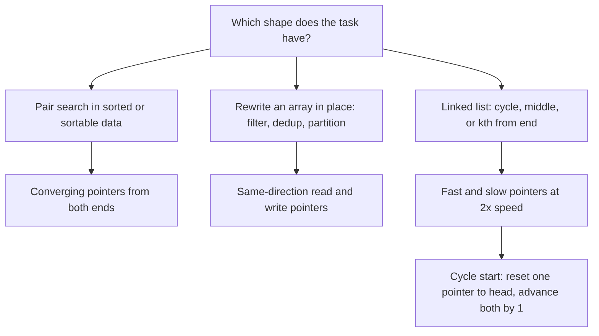

# Pattern Deep Dive: Two Pointers

## Overview

The two pointers pattern replaces a nested O(n²) loop with a single O(n) pass by maintaining two indices whose movement rules encode the search logic. It comes in three choreographies — converging from both ends, same-direction read/write, and fast/slow — and recognizing which one a problem needs is most of the battle. The pattern exploits sorted order (for pair searches), stability requirements (for in-place rewrites), or structure (for cycle detection), and it is a top-five OA pattern because it saves both time and memory: O(n) time with O(1) extra space. This page gives the taxonomy with templates, a worked pair-sum trace, the Dutch flag partition, in-place dedup, stackless string compares, and a decision framework for choosing between two pointers and a hashmap.

## The Three Choreographies

Every two-pointer solution is one of three shapes. Converging pointers start at opposite ends and move toward each other, discarding elements as they go — this is the sorted-pair and area/trapping family. Same-direction pointers move at independent speeds left-to-right, typically a fast `read` scanning and a slow `write` marking where the next kept element goes — this is the in-place filter and partition family. Fast/slow pointers move at different speeds through a sequence to find a midpoint, a cycle, or an intersection — this is the linked-list family.

### Converging (ends toward the middle)

```python
def converging(arr):
    left, right = 0, len(arr) - 1
    while left < right:
        # combine/inspect arr[left] and arr[right]
        if should_move_left(arr, left, right):
            left += 1        # left is settled; it can never improve the answer
        else:
            right -= 1       # symmetric reasoning on the right
```

The correctness core is the **exchange (discard) argument**: each move must be justified by proving that every discarded pairing was worse than or equal to a pairing you keep. At each step at least one of the two elements is permanently settled, and total moves are at most n, so the loop is O(n). This is the choreography behind Two Sum II, 3Sum's inner loop, Container With Most Water, and Trapping Rain Water.

### Same-direction (read and write)

```python
def same_direction(arr):
    write = 0
    for read in range(len(arr)):
        if keep(arr[read]):          # filter predicate or partition class
            arr[write] = arr[read]   # or swap(arr[read], arr[write])
            write += 1
    return write                     # count of kept elements / boundary
```

The invariant is that `arr[0:write]` is the finished prefix and `arr[write:read]` is the discard area; everything from `read` onward is unexplored. Because `read` never passes `write` by more than the number of discards, each element is written at most once and the loop is O(n) with O(1) space. This shape covers Remove Duplicates, Remove Element, Move Zeroes, and — with a third pointer — the Dutch flag partition below.

### Fast and slow (Floyd's tortoise and hare)

```python
def has_cycle(head):
    slow = fast = head
    while fast and fast.next:
        slow = slow.next             # 1 step per iteration
        fast = fast.next.next        # 2 steps per iteration
        if slow is fast:
            return True
    return False                     # fast hit the end: no cycle
```

If a cycle of length \\(\lambda\\) starts \\(\mu\\) nodes after the head, the slow pointer reaches the cycle start after \\(\mu\\) steps and the fast pointer is then somewhere inside the cycle; from there the gap between them closes by 1 each step, so they must meet within \\(\lambda\\) more steps — total \\(O(\mu + \lambda)\\) time, O(1) space. To find the cycle *start* (LC 142), reset one pointer to the head and advance both one step at a time; they meet exactly at the cycle entrance because the meeting point satisfies \\(\mu + b = k\lambda\\) for the offset \\(b\\) inside the cycle, making \\(\mu\\) and the remaining cycle distance equal. The same speed trick finds the middle node (slow walks 1, fast 2 — when fast ends, slow is at the middle) and the kth node from the end (lead the fast pointer by k).

| Choreography | Invariant | Canonical problems |
|---|---|---|
| Converging | each move settles one endpoint | LC 167, 15, 11, 42 |
| Same-direction | `arr[0:write]` finished, `[write:read]` discarded | LC 26, 27, 75, 283 |
| Fast/slow | relative displacement grows by a constant | LC 141, 142, 287, 876 |



## Worked Example: Pair Sum on a Sorted Array

Given a sorted array and a target, find one pair summing to the target (LC 167). Take `nums = [1, 3, 4, 6, 8, 10, 13]` with `target = 12`; start `left = 0` (value 1) and `right = 6` (value 13). The move rule: if the sum is too small, the only way to increase it is to advance `left` (values grow left-to-right); if too large, retreat `right`; if equal, done.

| Step | left (val) | right (val) | Sum | Decision and why |
|---|---|---|---|---|
| 1 | 0 (1) | 6 (13) | 14 | too big → `right -= 1`; 13 is the largest possible partner for 1 and it already overshoots |
| 2 | 0 (1) | 5 (10) | 11 | too small → `left += 1`; 1's best remaining partner is 10 and it undershoots |
| 3 | 1 (3) | 5 (10) | 13 | too big → `right -= 1` |
| 4 | 1 (3) | 4 (8) | 11 | too small → `left += 1` |
| 5 | 2 (4) | 4 (8) | 12 | found → return indices (2, 4) |

The correctness argument is the discard proof in miniature. When `nums[left] + nums[right] < target`, then for every `r' < right`, `nums[left] + nums[r']` is even smaller, so no pair involving this `left` and any remaining right element can work — advancing `left` loses nothing. When the sum is too big, the symmetric statement holds for `right`. Each step therefore eliminates one element from consideration forever, giving at most n steps; this linear scan beats binary-searching for each element's partner, which costs O(n log n).

### Variant: Converging with a Separate Output (fill from the back)

Squares of a Sorted Array (LC 977) shows a second converging shape: two pointers read from a sorted-with-negatives array while the result is written into a fresh buffer **from the back**. The largest square sits at whichever end has the larger absolute value, so each step peels the biggest remaining square and writes it at the current end of the output.

```python
def sorted_squares(nums):
    n = len(nums)
    out = [0] * n
    left, right = 0, n - 1
    for pos in range(n - 1, -1, -1):     # fill from the largest slot down
        if abs(nums[left]) > abs(nums[right]):
            out[pos] = nums[left] ** 2
            left += 1
        else:
            out[pos] = nums[right] ** 2
            right -= 1
    return out
```

Filling from the back is the trick that makes one pass possible: filling forward would require knowing all the middle values first, because negative numbers square to values that belong late in the output. The same backwards-fill pattern solves "merge two sorted arrays with O(1) extra space in the larger buffer" (LC 88 Merge Sorted Array), where the write cursor starts at the last slot of the longer array. When you see "two sorted inputs, one output, O(1) extra", think backwards before forwards.

## Two Pointers vs Hashmap

Both patterns attack "find a pair" problems, and picking wrong costs time or memory. A hashmap trades O(n) space for a single unordered pass; converging pointers need sorted order but use O(1) extra space and generalize cleanly to triplets and in-sorted-order output. The table below is the decision framework interviewers expect you to articulate.

| Situation | Use | Why |
|---|---|---|
| Two Sum, unsorted, one pass | hashmap | index lookup in O(1); sorting would destroy indices |
| Two Sum II, already sorted | converging pointers | O(1) space beats hashmap; order already there |
| 3Sum / 4Sum, all unique tuples | sort + converging inner loop | dedup on sorted neighbors is easy; hashmap dedup is painful |
| Pair closest to target in sorted data | converging pointers | need to explore inward from extremes |
| Streaming input / cannot sort | hashmap | two pointers require random access and order |
| O(1) space is mandatory | two pointers | hashmap's O(n) memory is the dealbreaker |
| Count pairs with property in sorted array | converging + counting | moves are monotone so counts are computable in O(n) |

One nuance worth stating in interviews: for 3Sum, sort-first-then-converge is O(n²) time, and a hashmap approach is also O(n²) but with far worse duplicate handling and O(n) space — so the sorted converging version wins on every axis except that it mutates input order. If the problem demands original indices, copy the values with their indices, sort the copies, and map back, still O(1) *extra* asymptotically if index restoration is allowed to be part of output construction.

## Partitioning: Dutch National Flag

Sort an array of values 0, 1, 2 in one pass without counting (LC 75). Three pointers create four regions: `[0, lo)` holds zeros, `[lo, mid)` holds ones, `[mid, hi]` is unexplored, and `(hi, end)` holds twos. This is Dijkstra's Dutch national flag problem, and the same three-way partition is what makes quicksort handle duplicate-heavy arrays in O(n) per level instead of O(n²) total.

```python
def sort_colors(nums):
    lo, mid, hi = 0, 0, len(nums) - 1
    while mid <= hi:
        if nums[mid] == 0:
            nums[lo], nums[mid] = nums[mid], nums[lo]
            lo += 1
            mid += 1              # value swapped in from lo is settled
        elif nums[mid] == 2:
            nums[mid], nums[hi] = nums[hi], nums[mid]
            hi -= 1               # incoming value unexplored: do NOT advance mid
        else:
            mid += 1
```

The asymmetry between the two swap cases is the classic follow-up question, so be ready to explain it precisely. After swapping a 0 into `nums[mid]`, the value that lands at `mid` came from `lo`, which is inside the explored ones-region or is `mid` itself — so it is a 1 (or trivially the same element) and `mid` can safely advance. After swapping a 2 out, the value that lands at `mid` came from `hi`, in the unexplored region, so `mid` must stay put and re-examine it; advancing `mid` here can leave a 2 stranded in the middle, which is the standard wrong answer. Termination needs `mid <= hi`, not `mid < hi`, because `nums[hi]` is still unexplored when `mid == hi`.

## In-Place Dedup and Remove-Element

The read/write choreography solves a whole family of "compact the array" tasks with O(n) time and O(1) space. Removing duplicates from a sorted array (LC 26) keeps each distinct value once; the sorted order guarantees duplicates are adjacent, so comparing against the last written value suffices.

```python
def remove_duplicates(nums):
    write = 1
    for read in range(1, len(nums)):
        if nums[read] != nums[write - 1]:   # new distinct value
            nums[write] = nums[read]
            write += 1
    return write                            # first `write` slots are the answer
```

The same skeleton handles Remove Element (LC 27, predicate `nums[read] != val`), Move Zeroes (LC 283, then fill the tail with zeros or swap instead of overwrite), and the "at most two duplicates" generalization (LC 80, compare against `nums[write - 2]`). Two details interviewers probe: the return value is `write` itself, since it is one past the last written element, and the comparison target is `nums[write - 1]`, *not* `nums[read - 1]`, because overwritten positions may already have changed. Note that the unsorted-input version of dedup needs a hash set for the "seen" test — the array trick depends on sortedness.

## Stackless String Compares

Backspace String Compare (LC 844) asks whether two strings are equal after processing `#` as delete. Building both processed strings costs O(n) extra space; walking both strings **from the end** with a skip counter gives O(1) space, because backwards traversal resolves backspaces as you meet them — each `#` deletes the nearest previous live character.

```python
def backspace_compare(s, t):
    def next_live(s, i):
        skip = 0
        while i >= 0:
            if s[i] == '#':
                skip += 1               # one more deletion owed
            elif skip:
                skip -= 1               # this char is deleted
            else:
                return i                # this char survives
            i -= 1
        return -1

    i, j = len(s) - 1, len(t) - 1
    while True:
        i = next_live(s, i)
        j = next_live(t, j)
        if i >= 0 and j >= 0 and s[i] != t[j]:
            return False
        if (i >= 0) != (j >= 0):        # one string exhausted first
            return False
        if i < 0 and j < 0:
            return True
        i -= 1
        j -= 1
```

The general lesson generalizes beyond backspaces: any comparison under "later edits affect earlier content" is naturally processed right-to-left, because the suffix is stable while the prefix is not. Interviewers extend this to "compare after k deletions", "merge two strings with backspaces", or "minimum deletions to make equal" (LC 1653-style DP hooks). If you produce the O(n)-space stack solution first, volunteering the backwards-walk upgrade is the expected optimization beat.

## Common Bugs

| Bug | Symptom | Fix |
|---|---|---|
| Only one pointer moves after a match | infinite loop or duplicate outputs with repeated values | advance *both* pointers past equal values (3Sum dedup) |
| Missing sort before converging | pairs silently missed on unsorted input | sort first (O(n log n)) or switch to hashmap |
| Advancing `mid` after the 2-swap | Dutch flag leaves a 2 in the middle | re-examine the swapped-in value; only `hi` moved |
| Loop guard `mid < hi` in Dutch flag | last element never classified | condition is `mid <= hi` |
| Comparing `nums[read - 1]` in dedup | compaction reads overwritten slots | compare against `nums[write - 1]` |
| Returning `write + 1` as count | off-by-one in length | `write` is already one past the last kept element |
| Fast pointer jumping 3+ steps | misses the meeting point in short cycles | keep speeds 1 and 2; use the head-reset trick for cycle start |
| Using two pointers on unsorted data for pair sums | wrong answers, not just slowdowns | the discard argument requires sorted order |

## Practice Set

| # | Problem (LeetCode) | Choreography | Key move rule |
|---|---|---|---|
| 167 | [Two Sum II — Sorted Input](https://leetcode.com/problems/two-sum-ii-input-array-is-sorted/) | converging | sum vs target |
| 15 | [3Sum](https://leetcode.com/problems/3sum/) | fix one + converging | skip duplicates on all three pointers |
| 11 | [Container With Most Water](https://leetcode.com/problems/container-with-most-water/) | converging | move the shorter line |
| 42 | [Trapping Rain Water](https://leetcode.com/problems/trapping-rain-water/) | converging | move the side with smaller max |
| 75 | [Sort Colors](https://leetcode.com/problems/sort-colors/) | three pointers | Dutch flag invariants |
| 26 | [Remove Duplicates from Sorted Array](https://leetcode.com/problems/remove-duplicates-from-sorted-array/) | read/write | compare with last written |
| 27 | [Remove Element](https://leetcode.com/problems/remove-element/) | read/write | filter predicate |
| 283 | [Move Zeroes](https://leetcode.com/problems/move-zeroes/) | read/write | swap non-zeros forward |
| 141 | [Linked List Cycle](https://leetcode.com/problems/linked-list-cycle/) | fast/slow | speeds 1 and 2 |
| 142 | [Linked List Cycle II](https://leetcode.com/problems/linked-list-cycle-ii/) | fast/slow + reset | head-reset finds entry |
| 876 | [Middle of the Linked List](https://leetcode.com/problems/middle-of-the-linked-list/) | fast/slow | fast 2x ends at middle |
| 844 | [Backspace String Compare](https://leetcode.com/problems/backspace-string-compare/) | converging + skips | backwards skip counters |
| 881 | [Boats to Save People](https://leetcode.com/problems/boats-to-save-people/) | converging | pair heaviest with lightest |
| 977 | [Squares of a Sorted Array](https://leetcode.com/problems/squares-of-a-sorted-array/) | converging | fill result from the back |

Suggested order: 167 and 26 to lock the converging and read/write invariants, then 15 and 75 as the dedup/partition stress tests, then the linked-list trio, and finally 42 — the strongest converging-pointer correctness workout, since it needs the "smaller side's max decides" argument stated out loud.

## Interview Questions

1. **Why does moving the shorter line in Container With Most Water never skip the optimum?** Suppose `height[left] < height[right]`; the current area is bounded by `height[left]`. Keeping `left` fixed and moving `right` inward can only reduce width while the limiting height stays `height[left]`, so no pair `(left, r')` with `r' < right` can beat pairs already considered or future pairs with a taller left. Therefore `left` is settled and can be discarded, and by induction every step preserves the optimum inside the remaining range. Each step discards exactly one endpoint, so the loop is O(n). This exchange-argument style answer is what the interviewer wants, not just the code.

2. **How does Floyd's algorithm locate the start of a cycle?** Let μ be the distance from head to cycle entry and λ the cycle length. When both pointers meet, the slow pointer has traveled μ + b steps into the cycle for some offset b, and the fast one exactly twice as far; equating positions gives 2(μ + b) ≡ μ + b (mod λ), so μ + b = kλ. Resetting one pointer to the head and advancing both one step at a time means that after μ steps, one pointer has walked μ from the head and the other has walked μ from the meeting point — which lands it exactly at the cycle entry since kλ − b = μ. They therefore meet at the entry node, in O(n) time and O(1) space.

3. **When would you choose a hashmap over two pointers for a pair problem?** Choose the hashmap when the input is unsorted and indices must be preserved (Two Sum), when you get a stream you cannot reorder, or when the pairing predicate is not monotone in value order. Choose converging pointers when the data is sorted or sortable, when O(1) space matters, or when you need all tuples with dedup (3Sum), where sorted neighbors make duplicate skipping trivial. State the trade-off explicitly: hashmap is O(n) time and O(n) space in one pass; two pointers are O(n) time after an O(n log n) sort with O(1) extra space. Interviewers are listening for the space axis, which candidates often forget.

4. **Why can `mid` advance after the zero-swap but not after the two-swap in Dutch flag?** After swapping with `lo`, the value now at `mid` came from the ones-region `[lo, mid)` or is `mid` itself, so it is a 1 — already classified, safe to skip. After swapping with `hi`, the value now at `mid` came from the unexplored region `(hi, end]`, so its class is unknown and must be inspected in the next iteration. Advancing `mid` after the two-swap leaves unexamined values inside the middle region and produces the classic "one 2 stuck in the middle" wrong answer. The loop must also use `mid <= hi` because the element at `hi` is still unexplored.

5. **Prove the read/write compaction loop is correct and linear.** Invariant: `arr[0:write]` holds exactly the kept elements in original order, and `arr[write:read]` holds discarded values. Each iteration either writes one element (advancing both pointers) or skips one (advancing `read` alone), so the finished prefix grows monotonically and never contradicts the invariant. `read` visits each index once, so the loop is O(n) with O(1) extra space, and the return value `write` equals the number of kept elements. The sorted-dedup variant is a special case where the predicate is "differs from the last written value", which works only because duplicates are adjacent in sorted input.

6. **How do you find the kth node from the end of a linked list in one pass?** Advance a fast pointer k nodes from the head, then advance fast and slow together until fast falls off the end; slow is then the kth node from the end because the gap of k was maintained throughout. One pass, O(1) space, and no length pre-computation. Handle the two edge cases explicitly: k equals the list length (slow should be the head) and k exceeds the length (report an error or return null). Mention that this is the same lead-by-k trick used in "remove nth node from end", where the fast pointer is led by k+1 so the slow pointer lands on the node *before* the deletion target.

## Key Takeaways

- Two pointers is really three patterns: converging (sorted pair search), same-direction (in-place rewrite), fast/slow (cycles and midpoints).
- Every converging move needs a discard argument: prove the discarded pairings can never beat the ones you keep.
- Same-direction compaction keeps the invariant "`arr[0:write]` finished, `[write:read]` discarded" and returns `write` as the count.
- Dutch flag partition: advance `mid` after the lo-swap, never after the hi-swap, and loop while `mid <= hi`.
- Prefer two pointers over a hashmap when data is sorted or space must be O(1); prefer hashmap when input is unsorted, streaming, or indices must survive.
- Fast/slow with speeds 1 and 2 finds cycles in O(μ + λ) time and O(1) space; the head-reset step locates the cycle entry.
- Backwards traversal with a skip counter handles "later edits change earlier content" compares stacklessly.
- Sort-first is allowed when the answer is about values, not original indices — copy with indices if mapping back is required.

## References

- Wikipedia — [Dutch national flag problem](https://en.wikipedia.org/wiki/Dutch_national_flag_problem) (Dijkstra's three-way partition, the basis of LC 75)
- Wikipedia — [Cycle detection](https://en.wikipedia.org/wiki/Cycle_detection) (Floyd's tortoise and hare, with the μ/λ analysis)
- cp-algorithms — [main site](https://cp-algorithms.com/) (techniques section covering two-pointer and merge-style scans)
- Dijkstra, E. W., *A Discipline of Programming*, Prentice-Hall 1976 — Chapter 14 develops the Dutch flag as an exercise in loop invariants
- LeetCode — [problem set](https://leetcode.com/problemset/) (individual problems linked in the practice table above)

## Cross-References

- [Two Pointers](../../dsa/chapters/ch34-two-pointers.md) — DSA chapter with additional pointer problems and proofs
- [Linked Lists Expanded](../../dsa/chapters/ch56-linked-lists-expanded.md) — fast/slow applications: cycle, middle, intersection
- [Sorting](../../dsa/chapters/ch05-sorting.md) — quicksort partitioning, where the Dutch flag idea originates
- [Hashing](../../dsa/chapters/ch07-hashing.md) — the hashmap alternative for pair problems
- [Binary Search](./pattern-binary-search.md) — the other sorted-data pattern; halving probes vs linear pointer moves
- [Sliding Window](./pattern-sliding-window.md) — same-direction pointers specialized to contiguous range constraints
- [Problem Patterns](./patterns.md) — the full pattern catalog
- [Coding Interview Preparation](./README.md) — section overview and study order
