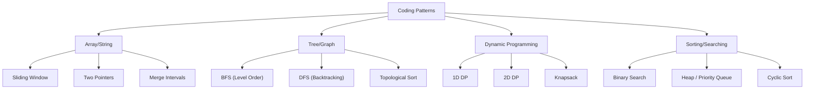

# Coding Interview Patterns

## Overview

Recognizing patterns is the key to solving coding interview problems efficiently. This guide covers the most common patterns that appear repeatedly in technical interviews at top companies.



---

## Pattern 1: Sliding Window

**When to use:** Problems involving contiguous subarrays/substrings of variable size.

**Key insight:** Instead of recalculating for every subarray, maintain a window and slide it by adding the new element and removing the old one.

### Fixed-Size Window

```python
def max_sum_subarray(nums: list, k: int) -> int:
    """Find maximum sum of subarray of size k. O(n) time, O(1) space."""
    window_sum = sum(nums[:k])
    max_sum = window_sum
    
    for i in range(k, len(nums)):
        window_sum += nums[i] - nums[i - k]  # Slide: add new, remove old
        max_sum = max(max_sum, window_sum)
    
    return max_sum
```

### Variable-Size Window

```python
def longest_substring_without_repeats(s: str) -> int:
    """Find longest substring without repeating characters."""
    seen = {}
    left = 0
    max_len = 0
    
    for right, char in enumerate(s):
        if char in seen and seen[char] >= left:
            left = seen[char] + 1  # Shrink window from left
        seen[char] = right
        max_len = max(max_len, right - left + 1)
    
    return max_len

def min_window_substring(s: str, t: str) -> str:
    """Find minimum window in s containing all characters of t."""
    from collections import Counter
    need = Counter(t)
    missing = len(t)
    left = 0
    start, end = 0, float('inf')
    
    for right, char in enumerate(s):
        if need[char] > 0:
            missing -= 1
        need[char] -= 1
        
        while missing == 0:  # Window valid, try to shrink
            if right - left < end - start:
                start, end = left, right
            need[s[left]] += 1
            if need[s[left]] > 0:
                missing += 1
            left += 1
    
    return s[start:end+1] if end != float('inf') else ""
```

### Template

```python
def sliding_window(s):
    left = 0
    result = 0
    window = {}  # or use a counter/set
    
    for right in range(len(s)):
        # Expand: add s[right] to window
        
        while window_invalid:  # Shrink condition
            # Remove s[left] from window
            left += 1
        
        result = max(result, right - left + 1)
    
    return result
```

**Problems:** Longest Substring Without Repeating Characters, Minimum Window Substring, Sliding Window Maximum, Permutation in String

---

## Pattern 2: Two Pointers

**When to use:** Sorted arrays, palindrome checking, pair finding, partitioning.

**Key insight:** Use two pointers moving toward each other or in the same direction to reduce O(n²) to O(n).

```python
def two_sum_sorted(nums: list, target: int) -> list:
    """Find two numbers that add up to target in sorted array."""
    left, right = 0, len(nums) - 1
    
    while left < right:
        current_sum = nums[left] + nums[right]
        if current_sum == target:
            return [left, right]
        elif current_sum < target:
            left += 1
        else:
            right -= 1
    
    return []

def three_sum(nums: list) -> list:
    """Find all unique triplets that sum to zero."""
    nums.sort()
    result = []
    
    for i in range(len(nums) - 2):
        if i > 0 and nums[i] == nums[i-1]:
            continue  # Skip duplicates
        
        left, right = i + 1, len(nums) - 1
        while left < right:
            total = nums[i] + nums[left] + nums[right]
            if total < 0:
                left += 1
            elif total > 0:
                right -= 1
            else:
                result.append([nums[i], nums[left], nums[right]])
                while left < right and nums[left] == nums[left+1]:
                    left += 1
                while left < right and nums[right] == nums[right-1]:
                    right -= 1
                left += 1
                right -= 1
    
    return result

def container_with_most_water(height: list) -> int:
    """Find two lines that together with x-axis form container holding most water."""
    left, right = 0, len(height) - 1
    max_area = 0
    
    while left < right:
        width = right - left
        h = min(height[left], height[right])
        max_area = max(max_area, width * h)
        
        if height[left] < height[right]:
            left += 1
        else:
            right -= 1
    
    return max_area
```

### Two Pointer Variations

| Variant | Direction | Use Case |
|---------|-----------|----------|
| Opposite ends | ← → | Sorted array pair finding |
| Same direction | → → | Fast/slow pointer, partitioning |
| Sliding window | ← → (variable) | Substring problems |

**Problems:** Two Sum, Three Sum, Container With Most Water, Trapping Rain Water, Remove Duplicates

---

## Pattern 3: Fast & Slow Pointers

**When to use:** Linked list cycle detection, finding middle element, detecting palindromes.

```python
def has_cycle(head: ListNode) -> bool:
    """Detect cycle in linked list. Floyd's algorithm."""
    slow = fast = head
    while fast and fast.next:
        slow = slow.next
        fast = fast.next.next
        if slow == fast:
            return True
    return False

def find_middle(head: ListNode) -> ListNode:
    """Find middle of linked list."""
    slow = fast = head
    while fast and fast.next:
        slow = slow.next
        fast = fast.next.next
    return slow

def find_cycle_start(head: ListNode) -> ListNode:
    """Find where cycle begins."""
    slow = fast = head
    while fast and fast.next:
        slow = slow.next
        fast = fast.next.next
        if slow == fast:
            # Found cycle. Move one pointer to head.
            slow = head
            while slow != fast:
                slow = slow.next
                fast = fast.next
            return slow
    return None
```

**Problems:** Linked List Cycle, Happy Number, Find Duplicate Number

---

## Pattern 4: Merge Intervals

**When to use:** Overlapping intervals, meeting rooms, range problems.

```python
def merge_intervals(intervals: list) -> list:
    """Merge all overlapping intervals."""
    intervals.sort(key=lambda x: x[0])
    merged = [intervals[0]]
    
    for start, end in intervals[1:]:
        if start <= merged[-1][1]:  # Overlap
            merged[-1][1] = max(merged[-1][1], end)
        else:
            merged.append([start, end])
    
    return merged

def insert_interval(intervals: list, new_interval: list) -> list:
    """Insert new interval and merge overlaps."""
    result = []
    i = 0
    
    # Add intervals before new_interval
    while i < len(intervals) and intervals[i][1] < new_interval[0]:
        result.append(intervals[i])
        i += 1
    
    # Merge overlapping intervals
    while i < len(intervals) and intervals[i][0] <= new_interval[1]:
        new_interval[0] = min(new_interval[0], intervals[i][0])
        new_interval[1] = max(new_interval[1], intervals[i][1])
        i += 1
    result.append(new_interval)
    
    # Add remaining intervals
    while i < len(intervals):
        result.append(intervals[i])
        i += 1
    
    return result
```

**Problems:** Merge Intervals, Insert Interval, Meeting Rooms, Interval List Intersections

---

## Pattern 5: Cyclic Sort

**When to use:** Problems involving arrays with numbers in range [1, n].

```python
def find_missing_numbers(nums: list) -> list:
    """Find all missing numbers in range [1, n]. O(n) time, O(1) space."""
    i = 0
    while i < len(nums):
        correct = nums[i] - 1
        if nums[i] != nums[correct]:
            nums[i], nums[correct] = nums[correct], nums[i]
        else:
            i += 1
    
    return [i + 1 for i, num in enumerate(nums) if num != i + 1]

def find_duplicate(nums: list) -> int:
    """Find the duplicate number in array of n+1 integers in [1, n]."""
    for num in nums:
        idx = abs(num) - 1
        if nums[idx] < 0:
            return abs(num)
        nums[idx] = -nums[idx]
    return -1
```

**Problems:** Find All Numbers Disappeared, Find the Duplicate Number, First Missing Positive

---

## Pattern 6: Tree BFS (Level Order)

**When to use:** Level-by-level traversal, shortest path in unweighted graph, connecting level siblings.

```python
from collections import deque

def level_order(root: TreeNode) -> list:
    """Level-order traversal of binary tree."""
    if not root:
        return []
    
    result = []
    queue = deque([root])
    
    while queue:
        level_size = len(queue)
        level = []
        for _ in range(level_size):
            node = queue.popleft()
            level.append(node.val)
            if node.left:
                queue.append(node.left)
            if node.right:
                queue.append(node.right)
        result.append(level)
    
    return result

def zigzag_level_order(root: TreeNode) -> list:
    """Zigzag level-order traversal."""
    if not root:
        return []
    
    result = []
    queue = deque([root])
    left_to_right = True
    
    while queue:
        level_size = len(queue)
        level = deque()
        for _ in range(level_size):
            node = queue.popleft()
            if left_to_right:
                level.append(node.val)
            else:
                level.appendleft(node.val)
            if node.left:
                queue.append(node.left)
            if node.right:
                queue.append(node.right)
        result.append(list(level))
        left_to_right = not left_to_right
    
    return result
```

### Graph BFS (Shortest Path)

```python
def bfs_shortest_path(graph: dict, start: str, end: str) -> int:
    """Shortest path in unweighted graph."""
    queue = deque([(start, 0)])
    visited = {start}
    
    while queue:
        node, dist = queue.popleft()
        if node == end:
            return dist
        for neighbor in graph[node]:
            if neighbor not in visited:
                visited.add(neighbor)
                queue.append((neighbor, dist + 1))
    
    return -1  # Not reachable
```

**Problems:** Binary Tree Level Order, Rotting Oranges, Word Ladder, Number of Islands

---

## Pattern 7: Tree DFS

**When to use:** Path finding, tree properties, backtracking, serialization.

```python
def has_path_sum(root: TreeNode, target_sum: int) -> bool:
    """Check if tree has root-to-leaf path with given sum."""
    if not root:
        return False
    if not root.left and not root.right:
        return root.val == target_sum
    return (has_path_sum(root.left, target_sum - root.val) or
            has_path_sum(root.right, target_sum - root.val))

def max_depth(root: TreeNode) -> int:
    """Find maximum depth of binary tree."""
    if not root:
        return 0
    return 1 + max(max_depth(root.left), max_depth(root.right))

def serialize(root: TreeNode) -> str:
    """Serialize binary tree to string."""
    if not root:
        return "null"
    return f"{root.val},{serialize(root.left)},{serialize(root.right)}"

def deserialize(data: str) -> TreeNode:
    """Deserialize string to binary tree."""
    def helper(nodes):
        val = next(nodes)
        if val == "null":
            return None
        node = TreeNode(int(val))
        node.left = helper(nodes)
        node.right = helper(nodes)
        return node
    
    return helper(iter(data.split(",")))
```

**Problems:** Path Sum, Maximum Depth, Serialize/Deserialize, Diameter of Binary Tree

---

## Pattern 8: Backtracking

**When to use:** Generating combinations, permutations, subsets, constraint satisfaction.

### Template

```python
def backtrack(candidates, path, result):
    if is_solution(path):
        result.append(path[:])  # Copy!
        return
    
    for candidate in candidates:
        if is_valid(candidate, path):
            path.append(candidate)       # Choose
            backtrack(remaining, path, result)  # Explore
            path.pop()                   # Undo (backtrack)
```

### Examples

```python
def subsets(nums: list) -> list:
    """Generate all subsets."""
    result = []
    
    def backtrack(start, current):
        result.append(current[:])
        for i in range(start, len(nums)):
            current.append(nums[i])
            backtrack(i + 1, current)
            current.pop()
    
    backtrack(0, [])
    return result

def permutations(nums: list) -> list:
    """Generate all permutations."""
    result = []
    
    def backtrack(current, remaining):
        if not remaining:
            result.append(current[:])
            return
        for i, num in enumerate(remaining):
            current.append(num)
            backtrack(current, remaining[:i] + remaining[i+1:])
            current.pop()
    
    backtrack([], nums)
    return result

def combination_sum(candidates: list, target: int) -> list:
    """Find combinations that sum to target (can reuse elements)."""
    result = []
    
    def backtrack(start, current, remaining):
        if remaining == 0:
            result.append(current[:])
            return
        for i in range(start, len(candidates)):
            if candidates[i] > remaining:
                break
            current.append(candidates[i])
            backtrack(i, current, remaining - candidates[i])  # i, not i+1 (reuse)
            current.pop()
    
    candidates.sort()
    backtrack(0, [], target)
    return result
```

**Problems:** Subsets, Permutations, Combination Sum, N-Queens, Sudoku Solver, Word Search

---

## Pattern 9: Dynamic Programming

**When to use:** Optimal solutions, overlapping subproblems, counting problems, "number of ways" problems.

### 1D DP

```python
def climb_stairs(n: int) -> int:
    """Number of ways to climb n stairs (1 or 2 steps)."""
    if n <= 2:
        return n
    prev2, prev1 = 1, 2
    for _ in range(3, n + 1):
        prev2, prev1 = prev1, prev1 + prev2
    return prev1

def house_robber(nums: list) -> int:
    """Max money from non-adjacent houses."""
    if not nums:
        return 0
    if len(nums) == 1:
        return nums[0]
    
    prev2, prev1 = 0, 0
    for num in nums:
        prev2, prev1 = prev1, max(prev1, prev2 + num)
    return prev1
```

### 2D DP

```python
def lcs(text1: str, text2: str) -> int:
    """Longest common subsequence."""
    m, n = len(text1), len(text2)
    dp = [[0] * (n + 1) for _ in range(m + 1)]
    
    for i in range(1, m + 1):
        for j in range(1, n + 1):
            if text1[i-1] == text2[j-1]:
                dp[i][j] = dp[i-1][j-1] + 1
            else:
                dp[i][j] = max(dp[i-1][j], dp[i][j-1])
    
    return dp[m][n]

def edit_distance(word1: str, word2: str) -> int:
    """Minimum edit distance (insert, delete, replace)."""
    m, n = len(word1), len(word2)
    dp = [[0] * (n + 1) for _ in range(m + 1)]
    
    for i in range(m + 1):
        dp[i][0] = i
    for j in range(n + 1):
        dp[0][j] = j
    
    for i in range(1, m + 1):
        for j in range(1, n + 1):
            if word1[i-1] == word2[j-1]:
                dp[i][j] = dp[i-1][j-1]
            else:
                dp[i][j] = 1 + min(dp[i-1][j],      # delete
                                   dp[i][j-1],      # insert
                                   dp[i-1][j-1])    # replace
    
    return dp[m][n]
```

### Knapsack

```python
def knapsack_01(weights: list, values: list, capacity: int) -> int:
    """0/1 Knapsack: maximize value within capacity."""
    n = len(weights)
    dp = [[0] * (capacity + 1) for _ in range(n + 1)]
    
    for i in range(1, n + 1):
        for w in range(capacity + 1):
            dp[i][w] = dp[i-1][w]  # Don't take item i
            if weights[i-1] <= w:
                dp[i][w] = max(dp[i][w],
                              dp[i-1][w - weights[i-1]] + values[i-1])
    
    return dp[n][capacity]

def knapsack_unbounded(weights: list, values: list, capacity: int) -> int:
    """Unbounded Knapsack: can take each item multiple times."""
    dp = [0] * (capacity + 1)
    
    for w in range(1, capacity + 1):
        for i in range(len(weights)):
            if weights[i] <= w:
                dp[w] = max(dp[w], dp[w - weights[i]] + values[i])
    
    return dp[capacity]
```

### DP Approach Guide

```
1. Identify: Overlapping subproblems + optimal substructure?
2. Define state: What information do I need? (dp[i], dp[i][j], etc.)
3. Recurrence: How does dp[i] relate to dp[i-1], dp[i-2], ...?
4. Base case: What are the trivial cases?
5. Order: Bottom-up (tabulation) or top-down (memoization)?
6. Space optimize: Can I use O(1) or O(n) instead of O(n²)?
```

**Problems:** Climbing Stairs, House Robber, LCS, Edit Distance, Knapsack, Coin Change, Longest Increasing Subsequence

---

## Pattern 10: Topological Sort

**When to use:** Dependency resolution, course scheduling, build order, task scheduling.

```python
from collections import deque, defaultdict

def topological_sort(numCourses: int, prerequisites: list) -> list:
    """Course schedule - topological sort using BFS (Kahn's algorithm)."""
    graph = defaultdict(list)
    in_degree = [0] * numCourses
    
    for course, prereq in prerequisites:
        graph[prereq].append(course)
        in_degree[course] += 1
    
    queue = deque([i for i in range(numCourses) if in_degree[i] == 0])
    order = []
    
    while queue:
        node = queue.popleft()
        order.append(node)
        for neighbor in graph[node]:
            in_degree[neighbor] -= 1
            if in_degree[neighbor] == 0:
                queue.append(neighbor)
    
    return order if len(order) == numCourses else []  # Empty if cycle exists

def can_finish(numCourses: int, prerequisites: list) -> bool:
    """Check if all courses can be finished (no cycle in dependency graph)."""
    return len(topological_sort(numCourses, prerequisites)) == numCourses
```

**Problems:** Course Schedule, Alien Dictionary, Task Scheduler, Parallel Courses

---

## Pattern 11: Binary Search

**When to use:** Sorted data, search space reduction, finding boundary conditions.

```python
def search_rotated(nums: list, target: int) -> int:
    """Search in rotated sorted array."""
    left, right = 0, len(nums) - 1
    
    while left <= right:
        mid = (left + right) // 2
        if nums[mid] == target:
            return mid
        
        if nums[left] <= nums[mid]:  # Left half sorted
            if nums[left] <= target < nums[mid]:
                right = mid - 1
            else:
                left = mid + 1
        else:  # Right half sorted
            if nums[mid] < target <= nums[right]:
                left = mid + 1
            else:
                right = mid - 1
    
    return -1

def find_first_occurrence(nums: list, target: int) -> int:
    """Find first occurrence of target in sorted array."""
    left, right = 0, len(nums) - 1
    result = -1
    
    while left <= right:
        mid = (left + right) // 2
        if nums[mid] == target:
            result = mid
            right = mid - 1  # Keep searching left
        elif nums[mid] < target:
            left = mid + 1
        else:
            right = mid - 1
    
    return result
```

### Binary Search on Answer Space

```python
def min_ship_capacity(weights: list, days: int) -> int:
    """Find minimum ship capacity to ship all packages in D days."""
    left, right = max(weights), sum(weights)
    
    while left < right:
        mid = (left + right) // 2
        # Check if capacity 'mid' can ship in 'days' days
        current_load, days_needed = 0, 1
        for w in weights:
            if current_load + w > mid:
                days_needed += 1
                current_load = 0
            current_load += w
        
        if days_needed <= days:
            right = mid
        else:
            left = mid + 1
    
    return left
```

**Problems:** Search in Rotated Array, Find Peak Element, Search a 2D Matrix, Capacity to Ship Packages

---

## Pattern 12: Heap / Priority Queue

**When to use:** Top K elements, merge K sorted, scheduling, median finding.

```python
import heapq

def top_k_frequent(nums: list, k: int) -> list:
    """Find k most frequent elements."""
    count = {}
    for num in nums:
        count[num] = count.get(num, 0) + 1
    
    return heapq.nlargest(k, count.keys(), key=count.get)

def merge_k_sorted(lists: list) -> list:
    """Merge k sorted lists."""
    heap = []
    for i, lst in enumerate(lists):
        if lst:
            heapq.heappush(heap, (lst[0], i, 0))
    
    result = []
    while heap:
        val, list_idx, elem_idx = heapq.heappop(heap)
        result.append(val)
        if elem_idx + 1 < len(lists[list_idx]):
            next_val = lists[list_idx][elem_idx + 1]
            heapq.heappush(heap, (next_val, list_idx, elem_idx + 1))
    
    return result

class MedianFinder:
    """Find median from data stream using two heaps."""
    def __init__(self):
        self.lo = []  # max-heap (negate values)
        self.hi = []  # min-heap
    
    def add_num(self, num: int):
        heapq.heappush(self.lo, -num)
        heapq.heappush(self.hi, -heapq.heappop(self.lo))
        if len(self.hi) > len(self.lo):
            heapq.heappush(self.lo, -heapq.heappop(self.hi))
    
    def find_median(self) -> float:
        if len(self.lo) > len(self.hi):
            return -self.lo[0]
        return (-self.lo[0] + self.hi[0]) / 2.0
```

**Problems:** Top K Frequent Elements, Merge K Sorted Lists, Find Median from Data Stream, Kth Largest Element

---

## Summary Table

| Pattern | Key Technique | Time | Space |
|---------|--------------|------|-------|
| Sliding Window | Window expansion/contraction | O(n) | O(1) or O(k) |
| Two Pointers | Converging pointers | O(n) | O(1) |
| Fast & Slow | Different speed traversal | O(n) | O(1) |
| Merge Intervals | Sort + merge | O(n log n) | O(n) |
| Cyclic Sort | In-place swap | O(n) | O(1) |
| Tree BFS | Queue-based level traversal | O(n) | O(w) |
| Tree DFS | Recursive/stack traversal | O(n) | O(h) |
| Backtracking | Explore + undo | O(2^n) | O(n) |
| DP | Memoization/tabulation | O(n²) typical | O(n²) typical |
| Topological Sort | BFS/DFS on DAG | O(V+E) | O(V+E) |
| Binary Search | Halve search space | O(log n) | O(1) |
| Heap | Priority-based extraction | O(n log k) | O(k) |

## How to Identify the Pattern

```
1. "Contiguous subarray/substring" → Sliding Window
2. "Sorted array, pair/triplet" → Two Pointers
3. "Linked list cycle" → Fast & Slow Pointers
4. "Overlapping intervals" → Merge Intervals
5. "Numbers in [1, n]" → Cyclic Sort
6. "Level-by-level" → BFS
7. "All paths/combinations" → DFS + Backtracking
8. "Optimal/minimum/maximum/count ways" → DP
9. "Dependencies/ordering" → Topological Sort
10. "Sorted, find element" → Binary Search
11. "Top K / smallest K" → Heap
12. "Connected components" → Union-Find or BFS/DFS
```

## Related Topics

- [Coding Overview](./README.md) — Interview coding preparation
- [System Design](../system-design/) — System design interviews
