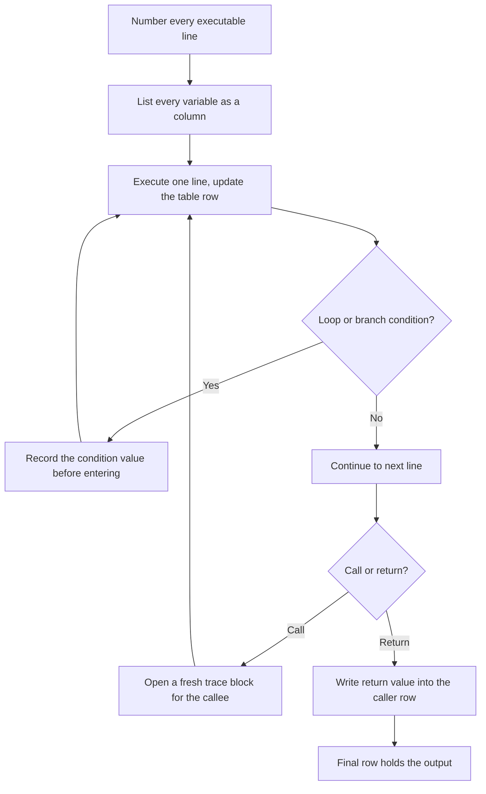
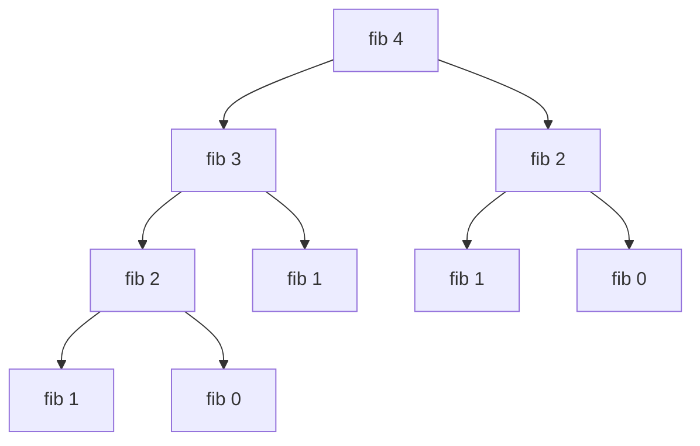

# Reading Pseudocode in Online Assessments

## Overview

Some OAs present algorithms in pseudocode and ask you to predict output, find bugs, or implement the logic in your chosen language. Pseudocode varies by source but follows predictable conventions, and the questions are almost always answerable by systematic tracing rather than by insight. This page gives you the variable-table trace method, nested-loop complexity drills, a recursion call-tree procedure, a catalog of logic-bug classes, and the mutable-vs-immutable traps that separate candidates who guess from candidates who know.

## Common Pseudocode Conventions

| Convention | Meaning |
|-----------|---------|
| `A[1..n]` | Array indexed from 1 to n (1-based) |
| `A[0..n-1]` | Array indexed from 0 to n-1 (0-based) |
| `for i = 1 to n` | Inclusive range: i takes values 1, 2, ..., n |
| `for i = 0 to n-1` | Inclusive range: i takes values 0, 1, ..., n-1 |
| `while x > 0 do` | Loop body indented below |
| `x ← value` or `x := value` | Assignment (not equality check) |
| `return x` | Function returns x |
| `if ... then ... else ... end if` | Conditional block |
| `MOD` or `%` | Modulo operator |
| `DIV` or `/` | Integer division (floor) unless specified |
| `len(A)` or `length(A)` | Size of array A |
| `append(A, x)` or `A.push(x)` | Add x to end of A |
| `swap(A[i], A[j])` | Exchange values at indices i and j |
| `∞` or `INF` | Infinity / very large number |
| `NULL` or `nil` | Null/empty reference |

Conventions differ from real code in four recurring ways, and each difference is a planted trap. First, `x ← x + 1` is assignment, but pseudocode also writes `x = y` inside conditions where a C programmer reads assignment — the writer intends comparison. Second, `/` usually means integer division even when the operands would not divide evenly, which silently truncates intermediate values. Third, `for i = 1 to n` is inclusive on both ends, unlike Python's `range(1, n)`. Fourth, `swap` and `append` are assumed to mutate their arguments, which matches Python lists and C++ vector references but *not* C++ pass-by-value or Java primitive arguments — when translating, you must decide explicitly.

## Key Differences to Watch For

**1-based vs 0-based indexing** is the single most common source of errors. If the pseudocode says `A[1]`, it's 1-based. When translating to Python (0-based), subtract 1 from all indices, and remember that loop bounds shift with them: a 1-based `for i = 1 to n` becomes `for i in range(n)` iterating over indices `0..n-1`, not `range(1, n+1)`.

**Inclusive vs exclusive ranges:** `for i = 1 to n` includes n. Python's `range(1, n)` does *not* include n — use `range(1, n + 1)`. Off-by-one questions are built almost exclusively from this one difference, so it pays to re-derive the loop count on n = 3 every single time.

**Integer division:** Pseudocode `5 / 2` often means integer division (result: 2). Python 3 requires `5 // 2`. Java/C/C++ integer division is automatic for int types, but truncation toward zero differs from floor division for negatives: `-7 / 2` is `-3` in C (truncation) but `-4` with Python's `//` (floor). When a pseudocode question involves negative operands, this distinction is usually the whole answer.

## The Variable-Table Trace Method

Tracing is a skill with a procedure, and the procedure is a table. One column per variable, one column for the line number, and one row per *state change* — not per line, because a line that changes nothing wastes space and hides the rows that matter. The rules:

1. **Number every executable line** before starting; you will reference line numbers when a question asks "what is x after line 7?"
2. **Write every variable in the header**, including loop counters and array cells that change (track array cells as `A[1]`, `A[2]`, ... columns).
3. **Update the table one line at a time**, crossing out the old value and writing the new one — never skip ahead on a confident line, because the errors you make by skipping are exactly what the question is testing.
4. **Record loop-condition checks** as rows, because the iteration count is where off-by-one bugs live.
5. **Stop at `return`** and read the answer off the final row.

Worked example — trace `x ← 0; for i = 1 to 4 do x ← x + i * i`:

```
Step | Line              | i | x (before) | i*i | x (after)
  1  | init              | - |     —      |  —  |    0
  2  | i = 1, body       | 1 |     0      |  1  |    1
  3  | i = 2, body       | 2 |     1      |  4  |    5
  4  | i = 3, body       | 3 |     5      |  9  |   14
  5  | i = 4, body       | 4 |    14      |  16 |   30
  6  | loop check: i = 5 | 5 |    30      |  —  |   exit
```

Result: x = 30. Note row 6: the loop condition is checked one extra time after the last body execution, and exam questions love asking "how many times is the condition evaluated?" (five times here) versus "how many times does the body run?" (four). A table with these boundary rows makes both answers visible instead of guessed.

## Trace Workflow



The workflow scales from a 4-line snippet to a full algorithm because every construct reduces to the same three row types: assignment, condition check, and call/return. Keep rows coarse — one row per state change — or a 30-line program produces a table too large to finish in two minutes. If the question offers multiple-choice outputs, diff your final row against the options; when your value is not listed, re-check the *boundary rows* first, since that is where tracing errors concentrate.

## Nested-Loop Complexity Reading Drills

Complexity questions are tracing questions with the values removed — you only need iteration counts. For each snippet, derive the count before reading the answer. The general tool is the sum: total work equals the sum of the inner loop's iterations over the outer loop's values.

**Drill 1**
```
for i = 1 to n:
    j = i
    while j > 0:
        j = j DIV 2
```
Answer: O(n log n). The inner loop halves i, so it runs ⌊log₂ i⌋ + 1 times; summing log i for i = 1..n gives log(n!) ≈ n log n.

**Drill 2**
```
for i = 1 to n:
    for j = i to n:
        work
```
Answer: O(n²). The inner loop runs n − i + 1 times, and the sum is n(n+1)/2. Triangular loops are still Θ(n²) — the half factor never changes the class.

**Drill 3**
```
i = 1
while i <= n:
    i = i * 2
```
Answer: O(log n). i takes values 1, 2, 4, ..., 2^⌈log₂ n⌉, so there are ⌈log₂ n⌉ + 1 iterations. Doubling and halving loops are always logarithmic.

**Drill 4**
```
for i = 1 to n:
    for j = 1 to i * i:
        work
```
Answer: O(n³). The inner count is i², and Σ i² = n(n+1)(2n+1)/6 ≈ n³/3. The lesson: polynomial inner bounds make the sum polynomial of one higher degree.

**Drill 5**
```
i = 1, j = n
while i < j:
    if A[i] + A[j] == target:
        return true
    if A[i] + A[j] < target:
        i = i + 1
    else:
        j = j - 1
```
Answer: O(n). Each iteration moves exactly one pointer inward by one, and the gap j − i strictly shrinks, so the loop runs at most n − 1 times. This is the two-pointer skeleton, and recognizing it converts a frightening while-loop into a linear scan.

## Recursion Tracing and Call Trees

Recursion breaks the flat variable table because the same variable name exists in multiple stack frames at once. The fix is a *call tree*: one node per invocation, annotated with the argument, and the return value written next to the node once children resolve. Depth-first, left-to-right is the evaluation order, so you fill the tree the same way the machine does.

Example — `function fib(n): if n <= 1: return n; return fib(n-1) + fib(n-2)`, traced for fib(4):



Evaluation order is fib(3) fully, then fib(2). Leaves fib(1) return 1 and fib(0) returns 0; each fib(2) node returns 1; fib(3) returns 2; fib(4) returns 3. The tree also answers the complexity question directly: fib(4) makes 9 calls, and in general T(n) = T(n−1) + T(n−2) + 1, so the number of calls grows like Θ(φⁿ) — exponential, because the same fib(2) is computed twice in this small tree and exponentially many times at scale. Reading call counts off the tree is exactly how interviewers expect you to justify "naive recursion is exponential."

Flat recursion with an accumulator stays traceable in a table:

```
function f(n):              f(4) call sequence:
    if n <= 1: return 1     Call | Arg | Waits for | Returns
    return n + f(n - 1)      1   |  4  |   f(3)    | 4 + 3 = 7
                              2   |  3  |   f(2)    | 3 + 2 = 5
                              3   |  2  |   f(1)    | 2 + 1 = 3
                              4   |  1  |   base    | 1
```

The "Waits for" column is where candidates lose track: the caller is suspended until the callee returns, so arithmetic on line 2 happens *after* the entire subtree below it finishes. When a question asks for the return value, fill only the Returns column bottom-up; when it asks for printed output order, fill it top-down. Either way the call sequence table turns a mental-stack exercise into bookkeeping.

## Spotting Logic Bugs

Bug-hunting questions have a finite bug catalog, and scanning the catalog beats re-executing the program. Check initialization first, boundaries second, and data flow third — in that order, because init errors are the most common and the cheapest to spot.

| Bug class | What it looks like | How to catch it in a trace |
|-----------|--------------------|----------------------------|
| Init error | Accumulator declared *inside* the loop; `max ← 0` on an all-negative array; product starts at 0 instead of 1 | Ask "does the first iteration's result depend on a variable never written before?" |
| Off-by-one | `for i = 1 to n-1` processes n−1 of n items; `<` where `<=` is needed | Trace with n = 1 and n = 2 — the smallest legal inputs |
| Missing increment | `while i < n` with no `i = i + 1` in some branch | Check that every branch of the body moves the loop variable |
| Swap error | Uses `t ← A[i]; A[i] ← A[j]; A[j] ← t` but with i and j crossed, or reuses the temp variable for two purposes | Trace the swap on a 2-cell array with distinct values |
| Wrong comparison | `A[i] > max` where `>=` matters for duplicates/stability | Test with an array containing a duplicate maximum |
| Return-in-loop | `return` inside the first loop iteration instead of after it | Check whether the return can fire before the loop completes |

The all-negative-max bug deserves emphasis because it appears in real OAs constantly: initializing `max ← 0` is correct only when the domain is provably non-negative, and the fix (`max ← A[1]` or `max ← −∞`) is a one-line change. Similarly, the swapped-indices bug in `swap(A[i], A[j])` produces correct-looking output on symmetric inputs, so always trace swaps with *asymmetric* test data like `A = [7, 3]`. Both habits — adversarial inputs and first-iteration scrutiny — generalize to finding bugs in your own OA code, not just in exam pseudocode.

## Mutable vs Immutable Traps

Pseudocode says `swap(A[i], A[j])` and means it — arrays are mutable, and mutations are visible to the caller. Real languages differ, and MCQs exploit exactly those differences. In Python, lists and dicts are mutable and passed by object reference, so `append` inside a function changes the caller's list; but integers, floats, strings, and tuples are immutable, so `x = x + 1` inside a function rebinds a *local* name and the caller's `x` never moves. In C++, `vector<int> v` is copied by value unless the signature says `vector<int>& v`, which is the single most consequential `&` in the language.

The classic trap pair to memorize:

```python
def f1(lst): lst.append(9)        # caller sees [1, 2, 9]
def f2(lst): lst = lst + [9]      # caller's list unchanged — rebinds local name
```

`f1` mutates the object the name points to, while `f2` rebinds the name to a *new* object; the caller only observes the first. The same distinction appears in pseudocode questions that ask "what is A after the call?" — if the procedure ever does `A ← new array` versus `A[i] ← value`, those are rebinding and mutating respectively, and only the second survives the call. When a trace question mixes scalars and arrays in one function, expect the scalars to behave one way and the arrays the other, because that is precisely the asymmetry the question is paid to test.

## Converting Pseudocode to Your Language

### Step-by-step process

1. **Identify the indexing** — is it 0-based or 1-based? Adjust all array accesses.
2. **Identify the loop bounds** — convert inclusive ranges to the target language's convention.
3. **Identify data structures** — "array" could be a list (Python), vector (C++), or ArrayList (Java). "set" could be a hash set or tree set.
4. **Handle integer division** — replace `/` with `//` in Python if the pseudocode implies integer division.
5. **Translate conditionals** — pseudocode `if A[i] > 0 and A[i] < 10` translates directly; watch for `else if` vs `elif`.
6. **Test with the given example** — verify your translation produces the same output.

### Common translation pitfalls

| Pseudocode | Python | C++ |
|-----------|--------|-----|
| `A[1..n]` access | `A[i-1]` | `A[i-1]` |
| `for i = 1 to n` | `for i in range(1, n+1)` | `for (int i=1; i<=n; i++)` |
| `x ← x + 1` | `x += 1` | `x += 1;` |
| `x MOD y` | `x % y` | `x % y` |
| `A.push_back(x)` | `A.append(x)` | `A.push_back(x)` |

When asked to implement pseudocode, **don't optimize** — implement exactly what's written, then optimize if asked. Graders compare behavior against the pseudocode's semantics, and a clever rewrite that changes tie-breaking or evaluation order fails hidden tests. Keep the pseudocode's variable names in your implementation so you can diff your trace against your code line by line.

## Practice Snippets with Step Tables

**Snippet A — digit reversal.** What does this print for input 123?

```
x ← 123 (input)
y ← 0
while x > 0:
    y ← y * 10 + (x MOD 10)
    x ← x DIV 10
return y
```

| Step | x (before) | x MOD 10 | y (before) | y (after) | x (after) |
|------|-----------|----------|------------|-----------|-----------|
| 1 | 123 | 3 | 0 | 3 | 12 |
| 2 | 12 | 2 | 3 | 32 | 1 |
| 3 | 1 | 1 | 32 | 321 | 0 |

Output: 321. The snippet reverses decimal digits, and the trace also proves the termination condition: `DIV 10` strictly decreases x until it hits 0, so the loop always ends. Watch the edge input 0 — the loop body never runs and y stays 0, which is correct, but a translation using a `do-while` would print garbage for it.

**Snippet B — find the bug.** This is meant to return the maximum of `A[1..n]`:

```
max ← 0
for i = 1 to n:
    if A[i] > max:
        max ← A[i]
return max
```

The init-error table: with `A = [-5, -2, -9]`, every comparison `A[i] > 0` fails, so the function returns 0 — not an element of the array at all. The fix is `max ← A[1]` (or `max ← −∞`) before the loop, and then the loop can even start at i = 2. The deeper lesson for bug questions: whenever an accumulator's initial value is a constant, ask what input makes that constant *wrong*, because the question writer already has that input in hand.

## Interview Questions

1. **Why is the variable-table method better than mental execution?** Working memory holds roughly four items, while a 10-line snippet with three variables and a loop produces far more state transitions than that. The table externalizes every transition, which does two things: it makes off-by-one and boundary errors visible as concrete rows, and it lets you resume a trace after an interruption without re-deriving prior state. Under exam pressure, resumability is not a nicety — it is the difference between a recovered error and a spiraling one.
2. **How do you read the complexity of nested loops quickly?** Sum the inner loop's iteration count over the outer loop's range, and memorize the four standard sums: n iterations → O(n), triangular (Σ i) → O(n²), Σ i² → O(n³), and Σ log i → O(n log n). Any loop that multiplies or divides the counter is logarithmic, and pointer-inward loops that shrink a gap strictly each iteration are linear. These five templates cover essentially every loop-complexity MCQ, so the task becomes pattern matching rather than summation under time pressure.
3. **What does the fib(4) call tree teach beyond the return value?** It teaches cost: fib(4) makes 9 calls, and the duplicate fib(2) subtree visible in the diagram is the root cause of the exponential Θ(φⁿ) call count in naive recursion. Drawing the tree for n = 4 or 5 makes the redundancy concrete and motivates memoization as a one-line fix. It also gives you evaluation order for free — depth-first, left-to-right — which is exactly what output-order questions ask about.
4. **Why do mutable/immutable distinctions decide so many output-prediction questions?** Because a function that mixes scalar arguments with array arguments behaves asymmetrically: the scalar is rebound locally and the array is mutated in place. Candidates who treat all arguments uniformly get the scalar half or the array half wrong, and both distractor options are waiting. The rule to internalize: rebinding a name (`x = ...`, `lst = lst + ...`) is invisible to the caller, while mutating the object (`lst.append(...)`, `A[i] = ...`) is visible — in pseudocode and in Python alike.
5. **What is the fastest bug-scanning order for "find the error" questions?** Initialization first (is every variable written before read, and is the initial constant valid for all inputs?), then boundaries (trace n = 1 and n = 2), then data flow inside the loop (does every branch move the loop variable; is the return reachable at the right time). This order works because init errors are the most frequent, boundary errors the second most frequent, and both are checkable without understanding the algorithm's intent. Adversarial inputs — all negatives, duplicates, single element — finish the scan in seconds.

## Key Takeaways

- Trace with a variable table: one column per variable, one row per state change, boundary rows included — never run pseudocode in your head.
- Complexity reading is five sum templates: linear, triangular, cubic, n log n, and logarithmic doubling/halving.
- Recursion is a call tree: annotate arguments, fill returns bottom-up, and read both the output and the call count off the same tree.
- The bug catalog is short — init errors, off-by-one, missing increments, swap errors, wrong comparisons, early returns — and scanning it beats re-execution.
- Pseudocode `swap` and index writes mutate; rebinding (`x ← new value` on a parameter) does not escape the call — the mutable/immutable asymmetry is a favorite MCQ target.
- Negative operands plus `DIV` trigger the truncation-vs-floor difference between C and Python — check for it whenever negatives appear.
- When translating, preserve semantics exactly: keep names, keep evaluation order, and verify against the given example before submitting.

## References

- Python 3 official documentation — data model (mutability) and control flow: <https://docs.python.org/3/>
- cppreference — C++ pass-by-value vs references, integer division semantics: <https://en.cppreference.com/w/>
- MIT OpenCourseWare 6.006 (Introduction to Algorithms) — loop-invariant and pseudocode conventions: <https://ocw.mit.edu/courses/6-006-introduction-to-algorithms-spring-2020/>
- GeeksforGeeks — pseudocode and complexity reading practice banks: <https://www.geeksforgeeks.org/>

## Cross-References

- [MCQ Strategies](./mcq-strategies.md) — where pseudocode output-prediction questions appear and how they are scored
- [Online Assessment Strategies](./oa-strategies.md) — the coding-section workflow this tracing skill feeds into
- [Complexity Analysis](./complexity.md) — the full Big-O toolkit behind the nested-loop drills
- [Coding Framework](./framework.md) — the Understand/Match/Plan steps that reuse trace tables for hand simulation
- [Python Cheat Sheet](../../cheatsheets/python.md) — syntax reference for translation questions
