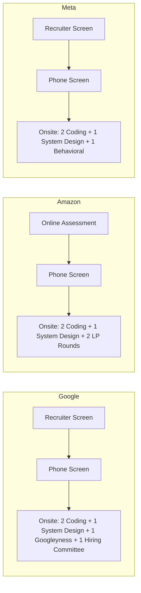

# Company-Specific Interview Guides

> Each company has a unique interview culture. Understanding these differences is crucial for success.

## Why Company-Specific Prep Matters

The same candidate can pass at one company and fail at another because:
- **Evaluation criteria differ** (Amazon's LPs vs Google's Googleyness)
- **Question styles differ** (Google's algorithmic depth vs Amazon's practical focus)
- **Cultural values differ** (Meta's "Move Fast" vs Apple's attention to detail)
- **Hiring bars differ** (Netflix's "A-player only" vs Microsoft's balanced approach)

## Interview Process Comparison

## Company Deep Dive

### Google

| Aspect | Details |
|--------|---------|
| **Focus** | Algorithms, system design, "Googleyness" |
| **Coding** | LeetCode Hard level, 2 questions in 45 min |
| **System Design** | Open-ended, focus on scalability |
| **Behavioral** | "Googleyness" — collaboration, humility, bias to action |
| **Hiring Committee** | Committee-based decision, not individual interviewers |
| **Tips** | Practice coding speed, explain trade-offs, show intellectual humility |

### Amazon

| Aspect | Details |
|--------|---------|
| **Focus** | Leadership Principles (LPs), practical system design |
| **Coding** | LeetCode Medium-Hard, focus on clean code |
| **System Design** | Practical, focus on AWS services and trade-offs |
| **Behavioral** | LP-based — prepare 2+ stories per LP |
| **Bar Raiser** | A trained interviewer from a different team evaluates cultural fit |
| **Tips** | Every answer must map to an LP, use STAR format, quantify impact |

### Microsoft

| Aspect | Details |
|--------|---------|
| **Focus** | Coding ability, problem-solving, cultural fit |
| **Coding** | LeetCode Medium-Hard, emphasis on clean code |
| **System Design** | Practical, often tied to Microsoft products |
| **Behavioral** | "As Appropriate" (AA) interviewer evaluates culture fit |
| **Tips** | Show passion for technology, be collaborative, demonstrate growth mindset |

### Meta (Facebook)

| Aspect | Details |
|--------|---------|
| **Focus** | Coding speed, system design, "Move Fast" culture |
| **Coding** | LeetCode Medium-Hard, speed matters |
| **System Design** | Large-scale distributed systems |
| **Behavioral** | Focus on impact, speed, and bold decision-making |
| **Tips** | Be fast and efficient, show bias for action, demonstrate impact at scale |

### Apple

| Aspect | Details |
|--------|---------|
| **Focus** | Deep technical expertise, attention to detail |
| **Coding** | Medium-Hard, often domain-specific |
| **System Design** | Focus on user experience and product thinking |
| **Behavioral** | Culture fit, collaboration, passion for products |
| **Tips** | Show attention to detail, demonstrate product sense, be collaborative |

### Netflix

| Aspect | Details |
|--------|---------|
| **Focus** | "A-player only" — high bar for talent density |
| **Coding** | Practical coding, real-world problems |
| **System Design** | Distributed systems, streaming architecture |
| **Behavioral** | "Freedom & Responsibility" — self-motivated, high judgment |
| **Tips** | Show you can work independently, demonstrate high judgment, be candid |

## Company-Specific Behavioral Focus

| Company | Key Values | Sample Questions |
|---------|-----------|-----------------|
| **Google** | Googleyness, general cognitive ability | "Tell me about a time you learned something outside your expertise" |
| **Amazon** | 16 Leadership Principles | "Tell me about a time you had to make a decision without data" |
| **Microsoft** | Growth mindset, diversity | "Describe a time you changed your opinion based on new information" |
| **Meta** | Move fast, be bold, build social value | "Tell me about a time you shipped something quickly despite uncertainty" |
| **Apple** | Simplicity, excellence, innovation | "Describe a time you obsessed over details to create an exceptional product" |
| **Netflix** | Freedom & responsibility, candor | "Tell me about a time you gave someone difficult feedback directly" |

## Preparation Timeline

| Timeframe | Action |
|-----------|--------|
| **4 weeks out** | Research company culture, read engineering blog, prepare story bank |
| **3 weeks out** | Practice company-specific coding problems (LeetCode company tags) |
| **2 weeks out** | Mock interviews with company-specific focus |
| **1 week out** | Review stories, practice behavioral answers aloud |
| **Day before** | Light review, rest, prepare logistics |

## Interview Tips by Company Type

### FAANG (Google, Amazon, Meta, Apple, Netflix)

- High bar for algorithmic thinking
- System design is critical (especially for senior roles)
- Behavioral rounds can make or break
- Speed matters — practice under time pressure
- Explain your thought process clearly

### High-Growth Startups

- More emphasis on practical skills over theoretical
- Culture fit is crucial (small team dynamics)
- Expect questions about wearing multiple hats
- Show ownership and initiative
- Demonstrate ability to learn quickly

### Enterprise (Microsoft, Oracle, IBM)

- Balanced evaluation across coding, design, and behavioral
- Growth mindset is valued
- Collaboration skills are heavily weighted
- Domain knowledge can be a differentiator
- Show passion for the company's products

## In This Section

| Guide | Description |
|-------|-------------|
| [Google](./google.md) | Deep dive into Google's interview process |
| [Amazon](./amazon.md) | Leadership Principles and LP-based preparation |
| [Microsoft](./microsoft.md) | Microsoft's interview culture and expectations |
| [Meta](./meta.md) | "Move Fast" culture and interview preparation |
| [Apple](./apple.md) | Apple's attention to detail and product focus |
| [Netflix](./netflix.md) | Freedom & Responsibility culture |

## Cross-References

- [Behavioral Interview](../behavioral/README.md) — Universal behavioral preparation
- [Coding Interview](../coding/README.md) — Universal coding preparation
- [System Design](../system-design/README.md) — Universal system design preparation

## References

- [Levels.fyi Interview Guides](https://www.levels.fyi/blog/) — Company-specific salary and interview data
- [Glassdoor Interview Reviews](https://www.glassdoor.com/Interview/) — Real interview experiences
- [Blind](https://www.teamblind.com/) — Anonymous company-specific discussions
- [LeetCode Company Tags](https://leetcode.com/problemset/) — Practice by company
- [Alex Xu's System Design Newsletter](https://blog.bytebytego.com/) — System design by company
