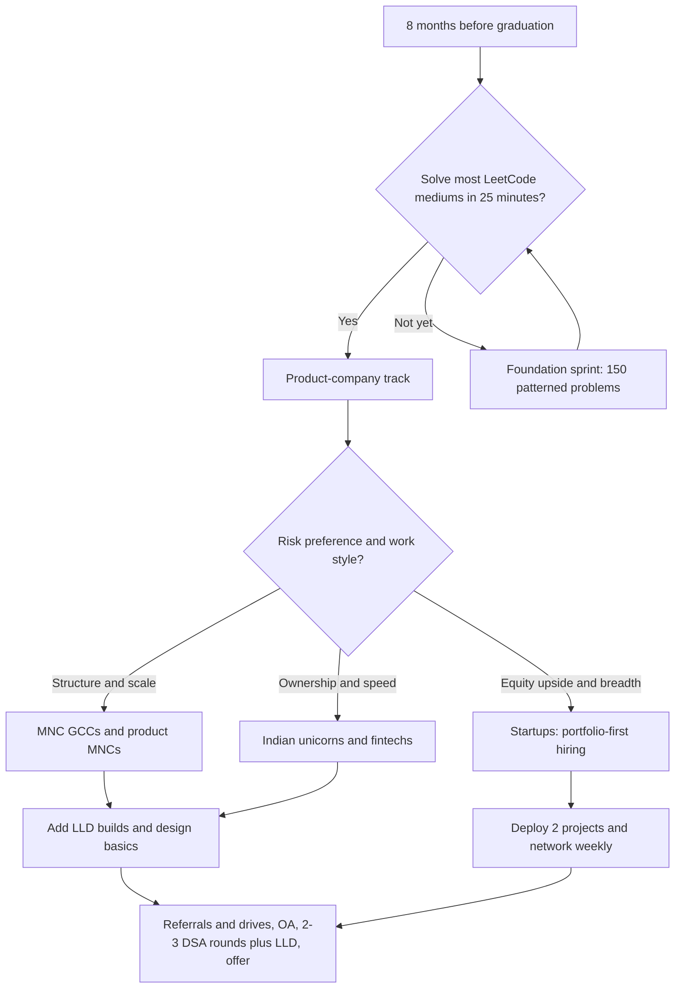

# Indian Product Companies — Hiring Landscape

## Overview

India's product companies — Flipkart, Swiggy, Zomato, PhonePe, Paytm, Razorpay, CRED, plus the Bangalore engineering centers of Atlassian, Adobe, Oracle, and Salesforce — run a fundamentally different hiring funnel from the mass-recruiter drives described in [Campus Placement](../../placement-preparation/campus-placement.md). The funnel is shorter, coding-heavier, and almost always includes a low-level-design (LLD) or machine-coding round that service companies rarely conduct. Compensation is structured as base pay plus equity (RSUs at mature firms, ESOPs at startups and unicorns), which changes how you should evaluate an offer. This page maps the typical funnel, the preparation delta versus the mass-recruiter plan, shortlisting tactics, and realistic timelines for fresher candidates.

## Accuracy Caveat: What Changes and What Does Not

Hiring processes at Indian product companies change every one to two cycles, and pay bands move with market conditions, so treat every specific figure on this page as **typical of recent cycles rather than a guarantee**. Round counts, OA difficulty, and compensation numbers drift; the *shape* of the funnel (OA → 2-3 technical rounds → hiring manager) and the *emphasis on LLD* are far more stable. Before you rely on any detail, verify it against the company's official careers portal (listed in the References section) and current candidate reports on [Levels.fyi](https://www.levels.fyi/). Nothing on this page should substitute for reading the actual job description and interview invite you receive.

## The Typical Fresher Funnel

Product companies hiring freshers in India converge on a remarkably similar four-to-five stage funnel, whether the company is a unicorn or an MNC GCC (Global Capability Center). The stages are consistent even when durations and scoring weights differ.

| Stage | What happens | Typical duration | What is scored |
|---|---|---|---|
| 1. Online Assessment | 2-4 pure coding problems (layouts A/B in the OA taxonomy), rarely aptitude | 90-120 min | Correctness, complexity, edge cases |
| 2. DSA round 1 | Live coding on arrays, strings, hash maps, trees | 45-60 min | Approach, code quality, communication |
| 3. DSA round 2 | Harder problem or DFS/DP/two-pointer variants; may include CS fundamentals probing | 45-60 min | Optimization instinct, handling hints |
| 4. LLD / machine-coding | Build a small working system (parking lot, Splitwise, rate limiter) in an IDE | 60-90 min | Class design, extensibility, working code |
| 5. Hiring manager | Projects, behavioral fit, motivation, sometimes light design discussion | 30-45 min | Ownership, culture fit, clarity |

Three features distinguish this funnel from the service-company pipeline. First, the OA is almost pure coding: aptitude sections are rare, so the aptitude-heavy practice that clears mass-recruiter drives contributes little here. Second, there is no group discussion or separate HR filter — the hiring manager round folds behavioral assessment into a technical conversation. Third, and most importantly, **the LLD round is the highest-signal filter**, because it is the round where memorized solutions stop working and candidates who copied their way through DSA prep get exposed.

### Inside the Product OA

Product-company OAs run on HackerRank, Codility, and CodeSignal rather than the AMCAT/CoCubes stack that mass recruiters favor, and the assessment design follows the audience: 2-4 coding problems, almost no aptitude, and hidden test suites that punish brute force. The implicit bar is usually solving 1.5 of 2 problems completely, since partial solutions score little on problems with all-or-nothing hidden cases. Layout A (pure coding) applies to most Indian unicorns, while large MNC GCCs often add 15-20 CS MCQs to make layout B. Platform-specific tactics — submission policies, per-problem timers, similarity checks — are covered in [Coding Assessments](../../placement-preparation/coding-assessments.md) and the logistics discipline in [Online Assessment Strategy](../../placement-preparation/online-assessment.md).

Practice mocks should replicate the *exact* layout of your target company rather than a generic mix, because section order changes fatigue patterns: two hard problems after thirty minutes of MCQs is a different test than two hard problems cold. If the OA uses per-problem timers, train with per-problem timers rather than a single shared clock. And read the invite for scoring rules — a few companies report your *first* submission's score, which converts the strategy from iterate-and-improve to verify-then-submit.

### The LLD / Machine-Coding Round

In a machine-coding round you are given a problem statement of the "design a parking lot / split expenses / schedule meeting rooms" family and expected to produce compiling, runnable code with sensible classes, not pseudocode. Interviewers score working behavior first, then class responsibilities, then extensibility ("add a new vehicle type without touching existing code") and clean boundaries between models, services, and repositories. Time pressure is real: most candidates produce 200-400 lines in 60-90 minutes, so typing fluency and a rehearsed skeleton matter as much as design theory. The dedicated practice set lives in the [Machine Coding Overview](../../machine-coding/README.md), with worked solutions such as [Parking Lot](../../machine-coding/parking-lot.md) and [Splitwise](../../machine-coding/splitwise.md) — do at least three end-to-end builds with a timer before your first interview.

## Company Snapshots (Typical Recent Cycles)

The table below compresses the publicly reported fresher funnel for the companies this page targets. Volatility warning applies: treat every cell as a recent-cycle pattern, not a contract, and re-verify each season.

| Company | Fresher funnel (typical) | Weighted emphasis | Notes |
|---|---|---|---|
| Flipkart | OA (2-3 coding) → 2 DSA rounds → LLD → hiring manager | DSA speed + LLD | Large campus + off-campus drives; early-career programs in recent cycles |
| Swiggy | OA → 2-3 technical rounds incl. machine coding | Working code, REST + LLD | Known for ESOP buybacks; strong engineering blog culture |
| Zomato | OA → 2 DSA + design-flavored rounds | Practical coding | Leaner hiring; fewer but deeper off-campus drives |
| PhonePe | OA (2-3 coding) → 3 technical rounds | DSA depth + system basics | High fresher volume via challenges and campus |
| Paytm | OA → 2-3 technical rounds | DSA + CS fundamentals | Mixed campus/off-campus; fintech scale questions |
| Razorpay | OA → DSA + strong LLD focus | LLD, API design | Backend roles weight machine coding heavily |
| CRED | OA → machine-coding round → design + fit | Craft, code quality | Small, selective engineering hiring; design taste matters |
| Atlassian (Bangalore) | OA → 2 coding + values/behavioral + design-lite | DSA + collaboration | Grad hiring on defined cycles; values round is a real filter |
| Adobe (Noida/Bangalore) | OA (coding + aptitude) → 2-3 tech rounds | DSA + CS fundamentals | Long-standing structured campus process; MTS-1 entry level |
| Oracle India | OA → 2-3 tech rounds | Fundamentals + SQL | Large fresher intake; band varies by business unit |
| Salesforce India | Internship (Futureforce) → return offer, or OA + rounds | DSA + values | Intern-to-hire is the dominant fresher path |

Two patterns are worth internalizing from this table. MNC GCCs (Atlassian, Adobe, Oracle, Salesforce) run more standardized, campus-calendar-driven processes with defined grade levels, while Indian unicorns hire opportunistically year-round and calibrate on machine-coding performance. Fintech and payments companies (PhonePe, Razorpay, CRED) push LLD weight highest because their domains are correctness-critical state machines — payments, ledgers, and offer engines.

### Unicorn Engineering Hiring (Flipkart, Swiggy, Zomato)

Consumer-internet unicorns hire in meaningful fresher volume and treat the OA as the primary volume filter, which makes OA performance the single highest-leverage skill for this tier. Their interviews emphasize producing working code quickly over theoretical purity — a candidate who reaches a correct, tested solution with clean structure beats one who narrates optimal complexity but stalls on implementation. Domains shape questions: Flipkart asks around catalogs, carts, and Big Billion Days scale; Swiggy and Zomato ask around logistics, dispatch, and realtime order state. Reading each company's engineering blog converts directly into hiring-manager-round credibility.

### Fintech and Payments Hiring (PhonePe, Paytm, Razorpay, CRED)

Payments companies hire for correctness under regulatory and money-moving constraints, so their rounds probe state handling, idempotency, and edge cases more than exotic algorithms. Expect LLD problems that are state machines at heart — wallets, settlements, refund flows — and expect follow-ups like "what happens if the callback arrives twice?" Razorpay and CRED additionally run machine-coding rounds that ask for runnable REST or CLI applications rather than class diagrams. CRED hires in smaller, more selective batches and weighs code craft and design taste heavily, so portfolio quality signals more than volume of applications.

### MNC GCC Hiring (Atlassian, Adobe, Oracle, Salesforce)

Global Capability Centers in Bangalore, Noida, and Hyderabad run the most standardized processes: defined grade levels (MTS-1 at Adobe, GCU/GBU bands at Oracle, AMTS at Salesforce), fixed campus calendars, and values-focused behavioral rounds modeled on the parent company's culture. Atlassian stands out for its genuine values round and among the highest fresher packages in the country, while Salesforce's dominant fresher path is the Futureforce internship converting to a return offer. Adobe and Oracle hire at the largest volume of the three, with structured multi-round processes that reward CS-fundamentals depth alongside DSA. For these companies, preparation is calendar management as much as skill: their campus-cycle postings appear once or twice a year and close fast.

### The Startup Track in Context

Early-stage startups (seed to Series B) sit adjacent to the companies above and hire on a different logic entirely: one founder-led conversation, one practical coding or take-home round, and an offer within two weeks. They rarely run OAs, weight deployed projects over competitive-programming ratings, and negotiate equity percentages rather than quoting fixed bands. For freshers they are simultaneously the easiest door to open and the riskiest offer to accept — equity is speculative, mentorship is uneven, and the resume signal depends heavily on the founding team. Treat startups as a deliberate second track (portfolio-first, referral-driven) rather than a fallback, and evaluate them with the same offer-evaluation checklist below.

## What Differentiates Product Hiring from Service Hiring

The [company-types comparison](./company-types.md) covers the general product-versus-service split; this section focuses on what that split means concretely for an Indian fresher. Service companies filter for trainable fundamentals at scale: aptitude, communication, and medium coding, assessed through platforms that can score thousands of candidates in one drive. Product companies filter for a demonstrated ability to ship correct code under constraints, which is why they spend interview rounds on live coding and machine-coding rather than on aptitude sections. The practical consequence is that the two funnels reward different preparation portfolios, and preparing for both simultaneously requires explicit time partitioning.

| Dimension | Product companies (India) | Service mass recruiters |
|---|---|---|
| OA content | 2-4 pure coding problems | Aptitude + CS MCQs + 1-2 easy coding + debugging |
| DSA depth | LeetCode medium standard; hard on good days | Easy level, speed and accuracy |
| LLD / machine coding | Core filter round | Essentially absent |
| System design | Basics expected of strong freshers; full HLD from SDE-2 | Not tested |
| CS fundamentals | Probed inside coding rounds | Dedicated MCQ sections |
| Offer structure | Base + RSU/ESOP + bonus | Mostly fixed CTC |
| Batch size | 10-200 per cycle | Thousands per drive |

### System Design Expectations for Freshers

Freshers are rarely asked full high-level design at Indian product companies, but interviewers increasingly probe *design instincts* inside the LLD or hiring-manager round. You should be able to draw a request's path through an API server, a database, and a cache; explain why you would add a queue between two services; and discuss read replicas versus caching for a read-heavy feature. The [System Design Index](../system-design/README.md) covers these primitives in depth — for fresher purposes, the first few pages plus one end-to-end case study are enough. Candidates who can reason at this level routinely outperform higher-LeetCode-rated peers who cannot.

## Compensation: Base, Stocks, and ESOP Reality

Product-company offers in India decompose into components that service-company CTC figures do not contain, and comparing offers requires separating guaranteed from contingent money. Base salary is fixed monthly cash; the performance bonus is usually a percentage of base with a target multiplier; RSUs are public-company stock vesting over years; ESOPs are private-company options whose value depends on exit events or buybacks. A useful habit is to compute **base + expected bonus as your floor**, then apply a personal haircut to equity when comparing offers.

| Component | Typical shape | Risk level | Notes |
|---|---|---|---|
| Base salary | ₹12-30 L per year for strong freshers, varies by company and cycle | None | The number to optimize for |
| Performance bonus | 5-15% of base, target-based | Low | Confirm whether year-1 pays pro-rata |
| RSUs (public cos) | Vest 25% per year over 4 years is common | Medium | Value floats with stock price; taxed at vest and sale |
| ESOPs (private cos) | 4-year vesting, 1-year cliff is standard | High | Illiquid until buyback, IPO, or exit |
| Joining bonus | One-time, sometimes with clawback | None | Check the clawback window |

The ESOP reality check deserves its own paragraph, because unicorn offers frequently quote CTC figures that fold in paper equity. Standard ESOP terms vest over four years with a one-year cliff — leave before year one and you typically keep nothing — and exercising options costs money (the strike price) while triggering tax events, so an ESOP grant is a bet you partially pay for out of pocket. Some Indian startups run periodic **buyback programs** that let employees sell vested options back to the company, and a track record of repeated buybacks materially de-risks the paper component. Ask three questions in every offer conversation: the latest 409A/valuation per share, the exercise price, and whether past buybacks occurred — then discount accordingly.

### Reported Fresher Bands (Volatile)

Public candidate reports in recent cycles place total first-year compensation roughly as follows: Adobe and Oracle in the ₹15-30 L band, Flipkart and PhonePe in the ₹25-40 L band, Atlassian at the top of the fresher market in the ₹40-55 L band, and Swiggy, Razorpay, CRED base-heavy in the ₹18-30 L band with ESOPs layered on top. These bands move with market cycles — 2021-22 inflated them, later corrections trimmed variable components — so re-check [Levels.fyi](https://www.levels.fyi/) and current offer letters rather than memorizing any table. The stable takeaway is the *ordering*: MNC GCC grad programs and payments unicorns pay the most, and service-company fixed CTC sits far below all of them.

## Interview-Prep Delta: What to Add to the Mass-Recruiter Plan

If you have been following the aptitude-and-fundamentals plan that clears mass-recruiter drives, the table below shows exactly what to add — and what to *keep* — to make the same calendar work for product companies. The mass-recruiter plan is not wasted; it is simply incomplete for this funnel.

| Area | Mass-recruiter plan | Product-company delta | Where to practice in this repo |
|---|---|---|---|
| Aptitude | Daily drills to 80%+ accuracy | Keep for safety net; stop investing beyond that | [Aptitude Index](../../aptitude/README.md) |
| Easy coding | Pattern-completion and dry runs | Maintain, but shift time to mediums | [Coding Assessments](../../placement-preparation/coding-assessments.md) |
| DSA mediums | Optional | **Core**: 150-250 curated mediums by pattern | [Sliding Window](../coding/pattern-sliding-window.md) and sibling pattern pages |
| LLD | Absent | **Core**: 3+ timed full builds | [Machine Coding Overview](../../machine-coding/README.md) |
| CS fundamentals | MCQ-level | Probe-ready: explain OS/DBMS answers in depth | [SQL Interview Rounds](../../placement-preparation/sql-rounds.md) |
| System design | Absent | Primitives + one case study | [System Design Index](../system-design/README.md) |
| Projects | Optional | One deployed project you can defend line-by-line | — |
| Behavioral | HR-formality | Values-mapped stories (see [Amazon's STAR discipline](./amazon.md) as the template) | [Behavioral Index](../behavioral/README.md) |

Budget roughly 60% DSA, 25% LLD + design, 15% fundamentals and behavioral when targeting product companies specifically. If you are running both funnels in parallel during placement season, alternate weeks rather than splitting days, because machine-coding fluency decays faster than aptitude accuracy. Re-audit the split every month against actual OA and interview feedback — the fastest signal that your mix is wrong is repeatedly dying at the same funnel stage across different companies.

A concrete parallel-track week looks like this and fits alongside college coursework:

| Day block | Hours | Focus |
|---|---|---|
| Mon/Wed/Fri evenings | 2 h each | Two LeetCode mediums by pattern, one reviewed redo |
| Tue/Thu evenings | 2 h each | One machine-coding build segment (models → services → driver) |
| Saturday | 4 h | Timed mock: full OA layout of one target company, then post-mortem |
| Sunday | 3 h | LLD refactor of Saturday's code + one system-design primitive + referral outreach |

The mock post-mortem matters more than the mock itself: every wrong answer goes into a mistake log with the pattern name and the trigger you missed. After four weeks the log, not intuition, tells you whether the 60/25/15 split needs adjusting.

### Role Variants: SDE, Data, and Platform

The funnel above describes the generalist SDE track, which is the majority of fresher intake, but two variants are common enough to plan for separately. Data engineering and analytics roles substitute one DSA round with SQL and data-modeling questions — the [SQL Interview Rounds](../../placement-preparation/sql-rounds.md) page is the direct preparation track. Platform and infra-adjacent fresher roles (payments infra, release engineering) weight CS fundamentals — OS, networks, DBMS — above algorithmic flash, so expect probing follow-ups on the concepts behind your answers. Read the job description's round list, because companies state the variant there more often than not.

## Getting Shortlisted: Referrals, Drives, and Visibility

### Referrals

A referral does not get you hired, but it reliably converts your resume from an unsorted pile into a reviewed one, which at companies receiving lakhs of applications is the entire game. Build a referral pipeline in this order: alumni from your college working at target companies, connectors from hackathons and coding communities, then cold but well-researched outreach. A good referral ask is short and specific — role, team, why you clear the bar, resume attached — and the [Recruiter Communication](./recruiter-communication.md) page covers the etiquette in depth. Give before you ask: reviewing someone's project, sharing notes, or answering community questions makes your later ask natural instead of transactional.

### Off-Campus Drives and Career Portals

Most Indian product companies run recurring off-campus hiring challenges — Flipkart's hiring challenges, PhonePe's campus challenges, and similar branded contests — that funnel directly into the standard interview loop, and the rest post fresher roles on their official portals. Apply within the first week of a posting going live, because product-company pipelines close on rolling review rather than fixed deadlines. Keep a tracker with the portal URL, application date, and follow-up date for every company, and re-apply each cycle if rejected: many companies enforce a 6-12 month cool-down, after which a stronger profile converts. The logistics of tracking drive seasons and cool-downs are covered in [Campus Placement](../../placement-preparation/campus-placement.md).

### Public Coding Visibility

Product-company recruiters in India actively source from public competitive-programming and practice platforms, so your handles are part of your resume whether or not you list them. A [CodeChef](https://www.codechef.com/) rating above ~1800 or a strong [LeetCode](https://leetcode.com/) contest rating functions as a pre-screen that gets profiles pulled into shortlists, and consistent GitHub contribution history reinforces the picture. Hackathons — Smart India Hackathon in particular — produce both visible credentials and referral-grade relationships with mentors and judges. None of this replaces DSA depth; it simply makes shortlisting probable before you apply.

## Realistic Timelines

Product-company hiring is slower per stage than a mass drive but faster overall when it works, because there are fewer gates. The spans below are recent-cycle typicals; hiring freezes and market cycles stretch them without warning.

| Phase | Unicorn typical | MNC GCC typical |
|---|---|---|
| Application to OA invite | 1-4 weeks (drives faster) | 2-8 weeks |
| OA to final offer | 2-5 weeks | 4-8 weeks |
| Offer to joining date | 1-3 months | 3-8 months |
| Cool-down after rejection | 6-12 months (company-specific) | 6-12 months (company-specific) |

Start applying 6-8 months before your intended joining date, not before graduation in the abstract. If an offer arrives early, weigh its joining date and ESOP cliff against the drives still ahead — the [campus placement page](../../placement-preparation/campus-placement.md) discusses this sequencing problem in detail. Track every cool-down window in your application tracker, because re-applying inside one wastes an attempt and can annoy the recruiter who would have championed you.

## Offer Evaluation Checklist

When two product-company offers land in the same week, evaluate them on this ordered list rather than on headline CTC. The order matters because the top items are nearly certain money and the bottom items are bets.

1. **Base salary** — the guaranteed floor and the number your next offer anchors on.
2. **Bonus** — target percentage, whether year 1 pays pro-rata, and any clawback.
3. **Equity type** — public RSUs (liquid, price-float risk) versus private ESOPs (illiquid until buyback or exit).
4. **Vesting terms** — 4 years with 1-year cliff is standard ESOP shape; leaving before the cliff usually forfeits everything.
5. **Buyback history** — repeated ESOP buybacks are the strongest public signal that paper equity converts to cash.
6. **Role and team** — for the first two years, learning velocity compounds your market value faster than any equity line.
7. **Joining date** — a delayed joining date against a waiting cool-down changes the whole calculus.

## Common Fresh-Graduate Mistakes

Each of these mistakes is common, predictable, and cheap to avoid once named. They are listed roughly in the order candidates meet them in the funnel.

- **Preparing aptitude for a pure-coding OA.** Weeks spent on quantitative drills do not transfer to a HackerRank round of two mediums; reallocate by the OA layout your target actually runs.
- **Treating the LLD round like a DSA round.** Reciting design-pattern names without compiling working code scores zero; the round rewards a runnable skeleton over a perfect UML diagram.
- **Quoting paper CTC as real money.** Comparing a unicorn's ESOP-loaded figure against a GCC's base-loaded figure without haircutting equity produces consistently wrong decisions.
- **Applying only through the careers portal and waiting.** One channel is a lottery ticket; the referral-plus-portal-plus-rating combination is the actual strategy.
- **Ignoring cool-downs.** Re-applying inside a 6-12 month rejection window burns the attempt and occasionally the recruiter relationship.

## Prep-Track Decision Flow

The flowchart below is a starting-point allocator: it routes your remaining months of preparation across the product, startup, and service tracks based on where your skills and risk tolerance actually are. Re-run the decision honestly every two months, because progress moves you between branches.

## Interview Questions

1. **How does the Indian product-company funnel differ from the service-company funnel, and why?** Product funnels compress into OA → 2-3 DSA rounds → LLD → hiring manager, while service funnels spread across aptitude tests, group discussions, technical MCQs, and HR filters. The difference follows from what each business model needs: service companies hire trainable generalists at scale and therefore optimize for cheap standardized assessment, while product companies hire people who can ship correct code immediately and therefore test exactly that. The LLD round is the clearest expression of this, since no mass-recruiter process runs one. Practically, this means aptitude-heavy preparation transfers weakly into product funnels, while medium-level DSA and machine-coding practice transfers strongly.

2. **What is a machine-coding round, and how should you prepare for it?** You are given a bounded problem such as a parking lot or expense splitter and expected to produce compiling, runnable code with clean class boundaries in 60-90 minutes. Preparation is repetition under a timer, not reading: pick three problems from the [machine-coding set](../../machine-coding/README.md), and for each do a full build — models, services, input handling — in one sitting, then refactor against the extensibility follow-up ("add feature X without modifying existing classes"). Interviewers score working behavior first, so a smaller system that runs beats a grand design that does not compile. Reuse a personal skeleton (models → repository → service → driver) until it is muscle memory.

3. **How should you evaluate an ESOP-heavy fresher offer against a cash-heavy one?** First compute the guaranteed floor: base plus realistic bonus, since that is the money you keep regardless of outcomes. Then interrogate the equity: vesting schedule (4 years with a 1-year cliff is standard), exercise price, latest internal valuation, and whether the company has run ESOP buybacks — repeated buybacks materially de-risk paper value. Apply a personal haircut of your choosing (many candidates use 30-70%) to the ESOP component, and weigh the skill value of the role, because in the first two years the learning curve affects your next offer far more than either component. Never compare a startup's fully-loaded paper CTC directly against a public company's RSU value.

4. **You have no campus placement access to product companies. How do you get shortlisted?** Combine three channels rather than relying on any one. Referrals: work alumni and community networks with short, specific asks as covered in [Recruiter Communication](./recruiter-communication.md). Off-campus: apply on official career portals within the first week of postings and enter the public hiring challenges that several Indian product companies run each cycle. Visibility: maintain a competitive-programming rating on [CodeChef](https://www.codechef.com/) or [LeetCode](https://leetcode.com/) and a GitHub with at least one defensible project, because recruiters at these companies do source on those signals.

5. **What system design is realistic to expect as a fresher at these companies?** Expect design instincts probed inside LLD and hiring-manager rounds rather than a standalone HLD round. You should be able to trace a request through API, database, and cache; argue when to add a queue; and choose between caching and replication for a read-heavy feature. Depth beyond that is a bonus, not the bar — full distributed-systems trade-off analysis starts mattering at SDE-2. Two evenings with the primitives in the [System Design Index](../system-design/README.md) plus one end-to-end case study covers the fresher-level expectation.

6. **Why do these companies weight LLD so heavily when the job is mostly feature work?** Feature work at product companies is constant small-scale design: every ticket asks you to touch a class hierarchy without breaking invariants, and LLD is a direct simulation of that daily skill. It is also the cheapest round to differentiate candidates, because DSA rounds reward memorized patterns while a 90-minute build reveals whether someone can structure code, name things, and finish. Finally, machine-coding output gives interviewers concrete artifacts to debate in the debrief, which raises decision quality in a way that algorithm recall does not.

## Key Takeaways

- The Indian product-company funnel is OA → 2-3 DSA rounds → LLD/machine-coding → hiring manager; the LLD round is the highest-signal and least-practiced filter.
- OAs are nearly pure coding — mass-recruiter aptitude preparation does not transfer; shift that calendar time into LeetCode mediums and timed machine-coding builds.
- Treat every round count, band, and program name on this page as recent-cycle typical and re-verify on official portals and Levels.fyi each season.
- Compensation decomposes into base (floor), bonus (near-certain), and RSUs/ESOPs (discounted); ESOPs standardly vest over 4 years with a 1-year cliff, and buyback history is the key de-risker.
- The prep delta versus the mass-recruiter plan: 150-250 patterned mediums, 3+ timed LLD builds, design primitives, one defensible project, values-mapped stories.
- Shortlisting is a three-channel problem — referrals, fast off-campus applications, and public coding ratings — started 6-8 months before joining date.
- Expect design *instincts*, not full HLD, from freshers; API-plus-database-plus-cache reasoning and queue-vs-cache trade-offs cover the bar.
- A mistake log from weekly timed mocks — not intuition — should drive the monthly rebalance of your DSA/LLD/design time split.

## References

- Official career portals (root URLs only — verify current openings there): [Flipkart Careers](https://www.flipkartcareers.com/), [Swiggy Careers](https://careers.swiggy.com/), [Zomato Careers](https://www.zomato.com/careers), [PhonePe Careers](https://www.phonepe.com/careers/), [Atlassian Careers](https://www.atlassian.com/careers), [Adobe Careers](https://careers.adobe.com/), [Oracle Careers](https://careers.oracle.com/), [Salesforce Careers](https://careers.salesforce.com/)
- [Levels.fyi — India salary and interview data](https://www.levels.fyi/) — candidate-reported compensation bands used to sanity-check the volatile figures above
- [CodeChef](https://www.codechef.com/) and [LeetCode](https://leetcode.com/) — the public rating platforms recruiters source from
- Company engineering blogs (search "engineering blog + company name") — team structures and problem domains change; blogs are the freshest stable signal

## Cross-References

- [Product vs Service vs Semiconductor vs Cloud Companies](./company-types.md) — the general company-type comparison this page specializes to India
- [Amazon Interview Guide](./amazon.md) — the STAR/values-round discipline several GCC processes imitate
- [FAANG Preparation](./faang-preparation.md) — the DSA-heavy track shared by product MNCs
- [Recruiter Communication](./recruiter-communication.md) — referral and outreach etiquette for off-campus shortlisting
- [TCS Interview Guide](./tcs.md) — the flagship mass-recruiter funnel this page's plan contrasts against
- [Mass Recruiters Compared](./mass-recruiters.md) — Wipro, Accenture, Cognizant, Capgemini, LTIMindtree, HCL funnels and offer tiers
- [Pattern: Sliding Window](../coding/pattern-sliding-window.md) — representative pattern page for the medium-level DSA core
- [Machine Coding Overview](../../machine-coding/README.md) — the LLD round's dedicated practice track
- [Campus Placement](../../placement-preparation/campus-placement.md) — drive calendars, cool-downs, and offer sequencing
- [Online Assessment Strategy](../../placement-preparation/online-assessment.md) — OA platform logistics that apply to product-company assessments
- [SQL Interview Rounds](../../placement-preparation/sql-rounds.md) — the fundamentals probing that shows up inside technical rounds
