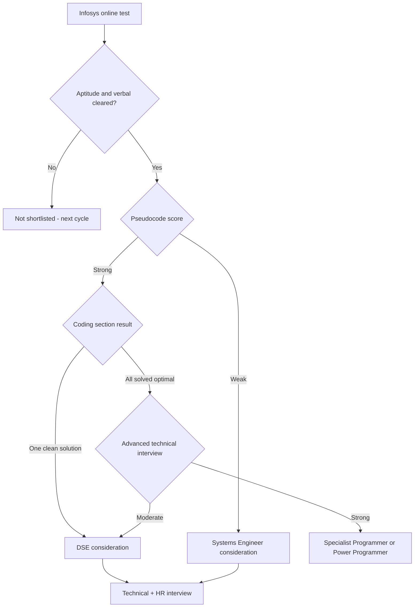

# Infosys Hiring Guide

## Overview

Infosys hires fresh graduates at scale through a track-based system that is unusually transparent about pricing: the same exam feeds four named tracks — Systems Engineer (SE), Digital Specialist Engineer (DSE), Specialist Programmer (SP), and Power Programmer — each with a distinct pay band and role profile. Your track is decided by how deep you go in the online test (especially the pseudocode and coding sections) and how you perform in the interview. This page maps the exam pattern, the track table, the certification/accelerator path, and a preparation plan keyed to repo pages. Every exam pattern and pay figure below is a **typical/recent pattern — verify on the official careers portal** before your drive.

## The Track System: SE vs DSE vs SP vs Power Programmer

Infosys is the clearest example among mass recruiters of "one exam, four price points." All tracks go through the same application and largely the same online test, but the depth you show in pseudocode and coding routes you into a different track, and the track is printed on the offer letter. The table below reflects approximate bands reported across recent cycles.

| Dimension | Systems Engineer (SE) | Digital Specialist Engineer (DSE) | Specialist Programmer (SP) | Power Programmer |
|---|---|---|---|---|
| Approximate pay band | ~3.6 LPA | ~6.25 LPA | ~9.5 LPA | ~13–15 LPA |
| Typical role | Build, maintenance, testing, support on client projects | Digital work: full-stack, cloud, data engineering, DevOps | Product engineering, data science, niche technology tracks | Hardcore engineering on platform-level problems |
| Exam coding bar | 1 basic coding problem; clean working solution | 2 problems; working code with reasonable complexity | 2–3 problems; optimal approaches expected | Top performance in contest or test; strongest coding bar |
| Exam difficulty | Aptitude + verbal + basic pseudocode focus | Intermediate pseudocode + coding | Advanced pseudocode + coding | Highest; often via HackWithInfy |
| Training | Mysore generic + stream | Mysore with digital-track stream | Mysore with niche stream | Mysore, fast-tracked technical stream |
| Interview depth | OOP/DBMS/OS basics + projects | Medium DSA + language internals | Advanced DSA with complexity analysis | Extended practical coding round |

Three clarifications make this table usable. First, the pay gap between adjacent tracks is roughly 2.7–3.5 LPA, which is why the coding section is worth disproportionate preparation time — a two-section jump roughly doubles your starting CTC. Second, the **role difference** is real at entry but permeable: SE joiners can move toward digital work after their first project, while DSE/SP joiners can still land routine projects; the track mostly sets starting salary and initial team quality. Third, the **training location** for all tracks is historically the Mysore Global Education Center (some batches run at other centres), and all tracks typically carry a **service agreement whose length varies by track and drive — verify your offer letter**, because early exit can trigger training-cost recovery.

## Exam Pattern

The recent pattern is a sectionally timed online test combining aptitude, verbal, pseudocode reading, and hands-on coding. The pseudocode section is the signature Infosys element — no other mass recruiter weights it as heavily — and it is the cheapest place to gain rank because it tests reading discipline rather than new knowledge. Counts and minutes below are typical/recent patterns; your hall-ticket instructions override everything here.

| Section | Typical questions | Typical minutes | Content focus |
|---|---|---|---|
| Mathematical Ability | ~10–15 | ~25–35 | Number systems, percentages, ratios, time-work, permutations, probability |
| Logical Reasoning | ~10–15 | ~20–25 | Series, syllogisms, arrangements, data sufficiency, puzzles |
| Verbal Ability (English) | ~20 | ~20 | RC, grammar, sentence correction, theme detection |
| Pseudocode | ~10 | ~15–20 | Loop/recursion trace, output prediction, operator precedence, data-structure behavior |
| Coding | 1 (SE path) up to 2–3 (DSE/SP paths) | ~45–60 total | Arrays, strings, hashing, basic DP; Power Programmer gets harder variants |

The strategic reading of this table: aptitude and verbal are elimination filters, pseudocode is the router, and coding is the multiplier. Clearing only aptitude with weak pseudocode typically caps you at SE consideration. Pseudocode plus one clean coded solution starts DSE conversations, and solving everything optimally is what pushes SP/Power Programmer.

### Verbal and Mathematical Tactics

The quantitative and reasoning blocks at Infosys reward standard shortcut discipline over advanced mathematics. Percentages-as-multipliers, the unitary method, and plugging answer options into the question cover most of the mathematical section, and drawing the diagram before touching options settles most reasoning questions. The difficulty sits slightly below the TCS Advanced level, but the time budget is also tighter, so speed technique matters equally.

The verbal section is a grammar test wearing an English costume. Around twenty questions in roughly twenty minutes means under a minute each, and the reliable point-scorers are subject-verb agreement, tense consistency, connector logic, and elimination of extreme-toned options in reading comprehension. Drill the rules from [Written communication](../../communication/written-communication.md) rather than reading passages for pleasure — the section rewards rule application, not vocabulary size.

## The Certification and Accelerator Path

Infosys runs official programs that convert exam performance into fast-track offers, and you should use the window between receiving your hall ticket and joining deliberately.

- **InfyTQ / Infosys Certification**: a free learning platform plus certification exam covering programming, DBMS, and hands-on coding. Clearing the certification — especially the hands-on component — has historically strengthened candidacies and in some cycles fast-tracked candidates into DSE/SP interview slots. Verify whether the program and its benefits are active for your cycle, since Infosys has restructured it more than once.
- **HackWithInfy**: Infosys' national coding contest. Top performers receive direct interviews for Power Programmer/SP-track roles and prize money; it is the cleanest route to the top track for students with competitive-programming ability.
- **Hall-ticket to fast-track window**: after the exam and before joining, completing certification tracks and keeping your coding sharp matters because Infosys sometimes re-runs or upgrades evaluations. Candidates who demonstrably performed better than their assigned track have in some cycles been re-evaluated into higher tracks before joining — possible, not promised, and driven entirely by visible performance.
- **Springboard and Lex as pre-joining signals**: selected candidates receive access to **Springboard**, Infosys' learning platform, before joining, and completing role-relevant modules there is a commonly reported positive signal during training and stream allotment. **Lex** is the internal learning management system you will use during Mysore training. Treat early Springboard engagement as free option value: it costs nothing, and it shapes how you are perceived when streams (Java, Python, cloud, data) are allocated at Mysore.
- **Referral culture**: Infosys employees can refer candidates into drives, and a referral has historically moved applications ahead in screening though never replaced the exam itself — the NQT-equivalent test is still the gate.

## Track Choice Playbook

Aim your preparation at the highest track that is honest for your current level, then prepare the lever that moves you up one notch. Candidates waste seasons either under-shooting (preparing for SE when they could clear DSE) or over-shooting (grinding hard problems while failing the pseudocode router). The table below is a self-assessment map.

| Your current level | Realistic track target | The lever that moves you up |
|---|---|---|
| New to DSA, strong academics | SE, pushing DSE | One clean coded solution plus a near-perfect pseudocode block |
| Comfortable with arrays, strings, hashing | DSE, with an SP shot | Solve both problems optimally and narrate complexity fluently in the interview |
| Competitive-programming background | SP or Power Programmer via HackWithInfy | Enter the contest route; optimal solutions delivered fast |

Three upgrade levers exist if your initial track comes in lower than your performance suggested. The interview itself is the first: a genuinely strong technical conversation has rescued borderline cases into DSE consideration in multiple cycles. Re-evaluation windows before joining are the second, driven by visible evidence such as completed certifications or contest results. The contest route in the next cycle is the third — and the only one fully under your control — because HackWithInfy performance bypasses the standard exam routing entirely.

## Pseudocode Section Strategy

The pseudocode section decides your track router more than any other MCQ block, and it rewards a specific, trainable skill: tracing, not solving. Most questions hand you a 10–25 line pseudo-language snippet and ask for the output, the number of iterations, or the final value of a variable. Errors concentrate in three places: operator precedence, loop-boundary off-by-ones, and reference-vs-value semantics in function calls.

Work each snippet with a trace table — columns for each variable, one row per iteration — instead of doing it in your head, and you will convert most "tricky" questions into clerical work. Learn the pseudo-language's conventions from Infosys practice sets, because they are consistent across questions: integer division behavior, how they print, how recursion stacks. Then drill the [pseudocode reading](../../interview/coding/pseudocode-reading.md) page in this repo, which formalizes the trace-table method with worked examples. Pair it with [MCQ strategies](../coding/mcq-strategies.md) for elimination tactics when a full trace is too slow, and remember the section is short (~15–20 minutes for ~10 questions) — that is roughly 90 seconds per question including reading time.



## A Worked Pseudocode Question

A representative Infosys-style question: *what does the following pseudocode display for n = 15?* It is a good specimen because it combines a loop, a branch, and mutation, which is the anatomy of most questions in this section.

```text
integer n = 15
integer steps = 0
while n > 0 do
    if n mod 2 == 0 then
        n = n / 2
    else
        n = n - 1
    end if
    steps = steps + 1
end while
display steps
```

Solve it with the trace-table method — one row per iteration, one column per mutated variable — instead of reasoning in your head:

| Step | n at entry | Parity | Action | steps after |
|---|---|---|---|---|
| 1 | 15 | odd | n becomes 14 | 1 |
| 2 | 14 | even | n becomes 7 | 2 |
| 3 | 7 | odd | n becomes 6 | 3 |
| 4 | 6 | even | n becomes 3 | 4 |
| 5 | 3 | odd | n becomes 2 | 5 |
| 6 | 2 | even | n becomes 1 | 6 |
| 7 | 1 | odd | n becomes 0, loop exits | 7 |

The output is **7**, and the question's traps are all in the trace discipline. Candidates who shortcut with "it halves, so about log-two of fifteen, so 4" miss the odd-step decrements that double the count; candidates who trace carelessly drop the final iteration where 1 becomes 0 and still counts as a step. Both errors are elimination filters — the section is designed so that casual readers land on plausible wrong options that are printed right there.

The same discipline generalizes to the variants Infosys recycles: counting only the halving steps, rewriting the loop as recursion and asking for the call sequence, or swapping `while` for a `do-while` and asking what changes for n = 0. Work through the [pseudocode reading](../../interview/coding/pseudocode-reading.md) page until the trace table is reflexive, then use [MCQ strategies](../coding/mcq-strategies.md) for the rare question too long to trace fully inside ninety seconds. The section is a solved game once tracing is automatic.

## Interview Anatomy per Track

Infosys interviews are typically one technical round plus HR, with depth scaling by track; SP and Power Programmer candidates usually get an additional or extended coding evaluation. Regardless of track, the interview opens with your projects, so prepare two projects to the level where you can defend every design choice.

- **SE track (~40–60 minutes, often combined tech + HR)**: OOP with your own examples, DBMS basics (keys, simple joins, normalization), OS one-liners (process vs thread), a pseudocode-style walkthrough, and closing HR on relocation, training, and the service agreement. The bar is fundamentals plus communication, not algorithmic depth.
- **DSE track**: adds 1–2 live coding problems (arrays/strings, hash-map work) and language internals — expect "what happens under the hood" follow-ups on your primary language, plus SQL queries in some panels. Complexity analysis questions are common, so be ready to state the \\(O(\\cdot)\\) of everything you write.
- **SP / Power Programmer track**: a serious coding evaluation — 2–3 problems where optimal solutions are the baseline, sometimes on an IDE rather than a shared doc — followed by a deep technical discussion on data structures, DBMS, and system reasoning. Panels here behave like product-company interviews; prepare with the same seriousness as [technical interviews](../../placement-preparation/technical-interview.md) elsewhere.

### The Project Deep-Dive

Prepare two projects to interrogation depth: one substantial (a full-stack application, a data pipeline, or anything with a database and users) and one supporting (a course or mini project that shows breadth). For each, know the schema, the hardest bug you fixed, one design choice you would defend, and what breaks at ten times the load. This is the raw material every track's interview draws from.

The tracks probe differently with the same material. SE panels verify authenticity — did you actually build it, can you explain any line you claim. DSE and SP panels push on alternatives — why this database, what would you change with more time, how does your choice behave at scale. Answering "I would do X differently now, because Y" is a tier-raising sentence in both cases.

Across all tracks, HR probes reliability: willingness to relocate to Mysore for training, comfort with client-facing work, and awareness of the service agreement. Answer these directly and honestly — Infosys HR screens for joiners who will complete training rather than for negotiators.

## A Worked DSE-Track Interview Problem

A representative DSE/SP-panel problem: *given an integer array, count the subarrays whose elements sum to a given k*. It is a good specimen because it has an obvious quadratic solution that interviewers expect you to mention and then outgrow, and because it collapses to a hash-map pattern that Infosys panels reuse across semesters. Saying "brute force is `O(n^2)` over all subarray ranges, let me do better" is itself a scored sentence in these interviews.

```python
def count_subarrays_with_sum(nums: list[int], k: int) -> int:
    from collections import defaultdict
    prefix_seen = defaultdict(int)   # prefix sum -> how often seen
    prefix_seen[0] = 1               # empty prefix
    prefix = 0
    answer = 0
    for x in nums:
        prefix += x
        answer += prefix_seen[prefix - k]
        prefix_seen[prefix] += 1
    return answer
```

The derivation is the interview. A running prefix sum turns each subarray sum into a difference of two prefixes, so "subarray summing to k ending here" becomes "how many earlier prefixes equal `prefix - k`" — a lookup the hash map answers in constant time. Total cost is `O(n)` time and `O(n)` space, and the `prefix_seen[0] = 1` seed line is the detail that separates people who understand prefix sums from people who copied a solution. Expect to state and justify both.

The follow-up chain is predictable enough to rehearse. If the array can contain negatives (it usually can in this problem), explain why a sliding window fails and why the prefix map is the right tool; if asked for the longest such subarray instead of the count, store first-seen indices rather than counts; if asked to stream the input, note that the method already works in one pass. All three variants live inside the [frequency counting](../coding/pattern-frequency-counting.md) and [coding patterns guide](../coding/coding-patterns-guide.md) material, which is why that block of preparation covers Infosys's higher tracks efficiently.

## Mysore Training Lifecycle

Training is where the Infosys offer actually becomes a career, and the Mysore Global Education Center (with some batches at other centres) runs it as a gated pipeline. The structure below reflects typical recent cohorts; durations and gate rules shift by intake, so verify against your joining communication.

| Phase | Typical duration | Content and gate |
|---|---|---|
| Onboarding formalities | ~1 week | Documentation, ID creation, system access |
| Generic foundation | ~2–3 months | Programming, DBMS, OS, soft skills; weekly gated assessments |
| Stream training | ~1–3 months | An allocated stream such as Java, Python/.NET, cloud, data, or testing; competency gates |
| Project practice | ~2–4 weeks | A capstone build inside your stream |
| Deployment | — | Unit assignment after clearance |

The gates are the part to take seriously: each phase ends in assessments you must clear to advance, and failing them extends training or, in worse cases, affects employment terms. Weekly test scores during the foundation phase have also fed stream allotment according to widespread candidate reports, which means the "training" period is really a second, quieter selection round. Arrive having kept your fundamentals warm rather than treating the offer as the finish line.

Stream allocation inputs are commonly reported to combine three signals: business demand for each stream that quarter, your foundation-phase scores, and pre-joining engagement such as completed Springboard modules. Lex runs the day-to-day coursework inside training — assignments, quizzes, and reference material all live there. Neither platform is a mystery to game; both reward exactly the consistent study habit this repo preaches.

## Preparation Plan Keyed to Repo Pages

Assume 4–6 weeks. The allocation front-loads pseudocode and coding because they route the track, while keeping aptitude and verbal at elimination-clearing levels.

| Priority | Time share | Repo pages | Why |
|---|---|---|---|
| 1. Pseudocode mastery | ~25% | [Pseudocode reading](../../interview/coding/pseudocode-reading.md), [MCQ strategies](../coding/mcq-strategies.md) | The signature Infosys router section; pure technique, fast gains |
| 2. Coding section | ~35% | [Coding patterns guide](../coding/coding-patterns-guide.md), [Frequency counting](../coding/pattern-frequency-counting.md), [Sliding window](../coding/pattern-sliding-window.md), [Binary search](../coding/pattern-binary-search.md) | 1–3 problems decide SE vs DSE vs SP; these patterns dominate |
| 3. Aptitude | ~20% | [Aptitude index](../../aptitude/README.md), [Number systems](../../aptitude/number-systems.md), [Time & work](../../aptitude/time-work.md), [Logical reasoning](../../aptitude/logical-reasoning.md) | Elimination filter; sectional timers punish slowness |
| 4. Verbal | ~5% | [Written communication](../../communication/written-communication.md), [Interview communication](../../communication/interview-communication.md) | ~20 questions in ~20 minutes; grammar rules carry most of it |
| 5. Interview craft | ~15% | [Technical interview](../../placement-preparation/technical-interview.md), [DBMS questions](../dbms-questions.md), [STAR method](../behavioral/star.md), [HR interview](../../placement-preparation/hr-interview.md) | DSE/SP panels are technical enough that fundamentals decide the jump |

## Season Timeline and the Hall-Ticket Window

Infosys recruits in waves: campus-semester drives, off-campus application windows, and contest cycles, all announced through the official careers portal. Applying early in the window historically correlates with earlier test slots and earlier joining batches, which matters more than it sounds because later batches compete with end-semester exams and, in crowded years, with delayed joining dates. Build your season calendar around application openings rather than around the test date alone.

| Window | Typical length | Highest-value use |
|---|---|---|
| Application → hall ticket | Weeks to ~2 months | Finish pattern drilling; complete InfyTQ-style certification tracks |
| Hall ticket → test day | Days to ~2 weeks | Sectional timed mocks only; consolidate, do not start new topics |
| Test → interview | Days to ~3 weeks | Rehearse projects, STAR stories, and complexity narration aloud |
| Offer → joining | Weeks to several months | Springboard modules, certifications, keep DSA warm for re-evaluation |
| Re-evaluation calls | Any time before joining | Respond fast; slots are scarce and evidence-based |

The hall-ticket window deserves a comment because it is commonly wasted. Ten days is enough to raise your score meaningfully through timed mocks and error-log review, and almost never enough to learn a new topic family from scratch — candidates who try the latter usually lose both the new topic and the timing edge on the old ones. The offer-to-joining window is the mirror image: it is long, unstructured, and exactly where re-evaluation leverage (certifications, contest entries, Springboard completion) gets earned, as covered in the track-choice playbook above.

## Common Failure Modes

Infosys's funnel rejects most candidates in predictable places, which makes the failure modes worth auditing before your drive.

- **Head-tracing pseudocode.** Doing loop traces mentally and losing track by iteration four; the trace-table habit exists precisely because mental traces fail under proctoring pressure.
- **Coding-section freeze.** Writing partial logic in fragments instead of a compiling brute force first; partial scoring rewards the working solution.
- **Verbal speed collapse.** Knowing grammar rules but meeting a twenty-questions-in-twenty-minutes clock unprepared.
- **Missing certification windows.** InfyTQ-style program deadlines pass silently; check the portal calendar at the start of the season, not the week before.
- **Treating the SE offer as final.** Not attending the interview with intent because the expected track is SE; interview strength is one of the documented upgrade levers.
- **Skipping agreement fine print.** Discovering a longer service agreement or training-cost clause after accepting rather than before.
- **Wasting the offer-to-joining gap.** Treating the months before Mysore as vacation when they are the cheapest window for certifications and Springboard completion that feed stream allotment.
- **Single-track fixation.** Preparing only for the DSE coding bar while ignoring the aptitude and verbal filters that eliminate candidates before routing even begins.

## Interview Questions

1. **What is the difference between Systems Engineer, DSE, and Specialist Programmer at Infosys?** All three are fresher tracks fed by the same exam, differing in pay and role: SE (~3.6 LPA) covers build/support/testing work, DSE (~6.25 LPA) covers digital full-stack/cloud/data roles, and SP (~9.5 LPA) covers product-engineering and niche tracks. The routing signal is your pseudocode score plus how many coding problems you solved optimally. Power Programmer sits above SP at roughly 13–15 LPA and is usually reached via HackWithInfy or top test performance. Track is set at offer time but remains permeable over a multi-year career.
2. **How do you approach the Infosys pseudocode section?** Treat it as tracing, not problem-solving: build a variable trace table and step through line by line rather than reasoning in your head. The common failure modes are operator precedence, loop boundaries, and mutation-vs-reference semantics in function calls. Practice with Infosys-style pseudo-language conventions until they are automatic, at roughly 90 seconds per question given the section's time budget. The repo's pseudocode-reading page formalizes this with worked examples.
3. **Do InfyTQ certification and HackWithInfy actually change outcomes?** Historically yes, with caveats. InfyTQ certification — particularly its hands-on component — has been used in several cycles to fast-track candidates into DSE/SP consideration, and HackWithInfy top performers receive direct Power Programmer/SP interviews. Both programs have been restructured over time, so verify current rules on the official portal. The low-regret move is to complete the certification anyway: it costs only time and produces a verifiable credential that also helps later in lateral switching.
4. **What happens during Mysore training, and what is the bond?** Freshers across tracks train at the Mysore Global Education Center (some batches at other centres), typically a generic foundation phase followed by a stream phase in a specific technology, over a few months total. Stream allocation is influenced by business demand and, according to widespread candidate reports, by pre-joining engagement on platforms like Springboard. Offers typically include a service agreement whose length varies by track and drive — commonly in the 1–3 year range — and leaving early can trigger training-cost recovery. Read the exact agreement in your offer letter before signing.
5. **I cleared the aptitude and verbal sections but froze on coding. What can I expect?** The realistic outcome is SE-track consideration, since coding depth is the router to DSE and above. Two recovery levers exist: the interview, where a genuinely strong project and fundamentals discussion occasionally upgrades borderline cases, and pre-joining performance, where re-evaluations happen in some cycles. More reliably, fix the gap before the next cycle — most Infosys coding problems are two-pattern problems (hashing plus array scanning) that a month of pattern drilling fixes.
6. **Is Infosys a good launchpad compared to TCS or Cognizant?** The processes are structurally similar — tiered offers from one exam — but Infosys's pseudocode router and named tracks (SE/DSE/SP) make the tiering more legible, and its Mysore training is widely regarded as one of the strongest fresher curricula in Indian IT. Pay bands are comparable to TCS Digital-class tiers. The differentiators that should drive your choice are project allocation, stream at training, and the service agreement length rather than brand ordering. Compare concrete offers using the framework in [Mass Recruiters Compared](./mass-recruiters.md).

## Key Takeaways

- One exam, four tracks: SE (~3.6 LPA), DSE (~6.25 LPA), SP (~9.5 LPA), Power Programmer (~13–15 LPA) — approximate recent bands, verify per drive.
- Pseudocode is the router: it is the section that separates SE consideration from DSE/SP conversation, and it is the cheapest skill to train.
- The coding section is the multiplier: one clean solution starts DSE talk; all-optimal pushes SP/Power Programmer.
- InfyTQ certification and HackWithInfy are official accelerators into higher tracks; both have changed structure over time, so verify current rules.
- Mysore training (generic + stream) is the real onboarding; pre-joining Springboard engagement is a commonly reported signal during stream allotment, and Lex is the in-training LMS.
- Service agreements vary by track and drive (commonly 1–3 years) — the offer letter is the only source of truth.
- Prep ratio for Infosys: ~35% coding, ~25% pseudocode, ~20% aptitude, rest verbal and interview craft.
- Training at Mysore is gated, not ceremonial — foundation-phase scores feed stream allotment, and the gates must be cleared to deploy.
- HackWithInfy is the only route fully under your control for the top tracks — the exam router and re-evaluations both depend on the company's cycle decisions.

## References

- [Infosys Careers](https://www.infosys.com/careers/) — official careers portal; track definitions, drive announcements, and program status. Exam patterns, pay bands, and program details cited here are typical/recent patterns and must be verified against official drive communications.

## Cross-References

- [Product vs Service vs Semiconductor vs Cloud Companies](./company-types.md) — the services-company evaluation model Infosys follows.
- [TCS Hiring Guide](./tcs.md) — the directly comparable tier system (Ninja/Digital/Prime) and NQT pattern.
- [Mass Recruiters Compared](./mass-recruiters.md) — how Infosys offers stack against Wipro, Accenture, Cognizant, and Capgemini.
- [Pseudocode reading](../../interview/coding/pseudocode-reading.md) — the trace-table method for Infosys's signature section.
- [Online Assessment strategy](../../placement-preparation/online-assessment.md) — proctored-test tactics and sectional timing.
- [Technical interview preparation](../../placement-preparation/technical-interview.md) — the DSE/SP interview depth target.
- [HR interview](../../placement-preparation/hr-interview.md) — relocation, agreement, and training questions.
- [Coding assessments](../../placement-preparation/coding-assessments.md) — platform mechanics common to Infosys drives.
- [Behavioral questions](../behavioral/common.md) — the reliability signals Infosys HR screens for.
- [Campus placement overview](../../placement-preparation/campus-placement.md) — where Infosys drives sit in the season calendar.
- [OA strategies](../coding/oa-strategies.md) — mock discipline for the hall-ticket window.
- [Cognitive tests](../../placement-preparation/cognitive-tests.md) — what proctored aptitude platforms measure.
