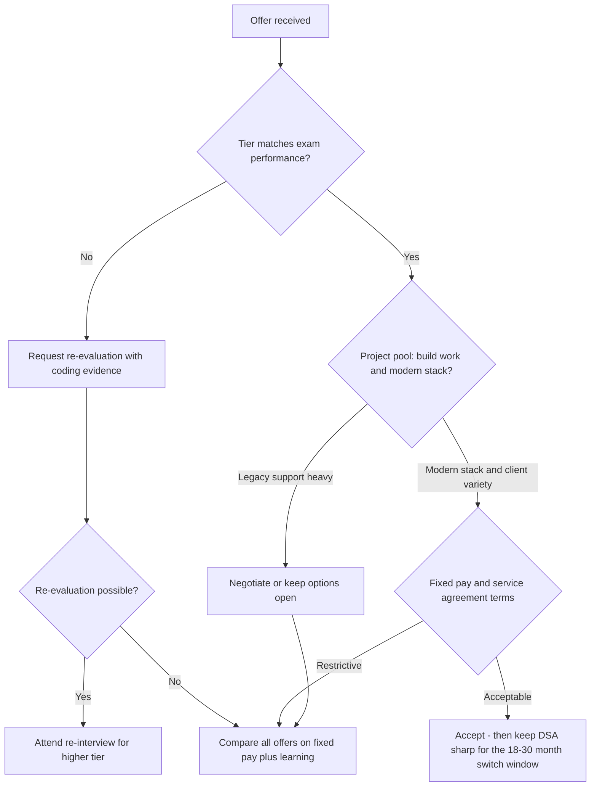

# Mass Recruiters Compared: Wipro, Accenture, Cognizant, Capgemini, LTIMindtree, HCL

## Overview

Beyond TCS and Infosys, a second cluster of Indian mass recruiters — Wipro, Accenture, Cognizant, Capgemini, LTIMindtree, and HCLTech — runs structurally similar funnels: an aptitude-plus-coding online test, a combined technical/HR interview, and tiered fresher offers with names that change every few years. Because their exams overlap so heavily, one well-designed preparation plan can convert into multiple offers in the same season, and then the real skill becomes choosing between offers. This page compares the six, isolates what is invariant across all of them, and gives an offer-evaluation framework. All tier names, pay bands, and exam styles here are **typical/recent patterns — verify on each official careers portal**, because these companies rename programs and revise bands almost annually.

## The Comparison Table

The table compresses each company's fresher funnel into the five dimensions that actually affect your decision. Pay bands are approximate figures reported across recent cycles; treat them as ranking anchors, not quoted CTC.

| Company | Tier names (typical) | Exam style | Coding difficulty | Approximate pay band | Training / policy notes |
|---|---|---|---|---|---|
| Wipro | Elite, Turbo, Star (Elite NTH / NLTH legacy) | Aptitude + written communication essay + coding | 1–2 easy–medium array/string problems | Elite ~3.5 LPA, Turbo ~6.5 LPA, Star ~9 LPA | Project Engineer role; structured onboarding; service agreement varies by tier |
| Accenture | Associate Software Engineer (ASE) | Cognitive + technical assessment (pseudocode, cloud/networking/security basics) + 1 coding question + communication assessment | 1 easy problem | ~4.5 LPA | Technology delivery roles; strong brand for later lateral moves |
| Cognizant | GenC, GenC Elevate, GenC Next | Aptitude + coding (Next/Elevate add heavier coding and competency checks) | GenC easy; Next 2–3 medium problems | GenC ~4 LPA, Elevate ~5.5 LPA, Next ~6.75–7.5 LPA | Programmer Analyst Trainee roles; training internal |
| Capgemini | Analyst / Software Engineer | Game-based cognitive assessment (AO) + English test + famously pseudocode-heavy MCQs + 1 coding question | 1 easy problem | ~4–4.75 LPA | Internal training academy; Exceller program for laterals |
| LTIMindtree | Graduate Engineer | SHL-style aptitude + verbal + coding + spoken-English check | 2 easy–medium problems | ~4–4.5 LPA | Occasional group discussion round; fast project deployment |
| HCLTech | Software Engineer (TechBee for pre-college) | AMCAT-style aptitude + verbal + coding | 2 easy problems | ~3.75–4.5 LPA | TechBee: Class-XII entry with stipend, sponsored degree, then HCL role |

Reading the table well requires noticing the pattern rather than memorizing cells. Every company tests a speed-based aptitude block, every company has added a pseudocode or logic-MCQ block, and coding sections cluster at "easy–medium arrays and strings" — dramatically below product-company bars. The pay spread between the lowest and highest tiers across all six companies is roughly 2x, which is exactly the spread your coding output can control.

## Test Anatomy at a Glance

The comparison table gives outcomes; this one gives the exam-day mechanics, which is what you actually prepare against. Platform names and round counts below reflect typical recent drives — individual drives substitute platforms and add or drop rounds, so confirm your specific drive's structure in its official communication.

| Company | Test platform style | Distinct eliminator | Interview shape |
|---|---|---|---|
| Wipro | In-house pattern (varies by drive) | Machine-scored written essay | Combined technical + HR |
| Accenture | In-house cognitive + technical blocks | Spoken communication assessment | Combined technical + HR |
| Cognizant | In-house via campus platforms (Superset-style) | Competency assessment for Elevate tier | Technical + HR |
| Capgemini | Game-based AO plus in-house MCQs | Hardest pseudocode block of the cluster | Technical + HR |
| LTIMindtree | SHL-hosted assessments | Spoken English; occasional group discussion | Technical + HR |
| HCLTech | AMCAT-style | Coding weight varies by role | Technical + HR |

Three observations follow from the mechanics column. Every company runs some form of English communication filter, and it eliminates otherwise-qualified candidates precisely because nobody trains for it. The platforms differ less than the marketing suggests — all of them time-gate MCQ sections and auto-grade code against hidden tests. And the interview shape is nearly invariant: one technical conversation plus HR, which is why one interview-prep effort serves all six.

### Reading a Drive Announcement

Drive announcements are dense documents that candidates skim and then regret skimming. Read them with a checklist instead, because each item below has silently disqualified someone.

- **Eligibility PDF**: marks thresholds, allowed degree types, gap rules, and maximum prior attempts — this overrides everything you have read anywhere.
- **Round list**: whether the communication assessment, group discussion, or essay is present in this specific drive, since these rotate.
- **Platform and environment**: SHL, AMCAT, or in-house — plus whether a camera/proctoring dry run is required before test day.
- **Registration deadline and slot selection**: deadlines are hard, and slot choice determines your test-hour circadian luck.
- **Offer and joining terms**: whether the announcement names the tier, CTC split, agreement length, or joining-city constraints up front.
- **Result communication channel**: which portal or email actually posts results, because fake-result WhatsApp forwards circulate every season.

## Company Notes Worth Knowing

The notes below carry the context that does not fit in table cells: legacy program names you will still hear, the round that actually eliminates people, and the one verification step per company. Read the two entries for the companies you are targeting first, then the rest — the overlaps are instructive. All tier names are typical/recent and rebrand frequently.

### Wipro

Wipro's fresher offer is the Project Engineer role, historically tiered as Elite (~3.5 LPA), Turbo (~6.5 LPA), and Star (~9 LPA), with the National Level Talent Hunt (NLTH) as the legacy name for its off-campus Elite drive. The exam mixes aptitude, a written-communication essay that is machine-scored, and 1–2 basic coding problems. The essay round is a real eliminator — candidates routinely underestimate a timed essay — so practice two or three under a 20-minute clock. Verify current tier names before your drive, because Wipro has rebranded this program more than once.

### Accenture

Accenture hires freshers as Associate Software Engineers (~4.5 LPA approximate band) and runs one of the more distinctive tests: a Cognitive and Technical Assessment where the technical half covers pseudocode plus fundamentals of networking, security, cloud, and common applications, followed by a short coding section and a communication assessment. The breadth of the technical MCQ block rewards general CS literacy over depth. The communication assessment — reading sentences aloud and answering spoken prompts — is eliminatory, so rehearse speaking English on simple topics. The interview is a combined technical + HR conversation focused on projects and fundamentals.

### Cognizant

Cognizant's GenC family is the cleanest three-tier ladder among this group: GenC (~4 LPA) for standard delivery roles, GenC Elevate (~5.5 LPA) for candidates who clear an added competency assessment, and GenC Next (~6.75–7.5 LPA) for those who solve 2–3 medium coding problems, often with a follow-up technical deep dive. The Next tier's coding bar is the highest among this six-company set short of Infosys SP — think two comfortable LeetCode-easy-to-medium solves with clean code. Role titles are Programmer Analyst Trainee variants, and the tier determines both salary and initial project quality.

### Capgemini

Capgemini's test is the most idiosyncratic: a **game-based cognitive assessment** (puzzles testing memory, pattern recognition, and reactions), an English communication test, and pseudocode MCQs that are famously the hardest pseudocode block among mass recruiters, plus one easy coding question in most drives. Pay bands for Analyst/Software Engineer roles cluster around ~4–4.75 LPA. The game-based section is not classically preparable, but you can acclimatize to timed puzzle apps; the pseudocode block, in contrast, is fully preparable with the trace-table method. Capgemini's Exceller program handles lateral hiring separately from the fresher funnel.

### LTIMindtree

LTIMindtree runs an SHL-platform test — aptitude, verbal, and two coding problems, with a spoken-English evaluation and occasionally a group discussion before the technical + HR interview. Pay bands for graduate engineers sit around ~4–4.5 LPA. The company is known for comparatively fast project deployment after training, which matters if your goal is accumulating real client experience early. Its process overlaps so strongly with the TCS/Infosys pattern that no separate preparation is needed beyond spoken-English practice.

### HCLTech

HCLTech's standard graduate hiring uses an AMCAT-style test (aptitude, verbal, coding) with a combined interview, at bands around ~3.75–4.5 LPA. The special item is **TechBee**, an early-careers program for students who have completed Class XII: a paid training year followed by a sponsored university degree and a role inside HCL. TechBee is a legitimate path for pre-college readers of this repo, but it trades the college experience for an early start, and it is not a substitute for the standard fresher funnel for current college students. Note that HCL has historically had comparatively relaxed joining timelines in some cycles — verify any joining-delay policy against your offer.

## Resume and Eligibility Positioning

Mass recruiters screen on eligibility lines before anyone reads your projects, so the resume's first job here is passing filters. Typical screens require aggregate marks around 60% or a 6.0 CGPA and above, no active backlogs, and declared education gaps with justification — policies on gaps and maximum attempts vary by company and cycle, so verify rather than assume. These checks happen against certificates at joining, and mismatches have revoked offers, so enter percentages exactly as they appear on your mark sheets.

For the interview copy of the resume, two adjustments pay off. Keep it to one page with projects that map to what these companies deploy — web applications, databases, simple APIs, testing — rather than research-only work with no runnable artifact. And make every claimed skill answerable in one sentence, because the technical segment walks your skills list line by line; the resume-tailoring method in [Resume tailoring](../../resume/resume-tailoring.md) and the pitfalls in [Common mistakes](../../resume/common-mistakes.md) cover this in depth.

## What Stays the Same Across All of Them

Strip away the brand names and the six funnels test the same four skills. This is the single most useful fact in mass-recruiter preparation: you are not preparing for six companies, you are preparing for one exam that gets reskinned six times. The invariants and their repo treatments are below.

| Invariant skill | Where it appears | Repo pages |
|---|---|---|
| Pseudocode / output-prediction MCQs | Accenture technical, Capgemini (hardest), Infosys, TCS | [Pseudocode reading](../../interview/coding/pseudocode-reading.md), [MCQ strategies](../coding/mcq-strategies.md) |
| Basic DSA: arrays, strings, hashing | Every coding section (1–3 problems) | [Coding patterns guide](../coding/coding-patterns-guide.md), [Two pointers](../coding/pattern-two-pointers.md), [Frequency counting](../coding/pattern-frequency-counting.md) |
| Quantitative + logical speed | Every aptitude block, strictly sectioned | [Aptitude index](../../aptitude/README.md), [Logical reasoning](../../aptitude/logical-reasoning.md), [Percentages](../../aptitude/percentages.md) |
| Written/spoken English | Wipro essay, Accenture communication assessment, LTIMindtree spoken check, Capgemini English test | [Written communication](../../communication/written-communication.md), [Communication round](../../placement-preparation/communication-round.md) |
| STAR + HR reliability screening | Every combined interview | [STAR method](../behavioral/star.md), [HR interview](../../placement-preparation/hr-interview.md) |
| Basic SQL | Technical segments and some coding tests | [SQL rounds](../../placement-preparation/sql-rounds.md) |

Coding difficulty across all of these sits at the level where a correct \\(O(n)\\) hash-map pass over an array or a clean two-pointer sweep clears the bar; you do not need hard DP or graph theory for this cluster. That means the marginal value of grinding hard problems is low here, and the marginal value of accuracy under timers is high.

## How These Tiers Map Across Companies

Because every company tiers its freshers, offers become comparable once you translate tier names into CTC classes. The mapping below is a rough equivalence for negotiation conversations — it is not a guarantee that similarly-banded roles are similarly good, and individual drives shift bands. Use it to sanity-check whether an offer is at, above, or below the level your performance should command.

| Band class | Approximate CTC | Typical members |
|---|---|---|
| Entry band | ~3.4–4.5 LPA | TCS Ninja, Infosys SE, Wipro Elite, Cognizant GenC, HCLTech SE, LTIMindtree GE |
| Mid band | ~4.5–7 LPA | Accenture ASE, Capgemini Analyst, Cognizant GenC Elevate, Infosys DSE (lower edge) |
| Top band | ~7–15 LPA | TCS Digital/Prime, Infosys DSE/SP/Power Programmer, Wipro Turbo/Star, Cognizant GenC Next |

Two cautions keep this table honest. First, adjacent-band comparisons are where offers are actually won or lost — a GenC Next offer at 6.75 beats an ASE offer at 4.5 decisively, while a GenC Next versus Infosys DSE comparison should be settled on project pool and joining date rather than the 50k difference. Second, bands drift with market cycles; in hiring slowdowns the same tier names have shipped with delayed joining and unchanged CTC, which is itself a real pay cut in present-value terms.

## Interview Anatomy: One Template, Six Logos

The combined interview across this cluster follows one template so consistently that preparing it once prepares you six times. A typical session runs 40–60 minutes in roughly five blocks, and knowing the blocks lets you budget your energy instead of being surprised segment by segment.

| Block | Typical minutes | Content |
|---|---|---|
| Intro + project walkthrough | ~10 | One project, told as problem → design → your specific contribution |
| Fundamentals | ~15 | OOP with examples, DBMS basics, OS one-liners, language choice questions |
| Live problem | ~10 | Pseudocode trace or a short function on a shared editor |
| Scenario stretch | ~10 | Deadline, conflict, or support-role willingness questions |
| HR close | ~5 | Relocation, agreement awareness, your questions |

Prepare for this template and you have prepared for all six companies plus TCS and Infosys. The two blocks that separate offers from rejections are the project walkthrough (authenticity is detectable within minutes) and the scenario stretch (rehearsed STAR stories outperform improvised ones under pressure). The fundamentals block rarely goes deeper than second-year coursework, which is precisely why the [technical interview](../../placement-preparation/technical-interview.md) fundamentals material serves this cluster so efficiently.

## A Worked Cluster Coding Problem

A representative coding-section problem that has appeared in some form at Wipro, LTIMindtree, Cognizant, and Accenture drives: *given a string of lowercase letters, return the index of the first character that does not repeat, or -1 if none exists*. It is a good specimen because the cluster's coding sections test exactly this skill band — read the input, count something, scan once more — and because the naive instinct (compare every character with every other, `O(n^2)`) is one hash map away from linear.

```python
from collections import Counter

def first_unique_char(s: str) -> int:
    counts = Counter(s)              # one pass: frequency of each char
    for i, ch in enumerate(s):       # second pass: preserve order
        if counts[ch] == 1:
            return i
    return -1
```

The solution's shape is the lesson, not the problem. Pass one builds a frequency table; pass two replays the original order and asks the table a question — this two-pass rhythm solves a large fraction of every coding section in this page, including the TCS and Infosys basic sections. Cost is `O(n)` time and `O(k)` space for alphabet size `k`, and interviewers like hearing you say that unprompted.

The variants the cluster recycles are all the same skeleton with a different question asked of the table: the first non-repeating *word* in a sentence, the character with the second-highest frequency, whether two strings are anagrams, or the smallest window containing all characters of a pattern (which adds the sliding-window contract from [Two pointers](../coding/pattern-two-pointers.md)). Drill the skeleton until the variants feel like renaming. That is why the preparation table below gives coding patterns a fixed weekly block regardless of which company's drive is nearest.

## How to Choose Between Offers: The Service-Company Arbitrage

When two or more offers arrive, most candidates compare only CTC and regret it. The correct frame is arbitrage: a mass recruiter is selling you paid training, a brand signal, and exit optionality, in exchange for below-market salary and a service commitment. Evaluate the four legs of that trade explicitly.

1. **Tier over brand.** Within this cluster, tier quality (GenC Next vs GenC, Turbo vs Elite) predicts your first project and your growth curve better than company brand does. A higher tier at a "lesser" brand usually beats a base tier at a famous one.
2. **Learning vs pay.** The first 18–24 months are effectively a training program that pays you. Inspect what you can learn: ask about the technology stack, whether work is build vs maintenance, and client exposure. A ~4 LPA offer on a modernization project can out-learn a ~4.5 LPA offer on legacy support.
3. **Fixed vs variable.** Compare fixed pay, not headline CTC: bonuses and retention payouts often vest only if you stay, which interacts badly with point 4.
4. **The switching window.** Switching inside ~12 months burns the training investment and reads as flight risk on your resume; staying past ~3 years starts pricing you as a narrow lateral. The market-tested sweet spot for the first switch is roughly 18–30 months, which is also why the service agreement length in your offer letter deserves real attention.

### Managing Deadlines and Multiple Offers

Offer deadlines look absolute and rarely are. An accept-by date can usually be extended with a short, professional email citing pending results elsewhere — service-company HR extends these routinely because they would rather wait than lose a cleared candidate, and one polite request has never revoked an offer in any widely reported case. Ask once, early, and in writing.

Holding multiple offers simultaneously is common practice, but understand the actual risks rather than the folklore. The concrete exposures are offer revocation if one employer discovers the other through references, and ecosystem reputation in a market where managers move between these companies. The workable policy: keep every offer alive until your earliest joining date forces a decision, never fabricate competing offers, and decide on fixed pay plus tier quality rather than brand order.

Tier re-evaluation is the quieter lever. If your offer's tier looks below your exam or interview performance, a short email attaching evidence — code submissions, scorecard, interview feedback — costs nothing and occasionally moves the band, most often at Cognizant and Wipro where tier boundaries are sharpest. Success rates are low but nonzero, and the request itself is routine, not offensive.



## One Preparation Plan for All of Them

The table below is the whole playbook. Run it once, in order, over 5–7 weeks, and you are simultaneously ready for the exam style of every company in this page plus TCS and Infosys — the residual per-company work is only logistics like checking which platform (SHL, AMCAT, in-house) your drive uses.

| Phase | Weeks | Repo pages | Covers |
|---|---|---|---|
| 1. Quant + logic speed | 1–2 | [Aptitude index](../../aptitude/README.md), [Time & work](../../aptitude/time-work.md), [Speed & distance](../../aptitude/speed-distance.md), [Data interpretation](../../aptitude/data-interpretation.md) | All aptitude blocks, all companies |
| 2. Pseudocode + MCQ craft | 2–3 | [Pseudocode reading](../../interview/coding/pseudocode-reading.md), [MCQ strategies](../coding/mcq-strategies.md) | Capgemini/Accenture/Infosys pseudocode blocks |
| 3. Coding patterns | 3–5 | [Coding patterns guide](../coding/coding-patterns-guide.md), [Frequency counting](../coding/pattern-frequency-counting.md), [Two pointers](../coding/pattern-two-pointers.md), [OA strategies](../coding/oa-strategies.md) | Every coding section in this cluster and the TCS/Infosys advanced sections |
| 4. CS fundamentals | 5–6 | [Technical interview](../../placement-preparation/technical-interview.md), [DBMS questions](../dbms-questions.md), [OS questions](../os-questions.md), [SQL rounds](../../placement-preparation/sql-rounds.md) | Interview technical segments, Accenture technical MCQs |
| 5. Communication + HR | 6–7 | [Group discussion](../../placement-preparation/group-discussion.md), [Communication round](../../placement-preparation/communication-round.md), [Written communication](../../communication/written-communication.md), [STAR method](../behavioral/star.md), [HR interview](../../placement-preparation/hr-interview.md) | Wipro essay, Accenture communication, LTIMindtree GD/spoken, every HR round |
| 6. Logistics | ongoing | [Online assessment](../../placement-preparation/online-assessment.md), [Campus placement](../../placement-preparation/campus-placement.md) | Proctored-test mechanics and season planning |

## Joining Delays and Contingency Plans

Mass-recruiter joining dates drift more than any other part of the process: onboarding batches are sized to client demand, and in slow cycles offers have sat for months, occasionally with revised dates more than once. Read the joining-clause language in your offer, keep the offer letter and all follow-up emails archived, and never resign from another position or decline a better-dated offer based on an assumed start date. The drift is not a signal of revocation — offers do get honored — but it is a signal to keep options open until you physically onboard.

Use the gap deliberately rather than anxiously. The highest-value activities are the ones that compound at the next switch: finishing a certification (Infosys Springboard-style platforms, cloud fundamentals), building or finishing one demonstrable project, and keeping the DSA pattern habit alive at one problem every few days. The 18–30 month switching clock starts at joining, but skill decay starts immediately, and the candidates who switch well at month 20 are the ones who never stopped practicing between the offer letter and day one.

### Common Failure Modes

The cluster's funnel has signature failure points that recur season after season, and all of them are avoidable with the plan in this page.

- **Preparing hard algorithms while failing speed MCQs.** The aptitude blocks eliminate more candidates than the coding sections do in every company listed here.
- **Ignoring the essay and spoken filters.** Wipro's essay, Accenture's communication assessment, and LTIMindtree's spoken check are separate eliminators that coding practice does not cover.
- **Treating pseudocode MCQs as trivial.** Capgemini's block in particular is engineered with plausible wrong options that punish casual reading.
- **Single-company fixation.** Applying to one company and emotionally committing before results; the entire strategy of this page depends on converting one preparation into multiple offers.
- **Signing unread.** Accepting without reading the service agreement, fixed-vs-variable split, and joining-batch terms — every one of which has surprised candidates at onboarding.
- **Letting the DSA habit die after joining.** The first external switch is won by preparation that happens while employed, not by the switch attempt itself.
- **Chasing brand over tier.** Taking a base tier at a famous logo over a top tier at a plainer one, then discovering at project allocation that the tier was the real variable.

## Interview Questions

1. **How do you compare a 4.5 LPA Accenture ASE offer against a 6.75 LPA GenC Next offer?** Start with fixed vs variable pay, since headline CTC often includes bonuses that vest only over years. Then compare tier quality: GenC Next is Cognizant's top fresher tier and correlates with better initial projects and faster growth. Factor the switching window — both are service companies where the real return is training plus exit optionality around month 18–30. On raw numbers and tier, GenC Next wins; confirm fixed components and agreement terms before deciding.
2. **What single preparation maximizes offers across Wipro, Accenture, Cognizant, Capgemini, and LTIMindtree simultaneously?** The exams are near-clones: timed quant/logic MCQs, a pseudocode or logic block, and 1–3 easy–medium coding problems on arrays, strings, and hashing. Train quant speed first (it is the broadest eliminator), pseudocode tracing second (Capgemini and Accenture weight it heavily), and the four basic coding patterns third. Then rehearse communication, because Wipro's essay, Accenture's communication assessment, and LTIMindtree's spoken check are separate eliminators most candidates ignore. This one plan covers the entire cluster plus TCS and Infosys.
3. **Are the game-based assessments like Capgemini's AO actually preparable?** Only partially, and that changes your strategy. They measure processing speed, memory, and pattern recognition under pressure, and heavy drilling produces diminishing returns. What does help is acclimatization — practicing timed puzzle and reaction apps for a few days — plus reading instructions carefully, since many candidates lose points by misunderstanding rules rather than lacking ability. Do not sacrifice pseudocode and coding prep time for games; the eliminators with real preparation ROI come after the games.
4. **Why do service-company interviews feel so different from product interviews?** They optimize for deployability rather than algorithmic brilliance: the panel checks whether you can be billed to a client quickly and will not quit during training. Concretely that means OOP/DBMS/OS fundamentals, a defendable project walkthrough, communication polish, and relocation/commitment questions, with coding kept at easy–medium. Product interviews invert this, weighting hard DSA and design. This is why the same candidate can fail a FAANG loop and clear five mass-recruiter interviews in a week.
5. **When is the right time to switch from your first mass-recruiter job, and to where?** The evidence-backed window is roughly 18–30 months: before that you carry flight-risk signals and have not banked the training; after ~3 years your lateral profile narrows to your stack. Target product companies, GCCs, or a tier jump into a digital-services unit, using the DSA depth you maintained on the side. The precondition is built during employment, not at switching time — keep solving one pattern problem every few days even during bench or support phases.
6. **What is HCLTech TechBee and who should take it seriously?** TechBee is HCL's early-careers program for students immediately after Class XII: a training year with a stipend, followed by a sponsored university degree alongside work at HCL. It suits students who are certain about an IT career and value earning plus a degree over the conventional college route. It is not a shortcut to product-company roles — those still require the DSA preparation this repo teaches — and program terms change between cohorts, so verify everything on the official careers portal before committing.

## Key Takeaways

- The six funnels are one exam reskinned: timed quant, a pseudocode/logic MCQ block, 1–3 easy–medium coding problems, and an English/communication filter.
- Tier beats brand when comparing offers: GenC Next, Turbo, and Digital-class tiers predict project quality better than company names do.
- Coding bars here sit far below product companies — a clean \\(O(n)\\) hashing or two-pointer solution clears almost every coding section in this cluster.
- Communication is an eliminator, not a formality: essays, spoken-English checks, and group discussions remove candidates who cleared coding.
- Evaluate offers as arbitrage: fixed pay, training quality, project pool, and service agreement — then plan the first external switch for the 18–30 month window.
- TechBee is a pre-college entry path, not part of the standard fresher funnel, and its terms must be verified per cohort.
- One 5–7 week plan (aptitude speed → pseudocode → basic patterns → fundamentals → communication) makes you competitive at every company in this page simultaneously.
- Eligibility screens (marks, backlogs, gaps) are checked against certificates at joining — enter profile data exactly as printed on your mark sheets.
- Offer deadlines are extendable, joining dates are not fixed, and tier re-evaluation requests cost nothing — manage the offer phase as actively as the exam.
- Read every drive announcement with the checklist — eligibility, rounds, platform, slots, offer terms — because each item has silently disqualified candidates.

## References

- [Wipro Careers](https://www.wipro.com/careers/) — official portal; current Elite/Turbo/Star definitions and drive schedules.
- [Accenture Careers (India)](https://www.accenture.com/in-en/careers) — official portal; ASE role and assessment structure.
- [Cognizant Careers](https://careers.cognizant.com/) — official portal; GenC / GenC Elevate / GenC Next definitions.
- [Capgemini Careers](https://www.capgemini.com/careers/) — official portal; assessment process and Exceller program.
- [LTIMindtree](https://www.ltimindtree.com/) — official site; navigate to the Careers section for current fresher drives.
- [HCLTech Careers](https://www.hcltech.com/careers) — official portal; graduate hiring and the TechBee early-careers program.
- All tier names, pay bands, and exam structures above are typical/recent patterns reported across cycles — verify against official drive communications before relying on them.

## Cross-References

- [TCS Hiring Guide](./tcs.md) — the NQT structure and Ninja/Digital/Prime tiers that anchor this cluster.
- [Infosys Hiring Guide](./infosys.md) — the SE/DSE/SP track ladder and its certification fast-tracks.
- [Product vs Service vs Semiconductor vs Cloud Companies](./company-types.md) — the underlying evaluation model all six share.
- [Group discussion](../../placement-preparation/group-discussion.md) — LTIMindtree and Wipro-adjacent GD preparation.
- [HR interview](../../placement-preparation/hr-interview.md) — the reliability screening every combined interview ends with.
- [FAANG preparation](./faang-preparation.md) — the contrasting path if you are deciding between service and product funnels.
- [Campus placement overview](../../placement-preparation/campus-placement.md) — how these companies' drives sequence across the final-year calendar.
- [Cognitive tests](../../placement-preparation/cognitive-tests.md) — the game-based and aptitude platform mechanics several of them use.
- [Interview communication](../../communication/interview-communication.md) — phrasing and structure for the combined-round template.
- [ATS optimization](../../resume/ats-optimization.md) — getting the one-page resume past the first automated screens.
- [Recruiter communication](./recruiter-communication.md) — handling HR conversations during the offer phase.
- [Coding assessments](../../placement-preparation/coding-assessments.md) — how auto-graded coding rounds behave on these platforms.
