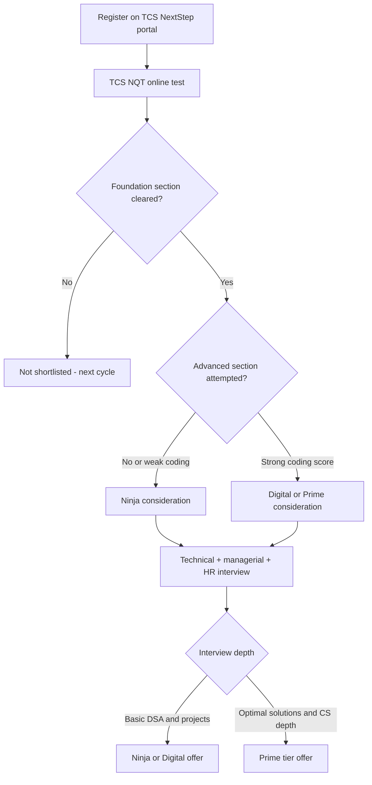

# TCS Hiring Guide

## Overview

Tata Consultancy Services is India's largest IT services employer and hires fresh graduates at scale through the **TCS National Qualifier Test (NQT)**. Unlike product companies that interview a few thousand candidates deeply, TCS runs a funnel that filters hundreds of thousands of applicants into three talent tiers with different roles, pay, and interview depth. This page explains the NQT structure, the Ninja/Digital/Prime tier system, interview anatomy per tier, and a preparation plan keyed to pages in this repo. All exam patterns and pay figures below are **typical/recent patterns — verify on the official careers portal** before your drive, because service companies revise both almost every cycle.

## How TCS Hires: The NQT Pipeline

TCS recruits freshers primarily through NQT, a standardized online test held in campus and off-campus cycles through the year. Registration happens on the TCS NextStep portal for freshers, while off-campus drive announcements appear on the official careers site. The NQT score plus interview performance jointly decide which tier — Ninja, Digital, or Prime — you are offered.

1. **Registration** — Create a profile on the TCS NextStep portal, pick your drive (campus or off-campus NQT), and receive a hall ticket with the test slot.
2. **NQT online test** — A proctored, sectionally timed exam covering aptitude, verbal, reasoning, and (for higher tiers) advanced coding.
3. **Interview** — Historically a single combined round of roughly 45–90 minutes covering technical, managerial, and HR questions; some cycles split this into separate rounds.
4. **Tier assignment and offer** — Your test score, coding output, and interview depth map you to Ninja, Digital, or Prime with the corresponding compensation band.



## Eligibility and Attempt Logistics

Eligibility screens for NQT are mechanical but unforgiving when ignored. Typical recent cycles require a full-time degree (BE/BTech/ME/MTech/MCA/MSc, with BSc/BCA for some tracks), aggregate marks around 60% or a 6.0 CGPA and above across academics, at most one or two active backlogs at the time of the test, and a bounded education gap (commonly up to two years, with documentation). Age limits around the late twenties have appeared in past cycles, and prior TCS interviews can bar re-application for a cooling period, so a failed attempt is not free. Treat every one of these numbers as typical/verify — the drive-specific eligibility PDF overrides this page.

Two logistical notes save candidates every season. First, registration windows close well before the test, and the NextStep profile (including percentage details, entered to two decimals) is validated against your mark sheets at joining — mismatches have revoked offers at onboarding. Second, choose your test city and slot early where the drive allows it; late registrations inherit whatever proctoring slots remain, which is how people end up with 6 AM logins and a cold start on the Foundation section.

## TCS NQT Exam Pattern

The recent pattern divides the test into a **Foundation** section everyone attempts and an **Advanced** section that decides Digital/Prime eligibility. Sectional timing is strict — you cannot roll unused minutes across sections, so pacing matters as much as accuracy. The table below reflects typical/recent patterns reported across drives; treat every number as approximate and verify in your hall-ticket instructions.

| Section | Typical questions | Typical minutes | Content focus |
|---|---|---|---|
| Foundation — Numerical Ability | ~20 | ~25 | Percentages, ratios, profit-loss, time-work, speed-distance, number systems |
| Foundation — Verbal Ability | ~25 | ~25 | Reading comprehension, grammar, sentence completion, cloze tests |
| Foundation — Reasoning Ability | ~20 | ~25 | Blood relations, syllogisms, series, seating arrangements, data interpretation |
| Advanced — Quantitative & Reasoning | ~15 | ~25 | Higher-difficulty variants of the foundation topics, puzzles |
| Advanced — Coding | 2 problems | ~55–65 | Array/string processing, hashing, sorting, simple DP |

Three practical observations follow from this structure. First, the Foundation section is a speed test — most candidates who fail it ran out of time, not knowledge. Second, the Advanced coding section is the single highest-leverage component: scoring well here is what separates a Ninja-track profile from Digital/Prime consideration. Third, because there is typically no negative marking in recent drives, you should never leave an MCQ blank (confirm this for your specific drive).

- Speed practice: [Aptitude](../../aptitude/README.md) pages cover the exact numerical and reasoning topics TCS recycles.
- Test-day tactics: [Online Assessment strategy](../../placement-preparation/online-assessment.md) and [MCQ strategies](../coding/mcq-strategies.md).

### Foundation Section: Speed Is the Filter

The Foundation block eliminates more candidates on pace than on knowledge. Each sub-section runs on its own timer at roughly a minute per question, and questions still unanswered at the buzzer are lost regardless of difficulty. The topic mix has been stable across recent cycles, which makes targeted drilling unusually effective — the table below maps the recurring families to their fastest solution methods.

| Topic family | Typical share | Fastest method | Repo page |
|---|---|---|---|
| Percentages, profit-loss, ratios | ~30% | Multiplier method plus memorized fraction-percent equivalents | [Percentages](../../aptitude/percentages.md), [Profit & loss](../../aptitude/profit-loss.md) |
| Time-work, pipes, speed-distance | ~20% | Unit-rate tables instead of equations | [Time & work](../../aptitude/time-work.md), [Speed & distance](../../aptitude/speed-distance.md) |
| Number systems, series | ~15% | Divisibility rules and difference-pattern scanning | [Number systems](../../aptitude/number-systems.md) |
| Arrangements, syllogisms, blood relations | ~20% | Draw the grid or Venn before touching the options | [Logical reasoning](../../aptitude/logical-reasoning.md) |
| Data interpretation | ~15% | Estimate and eliminate before exact calculation | [Data interpretation](../../aptitude/data-interpretation.md) |

Two habits convert this table into marks. First, drill with a hard per-question cap of 60–75 seconds and move on, because sectional timers punish stubbornness more than ignorance. Second, re-drill your two weakest families weekly rather than rehearsing strengths, since the section fails people on their weakest block rather than their average.

### Advanced Section: Time Discipline and Partial Scoring

The Advanced coding section rewards budgeting more than heroics. A workable split for the ~60 minutes is roughly five minutes of planning for both problems (clarify constraints, pick patterns, note edge cases), twenty to twenty-five minutes of implementation each, and whatever remains for running the provided sample tests. Attempt order should follow your pattern strengths rather than the printed order, because momentum on a solved problem improves the second attempt.

Partial scoring is the tactical detail most candidates miss. Test cases are typically weighted individually, so one fully passing solution usually outscores two half-passing ones, and a correct brute force locked in early is worth more than an optimal solution that never compiles. The professional sequence is: write the brute force, submit it, then optimize only if time remains — never spend the whole window rewriting one elegant solution that fails to build.

## The Three Talent Tiers: Ninja vs Digital vs Prime

TCS prices freshers by tier, and the tier is written directly into your offer letter. The tiers differ in role, pay band, and — most importantly for you — the coding bar in both the exam and the interview. Figures below are **approximate bands reported in recent cycles**; actual CTC changes year to year.

| Dimension | Ninja | Digital | Prime |
|---|---|---|---|
| Approximate pay band | ~3.4 LPA | ~7.0–7.3 LPA | ~9.0 LPA |
| Typical role | Support, testing, maintenance, application support | Digital technology roles: full-stack, cloud, data engineering, DevOps | Niche roles: advanced data science, AI/ML, full-stack on critical products |
| Exam coding bar | 1–2 problems, easy–medium; partial attempts can still pass | Both problems attempted, clean working code expected | Both problems solved with near-optimal complexity |
| Interview depth | OOP/DBMS/OS basics + project walkthrough | Medium DSA discussion + language internals + project | Deep DSA with complexity analysis, CS fundamentals, rapid problem-solving |
| Training location | Typically assigned across TCS learning centres | Same, with digital-track curriculum | Same, with niche-track curriculum |

Two structural notes help you read this table correctly. The **role difference** is real but not absolute — Ninja joiners can and do move into development work after 1–2 years, while Digital joiners are not guaranteed glamorous projects; the tier mostly sets your *starting altitude* and initial salary. The **coding difficulty difference** is the actionable part: Prime-level problems in recent drives are LeetCode-medium in disguise, where a naive \\(O(n^2)\\) solution passes few hidden test cases and a hash-map or two-pointer \\(O(n)\\) approach passes all of them.

## A Worked Advanced Coding Problem

A representative recent-cycle problem: *given a string, find the length of the longest substring without repeating characters*. It is a good specimen because it looks like a brute-force exercise but is engineered so that only an optimal approach clears all hidden test cases. Input sizes around one hundred thousand characters make quadratic enumeration of all substrings too slow, which is precisely how the test separates Ninja-level submissions from Digital/Prime-level ones.

The two-pointer technique solves it in a single pass: expand a window with the right pointer, and whenever a duplicate enters, slide the left pointer past the character's previous position using a hash map of last-seen indices.

```python
def longest_unique_substring(s: str) -> int:
    last_seen = {}          # char -> most recent index
    left = 0                # window start
    best = 0
    for right, ch in enumerate(s):
        if ch in last_seen and last_seen[ch] >= left:
            left = last_seen[ch] + 1
        last_seen[ch] = right
        best = max(best, right - left + 1)
    return best
```

Every line here has an interview purpose. The `last_seen` map is the [frequency counting](../coding/pattern-frequency-counting.md) idea reduced to existence checks; the conditional slide of `left` is the [two pointers](../coding/pattern-two-pointers.md) contract that the window never contains a repeat; the `right - left + 1` update is the standard sliding-window score. Total cost is `O(n)` time and `O(k)` space for an alphabet of size `k`, and the panel will expect you to state both without prompting. Rehearse the derivation sequence — brute force, bottleneck, hash map, window — because the same skeleton solves a large fraction of TCS advanced coding problems. Language choice matters less than fluency: write in whichever of Python/Java/C++ lets you produce compiling code in under twenty minutes, because partial logic with passing tests still earns partial marks.

## Interview Round Anatomy per Tier

TCS compresses its interview into one long session more often than not: a technical segment, a managerial segment, and an HR segment, usually with the same panel. The weighting between segments shifts by tier. Prepare all three segments regardless of which tier you are targeting, because the panel decides your tier partly from how you handle the stretch questions.

**Technical segment.** Expect OOP concepts (inheritance, polymorphism with your own examples), DBMS (primary vs foreign key, simple joins), OS basics (process vs thread), your 1–2 resume projects in depth, and one or two live pseudo-coding or coding questions. Digital/Prime candidates get actual runnable problems — recent examples include string compression, subarray sums, and matrix traversal — where the panel watches how you reason from brute force to optimal.

**Managerial segment.** Questions like "How do you handle a deadline you cannot meet?", "Tell me about a conflict in your team project", and "Would you be willing to work in a support role initially?" test whether you will survive client-facing delivery work. Answer with concrete examples using the STAR structure covered in [Behavioral questions](../behavioral/common.md).

**HR segment.** Relocation flexibility, the service agreement, family background, and why TCS. TCS offer letters for some tiers have historically included a **service agreement (commonly around 2 years, sometimes with a training-cost deposit)** — read your specific offer letter carefully, because the exact terms and amounts vary by drive and tier.

### Question Bank per Segment

Build a personal answer bank for each segment instead of improvising on interview day. The table below collects the questions that recur across recent-cycle candidate reports; answer each once in writing and you cover most variants.

| Segment | Representative questions | What the panel is scoring |
|---|---|---|
| Technical | Explain OOP using your own project classes; primary vs foreign key; process vs thread; trace this snippet; solve a string/array problem live | Fundamentals fluency and code hygiene under observation |
| Managerial | A deadline you cannot meet; a conflict inside your team project; willingness to start in a support role; how you learn unfamiliar tools | Client-deployability and composure under pressure |
| HR | Relocation flexibility; service agreement awareness; family background; why TCS specifically | Commitment and flight risk |

The three segments blend into each other in practice — a project explanation can drift into a managerial probe about how you divided work — so treat transitions as normal rather than disruptive. Candidates who freeze when a technical answer turns behavioral score worse than candidates who answer both parts imperfectly but smoothly. Rehearse the transitions explicitly by mixing question types in mock sessions.

## A Sample Technical Segment Walkthrough

The technical segment decides borderline tier calls, and the deciding texture is whether you can attach concepts to artifacts you own. Memorized definitions underperform project-anchored explanations for a structural reason: definitions prove recall, while project answers prove understanding, and panels are calibrated to reward the second. The contrast below shows the same question answered both ways.

```text
Q: "Explain polymorphism using a class from your project."

Weak answer:   "Polymorphism means many forms. There is compile-time
               and runtime polymorphism. Runtime is achieved by
               method overriding in inheritance hierarchies."

Strong answer: "In my library-management project, every notification
               type — email, SMS, in-app — extends an abstract
               Notifier class with a send() method. The dispatch
               service holds a list of Notifier objects, so adding
               WhatsApp support required zero changes in dispatch
               code: runtime polymorphism buying open-closed
               flexibility. I used compile-time polymorphism where
               I overloaded the search() helper for ISBN vs title
               queries."
```

The strong answer works because it names the concept, binds it to an artifact the candidate demonstrably owns, and pre-answers the natural follow-up about design rationale. Panels route candidates between Ninja, Digital, and Prime partly on exactly this texture: the same syllabus, answered at different altitudes. Notice also that the strong answer invites the next question — the panel will happily dig into the Notifier hierarchy, which is where you want the conversation.

Prepare the same project-anchoring for the rest of the technical segment:

- **OOP** → your actual class hierarchy and one inheritance decision you would defend.
- **DBMS** → your project's schema, one join you wrote, and why you normalized (or deliberately did not).
- **OS** → where your project used threads or processes, and one concurrency bug or near-miss you can narrate.
- **Live coding** → the four patterns from the preparation table, rehearsed to compile-first habit.

Thirty minutes of this mapping work per project is the highest-ROI interview preparation specific to TCS, because it upgrades every answer at once instead of adding facts one question at a time.

## Advanced Quoting: TCS iBegin and Off-Campus Routes

Beyond the fresher NQT funnel, two more channels matter. **TCS iBegin** is the official portal for experienced and lateral hiring: you upload your profile, quote your current and expected CTC, and get mapped to bands by interview performance — this is the standard route back into TCS after 1–3 years elsewhere. Off-campus NQT drives, announced on the careers portal, let non-TCS-campus students write the same test with the same tier logic.

"Quoting" is also a negotiation lever worth understanding. Candidates holding competing offers, or those who demonstrably outperform in the Advanced coding section, have in several cycles been upgraded at offer time (for example, Ninja-test performance with a strong interview converting to a Digital offer). Treat upgrades as possible, not promised: policies change by cycle, and the only reliable lever is scoring visibly well in coding. Never fabricate a competing offer — background verification in large Indian IT firms is routine and a failed check is a permanent blacklist.

## Offer Timeline and Joining Logistics

A typical cycle runs: registration window → hall ticket → NQT test day → results within days to weeks → interview invite → offer letter weeks later → joining batch. The last step is the least predictable, because batch sizes follow service demand: joining dates in some cycles land months after the offer, occasionally with batch rescheduling along the way. Plan your finances and expectations around this drift rather than around a fixed start date.

Recent cycles also assign pre-joining work through the **TCS Xplore** self-paced learning program — technology essentials plus an optional certification that some joining batches are expected to complete before formal training begins. Treat Xplore as part of the hiring process rather than optional homework: completion is checked at joining in many cycles, and the certification component can influence early stream consideration. Verify current requirements in your offer communication, because program names and obligations have changed across cycles.

| Stage | Typical timing (approximate) | Your action |
|---|---|---|
| Registration + hall ticket | Weeks before the test window | Read exam instructions; dry-run the test environment |
| NQT window | One day | Execute the sectional pacing plan; never leave an MCQ blank |
| Results + interview invite | Days to ~3 weeks | Rehearse projects and managerial stories immediately |
| Offer letter | Weeks to ~2 months after interview | Verify tier, CTC split, and service agreement before accepting |
| Xplore / pre-joining | Offer to joining | Complete assigned modules; keep coding warm |
| Joining batch | Immediate to several months | Watch the joining portal; keep documents ready |

## Preparation Plan Keyed to Repo Pages

The plan below assumes 4–6 weeks and optimizes for the single biggest differentiator (coding) while keeping the speed-based aptitude sections sharp. Every row links to a repo page with worked methods rather than generic advice.

| Priority | Time share | Repo pages | Why |
|---|---|---|---|
| 1. Advanced coding | ~40% | [Coding patterns guide](../coding/coding-patterns-guide.md), [Two pointers](../coding/pattern-two-pointers.md), [Sliding window](../coding/pattern-sliding-window.md), [Frequency counting](../coding/pattern-frequency-counting.md) | Digital/Prime tiers are decided here; these four patterns cover most TCS coding problems |
| 2. Aptitude speed | ~25% | [Percentages](../../aptitude/percentages.md), [Profit & loss](../../aptitude/profit-loss.md), [Time & work](../../aptitude/time-work.md), [Logical reasoning](../../aptitude/logical-reasoning.md) | Foundation section is a race against sectional timers |
| 3. Pseudocode & MCQ | ~15% | [Pseudocode reading](../coding/pseudocode-reading.md), [MCQ strategies](../coding/mcq-strategies.md) | TCS includes output-prediction and logic MCQs; deliberate practice beats guessing |
| 4. CS fundamentals | ~10% | [Technical interview](../../placement-preparation/technical-interview.md), [DBMS questions](../dbms-questions.md), [OS questions](../os-questions.md) | The interview technical segment draws from these |
| 5. Interview & HR | ~10% | [STAR method](../behavioral/star.md), [HR interview](../../placement-preparation/hr-interview.md), [Interview communication](../../communication/interview-communication.md) | The managerial/HR stretch questions decide borderline tier calls |

## Realistic Expectations: Service vs Product Growth

TCS is a services pyramid, and career mechanics differ from a product company in ways worth internalizing before you accept. Early growth is driven by billing rate, utilization, and client need, so your first project allocation matters more than your tier — a Ninja on a modernization program can out-learn a Digital on a legacy support queue. Compensation growth is steady rather than spectacular: annual increments of roughly 6–10% plus occasional promotions, which is why the standard advice is to treat the first 18–24 months as paid training and then either switch externally or use TCS's internal job-market processes to move teams.

The honest arbitrage is this: TCS offers brand-name stability, structured training, and a resume that clears HR filters everywhere, at the cost of lower starting pay than product offers and allocation lottery risk. If your alternative is unemployment or a smaller unknown firm, TCS at almost any tier is a rational yes. If you hold a product-company offer, weigh the 2-year service agreement before signing — quitting early can carry a training-cost recovery clause.

## Common Failure Modes

Most TCS rejections trace to a small set of repeated mistakes rather than to missing talent. Audit your preparation against this list before test day, and again before the interview.

- **Brute-force-only coding.** Submitting two quadratic solutions when the hidden tests were sized for linear time is the classic Ninja-cap outcome; always attempt the hash-map or window optimization.
- **Sectional time bleed.** Spending four minutes on one Foundation question and then abandoning five easy ones; the cap-and-move habit from the Foundation table prevents this.
- **Weak project defense.** Being unable to explain your own project's schema, design choices, or failure modes sinks the technical segment regardless of exam score.
- **Overclaiming during quoting.** Inventing a competing offer or inflating your CTC at offer time fails background verification and is treated as fraud.
- **Ignoring pre-joining obligations.** Unfinished Xplore modules or missed joining-portal steps have delayed onboarding for otherwise cleared candidates.
- **Accepting a tier silently.** Candidates sometimes discover only at joining that they were mapped a tier below what the interview suggested; ask which tier your offer maps to before signing.
- **Profile-mark-sheet drift.** Entering approximate percentages in NextStep and assuming nobody checks; onboarding verification compares the profile against original mark sheets digit by digit.

## Interview Questions

1. **What is the TCS NQT and how does it decide Ninja vs Digital vs Prime?** NQT is TCS's standardized qualifier test with a Foundation section (numerical, verbal, reasoning) and an Advanced section (harder aptitude plus 2 coding problems). Everyone writes Foundation; the Advanced section is what puts you in Digital/Prime consideration. Tier is finalized only after the interview — a strong Advanced score with a weak interview still lands Ninja. Pay bands are approximately 3.4, 7.0–7.3, and 9.0 LPA respectively, and these figures shift by cycle.
2. **How would you prepare for the Advanced coding section specifically?** Drill the four highest-frequency patterns: hashing/frequency counting, two pointers, sliding window, and basic sorting/greedy on arrays and strings. Practice writing complete, compiling code in under 20 minutes per problem because the section gives roughly an hour for two problems. Target near-optimal complexity — a \\(O(n)\\) hash-map solution beats an \\(O(n^2)\\) brute force on hidden test cases. Mock under sectional timing using the OA strategy page.
3. **What questions appear in the TCS managerial and HR segments?** Managerial questions probe delivery behavior: handling impossible deadlines, disagreeing with a lead, working in support roles, and relocation. HR covers the service agreement, family background, and why TCS. Panels are screening for low-flight-risk, client-deployable engineers. Prepare 6–8 STAR stories that cover conflict, failure, deadline, and initiative, and answer the service-agreement question honestly since it is contractually binding.
4. **Is starting at TCS Ninja a bad career move compared to waiting for a product offer?** It depends on your alternative and finances. Ninja gives you the TCS brand, structured training, and a salary from month one, with an internal path to move into development roles after proving delivery. The costs are the ~2-year service agreement and lower starting pay, which delays compounding savings. A common strategy is joining, spending 18–24 months extracting training value, and then moving to a product company or a higher-tier internal role.
5. **What is the difference between TCS NextStep and TCS iBegin?** NextStep is the fresher registration portal where you apply for NQT drives and track your application status. iBegin is the lateral/experienced portal where you quote current and expected CTC and are mapped to bands by interview performance. Freshers should live on NextStep during drive season, while anyone with 12+ months of experience routes through iBegin. Both are reachable from the official careers page — avoid third-party registration sites.
6. **Do TCS interviews include system design or pure algorithm rounds like FAANG?** Generally no at fresher level. TCS folds technical, managerial, and HR into one session, with algorithmic depth reserved for Digital/Prime candidates and for lateral iBegin interviews. System design expectations are rare for freshers and modest even for laterals unless the role is architect-track. This is why DSA-at-LeetCode-hard depth has lower ROI here than in [FAANG preparation](./faang-preparation.md) — fundamentals, speed, and communication dominate.

## Key Takeaways

- The NQT Advanced coding section is the highest-leverage 60 minutes of the process: it drives tier assignment more than anything except the interview itself.
- Ninja (~3.4 LPA), Digital (~7.0–7.3 LPA), and Prime (~9.0 LPA) are approximate recent bands; role quality within a tier varies more by project than by tier name.
- One combined interview is typical: technical (OOP/DBMS/OS/projects/live coding), managerial (delivery scenarios), and HR (agreement, relocation) in a single session.
- The Foundation section is sectional-timed and speed-gated — aptitude drilling prevents silly elimination.
- TCS iBegin quotes CTC for laterals; freshers should not confuse it with the NextStep NQT portal.
- Service agreements of roughly 2 years (sometimes with a deposit) are common — verify your exact offer letter before signing.
- Prep ratio for TCS: ~40% coding patterns, ~25% aptitude speed, rest fundamentals and interview craft.
- Joining dates drift with batch demand — treat the offer-to-joining gap as preparation time, and complete TCS Xplore obligations before onboarding.
- Ask which tier your offer maps to before accepting; the tier sets pay band, initial role class, and the realism of your first-year expectations.

## References

- [TCS Careers](https://www.tcs.com/careers) — official careers portal; NQT announcements, iBegin, and current drive details. Exam patterns and pay figures cited here are typical/recent patterns and must be verified against official drive communications.

## Cross-References

- [Product vs Service vs Semiconductor vs Cloud Companies](./company-types.md) — where TCS sits in the services column and what that implies for interviews.
- [FAANG Preparation](./faang-preparation.md) — the contrasting product-company path if you are weighing both.
- [Infosys Hiring Guide](./infosys.md) — the closest peer process, including its Specialist Programmer vs Systems Engineer tracks.
- [Mass Recruiters Compared](./mass-recruiters.md) — Wipro, Accenture, Cognizant, Capgemini side by side.
- [Online Assessment strategy](../../placement-preparation/online-assessment.md) — sectional-timing and proctoring tactics.
- [Campus placement overview](../../placement-preparation/campus-placement.md) — how NQT fits into the campus season timeline.
- [Two pointers pattern](../coding/pattern-two-pointers.md) — the single most recurring TCS coding pattern.
- [Pseudocode reading](../../interview/coding/pseudocode-reading.md) — the trace-table method for output-prediction MCQs.
- [HR interview](../../placement-preparation/hr-interview.md) — preparation for the service-agreement and relocation segment.
