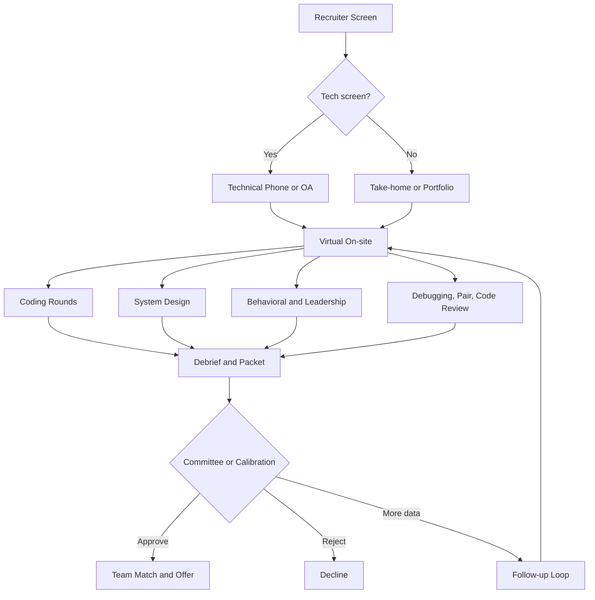
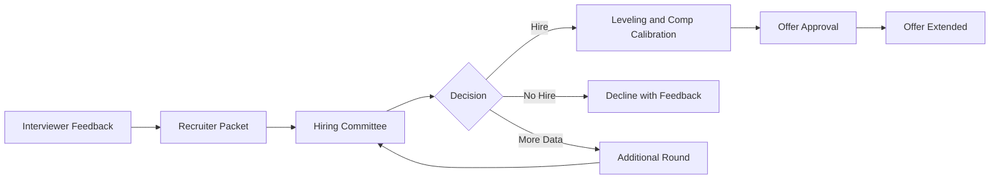
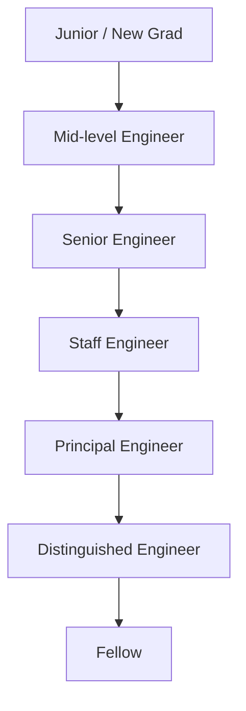

# Interview Meta Topics

> The interview itself is a system. This page covers the *meta* layer — the
> formats, types, rubrics, hiring committees, leveling, calibration, and offer
> mechanics that decide how your technical signals get interpreted. For the
> *content* of each round, follow the linked deep dives.
>
> Related: [Interview Overview](./overview.md) · [Behavioral](./behavioral/README.md) ·
> [Coding Framework](./coding/framework.md) · [System Design Framework](./system-design/framework.md) ·
> [Company Guides](./companies/README.md)

## Why Meta-Topics Matter

A candidate who can reverse a linked list but cannot explain *why* an interviewer is asking, *what* signal is being collected, or *how* the feedback packet will be calibrated is operating blind. Senior loops in particular are won and lost on meta-literacy: framing, leveling fit, and the ability to read a rubric from the interviewer's side of the table.

This page consolidates Section 50 of the master index — interview-specific meta topics — into a single reference, complementing the per-round deep dives by zooming out to the process, the evaluation machinery, and the offer mechanics that surround every round.

> *"The companies that interview well treat interviewing as an engineering problem: hypotheses, rubrics, calibration, and retrospectives."* — adapted from *Decoding the Technical Interview Process* (Yang).

## The End-to-End Interview Process

Most engineering loops follow the same spine, even when the individual rounds
differ. Understanding the spine lets you predict what comes next and allocate
preparation effort proportionally.



### Stage Notes

- **Recruiter screen (15–30 min).** Confirms scope, level, comp, and timeline. Treat it as a negotiation anchor — the comp band recorded here often follows you to the offer.
- **Technical phone / OA (45–60 min).** One or two coding problems via a shared editor (CoderPad, CodePair). Cost-effective filter before a full on-site panel.
- **Take-home or portfolio review.** Common at startups and product-first companies (Stripe, Basecamp-style). Trades interviewer time for candidate time; penalises candidates who cannot time-box.
- **Virtual on-site (4–5 × 45 min).** The default since 2020: 2 coding, 1 system design, 1 behavioral, 1 wildcard (debugging, pair, code review, or specialty).
- **Debrief and packet.** Each interviewer submits structured feedback within 24–48 hours; this packet is the artifact every downstream decision references.
- **Committee / calibration.** Where leveling and hire/no-hire get finalised (detailed below).

## Interview Formats

Formats describe *how* the round is delivered, not what it tests. The same
coding signal can be collected in a whiteboard round, a pair-programming
session, or a take-home — each format changes the failure modes.

| Format | Typical Duration | Signal Collected | Common Failure Modes |
|--------|------------------|------------------|----------------------|
| **Recruiter screen** | 15–30 min | Scope, level, comp fit | Lying about comp, ghosting |
| **Technical phone** | 45–60 min | Coding under time pressure | Silent coding, no edge cases |
| **Online assessment (OA)** | 60–120 min | Coding speed, correctness | Over-optimising, ignoring hidden tests |
| **On-site (in person)** | 4–5 × 45 min | Breadth + endurance | Fatigue, no recovery between rounds |
| **Virtual on-site** | 4–5 × 45 min | Breadth + endurance | Tech failures, camera fatigue |
| **Take-home** | 4–8 h, async | Realistic code quality | Over-engineering, missing deadline |
| **Pair programming** | 45–60 min | Collaboration, taste | Dominating or passive participation |
| **Whiteboarding** | 30–45 min | Thinking aloud, structure | Freezing, messy diagrams |
| **Portfolio review** | 30–60 min | Depth on past work | Inability to defend decisions |

### Format Deep-Dives

- **Take-home.** Stripe's engineering blog describes take-homes as a way to test the *real* job: reading a codebase, making trade-offs, writing tests. Reviewers grade on readability, error handling, and restraint — not cleverness.
- **Pair programming.** The interviewer is pair, not observer; they will intentionally suggest a wrong path to see if you push back. Anti-pattern: dominating the keyboard or silently accepting every suggestion.
- **Whiteboarding.** Still common at Amazon and Microsoft. The skill is *narrating* the box-and-arrow diagram as you draw it: write the problem, state assumptions, then draw.

## Interview Types by Role

Types describe *what* is tested. The mix shifts dramatically with role and
seniority: a new-grad loop is coding-heavy; a Staff loop is design- and
behavioral-heavy.

| Interview Type | New Grad | Mid | Senior | Staff+ | Primary Signal |
|----------------|:--------:|:--:|:------:|:------:|----------------|
| Coding (DSA) | 3 | 2 | 1–2 | 1 | Correctness, complexity, code quality |
| High-level design (HLD) | 0 | 1 | 1–2 | 2–3 | Architecture, trade-offs, scale |
| Low-level design (LLD / OOD) | 0–1 | 1 | 1 | 1 | APIs, classes, patterns |
| Behavioral / leadership | 1 | 1 | 1–2 | 2–3 | STAR, ownership, influence |
| Debugging / production incident | 0 | 0–1 | 1 | 1 | Methodical root-causing |
| Code review | 0 | 0–1 | 1 | 1 | Reading others' code, taste |
| Pair programming | 0 | 0–1 | 0–1 | 0–1 | Collaboration in real time |
| Machine-coding (frontend) | 0 | 0–1 | 1 | 1 | Building a working UI from scratch |
| ML system design | 0 | 0 | 0–1 | 1 | Feature pipelines, model serving |
| Infrastructure / SRE | 0 | 0 | 0–1 | 1 | Capacity, on-call, reliability |
| Project deep-dive | 0 | 0 | 1 | 1–2 | Depth on past work, technical leadership |

### Type Notes

- **Debugging interview.** A broken program or production incident write-up; the interviewer watches you form hypotheses, bisect, and avoid cargo-cult fixes. Methodical > fast: state a hypothesis, design the cheapest disproving experiment, then act.
- **Code review interview.** A real (anonymised) diff and 20 minutes. Grade on correctness, security, performance, readability, and missing tests — not just style.
- **Machine-coding (frontend).** Build a working component (autocomplete, kanban) in 60–90 minutes. Reviewers want working state management, accessibility, and edge cases — not pixel-perfect CSS.
- **Project deep-dive.** Bring one project you know cold. The interviewer probes *downward*: why this data structure, why this consistency model, what broke, what you would redo. Senior loops weigh this heavily.
- **ML system design.** Distinct from classical HLD: feature stores, training vs serving skew, online vs batch inference, drift monitoring. See [ML Questions](./ml-questions.md).

## What Interviewers Evaluate: The Rubric

Every interviewer fills a rubric. The exact axes vary by company, but the
consensus set across Google, Meta, Amazon, and Stripe is:

| Rubric Axis | What "Strong" Looks Like | What "Weak" Looks Like |
|-------------|--------------------------|------------------------|
| **Problem solving** | Decomposes, identifies bottleneck, optimises iteratively | Jumps to code, stuck on brute force |
| **Coding** | Correct, readable, idiomatic, tested | Off-by-one bugs, silent failures, no tests |
| **Communication** | Narrates thinking, asks clarifying questions, manages time | Silent, rambles, ignores hints |
| **Technical depth** | Justifies trade-offs with concrete numbers | Hand-waves, "it depends" with no framing |
| **Technical breadth** | Knows 2–3 viable alternatives per decision | Single-tool hammer |
| **Leadership and influence** (senior+) | Drove decisions, mentored, owned outcomes | Individual contribution only |
| **Bar raising** (Amazon) | Candidate makes the team measurably better | Candidate meets the bar but does not raise it |

> *"We hire people who raise the bar. The question is not 'can they do the
> job?' but 'are they better than half the people currently in the role?'"* —
> Amazon Leadership Principle framing, summarised in *Cracking the Coding
> Interview* (McDowell).

### Scoring Scales

Most companies use a 4-point scale (Strong Hire / Hire / No Hire / Strong No) to force a decision — no comfortable middle. A single Strong No often vetoes the packet even against otherwise Strong Hire feedback, which is why consistency across rounds matters more than one stellar round.

## Common Frameworks and Patterns

Frameworks are scaffolding, not scripts. Memorise the structure, then
internalise it until you can deliver it conversationally.

### STAR (Behavioral)

The gold standard for behavioral answers. See
[STAR Method Deep Dive](./behavioral/star.md).

| Letter | Component | Target Time |
|--------|-----------|-------------|
| **S** | Situation — context, constraints, stakes | 15–20% |
| **T** | Task — your specific responsibility | 10–15% |
| **A** | Action — what *you* did, step by step | 50–60% |
| **R** | Result — quantified outcome + learning | 15–20% |

### REACT (System Design)

A memorable variant of the 4-step
[System Design Framework](./system-design/framework.md):

| Letter | Step | Output |
|--------|------|--------|
| **R** | Requirements — functional + non-functional | Scope doc, capacity numbers |
| **E** | Estimate — traffic, storage, bandwidth | QPS, TB/year, Mb/s |
| **A** | Architecture — boxes and arrows | High-level diagram |
| **C** | Components — deep dive on 2–3 | Schema, cache strategy, sharding |
| **T** | Trade-offs — pros, cons, alternatives | Decision log |

### UMPIRE (Coding)

From the [Coding Framework](./coding/framework.md):

```
U - Understand   (clarify inputs, outputs, edge cases)
M - Match        (identify the pattern)
P - Plan         (brute force, then optimise; pseudocode)
I - Implement    (clean, idiomatic code)
R - Review       (trace a test case; check edge cases)
E - Evaluate     (state time and space complexity)
```

### Behavioral Frameworks Compared

| Framework | Origin | Best For | Weakness |
|-----------|--------|----------|----------|
| **STAR** | General HR, Amazon | Past-behavior questions | Can feel formulaic if over-rehearsed |
| **PEEL** | Meta | Values-driven answers | Less guidance on the "action" detail |
| **SOAR** | Variant of STAR | Shorter answers | Drops the explicit "Task" framing |
| **CAR** | Concise variant | 60-second answers | Too short for complex stories |
| **PARLA** | Leadership rounds | Learning + application | Heavy; needs disciplined timing |

Pick one primary framework (STAR is the safest default) and keep a second as
fallback for time-constrained follow-ups.

## Hiring Committees and Calibration

The packet you generate does not directly produce a hire decision. It feeds a
review process whose mechanics differ by company.



### The Google / Amazon Committee Model

- **Google** uses a central Hiring Committee that never met you. They read
  the packet cold, calibrate against historical hires at the target level,
  and either approve, reject, or request more signal. A separate Compensation
  Committee then sets the offer. Team match happens *after* approval.
- **Amazon** decentralises: the loop itself (interviewers + bar raiser)
  debriefs live and decides. The "bar raiser" is an outsider whose job is to
  prevent local team pressure from lowering the bar; they hold a veto.
- **Meta** sits between: the loop debriefs, but a hiring manager and
  recruiter make the call with light committee oversight for senior levels.

### Calibration Meetings

Calibration is where managers normalise rubric scores across interviewers and candidates. Without it, a "Hire" from a lenient interviewer would outweigh a "No Hire" from a strict one. Mechanics: managers bring their recommended level and score, a facilitator surfaces outliers (e.g., a Strong Hire on a packet with two No Hires) and forces justification, and the group agrees a final level.

The implication for candidates: your packet is read *in comparison* to other recent packets at the same level. A "good" system-design round is good relative to the bar, not in absolute terms.

## Leveling

Leveling determines the comp band, the scope of the offer, and the expectations you will be held to. Mis-leveling — either direction — is expensive: too low and you reset your career trajectory; too high and you risk a quick performance exit.



### What Each Level Expects

| Level | Scope | Autonomy | Typical Signal in the Loop |
|-------|-------|----------|----------------------------|
| **Junior / New Grad** | A task, well-defined | Needs mentorship; ships with review | Clean coding, basic design, eagerness |
| **Mid-level** | A feature, end-to-end | Independent; unblocks self | Owns a component, sound trade-offs |
| **Senior** | A subsystem or service | Sets direction for a small team | Drives design, mentors, handles ambiguity |
| **Staff** | A multi-team problem | Influences across org; sets technical vision | Cross-team architecture, leadership stories |
| **Principal** | An org-wide problem | Influences strategy; multiple Staff report up | Multi-year technical strategy, org impact |
| **Distinguished** | A company-wide problem | Shapes company technical direction | Rare; recognised externally |
| **Fellow** | An industry-wide problem | Defines new fields | Career-defining work |

> *"Staff engineers operate on problems where the path is not given. The
> interview loop for Staff must therefore test the ability to *find* problems,
> not just solve given ones."* — paraphrased from *Staff Engineer* (Bougy).

### Leveling Across Companies

| Company | New Grad | Mid | Senior | Staff | Principal | Distinguished |
|---------|----------|-----|--------|-------|-----------|---------------|
| **Google** | L3 | L4 | L5 | L6 | L7 | L8 |
| **Meta** | E3 | E4 | E5 | E6 | E7 | E8 |
| **Amazon** | L4 | L5 | L6 | L7 | L8 | L10 |
| **Microsoft** | 59 | 61 | 63 | 65 | 66 | 67+ |
| **Apple** | ICT2 | ICT3 | ICT4 | ICT5 | ICT6 | — |
| **Stripe** | L1 | L2 | L3 | L4 | L5 | — |

> Levels are sourced from public leveling guides on
> [levels.fyi](https://www.levels.fyi/). Always confirm the target level with
> your recruiter *before* the on-site — it determines which rounds you will
> face.

## Offer Negotiation

Negotiation is the highest-leverage 30 minutes of your career. A 10% base
bump compounds for decades; equity grants often dominate lifetime earnings.
The mechanics:

### Components of an Offer

| Component | Negotiable? | Notes |
|-----------|:-----------:|------|
| **Base salary** | Yes, ±5–15% | Banded by level; hardest to move beyond band |
| **Equity / RSUs** | Yes, ±10–30% | Largest dollar swing; vesting over 4 years |
| **Sign-on bonus** | Yes, highly | Easiest to inflate; one-time, non-compounding |
| **Relocation** | Sometimes | Often fixed; ask for gross-up on tax |
| **Annual bonus target** | Rarely | Usually formulaic by level |
| **Refresh grants** | Ask, don't assume | Annual equity top-ups; get the policy in writing |

### Annualised Equity Value

A common sanity check is annualised equity value at the grant price:

\\[
V_{eq} = s \cdot p \cdot v
\\]

where \\(s\\) is the number of granted shares, \\(p\\) is the fair-market
value per share at grant, and \\(v\\) is the annual vesting fraction (typically
\\(v = 0.25\\) for a 4-year ratable vest with a 1-year cliff). Compare
\\(V_{eq}\\) across offers *at the same risk-adjusted discount* — private
company equity carries discount and illiquidity that public RSUs do not.

### Negotiation Principles

1. **Never accept the first verbal offer.** It is almost always a test anchor. Thank the recruiter, ask for the written breakdown, and set a follow-up.
2. **Get everything in writing.** Verbal promises on refresh, sign-on, or level do not survive a recruiter turnover.
3. **Use competing offers, even hypothetical ones.** "I am finalising with another company and expect a stronger package; can we close the gap on equity?" is more effective than naming a number first.
4. **Negotiate the level, not just the dollars.** A level bump resets the band, so base, equity, and bonus all rise together.
5. **Time-box the decision.** Exploding offers (24–48h deadlines) are common at startups; ask for the deadline in writing. Never lie about a competing offer (recruiters talk; falsified offers get rescinded) and never renegotiate after signing.

## Subject-Specific Interview Patterns

Section 50 of the master index lists a long tail of subject-specific
interview patterns. These are not separate formats — they are content lenses
applied *inside* the formats above. The deep dives live elsewhere in the book;
this section indexes the meta-patterns.

| Subject | Round Type | Index Topic | Deep Dive |
|---------|-----------|-------------|-----------|
| **Requirements clarification** | HLD / behavioral | §50 | [System Design Framework](./system-design/framework.md) |
| **Complexity analysis** | Coding | §50 | [Complexity Analysis](./coding/complexity.md) |
| **Trade-off analysis** | HLD / LLD | §50 | [System Design Framework](./system-design/framework.md) |
| **Designing under constraints** | HLD | §50 | [Capacity Planning](./system-design/hld/capacity-planning.md) |
| **Estimation** | HLD | §50 | [Estimation](./system-design/estimation.md) |
| **Capacity planning** | HLD | §50 | [Capacity Planning](./system-design/hld/capacity-planning.md) |
| **Debugging interviews** | Debugging | §50 | [Debugging](../debugging/README.md) |
| **Code review interviews** | Code review | §50 | (this page) |
| **Machine-coding interviews** | Machine-coding | §50 | [Machine Coding](../machine-coding/README.md) |
| **Low-level design** | LLD | §50 | [LLD](./system-design/lld/README.md) |
| **High-level design** | HLD | §50 | [HLD](./system-design/hld/README.md) |
| **Behavioral engineering** | Behavioral | §50 | [Behavioral](./behavioral/README.md) |
| **Project deep dives** | Deep-dive | §50 | (this page) |
| **Production incident interviews** | Debugging | §50 | [Production Engineering](../production-engineering/README.md) |
| **OS interview patterns** | Subject | §50 | [OS Questions](./os-questions.md) |
| **DBMS interview patterns** | Subject | §50 | [DBMS Questions](./dbms-questions.md) |
| **Networking interview patterns** | Subject | §50 | [Network Questions](./network-questions.md) |
| **Concurrency interview patterns** | Subject | §50 | [Concurrency](../concurrency/overview.md) |
| **ML system-design interviews** | ML design | §50 | [ML Questions](./ml-questions.md) |
| **Backend interviews** | Coding + HLD | §50 | [Backend](../backend/README.md) |
| **Language-specific interviews** | Subject | §50 | [Languages (Python)](../languages/python/README.md) |

### Meta-Skills Within Rounds

- **Requirements clarification.** The first 5 minutes of any design round. The trap is accepting the problem as stated. Ask: who are the users, what is the read/write ratio, what is the scale, what is in scope. A candidate who asks no clarifying questions reads as arrogant or naive.
- **Complexity analysis.** State both time and space in Big-O, tied to a *concrete* input size. "O(n log n)" is weak; "O(n log n) over 10⁶ elements ≈ 2 × 10⁷ comparisons — well within a second" is strong. For divide-and-conquer, the master-theorem recurrence \\( T(n) = aT(n/b) + f(n) \\) is fair to invoke.
- **Designing under constraints.** Senior+ rounds love hard constraints ("design for 99.99% availability with one region," or "with a $1000/month budget"). Make the constraint *explicit* and design *around* it — do not ignore it and scale to Google.
- **Estimation and capacity planning.** Fermi problems ("how many searches/sec does Google handle?") test decomposition into estimable factors (population × internet penetration × queries/user/day) with stated assumptions. See [Estimation](./system-design/estimation.md) and [Capacity Planning](./system-design/hld/capacity-planning.md).

## Anti-Patterns

These are the recurring reasons otherwise-strong candidates get down-levelled
or rejected. Audit yourself against them before every loop.

| Anti-Pattern | What It Looks Like | Fix |
|--------------|--------------------|----|
| **Memorisation without understanding** | Recites the optimal solution but cannot vary it | Re-derive solutions from first principles; explain *why* each step works |
| **No questions asked** | Accepts the problem as stated, dives in | Prepare 4–5 clarifying questions per round type |
| **Not testing edge cases** | Codes the happy path, stops | Always trace: empty, single, duplicate, negative, overflow |
| **Silent coding** | Types for 10 minutes without speaking | Narrate every decision; thinking aloud *is* the signal |
| **Arguing with hints** | Defends a wrong approach when nudged | Treat hints as gifts; pivot visibly and thank the interviewer |
| **Over-engineering** | Adds caching, sharding, queues to a 100-user system | Right-size to the stated scale; state the threshold where each technique pays off |
| **Single-tool hammer** | Reaches for the same data structure every time | Know 2–3 viable approaches; pick based on the constraints |
| **Vague results** | "We improved things" | Quantify: latency, cost, throughput, error rate |
| **"We" instead of "I"** | Takes shared credit for individual work | Name your specific contribution in behavioral answers |
| **No recovery between rounds** | Carries a bad round into the next | Reset ritual: 2 minutes, water, one affirming sentence |

## Interview Questions (Meta)

These are questions *about* interviews — asked by recruiters, hiring
managers, and peers, and worth rehearsing.

**Q1. Walk me through how you would design an interview loop for a Senior
Backend Engineer.**

> Start from the rubric: define the signals that distinguish Senior from Mid (cross-team design, mentorship, ambiguity tolerance). Translate each signal into a round: 2 coding (correctness + code quality), 1 HLD (scale + trade-offs), 1 LLD (API + schema), 1 behavioral (leadership + influence), 1 project deep-dive (technical depth). Add a bar-raiser-style outsider to prevent local bias. Cap at 5 rounds to limit fatigue and false negatives.

**Q2. A candidate aces coding but bombs behavioral. Hire or no hire?**

> It depends on level. For new-grad and Mid, strong coding can carry a soft behavioral round if the signal is "quiet" rather than "toxic." For Senior+, behavioral is a leading indicator of on-the-job leadership; a bomb there usually vetoes, because the role requires influence, not just execution. State the level assumption explicitly before answering.

**Q3. How do you calibrate interviewers against each other?**

> Two levers: structured rubrics and calibration meetings. Every interviewer scores the same axes on the same scale; in calibration, a facilitator surfaces outliers and forces justification. Over time, track each interviewer's hire rate and post-hire performance to detect leniency or strictness drift, and retrain or rotate outliers.

**Q4. What is the single biggest mistake candidates make in system design
interviews?**

> Jumping to architecture before nailing requirements. A candidate who draws Kafka + Cassandra + Redis in minute 3, without stating QPS, storage, or consistency needs, has signalled breadth without judgment. Spend the first 5 minutes on requirements and capacity; the architecture then *falls out of* the constraints.

**Q5. How would you decide between a take-home and a live coding round?**

> Trade on three axes: signal fidelity, candidate time, and false-negative rate. Take-homes better approximate the real job (readability, restraint, testing) but over-weight free time and under-weight time pressure. Live rounds test thinking under pressure but introduce performance anxiety and editor friction. For Senior+ where code quality is the leading signal, prefer take-home; for new-grad throughput, prefer live.

**Q6. A candidate has a competing offer 20% above your band. What do you do?**

> First, verify the competing offer (levels.fyi, written confirmation). Second, decide whether the candidate clears the next level — a level bump resets the band and is usually cheaper than an out-of-band exception. Third, if the level is correct, escalate to the compensation committee for a one-time sign-on or equity top-up rather than breaking base. Never lie about the band; it surfaces in onboarding and erodes trust.

**Q7. What questions should a candidate *never* fail to ask the interviewer?**

> Three: (1) "What does success look like in the first 90 days?" — surfaces real expectations. (2) "What is the hardest technical problem your team is currently stuck on?" — signals you are interviewing them back and feeds the project deep-dive. (3) "How does the team make technical decisions?" — reveals whether it is a staff-led or consensus-led culture, which affects your day-to-day more than the tech stack.

**Q8. How do you prevent interview bias in a loop?**

> Structural fixes beat goodwill: structured rubrics (everyone scores the same axes), score normalisation in calibration, diverse panels (not just the hiring manager's friends), and blind resume review where feasible. Track outcomes by demographic and retro annually. The goal is not to remove judgment but to remove *irrelevant* variance — same candidate, same packet, same decision regardless of panel.

## Cross-References

- [Interview Overview](./overview.md) — high-level map of all rounds
- [Behavioral Interview](./behavioral/README.md) and [STAR Method](./behavioral/star.md) — behavioral content
- [Coding Framework](./coding/framework.md) — UMPIRE method
- [System Design Framework](./system-design/framework.md) — 4-step design
- [HLD](./system-design/hld/README.md) and [LLD](./system-design/lld/README.md) — design deep dives
- [Company Guides](./companies/README.md) — Google, Meta, Amazon, Apple, Microsoft, Netflix loops
- [Recruiter Communication](./companies/recruiter-communication.md) — negotiation scripts
- [Behavioral Interviews (top-level)](../behavioral-interviews/README.md) — companion section

## References

- McDowell, Gayle Laakmann. *Cracking the Coding Interview*. CareerCup.
  <https://www.crackingthecodinginterview.com/>
- Yang. *Decoding the Technical Interview Process*.
- Bougy. *Staff Engineer: Leadership Beyond the Management Track*.
- levels.fyi — public compensation and leveling data.
  <https://www.levels.fyi/>
- Google Engineering Practices —
  <https://google.github.io/eng-practices/>
- Meta Engineering Blog — <https://engineering.fb.com/>
- Stripe Engineering Blog — <https://stripe.com/blog/engineering>
- Amazon Leadership Principles —
  <https://www.amazon.jobs/content/en/our-workplace/leadership-principles>
