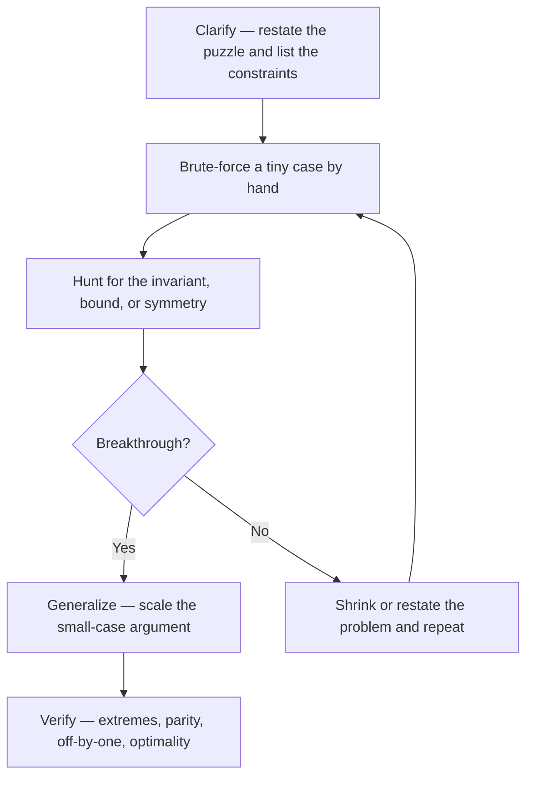

# Puzzles & Brain Teasers

## Overview

This section covers the brain teasers that surface as warm-ups in Indian campus placements and in product-company interviews — the 25-horses problem, the two-egg drop, Monty Hall, the 100-prisoners protocols, and their canonical cousins. Puzzles are not trivia quizzes: interviewers use them to calibrate how you reason under ambiguity, when no library function or known algorithm exists to lean on. The three content pages here give full worked solutions — reasoning steps, not just final answers — for roughly 25 puzzles, organized by the skill they exercise: measurement, deduction, and probability.

Read this index first, then work through the pages in order or jump straight to the puzzle that appeared in your last interview. Every solution on the following pages follows the same five-stage framework defined below, so practicing one puzzle trains the approach for all of them. The difficulty ratings use the legend at the bottom of this page, so a ★★ on one page means the same thing as a ★★ on another.

No specific coursework is a prerequisite: the measurement page needs comfort with exponents and logs, the deduction page needs only careful bookkeeping, and the probability page needs basic conditional probability — the kind covered by the aptitude track linked at the bottom. What all three pages do demand is willingness to write things down; every solution here is reproducible on a whiteboard in under three minutes once the key step is visible.

## Why Interviews Open with a Puzzle

### What Is Actually Being Calibrated

A puzzle interviewer is measuring four things at once. First, whether you can make progress when the problem statement is deliberately underspecified — real production problems are also underspecified, and the habit of asking one sharp clarifying question transfers directly. Second, whether you can reason from first principles: derive the bound before the algorithm, the invariant before the answer. Third, whether you can narrate that reasoning coherently, because the narration is most of the signal. Fourth, how you behave when stuck — do you silently freeze, guess wildly, or systematically shrink the problem until it becomes tractable?

### What Puzzles Are Not Testing

Puzzles are not an IQ gate and not a memory test; nobody is impressed that you recall "the answer is 14" without being able to re-derive it. Interviewers consistently report that a structured, partially-complete attempt scores higher than a memorized answer delivered instantly. If you have genuinely seen the puzzle before, say so out loud, offer to solve a variant instead, or at minimum re-derive the solution rather than reciting it — silently claiming credit for folklore is a red flag interviewers are trained to spot.

### Where Puzzles Appear in the Funnel

| Stage | Typical puzzle role | What it decides |
|---|---|---|
| Online assessment / written test | Logic and probability MCQs (bodies-of-water style variants) | Screening cutoff, 5–10 minutes of the paper |
| Phone screen warm-up | One ★ or ★★ puzzle in the first 10 minutes | Ice-breaking plus a first reasoning sample |
| Onsite round opener | One ★★ puzzle before or after a coding question | Communication and recovery behavior when stuck |
| Dedicated puzzle / Lateral rounds | 2–3 puzzles back to back (common at product companies) | Make-or-break for some lateral-hire loops |
| Quant / analytics interviews | Multi-layer probability puzzles with follow-ups | Depth of probabilistic modeling under pressure |

The same puzzle can appear at different depths per stage: 25 horses is a 2-minute warm-up on a phone screen and a 10-minute optimality argument (why not 6 races?) onsite. Prepare for the follow-up, not just the punchline.

## The Universal Solve Framework

### The Five Stages

Every worked solution in this section walks the same loop, and you should walk it out loud in interviews too.

1. **Clarify.** Restate the puzzle in your own words and enumerate the constraints explicitly: how many of each object, what counts as a question, what information each observation reveals. One good question ("each weighing has three possible outcomes, right?") is often worth ten minutes of guessing.
2. **Brute-force a small case.** Solve the 2-ball, 3-person, or 1-day version by hand. Small cases reveal the structure — who must move, what parity means, which outcomes are impossible.
3. **Hunt for the invariant.** Ask: what quantity never changes, what bound can no scheme beat, what symmetry collapses the case analysis? Nearly every classic puzzle — mod-3 chameleon colors, both-ends rope burning, cycle-following prisoners — cracks at an invariant or an information bound.
4. **Generalize.** Scale the small-case argument up: replace 3 with n, replace "weigh" with "any ternary test", and check the bound still holds.
5. **Verify.** Test extremes (all balls identical weight, 0 horses), check off-by-one boundaries, and state why your answer is optimal, not just correct.

### Why the Order Matters

Candidates who jump to "generalize" without the small case produce solutions that break on boundary inputs, and candidates who brute-force forever never find the invariant. The loop is cheap: a tiny case takes two minutes and either produces the invariant or produces the counterexample that redirects you. When stuck at stage 3, the productive move is stage 1 again — restate the problem with a different choice of state variable (track the *deficit* in an hourglass, the *difference* between chameleon counts) rather than staring harder at the same formulation.

### The Framework in 60 Seconds

Take the hourglass puzzle (measure 15 minutes with 7- and 11-minute glasses) as a micro-example.

| Stage | What you say aloud |
|---|---|
| Clarify | "I can start both glasses together, flip either glass at any moment, and I need one interval of exactly 15 minutes." |
| Brute force | "With just the 7-glass I can make 7, 14, 21…; with the 11-glass, 11, 22… 15 is not a multiple of either, so a flip must happen mid-burn." |
| Invariant | "Flipping banks the elapsed time: at minute 11 the 7-glass holds 4 minutes of fallen sand — I can reuse that 4." |
| Generalize | "Start both, flip the 7 at 7, flip the 7 again at 11 — the banked 4 runs out at exactly 15." |
| Verify | "7 → 11 is 4 minutes of accumulation, plus 4 more from the flipped pile: 11 + 4 = 15 ✓" |

## Page Index — What Appears Where

| Page | Signature puzzles | Companies / settings | Typical rounds |
|---|---|---|---|
| [Classic Measurement](./classic-measurement.md) | 8-ball weighing, 25 horses 5 tracks, burning ropes, 2 eggs 100 floors, 3 water jugs, hourglasses, 1000 wine bottles, gold bar | Google, Microsoft, Amazon, product startups, hardware/embedded teams | Warm-up before coding, dedicated puzzle rounds |
| [Logic & Deduction](./logic-deduction.md) | 100 prisoners light bulb, hat-parity line-up, truth-tellers & liars, chameleons, camel & 3000 bananas, bridge crossing, birthday elimination grid, two-children paradox | Google, Microsoft, Flipkart-tier product companies, analytics firms | Onsite openers, HR + logic rounds |
| [Probability Puzzles](./probability-puzzles.md) | Birthday paradox, Monty Hall, 3 ants on a triangle, random point in a circle, HHT vs HTH, 100 prisoners & own numbers, boys-and-girls variants, 3 switches one visit | Quant-heavy firms, Amazon data roles, Google, fintech | Screening MCQs, data/analytics rounds, quant phone screens |

Companies listed reflect where each family shows up most often in reported interview loops; treat the mapping as a frequency prior, not a guarantee — any company can borrow any puzzle. The measurement page leans on information theory and minimax reasoning, the deduction page on invariants and elimination, and the probability page on conditional probability and expected value. If your target company is named in the table, solve that page first and the other two for breadth.

## Interviewer Expectations

### Thinking Aloud Beats an Instant Answer

The interviewer grades the stream of reasoning, not the final number, so silence is the single most expensive behavior in a puzzle round. Narrate the framework stages by name if it helps: "let me clarify the constraints… let me try the 3-ball version first… what's invariant here is the parity of…". A candidate who says wrong things out loud and self-corrects visibly outscores a silent candidate who eventually lands the right answer, because the first behavior predicts good collaboration and the second predicts none. Budget roughly 20% of the time for clarification and the rest for structured search — the same allocation the [Coding Framework](../coding/framework.md) prescribes for coding rounds.

### If You Have Seen the Puzzle, Declare It

Say "I know this one — it's the 25-horses problem. Should I solve a variant, or re-derive the solution?" This converts a potential trap into a demonstration of honesty and breadth, and most interviewers will happily twist the puzzle one step (why 7 is minimal, what changes with 4 horses) to restore the test. Reciting a memorized answer without flagging it is worse than either alternative: if the interviewer notices, the round becomes about trust rather than reasoning.

### What Counts as Solved

- The correct answer, produced by a derivation you can show step by step.
- An optimality argument where the puzzle asks for a minimum or maximum ("7 races, and here is why 6 cannot work").
- Clean handling of the interviewer's follow-up variant (weights unknown heavier/lighter, 3 eggs instead of 2, 50 floors instead of 100).
- Explicit verification: run the tiny case, check the boundary, sanity-check the arithmetic out loud.

## Difficulty Legend (Used Across This Section)

| Rating | Meaning | Expected time | Signal when solved cold |
|---|---|---|---|
| ★ Easy | One invariant or one counting trick; no case analysis | 2–4 min | Passable baseline for any round |
| ★★ Medium | Two-step argument or small case analysis; usually one follow-up | 5–10 min | Clears onsite warm-up bars at product companies |
| ★★★ Hard | Layered invariant + bound + variant handling; multiple follow-ups | 10–15 min | Differentiator in quant and top-tier product loops |

The ratings assume cold solving with the framework above; a memorized ★★★ still fails its follow-ups, which is why re-derivation matters more than recognition. Within each page, puzzles are ordered roughly by rating so you can calibrate your stamina: if the second ★★ takes you 25 minutes on paper, drill that page's family before your loop rather than reading new material.

## How to Practice

Solve each puzzle on paper before reading its solution — even 5 minutes of genuine struggle builds the retrieval path that a pure read-through does not. After reading, close the page and re-derive the key invariant from scratch the next day; spaced re-derivation, not rereading, is what survives interview pressure. For the probability page, run the tiny Python simulations provided and confirm the theoretical numbers (0.667 for switching in Monty Hall, ≈0.312 for the cycle-following prisoners) — seeing simulation and theory agree is the fastest way to internalize conditional probability. Finally, practice narrating: solve one puzzle per day out loud to an empty room, a friend, or a recording, because unpracticed narration is the most common reason strong solvers still fail puzzle rounds.

## Section Conventions

Every content page in this section follows the same contract, so you always know where to look. Each puzzle gets a full worked solution with the reasoning shown step by step — tables, traces, and derivations, not just the punchline — plus a short "what the interviewer tests" note where the meta-lesson is easy to miss. Math renders as MathJax, strategy trees render as Mermaid, and every page closes with interview Q&A, key takeaways, verified references, and cross-links into the DSA and aptitude tracks. Difficulty ratings use the legend above and are consistent across pages; the ★ count is the cold-solve expectation, not the read time.

## From Puzzle to Skill: the Meta-Tool Map

Ten meta-tools cover essentially every classic puzzle; each appears on at least one page of this section. Learn the tool, not the puzzle — the tool survives the interviewer's invented variant.

| Meta-tool | One-line definition | Puzzles that teach it |
|---|---|---|
| Information bound | Count each test's outcomes before designing any test | 8-ball, 12 coins, wine bottles, gold bar |
| Invariant (parity, mod arithmetic) | Find the quantity no move can change | Chameleons, hat parity, burning ropes |
| Minimax schedule | Equalize worst cases across branches | 2 eggs 100 floors, 25 horses |
| State-space search | Model moves as graph edges; search for shortest | Water jugs, bridge crossing |
| Protocol design | Rules that extract information from randomness over time | Light bulb, hat line-up, prisoners & numbers |
| Elimination grid | Public statements strike out shared candidates | Birthday puzzle, truth-tellers & liars |
| Conditional probability | Compute P(A given B) on a tree, not by feel | Monty Hall, children paradox |
| Expected value via states | Markov bookkeeping over named states | HHT vs HTH, random point in a circle |
| Complement counting | Enumerate the favorable cases and invert | Birthday paradox, 3 ants |
| Stopping-rule awareness | Optional stopping cannot bias independent draws | Boys-and-girls variants |

When a new puzzle appears in an interview, run this list as a checklist in your head: bound, invariant, minimax, state space, protocol, grid, tree, expectation, complement, stopping. One of the ten almost always bites, and saying "this smells like an invariant problem" out loud is itself a scored signal.

## Common Failure Modes and Fixes

| Failure mode | What it looks like | Fix |
|---|---|---|
| Solving silently | Four minutes of quiet, then a number | Narrate each framework stage; wrong turns said aloud score |
| Reciting folklore | Instant answer, no derivation, vague on follow-ups | Declare it, then re-derive or solve a variant |
| Ignoring the bound | Designing weighings before counting outcomes | State `3^k` (or `2^k`) before any scheme |
| Skipping the small case | Generalizing from nothing | Hand-solve the 3-object version first |
| Missing the optimality ask | Stopping at a construction | Close with why-minimal: adversary or bound |
| Mixing conditioning channels | 1/3 vs 1/2 on children puzzles | Restate exactly how the information was obtained |
| Simulation as a crutch | "I'd just code it" with no model | Propose the 10-line simulation *after* the derivation |

Most failed puzzle rounds die of the first and last rows combined: silence followed by a memorized shell. The framework plus the failure table give you a recovery script for both — when lost, say so, drop to the smallest case, and rebuild aloud.

## Two Prep Plans for Puzzle Rounds

| Day | Work | Time |
|---|---|---|
| 1 | This index: framework + meta-tool map; measurement page (weighing section) | 90 min |
| 2 | Measurement page: horses, ropes, 2 eggs; re-derive 14 aloud | 75 min |
| 3 | Logic page: light bulb, hats, liars | 75 min |
| 4 | Logic page: chameleons, bananas, bridge, birthday grid | 75 min |
| 5 | Probability page: birthday, Monty Hall; run both simulations | 90 min |
| 6 | Probability page: coin flips, 100 prisoners, children variants | 75 min |
| 7 | Mock: 3 random puzzles, 25 minutes, recorded; audit against the failure table | 45 min |

The plan front-loads reading into days 1–6 and spends the last day entirely on narration and self-audit, because recall without delivery fails puzzle rounds. If you have only two evenings, do days 1 and 5: the framework plus the probability canon covers the highest-frequency warm-ups. If you have two weeks, repeat the seven days with different puzzles per family — the second pass should be pure re-derivation with the pages closed.

## Interview Questions

1. **Why do companies still ask puzzles when the job is writing software?** Because the puzzle tests exactly the loop a production incident or an unfamiliar codebase demands: clarify ambiguous constraints, form a small reproducible case, isolate an invariant, generalize, and verify. A library of memorized algorithms does not help when the situation is genuinely novel, so the puzzle isolates raw reasoning plus communication. Interviewers also learn how you respond to being stuck, which is a daily experience in real engineering.
2. **I got asked a puzzle I had seen before. What is the best play?** Declare it immediately and offer to re-derive the solution or solve a variant. This preserves the assessment's integrity, shows honesty, and usually earns you a harder twist that restores the signal. Quietly reciting folklore is detectable and damages the trust the rest of the loop depends on.
3. **What should I do in the first 30 seconds of a puzzle?** Restate the problem, enumerate the constraints out loud, and ask one sharp clarifying question. This buys structure, often changes the problem (interviewers frequently simplify when asked), and demonstrates the calibration skill the puzzle exists to measure. Jumping straight to guessing forfeits the easiest points on the board.
4. **Is it acceptable to use math notation or a whiteboard for puzzles?** Yes — interviewers expect it, and writing the state space (outcomes of a weighing, sample space of two children) is usually the breakthrough itself. Verbalize what you write so the narration signal is not lost. Notation is a memory aid, not a replacement for explaining.
5. **How do I practice puzzles without memorizing 500 of them?** Learn the ~10 reusable meta-tools this section teaches: information bounds (3^k weighings), invariants (mod arithmetic, parity), minimax schedules, state-space search, both-ends symmetry, elimination grids, conditional probability, expected value, stopping-rule traps, and binary encodings. Almost every classic is one or two of these tools composed. Drill the tool, and the puzzle becomes an instance rather than a memorized item.
6. **A puzzle round is announced. How should I allocate 30 minutes?** Spend 5 minutes across two easy puzzles to bank warm-up credit, 15–20 minutes on the medium/hard centerpiece with full framework narration, and the remainder on the optimality argument and follow-ups. Skipping the optimality discussion is the most common scoring miss, because interviewers weight "why is this minimal" as heavily as the construction itself.

## Key Takeaways

- Puzzles calibrate reasoning under ambiguity and narration quality — not trivia recall, IQ, or memorization.
- One framework covers the whole section: clarify → brute-force small → find the invariant → generalize → verify.
- Thinking aloud, including wrong turns and self-corrections, outscores a silent correct answer every time.
- If you have seen the puzzle, declare it and offer a variant; silently reciting folklore is a trust failure.
- The three families are measurement (information bounds and minimax), deduction (invariants and elimination), and probability (conditional probability and expected value).
- ★/★★/★★★ ratings are consistent across the section: 2–4, 5–10, and 10–15 minutes respectively.
- Optimality arguments ("why 7 races, why 14 drops") are graded as heavily as constructions — always close them.
- Simulations are legitimate interview tools: proposing a 10-line Python check for Monty Hall demonstrates engineering judgment.

## References

- Peter Winkler, *Mathematical Puzzles: A Connoisseur's Collection*, A K Peters, 2004 — the canonical collection; provenance for the weighing, rope, and prisoner puzzles.
- Peter Winkler, *Mathematical Mind-Benders*, A K Peters, 2007 — successor volume with the camel-transport and invariant families.
- Martin Gardner, *aha! Insight*, W H Freeman, 1978 — the popularization layer most interview folklore descends from.
- [Monty Hall problem — Wikipedia](https://en.wikipedia.org/wiki/Monty_Hall_problem) — conditional-probability treatment and the simulation argument.
- [Birthday problem — Wikipedia](https://en.wikipedia.org/wiki/Birthday_problem) — exact product formula and approximation tables.
- [100 prisoners problem — Wikipedia](https://en.wikipedia.org/wiki/100_prisoners_problem) — the cycle-following strategy and the ~31% analysis.

## Cross-References

- [Coding Framework](../coding/framework.md) — UMPIRE for coding rounds; the puzzle framework on this page is the same discipline scaled down.
- [Interview Overview](../overview.md) — where puzzle rounds sit in the full interview funnel and how to schedule prep.
- [Logical Reasoning (Aptitude)](../../aptitude/logical-reasoning.md) — written-test versions of the deduction puzzles with timed drills.
- [Probability & Combinatorics (Aptitude)](../../aptitude/probability-combinatorics.md) — the counting and probability toolkit the third page builds on.
- [Google](../companies/google.md) — a company whose loops frequently open with puzzle-style warm-ups.
- [Classic Measurement](./classic-measurement.md) — start here for the weighing, timing, and transport canon.
- [Quantitative Finance Interview Preparation](../../quant-prep/README.md) — the dedicated quant-track sibling of this section: firm-specific puzzle cultures (Jane Street monthly puzzles, HRT brainteasers), expected-value derivations, and market-making games.
- [Expected Value Problems](../../quant-prep/expected-value-problems.md) — the probability canon pushed one level deeper, with full first-step-analysis derivations.
- [Competitive Programming](../../competitive-programming/README.md) — where the same problem-solving discipline is scored by a judge instead of an interviewer.
- [Competitive Mathematics](../../competitive-math/README.md) — the proof-based olympiad track behind many of the puzzle archetypes here.
