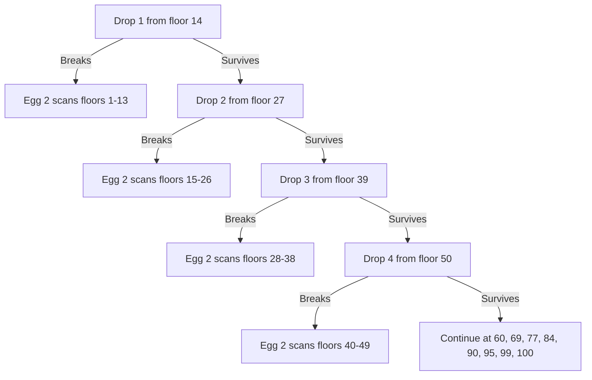

# Classic Measurement Puzzles

## Overview

Measurement puzzles ask you to extract a quantity — a heavier ball, a minimum number of races, an exact time interval, a critical floor — using deliberately crude instruments: a balance scale, a stopwatch-free track, a non-uniform rope, a fragile egg. They form the largest single family of warm-up puzzles at Google, Microsoft, Amazon, and product startups, and every one of them cracks with the same toolkit: an information-theoretic bound, an invariant, a minimax schedule, or a state-space search. This page works through the eight classics with full derivations, because the derivation is what the interviewer grades. Read [the section index](./README.md) first if you want the framing and the difficulty legend; every puzzle below is ★ or ★★ except the two-egg derivation, which is ★★★ with its optimality argument.

## Weighing Puzzles and the Information Bound

### Three Outcomes per Weighing: the 27-State Bound

A balance comparison has exactly three outcomes: left heavier, right heavier, or balanced. Each weighing therefore contributes at most one ternary digit of information, so `k` weighings distinguish at most \\( 3^k \\) configurations. This single fact — not memorized procedures — is how you answer every weighing puzzle, including follow-ups the interviewer invents on the spot.

\\[ \\text{identifiable states} \\le 3^k \\quad \\Rightarrow \\quad k \\ge \\lceil \\log_3(\\text{states}) \\rceil \\]

| Puzzle | Hidden states | Bound \\( \\lceil \\log_3(\\text{states}) \\rceil \\) | Weighings actually needed |
|---|---|---|---|
| 8 balls, one heavier | 8 | 2 | 2 |
| 27 balls, one heavier | 27 | 3 | 3 |
| 12 coins, one odd, weight unknown | 12 × 2 = 24 | 3 | 3 |
| 13 coins, one odd, with a known-good coin available | 26 | 3 | 3 |

The 12-coin row shows why "states" beats "objects": the coin could be heavier *or* lighter, doubling the hypothesis space to 24, which still fits under 27 but only barely — and that tightness is exactly why the 12-coin solution is intricate.

### The 8-Ball Puzzle (One Heavier Ball, Two Weighings)

You have 8 identical-looking balls; one is marginally heavier; a balance scale; find it in two weighings. The bound says 2 is possible since \\( 3^2 = 9 \\ge 8 \\), so the only question is the split that preserves all three outcomes.

1. **Weighing 1: 3 balls vs 3 balls**, leaving 2 aside.
   - *Left heavier* → the heavy ball is in the left triple; 3 candidates remain.
   - *Right heavier* → symmetric, 3 candidates.
   - *Balanced* → the heavy ball is one of the 2 set aside.
2. **Weighing 2:**
   - From a triple: weigh 1 vs 1. If one side sinks, that is the ball; if balanced, the third (unweighed) ball is it.
   - From the pair: weigh 1 vs 1; the heavier side is it.

Every branch terminates in exactly two weighings, meeting the bound. Saying "9 ≥ 8, so two weighings suffice" before constructing the scheme is the move that separates framework thinkers from pattern memorizers.

### Why 4-versus-4 Wastes a Weighing

The instinctive first weighing for 8 balls is 4 vs 4 — and it is strictly worse. Because the odd ball is guaranteed to be on the scale, the "balanced" outcome is impossible: the weighing can return only two results, so it spends a ternary test while extracting at most one binary answer. After 4 vs 4 you still have 4 suspects, which need two more weighings (2 vs 2, then 1 vs 1), totaling 3. The 3-vs-3 split is the only one that keeps the balanced branch alive, and that branch is what compresses the search into two tests. The general lesson: in ternary search, always split suspects so that **all three outcomes leave roughly one third of the states**.

### The 12-Coin Extension (Sketch Interviewers Accept)

Twelve coins, one counterfeit with unknown direction (heavier or lighter), three weighings. State count: 24 ≤ 27, so three is information-theoretically possible but has only 3 spare states, which is why the scheme is fiddly. The accepted interview answer is the bound plus the first weighing: weigh 4 vs 4. If it balances, the fake is among the remaining 4 and you have 8 known-good coins to compare against; if it tips, you have 8 suspects (each of the 8 on the scale could be heavy-or-light depending on its side) and 4 known-goods. Completing all branches is usually only demanded in quant loops — know that the full adaptive tree exists and that the bound is the argument interviewers actually want to hear.

## 25 Horses, 5 Tracks: The Seven-Race Solution

### Setup and the Ordering Argument

You have 25 horses, a track that races 5 at a time, no stopwatch — only finishing order per race. Find the minimum number of races to identify the top 3 and the order among them. The answer is 7, and the reasoning is a blocking argument: a horse's rank is bounded above by the number of horses known to be faster, so each race eliminates candidates by *position*, not by speed. Every horse must run at least once, so 5 races are needed just to see everyone; the interesting content is in races 6 and 7.

### Races 1–6: Trace Table

Partition the horses into five heats A–E and run them; then race the five heat winners. Assume the results below (relabeled for convenience — the argument is result-independent).

| Race | Runners | Finish (fastest → slowest) |
|---|---|---|
| 1 (heat A) | A1–A5 | A1, A2, A3, A4, A5 |
| 2 (heat B) | B1–B5 | B1, B2, B3, B4, B5 |
| 3 (heat C) | C1–C5 | C1, C2, C3, C4, C5 |
| 4 (heat D) | D1–D5 | D1, D2, D3, D4, D5 |
| 5 (heat E) | E1–E5 | E1, E2, E3, E4, E5 |
| 6 (winners) | A1, B1, C1, D1, E1 | A1, B1, C1, D1, E1 |

From race 6, A1 beat every other heat winner, and each heat winner beat its own heat, so **A1 is the overall fastest — done for rank 1**. Now eliminate everyone who cannot be in the top 3.

### The Elimination Logic

| Horse | Verdict | Reason (horses provably faster) |
|---|---|---|
| A1 | 1st | Beat all heat winners in race 6 |
| D1, E1 | Out | At least 3 horses faster (A1, B1, C1 beat D1; D1 beat E1) |
| A4, A5 | Out | A1, A2, A3 are faster |
| B3–B5 | Out | A1, B1, B2 are faster |
| C2–C5 | Out | A1, B1, C1 are faster |
| D2–D5, E2–E5 | Out | Already dead via their heat winners |
| A2, A3 | Candidates | Only A1 (and A2) provably faster |
| B1, B2 | Candidates | Only A1 provably faster |
| C1 | Candidate | Only A1 and B1 provably faster |

Exactly five candidates remain for the two remaining slots: **A2, A3, B1, B2, C1** — conveniently, exactly one race's worth.

### Race 7 and the Final Answer

Race those five horses. Their top two finishers are overall ranks 2 and 3, because every horse outside this race has at least three horses provably faster. Total: **7 races**.

### Why Six Races Cannot Work

Five races are forced just to run all 25 horses once. Suppose the 6th race is anything other than the five heat winners together: then two heat winners never meet, and an adversary can arrange speeds so those two are the overall top two — ranks 1 and 2 would be undecidable. So race 6 is forced to be the winners' race, and after it, the five candidates above have never raced each other in any combination that ranks them all; a 6th race cannot both be the winners' race and rank those five. Hence 7 is minimal, and the optimality sentence — not just the 7 — is what the interviewer scores.

## Burning Ropes: Timing Without a Clock

### The Both-Ends Invariant

You have two ropes, each of which takes exactly 60 minutes to burn from one end, but they burn **non-uniformly** (half the rope may take 50 minutes). Measure 45 minutes. The tool is one invariant: *light a rope at both ends and it burns out in exactly 30 minutes*, no matter how the material is distributed. When the two flames meet at some off-center point after time `t`, the left flame has consumed some length `a` and the right flame the rest, `L − a`; both flames have burned for the same time `t`, and together they have consumed the entire rope. Each flame therefore burns rope-length at the same average rate of one rope per 60 minutes, so `t` is exactly 60/2 = 30 minutes.

### Measuring 45 Minutes (Worked Sequence)

| Time | Action | Rope A | Rope B |
|---|---|---|---|
| 0 | Light A at both ends; light B at one end | burning, 30 min left | burning, 60 min left |
| 30 | A burns out → **light B's second end immediately** | done | 30 min of material left, now burning from both ends |
| 45 | B burns out → **45 minutes elapsed** | done | done |

The key discipline is lighting B's far end *at the moment A dies* — that instant is the 30-minute marker, and B's remaining 30 minutes of material collapses to 15. The interval from minute 30 to minute 45 is your 15-minute unit, and 30 + 15 = 45.

### What Durations Are Measurable with Two 60-Minute Ropes

| Duration | Recipe |
|---|---|
| 30 | Light one rope at both ends |
| 45 | The sequence above (30, then relight the surviving rope's second end) |
| 15 | The 30→45 interval of the 45-minute sequence |
| 60 | One rope, one end |
| 90 | Burn rope A from one end (60); light B at both ends (30) |
| 120 | Burn A from one end (60), then B from one end (60) |

With a third rope you can also reach 7.5 minutes: run the 45-minute sequence while rope C burns from one end, then light C's second end at minute 45 — C's remaining 15 minutes of material burns out at 52.5. The general skill is treating every event as a clock tick at which any rope end may be (re)lit.

### What the Interviewer Tests

Whether you say "cut the rope in half" (the trap — non-uniform burn makes halves useless) and whether you can *prove* the both-ends invariant rather than assert it. Rehearse the two-flames-meet argument in one breath; it is the whole solution.

## Two Eggs and 100 Floors: The Minimax Drop Schedule

### The Naive Strategies and Why They Fail

A 100-floor building has some critical floor `c`: an egg dropped from floor ≥ c breaks, below c survives. You have 2 identical eggs and want the schedule minimizing the worst-case number of drops. Pure binary search fails: if the first egg breaks at floor 50 you must scan floors 1–49 one by one — 50 drops total. Pure linear scanning with the first egg (drop at 10, 20, 30, …) gives worst case 10 drops + 9 scans = 19. The optimum balances the two eggs so that **the total work is equal in every branch**.

### Deriving n(n+1)/2 and the Answer 14

Suppose the first egg's first drop is from floor `n`. If it breaks, you need up to `n − 1` more single-egg scans: worst case `n` drops. If it survives, make the *next* first-egg gap one smaller (`n − 1`), because one drop is already spent — this keeps the worst case at `n` for that branch too. Continuing with gaps `n, n−1, n−2, …`, the schedule covers floors:

\\[ n + (n-1) + (n-2) + \\cdots + 1 = \\frac{n(n+1)}{2} \\]

We need the smallest `n` whose sum reaches 100:

\\[ \\frac{14 \\times 15}{2} = 105 \\ge 100, \\qquad \\frac{13 \\times 14}{2} = 91 < 100 \\quad \\Rightarrow \\quad n = 14 \\]

### The Optimal Drop Schedule

| First-egg drop # | Floor | If it breaks, scan (egg 2) | Branch total |
|---|---|---|---|
| 1 | 14 | 1–13 (13 drops) | 14 |
| 2 | 27 | 15–26 (12) | 14 |
| 3 | 39 | 28–38 (11) | 14 |
| 4 | 50 | 40–49 (10) | 14 |
| 5 | 60 | 51–59 (9) | 14 |
| 6 | 69 | 61–68 (8) | 14 |
| 7 | 77 | 70–76 (7) | 14 |
| 8 | 84 | 78–83 (6) | 14 |
| 9 | 90 | 85–89 (5) | 14 |
| 10 | 95 | 91–94 (4) | 14 |
| 11 | 99 | 96–98 (3) | 14 |
| 12 | 100 | — | 12 |

Every branch costs at most 14 drops, and the 13 × 14 = 91 < 100 computation shows 13 is impossible — that inequality is the optimality proof. The same shrinking-gap schedule solves the "2 eggs, f floors" family: pick the smallest `n` with `n(n+1)/2 ≥ f`. For 3+ eggs the recurrence becomes `drops(e, f) = 1 + drops(e−1, k) + drops(e, f−k)` minimized over `k` — dynamic programming over (eggs, floors), directly analogous to [binary-search-on-answer](../coding/pattern-binary-search.md) and the search chapters in [Searching](../../dsa/chapters/ch06-searching.md).

### Strategy Tree

### What the Interviewer Tests

Whether you can *derive* 14 instead of recalling it — the shrinking-gap argument plus the n(n+1)/2 inequality is the full score. Follow-ups to expect: 2 eggs and 1000 floors (n = 45, since 45 × 46/2 = 1035 ≥ 1000), or "how does the answer behave with 3 eggs" (DP, roughly cube-root scaling).

## Three Water Jugs as a Shortest-Path Problem

### State-Space Formulation

You have jugs of capacity 8, 5, and 3 liters; the 8-liter jug starts full. Measure exactly 4 + 4 liters with no markings. Model a state as the tuple \\( (a, b, c) \\) of current contents; an edge is one pour that fills the target jug or empties the source. The start is `\\( (8, 0, 0) \\)` and the goal is any permutation of `\\( (4, 4, 0) \\)`. This is shortest-path search on a graph with \\( 9 \\times 6 \\times 4 = 216 \\) states, and BFS finds a minimum-pour solution — which is why the natural algorithmic answer is [BFS](../../dsa/chapters/ch24-bfs.md), not trial and error.

### Worked BFS Solution (7 Pours)

| Step | Pour | Resulting state (8, 5, 3) |
|---|---|---|
| 0 | — | (8, 0, 0) |
| 1 | 8 → 5 (fill 5) | (3, 5, 0) |
| 2 | 5 → 3 (fill 3) | (3, 2, 3) |
| 3 | 3 → 8 (empty 3) | (6, 2, 0) |
| 4 | 5 → 3 (pour all 2 into the empty 3) | (6, 0, 2) |
| 5 | 8 → 5 (fill 5) | (1, 5, 2) |
| 6 | 5 → 3 (fill 3 with 1) | (1, 4, 3) |
| 7 | 3 → 8 (empty 3) | (4, 4, 0) |

Verify each pour against the rules: no jug exceeds capacity and no pour is partial except at capacity boundaries — this state sequence satisfies both, and BFS guarantees no shorter sequence exists.

### Why BFS Beats Ad-Hoc Pouring

Ad-hoc pouring wanders the state space and cannot *prove* minimality, while BFS explores states in order of pour-count and stops at the first goal state — a certificate of optimality for free. The same formulation generalizes to any jug capacities and any goal tuple, so the interviewer's follow-up ("what if the jugs are 11, 6, 5?") is answered by re-running the search, not by re-deriving a trick. When asked verbally, sketch the state graph, give the 7-pour path, and state the complexity: O(V + E) with V ≤ 216.

## Hourglass Puzzles

### Measuring 15 Minutes with 7- and 11-Minute Glasses

Neither 15/7 nor 15/11 is an integer, so some flip must happen mid-burn. The trick is to treat a flip as *banking* the elapsed sand: a glass flipped at time t has exactly (elapsed since its last flip) minutes of sand piled at the bottom, and flipping re-deploys that amount.

| Time | Event | 7-glass | 11-glass |
|---|---|---|---|
| 0 | Start both glasses | 7 min on top | 11 min on top |
| 7 | 7-glass empties → flip it | 7 on top | 4 on top |
| 11 | 11-glass empties → flip the 7-glass | top now holds the 4 banked minutes | done |
| 15 | 7-glass empties → **15 minutes elapsed** | done | — |

The 7-glass ran 4 minutes between its flip at t=7 and the event at t=11; flipping at t=11 puts those 4 minutes back on top, and 11 + 4 = 15 exactly.

### The General Trick: Track Deficits, Not Absolute Times

Hourglass problems are solved by bookkeeping *how much sand sits on top of each glass at each event*, not by arithmetic on start times. Keep a two-column table like the one above in your head, and enumerate events in increasing time order, considering at each event the option to flip any glass. With 7- and 11-minute glasses the reachable durations include 4, 7, 8, 11, 15, and 18 minutes; the interviewer's variant usually asks for one of these plus "can you see why 15 is minimal to construct?" — it is, because no flip event exists before minute 7.

## 1000 Wine Bottles, One Poisoned

### Binary Encoding

You have 1000 bottles, exactly one is poisoned, poison kills in exactly 24 hours, and you have servants (traditionally 10 prisoners) and one testing round before a banquet. Encode each bottle number in binary: **servant i drinks from every bottle whose i-th bit is 1**. After 24 hours, the set of dead servants reads out the poisoned bottle's index — a 10-bit binary numeral, and \\( 2^{10} = 1024 \\ge 1000 \\).

| Bottle | Binary (b9…b0) | Servants who sip it |
|---|---|---|
| 1 | 0000000001 | servant 0 |
| 500 | 0111110100 | servants 8, 7, 6, 5, 4, 2 |
| 731 | 1011011011 | servants 9, 7, 6, 4, 3, 1, 0 |
| 1000 | 1111101000 | servants 9, 8, 7, 6, 4 |

If servants 9, 7, 6, 4, 3, 1, 0 die, the poisoned bottle is 1011011011₂ = 731. One round, ten servants, exact identification.

### The Lower Bound and the Trade-Off Space

Fewer than 10 testers cannot work in one round: `k` servants yield only `2^k` distinct death-patterns, and \\( 2^9 = 512 < 1000 \\). This is a pure information bound — each servant is one bit. Interviewers then twist the constraints: if deaths are unacceptable beyond a budget (say, at most 3), you need *multi-round* group testing with 24-hour latency per round, trading time for deaths; if you have 48 hours, two rounds of 5 bits each can cover 32 × 32 = 1024 bottles with fewer servants but a riskier schedule. The encoding skill here is the same one behind [bit tricks and encodings](../../dsa/chapters/ch136-gray-code-bit-tricks.md) — map the search space onto bit patterns and let the measurement device read the bits.

## Gold Bar, Seven Days

### The Binary-Weight Solution

A worker must be paid 1/7 of a gold bar per day for 7 days, but you may cut the bar only twice, and payment must settle exactly each evening (you may make change by taking pieces back). Cut the bar into segments of 1, 2, and 4 sevenths — the binary decomposition, two cuts, `\\( 1 + 2 + 4 = 7 \\)`. Each evening, hand over a set of pieces summing to the day count, retrieving the rest as change:

| Day | Pieces with worker | Transaction |
|---|---|---|
| 1 | 1 | give 1 |
| 2 | 2 | give 2, take back 1 |
| 3 | 1 + 2 | give 1 |
| 4 | 4 | give 4, take back 1 + 2 |
| 5 | 4 + 1 | give 1 |
| 6 | 4 + 2 | give 2, take back 1 |
| 7 | 4 + 2 + 1 | give 1 |

Every integer from 1 to 7 is representable as a subset of {1, 2, 4}, so each day's settlement is a small set operation. The generalization is the payoff sentence: with `k` cuts you can pay any of `\\( 2^{k+1} - 1 \\)` days, and `\\( \\lceil \\log_2(n+1) \\rceil \\)` pieces suffice for n days — the same powers-of-two coverage that binary search and the wine-bottle encoding exploit.

## Interview Questions

1. **Why do three weighings suffice for 12 coins when each coin has two possible fault directions?** Because the state space is 12 × 2 = 24 configurations and each weighing has 3 outcomes, so 3 weighings distinguish up to 27 states — 24 fits with 3 to spare. The bound tells you three is possible before you construct anything; the tightness of 24 ≤ 27 is also why the full adaptive tree is intricate. Leading with the bound, then the 4-vs-4 first weighing, is the accepted interview answer.
2. **In the 25-horses puzzle, why can't race 6 do double duty?** Every horse must race at least once, forcing 5 heats; if the 6th race is not the five heat winners together, two heat winners never meet and an adversary can make them the overall top two, leaving the champion ambiguous. So race 6 is forced, and the five surviving top-3 candidates (A2, A3, B1, B2, C1) never meet each other, forcing a 7th race. The optimality argument is graded as heavily as the 7 itself.
3. **Why does the both-ends rope trick give exactly 30 minutes on non-uniform rope?** The two flames burn for the same time t before meeting; together they have consumed the whole rope, so the lengths they burned (a and L−a) sum to one full rope-length, and each flame burns length at the same average one-rope-per-60-minutes rate. Hence t = 30 minutes regardless of how density varies along the rope. It is an invariant argument, not an averaging assumption.
4. **For 2 eggs and 100 floors, how do you know 14 is optimal?** With a first-drop schedule of gaps n, n−1, …, the total coverage is n(n+1)/2 and the worst case is n; 14 × 15/2 = 105 ≥ 100 while 13 × 14/2 = 91 < 100, so 13 drops cannot cover 100 floors under any schedule. The shrinking gap is what equalizes branch costs, which is the minimax insight. The same argument gives n = 45 for 1000 floors.
5. **Why is BFS the right algorithm for water-jug puzzles?** Each pour is an edge between jug-content states, so the minimum number of pours is a shortest-path length; BFS explores states in increasing pour count and therefore stops with a provably minimal solution. DFS or ad-hoc pouring may find *a* solution but cannot certify minimality. The state space is tiny (capacities multiply), so BFS is instant.
6. **With only 5 servants and one 24-hour round, can you find the poisoned bottle among 1000?** No: 5 servants produce at most 2^5 = 32 distinguishable outcomes, far below 1000. You must either negotiate more testers, more rounds (each extra 24-hour round multiplies capacity), or accept probabilistic group testing. The question tests whether you reach for the information bound before designing anything.

## Key Takeaways

- Every weighing puzzle starts with the ternary bound: k weighings distinguish at most `3^k` states — check the bound before designing.
- Split suspects ⅓–⅓–⅓ across outcomes; a 4-vs-4 first weighing is the classic trap because its balanced branch is empty.
- 25 horses = forced 5 heats + forced winners' race + 5-candidate race; state the blocking argument, not just "7".
- The both-ends invariant (60-min rope → exact 30) survives non-uniform burns; 45 = 30 + a banked 15.
- Two eggs, 100 floors → smallest n with n(n+1)/2 ≥ 100, i.e. 14; the shrinking-gap schedule equalizes every branch's worst case.
- Water jugs are BFS on a ≤216-state graph; BFS donates the minimality proof for free.
- Hourglasses: bookkeep sand-on-top at each event; flipping banks elapsed time (7 + 11 → 15).
- 1000 bottles need ⌈log₂(1000)⌉ = 10 one-bit testers; the gold bar's 1-2-4 pieces are the same binary coverage idea.

## References

- Peter Winkler, *Mathematical Puzzles: A Connoisseur's Collection*, A K Peters, 2004 — weighing, rope, and horse-race puzzles with optimality discussions.
- Peter Winkler, *Mathematical Mind-Benders*, A K Peters, 2007 — transport and timing families, including jug and hourglass variants.
- Martin Gardner, *aha! Insight*, W H Freeman, 1978 — the popularization layer for the rope and bottle puzzles.
- [Water pouring puzzle — Wikipedia](https://en.wikipedia.org/wiki/Water_pouring_puzzle) — state-space formulation and solvability conditions for jug problems.

## Cross-References

- [BFS](../../dsa/chapters/ch24-bfs.md) — shortest-path machinery behind the water-jug formulation.
- [Searching](../../dsa/chapters/ch06-searching.md) — binary search and search-on-answer, the general form of the egg-drop minimax.
- [Gray Code & Bit Tricks](../../dsa/chapters/ch136-gray-code-bit-tricks.md) — binary encodings used by the wine-bottle and gold-bar puzzles.
- [Binary Search Pattern](../coding/pattern-binary-search.md) — the coding-round version of search-on-answer you will also be asked to implement.
- [Probability Puzzles](./probability-puzzles.md) — the expected-value canon that often follows measurement warm-ups.
- [Logic & Deduction](./logic-deduction.md) — the invariant-and-elimination canon, sibling page of this one.
