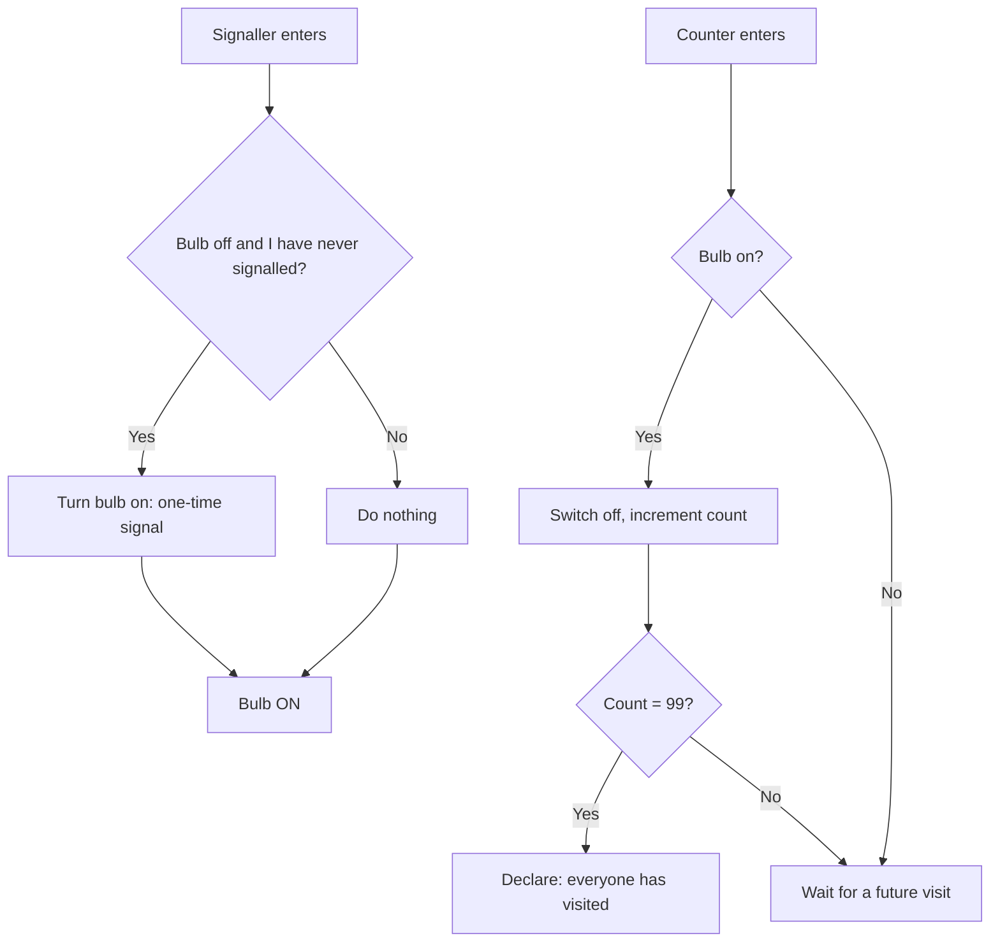
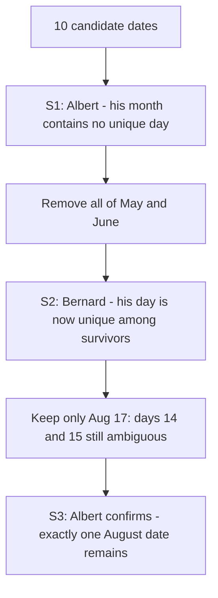

# Logic & Deduction Puzzles

## Overview

Deduction puzzles hand you a system — prisoners, hats, liars, chameleons, a bridge at night — and ask what must be true given what the rules make observable. They appear as onsite warm-ups at Google, Microsoft, and product companies, and in the HR-plus-logic rounds common across Indian placement drives. The recurring tools are an invariant (a quantity that never changes), an elimination grid (strike out candidates statement by statement), and a protocol design (a rule everyone follows that extracts information over time). This page works the eight canonical puzzles stepwise, with the arithmetic shown rather than asserted; the framing and difficulty legend live in [the section index](./README.md), and the measurement canon is the sibling page [Classic Measurement](./classic-measurement.md).

## 100 Prisoners and the Light Bulb

### The Naive Approaches and Why They Fail

One hundred prisoners are taken one at a time, uniformly at random with replacement, into a room containing a single bulb they may switch on or off. Anyone may declare "everyone has visited" — correct means freedom for all, wrong means death for all. Random guessing fails catastrophically, and "count your own visits" fails because visits repeat: the expected gap between distinct new visitors grows as the pool empties. Any working protocol must convert a random stream of visits into a reliable *count* of distinct visitors, using one bit of memory — the bulb.

### The Token Counter Protocol

Appoint one prisoner as the **counter**; the other 99 are *signallers*. The rules:

- A **signaller** who enters and finds the bulb **off**, and who has never yet signalled, turns it **on** — exactly once in their life.
- A **signaller** who has already signalled (or finds the bulb on) does nothing.
- The **counter** who enters and finds the bulb **on** switches it **off** and increments their count.
- When the count reaches 99, the counter declares.

The bulb is a one-bit mailbox: each signal corresponds to at least one *new* visitor, because each signaller sends exactly one signal ever. When 99 signals have been counted, all 99 signallers have provably entered the room.

### Expected Days Math

Between the k-th and (k+1)-th distinct signal, two waits alternate: waiting for a *new* signaller to enter while the bulb is off, then waiting for the *counter* to arrive and log it. With k signals already banked, a random daily entrant is a fresh signaller with probability (99 − k)/100, and is the counter with probability 1/100. The expected total is therefore:

\\[ E \\approx \\sum_{k=0}^{98} \\left( \\frac{100}{99-k} + 100 \\right) = 100 H_{99} + 99 \\times 100 \\approx 518 + 9900 \\approx 10418 \\text{ days} \\approx 28.5 \\text{ years} \\]

The harmonic sum contributes only ~518 days; the dominant cost is the 99 counter-visits at ~100 days each, which scales as n² for n prisoners. That asymmetry is why optimized variants (two or more counters, or letting a signaller "pass" the token) shave the harmonic term but leave the quadratic core intact.

### Variants the Interviewer Adds

If the bulb's initial state is unknown, the counter counts to 99 *plus* treats a first-seen-on bulb carefully — the standard fix is to have the counter count 99 signals but ignore nothing; instead every signaller signals exactly once and the counter additionally flips an initially-on bulb off without counting, accepting a small risk, or the group pre-agrees that day 0's state is on with probability ½ and the counter targets 100 with adjusted rules. State the issue and one fix explicitly — interviewers want to see that you noticed the initial-condition bug, not necessarily that you memorized the patch. If prisoners may discuss strategy beforehand but not communicate after, the protocol above is already the full answer.

## Hat Puzzles and Parity Arguments

### The Line-Up (10 Prisoners, Black/White Hats)

Ten prisoners stand in a line; each wears a black or white hat, sees all hats **in front**, and hears each guess behind them. From the back forward, each must guess their own hat color; wrong guesses are fatal. With no strategy, expected deaths ≈ 5; with the parity strategy, **at most 1** (the first speaker, a coin flip).

### The Parity Trick, Worked

The last prisoner announces the *parity* of white hats they see: "white" means an odd number of white hats ahead, "black" means even. They may still die (50/50), but every prisoner ahead now knows the parity of the total, sees the hats in front, and heard the colors announced behind — so their own color is forced by subtraction. Trace a concrete 10-hat run (W = white, B = black), where the true sequence from back to front is B, W, B, B, W, B, W, W, B, W:

| Position (from back) | True hat | Whites seen ahead | Accounting | Announces | Correct? |
|---|---|---|---|---|---|
| 1 (last) | B | 5 → odd | Broadcasts the parity bit: "an odd number of whites is ahead" | "white" = odd | own hat unknown — the one 50/50 death |
| 2 | W | 4 → even | Odd promised among 2–10; sees even among 3–10 → own must be W | "white" | ✓ |
| 3 | B | 4 → even | Heard p2 = white: odd − 1 = even needed among 3–10; sees 4 → own B | "black" | ✓ |
| 4 | B | 4 → even | Heard behind: one white (p2); even needed among 4–10; sees 4 → own B | "black" | ✓ |
| 5 | W | 3 → odd | Heard behind: one white; even needed among 5–10; sees 3 → own W | "white" | ✓ |

Each row is the same subtraction: (parity promised by speaker 1) minus (whites heard behind) minus (whites seen ahead) = own color. The table continues identically to the front, and all nine prisoners ahead of the speaker survive deterministically. The re-usable principle: **one volunteer spends a coin flip to broadcast a global parity bit; everyone else converts it to certainty**.

### The 3-Prisoner Version

Three prisoners know the supply is 3 black and 2 white hats; each sees the others' hats and must guess or pass, with at least one non-wrong guess required. The one who sees two same-colored hats knows their own is the opposite color and guesses; if everyone sees a mixed pair, at least one reasons "nobody confident means the supply constraint bites" and infers from the passes. The lesson interviewers probe: **passes are information** — a well-designed protocol extracts signal from what others do *not* say, which is exactly the mechanism the birthday elimination grid below formalizes.

## Truth-Tellers and Liars

### The One-Question Protocol (Embedded Question Lemma)

You face two doors (one safe) and two guardians: one always truthful, one always false — you don't know who is who. Ask either one: **"If I asked the other guardian which door is safe, what would they say?"** Then take the *opposite* door. The liar, describing the truth-teller's answer, falsifies it; the truth-teller, describing the liar's answer, also falsifies it — both name the unsafe door. One question, identity-independent, correct by construction.

The general lemma: ask **"If I asked you Q, would you say yes?"** Both types answer as a truth-teller would, because the liar lies about their own lying — a double negation. This embedded-question form is the tool for every one-question variant ("make both types answer truthfully") and is the entry point to the harder Boolos-style puzzles with a random-answerer, which are rarely demanded in placement loops but make a strong closing remark.

### The Two-Case Truth Table

| Guardian type | Honest answer to Q | Answer to "Would you say yes to Q?" |
|---|---|---|
| Truth-teller | A | A (no lie to distort) |
| Liar | A, but would say **not A** | Lies about saying not A → reports **A** |

Both rows report A — the *honest* answer. Note the asymmetric elegance: you never need to know which type you addressed, because the construction makes identity irrelevant. When the interviewer asks "what if the liar is *malicious* rather than compelled?" the honest reply is that the classic model assumes compelled lying; a free adversary needs a different (probabilistic) protocol — flagging the model boundary is itself a plus.

## Chameleons: An Invariant in mod 3

### Rules and Goal

A colony holds 13 red, 15 green, and 17 blue chameleons. When two chameleons of *different* colors meet, both turn the third color. Can the entire colony become one color? Meeting rule in state \\( (r, g, b) \\): a red-green meeting gives `\\( (r-1,\\; g-1,\\; b+2) \\)`, and similarly for the other pairs.

### The Invariant

Compute what happens to pairwise differences: \\( (r-1) - (g-1) = r - g \\), so red-green differences never change; and for the others, subtracting 1 from one count while adding 2 to another shifts a difference by `\\( \\pm 3 \\)`, which is 0 modulo 3:

\\[ (r - g) \\bmod 3, \\quad (g - b) \\bmod 3, \\quad (b - r) \\bmod 3 \\quad \\text{are all invariants} \\]

Initially \\( 15 - 13 = 2 \\), \\( 17 - 15 = 2 \\), \\( 13 - 17 = -4 \\): the residues are (2, 2, 2) — wait, check each: \\( 2 \\bmod 3 = 2 \\), \\( 2 \\bmod 3 = 2 \\), \\( -4 \\bmod 3 = 2 \\). All three differences are ≡ 2 (mod 3). Monochromatic means two counts are zero and the third is 45, giving differences that are ≡ 0 (mod 3) — unreachable from residue 2. **Answer: impossible**, and the proof is two lines of modular arithmetic from [Math Foundations](../../dsa/chapters/ch02-math-foundations.md).

### When Is It Solvable?

The colony can go monochromatic iff some two of the three counts are congruent modulo 3 — then a meeting sequence can drive the third to zero and the congruent pair to equal values, and finally collapse them. For example, starting from (6, 6, 9)? differences 0, −3, 3 ≡ 0 (mod 3) → solvable. Give the criterion, test the given numbers against it, and conclude — that three-line structure is the complete interview answer, and the same mod-arithmetic invariant reappears in hashing and cycle-detection problems.

## Camel and 3000 Bananas

### The Leap Economics

A camel carries at most 1000 bananas and eats 1 banana per kilometre walked (forward *or* back). Move 3000 bananas across 1000 km. The economics: bananas per km depends on how many loads the stock requires — 3000 bananas need 3 loads, so advancing the whole stock 1 km costs 3 forward trips + 2 returns = **5 bananas/km**; 2000 bananas cost 2 + 1 = **3/km**; up to 1000 bananas cost **1/km**. Optimal play: reduce the stock through the cost tiers as late as possible — never carry a third load further than necessary.

### The Stage Table

| Stage | Stock | Loads | Cost/km | Distance travelled | Bananas at end |
|---|---|---|---|---|---|
| 1 | 3000 → 2000 | 3 | 5 | 1000 / 5 = 200 km | 2000 |
| 2 | 2000 → 1000 | 2 | 3 | 1000 / 3 ≈ 333⅓ km | 1000 |
| 3 | 1000 → destination | 1 | 1 | remaining 1000 − 533⅓ = 466⅔ km | 1000 − 466⅔ = **533⅓** |

The camel arrives with 533⅓ bananas (equivalently, 533 whole bananas and a well-fed camel). Two checks make the answer credible: the cost tiers are forced by the carry limit, and every km below 200 km travelled at 3/km instead of 5/km would leave more than 1000 bananas stranded — violating the tier boundary. When asked "is that optimal?", the answer is that any schedule is a sequence of tier costs, and matching each tier to its maximal distance is an exchange argument: swapping any 1 km between tiers never reduces total cost.

### What the Interviewer Tests

Whether you set up the per-km accounting (loads × 2 − 1 crossings) before computing anything, and whether you handle the fractional ⅓ km without flinching. A quick sanity narrative — "three tiers, 200 + 333⅓ + 466⅔ = 1000 km" — shows command of the whole structure.

## Bridge Crossing in 17 Minutes

### The Pairing Insight

Four people cross a rickety bridge at night with one torch: 1, 2, 5, and 10 minutes each; at most two cross at a time, moving at the slower one's pace; the torch must travel with every crossing. The greedy "fastest escorts everyone" plan costs 19 minutes (1+2 shuttle each way); the optimal **17** comes from sending the two slowest *together*, so their times overlap instead of summing.

### The Crossing Table

| Crossing | Who crosses | Time | Torch side after |
|---|---|---|---|
| 1 → | 1 and 2 | 2 | right (1, 2 there) |
| ← | 1 returns | 1 | left (5, 10 there) |
| 2 → | 5 and 10 | 10 | right |
| ← | 2 returns | 2 | left |
| 3 → | 1 and 2 | 2 | right — all across |

Total: 2 + 1 + 10 + 2 + 2 = **17 minutes**. The two slowest never walk separately, and the two fastest absorb all torch-ferrying duty.

### The 4-State Search View

Model a state as (set of people on the left, torch side); edges are legal crossings weighted by the slower walker. The graph has few reachable states for 4 people, and a shortest-path search (Dijkstra on a tiny graph, or careful enumeration) certifies 17 as minimal — the same state-space discipline as the water-jug puzzle. A clean interviewer sentence: "the naive shuttle double-charges each slow walker; pairing 5 and 10 pays 10 once, and the 19-vs-17 gap is exactly the 5 + 10 overlap saved."

## The Birthday Puzzle (Elimination Grid)

### The Setup and Statements

Albert is told the **month**, Bernard the **day**, of a birthday chosen from:

| Month | Days |
|---|---|
| May | 15, 16, 19 |
| June | 17, 18 |
| July | 14, 15 |
| August | 14, 15, 17 |

Albert: *"I don't know the birthday, and I know Bernard doesn't know either."* Bernard: *"At first I didn't know, but now I do."* Albert: *"Then I also know."* Find the date. Day-counts across all ten dates: 14 → Jul, Aug; 15 → May, Jul, Aug; 16 → May only; 17 → Jun, Aug; 18 → Jun only; 19 → May only. (The classic variant with July 16 instead of July 15 resolves to July 16 by the identical grid — the *method* transfers, the numbers don't.)

### The Elimination Grid

| Date | After S1: Albert's month has no unique day | After S2: Bernard's day unique among S1 survivors | Verdict |
|---|---|---|---|
| May 15 | ✗ (May contains 16 and 19) | — | out |
| May 16 | ✗ (day 16 is unique → Bernard might know) | — | out |
| May 19 | ✗ (day 19 is unique) | — | out |
| June 17 | ✗ (June contains 18) | — | out |
| June 18 | ✗ (day 18 is unique) | — | out |
| July 14 | ✓ (14 shared with Aug) | ✗ (day 14 still shared with Aug 14) | out |
| July 15 | ✓ (15 shared) | ✗ (day 15 shared with Aug 15) | out |
| Aug 14 | ✓ | ✗ (day 14 shared) | out |
| Aug 15 | ✓ | ✗ (day 15 shared) | out |
| Aug 17 | ✓ (17 shared with Jun 17) | ✓ (June is gone → 17 now unique) | **answer** |

Statement 1 eliminates months containing a unique day (May via 16/19, June via 18) — Albert can assert it only because *no* day in his month is unique. Statement 2 keeps only dates whose day is now single-valued; among survivors {Jul 14, Jul 15, Aug 14, Aug 15, Aug 17}, only day 17 qualifies. Statement 3 confirms August holds exactly one survivor. **Answer: August 17**, and the grid *is* the justification — each row cites the statement that killed it.

### Elimination Flow

### What the Interviewer Tests

Whether you treat each statement as a *public announcement* that eliminates dates from everyone's candidate set — the epistemic-elimination discipline behind constraint propagation in [backtracking search](../../dsa/chapters/ch09-backtracking.md). The follow-up "what changes if Albert speaks first but only says 'I don't know'?" (answer: almost nothing is eliminated; the grid barely moves) checks that you applied, rather than performed, the ritual.

## The Average-Children Paradox

### Sample-Space Accounting

"I have two children. At least one is a boy. What is the probability both are boys?" Enumerate the sample space as ordered pairs — (B,B), (B,G), (G,B), (G,G) — each with probability ¼:

| Statement | Conditioned sample space | P(two boys) |
|---|---|---|
| "At least one is a boy" | BB, BG, GB | \\( \\frac{1/4}{3/4} = \\frac{1}{3} \\) |
| "The older child is a boy" | BB, BG | ½ |
| "I randomly met one child; he is a boy" | BB, BG, GB weighted — meeting picks a child uniformly | ½ |

The third row is the trap: *how* you learned "there is a boy" changes the conditioning event. Meeting a random child samples a child (probability-weighted), while a parent's blanket statement filters families. The one-line derivation \\( P(BB \\mid \\text{at least one boy}) = \\frac{P(BB)}{P(\\text{at least one boy})} = \\frac{1/4}{3/4} = \\frac{1}{3} \\) is the entire content — most interview damage comes from mixing the three rows, not from any hard math.

### Why Intuition Drifts

People map "at least one boy" onto a single named child, which silently switches row 1 into row 2. In interviews, restate the condition verbatim, write the four pairs, and strike the ones excluded — the same strike-out discipline as the birthday grid. The deeper takeaway generalizes to all of [Probability Puzzles](./probability-puzzles.md): conditional probability is about the *information channel*, and two channels reporting the same English sentence can carry different information.

## Interview Questions

1. **In the 100-prisoners light-bulb puzzle, why must exactly one person count?** The bulb is one bit, so the count must live in one person's memory; if two prisoners both "collect" signals, a signalled-but-unlogged visit can be double-counted or lost, and the termination proof collapses. The single-counter protocol makes every ON→OFF transition correspond to a distinct new visitor, so count = 99 implies all visited. Expected time ≈ 10,418 days ≈ 28.5 years, dominated by the 99 counter visits at ~100 days each.
2. **Why does the hat-parity strategy save 9 of 10 prisoners?** The last speaker broadcasts one bit — the parity of white hats ahead — at the cost of a 50/50 guess. Every prisoner ahead then has: promised parity, seen hats ahead, heard hats behind, so their own color is a forced subtraction. It converts one global bit into n−1 certainties; the first speaker is the only gamble.
3. **"If I asked you whether door A is safe, would you say yes?" — why does this neutralize a liar?** The liar's honest answer to the *inner* question is the opposite of the truth, and their answer to the *outer* question is a lie about that opposite — a double negation that restores the truth. The truth-teller adds no distortion, so both types return the truthful answer. This embedded-question lemma solves every one-question guardian variant.
4. **Why can't the 13/15/17 chameleons ever become monochromatic?** Pairwise count differences are invariant modulo 3, since each meeting shifts differences by 0 or ±3. Initially all pairwise differences are ≡ 2 (mod 3); a monochromatic colony has differences ≡ 0 (mod 3). Different residues are unreachable — a two-line invariant proof, which is the entire expected answer.
5. **In the banana transport, why is it optimal to switch tiers exactly at 200 km and 533⅓ km?** Cost per km is 5, 3, then 1 as the stock drops through 3000, 2000, 1000; each tier should run exactly until the next tier activates, since travelling a km in a more expensive tier than necessary wastes bananas with no offsetting benefit. Hence 200 km at 5/km, 333⅓ km at 3/km, and the remaining 466⅔ km at 1/km, arriving with 533⅓ bananas. The exchange argument ("swap a km between tiers, never better") is the optimality proof.
6. **What generalizes from the birthday elimination grid?** Every public statement is a filter on the joint candidate set; solving means iterating statement → strike-out → new inference. This is constraint propagation: the same loop that drives Sudoku, the >=3 cross-checking in deduction rounds, and propagation in backtracking search. Naming that connection is worth more to the interviewer than the date itself.

## Key Takeaways

- One bit (a bulb) suffices to count 99 random visitors — protocol design beats brute force; expect ~28.5 years, dominated by counter visits.
- Hat puzzles: sacrifice one coin flip to broadcast a parity bit; everyone ahead deduces with certainty.
- The embedded question ("if I asked *you* Q…") makes truth-tellers and liars agree — a double-negation lemma.
- Chameleons: pairwise differences mod 3 are invariant; check residues before simulating anything.
- Banana transport: cost per km = (2 × loads − 1); run each tier to its exact boundary → 200 + 333⅓ + 466⅔ km, 533⅓ delivered.
- Bridge crossing: pair the two slowest (17) rather than shuttling the fastest (19) — overlap slow times.
- Elimination grids turn public statements into strike-outs; the birthday answer (August 17) falls out row by row.
- Children paradoxes: "at least one" → ⅓, "the older one" → ½, "a randomly met child" → ½ — the information channel decides.

## References

- Peter Winkler, *Mathematical Puzzles: A Connoisseur's Collection*, A K Peters, 2004 — the light-bulb, chameleon, and transport puzzles appear in the "Protocols" and "Invariants" chapters.
- Raymond Smullyan, *What Is the Name of This Book?*, Prentice-Hall, 1978 — the foundational treatment of truth-teller/liar and knights-and-knaves protocols.
- Martin Gardner, *aha! Insight*, W H Freeman, 1978 — popular source for the bridge-crossing and two-children families.
- [Prisoners and hat puzzle — Wikipedia](https://en.wikipedia.org/wiki/Prisoners_and_hat_puzzle) — the hat-parity family and its multi-color extensions.
- [Knights and knaves — Wikipedia](https://en.wikipedia.org/wiki/Knights_and_knaves) — the formal model behind the one-question protocol.
- [Bridge and torch problem — Wikipedia](https://en.wikipedia.org/wiki/Bridge_and_torch_problem) — the 17-minute solution and its optimality proof.
- [Cheryl's Birthday — Wikipedia](https://en.wikipedia.org/wiki/Cheryl%27s_Birthday) — the canonical elimination-grid puzzle this page's variant is built from.

## Cross-References

- [Math Foundations](../../dsa/chapters/ch02-math-foundations.md) — modular arithmetic that powers the chameleon invariant.
- [Backtracking](../../dsa/chapters/ch09-backtracking.md) — constraint propagation and search, the algorithmic form of elimination grids.
- [Logical Reasoning (Aptitude)](../../aptitude/logical-reasoning.md) — timed written-test drills in the same deduction style.
- [Google](../companies/google.md) — loops that frequently open with protocol and deduction puzzles.
- [Classic Measurement](./classic-measurement.md) — the weighing/timing/transport canon, sibling page.
- [Probability Puzzles](./probability-puzzles.md) — where the children paradox continues into stopping-rule traps.
