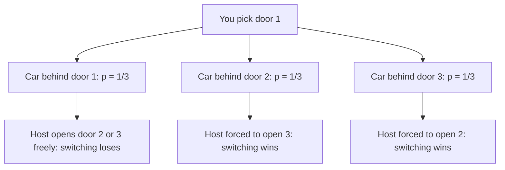

# Probability Puzzles

## Overview

Probability puzzles are the expected-value and conditional-probability canon: the birthday paradox, Monty Hall, waiting-time coin games, and the 100-prisoners protocol. They dominate quant and analytics screens, appear as MCQs in OA papers, and surface as warm-ups at Google, Amazon data roles, and fintech loops. The recurring tools are exact sample-space accounting, conditional probability computed on a tree, expected value via states (Markov bookkeeping), and the discipline to distrust the stopping rule. Every puzzle below includes the derivation and a note on what the interviewer is really testing; the section framework and difficulty legend are in [the section index](./README.md), and the deduction canon is the sibling page [Logic & Deduction](./logic-deduction.md).

## The Birthday Paradox

### Derivation

With `n` people and 365 equally likely birthdays, compute the complement — all birthdays distinct. The first person has any birthday; the second must avoid one day, the third must avoid two, and so on:

\\[ P(\\text{no shared birthday}) = \\frac{365}{365} \\times \\frac{364}{365} \\times \\cdots \\times \\frac{365-n+1}{365} = \\prod_{i=0}^{n-1} \\frac{365-i}{365} \\]

\\[ P(\\text{at least one shared birthday}) = 1 - \\prod_{i=0}^{n-1} \\frac{365-i}{365} \\]

The paradox is that the product decays fast: pairs grow as `n(n−1)/2`, so collisions arrive near `n ≈ 23`, not near 183.

| n | P(shared birthday) |
|---|---|
| 10 | ≈ 11.7% |
| 20 | ≈ 41.1% |
| 22 | ≈ 47.6% |
| 23 | ≈ 50.7% — the famous crossover |
| 30 | ≈ 70.6% |
| 50 | ≈ 97.0% |
| 70 | ≈ 99.9% |

The handy interview approximation is \\( P \\approx 1 - e^{-n(n-1)/730} \\), from replacing each factor by \\( e^{-i/365} \\); setting the exponent to −1 gives \\( n(n-1) \\approx 730 \\), hence n = 23 within rounding. Useful follow-up numbers: 41 people for 90%, and 366 people for certainty (pigeonhole) — quote both and the interviewer knows the derivation, not just the meme, is yours.

### What the Interviewer Tests

Whether you reach for the complement immediately (direct union counting is a mess) and whether you can explain *why* 23 rather than quote it. The product-to-exponential step is the differentiator; do it aloud.

## Monty Hall

### The Full Conditional-Probability Tree

Three doors, one car, two goats. You pick door 1; the host — who knows where the car is — opens a goat door among the other two and offers a switch. The host's *constraint* (he must avoid the car and your door) is what breaks the intuition that "two doors, 50/50".



| Car location (prior) | Host opens | P(host opens that door) | Switch → | Stay → |
|---|---|---|---|---|
| Door 1 (1/3) | 2 or 3 | 1/6 each | goat | car |
| Door 2 (1/3) | 3 | 1/3 (forced) | **car** | goat |
| Door 3 (1/3) | 2 | 1/3 (forced) | **car** | goat |

Summing over the observed event — say the host opened door 3: \\( P(\\text{win by switch} \\mid \\text{host opened 3}) = \\frac{1/3}{1/6 + 1/3} = \\frac{2}{3} \\). The switch wins 2/3, staying wins 1/3. The cleanest verbal proof: your original pick is right with probability 1/3, and the host's reveal transfers *all* the remaining 2/3 onto the single unopened alternative.

### The Simulation Argument

When intuition fights back, ten lines of Python end the debate — and proposing the simulation in the interview is itself a strong move:

```python
import random

def simulate(switch: bool, trials: int = 100_000) -> float:
    wins = 0
    for _ in range(trials):
        car = random.randrange(3)
        pick = random.randrange(3)
        opened = next(d for d in range(3) if d != pick and d != car)
        if switch:
            pick = next(d for d in range(3) if d != pick and d != opened)
        wins += pick == car
    return wins / trials

print(simulate(switch=True))   # ≈ 0.667
print(simulate(switch=False))  # ≈ 0.333
```

### What the Interviewer Tests

Whether you notice that the host's knowledge and constraint are load-bearing: if the host opens a random other door that *happens* to be a goat, switching is 50/50. The follow-up "make me believe it" is an invitation to produce the tree or the simulation — do one of them explicitly.

## Three Ants on a Triangle

### Symmetry Counting

Three ants sit at the corners of an equilateral triangle; each independently picks a direction along an edge, with all \\( 2^3 = 8 \\) choices equally likely. A collision happens exactly when two ants move toward each other on a shared edge. Non-collision requires global agreement: **all clockwise or all counterclockwise** — 2 favorable outcomes out of 8:

\\[ P(\\text{no collision}) = \\frac{2}{8} = \\frac{1}{4} \\]

The interview extension generalizes to n ants on an n-gon: still all-same-direction, so \\( P = 2/2^n = 2^{1-n} \\) — for 4 ants, 1/8. Note the efficiency gain: instead of enumerating collision configurations (messy), enumerate the *favorable* ones (two) and use the complement. That inversion habit is the actual lesson, and it is the same complement-first move the birthday paradox uses.

### What the Interviewer Tests

Whether the n-ant generalization arrives without prompting, and whether you can state why directions must all agree (any disagreement produces exactly one head-to-head pair somewhere on the cycle).

## Random Point in a Circle

### Expected Distance from the Center

Pick a point uniformly in a disk of radius R; expected distance from the center? The trap is answering R/2 by linear intuition — distance is not uniform over the disk. The area element at radius r is \\( 2\\pi r \\, dr \\), so the density of the radial coordinate is \\( f(r) = 2r/R^2 \\), which *grows* with r:

\\[ E[r] = \\int_0^R r \\cdot \\frac{2r}{R^2} \\, dr = \\frac{2}{R^2} \\cdot \\frac{R^3}{3} = \\frac{2R}{3} \\]

The answer \\( 2R/3 \\) is above the naive R/2 precisely because outer rings hold more area. State the density before integrating — interviewers watch for the moment you say "the radius is not uniform; area scales like r²".

### Variants Worth Pre-Committing

Expected distance between **two** random points in the disk is \\( 128R/(45\\pi) \\approx 0.905R \\) — a harder integral usually quoted, not derived, unless the role is quant. Expected distance between two random points on the *circumference* is \\( 4R/\\pi \\). The umbrella principle: write the joint distribution, integrate the distance function, and let symmetry kill one variable first. For placement interviews the disk-from-center derivation plus quoting the other two is a complete score.

### What the Interviewer Tests

Whether you declare the non-uniform radial density unprompted. Jumping to \\( \\int r/R \\, dr = R/2 \\) is the single most common wrong answer in this family.

## Expected Coin Flips: HHT vs HTH

### The Markov State Method

How many fair-coin flips until the pattern HHT appears? Until HTH? Both are length-3, yet their expected waiting times differ — the classic demonstration that waiting time depends on a pattern's *self-overlap*. Track states named by the longest suffix of what you have seen that is a prefix of the target pattern.

**HHT** — states: ∅, H, HH, HT:

| State | Flip H → | Flip T → |
|---|---|---|
| ∅ | H | ∅ |
| H | HH | HT |
| HH | HH (H still a suffix) | **done** |
| HT | H — HHT not matched; the longest matching suffix is just H | ∅ |

**HTH** — states: ∅, H, HT:

| State | Flip H → | Flip T → |
|---|---|---|
| ∅ | H | ∅ |
| H | H (HH ends in H) | HT |
| HT | **done** | ∅ |

Solving the linear equations for HHT, with `a, b, c, d` the expected remaining flips from ∅, H, HH, HT:

\\[ c = 1 + \\tfrac{1}{2}c + 0 \\Rightarrow c = 2; \\qquad b = 1 + \\tfrac{1}{2}c + \\tfrac{1}{2}d; \\qquad d = 1 + \\tfrac{1}{2}b + \\tfrac{1}{2}a; \\qquad a = 1 + \\tfrac{1}{2}b + \\tfrac{1}{2}a \\]

Substituting gives b = 6 and **E[HHT] = a = 8**. For HTH, with states ∅, H, HT: `d = 1 + a/2`, `b = 1 + b/2 + d/2`, `a = 1 + b/2 + a/2`, giving **E[HTH] = 10**. Same pattern length, two extra expected flips — because HTH self-overlaps (prefix H = suffix H), progress can be *partially* reset.

A one-line simulation to check both numbers in an interview debrief:

```python
import random

def waiting_time(pattern: str) -> float:
    trials, total = 100_000, 0
    for _ in range(trials):
        seen = ""
        while not seen.endswith(pattern):
            seen += random.choice("HT")
        total += len(seen)
    return total / trials

print(waiting_time("HHT"))  # ≈ 8
print(waiting_time("HTH"))  # ≈ 10
```

### What the Interviewer Tests

Whether you define states as longest-matching-suffix (candidates who track full strings drown in cases) and whether the overlap explanation lands: HHT has no self-overlap so it waits 2³ = 8; HTH overlaps itself so it waits 2³ + 2¹ = 10 — Conway's leading-number rule, which you can name as a closing flourish.

## 100 Prisoners and Their Own Numbers

### The Random Baseline

A dictator places numbers 1–100 in 100 boxes, one each, in secret random order. Each of 100 prisoners must find their own number, opening up to 50 boxes; they may strategize beforehand but not communicate after. All live only if **every** prisoner succeeds. Random box choices give each prisoner a 1/2 chance and independence-ish, so success ≈ \\( (1/2)^{100} \\approx 8 \\times 10^{-31} \\) — effectively impossible. Any strategy that treats boxes as independent hits this wall, because each prisoner gets at most 50 of 100 boxes: a 1/2 event per head.

### The Cycle-Following Strategy

Treat the box contents as a permutation π: box i contains π(i). The strategy: prisoner k starts at box k, then follows the chain — open box k, read number j, open box j, and so on. Prisoner k succeeds iff k lies on a cycle of length ≤ 50, because following the cycle from k returns to k within the cycle's length. The whole group succeeds iff the permutation has **no cycle longer than 50**:

\\[ P(\\text{success}) = 1 - \\sum_{k=51}^{100} \\frac{1}{k} \\approx 1 - (\\ln 100 - \\ln 50) \\approx 1 - \\ln 2 \\approx 0.31 \\]

The exact value ≈ **31.18%**: the probability the longest cycle exceeds 50 is \\( \\sum_{k=51}^{100} 1/k \\) (for a random permutation, P(cycle of length k containing a given element) = 1/k, and cycles > 50 are unique). Random guessing's 10⁻³⁰ becomes 31% — one of the most striking free lunches in the canon. Confirm by simulation:

```python
import random

def one_round(n: int = 100) -> bool:
    perm = list(range(n))
    random.shuffle(perm)
    for start in range(n):
        pos, steps = start, 0
        while True:
            pos = perm[pos]
            steps += 1
            if pos == start:
                break
        if steps > 50:
            return False
    return True

print(sum(one_round() for _ in range(10_000)) / 10_000)  # ≈ 0.312
```

### What the Interviewer Tests

Whether you see the permutation structure at all — candidates who never model the boxes as a mapping cannot invent the strategy even with hints. Second: whether you can explain *why* cycles > 50 are mutually exclusive (they would need > 100 elements combined), which is what turns the sum into a clean bound.

## Boys, Girls, and the Stopping-Rule Trap

### The Variant Table

A family has children; probabilities per birth are ½/½, sexes independent. The canonical variants and their answers:

| Statement | Sample space / argument | Answer |
|---|---|---|
| Two children, at least one girl — P(two girls)? | GG, GB, BG | 1/3 |
| Two children, the older is a girl — P(two girls)? | GG, GB | 1/2 |
| Two children, one is a girl with a specific name — P(two girls)? | Naming is rarer than "at least one girl", so conditioning is weaker | just under 1/2 |
| Keep having children until the first girl — expected boys per family? | Geometric: E = p/q = 1 | 1 boy, 2 children |
| That family's children: P(next is a boy)? | Coins have no memory | 1/2 |

(The named-girl row is the exotic one — mention it only if the interviewer is enjoying themselves; the fraction sits just under 1/2 because two girls cannot both hold the one name.)

### The Stopping-Rule Trap

"Parents stop when they get a girl — does that skew the population's sex ratio?" It does not: every birth is an independent ½ event, and optional stopping cannot change the martingale — expected boys per family is 1, expected girls is 1, and the population ratio stays 1:1. The trap confuses *the composition of a single stopped family* (which is girl-heavy by construction) with *the population aggregate* (which is not). The related per-family subtlety: the expected fraction of boys within one family is not ½ — ratios of expectations are not expectations of ratios — and spotting that distinction is the depth signal interviewers listen for. This page's variants pair with the two-children accounting on the [Logic & Deduction](./logic-deduction.md) page; the framework-level lesson is that sampling procedure is part of the probability model.

### What the Interviewer Tests

Whether you ask *how the information was obtained* before computing — the entire family of paradoxes here is a conditioning-channel test, not a computation test.

## Three Switches, One Visit

### The Heat Escape

Three switches outside a room; one controls a (classic incandescent) bulb inside; you may open the door **once**. Flip switch 1 **on and wait ten minutes**, switch it **off**, flip switch 2 **on**, and enter:

| Bulb state inside | Controller |
|---|---|
| Lit | switch 2 |
| Dark but warm | switch 1 |
| Dark and cold | switch 3 |

The trick converts a one-bit observation (on/off) into two bits (on/off × hot/cold) by spending time as a sensor. State the physics assumption explicitly — incandescent bulbs retain heat for minutes — and note the modern caveat: LED bulbs stay cold, so the puzzle's premise is era-dependent, which is exactly the kind of model-boundary remark interviewers reward. Two-switch variants (door may be open) solve by process of elimination with no physics needed.

### What the Interviewer Tests

Resourcefulness under a hard query budget: the question is engineered so that pure switching logic is information-starved, and the candidate must import outside state (heat) into the model. Say "the observation channel has one bit; I need a second sensor" — that sentence is the answer.

## Interview Questions

1. **Why do only 23 people give a 50% shared birthday?** Because the relevant quantity is the number of *pairs*, n(n−1)/2, which hits ~253 at n = 23; with each pair colliding at probability 1/365, the expected number of colliding pairs is ~0.69 and the no-collision product 365!/343!·365⁻²³ ≈ 0.493. The complement-plus-product derivation, or the e^(−n(n−1)/730) approximation, both land on 23. Interviewers are checking the complement reflex, not the memorized constant.
2. **Defend switching doors in Monty Hall in one breath.** My initial pick wins with probability 1/3; the host, constrained to open a goat door, always opens a door he *knows* is a loser, which concentrates the residual 2/3 on the single remaining alternative. Equivalently, the host's forced move is information about where the car is not, and that information transfers to the switch option. A 10-line simulation returning 0.667 settles any residual doubt.
3. **Why do HHT and HTH have different expected waiting times despite equal length?** Waiting time depends on self-overlap: HTH's prefix H equals its suffix H, so a failed attempt can leave partial progress, but the reset costs extra expected flips — Conway's rule gives 2³ + 2¹ = 10 versus HHT's non-overlapping 2³ = 8. The Markov state table derives both numbers exactly. Same length, different structure, different expectation.
4. **How does the 100-prisoners cycle strategy reach 31% when random search is 10⁻³⁰?** Model the boxes as a random permutation; prisoner k following the chain from box k finds k exactly when k's cycle length is ≤ 50. All prisoners succeed iff no cycle exceeds 50, and P(a cycle of length k > 50 exists) = 1/k summed over k = 51..100 ≈ ln 2 ≈ 0.69, so success ≈ 0.31. The strategy works because all prisoners share the permutation — their fates were never independent.
5. **Does the "stop at the first girl" rule change the sex ratio?** No — each birth is an independent ½ draw, and optional stopping cannot bias a fair coin; expected boys and girls per family are both 1, so the population ratio stays 1:1. The rule reshapes *within-family* distributions, not aggregates. Distinguishing the two levels is the entire test.
6. **You may open the door once and there are three switches — what extra state can you exploit?** Heat: run switch 1 for ten minutes, turn it off, turn switch 2 on, then read the bulb's (light, temperature) pair — lit, warm-dark, cold-dark — which disambiguates all three. The one-bit observation channel becomes two bits by spending time. Note the incandescent assumption; LEDs break the puzzle.

## Key Takeaways

- Birthday paradox: complement + product formula; 23 people ≈ 50.7%; the approximation \\( 1 - e^{-n(n-1)/730} \\) explains why without a table.
- Monty Hall: the host's *constraint* is the whole argument; tree or simulation gives 2/3 for switching — and the random-host variant collapses it to 1/2.
- Ants on a polygon: complement counting gives \\( 2^{1-n} \\) — enumerate the favorable outcomes, not the failures.
- Random point in a disk: radial density is 2r/R², so E[distance] = 2R/3; never answer R/2.
- Coin patterns: expected wait = Σ 2^k over self-overlaps (Conway); HHT waits 8, HTH waits 10.
- 100 prisoners: boxes are a permutation; cycle-following succeeds iff no cycle > 50, with probability ≈ 31.18% versus (1/2)¹⁰⁰ for random search.
- Stopping rules cannot bias independent coin flips; they reshape family-level distributions, not population ratios.
- The 3-switch puzzle is an information-budget test: import heat as a second sensor bit.

## References

- William Feller, *An Introduction to Probability Theory and Its Applications*, Vol. 1, Wiley, 1968 — the classical treatment of waiting times and pattern matching for coin sequences.
- Peter Winkler, *Mathematical Puzzles: A Connoisseur's Collection*, A K Peters, 2004 — the prisoners-and-boxes protocol and expectation families.
- [Monty Hall problem — Wikipedia](https://en.wikipedia.org/wiki/Monty_Hall_problem) — conditional-probability trees, host-constraint variants, and the simulation argument.
- [Birthday problem — Wikipedia](https://en.wikipedia.org/wiki/Birthday_problem) — exact products, approximation tables, and generalizations.
- [100 prisoners problem — Wikipedia](https://en.wikipedia.org/wiki/100_prisoners_problem) — the cycle-following strategy and the 1 − ln 2 analysis.

## Cross-References

- [Probability DP](../../dsa/chapters/ch114-probability-dp.md) — the dynamic-programming view of state-based expectations like the coin-flip tables.
- [Probability & Statistics](../../mathematics/probability-statistics.md) — distributions, conditional probability, and expectation foundations used throughout.
- [Probability & Combinatorics (Aptitude)](../../aptitude/probability-combinatorics.md) — the written-test counting toolkit behind birthday-paradox arithmetic.
- [Coding Framework](../coding/framework.md) — how to narrate a puzzle solution when this material appears as an onsite warm-up.
- [Logic & Deduction](./logic-deduction.md) — the two-children paradox continues there with elimination-grid technique.
- [Amazon](../companies/amazon.md) — data-heavy loops where these expectation puzzles are routine screens.
