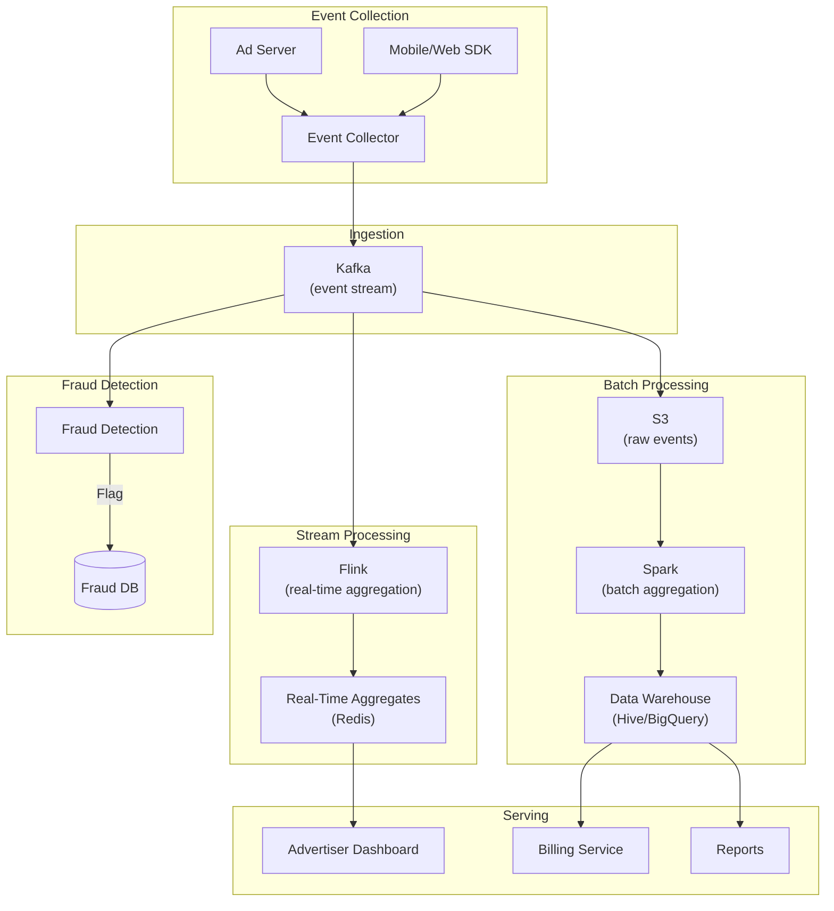
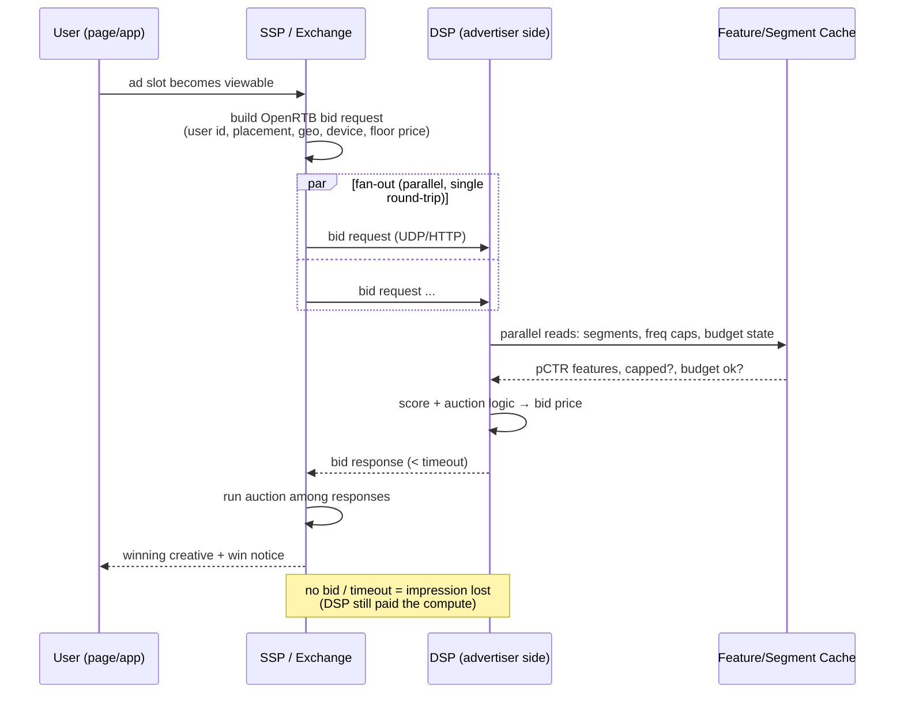
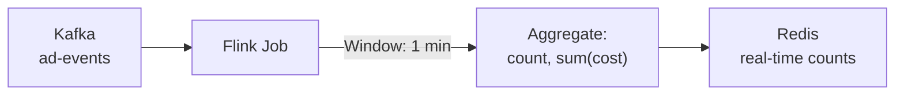
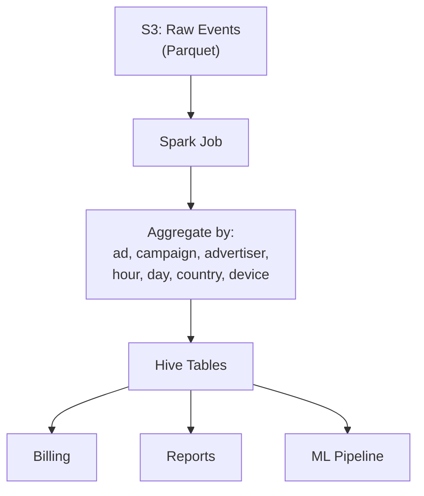
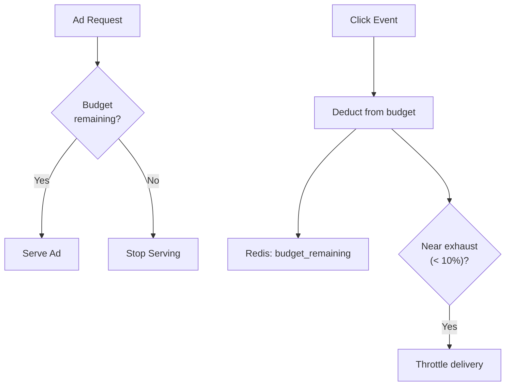
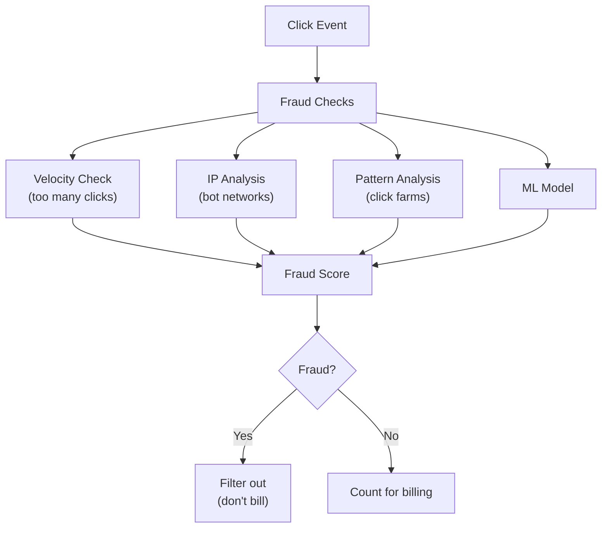

# Design Ad Click Aggregation

## Overview

Ad click aggregation systems track, count, and bill for ad impressions and clicks in real-time. Platforms like Google Ads and Facebook Ads process billions of ad events per day, aggregating them by campaign, advertiser, demographic, and time window. The core challenges are high write throughput, real-time aggregation, and accurate billing.

## Requirements

### Functional
- Track ad impressions (ad shown to user) and clicks (user clicks ad)
- Aggregate metrics by: campaign, advertiser, ad creative, time window (hourly, daily)
- Real-time dashboards for advertisers
- Billing based on click/impression counts
- Fraud detection (click fraud)
- Support for different billing models (CPC, CPM, CPA)

### Non-Functional
- **Scale**: 10+ billion ad events/day
- **Write throughput**: 100K+ events/second (peak: 500K+)
- **Latency**: Real-time aggregates available within 1 minute
- **Accuracy**: Billing data must be exactly correct (eventual consistency OK for dashboards)
- **Availability**: 99.99%

## Capacity Estimation

```
Events: 10 billion/day
Event size: ~200 bytes (ad_id, user_id, timestamp, event_type, ip, etc.)
Write rate: 10B / 86,400 ≈ 116K events/sec (peak: 500K/sec)
Daily storage: 10B × 200 bytes = 2 TB/day
Yearly storage: 2 TB × 365 = 730 TB
Unique campaigns: ~10 million
Unique advertisers: ~1 million
```

## Architecture



## Deep Dive: Event Schema

```json
{
    "event_id": "uuid",
    "event_type": "IMPRESSION|CLICK",
    "ad_id": "ad_123",
    "campaign_id": "camp_456",
    "advertiser_id": "adv_789",
    "user_id": "user_abc",
    "timestamp": 1705312200,
    "ip": "192.168.1.1",
    "user_agent": "Mozilla/5.0...",
    "device": "mobile",
    "country": "US",
    "cost_micros": 5000
}
```

## Deep Dive: Real-Time Bidding (RTB)

Everything above counts events *after* an ad is served. The events are worth money because of what happens *before* serving: an auction that must complete in **~100 ms**.

### Bid request lifecycle



The exchange enforces a hard timeout (~100 ms end-to-end per the [OpenRTB 2.x spec](https://github.com/InteractiveAdvertisingBureau/openrtb2.x); many DSPs budget 50–80 ms internally because network RTT to the exchange takes 20–30 ms of it). A latency breakdown that fits: parallel cache reads 5–10 ms, model scoring 5–15 ms, marshal + respond 5 ms. **Nothing in this path may touch a database** — a disk read is a lost auction.

### What must be in cache (not in a DB)

| State | Key | Why cached |
|---|---|---|
| User segments / profile | `user_id` → segment list, lookalike scores | Every bid request needs them; refreshed by stream, read by single-digit-ms KV |
| Frequency caps | `user_id × campaign` → impression count (TTL window) | Must gate bids in-line; see deep dive below |
| Budget state | `campaign_id` → spend-so-far, pacing multiplier | Updated on every win; read on every bid |
| Creative metadata | `creative_id` → size, landing page, policy status | Needed to build the response |

Win notices and impression pixels stream back asynchronously — the money path (dedup, spend accounting) is the exactly-once pipeline described earlier; the bidding path only carries an *estimate* of remaining budget.

## Deep Dive: Real-Time Aggregation

### Stream Processing with Flink



**Flink aggregation job:**
```java
DataStream<AdEvent> events = env
    .addSource(new KafkaSource<>("ad-events"));

DataStream<AdAggregate> aggregates = events
    .keyBy(event -> event.getAdId())
    .window(TumblingEventTimeWindows.of(Time.minutes(1)))
    .aggregate(new AdAggregateFunction());

aggregates.addSink(new RedisSink<>());
```

**Aggregation dimensions:**
- Per ad_id: impressions, clicks, CTR, cost
- Per campaign_id: total impressions, clicks, spend
- Per advertiser_id: total spend, remaining budget
- Per country/device: breakdown by geography and device

### Real-Time Storage (Redis)

```python
# Increment click count for ad
redis.hincrby(f"ad:{ad_id}:2024-01-15:10:30", "clicks", 1)
redis.hincrby(f"ad:{ad_id}:2024-01-15:10:30", "cost_micros", 5000)

# Increment campaign daily total
redis.hincrby(f"camp:{camp_id}:2024-01-15", "clicks", 1)
redis.hincrby(f"camp:{camp_id}:2024-01-15", "cost_micros", 5000)

# Check budget
budget_remaining = redis.get(f"adv:{adv_id}:budget_remaining")
if budget_remaining <= 0:
    stop_serving_ads(adv_id)
```

## Deep Dive: Batch Aggregation



**Batch aggregation (hourly/daily):**
```sql
-- Daily aggregation per campaign
SELECT
    campaign_id,
    advertiser_id,
    DATE(event_time) as date,
    COUNT(CASE WHEN event_type = 'IMPRESSION' THEN 1 END) as impressions,
    COUNT(CASE WHEN event_type = 'CLICK' THEN 1 END) as clicks,
    SUM(cost_micros) / 1000000.0 as total_cost,
    COUNT(CASE WHEN event_type = 'CLICK' THEN 1 END) * 1.0 /
        NULLIF(COUNT(CASE WHEN event_type = 'IMPRESSION' THEN 1 END), 0) as ctr
FROM ad_events
WHERE DATE(event_time) = '2024-01-15'
GROUP BY campaign_id, advertiser_id, DATE(event_time)
```

## Deep Dive: Budget Management



**Budget pacing:**
- Don't spend entire budget in the first hour
- Distribute spend evenly throughout the day
- Use rate limiting: `max_spend_per_hour = daily_budget / 24`

## Deep Dive: Budget Pacing in Real Auctions

The naive rate-limit above has a known failure: **budget spent by noon**. Cheap early-morning inventory is consumed instantly, the campaign is dark during peak-traffic afternoon hours, and the average CPA degrades because the *auction* picks which impressions you win, not your rate limit. Real pacing treats spend as a **control problem**:

- **Probabilistic throttling.** Participate in a fraction `p` of eligible auctions, with `bid_probability` adjusted each interval by the ratio of *target* cumulative spend (a smooth daily curve) to *actual* cumulative spend. Overspending shrinks `p`, underspending grows it. [Smart Pacing (KDD 2015)](https://doi.org/10.1145/2783258.2788615) shows this smooths delivery and improves campaign KPIs versus front-loaded spending.
- **Bid shading.** In first-price auctions (below), shade the bid down from your true value toward the estimated market clearing price — win probability falls slightly, every win costs less, budget lasts. Shading is a per-placement learned model predicting the win price distribution.
- **Control-loop (PID) pacing.** `error = target_spend_so_far − actual_spend_so_far`; adjust a bid multiplier or participation probability with proportional (respond now), integral (close persistent gaps), and derivative (damp oscillation) terms. Pure proportional controllers oscillate around the budget line — the derivative term exists because auction traffic is diurnal and spiky. Facebook's [continuous-control pacing work](https://arxiv.org/abs/2001.04302) formalizes this as an RL/control problem with smooth spend trajectories.

Pacing state (spend-so-far, current multiplier) lives in the same serving cache as budget state — it is read on *every* bid request, so it must be eventually-consistent counters, updated on wins, with drift corrected by the billing pipeline.

## Deep Dive: Frequency Capping at Scale

A **frequency cap** ("max 5 impressions per user per campaign per day") looks trivial and is quietly one of the most expensive guarantees in the system:

- The cap must be checked **inside the ~100 ms bid path**, per user × campaign, for every bid request. That is a read-modify-write on a hot per-user key at millions of QPS globally.
- "Exact" means transactional coupling between the *decision* (bid and win) and the *delivery confirmation* (the impression pixel — which can arrive late, or never, if the user's page was closed). Exactness across a lossy, delayed delivery channel is a distributed-transaction problem for an impression that costs $0.001.

The production compromise, in escalating accuracy:

1. **TTL-bucketed counters** in the distributed cache (`freq:{user}:{campaign}:{day}` incremented on bid-win, expired by TTL) — near-exact, cheap, tolerates small over-delivery when impressions are lost after the increment.
2. **Edge-local counters with periodic sync** — count at the serving PoP, gossip/flush aggregates every few seconds; a user served from two regions briefly double-counts. Acceptable for direct-response caps, less so for brand campaigns where the contract is explicit.
3. **Probabilistic caps** — enforce the cap *in expectation* (admit with probability that decays as the estimated count approaches the limit). Formal treatments of frequency-capped ad allocation (e.g., [Buchbinder et al., *Frequency capping in online advertising*](https://doi.org/10.1007/s10951-014-0367-z)) show the general problem is an online allocation problem; practice accepts bounded over-delivery because the alternative — cross-region transactional counting — costs more than the over-delivery.

What NOT to use: per-user HyperLogLog (it estimates cardinality of *sets*, not repeated-event counts — the wrong sketch for this job).

## Deep Dive: CTR Prediction Serving

The bid price is an *expected value*: `bid ≈ pCTR × value_per_click` (plus pConv terms in oCPX bidding). So a predictive model sits **inline in the bid path**, and its serving design is a systems problem:

- **Feature store.** Features (user segment history, creative CTR aggregates over the last hour/day, placement stats, context) are precomputed by streaming jobs into the same low-latency KV store as segments. The classic trap is **train/serve skew** — features computed differently offline (training) and online (serving) silently poison the model. A feature store with point-in-time-correct definitions is the fix.
- **Model placement.** The canonical serving design is [He et al. 2014, *Practical Lessons from Predicting Clicks on Ads at Facebook*](https://doi.org/10.1145/2648584.2648589): gradient-boosted trees generate sparse feature transforms, fed into a linear model — deliberately cheap at inference because the budget is single-request, low-batch, single-digit milliseconds. Deep CTR models earn their accuracy at *training* time and pay for it with quantization, distillation, or pruning at serving time.
- **Latency breakdown** (fits the RTB budget): cached feature reads 3–10 ms (parallel), model inference 2–15 ms (CPU for GBDT; GPU only with batching, which RTB's one-request-at-a-time shape resists), scoring→bid math < 1 ms.
- **Monitoring is part of the design**: calibration (predicted vs actual CTR), feature drift, and fallback bids when the model times out — a timeout must degrade to a conservative bid, not a lost auction.

For the recommendation/ranking sibling of this pipeline, see [ML Search Ranking](../../ml/system-design/search-ranking.md).

## Deep Dive: Auction Mechanics — Second-Price vs First-Price

- **Second-price (incl. Google's generalized second-price for slots, [Edelman, Ostrovsky & Schwarz 2007](https://doi.org/10.1257/000282807780323523)):** the winner pays the second-highest bid (+ ε). Strategically appealing: bidding your true value is (approximately) dominant, so bidder behavior is stable and exchange revenue is predictable. Vulnerability: with bid *lanyscape* information, sophisticated bidders shade anyway.
- **First-price:** winner pays their own bid. Now everyone must shade (see pacing above) — bids stop being truthful, equilibria churn with market conditions, and small advertisers without bid-shading models overpay. Exchanges moved here anyway in 2019 because header bidding made second-price payments gameable across independent auctions.
- **Header bidding:** publishers offer each impression to many SSPs **in parallel** (client-side or server-side) before their ad-server decides — replacing the old sequential waterfall where inventory was offered down a priority list. Consequences: more competition per impression (publisher yield up), exchange-side latency pressure (more bidders per the same 100 ms), and [Prebid](https://docs.prebid.org/) as the de-facto open-source orchestration layer. For the ads platform, header bidding is why budget pacing and shading must assume the *bidder pool changes minute to minute*.

## Deep Dive: Click Fraud Detection



**Fraud signals:**
- Same IP clicking same ad repeatedly
- Click timestamp clustering (automated clicking)
- Geographic mismatch (VPN/proxy detection)
- Device fingerprint anomalies
- Click-to-conversion rate anomalies

## Scalability

| Component | Strategy |
|-----------|---------|
| Event collection | Kafka (partitioned by ad_id hash) |
| Real-time aggregation | Flink (parallelism = Kafka partitions) |
| Real-time storage | Redis cluster (sharded by ad_id) |
| Raw event storage | S3 (Parquet format, partitioned by date) |
| Batch aggregation | Spark on S3/Hive |
| Data warehouse | BigQuery/Hive for ad-hoc queries |
| Billing | Separate pipeline, exactly-once processing |

## Trade-Offs

| Decision | Benefit | Cost |
|----------|---------|------|
| Kafka for ingestion | Durable, ordered, replayable | Operational overhead |
| Flink for real-time | Low-latency aggregates | Complex stream processing |
| Redis for counters | Ultra-fast increments | Memory cost, not durable |
| S3 for raw events | Cheap, unlimited storage | Higher query latency |
| Separate billing pipeline | Accuracy guarantee | Extra infrastructure |

## Interview Tips

1. **Start with scale** — 10B events/day, 500K events/sec peak
2. **Explain the dual pipeline** — real-time (Flink → Redis) + batch (S3 → Spark → Hive)
3. **Discuss aggregation dimensions** — by ad, campaign, advertiser, time, geography
4. **Mention budget management** — real-time budget tracking, pacing
5. **Talk about fraud detection** — velocity checks, IP analysis, ML models
6. **Don't forget billing accuracy** — separate pipeline, exactly-once processing
7. **Compare real-time vs batch** — real-time for dashboards, batch for billing/reports

## Key Takeaways

- Ad click aggregation processes 10B+ events/day through a dual pipeline: real-time (Flink) + batch (Spark).
- Real-time: Kafka → Flink (1-min windows) → Redis (counters) for live dashboards.
- Batch: Kafka → S3 (Parquet) → Spark → Hive for billing and reports.
- Budget management: real-time deduction from Redis, pacing to distribute spend evenly.
- Click fraud detection: velocity checks, IP analysis, ML models.
- Billing uses a separate, exactly-once pipeline for accuracy.
- Kafka partitions by ad_id hash for even distribution and ordering guarantees.
- RTB spends the bid path's ~100 ms on cached state only: segments, frequency caps, budget state — never a DB read.
- Pacing is a control loop (probabilistic throttling, bid shading, PID), not a rate limit — otherwise the budget burns out by noon.
- Exact global frequency caps are a distributed-transaction problem for a $0.001 event; production uses TTL counters and bounded approximations.
- First-price auctions (post-header-bidding) make bid shading and pacing correctness revenue-critical.

## References

- IAB Tech Lab, [OpenRTB 2.x specification](https://github.com/InteractiveAdvertisingBureau/openrtb2.x) — bid request/response object model and timeout conventions.
- J. Wang, S. Yuan, "[Real-Time Bidding: A New Era of Computational Advertising](https://doi.org/10.1145/2684822.2697041)" (WWW '15 tutorial) — RTB ecosystem overview and research agenda.
- B. Edelman, M. Ostrovsky, S. Schwarz, "[Internet Advertising and the Generalized Second-Price Auction](https://doi.org/10.1257/000282807780323523)" (American Economic Review, 2007) — the GSP auction model behind search/display pricing.
- X. He et al., "[Practical Lessons from Predicting Clicks on Ads at Facebook](https://doi.org/10.1145/2648584.2648589)" (ADKDD 2014) — GBDT+LR serving design; the canonical CTR-prediction-at-scale paper.
- J. Xu et al., "[Smart Pacing for Effective Online Ad Campaign Optimization](https://doi.org/10.1145/2783258.2788615)" (KDD 2015) — participation-probability pacing against a target spend curve.
- N. Buchbinder, M. Feldman, A. Ghosh, S. Naor, "[Frequency capping in online advertising](https://doi.org/10.1007/s10951-014-0367-z)" (Journal of Scheduling, 2014) — formal model of frequency-capped allocation.
- Meta AI, "[Continuous Control for Real-Time Budget Pacing in Display Advertising](https://arxiv.org/abs/2001.04302)" — pacing as a control/RL problem with smooth spend trajectories.
- Cloudflare, "[How Cloudflare's Waiting Room works](https://blog.cloudflare.com/cloudflare-waiting-room/)" — edge admission-control design, analogous to pacing-gated auction participation.

## Cross-References

- [Rate Limiter](./rate-limiter.md)
- [Metrics & Monitoring](./metrics.md)
- [Streaming Systems](./video-streaming.md)
- [Estimation](./estimation.md)
- [Real-World: Google Search](./real-world/google-search.md)
- [ML Search Ranking](../../ml/system-design/search-ranking.md)
- [Cloud AWS](../../cloud/aws/README.md)
