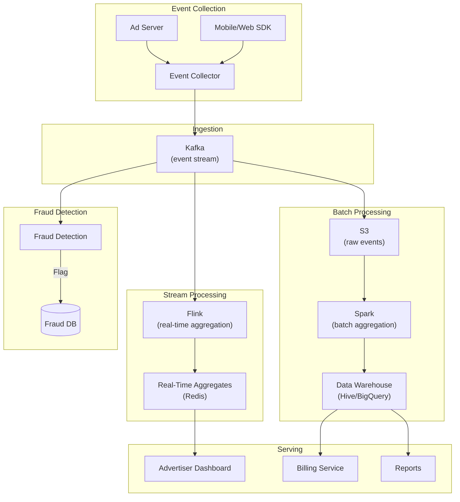
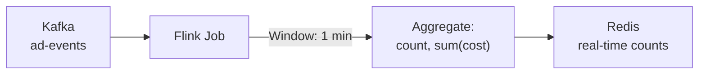
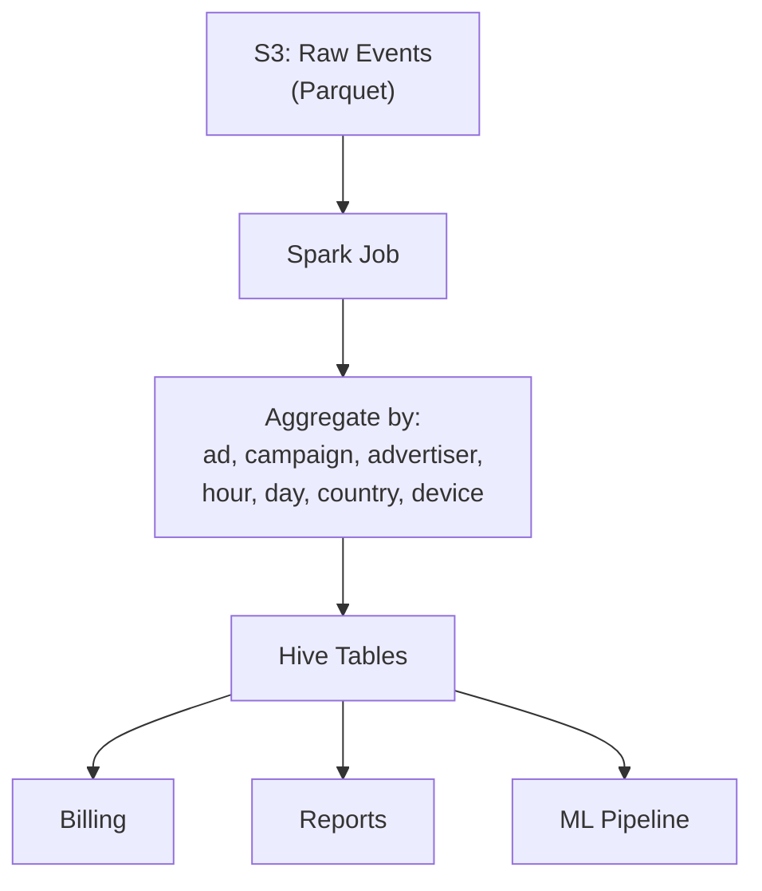
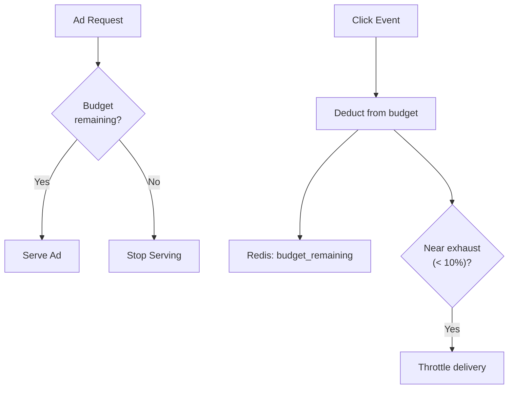
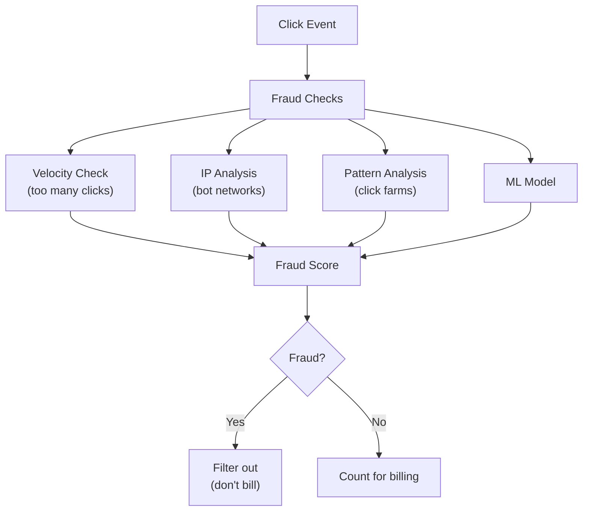

# Design Ad Click Aggregation

## Overview

Ad click aggregation systems track, count, and bill for ad impressions and clicks in real-time. Platforms like Google Ads and Facebook Ads process billions of ad events per day, aggregating them by campaign, advertiser, demographic, and time window. The core challenges are high write throughput, real-time aggregation, and accurate billing.

## Requirements

### Functional
- Track ad impressions (ad shown to user) and clicks (user clicks ad)
- Aggregate metrics by: campaign, advertiser, ad creative, time window (hourly, daily)
- Real-time dashboards for advertisers
- Billing based on click/impression counts
- Fraud detection (click fraud)
- Support for different billing models (CPC, CPM, CPA)

### Non-Functional
- **Scale**: 10+ billion ad events/day
- **Write throughput**: 100K+ events/second (peak: 500K+)
- **Latency**: Real-time aggregates available within 1 minute
- **Accuracy**: Billing data must be exactly correct (eventual consistency OK for dashboards)
- **Availability**: 99.99%

## Capacity Estimation

```
Events: 10 billion/day
Event size: ~200 bytes (ad_id, user_id, timestamp, event_type, ip, etc.)
Write rate: 10B / 86,400 ≈ 116K events/sec (peak: 500K/sec)
Daily storage: 10B × 200 bytes = 2 TB/day
Yearly storage: 2 TB × 365 = 730 TB
Unique campaigns: ~10 million
Unique advertisers: ~1 million
```

## Architecture



## Deep Dive: Event Schema

```json
{
    "event_id": "uuid",
    "event_type": "IMPRESSION|CLICK",
    "ad_id": "ad_123",
    "campaign_id": "camp_456",
    "advertiser_id": "adv_789",
    "user_id": "user_abc",
    "timestamp": 1705312200,
    "ip": "192.168.1.1",
    "user_agent": "Mozilla/5.0...",
    "device": "mobile",
    "country": "US",
    "cost_micros": 5000
}
```

## Deep Dive: Real-Time Aggregation

### Stream Processing with Flink



**Flink aggregation job:**
```java
DataStream<AdEvent> events = env
    .addSource(new KafkaSource<>("ad-events"));

DataStream<AdAggregate> aggregates = events
    .keyBy(event -> event.getAdId())
    .window(TumblingEventTimeWindows.of(Time.minutes(1)))
    .aggregate(new AdAggregateFunction());

aggregates.addSink(new RedisSink<>());
```

**Aggregation dimensions:**
- Per ad_id: impressions, clicks, CTR, cost
- Per campaign_id: total impressions, clicks, spend
- Per advertiser_id: total spend, remaining budget
- Per country/device: breakdown by geography and device

### Real-Time Storage (Redis)

```python
# Increment click count for ad
redis.hincrby(f"ad:{ad_id}:2024-01-15:10:30", "clicks", 1)
redis.hincrby(f"ad:{ad_id}:2024-01-15:10:30", "cost_micros", 5000)

# Increment campaign daily total
redis.hincrby(f"camp:{camp_id}:2024-01-15", "clicks", 1)
redis.hincrby(f"camp:{camp_id}:2024-01-15", "cost_micros", 5000)

# Check budget
budget_remaining = redis.get(f"adv:{adv_id}:budget_remaining")
if budget_remaining <= 0:
    stop_serving_ads(adv_id)
```

## Deep Dive: Batch Aggregation



**Batch aggregation (hourly/daily):**
```sql
-- Daily aggregation per campaign
SELECT
    campaign_id,
    advertiser_id,
    DATE(event_time) as date,
    COUNT(CASE WHEN event_type = 'IMPRESSION' THEN 1 END) as impressions,
    COUNT(CASE WHEN event_type = 'CLICK' THEN 1 END) as clicks,
    SUM(cost_micros) / 1000000.0 as total_cost,
    COUNT(CASE WHEN event_type = 'CLICK' THEN 1 END) * 1.0 /
        NULLIF(COUNT(CASE WHEN event_type = 'IMPRESSION' THEN 1 END), 0) as ctr
FROM ad_events
WHERE DATE(event_time) = '2024-01-15'
GROUP BY campaign_id, advertiser_id, DATE(event_time)
```

## Deep Dive: Budget Management



**Budget pacing:**
- Don't spend entire budget in the first hour
- Distribute spend evenly throughout the day
- Use rate limiting: `max_spend_per_hour = daily_budget / 24`

## Deep Dive: Click Fraud Detection



**Fraud signals:**
- Same IP clicking same ad repeatedly
- Click timestamp clustering (automated clicking)
- Geographic mismatch (VPN/proxy detection)
- Device fingerprint anomalies
- Click-to-conversion rate anomalies

## Scalability

| Component | Strategy |
|-----------|---------|
| Event collection | Kafka (partitioned by ad_id hash) |
| Real-time aggregation | Flink (parallelism = Kafka partitions) |
| Real-time storage | Redis cluster (sharded by ad_id) |
| Raw event storage | S3 (Parquet format, partitioned by date) |
| Batch aggregation | Spark on S3/Hive |
| Data warehouse | BigQuery/Hive for ad-hoc queries |
| Billing | Separate pipeline, exactly-once processing |

## Trade-Offs

| Decision | Benefit | Cost |
|----------|---------|------|
| Kafka for ingestion | Durable, ordered, replayable | Operational overhead |
| Flink for real-time | Low-latency aggregates | Complex stream processing |
| Redis for counters | Ultra-fast increments | Memory cost, not durable |
| S3 for raw events | Cheap, unlimited storage | Higher query latency |
| Separate billing pipeline | Accuracy guarantee | Extra infrastructure |

## Interview Tips

1. **Start with scale** — 10B events/day, 500K events/sec peak
2. **Explain the dual pipeline** — real-time (Flink → Redis) + batch (S3 → Spark → Hive)
3. **Discuss aggregation dimensions** — by ad, campaign, advertiser, time, geography
4. **Mention budget management** — real-time budget tracking, pacing
5. **Talk about fraud detection** — velocity checks, IP analysis, ML models
6. **Don't forget billing accuracy** — separate pipeline, exactly-once processing
7. **Compare real-time vs batch** — real-time for dashboards, batch for billing/reports

## Key Takeaways

- Ad click aggregation processes 10B+ events/day through a dual pipeline: real-time (Flink) + batch (Spark).
- Real-time: Kafka → Flink (1-min windows) → Redis (counters) for live dashboards.
- Batch: Kafka → S3 (Parquet) → Spark → Hive for billing and reports.
- Budget management: real-time deduction from Redis, pacing to distribute spend evenly.
- Click fraud detection: velocity checks, IP analysis, ML models.
- Billing uses a separate, exactly-once pipeline for accuracy.
- Kafka partitions by ad_id hash for even distribution and ordering guarantees.
