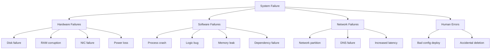
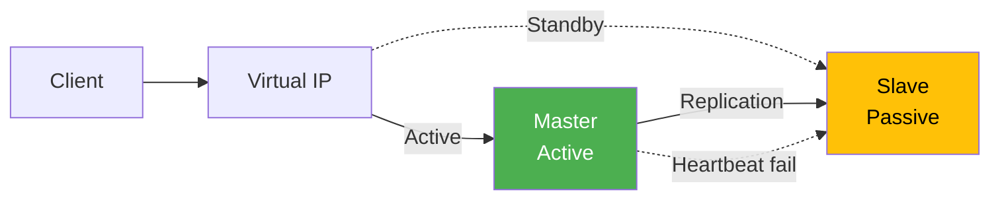
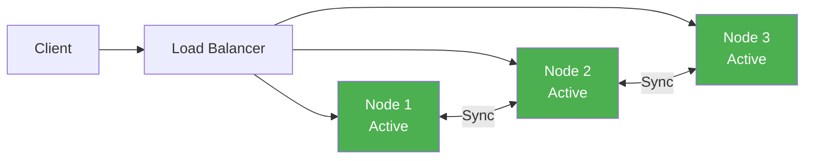
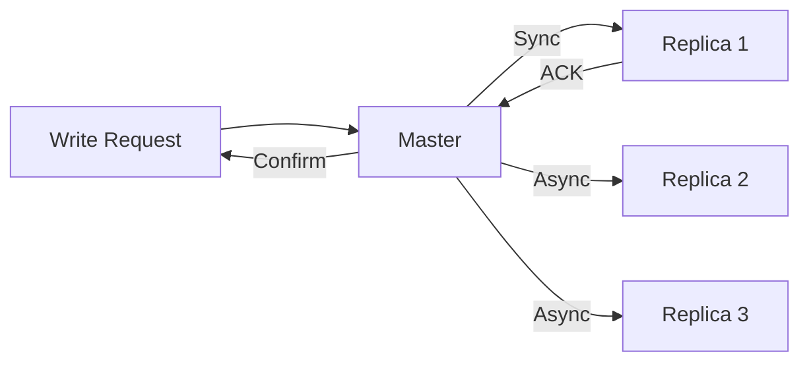
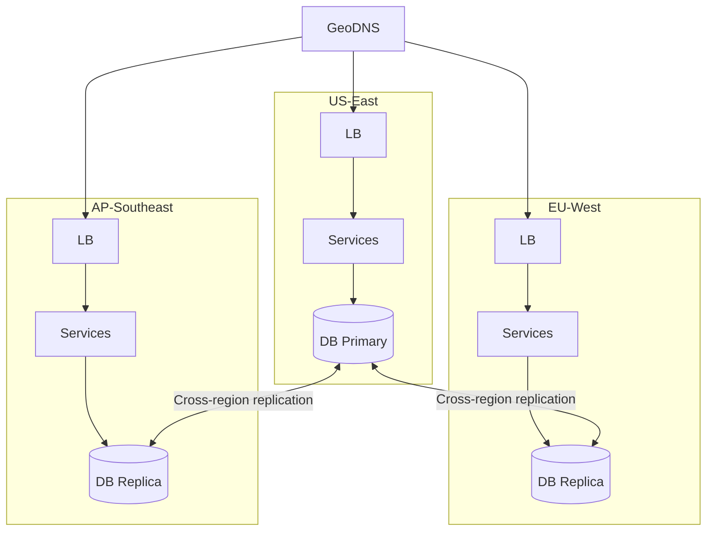
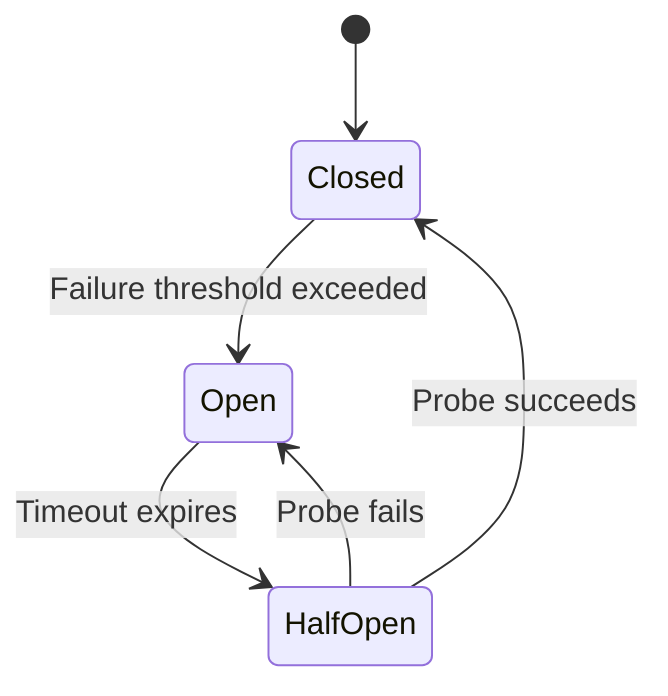
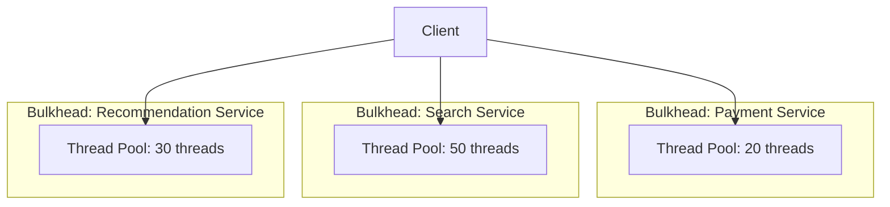
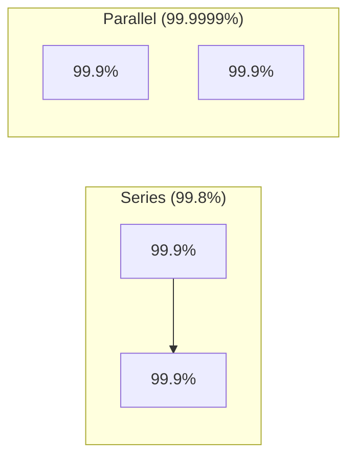

# Availability Patterns

## Overview

Availability is the percentage of time a system is operational and responsive. It's one of the most critical non-functional requirements in system design. This page covers the patterns used to achieve high availability, from basic failover to the "five nines" (99.999%) standard.

## Availability Numbers

| Availability | Downtime/Year | Downtime/Month | Downtime/Week |
|-------------|---------------|-----------------|---------------|
| 99% ("two nines") | 3.65 days | 7.31 hours | 1.68 hours |
| 99.9% ("three nines") | 8.77 hours | 43.83 min | 10.08 min |
| 99.99% ("four nines") | 52.60 min | 4.38 min | 1.01 min |
| 99.999% ("five nines") | 5.26 min | 26.30 sec | 6.05 sec |

Most web services target **99.9%–99.99%**. Financial systems and telecom aim for **99.999%**.

## Failure Modes

Before designing for availability, understand what can fail:



## Pattern 1: Failover

### Active-Passive (Master-Slave)

- One active node handles all traffic
- One or more passive nodes standby, receiving replicated data
- A **heartbeat** mechanism detects active node failure
- Passive node is **promoted** to active on failure



**Pros:** Simple, well-understood, data consistency guaranteed
**Cons:** Failover time (seconds to minutes), wasted passive resources

### Active-Active (Multi-Master)

- Multiple nodes handle traffic simultaneously
- Load balancer distributes requests across all nodes
- Each node can serve both reads and writes



**Pros:** No wasted resources, instant failover, better read throughput
**Cons:** Conflict resolution needed, more complex

## Pattern 2: Replication

### Synchronous Replication
- Write is confirmed only after all (or quorum) replicas acknowledge
- Guarantees zero data loss on failover
- Higher write latency

### Asynchronous Replication
- Write is confirmed immediately, replicas catch up later
- Lower latency but potential data loss on failover
- Common in MySQL async replication, PostgreSQL streaming replication

### Semi-Synchronous (MySQL)
- At least one replica must acknowledge before the write returns
- Balances consistency and performance



## Pattern 3: Redundancy

### Compute Redundancy
- Multiple instances behind a load balancer
- Health checks remove unhealthy instances
- Auto-scaling adds/removes instances based on load

### Data Redundancy
- Replicate data across multiple nodes, racks, data centers
- Erasure coding (e.g., Reed-Solomon) for storage efficiency
  - Example: 6 data blocks + 3 parity blocks = can lose any 3 blocks
  - Uses 1.5x storage vs 3x for triple replication

### Network Redundancy
- Multiple network paths (BGP multi-homing)
- Multiple DNS providers
- CDN fallbacks

## Pattern 4: Multi-Region / Multi-DC

### Active-Active Multi-Region



**Strategies:**
- **GeoDNS**: Route users to the nearest region
- **Global load balancing**: Cloudflare, AWS Global Accelerator
- **Data residency**: Keep data in-region for compliance (GDPR)

## Pattern 5: Circuit Breaker

Prevent cascading failures when a dependency is down:



**States:**
- **Closed**: Normal operation, failures counted
- **Open**: All requests failfast, no calls to dependency
- **Half-Open**: Allow limited requests to test recovery

**Example (Hystrix-style):**
```python
class CircuitBreaker:
    def __init__(self, failure_threshold=5, timeout=30):
        self.failure_count = 0
        self.failure_threshold = failure_threshold
        self.timeout = timeout
        self.state = "CLOSED"
        self.last_failure_time = None

    def call(self, func, *args):
        if self.state == "OPEN":
            if time.time() - self.last_failure_time > self.timeout:
                self.state = "HALF_OPEN"
            else:
                raise CircuitOpenError("Circuit is open")

        try:
            result = func(*args)
            self._on_success()
            return result
        except Exception as e:
            self._on_failure()
            raise

    def _on_success(self):
        self.failure_count = 0
        self.state = "CLOSED"

    def _on_failure(self):
        self.failure_count += 1
        self.last_failure_time = time.time()
        if self.failure_count >= self.failure_threshold:
            self.state = "OPEN"
```

## Pattern 6: Bulkhead

Isolate components so a failure in one doesn't cascade:



If the payment service is slow, it only consumes its 20 threads, leaving search and recommendations unaffected.

## Pattern 7: Graceful Degradation

When the system is under pressure, reduce functionality instead of failing entirely:

- **Read-only mode**: Disable writes, keep reads working
- **Disable non-critical features**: Recommendations, analytics, personalization
- **Serve cached/stale data**: Better than an error page
- **Rate limiting**: Shed excess load to protect core functionality

## Achieving Specific SLAs

### To Achieve 99.9% (Three Nines)
- Active-passive failover
- Single-region with multiple AZs
- Automated monitoring and alerting
- On-call rotation with 15-min response SLA

### To Achieve 99.99% (Four Nines)
- Active-active across multiple AZs
- Automated failover (< 30 seconds)
- Redundancy at every layer (compute, storage, network)
- Chaos engineering (Netflix Chaos Monkey)

### To Achieve 99.999% (Five Nines)
- Active-active multi-region
- Zero-downtime deployments
- Real-time replication with automatic conflict resolution
- Elimination of all single points of failure
- Sub-second failover

## Availability Math

### Serial Components
If components are in series, overall availability is the **product**:

```
A_total = A_1 × A_2 × A_3

Example: Two 99.9% services in series:
A = 0.999 × 0.999 = 0.998 (99.8%)
```

### Parallel (Redundant) Components
If components are in parallel (redundant), overall availability:

```
A_total = 1 - (1 - A_1) × (1 - A_2)

Example: Two 99.9% services in parallel (either can serve):
A = 1 - (0.001 × 0.001) = 0.999999 (99.9999%)
```



## Trade-Offs

| Pattern | Availability Gain | Cost |
|---------|-------------------|------|
| Active-Passive failover | High | Idle standby resources |
| Active-Active | Very high | Conflict resolution complexity |
| Multi-region | Highest | Data replication latency, cost |
| Circuit breaker | Prevents cascading | Temporary request failures |
| Bulkhead | Isolates failures | Resource fragmentation |
| Graceful degradation | Maintains core | Feature unavailability |

## Interview Tips

1. **Start with the SLA target** — "We need 99.99% availability, which allows ~4.38 min downtime/month"
2. **Identify single points of failure** — "The database is a SPOF; we need replication"
3. **Use availability math** — "Two 99.9% redundant components give us 99.999%"
4. **Mention circuit breakers** — essential for microservices architectures
5. **Discuss graceful degradation** — "Under load, we serve cached data instead of failing"
6. **Don't forget operational aspects** — monitoring, alerting, runbooks, on-call
7. **Explain failover time** — "Active-passive takes 30s to failover; active-active is instant"

## Key Takeaways

- Availability is measured in "nines." 99.9% = 8.77 hours downtime/year.
- Failover (active-passive or active-active) is the primary pattern for handling node failures.
- Redundancy at every layer (compute, data, network) is essential for high availability.
- Circuit breakers prevent cascading failures in microservices.
- Graceful degradation keeps the system partially working under stress.
- Parallel redundancy dramatically improves availability: two 99.9% systems = 99.999%.
