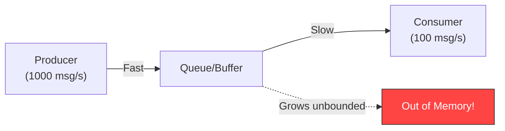
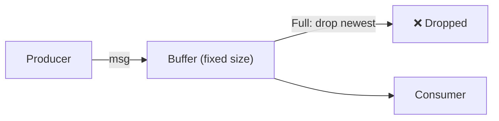
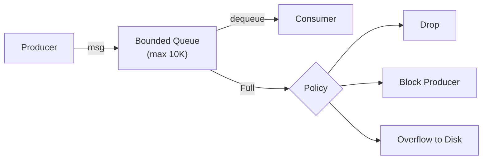
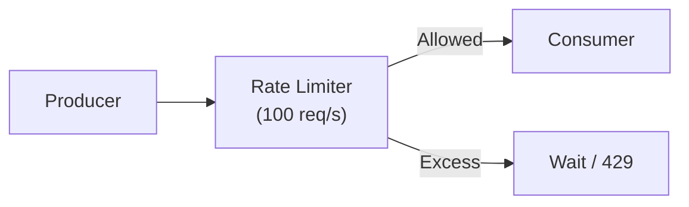
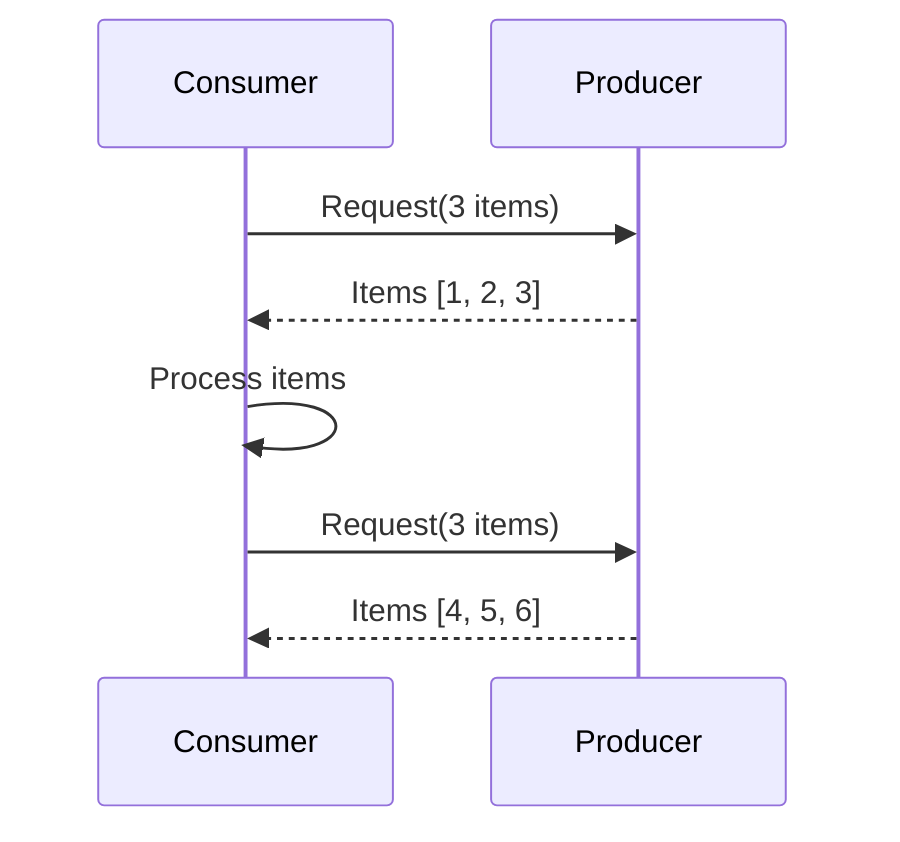
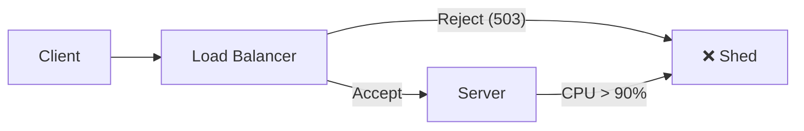
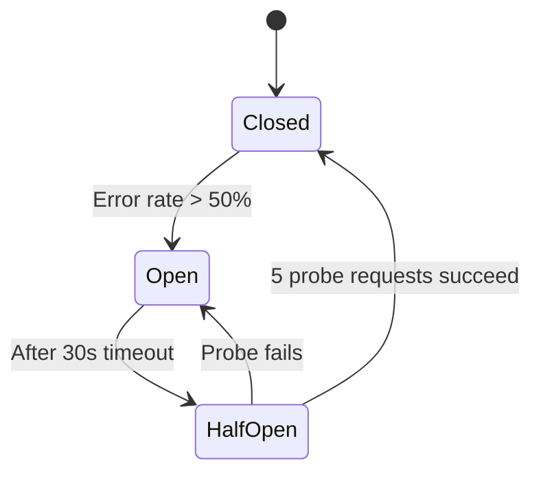
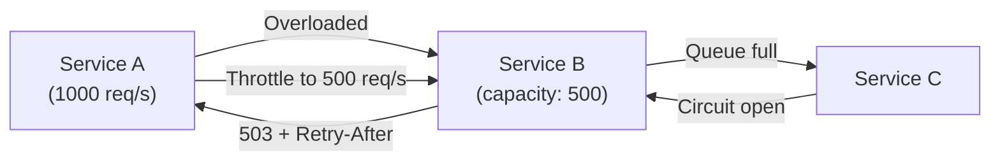

# Backpressure

## Overview

Backpressure is the mechanism by which a system slows down or pushes back on the producer when the consumer cannot keep up with the incoming data rate. Without backpressure, systems risk memory exhaustion, cascading failures, and unbounded latency growth. It's a critical concept for building resilient distributed systems.

## The Problem

When a producer generates data faster than a consumer can process it:



Without backpressure, the queue grows indefinitely until the system crashes.

## Backpressure Strategies

### 1. Drop Messages

The simplest approach: when the buffer is full, drop new (or oldest) messages.



**When to use:**
- Telemetry/metrics data (lossy is OK)
- Real-time feeds where freshness matters more than completeness
- UDP-based systems

**Variants:**
- **Drop newest**: Latest messages are discarded
- **Drop oldest**: FIFO queue, oldest messages discarded (ring buffer)
- **Drop random**: Random eviction under pressure

### 2. Buffer / Queue

Use a bounded queue as a shock absorber. When full, apply a policy.



**Implementation:**
```python
import queue
import threading

class BoundedQueue:
    def __init__(self, maxsize=10000):
        self.q = queue.Queue(maxsize=maxsize)

    def put(self, item, timeout=1.0):
        try:
            self.q.put(item, timeout=timeout)
        except queue.Full:
            # Option 1: Drop
            # return False
            # Option 2: Block (backpressure to producer)
            raise BackpressureError("Queue full")

    def get(self, timeout=1.0):
        return self.q.get(timeout=timeout)
```

### 3. Throttling / Rate Limiting

Limit the rate at which the producer can send data.



**Algorithms:**
- **Token bucket**: Tokens added at fixed rate; each request consumes a token
- **Leaky bucket**: Requests processed at constant rate; excess queued or dropped
- **Sliding window**: Count requests in a rolling time window

```python
import time

class TokenBucket:
    def __init__(self, rate, capacity):
        self.rate = rate          # tokens per second
        self.capacity = capacity  # max burst
        self.tokens = capacity
        self.last_refill = time.time()

    def allow(self):
        now = time.time()
        elapsed = now - self.last_refill
        self.tokens = min(self.capacity, self.tokens + elapsed * self.rate)
        self.last_refill = now

        if self.tokens >= 1:
            self.tokens -= 1
            return True
        return False  # Backpressure: reject
```

### 4. Pull-Based (Reactive Streams)

Instead of the producer pushing data, the consumer **pulls** when ready.



**Examples:**
- **Kafka consumers**: Consumer pulls batches from partitions
- **Reactive Streams (RxJava, Project Reactor)**: Subscriber requests N items via `request(n)`
- **gRPC streaming**: Client controls flow with `request()` calls

### 5. Load Shedding

Intentionally reject requests when the system is overloaded.



**Strategies:**
- **Random shedding**: Reject X% of requests when overloaded
- **Priority shedding**: Drop low-priority requests first
- **Client-based shedding**: Shed by client ID (fairness)

### 6. Circuit Breaking

Stop sending requests to a downstream service that's struggling.



### 7. Exponential Backoff

When receiving errors, wait progressively longer before retrying.

```python
import time
import random

def call_with_backoff(func, max_retries=5):
    for attempt in range(max_retries):
        try:
            return func()
        except OverloadedError:
            wait = min(2 ** attempt + random.random(), 60)
            time.sleep(wait)
    raise Exception("Max retries exceeded")
```

## Real-World Backpressure Examples

### Kafka
- **Producer side**: `max.block.ms` — block producer if buffer is full
- **Consumer side**: Consumer pulls at its own pace (pull-based)
- **Broker side**: Retention policies (time-based or size-based) drop old messages

### TCP Flow Control
- Receiver advertises **window size** — how many bytes it can accept
- Sender slows down when window is small
- This is backpressure at the network protocol level

### Node.js Streams
```javascript
const readable = getReadableStream();
const writable = getWritableStream();

readable.pipe(writable);
// Node.js automatically handles backpressure:
// If writable.write() returns false, readable pauses
// When 'drain' event fires, readable resumes
```

### Reactive Streams (Java Project Reactor)
```java
Flux.from(producer)
    .onBackpressureBuffer(1000)       // Buffer up to 1000 items
    .onBackpressureDrop(item -> log("Dropped: " + item))  // Or drop
    .subscribe(consumer);
```

## Backpressure in Microservices



**Best practices:**
1. **Propagate backpressure upstream** — don't buffer until OOM
2. **Use circuit breakers** — stop calling broken dependencies
3. **Set timeouts everywhere** — don't wait forever
4. **Return 429 (Too Many Requests)** with `Retry-After` header
5. **Monitor queue depths** — alert when buffers fill up

## Trade-Offs

| Strategy | Latency | Throughput | Data Loss | Complexity |
|----------|---------|------------|-----------|------------|
| Drop messages | Low | High | Yes | Low |
| Buffer | Variable | High | Possible (overflow) | Low |
| Throttle | Medium | Controlled | No | Medium |
| Pull-based | Medium | Controlled | No | Medium |
| Load shedding | Low | Controlled | Yes | Medium |
| Circuit breaker | Low (fail fast) | Reduced | Yes (requests) | Medium |

## Interview Tips

1. **Always mention backpressure** — it shows you think about failure modes
2. **Start with the problem** — "What happens when the producer is faster than the consumer?"
3. **Choose based on data criticality** — metrics can be dropped; financial transactions cannot
4. **Mention TCP flow control** — it's the most fundamental backpressure mechanism
5. **Discuss pull-based systems** — Kafka, Reactive Streams — as the gold standard
6. **Talk about cascading failures** — without backpressure, a slow service brings down the whole chain
7. **Mention monitoring** — queue depth, rejection rate, latency percentiles

## Key Takeaways

- Backpressure prevents system overload by slowing down or rejecting work when the consumer can't keep up.
- Strategies include: drop, buffer, throttle, pull-based, load shedding, circuit breaking.
- Pull-based systems (Kafka, Reactive Streams) are the gold standard — the consumer controls the pace.
- TCP flow control is backpressure at the network level.
- Without backpressure, a slow consumer causes cascading failures upstream.
- Always propagate backpressure — don't just buffer until you crash.

## Cross-References

- [Rate Limiter](./rate-limiter.md)
- [Availability Patterns](./availability-patterns.md)
- [Latency vs Throughput](./latency-vs-throughput.md)
- [Messaging Systems](./hld/messaging-systems.md)
- [Concurrency Overview](../../concurrency/overview.md)

