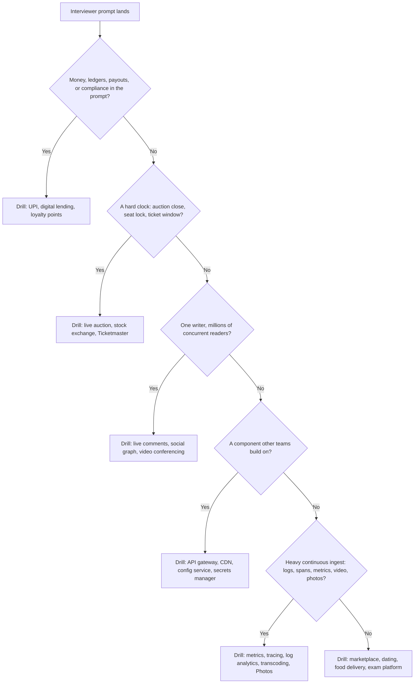

# System Design Case Studies

## Overview

This section contains 37 full interview-format system design case studies, and this page is the index into all of them. Each case study walks the six-step framework from requirements to follow-ups with explicit numbers, trade-off decisions, and deep dives — the way a strong candidate would drive a 45-minute design round. The pages complement [real-world architectures](../real-world/netflix.md), which analyze how actual companies built things; these pages optimize for *practicing the design conversation itself*.

Each case study follows the same structure so you can drill them like past papers:

1. **Requirements & estimation** — functional/non-functional, QPS, storage, bandwidth math
2. **API + data model** — concrete schemas, not hand-waving
3. **High-level architecture** — one diagram you should be able to redraw from memory
4. **Deep dives** — the two or three genuinely hard parts, with alternatives compared
5. **Bottlenecks & follow-ups** — where the design bends, what the interviewer asks next

The index below groups the case studies by domain so you can build coverage deliberately instead of reading them in alphabetical order. Two people who have drilled one case deeply from each group walk into an interview with a reusable answer for almost any prompt; someone who read thirty pages passively walks in with recognition but no recall. Use the [study order](#study-order-recommendation) at the bottom if you have limited time.

## The case-study index

The table gives one line per case study: what makes it hard in one clause, and the concepts the page teaches that transfer to other designs. Domain groups collect problems that share a failure mode, so after a weak mock you can find the drill that targets the exact shape you missed. Names in the first column are the sub-flavor of the problem — use them to navigate, but expect interviewers to blend flavors freely.

| Domain | Case Study | Core Challenge | Must-Know Concepts |
|---|---|---|---|
| **Real-time, bidding & flash contention** | | | |
| Bidding | [Ad tech / RTB](./ad-tech.md) | run a 100 ms impression auction at millions of QPS on the DSP decision path | profile caches, frequency capping, budget pacing, attribution windows |
| Auctions | [Live auction platform](./live-auction.md) | continuous bid contention where perceived fairness is the product | proxy bidding, WebSocket fan-out, soft-close anti-sniping, clock skew |
| Exchange | [Stock exchange](./stock-exchange.md) | deterministic matching at microsecond budgets with zero order loss | price-time priority order book, sequencer, deterministic recovery, RPO=0 DR |
| Ticketing | [Ticketmaster](./ticketmaster.md) | reserved-seat inventory that never oversells under a stadium-scale herd | waiting rooms, seat locks with TTL holds, idempotent payments |
| Fantasy sports | [Fantasy sports platform](./fantasy-sports.md) | a hard deadline write cliff plus settlement you cannot get wrong | contest-entry inventory, live-scoring fan-out, prize-settlement ledgers |
| Gaming services | [Matchmaking & leaderboards](./matchmaking-leaderboard.md) | fair matches and top-K rank reads for 100M players per season | Elo/Glicko/TrueSkill, MMR windows, Redis ZSET partitions, approximate ranks |
| **Payments & fintech** | | | |
| Payment rail | [UPI payments](./upi-payments.md) | exactly-once money movement across independent bank cores you don't own | two-half transactions, idempotency keys, timeout reversals, reconciliation |
| Lending | [Digital lending](./digital-lending.md) | a loan *lifecycle* — KYC to disbursal to NPA, not a funnel to one payment | bureau API rate limits, hybrid underwriting, double-entry ledger, collections |
| Loyalty | [Loyalty & points](./loyalty-points.md) | points are money-shaped: audited, fraud-prone, never a bare `balance` column | earn/burn ledger, expiry engine, redemption holds, program migration |
| Marketplace money | [C2C marketplace](./marketplace-platform.md) | strangers trading unique goods need escrow semantics, not a charge | listing lifecycle, faceted search, offer flow, payout holds, fraud queues |
| **Marketplace & content platforms** | | | |
| Dating | [Dating app](./dating-app.md) | a write-heavy swipe loop with geo-ranked ephemeral candidate decks | geohash/H3 serving, per-user queues, Bloom-filter match pre-check, privacy fails-closed |
| Delivery | [Food delivery](./food-delivery-hld.md) | dispatch assignment under a 30–60 s SLA plus a rider GPS firehose | online assignment problem, geo-indexed location store, tracking fan-out |
| Q-commerce | [10-minute grocery](./grocery-instant-delivery.md) | hyperlocal fulfillment where every added minute breaks the promise | dark-store geo-sharding, picker SLAs, rider batching, ETA promises, load shedding |
| Social graph | [Social graph service](./social-graph-service.md) | hundreds of billions of edges feeding feed fan-out at Facebook scale | TAO-inspired storage, sharded RDBMS vs graph store, push vs pull, celebrity problem |
| Trust & safety | [Content moderation](./content-moderation-platform.md) | adversarial classification plus human review at platform scale | classifier triage queues, hash matching, appeals flow, legal takedown clocks |
| **Infrastructure & platform services** | | | |
| Edge proxy | [API gateway](./api-gateway.md) | a component on every request with per-millisecond latency accounting | control/data-plane split, auth offload, rate-limit tiers, per-route canaries |
| Delivery edge | [CDN](./cdn-service.md) | a global reverse-proxy fabric with hit-ratio economics | PoP hierarchy with shields, cache keys + instant purge, signed URLs, DDoS absorption |
| Configuration | [Distributed config service](./distributed-config-service.md) | small, precious data everywhere, quickly, forever, without downtime | versioned KV, watch-based push, serve-stale reads, ring rollouts, rollback |
| Secrets | [Secrets manager](./secrets-manager.md) | a fail-closed root of trust with dynamically minted credentials | Shamir unseal, envelope encryption, leased credentials, deterministic revocation |
| Flags | [Feature flag service](./feature-flag-service.md) | the hottest evaluation path in the company plus an audited control plane | local SDK evaluation, push vs poll propagation, guardrail metrics, kill switches |
| Dev platform | [Cloud IDE](./cloud-ide.md) | multi-tenant containers with sub-second starts and local-feel keystrokes | image prebuilds, warm pools, editor server streaming, snapshot/resume |
| Dev platform | [CI/CD system](./ci-cd-system.md) | build DAGs at org scale with production-breaking blast radius | content-addressed artifacts, runner warm pools, merge queues, cache poisoning |
| **Observability, data & orchestration** | | | |
| Metrics | [Metrics & monitoring](./metrics-monitoring.md) | write-heavy TSDB at trillions of samples with alerting that doesn't page on blips | pull vs push, delta-of-delta/XOR chunks, downsampling, rule engines |
| Tracing | [Distributed tracing](./distributed-tracing.md) | tracing without drowning in spans — sampling decides the cost | head vs tail sampling, W3C trace context, span storage engines |
| Logs | [Log analytics](./log-analytics.md) | 1M+ events/sec of noisy text on a per-GB budget someone will question | label model vs inverted index vs columnar, tiered retention, query fan-out |
| ML infra | [Feature store](./feature-store.md) | training/serving consistency at 10 ms online lookups | point-in-time correctness, online/offline duality, streaming transforms |
| Scheduling | [Distributed task scheduler](./distributed-task-scheduler.md) | lease-based distributed cron that is fair between tenants | lease assignment, dedup keys, priority + fairness, the exactly-once illusion |
| Workflows | [Durable execution engine](./durable-execution-engine.md) | functions that survive machine death via deterministic replay | event history, replay, sticky workers, timers/signals, continue-as-new |
| **Media, gaming & collaboration** | | | |
| Real-time media | [Video conferencing](./video-conferencing.md) | bidirectional media under latency budgets 10× tighter than streaming | mesh vs MCU vs SFU, layered encoding, congestion control, geo relays |
| Media pipeline | [Video transcoding](./video-transcoding-pipeline.md) | a GPU factory from upload to CDN origin with a cost-per-hour budget | resumable upload, ABR ladders, spot/on-demand pools, CMAF packaging, DRM |
| Broadcast chat | [Live comments](./live-comments.md) | 100,000:1 fan-out where dropping low-value events is a feature | firehose metering, prioritized delivery, sampling, super-chat economics |
| Media storage | [Google Photos](./google-photos.md) | exabyte-class blobs with a derived-artifact multiplier on every byte | haystack-style blob stores, thumbnail/embedding pipelines, revocable sharing |
| Collaboration | [Collaborative spreadsheet](./collaborative-spreadsheet.md) | sequenced ops plus a formula dependency DAG that re-ranks a keystroke | op logs, cell convergence, incremental topological evaluation, virtualization |
| **Health & public sector** | | | |
| Healthcare | [Telehealth consultation](./telehealth-consultation.md) | scarce doctor calendars, WebRTC quality, and PHI compliance shape everything | availability holds, signed e-prescriptions, consent and audit trails |
| Public health | [Vaccination slot booking](./vaccination-slot-booking.md) | policy-driven eligibility plus fairness against bots at slot release | beneficiary registry, dose-interval rules, signed certificates, queue admission |
| Transport | [IRCTC train booking](./irctc-train-booking.md) | quota-partitioned berth inventory and a daily Tatkal morning stampede | waitlist/RAC state machine, per-coach no-oversell, 10 AM spike admission |
| Exams | [Online exam platform](./online-exam-platform.md) | server-owned clocks, leak-resistant delivery, dispute-proof scoring | encrypted question delivery, proctoring signals, thundering-herd start |

### Start here in each group

One page per group is the minimum viable coverage; these are the picks that teach the group's signature constraint with the fewest prerequisites:

- **Real-time & bidding** → [Ticketmaster](./ticketmaster.md) — contention, holds, and payment idempotency in one design.
- **Payments & fintech** → [Loyalty points](./loyalty-points.md) — ledger thinking before the harder exactly-once problem in UPI.
- **Marketplace & content** → [Food delivery](./food-delivery-hld.md) — three-sided marketplace plus geo plus fan-out.
- **Infra & platform** → [API gateway](./api-gateway.md) — the component-on-every-request budget discipline the group shares.
- **Observability & orchestration** → [Task scheduler](./distributed-task-scheduler.md) — leases, dedup, and fairness without storage-engine depth.
- **Media & collaboration** → [Video transcoding](./video-transcoding-pipeline.md) — the pipeline/factory pattern the group is built on.
- **Health & public sector** → [Vaccination slots](./vaccination-slot-booking.md) — policy-driven eligibility and fairness under flash load.

## How to pick a case study in an interview

You rarely choose the domain — the interviewer's prompt does. The skill this index trains is *mapping an unfamiliar prompt to the nearest drilled case* in the first two minutes, then saying out loud which known design you are adapting. Interviewers score the mapping itself: "this is a Ticketmaster-shaped inventory problem, so I'll start with no-oversell holds and a waiting room" is a strong opening sentence because it shows retrieval under pressure, not just preparation.

Two caveats keep this honest. First, most real prompts are hybrids — "design Zomato" is marketplace *and* dispatch *and* geo-indexing — so the flowchart picks your *starting* case study, not your whole answer; you bolt on the second drill where the first one runs out. Second, if nothing maps cleanly, fall back to the [six-step framework](../framework.md) and say so explicitly; interviewers reward a structured unknown far more than a misapplied memorized diagram.

## Cross-cutting themes

Five distributed-systems motifs account for most of the deep-dive questions across all 37 case studies. Learn each theme once, in the case study that teaches it most starkly, and you will recognize it wearing different clothes everywhere else. The table maps each theme to its best-teaching cases; the paragraph after it explains why those pages are the right teachers.

| Theme | What it looks like in a prompt | Case studies that teach it best |
|---|---|---|
| **Idempotency & the exactly-once illusion** | retries, duplicate clicks, at-least-once delivery of money or side effects | [UPI](./upi-payments.md), [Ticketmaster](./ticketmaster.md), [Task scheduler](./distributed-task-scheduler.md), [Durable execution](./durable-execution-engine.md), [Loyalty points](./loyalty-points.md) |
| **Hot keys & hot partitions** | one item, one user, or one time window absorbs all the traffic | [Live auction](./live-auction.md), [Dating app](./dating-app.md), [Social graph](./social-graph-service.md), [IRCTC](./irctc-train-booking.md), [Fantasy sports](./fantasy-sports.md), [Stock exchange](./stock-exchange.md) |
| **Fan-out economics** | one event must reach many watchers at bounded cost and latency | [Live comments](./live-comments.md), [Social graph](./social-graph-service.md), [Live auction](./live-auction.md), [Fantasy sports](./fantasy-sports.md), [Food delivery](./food-delivery-hld.md), [Video conferencing](./video-conferencing.md) |
| **TTL holds & reservation windows** | inventory held against a clock, expiring back to the pool | [Ticketmaster](./ticketmaster.md), [Telehealth](./telehealth-consultation.md), [Vaccination slots](./vaccination-slot-booking.md), [IRCTC](./irctc-train-booking.md), [Loyalty points](./loyalty-points.md) |
| **Approximate counts & sketches** | exact counting is unaffordable, so answer within an error bound | [Matchmaking & leaderboards](./matchmaking-leaderboard.md), [Ad tech](./ad-tech.md), [Dating app](./dating-app.md), [Metrics monitoring](./metrics-monitoring.md), [Live comments](./live-comments.md) |

**Idempotency** is best learned where retrying is most dangerous: UPI's two-half money movement and Ticketmaster's payment retry both turn "what happens if this runs twice?" from a footnote into the core of the design. The scheduler and durable-execution pages add the execution-side variant — dedup keys and event replay — so you can argue the exactly-once illusion from both the payment and the worker angles. Drill them in this order and the idempotency answer writes itself in any interview:

- [UPI](./upi-payments.md) — idempotency keys across a debit-then-credit pair where a post-timeout retry must reconcile, never double-pay.
- [Ticketmaster](./ticketmaster.md) — payment idempotency for a 3-second double click, including the interaction between seat-hold expiry and retry windows.
- [Distributed task scheduler](./distributed-task-scheduler.md) — dedup keys that make at-least-once execution behave exactly-once to observers.
- [Durable execution engine](./durable-execution-engine.md) — activity idempotency and deterministic replay as the structural answer to "the worker died mid-step".
- [Loyalty points](./loyalty-points.md) — an earn/burn ledger where a partner retry can never mint or burn points twice.

**Hot partitions** dominate flash-contention systems: a single auction item, a celebrity's edges, or the Tatkal quota window concentrates load onto one shard while the rest of the fleet idles. The dating-app and fantasy-sports pages show the standard defenses (per-entity queuing, admission control, elastic inventory where the deadline is the hard constraint), and the stock-exchange page shows what changes when you cannot shed the load at all. The spectrum worth memorizing:

- [Live auction](./live-auction.md) — one item is the hottest key in the system; sharded rooms and single-writer ordering around it.
- [Dating app](./dating-app.md) — hot users skew per-user swipe queues; shed load at the deck level, not the request level.
- [Social graph](./social-graph-service.md) — celebrity edges make an otherwise random shard hot; replication and fanout plans differ per tier.
- [IRCTC](./irctc-train-booking.md) — the Tatkal window concentrates a day of load into five minutes; queue-based admission is the fix.
- [Fantasy sports](./fantasy-sports.md) — a deadline write cliff with no peak-shifting option; elastic contest inventory absorbs it.
- [Stock exchange](./stock-exchange.md) — hot symbols cannot be shed at all; the design must route around them deterministically.

**Fan-out economics** is the shape of every "one writer, many watchers" system, and the cost model — per event, per recipient, per second — is the thing interviewers probe. **TTL holds** are its time-bound cousin: a reservation that must expire cleanly under failure, returning inventory to the pool without double-selling it in the interim. Both themes share one exam question: *what happens to the pending item when the holder dies?*

- [Live comments](./live-comments.md) — 100,000:1 broadcast where metering, sampling, and deliberate loss of low-value events are the design.
- [Social graph](./social-graph-service.md) — push vs pull vs hybrid feed assembly, with the celebrity boundary condition worked out.
- [Live auction](./live-auction.md) — outbid notifications to thousands of sockets in tens of milliseconds, per event.
- [Fantasy sports](./fantasy-sports.md) — one ball-by-ball event re-ranks millions of contest entries.
- [Ticketmaster](./ticketmaster.md) — the 7-minute seat hold: expiry as a timer/scan problem with no-oversell guarantees.
- [Telehealth](./telehealth-consultation.md) and [vaccination slots](./vaccination-slot-booking.md) — calendar and slot holds released on confirmation or timeout.

**Approximate counts** close the loop with the [probabilistic data structures](../probabilistic-data-structures.md) — HyperLogLog, count-min, Bloom filters. The skill is judgment, not just machinery: knowing where an estimate is acceptable (long-tail ranks, frequency caps, live reaction counters) and where it silently corrupts money (settlement, billing, ledgers). Each teaching case below draws that line explicitly:

- [Matchmaking & leaderboards](./matchmaking-leaderboard.md) — exact top-K, approximate rank-of-player for the 100M-player long tail.
- [Ad tech](./ad-tech.md) — frequency capping and budget pacing under a 100 ms budget where exact counting is unaffordable.
- [Dating app](./dating-app.md) — a Bloom-filter pre-check before the Redis-set match lookup, sized against its false-positive rate.
- [Metrics monitoring](./metrics-monitoring.md) — the cardinality budget: what each extra label dimension costs in series count.
- [Live comments](./live-comments.md) — reaction and viewer counters as sampled, approximate aggregates nobody audits.

## Coverage tracks

If you are preparing against a specific company profile, a track beats random sampling: pick the row matching the interview you expect, and treat the listed case studies as one connected course. Each track deliberately mixes one beginner-tier and one advanced-tier page so you practice transferring between comfort and discomfort zones. Tracks overlap intentionally — the fintech track shares two pages with the consumer track because payment shapes recur across both.

| Track | Case studies in order | What it prepares you for |
|---|---|---|
| Consumer / product | [Dating app](./dating-app.md) → [Food delivery](./food-delivery-hld.md) → [Ticketmaster](./ticketmaster.md) → [Social graph](./social-graph-service.md) → [Google Photos](./google-photos.md) | Product-company HLD rounds: feeds, geo, flash events, media storage |
| Infra / platform | [API gateway](./api-gateway.md) → [CDN](./cdn-service.md) → [Config service](./distributed-config-service.md) → [Secrets manager](./secrets-manager.md) → [Durable execution](./durable-execution-engine.md) | Platform-team and backend-infrastructure rounds: control planes, fail-closed systems |
| Fintech | [Loyalty points](./loyalty-points.md) → [Digital lending](./digital-lending.md) → [UPI](./upi-payments.md) → [Marketplace](./marketplace-platform.md) | Payments, lending, and ledger-correctness rounds at fintechs and banks |
| Real-time systems | [Live auction](./live-auction.md) → [Video conferencing](./video-conferencing.md) → [Live comments](./live-comments.md) → [Stock exchange](./stock-exchange.md) | Real-time product teams: media, contention, microsecond budgets |
| Observability / data | [Metrics monitoring](./metrics-monitoring.md) → [Log analytics](./log-analytics.md) → [Distributed tracing](./distributed-tracing.md) → [Feature store](./feature-store.md) | Infra-product, SRE-adjacent, and ML-platform rounds |

## Study order recommendation

Order matters more than volume: every case study assumes machinery taught by earlier ones, and reading them out of order makes the deep dives feel arbitrary. The tiers below assume roughly 2–4 hours per case study if you do the estimation math yourself and redrew the architecture diagram from memory afterward. Move down a tier only when you can survive an unprompted 40-minute mock of any page above it.

| Tier | Case studies | Why here |
|---|---|---|
| **Beginner** — standard building blocks, forgiving latency budgets | [Marketplace](./marketplace-platform.md), [Food delivery](./food-delivery-hld.md), [API gateway](./api-gateway.md), [Google Photos](./google-photos.md), [Task scheduler](./distributed-task-scheduler.md), [Dating app](./dating-app.md) | Mostly queues, caches, and sharded relational storage; no microsecond budgets, no correctness cliffs. Teaches the six-step rhythm and estimation without panic. |
| **Intermediate** — flash load, streaming, and money-lite state | [Ticketmaster](./ticketmaster.md), [Live auction](./live-auction.md), [UPI](./upi-payments.md), [Metrics monitoring](./metrics-monitoring.md), [Log analytics](./log-analytics.md), [Feature flags](./feature-flag-service.md), [Social graph](./social-graph-service.md), [Cloud IDE](./cloud-ide.md), [Vaccination slots](./vaccination-slot-booking.md) | Introduces thundering herds, TTL holds, exactly-once money movement, and write-heavy storage engines. Requires everything from the beginner tier plus backpressure vocabulary. |
| **Advanced** — hard clocks, determinism, and storage internals | [Stock exchange](./stock-exchange.md), [Ad tech](./ad-tech.md), [Durable execution](./durable-execution-engine.md), [Feature store](./feature-store.md), [Distributed tracing](./distributed-tracing.md), [Secrets manager](./secrets-manager.md), [Collaborative spreadsheet](./collaborative-spreadsheet.md), [Video conferencing](./video-conferencing.md), [Fantasy sports](./fantasy-sports.md) | Latency measured in microseconds, deterministic replay, point-in-time correctness, or fail-closed security. These are senior-round questions where the deep dive *is* the interview. |

If you have only one weekend, do **Ticketmaster → UPI → live auction → metrics monitoring** in that order: together they cover inventory contention, idempotent money, fan-out, and write-heavy storage — the four shapes interviewers reach for most often. Then read the [HLD core topics](../hld/README.md) page for any building block a deep dive referenced that you could not sketch unaided.

## How to practice

- Read the case, then close it and sketch the architecture diagram from memory; compare against the page and note what you structurally missed rather than what you named differently.
- Do the estimation section with your own numbers first, then check where your order-of-magnitude slipped — capacity math errors are the most common silent score-killer.
- For every deep dive, articulate the rejected alternative and *why* out loud; that reasoning, not the final diagram, is what the interviewer scores.
- Drill one case from each domain group before adding a second from any group — breadth across failure modes beats depth in one favorite domain.
- After each mock, file the prompt under the [cross-cutting themes](#cross-cutting-themes) table; the theme is the transferable unit, not the case study.
- Time the read: a first pass is 45–60 minutes, but a full pass — your own numbers, your own diagram, the deep-dive alternatives spoken aloud — is 2–4 hours, and only the second kind counts as a rep.
- Cross-check the primitives each case leans on: [consistency patterns](../consistency-patterns.md), [backpressure](../backpressure.md), [messaging systems](../hld/messaging-systems.md), and the [probabilistic data structures](../probabilistic-data-structures.md) that show up in every counting-adjacent design.

## Interview Questions

1. **"Design a ticket-booking system for a stadium event" — which case study is the template and what changes?** [Ticketmaster](./ticketmaster.md) is the base: no-oversell inventory, waiting-room admission, and idempotent payments. Changes come from the variant — standing vs reserved seating removes the seat map but keeps the hold model; free events remove payment idempotency but keep the herd; a lottery-based sale replaces contention with a randomization-and-notification pipeline. The skill being tested is saying *which parts of the template survive* and why.

2. **"How would you design the ledger for a rewards program?"** Start from [Loyalty points](./loyalty-points.md): points are a liability, so the answer is a double-entry earn/burn ledger with expiry as a lapse event, not a cron job that decrements a column. Extend with [banking ledger](../banking-ledger.md) fundamentals if the interviewer pushes on auditability. The trap to avoid is designing a balance column with an UPDATE — say out loud why that fails under retry and audit.

3. **"We need live scores pushed to 10 million concurrent viewers" — what does this decompose into?** [Live comments](./live-comments.md) for the broadcast fan-out economics, plus [fantasy sports](./fantasy-sports.md) if the scores drive per-user recomputation. The decomposition sentence matters: delivery plane (websocket/SSE edges), freshness plane (event ingest and sequencing), and personalization plane (what each user's state must recompute). Interviewers score whether you separate those three before drawing boxes.

4. **"Pick any system you know deeply and walk me through a failure mode."** This is where cross-cutting themes pay off: pick a drilled case, then pick its signature theme — hot partition for [IRCTC](./irctc-train-booking.md), idempotency for [UPI](./upi-payments.md), fan-out collapse for [live comments](./live-comments.md) — and narrate the failure, detection, and mitigation. A rehearsed failure story with numbers beats a generic "we'd add monitoring" answer every time.

5. **"Design a system that must never show stale prices but must also never go down" — which pages help?** This is the consistency-vs-availability trade in disguise, so the base drills are [distributed config service](./distributed-config-service.md) (serve-stale reads with bounded staleness) and [feature flag service](./feature-flag-service.md) (kill switches as an escape hatch). The strong answer defines which reads can tolerate staleness and for how long, then puts the consensus machinery only under the writes that cannot. Both pages cost-quantify the trade instead of hand-waving it.

6. **"How would you estimate the scale for a new product launch?"** Estimation drills are embedded in every case study's step 1, but the three most complete are [ticketmaster](./ticketmaster.md) (flash traffic math), [google photos](./google-photos.md) (storage and derived-artifact multipliers), and [metrics monitoring](./metrics-monitoring.md) (write-heavy cardinality math). The transferable habit is writing the assumptions down before the arithmetic, then sanity-checking the result against a known real system. Interviewers grade the assumptions, not the multiplication.

## Key Takeaways

- 37 case studies, 7 domain groups, 5 cross-cutting themes: use the domain table to find a drill, the theme table to transfer it, and the tracks to sequence it.
- Every page follows the same five-part structure — drill them like past papers, not like articles to read.
- The first interview skill this index trains is *mapping an unknown prompt to the nearest drilled case* within two minutes.
- Beginner → intermediate → advanced ordering exists because deep dives assume machinery; skipping tiers makes reasoning feel arbitrary.
- One weekend minimum viable coverage: Ticketmaster, UPI, live auction, metrics monitoring — inventory, money, fan-out, storage.
- The theme, not the case study, is the transferable unit; file every mock prompt under a theme afterward.

## Scope notes

These pages are interview drills, not production reference architectures, and treating them as either of the adjacent things weakens your prep. For how real systems were actually built, read the [real-world architectures](../real-world/netflix.md) section; for the textbook primitives the deep dives assume, read the [HLD core topics](../hld/README.md). The case studies compress real systems into one defensible 45-minute narrative — the simplifications are deliberate teaching choices, and the pages say so where the real systems diverged.

- They are not exhaustive: each page picks the two or three deep dives an interviewer would most likely probe, not every subsystem the product has.
- They are not vendor-neutral surveys: named products (Airflow, TAO, Gorilla) are cited as design evidence, not as deployment recommendations.
- They are not a substitute for speaking: the diagrams only become interview answers when you rehearse them out loud under a clock.

## Cross-References

- [Design Framework](../framework.md) — the six-step method every case study applies
- [Real-World Architectures](../real-world/netflix.md) — how actual companies built related systems, for the "has anyone done this?" follow-up
- [HLD Core Topics](../hld/README.md) — the building blocks the deep dives reference repeatedly
- [Banking Ledger](../banking-ledger.md) — the ledger primitive behind the payments, lending, and loyalty studies
- [Backpressure](../backpressure.md) — the load-shedding vocabulary used throughout the flash-contention studies
- [Probabilistic Data Structures](../probabilistic-data-structures.md) — the sketch toolkit behind the approximate-counting theme
- [LLD: Machine Coding](../../../machine-coding/README.md) — the single-process class-design counterpart to these distributed designs
