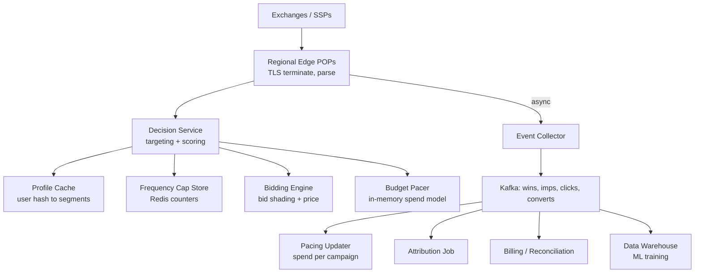
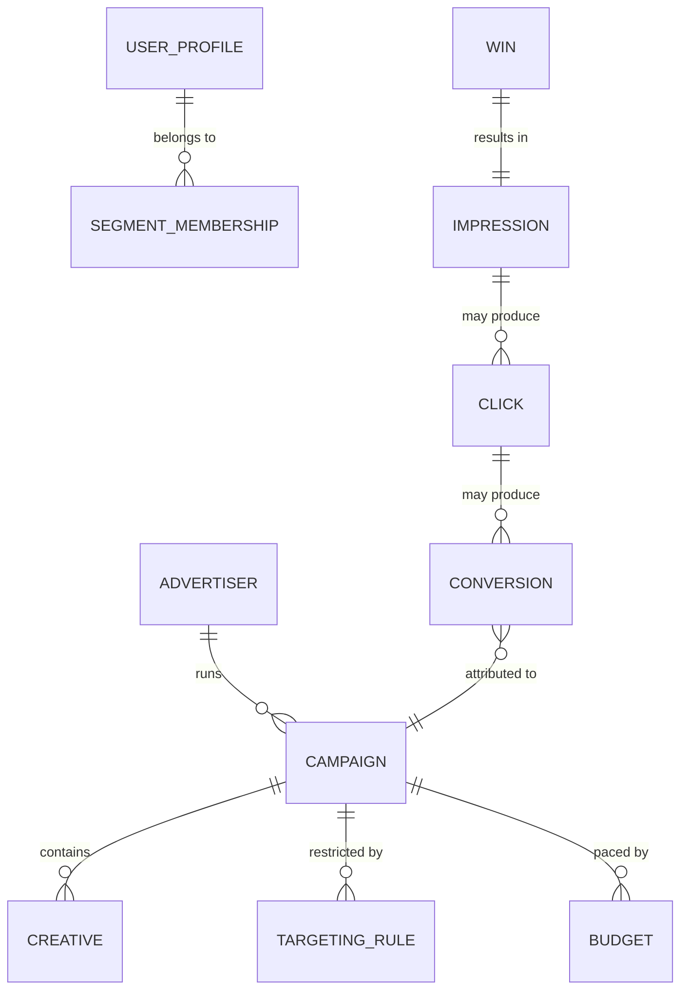

# Case Study: Design a Real-Time Bidding (Ad-Tech) System

## Overview

Real-time bidding is the "100 ms and a million QPS" interview: an auction for a single ad impression must be run end-to-end — from a user's page load, through the exchange, to DSPs deciding and bidding — inside roughly a 100 ms budget. This walkthrough designs the **DSP-side decisioning path** (the hardest latency box), while mapping the whole ecosystem of SSPs, exchanges, and publishers. It complements [Design Ad Click Aggregation](../ads.md), which covers the post-click aggregation pipeline; here the focus is the impression path: profile caches, frequency capping, auction mechanics, budget pacing, and attribution windows.

## Step 1 — The Ecosystem and Requirements

### Who is who (say this before drawing anything)

| Role | Job | Latency budget |
|---|---|---|
| Publisher | Sells inventory via SSP/header bidding | — |
| SSP | Auctions each impression to demand | ~50–80 ms |
| Exchange (often SSP+DSP-facing) | Runs the auction, enforces policy | ~20 ms |
| **DSP (this design)** | Evaluates bid request, decides, bids | **~20–50 ms of the 100 ms** |
| Advertiser | Sets campaign, budget, targeting | — |

### Functional

- Accept OpenRTB bid requests, return a bid with creative for qualified impressions
- Targeting: geo, device, segments (audience lists), time of day, viewability
- **Frequency capping**: never show user X more than N ads from campaign C per window
- Budget pacing: spend the daily budget smoothly across the day, never exhaust by 10 AM
- Winning bid → serve creative → track impressions, clicks, conversions
- Attribution: credit the click/conversion to the winning campaign within a window

### Non-Functional

- **Latency**: DSP decisioning p99 < 20–50 ms inside a ~100 ms end-to-end budget (OpenRTB defaults often 100–200 ms; exchanges often cut at 100 ms)
- **Scale**: 1M bid requests/s at peak (browsers fire one per ad slot, thousands of publishers)
- **Spend**: $10M/day across ~50K active campaigns — pacing error = money
- **Availability**: fail-open — a slow DSP simply doesn't bid; losing 100% of auctions is worse than bidding 99% fast
- **Consistency**: frequency caps and budgets are *approximate*; a 1% overshoot is acceptable, a 100 ms extra lookup is not

## Step 2 — Back-of-Envelope Estimation

| Quantity | Assumption | Result |
|---|---|---|
| Bid request rate | 1M/s peak, 300K/s avg | Each ~10–50 KB JSON/protobuf |
| Ingress bandwidth | 1M × 30 KB | ~30 GB/s ≈ 240 Gb/s — needs regional edge clusters |
| Bid request evaluation | 90% filtered by cheap checks (geo, floor, segment miss) | 100K/s need model scoring |
| Win rate | Bid on 10%, win 5% of bids | ~5K wins/s at peak |
| Daily impressions | Avg 5K wins/s × 86,400 s | ~4.3B impressions/day |
| Spend check | $10M / 4.3B impressions | ~$2.30 CPM — plausible |
| Frequency counters | 1M QPS × 2–3 counters per request | ~3M counter ops/s in the capping store |
| Profile cache | 500M active users, 5 KB profile each | 2.5 TB hot set — sharded cache, not a DB |

The verbalization that scores points: a DSP is a **filtering funnel** — 1M requests in, ~100K scored, ~5K wins. Everything before scoring must be O(1) lookups; everything after is money math.

## Step 3 — API Sketch

OpenRTB 2.x bid request/response (abridged):

```json
// POST /openrtb2/auction  (exchange → DSP)
{
  "id": "req-88123",
  "imp": [{ "id": "1", "banner": { "w": 300, "h": 250 }, "bidfloor": 1.2 }],
  "device": { "ua": "Mozilla/5.0", "ip": "203.0.113.9", "geo": { "country": "US" } },
  "user": { "id": "b64_uid_hash" },
  "tmax": 100,
  "test": 0
}
// DSP → exchange
{
  "id": "req-88123",
  "seatbid": [{ "bid": [{ "impid": "1", "price": 2.75,
       "adid": "creative-441", "cid": "campaign-87", "adomain": ["advertiser.com"] }] }]
}
```

Internal endpoints (your design vocabulary):

```text
GET  /v1/profiles/{user_hash}              → segments, caps, recent clicks (cache-only)
POST /v1/decide                            → bid or no-bid (the 20 ms path)
POST /v1/events/impression | click | win   → event collector (async, Kafka-backed)
POST /v1/attr/convert                      → pixel/conversion beacon
```

Key decisions: the decide path touches **only caches** — no database, no synchronous external calls; all events (win/imp/click/convert) flow async into Kafka for billing, pacing, and attribution ([Kafka docs](https://kafka.apache.org/documentation/)).

## Step 4 — High-Level Architecture



The decision service is stateless and horizontally scaled per region; all mutable state (profiles, caps, budgets) lives in caches that are *rebuildable* from the event stream. Losing a cache node costs a few ms of cold lookups, not correctness.

## Step 5 — Data Model

| Store | Table / key | Schema | Consistency |
|---|---|---|---|
| Profile cache (Redis) | `prof:{user_hash}` | `{ segments: [1,44,902], caps: {c87:{day:2,hour:0}}, last_clicks: [...] }` | Eventual, TTL 24–72 h |
| Cap counters (Redis) | `cap:{campaign}:{user}:{window}` | integer counter with TTL = window | Eventual — overshoot allowed |
| Campaign config (Postgres) | campaigns, creatives, targeting_rules | relational, versioned | Strong — control plane only |
| Budget state (per-region memory) | campaign → spend_today_cents | atomic counters, merged from Kafka | Eventual, reconciled hourly |
| Events (Kafka → warehouse) | win, impression, click, convert | immutable append-only | At-least-once + dedup |



Note what is *not* here: there is no transactional database on the 20 ms path. The only strongly-consistent store is campaign configuration, read from a cache refreshed every few seconds.

## Deep Dive 1 — The 100 ms Budget, Spent Millisecond by Millisecond

| Stage | Typical cost | Notes |
|---|---|---|
| Publisher page → SSP/exchange | 10–20 ms | Often the largest chunk; header bidding adds more |
| Exchange fanout to DSPs | 10–20 ms | Parallel HTTP/2 to all bidders |
| DSP: parse + cheap filters | 1–3 ms | Protobuf, SIMD JSON parse, precomputed rules |
| DSP: profile + cap lookups | 2–5 ms | Parallel cache gets, single round trip |
| DSP: model scoring | 5–15 ms | CTR/CV model inference, quantized or distilled |
| DSP: bid response | 1–2 ms | Pre-serialized templates |
| Exchange: collect, auction, notify | 5–20 ms | First-price or second-price logic |
| Creative render | 50–200 ms | After the decision; user-perceived, not bid-budget |

**What the interviewer is probing:** what do you do when the budget is blown? Answer: fail-open with *bid shaping* — dynamically drop the fraction of requests your tail latency can't absorb, preferring high-value requests. A DSP that answers 100% of requests at p99 150 ms earns less than one answering 90% at p99 40 ms, because exchanges time out and may rate-limit or deprioritize slow bidders.

## Deep Dive 2 — Keyed Profile Caches

The user profile is the decision's main input, and it must be reachable in ≤5 ms at 1M QPS. The design:

- **Key = hashed user ID** (cookie/IDFA/UID2), never raw PII; the hash is stable across regions so caches shard cleanly by key
- **Single round trip**: a Redis-cluster `MGET`-style pipeline fetching profile + all relevant cap counters in one hop; a second hop means you already lost the budget
- **Cold-start fallback**: unknown user → context-only targeting (page URL, geo, device) with a reduced bid; never block on a profile fetch
- **Rebuildability**: profile caches are projections of the click/impression streams with TTLs; a flushed cache repopulates from recent events at line rate
- **Segment lists can be huge**: store segment IDs as integer arrays, and keep "large audience" membership out-of-profile — a bitmap/bloom filter per segment answers "is user in segment 902?" in O(1) memory (see [Probabilistic Data Structures](../probabilistic-data-structures.md))

Trade-off table to present:

| Option | Lookup | Freshness | Cost | Failure mode |
|---|---|---|---|---|
| Redis cluster keyed by user hash | ~1–3 ms | Minutes (event-fed) | High | Cold lookups → lower win rate |
| Local in-memory (LRU per POP) | ~0.1 ms | Seconds–minutes stale | Cheap | Per-POP divergence of caps |
| Embedded feature DB (RocksDB) | ~1 ms | Event-fed | $ | Ops-heavy |
| Ask a database synchronously | 20–50 ms | Fresh | Highest | Blows budget — rejected |

## Deep Dive 3 — Frequency Capping and Auction Dynamics

**Frequency caps** are per-(user, campaign, window) counters incremented on *win*, checked on *decide*. At 1M QPS you cannot make them transactional — accept approximate semantics: TTL-windowed counters in Redis (INCR + EXPIRE), eventual reconciliation from impression events. State the accepted error: caps may overshoot by the in-flight window (a few impressions) — advertisers accept this; they do not accept 100 ms decisions.

**Auction mechanics** have shifted industry-wide, and interviewers love this question:

| Rule | How it worked | Why the industry moved |
|---|---|---|
| Second-price | Winner pays second-highest bid + 0.01 | Truthful bidding; easy strategy ("bid your value") |
| First-price | Winner pays their own bid | Header bidding let publishers run multiple auctions; second price became gamed via bid shading collusion |
| Today (Google Ad Manager 2019 onward) | First-price mostly everywhere | Publishers demanded it; DSPs now run **bid shading** algorithms to avoid overpaying |

Bid shading: your model estimates the distribution of competing bids and shades your true value down toward the expected clearing price. Wrong shading loses auctions or burns budget — it is a revenue-critical ML model, and it interacts directly with pacing.

**What the interviewer is probing:** whether you know the ecosystem moved from second-price to first-price and why, and whether you can reason about truthful bidding without getting lost.

## Deep Dive 4 — Budget Pacing

Daily budget $10,000, but traffic peaks at lunchtime. Naive "spend until empty" exhausts by 10 AM and misses cheap evening inventory. Pacing = closed-loop rate control:

1. Target spend curve: uniform, or traffic-shaped (`target(t) = budget × expected_traffic_share(t)`)
2. Each region tracks `spend_today(campaign)` from the Kafka win stream (a few seconds stale)
3. Throttle factor: `p_bid = f(remaining_budget / expected_remaining_spend)` — when ahead of curve, bid on more requests; when behind, restrict to high-CTR opportunities
4. PID-style correction smooths the loop; per-campaign state is tiny (a few counters), so it lives in the decider's memory with hourly reconciliation

Pacing mistakes are money: over-pacing buys expensive inventory early; under-pacing underspends and breaches campaign commitments. Mention that pacing and bid shading are *one* system: the shade effectively modulates win rate, which modulates spend.

## Deep Dive 5 — Click Attribution Windows

A conversion happens hours after the click; the billing system needs to know whom to credit.

- **Windows**: last-click attribution with a 7-day click window and 1-day view window is the common default; windows are advertiser-configurable
- **Mechanics**: click/convert events carry the user hash and campaign; an attribution join (typically a streaming join in Flink or an offline warehouse job) matches conversions to the most recent qualifying impression/click within the window (see [Flink](../../../data-engineering/flink.md))
- **Conflict rules**: last-click wins; dedup multiple identical conversion pixels; cross-device attribution is probabilistic and mostly deprecated for privacy reasons
- **Privacy direction**: cookie deprecation and ATT pushed the industry toward aggregate/privacy-preserving measurement (e.g., attribution APIs in browsers); mention that designs must assume less user-level data over time, not more

## Bottlenecks & Follow-Up Questions

- **Cache hot keys**: a mass-market campaign caps one user per ms across regions; follow-up: "Redis cluster hot shard?" → Replicate cap keys read-only per POP, count writes locally, merge async
- **Model scoring tail**: p99 inference at 60 ms; follow-up: "Now what?" → Quantize/distill models, enforce a scoring timeout with fallback bid, shed low-value requests first
- **Event storm**: every impression fires beacons; follow-up: "4.3B events/day — Kafka sizing?" → Partition by campaign for pacing consumers, by user for attribution; expect [backpressure](../backpressure.md) in the attribution join
- **Fraud/IVT**: bot impressions win auctions; follow-up: post-bid filtering, adversary is adaptive; treat as ML + policy, not a database problem
- **Bid request amplification**: the same user hits many exchanges; follow-up: dedup at decision level, budget checks before scoring, not after

## Interview Questions

1. **Why is the DSP decision path cache-only, and what's the failure mode of that choice?** Because 20 ms buys roughly one network round trip — any synchronous DB or cross-region call ends the auction. Caches are stale-but-present; the failure mode is a cold or flushed cache, which degrades win rate (context-only bidding) rather than correctness. Rebuildability from the event stream is what makes eventual consistency acceptable here.
2. **How would you implement frequency capping at 1M QPS without a distributed transaction?** Per-(user, campaign, window) TTL counters in Redis, incremented on win and checked on decide. Overshoot is bounded by the in-flight window and reconciled from impression events; undershoot never happens since checks precede bids. The advertiser accepts approximate caps — they'd never accept the latency of exact ones.
3. **Explain the shift from second-price to first-price auctions and its system implications.** Header bidding let publishers run parallel auctions outside the ad server, eroding trust in second-price clearing; exchanges (including Google Ad Manager in 2019) moved to first-price. System implication: bidding your true value is no longer optimal, so DSPs run bid-shading models estimating the clearing price — adding an ML system whose errors burn budget or lose auctions, coupled to the pacer.
4. **Design the attribution pipeline for a 7-day click window.** Click and conversion events stream into Kafka keyed by user hash; a windowed stream join (Flink) or warehouse job matches each conversion to the most recent click within 7 days, last-click wins, with dedup on conversion IDs. Late data is handled with allowed lateness plus an offline re-statement job; billing reads the materialized attribution output, never raw events.
5. **A campaign must spend exactly $10M/day. Why is that requirement wrong, and what do you propose?** Exactness is unimplementable in an auction you don't control: win rates fluctuate and pacing is closed-loop on stale spend signals. Propose a band (±2–3%) with a traffic-shaped target curve, per-region spend accounting merged from Kafka, and a PID controller modulating bid probability and shading. Reconciliation hourly corrects drift; alerts fire before the band breaks.
6. **Where does a 100 ms timeout actually fail first in your design?** In cross-region profile or cap lookups. Mitigate by regionalizing the whole decision path (edge POPs hold their own caches), pipeline cap+profile fetches into one hop, and fail open with reduced bids on timeout. The exchange's tmax is a hard ceiling; treat 80% of it as your real budget.

## Key Takeaways

- Frame the DSP as a filtering funnel: 1M requests → 100K scored → 5K wins; only O(1) work belongs before scoring
- The 100 ms budget is mostly *not yours*; spend your 20–50 ms on one cache round trip plus one model inference, and fail open
- Profiles, caps, and budgets are cache projections of an immutable event stream — rebuildability replaces transactions
- Frequency caps are approximate by design; attribution windows reconcile money offline
- Know the auction history: second-price → first-price (header bidding, GAM 2019) → bid shading everywhere
- Pacing is closed-loop control over spend rate, tightly coupled to bid shading; "spend exactly X" is the wrong requirement

## References

- OpenRTB 2.x specification (IAB): https://github.com/InteractiveAdvertisingBureau/openrtb2
- IAB Tech Lab — standards incl. UID2 and measurement: https://iabtechlab.com/
- Apache Kafka documentation — event backbone for win/impression/click streams: https://kafka.apache.org/documentation/
- Amazon Dynamo paper — the keyed, eventually consistent store pattern behind profile caches: https://www.allthingsdistributed.com/files/amazon-dynamo-sosp2007.pdf
- Apache Flink documentation — windowed stream joins for attribution: https://nightlies.apache.org/flink/flink-docs-stable/
- Google SRE books — overload shedding and fail-open behavior: https://sre.google/books/

## Cross-References

- [Design Ad Click Aggregation](../ads.md) — the downstream click/reporting pipeline this page feeds
- [Probabilistic Data Structures](../probabilistic-data-structures.md) — bloom filters for huge segment membership
- [Backpressure](../backpressure.md) — what happens when the attribution join can't keep up
- [HLD: Caching Strategy](../hld/caching-strategy.md) — the profile-cache design rules in depth
- [Design: Rate Limiter](../rate-limiter.md) — bid shaping as an admission-control problem
- [Case Study: Distributed Tracing](./distributed-tracing.md) — how you'd actually find the lost milliseconds
- [Design: Estimation](../estimation.md) — the funnel math method used in Step 2
