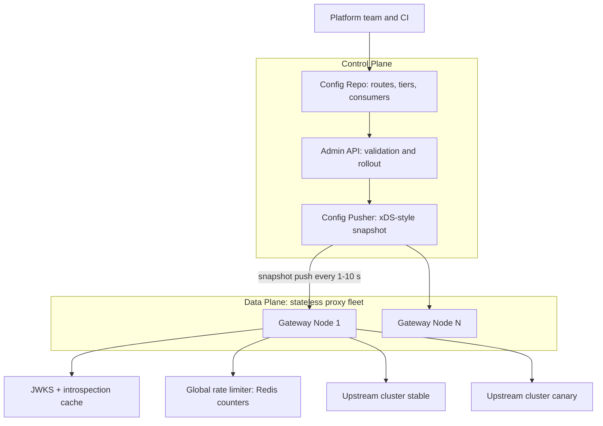
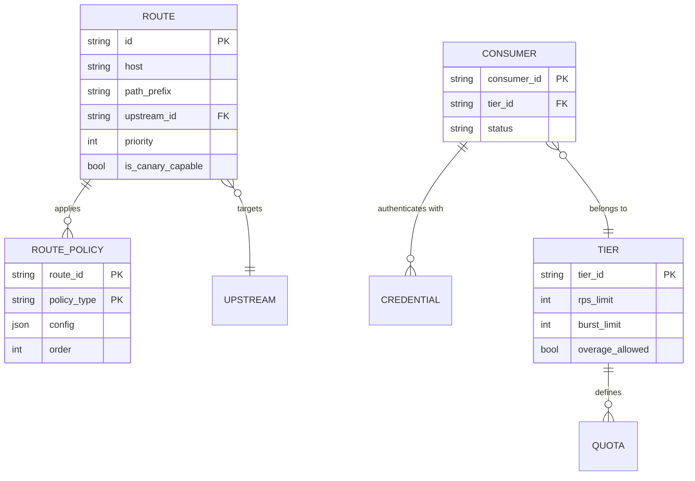
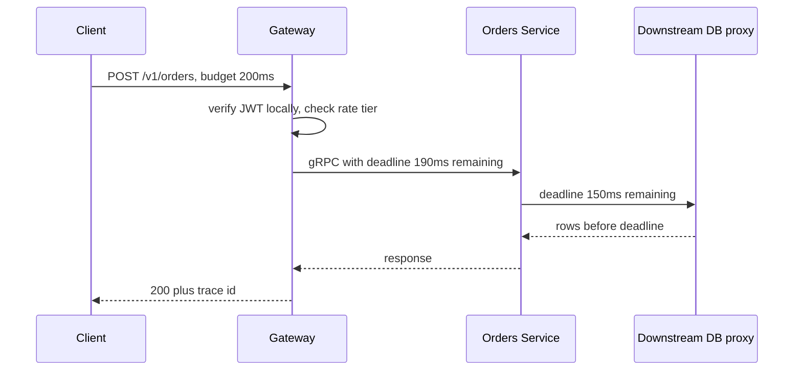
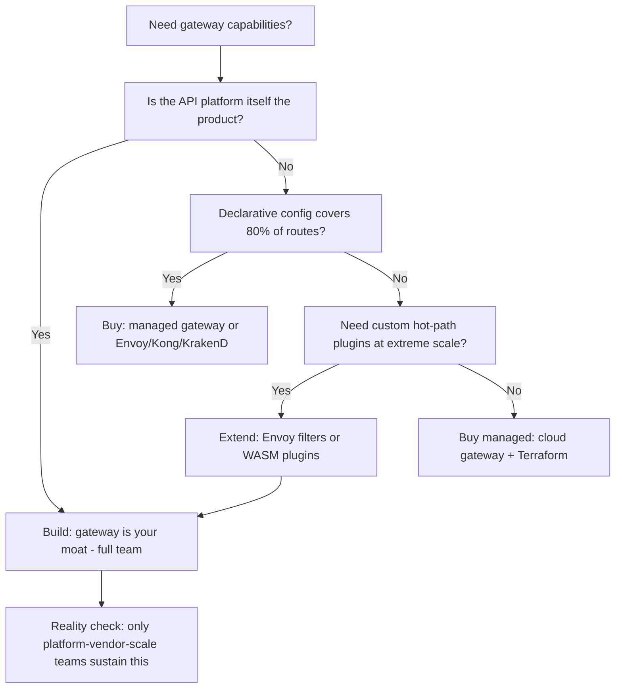

# Case Study: Design an API Gateway

## Overview

This is the interview-format walkthrough for designing the API gateway itself — the stateless proxy tier that terminates every external request: routing and versioning, auth offload, rate-limiting tiers, request transformation, and per-route canary releases. The existing [API Gateway](../../../backend/api/api-gateway.md) page covers what a gateway *is* and how to use one; this page builds one on a whiteboard, with the control-plane/data-plane split, hot-path latency accounting, SLO math for a component that sits on every request, and a build-vs-buy decision framework comparing Envoy, Kong, and KrakenD. It is a 40–45 minute L4/system-design question at companies that run their own edge, and the follow-up here always is: "the gateway is down — what does that cost you?"

## Step 1 — Requirements

### Functional

- Route requests by host, path prefix, headers, and query to internal upstreams; support multiple API **versions** side by side (`/v1/`, `/v2/`, header-negotiated)
- Offload authN/Z: verify JWTs locally, introspect opaque OAuth tokens, check scopes per route (see [OAuth 2.0 Internals](../../../security/oauth2-internals.md))
- Enforce rate limits per consumer with **tiers** (free/pro/enterprise), returning correct 429 + `Retry-After` semantics
- Transform requests/responses: header injection, path rewrite, JSON-to-gRPC transcription, response trimming for BFF-style aggregation
- Per-route **canary**: weighted traffic split with sticky routing, plus automatic rollback on error-budget burn
- Observability: structured access logs, per-route RED metrics, distributed-trace context propagation

### Non-Functional

- **Latency**: the gateway adds < 5 ms p99 of its own overhead on the hot path — it is inline on every request, so every millisecond is paid by every API
- **Availability**: 99.99% for the gateway itself; it must *degrade* (fail-open on optional policies) rather than fail closed for non-auth-critical routes
- **Scale**: 1M RPS peak, 200K concurrent connections, horizontal scale with no per-node session state
- **Config propagation**: route changes live in < 10 s; emergency kill-switch in < 1 s
- **Correctness**: rate limits and canary weights are approximate but *bounded* (never exceed quota by > 10%)

## Step 2 — Back-of-Envelope Estimation

| Quantity | Assumption | Result |
|---|---|---|
| Peak ingress | 1M RPS, 1 KB avg request and response | ~8 Gb/s in + 8 Gb/s out per direction |
| Pure proxy CPU | ~20 µs L7 forwarding work per request | ~20 cores per 1M RPS |
| With TLS, JWT verify, transforms | ×3–5 overhead | ~60–100 cores per 1M RPS |
| JWT verification | RS256 verify ≈ 50 µs cold | 50 cores if every request verifies fresh — hence JWKS caching and short-TTL token caches |
| Auth introspection (opaque tokens) | network call 1–3 ms | cacheable: TTL 60 s cuts call rate ~100× |
| Rate-limit state | 10M distinct consumers | hot-set ~1–2 GB in Redis, not per-node memory |
| Config size | 400 routes, 50 upstream clusters | < 1 MB snapshot — config is tiny; correctness of push is the problem, not size |

The number to anchor on: the data plane is embarrassingly parallel and cheap (N nodes = N × capacity, linear), while **the hard parts are the control plane (safe config distribution) and the shared state (rate limits, token caches)**. State that explicitly before drawing boxes — it is the difference between a senior and a junior answer.

## Step 3 — API and Configuration Sketch

A gateway has two surfaces: the **data path** (what clients hit) and the **admin/control API** (what platform teams and CI manage). Show both.

```text
Data path (client-facing — the gateway forwards, does not own business logic):
  ANY api.example.com/v1/**        → routed by host + prefix + header rules
  ANY api.example.com/v2/**       → versioned upstream, deprecation headers injected
  GET  /healthz, /readyz          → gateway self-check, no policies applied

Admin/control API (authenticated, audited, versioned in git):
  POST /admin/routes              → create route (idempotent by route id)
  PATCH /admin/routes/{id}/weights → shift canary traffic 95/5 → 90/10
  POST /admin/consumers           → register consumer, assign tier
  GET  /admin/routes/{id}/stats   → RPS, p50/p99, error class, canary deltas
  POST /admin/emergency/deny      → kill-switch route, propagates < 1 s
```

The declarative route config is the real contract — versioned in git, rendered by CI, pushed by the control plane:

```yaml
route:
  id: orders-v2
  match:
    host: api.example.com
    path_prefix: /v1/orders
  upstream: orders-v2.default.svc:8080
  policies:
    - jwt_verify:
        jwks_uri: https://auth.example.com/.well-known/jwks.json
        cache_ttl_s: 300
        required_scopes: ["orders:write"]
    - rate_limit:
        key: consumer_id
        tier: standard
    - timeout:
        connect_ms: 100
        response_ms: 2000
    - canary:
        upstreams: { stable: 95, canary: 5 }
        sticky_header: x-beta-user
```

## Step 4 — High-Level Architecture

The load-bearing decision is the **control plane / data plane split**: stateless proxies that only execute a compiled config snapshot, and a small, highly-correct control plane that owns the source of truth and pushes snapshots.



Design rules worth saying out loud:

- The data plane never talks to a database; it executes a **config snapshot** and holds the last-known-good copy in memory — a control-plane outage degrades deploy velocity, not traffic
- Config pushes are **atomic, versioned, and convergent**: every node applies the snapshot as a whole, reports its current version, and the pusher reconciles drift
- Optional policies (logging, transformation) can fail open; security policies (JWT verify, rate limit) fail closed per route class — this policy classification is itself part of the config schema

## Step 5 — Data Model



Two schema decisions matter in interviews:

- **Policies are an ordered list attached to routes**, not hardcoded middleware — the plugin pipeline is data, which is what makes per-route canaries, per-route auth, and per-route timeouts expressible without code changes
- **Consumers are separate from users**: a consumer is an API credential (mobile app, partner integration); tier assignment and quotas key on `consumer_id`, which keeps rate limiting orthogonal to end-user identity

## Deep Dive 1 — AuthN/Z Offload: JWT Verify vs Introspection Cache

Two auth models, two cost profiles:

**JWT (RFC 7519) verification is local and free-ish.** The gateway fetches the issuer's JWKS once (refresh every ~5 min and on unknown `kid`), verifies the RS256/ES256 signature in-process (~50 µs), and checks `exp`, `iss`, `aud`, and scopes. Zero network calls on the hot path. The cost is **revocation**: a stolen token is valid until expiry, so JWT access tokens must be short-lived (5–15 min) with refresh tokens handled by the auth service (see [JWT Internals](../../../security/jwt-internals.md)).

**Opaque tokens (OAuth 2.0, RFC 6749) require introspection (RFC 7662)** — a network call to the authorization server per request. Uncached, that adds 1–3 ms and couples the gateway's latency to the auth server's. The gateway therefore runs an **introspection cache** keyed by token hash with a short TTL (30–60 s): hit rate rises to ~99% because real clients reuse tokens across requests, and the staleness window bounds the revocation gap deliberately. State the trade-off in one sentence: *local JWT verification buys CPU at the price of a revocation gap; introspection buys revocation at the price of latency and an auth-server dependency, and a cache trades a bounded staleness window to get both.*

Failure modes to enumerate: JWKS fetch failure (serve from cached keys until TTL+grace, then fail closed on new tokens only), clock skew (allow ±60 s on `exp`/`nbf`), and scope checks that belong per-route in config, not in code.

## Deep Dive 2 — Rate Limiting Tiers Across 200 Nodes

Per-tier limits (illustrative):

| Tier | Sustained | Burst | Key | Overage behavior |
|---|---|---|---|---|
| Free | 10 rps | 20 | consumer_id | 429 + `Retry-After` |
| Standard | 100 rps | 200 | consumer_id | 429 |
| Enterprise | 1,000 rps | 5,000 | consumer_id | soft — alert only |
| Internal | 10,000 rps | — | service account | fail-open monitoring |

The engineering problem is that a strict global token bucket needs a shared counter, and a Redis round trip (0.3–1 ms) on every request is a hot-path tax and a Redis availability coupling. The production pattern is **two-level limiting**:

1. **Local per-node token bucket**, pre-divided: each node gets `global_limit / N_nodes` of quota with a refresh sync every ~100 ms. Atomic, zero network cost, absorbs bursts
2. **Global Redis counter** as the authoritative ceiling, checked asynchronously or every Kth request; the sync loop rebalances leftover quota toward hot nodes
3. Error bounded by design: total admitted traffic can exceed quota by roughly the sync-period skew (≤ ~10%), which the requirements explicitly allow

Decision to surface: **fail-open vs fail-closed when the limiter's Redis is down**. Free/standard tiers fail closed (protect upstreams), enterprise/internal fail open (protect the customer relationship), and the choice is a per-tier config flag, not a global constant. Deep mechanics of bucket algorithms and distributed counters: [Design: Rate Limiter](../rate-limiter.md) and [Rate Limiting](../../../backend/api/rate-limiting.md).

## Deep Dive 3 — Timeouts, Deadline Budgets, and Canary per Route

**Timeouts and budget propagation.** Every route carries explicit `connect_ms` and `response_ms`; defaults are forbidden because "no timeout" means "eventually every connection is stuck." On the request path the gateway starts a **deadline budget** and propagates the remaining time downstream (gRPC deadlines, or `x-deadline-ms` headers for HTTP): if the upstream chain needs 800 ms and the client gave 200 ms, the gateway rejects immediately rather than starting work it must abandon. Each hop subtracts its own overhead before forwarding the remaining budget, so the *cheapest* failure is the earliest one.



**Canary per route.** Splitting is per-route config: weighted upstream selection with optional stickiness (`x-beta-user` header or a cookie hash) so a tester lands on the same version every time. The rollout loop is closed on **error-budget burn rate**, not raw error rate:

- Stable baseline: 0.1% 5xx. Canary guard: if the canary's 5xx burn rate exceeds 4× baseline over a 5-minute window, weights auto-revert to 100/0 and page
- Math check: at 5% canary weight, a canary bug with 5% errors adds \\( 0.05 \\times 5\\% = 0.25\\% \\) fleet-wide — visible, but the burn-rate guard compares canary vs stable directly, which detects it in minutes at modest absolute customer impact

## Deep Dive 4 — SLO Math for a Component on Every Path

The gateway inherits the strictest SLO in the system because it multiplies into everything. Work the arithmetic out loud:

- 99.99% = **4.32 min of downtime per 30-day month** (43,200 min × 0.0001)
- The gateway is on a 3-hop chain with three upstreams at 99.95% each. End-to-end availability = \\( 0.9999 \\times 0.9995^3 \\approx 0.9984 \\) → 99.84%, i.e. a budget of ~69 min/month. **The chain, not the gateway, is the availability problem** — which is why gateways must shed and degrade rather than add single points of serialization
- Corollary: every optional policy must have a fail-open mode; the *only* mandatory work on the hot path is routing + rate limit + auth, and even auth has a per-route-class fail-open/closed flag

Build-vs-buy decision flow (the honest version):



| Dimension | Envoy | Kong | KrakenD |
|---|---|---|---|
| Model | Programmable L7 proxy; xDS config API | API gateway with plugin runtime | Declarative aggregator/BFF gateway |
| Config | Dynamic via xDS or static | Postgres-backed or DB-less declarative | Single stateless JSON config file |
| Extensibility | C++ filters, Lua, WASM | Go/Lua plugins, external services | Go plugins + built-in middleware |
| Response aggregation | Not built-in (pair with services) | Via plugins | First-class: endpoint-level aggregation |
| Best fit | Mesh ingress, custom control planes | Full API lifecycle management | Stateless composition, simple ops |
| Operational weight | Highest — you own the control plane | Medium (DB or DB-less) | Lowest — single binary, no state |

The verdict to state: **default to buy/extend (Envoy under a thin custom control plane is the industry default); build only when the gateway is the product.**

## Bottlenecks & Follow-Up Questions

- **Config push storms**: 400 routes × frequent deploys → pusher must dedupe and diff; follow-up: "a bad config bricks the fleet?" → last-known-good in memory + automatic rollback on agent health-check failure
- **JWKS endpoint latency**: first-request-after-key-rotation is slow; fix: background refresh before expiry + serve stale during rotation grace
- **Redis as rate-limit hotspot**: 200 nodes × 1M RPS hammering one Redis; fix: local pre-division (above), Redis cluster sharding by consumer hash, and approximate-mode degradation
- **Retry storms**: gateway retries amplify upstream outages; fix: per-route retry budgets (max 10% retries), exponential backoff with jitter, and retry only on idempotent methods (RFC 9110 §9.2.2; see [API Idempotency](../../../backend/api/api-idempotency.md))
- **Connection churn on deploys**: draining stateless proxies without dropping 200K keep-alive connections → listener drain mode + LB health-gate, never a hard restart
- **Version sprawl**: `/v1` sunset policy is config-as-data (deprecation headers + per-route deadline), enforced by the same canary machinery (see [API Versioning](../../../backend/api/api-versioning.md))

## Interview Questions

1. **Why verify JWTs at the gateway instead of in each service?** Centralized verification keeps key management, JWKS rotation, and scope logic in one audited place and removes ~50 µs of per-request crypto work from every service. Services then consume a trusted identity header. The counter-argument to acknowledge: defense in depth — services should still reject untrusted traffic at the network level, and zero-trust meshes re-verify per hop (the gateway-offload model and the mesh model coexist in most real stacks).
2. **JWT verify vs OAuth introspection — when do you pick each?** JWT when tokens are short-lived and revocation windows of minutes are acceptable: verification is local, ~50 µs, no auth-server dependency on the hot path. Introspection when revocation must be near-immediate or tokens are opaque: pay 1–3 ms and cache the result 30–60 s so the revocation gap is bounded and known. Most real systems run both and the choice is per-token-type config, which is exactly why auth is a *policy* in the route schema.
3. **How do you rate limit globally across 200 gateway nodes without a Redis call per request?** Two-level limiting: each node holds a pre-divided local token bucket (quota/N) refreshed by a ~100 ms sync loop, with Redis as the authoritative ceiling checked asynchronously. The admitted traffic overshoots the true quota by at most the sync-period skew — bound it in the requirements (≤ 10%) instead of pretending the counter is exact. When Redis dies, per-tier fail-open/closed flags decide behavior.
4. **The gateway sits in front of three 99.95% upstreams. What SLO can the end-to-end path promise?** Multiply: \\( 0.9999 \\times 0.9995^3 \\approx 0.9984 \\), so ~99.84% and roughly 69 min/month of budget. The insight the interviewer wants: adding the gateway at 99.99% barely moves the number; the chain is dominated by the weakest hops, so availability work belongs in graceful degradation (fail-open policies, load shedding, multiple upstream zones), not in gold-plating the proxy.
5. **How does per-route canary release work, and what triggers rollback?** The route config declares weighted upstreams (95/5) with optional sticky headers for deterministic tester routing. Rollback is automated on error-budget burn rate: canary 5xx burn exceeding 4× the stable baseline over 5 minutes flips weights to 100/0 and pages. Burn rate beats raw error rate because it is relative to baseline — a noisy-but-healthy canary does not roll back, while a quiet 10× regression does.
6. **Build or buy?** Enumerate the decision inputs: is the API platform the product (build), do 80% of routes fit declarative config (buy), do you need custom hot-path logic at extreme scale (extend Envoy with filters/WASM)? The default for almost every company is Envoy/Kong/KrakenD or a managed cloud gateway; the gateway you own is a permanent tax of control-plane correctness, upgrades, and security patching that only platform-vendor-scale teams justify.

## Key Takeaways

- Split control plane from data plane on day one: stateless proxies execute versioned config snapshots; the control plane owns source of truth and convergent pushes
- The gateway's SLO must beat every upstream's because it multiplies into all of them — 99.99% here means 4.32 min/month and mandatory fail-open modes for optional policies
- Auth offload is a trade: local JWT verify (cheap, revocation gap) vs introspection cache (revocable, bounded staleness, auth-server dependency)
- Rate limiting at fleet scale is approximate by design: local pre-divided buckets + async global ceiling, with per-tier fail-open/closed as config, not code
- Deadline budgets propagate; the cheapest failure is the earliest — reject work the remaining budget cannot complete
- Canary is per-route config closed on burn rate (4× baseline over 5 min → auto-revert), which is why policies-as-data beats policies-as-middleware
- Build only if the gateway is your product; otherwise Envoy (extend), Kong (lifecycle), or KrakenD (stateless aggregation) — pick by operational weight

## References

- Envoy Proxy documentation — data plane, filters, xDS control protocol: https://www.envoyproxy.io/docs
- Kong Gateway documentation: https://docs.konghq.com/
- KrakenD documentation — declarative API aggregation: https://www.krakend.io/docs/
- Kubernetes Gateway API — the standard north-south proxy interface: https://gateway-api.sigs.k8s.io/
- RFC 7519 — JSON Web Token (JWT): https://datatracker.ietf.org/doc/rfc7519/
- RFC 6749 — OAuth 2.0 Authorization Framework: https://datatracker.ietf.org/doc/rfc6749/
- RFC 7662 — OAuth 2.0 Token Introspection: https://datatracker.ietf.org/doc/rfc7662/
- RFC 9110 — HTTP Semantics, idempotent methods (retry safety): https://datatracker.ietf.org/doc/rfc9110/
- Google SRE books — SLOs, error budgets, load shedding: https://sre.google/books/

## Cross-References

- [Design: Rate Limiter](../rate-limiter.md) — token bucket algorithms and distributed counters behind the tier system
- [HLD: API Design](../hld/api-design.md) — the client-facing design principles the gateway enforces mechanically
- [Backend: API Gateway](../../../backend/api/api-gateway.md) — the usage-oriented overview this case study complements
- [Backend: API Versioning](../../../backend/api/api-versioning.md) — version-sunset mechanics the gateway implements as config
- [Backend: Rate Limiting](../../../backend/api/rate-limiting.md) — algorithm details (token bucket, sliding window, quotas)
- [Security: JWT Internals](../../../security/jwt-internals.md) — signature verification, key rotation, revocation semantics
- [Security: OAuth 2.0 Internals](../../../security/oauth2-internals.md) — the authorization flows whose tokens the gateway introspects
- [Case Study: Ticketmaster](./ticketmaster.md) — sibling case study; edge protection and metering under hostile traffic
