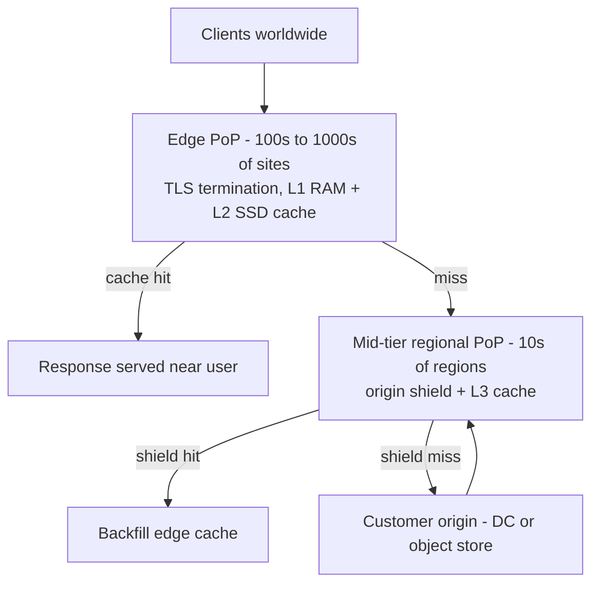
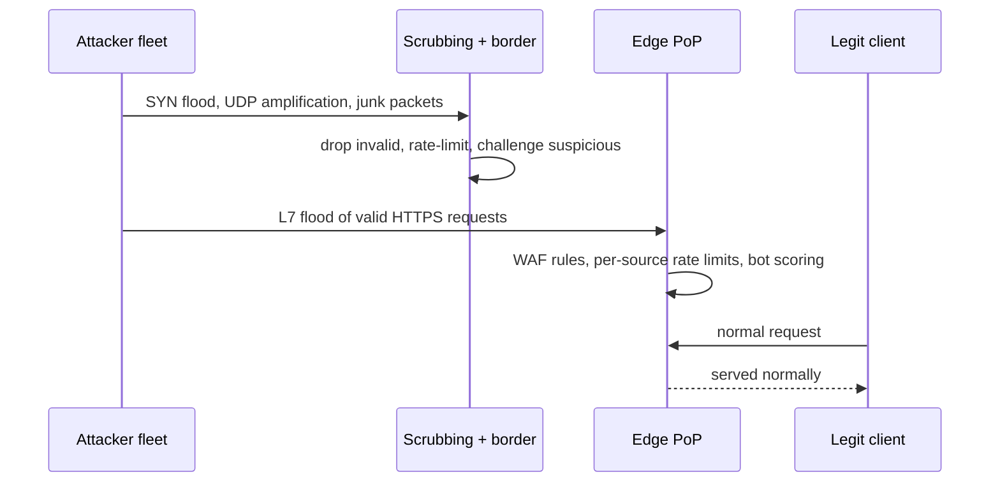
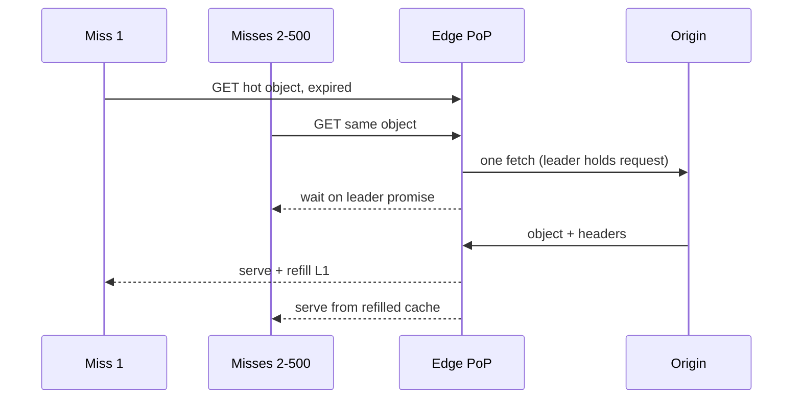

# Case Study: Design a CDN (Cloudflare/Akamai/CloudFront End-to-End)

## Overview

"Design a CDN" is the interview where you prove you understand the internet's delivery layer as a *system*: a global reverse-proxy fabric that terminates TLS close to users, caches with explicit keys and TTLs, absorbs volumetric attacks by simply being in the path, and accelerates even uncacheable content through route and transport optimization. This page is the end-to-end service design answer — PoP hierarchy with shields, cache keys and instant purge at scale, edge TLS, dynamic acceleration, DDoS absorption, signed URLs, and the hit-ratio economics that justify the whole thing. The mechanics pages [How a CDN Works](../../../networks/cdn/how-it-works.md), [Edge Computing](../../../networks/cdn/edge.md), and [Anycast and Geo-Aware Routing](../../../networks/cdn/anycast-and-geo-routing.md) cover the request-journey and routing fundamentals; here you practice assembling them into a 45-minute design answer, the way you would also for the video case in [Real-World: Video Streaming Platform](../real-world/video-streaming.md).

## Step 1 — Requirements

### Functional

- Serve cacheable content (static assets, media segments, API responses with short TTLs) from locations near users, honoring standard HTTP caching semantics (RFC 9111)
- **Purge/invalidation API**: URL-level, tag-level (surrogate keys), and purge-everything, propagating globally in seconds
- **TLS termination** for customer domains: cert automation (ACM-style), SNI, modern protocol versions
- **Dynamic content acceleration**: proxy uncacheable requests faster than the public internet would (route optimization, connection reuse, better transport)
- **Security**: DDoS absorption (L3/L4/L7), WAF, bot management, rate limiting as a first-class API
- **Access control**: signed URLs/cookies and token auth for private content
- Analytics: per-customer logs and metrics (requests, hit ratio, bandwidth, status codes)

### Non-Functional

- **Footprint**: hundreds to thousands of PoPs, multi-Tbps aggregate egress capacity — the footprint *is* the product
- **Latency**: edge-serve cache hits with RTT < ~50 ms to most users; dynamic paths measurably faster than origin-direct
- **Availability**: the CDN must survive being attacked while serving — scrubbing and redundancy are part of the data path, not an add-on
- **Origin protection**: customer origins should see only a small fraction of request volume (high offload)
- **Correctness**: a stale serve is a product bug for news/e-commerce customers — purge guarantees are contractual

## Step 2 — Back-of-Envelope: Hit-Ratio Economics

A CDN is an economic argument: bandwidth near users is cheaper than bandwidth at origin, and offload removes origin capacity costs. Work the numbers for one fictional customer and the design's value is explicit.

| Quantity | Assumption | Result |
|---|---|---|
| Request volume | 500K requests/s static+API mix | ~43B requests/day |
| Egress | avg 1 MB/request on static paths | ~500 Gbps sustained, ~1.5 Tbps peak |
| Edge hit ratio (requests) | tuned static config | 95–98% of requests never reach origin |
| Origin load | 500K × 3% misses | ~15K requests/s, ~15 Gbps — a ~30× origin offload |
| Volume vs request offload | large objects hit more than small | volume offload (say 99%) > request offload — report both |
| Popularity | Zipf-ish (α ≈ 0.8–1) | top ~10% of URLs ≈ 80–90% of hits — L1 RAM holds the head |
| Purge fan-out | one purge, N PoPs | must invalidate matching keys at every PoP within seconds |
| Dynamic share | 10–30% of requests uncacheable | still routed through the fabric for TLS, security, acceleration |

The sentences to verbalize: cache *request* offload and cache *byte* offload are different numbers and customers care about both; and the origin only surviving 3–5% of traffic is what lets customers run origins sized for 1/30th of their peak.

## Step 3 — Architecture: PoP Hierarchy



- **Edge PoPs** are small, numerous, and dense with SSD — they terminate TLS, apply WAF/rate-limit rules, and serve the hot head of the Zipf distribution from RAM/SSD
- **Mid-tier (shield) PoPs** are fewer and bigger: all edge misses for a region funnel into one shield, so the origin sees one consolidated miss population instead of one per edge site. The math: edge miss 5% × shield miss 5% = 0.25% origin requests — a 20× reduction versus edge-direct-to-origin, and it converts origin fetch fan-out into CDN-internal traffic
- **Purges and routing** are control-plane problems: a global control plane distributes config and purge journals to every PoP; routing is anycast (same IP announced from all sites, BGP picks "nearest") blended with GeoDNS for policy control — details in [Anycast and Geo-Aware Routing](../../../networks/cdn/anycast-and-geo-routing.md)

| Vendor | Reported footprint (public figures) | Distinctive shape |
|---|---|---|
| Akamai | ~4,000+ edge points of presence, 130+ countries, 1,300+ networks | deepest tier-1 embedment, most mid-tier hierarchy |
| Cloudflare | ~330+ cities in 120+ countries | every PoP is also compute (Workers) and security |
| AWS CloudFront | 600+ PoPs in 100+ cities, regional edge caches | regional edge cache layer = shield tier |
| Fastly | ~100 PoPs, dense SSD, heavy RAM head | tiny footprint, all-SSD, instant purge focus |

Real numbers to cite: Cloudflare's 1.1.1.1 resolver and Akamai's DNS run on anycast for exactly this reason; Cloudflare reports blocking HTTP floods that grew from ~17M requests/s (2021) to ~200M requests/s (2023), and Fastly reports global purge propagation on the order of ~150 ms.

PoP build economics close this section well: an edge PoP is racks of proxy hardware with NVMe/SSD tiers, top-of-rack switching, and transit/peering — the marginal costs are bandwidth, power, and rack space, and the marginal benefit is RTT plus local offload. Akamai's ~4,000-site footprint is largely about embedding inside ISP networks (lower RTT, cheaper transit); Cloudflare's ~330-city footprint leans on peering density and free-tier security to fill capacity. In an interview, the footprint shape follows the customer mix: video offload wants dense regional sites with big disks, API acceleration wants small sites close to eyeballs and mobile networks.

## Deep Dive 1 — Cache Keys, Cache-Control, and Purge at Scale

The cache key decides both the hit ratio and the correctness. Too broad and you serve one user's personalized page to another; too narrow and the hit ratio collapses.

```text
cache key = scheme + host + path + normalized query (whitelist or blacklist)
          + Vary-derived fields (Accept-Encoding: br|gzip, device class)
          + customer-configured fields (cookie segments, country, auth state)
```

| Directive | Meaning at origin | CDN behavior |
|---|---|---|
| `max-age=31536000, immutable` | content never changes under this URL | long TTL; pair with content-hashed filenames |
| `s-maxage=N` | TTL for shared caches only | CDN honors over browser `max-age` |
| `no-cache` | reuse requires revalidation | CDN revalidates with `If-None-Match`/`If-Modified-Since` (304s are cheap) |
| `no-store` | never store | pass-through; also disables purge semantics (nothing stored) |
| `private` | browser-only | CDN must not cache shared |
| `stale-while-revalidate=N` | serve stale ≤ N while refreshing | kills the TTL-expiry latency cliff |
| `stale-if-error=N` | serve stale if origin fails | availability feature for origin outages |
| `Vary: *` / unsupported Vary | varies per request | safest default: do not cache |

- **Purge at scale** is a distributed log problem: the purge API appends to a global journal; every PoP tails it and evicts matching keys. URL purges propagate in seconds (Cloudflare documents up to ~30 s worst case; Fastly advertises ~150 ms globally on its smaller footprint). Full purge-everything is a last resort because it annihilates the hit ratio for minutes
- **Tag-based purge** (`Cache-Tag: product-42`) is the operational workhorse for e-commerce: origin sends tags, the control plane purges everything matching the tag. This is what makes "price changed" propagate without knowing every URL it affects
- **Purge flavors have different blast radii**, and naming them shows operational maturity: hard purge evicts and forces revalidation; soft purge marks stale but keeps serving stale-while-revalidate (no latency cliff, no stampede); purge-by-prefix/hostname is the middle ground; purge-everything is the incident button. Rate-limit all of them — a misconfigured deploy pipeline purging in a loop is a self-inflicted origin DDoS
- **Versioned deploys beat purges**: content-hashed asset URLs (`app.a19f3c.js`) plus long immutable TTLs mean deployments never need purges at all — the purge API exists for the data you *cannot* version (HTML, API responses). See [Caching Strategy](../hld/caching-strategy.md) for the application-side playbook

## Deep Dive 2 — TLS Termination and Connection Handling at the Edge

Terminating TLS at the edge is the single biggest latency lever, because it replaces one long-distance handshake with a short one plus an already-warm path to origin.

- **TLS 1.3 (RFC 8446)**: 1-RTT handshakes and 0-RTT resumption for repeat visitors; session tickets/resumption cut handshake cost for the majority of real-world traffic. The edge holds the customer's cert (SNI-based selection) and automates issuance/renewal
- **Protocol mix**: HTTP/2 over TLS for browser multiplexing; QUIC/HTTP3 (RFC 9000) eliminates TCP+TLS handshake stacking and survives client IP changes (mobile handoffs) — CDNs were the first large deployers precisely because they control both ends' infrastructure
- **Origin connection pooling**: keep-alive pools per origin, warm TLS to origin, so an edge miss costs no new handshake — the miss path inherits an established connection. This is where much of the "dynamic acceleration" benefit actually hides
- **OCSP stapling and ECDSA certs** shave handshake bytes; cert transparency and rotation are control-plane automation, not per-request work
- **0-RTT comes with a replay caveat**: TLS 1.3 early data can be replayed by an attacker, so CDNs mark it and forbid non-idempotent methods (`POST`) on 0-RTT — a one-sentence answer that shows you read the RFC instead of the marketing

The interviewer probe to expect: "isn't TLS termination a security hole?" Answer: it is the standard model — the CDN is in the trust boundary by contract; end-to-end TLS to origin (origin pull over TLS with mutual auth) protects the edge→origin leg, and customers with compliance needs use keyed-request auth so the CDN can serve without decrypting bodies at all.

## Deep Dive 3 — Dynamic Content Acceleration

Uncacheable content (APIs, POSTs, personalized HTML) still rides the fabric because the CDN can be faster than the public internet even with zero cache hits.

- **Route optimization**: measure path quality between PoPs continuously (per-prefix RTT/loss/packet-arrival), then route origin-bound traffic over monitored paths (private backbone where available) instead of default BGP paths — Cloudflare's Argo reports up to ~30% latency improvement on such routes. This is *control-plane routing above BGP*, layered on anycast ingress
- **Transport upgrades on the lossy last miles**: BBR (Google's model-based congestion control, source and papers at https://github.com/google/bbr) reports 2–25× throughput gains over CUBIC on lossy paths; CDNs enable BBR (and QUIC) on the client↔edge leg where loss lives, while keeping loss-robust paths internally
- **Connection economics**: aggregation is the quiet superpower — 100K client connections multiplex onto a few dozen pooled origin connections; the origin's SYN/TLS load collapses, and its congestion windows stay warm
- **Edge compute** as the extension: auth checks, header rewrites, A/B splits, and personalization run at the PoP (V8 isolates, ~0 cold start) so "dynamic" requests that need origin data make exactly one origin call — see [Edge Computing](../../../networks/cdn/edge.md)

When it does *not* help: origins on well-peered paths and intra-region traffic where the public path is already optimal — say so, because knowing the limits of acceleration scores better than claiming magic.

## Deep Dive 4 — DDoS Absorption and Signed URLs

The CDN is in the request path anyway, so it is the natural place to die *instead of the customer*.



- **L3/L4 volumetric floods** are absorbed by capacity and anycast spreading: the attack divides across every PoP announcing the prefix, and border ACLs / hardware dropping discard garbage before it costs CPU. BGP-level engineering (RFC 4271) plus anycast is the whole defense — capacity is the moat, which is why CDN security rides on CDN footprint
- **L7 floods of valid requests** cannot be dropped by the network — they need per-source rate limiting, bot scoring, and managed challenges at the edge; the same token-bucket machinery customers use is in [Rate Limiter](../rate-limiter.md), applied at global scale with per-customer rules
- **Signed URLs** protect private content on shared caches: the origin (or an auth service) mints expiring, scoped tokens; the edge verifies the HMAC *before* cache lookup, and the token is part of the cache key's auth field so one user's authorized copy is never served to another

```text
token  = base64url(payload) + "." + base64url(HMAC-SHA256(key, payload))
payload = { "path": "/videos/ep12/seg-041.m4s", "exp": 1735689600, "scope": "read" }
edge check order:
  1. exp >= now            (reject expired)
  2. HMAC matches payload  (reject forgery)
  3. payload.path == requested object (reject scope confusion)
```

- Signed **URLs** for single objects, signed **cookies** for whole sessions of objects (video players fetching hundreds of segments — this is the pattern behind the streaming design in [Real-World: Video Streaming Platform](../real-world/video-streaming.md))
- Short expiries + narrow scopes bound link-sharing; hotlink protection is the same mechanism with a Referer/token check

## Deep Dive 7 — Purge Correctness, Staleness, and Failure Modes

The failure modes interviewers probe are all "the cache lied":

- **Stale-serve incidents**: origin deploys new content but a PoP serves old — prevention is versioned URLs by default, purge SLAs in seconds, and `stale-while-revalidate` only for content the customer opted in. Monitoring must alert on *age* distribution per URL class, not just hit ratio
- **Thundering herd on popular objects**: one viral object expires across 300 PoPs simultaneously and 300 origin fetches stampede. Fix: shield consolidation (one regional fetch), request coalescing (Deep Dive 5), and jittered TTLs on very hot objects
- **Cache key drift**: a customer adds a query param and hit ratio silently halves; the fix is key-normalization config with hit-ratio-per-key-pattern dashboards so drift is visible in hours, not months
- **Purge storm economics**: purge-everything after an incident converts a 97% offload CDN into an origin DDoS against itself — pair purge-everything with rate-limited origin fetches and request coalescing so the re-warm is gradual
- **Origin failures**: `stale-if-error` keeps serving last-known-good; health-checked failover to secondary origins (multi-CDN setups) is the enterprise pattern, with DNS/steering-level failover in [Anycast and Geo-Aware Routing](../../../networks/cdn/anycast-and-geo-routing.md)

## Deep Dive 5 — Request Coalescing, Stampedes, and the Warm-Start Path

The dangerous moments are transitions: a hot object expiring, a purge landing, a PoP coming online. Each converts a cache into a synchronized origin fetch.



- **Request coalescing (single-flight)**: on a miss for a key already being fetched, the PoP parks the request on the in-flight fetch instead of forwarding — 500 concurrent misses produce exactly one origin request. This is the edge-scale version of the lease-token herd protection pattern, and it is what makes purge storms and expiry cliffs survivable
- **TTL jitter** on very hot objects desynchronizes expiry across PoPs — 300 sites should not all miss at 12:00:00 sharp; a ±10% jitter spreads the load
- **Warm-start**: a new PoP (or one recovered from failure) starts at 0% hit ratio; pre-populate the Zipf head from a regional snapshot before admitting traffic, and admit it gradually — otherwise every PoP recovery is a mini origin-stampede

## Deep Dive 6 — Observability, SLAs, and the Multi-CDN Reality

A CDN is only as good as its dashboards: the customer's mental model is "my origin survives," so the metrics that matter are offload and age, not just hits.

- **Hit ratio by class**: report per content-class (HTML, images, video segments, API), per key-pattern, and per PoP tier — a blended 96% can hide a 40% hit ratio on the one class the customer cares about. Track byte offload separately from request offload
- **Age distribution**: the p99 `Age` header per URL class is the staleness alarm — it catches broken revalidation long before customers do. Pair with origin egress spikes as a cross-check (a spike means misses leaked)
- **Logs at real scale**: 43B requests/day at ~1 KB of log is ~43 TB/day raw — sample aggressively, aggregate at PoPs, and ship two streams: full-detail sampled logs for forensics, per-minute pre-aggregates for dashboards. Log volume is a first-order cost line, not an afterthought
- **SLAs and credits**: availability and purge-propagation SLAs are contractual; monitoring must measure from the customer's vantage (synthetic probes per region), not from inside the fabric
- **Multi-CDN steering**: enterprises run 2+ CDNs and steer per-region/per-ISP by RUM scores (real-user latency collected via a JS beacon or DNS-level probes). The hard parts are consistency — purge must propagate to every vendor — and cost attribution, since steering decisions move bandwidth bills by millions per year. This is where the purge API contract and per-vendor metrics normalization become the actual engineering problem

## Bottlenecks & Follow-Up Questions

- **Long-tail cache misses**: content below the Zipf head rarely justifies edge RAM — L3/HDD tiers and shields exist for it; follow-up: "what if the long tail is huge?" → origin-shield-first architectures and origin capacity sized to tail misses
- **Regional flash events** (ticket on-sales, product launches): purge + stampede + regional surge at once; follow-up: pre-warming APIs (push objects to edge before the event) and queue-at-edge for the origin
- **Multi-CDN steering**: customers run 2+ CDNs; follow-up: RUM-based steering (per-ISP/per-region performance scores) and consistent purge across vendors — the purge API contract becomes the hard part
- **Key rotation for signed URLs**: rotating HMAC keys invalidates outstanding tokens; follow-up: key-id in token, dual-key validation window, short expiries to bound exposure
- **HTTP/3 adoption gaps**: QUIC (UDP 443) blocked on some networks; follow-up: always advertise TCP fallback, happy-eyeballs style racing
- **Cost vs performance trade-off**: more PoPs = lower RTT but worse per-PoP hit ratio; the shield tier is exactly the reconciliation of that tension — say this sentence and the design hangs together

## Interview Questions

1. **Why the mid-tier shield layer, quantitatively?** Edge hit ratios cap out around 90–98% depending on content, and every edge PoP misses *independently* — 300 PoPs at 95% each means the origin sees 5% of global traffic spread across 300 distinct fetch populations. Funneling misses into ~20–40 regional shields consolidates those populations; a 95% shield hit ratio on the 5% edge-miss stream drops origin requests to 0.25% — a 20× origin offload improvement — and collapses origin fan-out (300 independent fetches per cold object → ~20). The cost is one extra hop of latency on misses, which is nearly always worth it.
2. **How does instant purge work at thousands of PoPs, and what are its limits?** Purges are a control-plane log: the API appends a purge entry (URL, tag, or zone), PoPs tail the journal and evict matching keys, achieving global propagation in seconds (Cloudflare documents up to ~30 s; Fastly ~150 ms on a smaller footprint). Limits: purge-everything destroys offload and can stampede the origin (rate-limit re-warm, request coalescing); tags require origin cooperation to annotate; and purges cannot fix a wrong cache *key* — if personalization leaked into a shared key, you purge then fix the key, not vice versa.
3. **Walk me through the cache key design for an e-commerce PDP vs a personalized API.** PDP: key on scheme+host+path+language+device-class, with personalization (cart count) injected client-side or via ESI — long TTLs plus `Cache-Tag: product-{id}` for price-change purges. Personalized API: `no-store`/`private` or an auth-scoped key with very short TTL; often best served dynamic through the accelerator path instead. The discipline: enumerate what *varies the response* (encoding, device, country, auth) and put exactly that in the key — nothing more, nothing less. Both hit ratio and correctness live in this one decision.
4. **How does the CDN accelerate content it cannot cache?** Four compounding mechanisms: anycast ingress puts a PoP 10–20 ms from the user instead of 100+; pooled, warm TLS connections to origin remove handshake costs from the miss path; route optimization picks better inter-PoP/inter-ISP paths than default BGP (Cloudflare Argo reports up to ~30% improvement); and modern transport (QUIC, BBR on lossy legs) recovers throughput where packet loss lives. None of them beat physics — they remove handshakes, loss penalties, and bad routes, which is most of the gap.
5. **Design signed URLs for a video platform serving hundreds of segments per playback.** Per-segment signed URLs work but mint-hundreds-of-tokens is clunky; the production pattern is one signed *cookie* per session: auth service verifies the user, sets `__Secure-Token` = HMAC(payload{customer, content-id, exp≈now+4h}) for a path prefix; the edge validates HMAC + expiry before cache lookup and includes the auth class in the cache key so tokens map to the same cached objects safely. Rotate keys with key-ids and dual-validation windows; short expiries bound replay of shared links.
6. **A botnet floods a customer with valid HTTPS GETs on one URL — what happens?** Network-layer defenses see nothing wrong; this is an L7 problem. The edge applies per-customer rate limits (token buckets keyed by IP/JA3/geo), bot scoring challenges the marginal sources, and the cache absorbs a large share since the URL is hot — the origin may not even notice. If the object is uncacheable, the last line is rate-limiting plus serving degraded (e.g., stale) responses and shedding marginal traffic — the same backpressure vocabulary as [Backpressure](../backpressure.md) applied at global scale. The honest answer includes: at ~200M rps-class floods, capacity is the difference between mitigation and outage.

## Key Takeaways

- The CDN is three planes in one answer: data path (TLS + cache + proxy), control plane (config, routing, purge journal), and security plane (scrubbing, WAF, rate limits) — structure your whiteboard around them
- PoP hierarchy is an economic machine: edge = RTT + hot cache, shield = origin fan-out consolidation (5% × 5% = 0.25%), origin sized for what survives both
- Cache key design and purge guarantees are the correctness story; versioned URLs plus tag purges cover 95% of real invalidation needs
- Dynamic acceleration = anycast ingress + connection pooling + route optimization + QUIC/BBR — say what each removes (handshakes, loss, bad routes), not "it's faster"
- DDoS defense is footprint plus protocol: anycast spreads volumetric attacks, border drops junk, and L7 needs rate limiting/bot scoring at the edge
- Signed URLs/cookies with HMAC + expiry + scope are how shared caches serve private content safely; auth class belongs in the cache key
- Report request offload and byte offload separately; hit-ratio economics (origin offload × bandwidth delta) is what closes the design

## References

- Cloudflare developer documentation — purge API, cache keys, edge behavior: https://developers.cloudflare.com/
- Akamai TechDocs — edge configuration and purge contracts: https://techdocs.akamai.com/
- Fastly developer documentation — instant purge and surrogate keys: https://developer.fastly.com/
- Fastly API reference — purge and cache-control endpoints: https://developer.fastly.com/reference/api/
- Amazon CloudFront documentation — regional edge caches, signed URLs/cookies: https://docs.aws.amazon.com/cloudfront/
- RFC 9111 — HTTP Caching (Cache-Control semantics): https://datatracker.ietf.org/doc/rfc9111/
- RFC 8446 — TLS 1.3: https://datatracker.ietf.org/doc/rfc8446/
- RFC 9000 — QUIC: A UDP-Based Multiplexed and Secure Transport: https://www.rfc-editor.org/rfc/rfc9000.html
- RFC 4271 — Border Gateway Protocol 4 (the anycast substrate): https://datatracker.ietf.org/doc/rfc4271/
- Google BBR — source, papers, and measurement data for BBR v1–v3: https://github.com/google/bbr
- Cardwell, Cheng, Gunn, Yeganeh, Jacobson, "BBR: Congestion-Based Congestion Control," Communications of the ACM / ACM Queue, 2017 (no URL cited — see the BBR repository above for linked papers)
- Grigorik, I., "High Performance Browser Networking" — transport, TLS, and HTTP performance fundamentals: https://hpbn.co/
- Google SRE books — load shedding and overload behavior behind edge rate limiting: https://sre.google/books/

## Cross-References

- [How a CDN Works](../../../networks/cdn/how-it-works.md) — the request-journey mechanics (DNS → edge → shield → origin) this page designs around
- [Anycast and Geo-Aware Routing](../../../networks/cdn/anycast-and-geo-routing.md) — BGP anycast vs GeoDNS, failover caveats, connection drift
- [Edge Computing](../../../networks/cdn/edge.md) — edge compute platforms riding the same PoPs
- [Real-World: Video Streaming Platform](../real-world/video-streaming.md) — the largest CDN customer: segment caching, signed cookies, origin shields
- [Caching Strategy](../hld/caching-strategy.md) — application-side cache-control and invalidation playbook
- [Rate Limiter](../rate-limiter.md) — the L7 defense machinery applied per-customer at the edge
- [Backpressure](../backpressure.md) — load-shedding vocabulary for stampede and overload scenarios
- [AWS CloudFront](../../../cloud/aws/cloudfront.md) — one vendor's concrete implementation mapped to this design
- [References: Networking Library](../../../references/networking.md) — verified primary sources for CDN vendors, QUIC, and BBR
