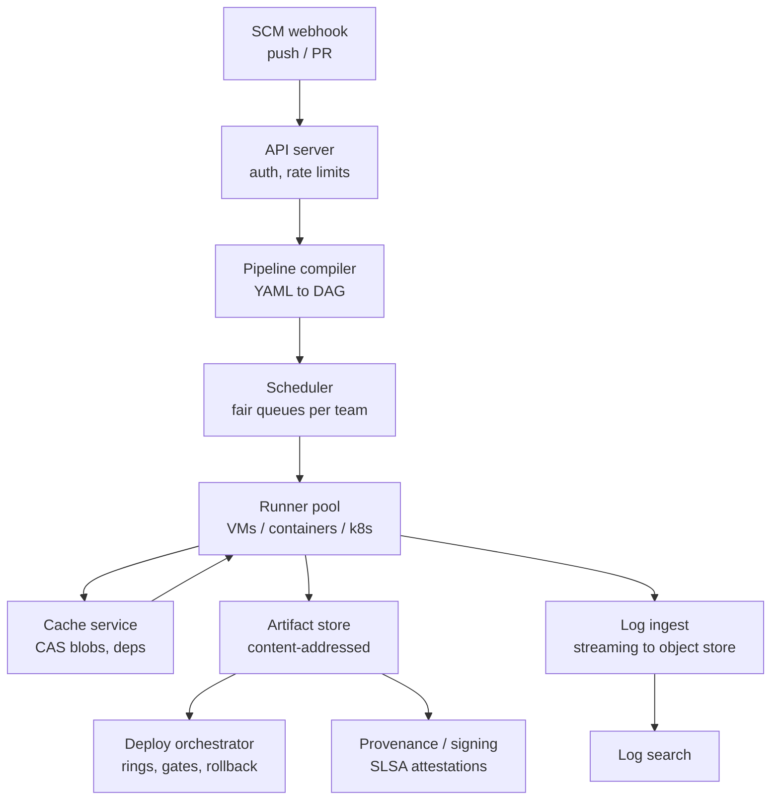

# Design a CI/CD System

## Overview

A CI/CD platform is one of the largest internal distributed systems a company runs: it turns every commit into a directed acyclic graph of builds, tests, and deployments, executing millions of tasks per day across shared runner fleets. GitHub Actions, GitLab CI, Buildkite, and Google's internal systems all converge on the same architecture — content-addressed artifacts, lease-based task queues, and progressive delivery — which makes it an excellent interview case study for combining queues, caching, and orchestration. The interview probes whether you can reason about fairness under load, hermetic builds, and the failure blast radius of a deploy system that can break production.

> **Interview Angle**: Expect follow-ups on cache poisoning and supply chain (a build system is an attack surface), on flaky-test economics, and on why merge queues exist. Candidates who have operated CI at scale always mention warm pools and cache hit rates unprompted.

## Requirements & Estimation

**Functional**: trigger on push/PR/schedule/API; define pipelines as code (YAML DAG); run builds/tests in isolated environments; store artifacts and logs; promote through deploy rings with gates; roll back.

**Non-functional**: p99 trigger-to-agent latency < 10s for first job; queue fairness across teams; 99.9% control-plane availability (a CI outage blocks the whole org); logs retained 90 days; artifacts 1 year; reproducible builds (same commit + inputs → same artifact hash).

Scale math for a 5,000-developer org:

- ~40 pushes/developer/day and ~10 PR updates → ~250k pipeline runs/day ≈ 3 QPS average, but 10-30x bursts after incidents or at merge rush; plan for 100 QPS of job submissions.
- Average job: 4 vCPU, 8 GB, 6 minutes; ~1M jobs/day → ~4,000 concurrent-average jobs, 12,000+ at peak → runner fleet of ~15-20k executors (VM or container) with autoscaling.
- Artifact write: average 200 MB per build × 250k = ~50 TB/day new artifacts; content-addressable storage with dedup typically cuts unique bytes 5-10x (dependencies repeat).
- Logs: ~50 MB per job × 1M = 50 TB/day written, mostly cold after a week — tiered storage mandatory.



## API and Data Model

Sketch an API surface; the interviewer wants resources, not REST piety:

```
POST /pipelines                 # register pipeline definition
POST /runs                      # trigger run (commit SHA, pipeline ref, params)
GET  /runs/{id}                 # status, stage graph
POST /runs/{id}/cancel
GET  /runs/{id}/logs/{job}      # streaming
GET  /artifacts/{run}/{name}    # immutable, CAS-backed
POST /deployments               # promote artifact to ring
POST /deployments/{id}/rollback
```

Core tables: `runs(run_id, commit_sha, pipeline_ref, status, queued_at, started_at, finished_at, trigger)`, `jobs(job_id, run_id, stage, depends_on[], queue_key, attempt, lease_owner, lease_expires)`, `artifacts(artifact_hash, run_id, path, size, refs_count)` — artifacts deduplicated by hash with a reference count. Pipeline definitions are content-hashed too so caching keys can include the definition version.

## Deep Dive 1: Scheduling and Runner Pools

The scheduler is a fair-share queue system: one queue per (team, priority) with weighted round-robin between teams, and inside a team FIFO with preemption for trunk-blocking jobs. Jobs are assigned to runners through leases — a runner claims a job with a 15-minute lease renewed by heartbeat; expired leases requeue the job with an attempt counter and jitter to avoid thundering herds.

Fleet strategy: **warm pools** for the common instance shapes (pre-baked images with Docker layers and toolchains pre-installed) and on-demand scale-out for overflow. Cold VM start is 30-90s; with warm pools, first-job latency drops under 5s. Ephemeral runners (one job per VM/container) trade provisioning cost for hermeticity — no job ever sees another job's leftovers, which removes a whole class of flaky and malicious cross-contamination.

Cache layers, in hit-rate order: package-manager caches (~60% hit), Docker layer cache (~40-70% depending on Dockerfile hygiene), ccache/sccache for C++ (~50-90% on incremental trunk builds), and test-result caching keyed by (test file set, dependency graph hash). The cache key must incorporate the pipeline definition hash and toolchain version or you ship stale artifacts — the classic CI bug.

## Deep Dive 2: Build Determinism and Artifacts

Reproducible builds are the difference between "the artifact that passed tests" and "the artifact in production". Store artifacts by content hash (CAS). Two commits with identical inputs resolve to the same hash — that identity is what lets the deploy system promote a *tested hash* rather than rebuild. Attach SLSA-style provenance attestations (builder identity, source SHA, dependency list) at artifact creation; the deploy gate verifies signature + provenance before promotion. This is also the supply-chain answer: cache poisoning and dependency substitution are contained because any byte change changes the hash, and only signed hashes can deploy.

## Deep Dive 3: Merge Queues and Deploy Rings

A merge queue batches PRs: each batch runs the full required test suite on the *result of merging all queued PRs onto trunk*, then lands them serially or as the batch commit. This kills the "trunk is red because two individually-green PRs conflict semantically" failure and keeps trunk always releasable. Batch testing with speculative parallel batches (test PR2-without-PR1 simultaneously) cuts queue latency ~40% at the cost of redundant compute.

Deploys consume the trunk artifact through rings: canary (1%) → early (10%) → broad (50%) → full, each gate automatic on SLO metrics (error rate, latency, business KPI) with automatic rollback on breach. Rollback is instant because it is a pointer flip to the previous CAS artifact — no rebuild.

## Deep Dive 4: Flaky Tests

Flakiness is an economic problem: at 1% flake rate over 10k tests, a 20k-job day sees hundreds of false reds, each costing minutes of human attention and queue re-runs. Standard system: auto-retry failed tests once (marks flaky if pass-on-retry), quarantine auto-detected flaky tests out of the blocking path with a mandatory owner and TTL, and shard tests by historical duration for even phases. Track a flakiness dashboard per test and per team; treat top offenders as bugs with SLOs. Never let "retry until green" become policy without detection — it converts flakiness into silent coverage loss.

## Bottlenecks and Follow-Ups

- **Cache stampede** after a base-image update: thousands of jobs rebuild cold; mitigate with staged image rollout and request coalescing on the CAS service.
- **Runner fleet cost**: spot instances for stateless test jobs, reserved for long builds; report cost-per-build-hour per team to create pressure.
- **Log write amplification**: streaming logs through Kafka with batched object-store writes; live tail served from a small hot window, search from tiered storage.
- **Multi-region**: SCM webhook ingress regional, queues partitioned by repo hash; artifacts replicated async to the deploy region.
- **Security follow-ups**: secrets injection via short-lived OIDC tokens to cloud providers (never static creds in env), runner isolation tiers for untrusted PR code (no shared Docker socket, network egress allowlists).

## Interview Questions

1. **Why leases instead of a plain queue push to runners?** Long jobs crash runners mid-execution; a plain push loses the job until manual cleanup. A lease with heartbeat expiry makes runner death self-healing — the job requeues after expiry with attempt tracking. It also handles network partitions and lets the scheduler bound the damage of zombie runners executing stale work.
2. **How do you guarantee the tested artifact is the deployed artifact?** Content-address everything: artifact hash derives from inputs; tests record the hash they validated; deploy gates promote a hash reference, not a rebuild trigger. Combined with signed provenance, any mismatch between tested and deployed bytes becomes detectable and auditable.
3. **Design the test sharding strategy for a 40-minute suite.** Maintain per-test historical durations; bin-pack tests into N shards targeting equal wall time with 10% headroom; re-balance from the last run's actuals; add a straggler-detection rule that splits shards over 1.5x target. Shard-level caching keyed on (test set hash, code dependency hash) skips shards whose inputs did not change.
4. **A team's pipeline takes 60 minutes and they want it under 15. What do you do?** Profile first: dependency install vs compile vs test. Then apply in order — dependency and layer caching, sccache for compile, test impact analysis to skip unaffected tests, sharding for wall time, and only then consider architectural splits (monorepo service boundaries, incremental builds with remote execution like Bazel RBE).
5. **Where does this system break at 10x?** Control-plane DB write throughput on job state updates (shard by repo), CAS bandwidth (add edge caches, per-region replicas), scheduler fairness degradation during incident bursts (admission control with per-team burst credits), and log ingestion cost — which is why log sampling and tiering decisions belong in the original design, not as afterthoughts.

## Key Takeaways

- CI/CD is a fair-share queue system plus a CAS artifact store plus a progressive-delivery orchestrator.
- Warm pools and layered caching are the two levers that dominate latency and cost.
- Content-addressed artifacts + signed provenance solve reproducibility and supply-chain security simultaneously.
- Merge queues buy a green trunk by testing batches, trading compute for reliability.
- Flaky tests are an economics problem: detect, quarantine with TTL, and hold owners to SLOs.

## References

- GitHub Actions documentation: [docs.github.com/actions](https://docs.github.com/en/actions)
- SLSA provenance framework: [slsa.dev](https://slsa.dev/)
- Bazel remote caching & execution: [bazel.build/remote/caching](https://bazel.build/remote/caching)
- Google SRE book — progressive delivery and canary analysis: [sre.google/sre-book/release-engineering](https://sre.google/sre-book/release-engineering/)
- Trunk-based development and merge queues: [trunkbaseddevelopment.com](https://trunkbaseddevelopment.com/)

## Cross-References

- [Ticketmaster](./ticketmaster.md) — same lease/queue machinery applied to seat inventory
- [Distributed Task Scheduler](./distributed-task-scheduler.md) — the generic lease-based execution substrate
- [Metrics & Monitoring](./metrics-monitoring.md) — how deploy gates read their SLOs
- [CI/CD Overview](../../../backend/cicd/README.md) — the developer-facing concepts this platform implements
- [GitOps](../../../backend/cicd/gitops.md) — the declarative deployment half of the pipeline
