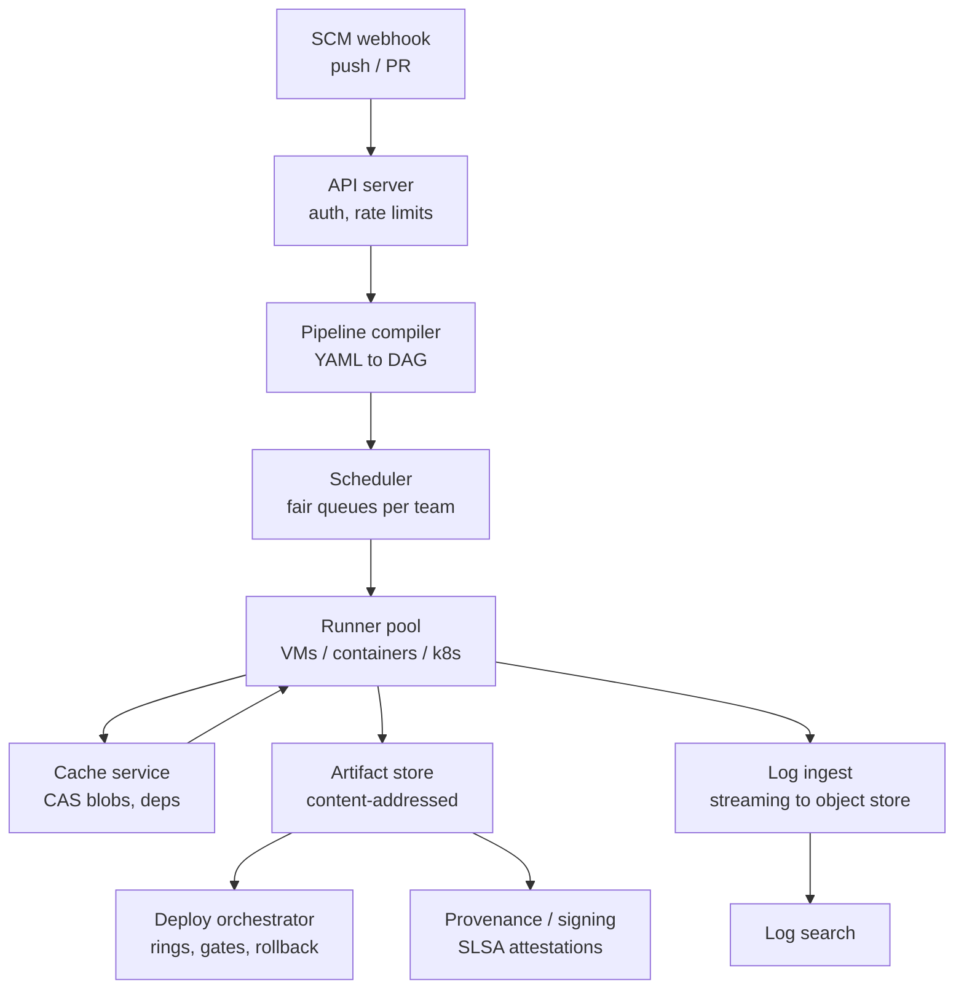
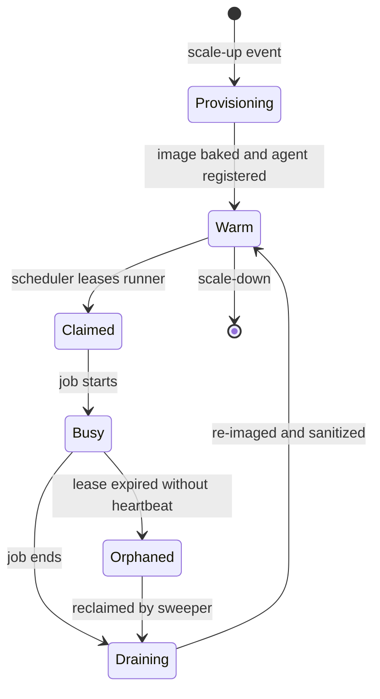
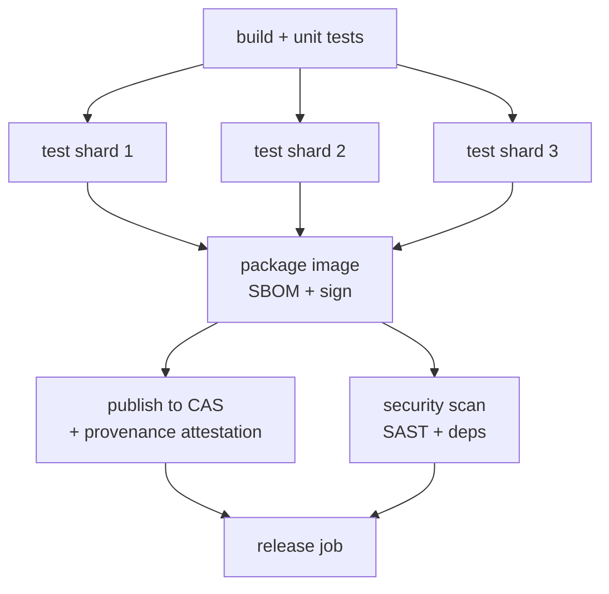

# Case Study: Design a CI/CD System

## Overview

A CI/CD platform is one of the largest internal distributed systems a company runs: it turns every commit into a directed acyclic graph of builds, tests, and deployments, executing millions of tasks per day across shared runner fleets. GitHub Actions, GitLab CI, Buildkite, and Google's internal systems all converge on the same architecture — content-addressed artifacts, lease-based task queues, and progressive delivery — which makes it an excellent interview case study for combining queues, caching, and orchestration. The interview probes whether you can reason about fairness under load, hermetic builds, and the failure blast radius of a deploy system that can break production.

> **Interview Angle**: Expect follow-ups on cache poisoning and supply chain (a build system is an attack surface), on flaky-test economics, and on why merge queues exist. Candidates who have operated CI at scale always mention warm pools and cache hit rates unprompted.

## Step 1 — Requirements

### Functional

- Trigger pipeline runs on push, PR open/update, schedule, manual dispatch, and API/webhook calls
- Define pipelines as code: a YAML DAG of jobs with dependencies, matrices, and conditional steps
- Execute each job in an isolated environment (ephemeral VM or container) with toolchains and dependencies available
- Store artifacts, test results, and logs; expose them to later stages and to humans
- Promote a *tested* artifact through deploy rings with automatic gates; roll back instantly
- Manage secrets for builds: cloud credentials, package-repo tokens, deploy keys — without leaking them into logs or artifacts

### Non-Functional

- **Latency**: p99 trigger-to-job-start < 10 s for first job on the default branch; queue-time SLOs per priority class
- **Fairness**: one team's 500-job matrix must not starve another team's one-job PR check
- **Availability**: 99.9%+ for the control plane — a CI outage blocks the whole org's merges and deploys
- **Durability**: logs retained 90 days (searchable), artifacts 1 year, with lifecycle tiering
- **Reproducibility**: same commit + same inputs → same artifact hash; the deployed bytes are provably the tested bytes
- **Security**: untrusted PR code runs isolated from credentials and from other builds' data; every deploy is attributable and auditable

## Step 2 — Back-of-Envelope Estimation

Scale target: **10,000 active repositories, ~1M build jobs per day** (a large org with monorepos and microservices mixed).

| Quantity | Assumption | Result |
|---|---|---|
| Pipeline runs/day | ~4 jobs per run on average | ~250k runs/day |
| Average submission rate | 1M jobs / 86,400 s | ~12 jobs/s average |
| Peak submission rate | 10–30× burst at merge rush / post-incident | 120–400 jobs/s |
| Job shape | 4 vCPU, 8 GB RAM, 6 min average | 1M × 6 min = 6M job-minutes/day |
| Average concurrency | 6M job-min/day ÷ 1,440 min/day | ~4,200 concurrent jobs |
| Peak concurrency | 3× average during bursts | ~12,600 → fleet of 15–20k runners |
| Total vCPUs | 4 vCPU × concurrency | ~17k vCPUs average, ~50k peak |
| Artifact writes | 200 MB average × 1M jobs | 200 TB/day gross → 20–40 TB/day unique after CAS dedup |
| Log writes | ~50 MB per job × 1M | ~50 TB/day, mostly cold after a week |
| Cache restores | ~70% jobs hit cache, ~500 MB restored each | ~350 TB/day from cache tier — dwarfs artifact writes |

Three patterns to verbalize before drawing boxes. First, **submissions are bursty but execution is smoothed**: the queue is the shock absorber, and fleet size is set by *concurrency*, not arrival rate. Second, **cache restore traffic exceeds artifact write traffic by an order of magnitude**, so the cache tier is a data-intensive service in its own right, not an afterthought. Third, **control-plane writes are small but critical**: 1M job-state transitions/day is trivial throughput, yet it must never be unavailable — this asymmetry argues for separating the metadata plane (small, replicated, strongly consistent) from the data plane (massive, eventually consistent).

## Step 3 — API and Data Model

Sketch an API surface; the interviewer wants resources, not REST piety:

```text
POST /pipelines                 # register pipeline definition
POST /runs                      # trigger run (commit SHA, pipeline ref, params)
GET  /runs/{id}                 # status, stage graph
POST /runs/{id}/cancel
GET  /runs/{id}/logs/{job}      # streaming
GET  /artifacts/{run}/{name}    # immutable, CAS-backed
POST /deployments               # promote artifact to ring
POST /deployments/{id}/rollback
```

Core tables: `runs(run_id, commit_sha, pipeline_ref, status, queued_at, started_at, finished_at, trigger)`, `jobs(job_id, run_id, stage, depends_on[], queue_key, attempt, lease_owner, lease_expires)`, `artifacts(artifact_hash, run_id, path, size, refs_count)` — artifacts deduplicated by hash with a reference count. Pipeline definitions are content-hashed too so caching keys can include the definition version. Job state transitions (`queued → leased → running → succeeded | failed | retried`) are the hottest write path and the source of truth for every dashboard, so the jobs table is sharded by repo and updated in batches where the UI can tolerate slight staleness.

## Step 4 — High-Level Architecture



The webhook ingress acknowledges receipts durably before any processing — a lost GitHub webhook is a silent no-op build, so reconciliation periodically diffs the SCM's branch heads against recorded runs and backfills missing triggers. The scheduler owns *which* job runs next; the runner fleet owns *where and how*; the artifact store owns the immutable outputs. Everything else — logs, metrics, provenance — derives from those three.

## Deep Dive 1 — Build Queue: Fair Scheduling and Queue-Time SLOs

The scheduler is a fair-share queue system: one queue per (team, priority) key, **weighted round-robin between teams**, and inside a team FIFO with preemption for trunk-blocking jobs (a broken `main` build jumps the line — every minute of red trunk taxes every developer). Priority lanes exist, but raw priority without fairness guarantees turns CI into a lobby for whoever configured the highest number; weights plus aging (priority slowly grows with queue time) is the design that survives politics.

Queue-time SLOs make the policy measurable: `p50 queue time < 5 s` for interactive PR checks, `p99 < 60 s`, and a hard alert if any queued job exceeds 5 minutes with idle runners — that combination signals either a fleet sizing failure or an unfairness bug, not "normal load". Admission control closes the loop during incident bursts: per-team burst credits allow a team to exceed its fair share temporarily, and when the system saturates, new lowest-priority submissions get rejected (429 with retry guidance) rather than queued behind hours of work nobody will wait for.

Jobs are assigned to runners through **leases** — a runner claims a job with a 15-minute lease renewed by heartbeat; expired leases requeue the job with an attempt counter and jitter to avoid thundering herds. The lease, not the queue push, is what makes runner crashes self-healing; the generic machinery (lease renewal, fencing, dead-worker detection) is dissected in [Distributed Task Scheduler](./distributed-task-scheduler.md).

## Deep Dive 2 — Runner Fleet Management

Cold-provisioning a VM takes 30–90 s (image fetch, boot, agent registration), which would blow the 10 s first-job SLO on every autoscale event. The standard answer is a **warm pool**: pre-provisioned, pre-imaged runners sitting ready, with autoscaling refilling from the cold side ahead of demand.



Pool sizing is a queueing calculation, not a vibe: target warm capacity ≈ mean arrival rate × mean job duration × safety factor (2–3×), because Little's Law turns bursty arrivals into queue-time explosions when the pool is at its floor. Warm runners cost money while idle, so tier the pool — a small always-warm pool for common shapes (4 vCPU container runners) and on-demand cold scale-out for overflow and rare shapes (GPU, 32 vCPU). Ephemeral execution (**one job per runner**, then re-image) trades provisioning cost for hermeticity: no job ever sees another job's leftovers, which removes a whole class of flaky and malicious cross-contamination.

Spot instances slash the fleet bill — CI jobs are stateless and retryable, the ideal spot workload (see [Spot & Preemptible VMs](../../../cloud/spot-preemptible.md)) — but spot **preemption** must be handled explicitly, not discovered: a 2-minute grace period before the VM dies, during which the runner checkpoints job state (test progress, cache uploads) and reports "preempted" so the scheduler requeues with a spot-aware backoff and optionally escalates to on-demand for jobs that have already failed on spot twice. The fleet mix is a cost/latency optimization problem: typically 60–80% spot for tests, reserved/on-demand for long release builds, with the scheduler tagging jobs so preemptable work lands on spot and SLO-critical work lands on stable capacity.

## Deep Dive 3 — DAG Orchestration and Retry Semantics

The pipeline compiler turns YAML into a DAG of jobs; the orchestrator executes it with fan-out/fan-in: parallel test shards fan out from the build job, and a package job fans in after all shards succeed.



Retry semantics are where naive designs rot. Distinguish **transient-retryable** steps (network fetches, flaky infra) from **deterministic-failure** steps (compile error, failing test): the former get automatic retries with exponential backoff and an attempt cap, the latter fail fast and never retry, because retrying a deterministic failure just adds queue load and confusion. Each job declares its retry policy in the pipeline definition; the run record keeps every attempt with its failure class. For fan-in stages, define **all-success vs quorum** semantics explicitly — release jobs need all shards green, while a reporting job might proceed with 9 of 10 shards and mark itself degraded. Matrix jobs (same step × N configurations) expand at compile time but must deduplicate identical work, and `needs` edges create natural cancellation points: when a build fails, cancel its downstream subtree immediately and mark it `skipped` — not `failed` — because dashboards and merge queues consume those states differently.

```yaml
jobs:
  build:
    runs-on: warm-pool-4vcpu            # scheduler hint, not a raw VM request
    outputs: { image_digest: "${{ steps.meta.outputs.digest }}" }
  test:
    needs: build
    strategy:
      matrix: { shard: [1, 2, 3, 4] }   # fan-out; shard plan from duration history
      fail-fast: false                  # all shards finish -> better triage data
    retry: { max_attempts: 1, on: transient }   # infra errors only, never test failures
  release:
    needs: [test, security-scan]        # fan-in; all green or no promotion
    if: github.ref == 'refs/heads/main'
    concurrency: { group: deploy-main, cancel-in-progress: false }
```

## Deep Dive 4 — Artifacts, Cache Economics

Reproducible builds are the difference between "the artifact that passed tests" and "the artifact in production". Store artifacts by content hash (CAS). Two commits with identical inputs resolve to the same hash — that identity is what lets the deploy system promote a *tested hash* rather than rebuild. Attach SLSA-style provenance attestations (builder identity, source SHA, dependency list) at artifact creation; the deploy gate verifies signature + provenance before promotion (see **Security and Build Provenance** below).

Cache layers, in hit-rate order: package-manager caches (~60% hit), Docker layer cache (~40–70% depending on Dockerfile hygiene), ccache/sccache for C++ (~50–90% on incremental trunk builds), and test-result caching keyed by (test file set, dependency graph hash). The cache key must incorporate the pipeline definition hash and toolchain version or you ship stale artifacts — the classic CI bug.

The economics are worth doing out loud: if the fleet bills $0.03 per runner-hour at ~4 vCPU, a 20-minute job costs ~$0.01, and a cache hit that saves 8 minutes of that job saves ~$0.004 — trivial per job, but at 700k cache-hit jobs/day that is ~$1,000/day of compute, plus 8 minutes off each developer's feedback loop, which is the larger half of the value. The flip side is **cache poisoning**: a compromised cache entry executes in every subsequent build, so cache keys are content-verified (hash of inputs), cache uploads are authenticated to the producer identity, and cache entries from untrusted PR builds are namespaced away from trunk builds.

## Deep Dive 5 — Secrets in CI: Brokering and OIDC Federation

The build environment is where credentials historically go to die: static cloud keys in env vars, printed by a `set -x`, cached in a third-party fork's CI. The modern architecture eliminates stored cloud credentials entirely via **OIDC federation**: the CI job receives a short-lived signed OIDC token from the platform (`iss = ci.internal`, `sub = repo:payments-svc:ref:refs/heads/main`, `aud = aws`), presents it to the cloud's token-exchange endpoint, and receives an IAM role session scoped to exactly that repo-branch combination (see the [Secrets Manager](./secrets-manager.md) case study for the broker design). Nothing long-lived exists to leak; a token minted for a `main`-branch build of `payments-svc` is worthless in a fork or on another branch.

Static secrets that cannot be federated (vendor API tokens, signing keys) flow through a **secrets broker**: the runner requests the secret at runtime with its job identity, the broker authorizes against a per-repo/per-branch policy, delivers in-memory only, and logs every issuance. Additional controls that interviews expect: secret values are masked in log streams (pattern-detect and redact before log ingest), secrets never propagate into artifacts or cache entries, and signing keys for provenance live in a KMS/HSM the runner reaches via API — the runner requests a signature, never holds the key. Least privilege is enforced at the *role definition* level: a test job gets no deploy permissions at all, and only the release job on `main` may assume the deploy role.

## Deep Dive 6 — Merge Queues and Deploy Rings

A merge queue batches PRs: each batch runs the full required test suite on the *result of merging all queued PRs onto trunk*, then lands them serially or as the batch commit. This kills the "trunk is red because two individually-green PRs conflict semantically" failure and keeps trunk always releasable. Batch testing with speculative parallel batches (test PR2-without-PR1 simultaneously) cuts queue latency ~40% at the cost of redundant compute. The queue is also the natural enforcement point for merge-time policies: required checks, flaky-quarantine status, and up-to-date-branch requirements all live in one place.

Deploys consume the trunk artifact through rings: canary (1%) → early (10%) → broad (50%) → full, each gate automatic on SLO metrics (error rate, latency, business KPI) with automatic rollback on breach. Rollback is instant because it is a pointer flip to the previous CAS artifact — no rebuild. The orchestrator mechanics behind this (durable state machines, timers, signals) are the same ones covered in [Workflow Orchestration](../hld/workflow-orchestration.md).

## Deep Dive 7 — Test Flakiness Quarantine

Flakiness is an economic problem: at 1% flake rate over 10k tests, a 20k-job day sees hundreds of false reds, each costing minutes of human attention and queue re-runs. Standard system: auto-retry failed tests once (marks flaky if pass-on-retry), quarantine auto-detected flaky tests out of the blocking path with a mandatory owner and TTL, and shard tests by historical duration for even phases. Track a flakiness dashboard per test and per team; treat top offenders as bugs with SLOs.

The quarantine needs teeth to avoid becoming a graveyard: a TTL (e.g., 14 days) after which the test either returns to the blocking suite or escalates to the owning team's leadership, and a global cap on quarantined coverage (e.g., quarantine may hide at most 2% of suite assertions) so the escape hatch cannot quietly delete coverage. Never let "retry until green" become policy without detection — it converts flakiness into silent coverage loss.

## Security and Build Provenance (SLSA)

The build system is on the supply-chain attack path — it holds signing power over everything you ship. Defense in depth starts with isolation tiers: untrusted fork PRs run in restricted sandboxes (no secrets, no shared Docker socket, egress allowlists, limited concurrency), while trusted-branch builds get full credentials via the broker. Then make tampering detectable rather than merely prevented: every artifact carries **SLSA provenance** — a signed attestation of builder identity, source commit, build instructions, and dependency list — and the deploy gate *verifies* it rather than trusting the artifact store.

| SLSA build level | Requirement |
|---|---|
| L0 | No guarantees |
| L1 | Provenance exists; build fully scripted |
| L2 | Hosted build platform; signed provenance; separated from dev machines |
| L3 | Hardened, isolated builders; provenance non-falsifiable by the build service users |

Pragmatically, L2 is where hosted CI platforms land out of the box, and L3 requires dedicated hardened builders. Pair provenance with **admission control at deploy time**: the deploy orchestrator only promotes artifacts whose signed provenance matches the expected builder, branch policy, and dependency policy — which converts cache poisoning and dependency-substitution attacks from "silent compromise" into "deploy blocked" — the supply-chain answer promised in the cache economics deep dive. Cache keys verified by input hash, dependency lockfiles, and verified base images close the remaining ingestion paths.

## Failure Modes and Mitigations

| Failure | Symptom | Mitigation |
|---|---|---|
| Runner crash mid-job | Job hangs; lease expires | Lease + heartbeat, requeue with attempt counter and jitter |
| Spot preemption | Many jobs die at once | 2-min grace, checkpoint + requeue, spot-aware backoff, on-demand escalation |
| Cache stampede | Base-image bump → thousands of cold rebuilds | Staged image rollout, request coalescing on CAS, higher warm-pool floor |
| Queue starvation | Low-weight team waits hours under load | Weighted fair share with aging, burst credits, admission control |
| Webhook loss | Push produces no build | Durable webhook receipts + SCM reconciliation sweep |
| Zombie runner | Executes stale job after partition | Fence tokens / lease epochs; runner rejects non-current lease |
| Flaky trunk | Red main blocks all merges | Merge queue, auto-retry with detection, quarantine with TTL |
| Control-plane DB saturation | Job-state writes back up | Shard by repo, batch transitions, read replicas for dashboards |
| Secret leak in logs | Credential appears in searchable logs | Log masking pre-ingest, broker issuance audit, short-lived tokens only |
| Compromised cache | Poisoned artifact propagates | Hash-verified keys, producer authz, PR/trunk cache namespaces, provenance gates |

## Bottlenecks and Follow-Ups

- **Cache stampede** after a base-image update: thousands of jobs rebuild cold; mitigate with staged image rollout and request coalescing on the CAS service.
- **Runner fleet cost**: spot instances for stateless test jobs, reserved for long builds; report cost-per-build-hour per team to create pressure.
- **Log write amplification**: streaming logs through Kafka with batched object-store writes; live tail served from a small hot window, search from tiered storage — the pipeline design mirrors the [Log Analytics case study](./log-analytics.md).
- **Multi-region**: SCM webhook ingress regional, queues partitioned by repo hash; artifacts replicated async to the deploy region.
- **Queue-time SLO violations at 10×**: revisit pool sizing with Little's Law first, then fairness weights, then admission control — in that order, because each is cheaper than admitting the architecture needs rework.
- **Monorepo scaling**: path-filtering and impact analysis to avoid building the world on every commit; eventually remote execution (Bazel RBE) where compile itself becomes a scheduled distributed job.

## Interview Questions

1. **Why leases instead of a plain queue push to runners?** Long jobs crash runners mid-execution; a plain push loses the job until manual cleanup. A lease with heartbeat expiry makes runner death self-healing — the job requeues after expiry with attempt tracking. It also handles network partitions and lets the scheduler bound the damage of zombie runners executing stale work.
2. **How do you guarantee the tested artifact is the deployed artifact?** Content-address everything: artifact hash derives from inputs; tests record the hash they validated; deploy gates promote a hash reference, not a rebuild trigger. Combined with signed provenance, any mismatch between tested and deployed bytes becomes detectable and auditable.
3. **How would you hand cloud credentials to a build safely?** Don't store them — federate. The job gets a short-lived OIDC token with claims binding it to repo and branch, exchanges it at the cloud's STS for a role session scoped to exactly that job class, and nothing long-lived ever sits in env vars. Static leftovers (vendor tokens) go through a broker that authorizes per repo/branch, delivers in-memory, masks logs, and audits every issuance. The interviewer is checking that you know forks/PRs must be credential-free by construction, not by convention.
4. **Design the test sharding strategy for a 40-minute suite.** Maintain per-test historical durations; bin-pack tests into N shards targeting equal wall time with 10% headroom; re-balance from the last run's actuals; add a straggler-detection rule that splits shards over 1.5× target. Shard-level caching keyed on (test set hash, code dependency hash) skips shards whose inputs did not change.
5. **A team's pipeline takes 60 minutes and they want it under 15. What do you do?** Profile first: dependency install vs compile vs test. Then apply in order — dependency and layer caching, sccache for compile, test impact analysis to skip unaffected tests, sharding for wall time, and only then consider architectural splits (monorepo service boundaries, incremental builds with remote execution like Bazel RBE).
6. **Where does this system break at 10×?** Control-plane DB write throughput on job state updates (shard by repo), CAS bandwidth (add edge caches, per-region replicas), scheduler fairness degradation during incident bursts (admission control with per-team burst credits), and log ingestion cost — which is why log sampling and tiering decisions belong in the original design, not as afterthoughts.

## Key Takeaways

- CI/CD is a fair-share queue system plus a CAS artifact store plus a progressive-delivery orchestrator; sizing comes from concurrency (Little's Law), not arrival rate.
- Warm pools and layered caching are the two levers that dominate latency and cost; cache restore traffic typically exceeds artifact write traffic.
- Content-addressed artifacts + signed provenance (SLSA) solve reproducibility and supply-chain security simultaneously.
- OIDC federation removes stored cloud credentials; the secrets broker and log masking cover what cannot be federated.
- Merge queues buy a green trunk by testing batches, trading compute for reliability; deploy rings make rollback a pointer flip, not a rebuild.
- Flaky tests are an economics problem: detect, quarantine with TTL and a coverage cap, and hold owners to SLOs.
- Spot preemption is a designed-for condition — grace periods, checkpointing, and a scheduler that knows which jobs are preemptable.

## References

- GitHub Actions documentation: [docs.github.com/actions](https://docs.github.com/en/actions)
- SLSA provenance framework: [slsa.dev](https://slsa.dev/)
- Sigstore — signing and verification for build artifacts: [sigstore.dev](https://www.sigstore.dev/)
- in-toto — supply-chain attestation spec: [in-toto.io](https://in-toto.io/)
- OpenID Connect Core 1.0 (token flows used for CI federation): [openid.net/specs/openid-connect-core-1_0.html](https://openid.net/specs/openid-connect-core-1_0.html)
- Bazel remote caching & execution: [bazel.build/remote/caching](https://bazel.build/remote/caching)
- Google SRE book — progressive delivery and canary analysis: [sre.google/sre-book/release-engineering](https://sre.google/sre-book/release-engineering/)
- Trunk-based development and merge queues: [trunkbaseddevelopment.com](https://trunkbaseddevelopment.com/)

## Cross-References

- [Distributed Task Scheduler](./distributed-task-scheduler.md) — the generic lease-based execution substrate behind the build queue
- [Log Analytics](./log-analytics.md) — the 50 TB/day log pipeline this system feeds
- [Workflow Orchestration](../hld/workflow-orchestration.md) — durable state machines for the deploy half
- [Secrets Manager](./secrets-manager.md) — the broker design used for build secrets
- [Metrics & Monitoring](./metrics-monitoring.md) — how deploy gates read their SLOs
- [Spot & Preemptible VMs](../../../cloud/spot-preemptible.md) — the fleet-cost lever and its failure mode
- [CI/CD Pipelines](../../../cloud/cicd/pipelines.md) — the developer-facing pipeline concepts this platform implements
- [Jenkins](../../../cloud/cicd/jenkins.md) and [Buildkite](../../../cloud/cicd/buildkite.md) — real systems embodying these patterns
- [Argo Workflows](../../../cloud/cicd/argo-workflows.md) — Kubernetes-native DAG execution
- [Ticketmaster](./ticketmaster.md) — same lease/queue machinery applied to seat inventory
- [CI/CD Overview](../../../backend/cicd/README.md) and [GitOps](../../../backend/cicd/gitops.md) — the declarative deployment half of the pipeline
