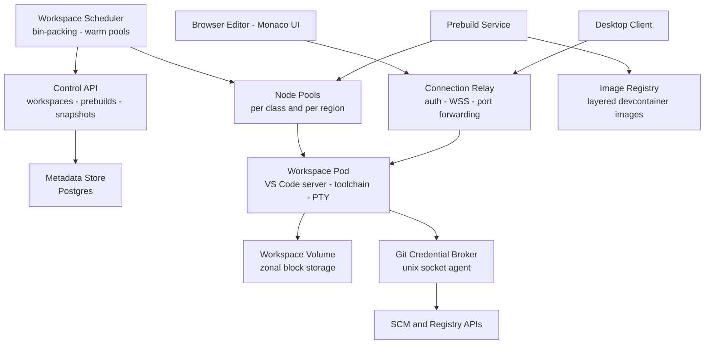
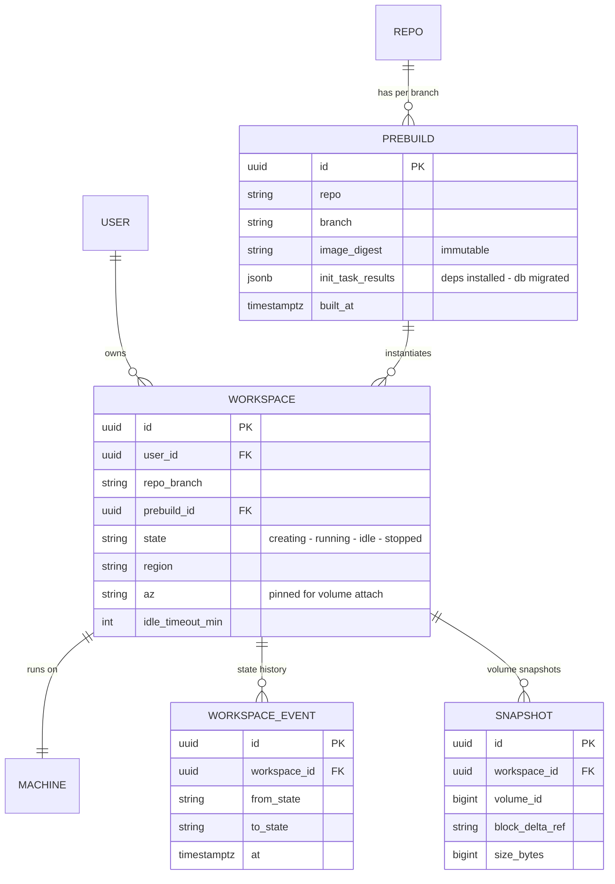
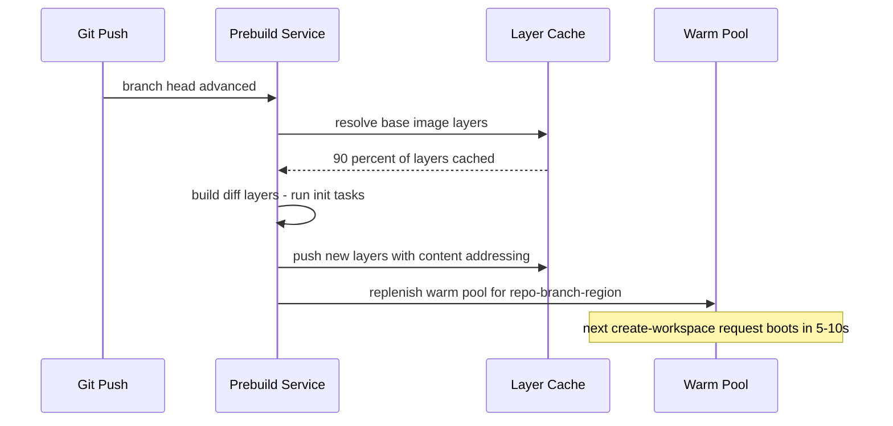
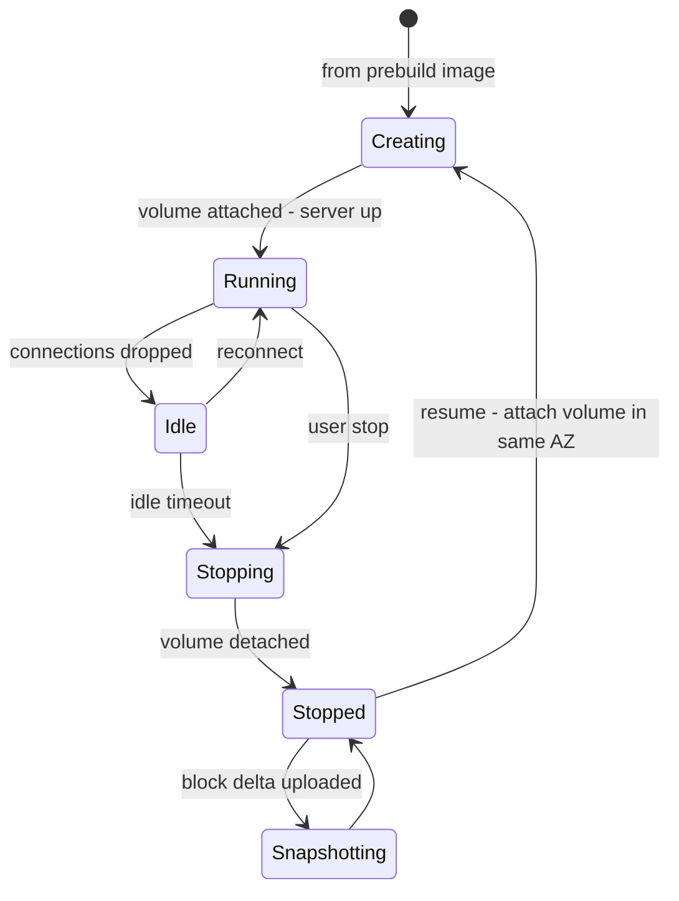

# Case Study: Design a Cloud IDE (GitHub Codespaces / Gitpod-Style)

## Overview

"Design a development environment in the browser" sounds like a thin VNC wrapper until you enumerate what it actually is: a multi-tenant container platform with sub-second workspace starts, a full compiler toolchain per user, an editor whose keystrokes must feel local over a 100 ms network, per-tenant resource isolation on shared nodes, and a cost model measured in developer-hours rather than requests. This walkthrough designs the machine behind Codespaces/Gitpod-class products: image prebuilds and warm pools, the VS Code server streaming model, the terminal latency budget, snapshot/stop/resume of workspaces, git credential isolation, and the per-dev-hour economics that decide whether the product is viable. The hosting platform this IDE plugs into (repos, PRs, code search) is the separate [Case Study: Code Hosting](../real-world/code-hosting.md), and file *content* sync between a user's laptop and the cloud is a cousin of the Dropbox block-sync design in [Case Study: Dropbox](../real-world/dropbox.md).

## Step 1 — Requirements

### Functional

- A developer opens a **repo + branch (+ optionally a PR or a devcontainer config)** and gets a workspace: a container running an editor server, a terminal, their toolchain, extensions, and forwarded ports
- **Prebuilds**: the platform builds the devcontainer image *plus* initialized state (dependency install, DB migrations run once) ahead of time per repo/branch, so workspace creation is seconds, not minutes
- **Snapshot / stop / resume**: a developer stops at the end of the day — uncommitted files, installed tools, running DB state — and resumes later without re-provisioning
- **Editor parity**: browser editor (Monaco-based) and desktop client connect to the same remote server; extensions and language servers run *server-side* in the workspace, not in the browser
- **Terminal and ports**: full PTY terminal; HTTP/TCP port forwarding with auth so a dev server running in the container is reachable from the browser
- **Git integration**: clone/push flows work out of the box without the user ever pasting credentials into the workspace
- **Collaboration (optional)**: share a workspace URL; a second user attaches to the same server and terminal

### Non-Functional

- **Time-to-first-keystroke**: ≤ 15 s with a warm prebuild; ≤ 60 s cold-from-image; minutes only when no prebuild exists (and that must be visible and rare)
- **Interaction latency**: editor keystroke echo is local (< 16 ms); terminal echo p50 ≤ 80 ms, p99 ≤ 250 ms over a typical WAN RTT of 40–100 ms
- **Availability**: control plane 99.9%; a workspace node crash costs the user a reconnect-and-resume, not data loss — uncommitted state must survive node death (volume + snapshot)
- **Isolation**: mutually distrustful tenants share nodes; a `fork bomb`, a crypto miner, or `curl` of a malicious repo must be contained (cgroups, seccomp, network policy)
- **Cost envelope**: the product only works below roughly $0.15–0.30 per active dev-hour all-in; the design must *measure and steer* this number (see the cost math in Step 2 and Deep Dive 5)
- **Data durability**: workspace disk survives stop/resume and node failure for at least the retention window (e.g., 30 days after last use)

The requirement that shapes everything is the interaction one: unlike a CI worker (see [Case Study: CI/CD System](./ci-cd-system.md)), a workspace is *long-lived, stateful, and latency-sensitive*, which puts it architecturally between a serverless function and a stateful VM fleet.

## Step 2 — Back-of-Envelope Estimation

| Quantity | Assumption | Result |
|---|---|---|
| Registered developers | 100K org seats, 15% peak concurrency | ~15K live workspaces at peak |
| Workspace class (default) | 4 vCPU, 8 GB RAM, 32 GB SSD | The "standard" SKU; larger SKUs are multipliers |
| Node size | 64 vCPU / 256 GB / NVMe | ~12–14 workspaces per node after system overhead |
| Node count at peak | 15K / 13 × 1.3 headroom | ~1,500 nodes fleet-wide, across regions |
| Image size | devcontainer: 2–6 GB (OS + toolchain + language) | Layer cache hit > 90% within a repo → effective pull ~100–400 MB |
| Prebuild volume | 5K active repo-branch combos × 1 prebuild/day × 10 min | ~35 concurrent prebuild builders — small batch fleet |
| Warm pool | demand forecast per (repo, region) + buffer | e.g., 200 workspaces warm for the top repos; covers 80% of creates |
| Session shape | median 2–3 h active/day; workspace idle 60–70% of its lifetime | Idle management (auto-stop) is the #1 cost lever |
| Snapshot | 32 GB volume, ~15% dirty per day, incremental | ~5 GB/day of changed blocks per active workspace |

**Cost per dev-hour math** (the number interviewers love):

- Compute: 4 vCPU on-demand ≈ $0.14/h list; with 3-year reserved instances, bin-packing at ~70%, and warm-pool overhead amortized, realistic **$0.05–0.08 per active workspace-hour**
- Storage: 32 GB SSD at ~$0.10/GB-month ≈ $3.20/month ≈ **$0.002/h** while attached; detached-but-retained disk still pays, which is why retention policies exist
- Snapshot traffic, image registry egress, orchestration control plane: add ~30–50% overhead → **all-in ≈ $0.10–0.25 per active dev-hour**
- Sanity check: a developer at 160 active hours/month costs $16–40/month in cloud — versus a $1,800 laptop amortized over 36 months ($50/month) that a cloud IDE lets you not buy for onboarding cohorts, contractors, and ephemeral AI agents. The economics work *only* if idle workspaces are aggressively stopped; at 30% utilization instead of 70%, compute cost doubles

## Step 3 — API Sketch

Control plane (human + automation):

```text
POST /v1/workspaces                { repo, branch, devcontainer_path, machine_class }
GET  /v1/workspaces/{id}           → state, region, last_active, connection_url
POST /v1/workspaces/{id}/stop      { snapshot: true }
POST /v1/workspaces/{id}/resume    → new connection_url (same AZ)
POST /v1/prebuilds                 { repo, branches[], region }    # or triggered by push webhook
GET  /v1/prebuilds/{repo}          → per-branch: age, status, cache size
POST /v1/workspaces/{id}/ports     { port, proto }                 # returns a public authenticated URL
```

Data plane (what the editor client actually speaks):

```text
WSS /editor/{workspace_id}         # editor protocol: UI state, LSP, extensions — VS Code server upstream
WSS /terminal/{workspace_id}       # raw PTY stream over WebSocket frames (RFC 6455)
GET  https://{port}-{id}.relay.example.com/   # forwarded HTTP port behind an auth edge
```

The important API decision: the editor protocol and the terminal protocol are **separate connections** with different buffering and priority requirements — the terminal wants a raw byte stream with a small latency budget, while the editor protocol wants multiplexed request/response channels (the VS Code remote protocol runs many logical channels over one socket).

## Step 4 — High-Level Architecture



- **Control API + metadata store**: the source of truth for workspace state machines (see Step 5). Every state transition is a persisted event so a crashed scheduler can reconcile
- **Scheduler**: bin-packs workspaces onto node pools with anti-affinity (don't put two 32 GB workspaces on a 256 GB node), maintains **warm pools** per (prebuild image, region), and drains nodes for upgrades (see [Distributed Task Scheduler](./distributed-task-scheduler.md) for the queueing machinery)
- **Prebuild service**: watches repo webhooks, builds `devcontainer.json` images + runs init tasks, pushes layers to the registry. This is the single biggest lever on time-to-first-keystroke
- **Workspace pod**: VS Code server (Node), extension host, language servers, shell/PTY, all inside a container with cgroup limits; the volume is a zonal block device mounted as the workspace filesystem
- **Relay**: terminates client TLS, authenticates, and proxies to the pod's editor/terminal sockets; also fronts forwarded ports with per-user auth so `localhost:3000` inside the container becomes a public URL only the owner (and invitees) can reach

## Step 5 — Data Model



Design points worth stating out loud:

- **The image digest is immutable; the volume is mutable state.** Creating a workspace = mount a fresh volume seeded from the prebuild image + run nothing. Resume = reattach the *same volume*. This separation is what makes snapshots meaningful: snapshot the volume delta, never the image
- **`az` pinning is a first-class column** because block storage is zonal: resume must schedule to the same AZ or pay a cross-AZ attach (usually impossible) — the availability/cost trade appears in Deep Dive 3
- **`WORKSPACE_EVENT` is an append-only log**, which makes "why was this workspace stopped at 3am" (idle policy? admin? node failure?) answerable — the same event-sourcing discipline as [Event Sourcing](../../../backend/patterns/event-sourcing-deep.md)

## Deep Dive 1 — Image Prebuilds and Warm Pools

Time-to-first-keystroke decomposes into: schedule (1–3 s) + pull image (seconds with cache, minutes without) + start server (2–5 s) + install deps & start services (0 s if prebuilt, 2–10 min otherwise). Prebuilds attack the last two; warm pools attack the first two.



- **Layered, content-addressed caching is the whole game**: base OS layer (weekly), toolchain layer (monthly), dependency layer (changes on lockfile change), project layer (every push). A lockfile-only change re-pulls one layer, not 4 GB. The devcontainer spec (build args, features, post-create commands) exists precisely to make this layering declarative
- **Init tasks run once at prebuild time** (npm install, DB migration against a scratch DB, codegen). The workspace then clones the *result state*. Caveat to volunteer: anything with machine-local state (absolute paths, host keys) breaks prebuild reuse — good products re-run a cheap "fixup" at boot
- **Warm pool sizing is a forecast problem**: keep `p99 create-rate over 10 min × safety factor` warm per (image, region); evict warm instances when their image falls behind HEAD by more than N commits (replenish in background). A warm workspace that boots from a 3-day-old prebuild is worse than a cold one from HEAD — the user silently gets stale dependencies
- **Prebuild fan-out control**: a repo with 50 active branches × 5 regions = 250 builds per push-ish event is an attack on your build cluster; prebuilds are gated by "was this branch opened/used in the last 7 days", deduped by commit SHA, and rate-limited per org — the same vocabulary as the [Rate Limiter](../rate-limiter.md) page

**What the interviewer is probing:** whether you realize workspace creation speed is an *image distribution* problem (Docker layers, P2P-style registry caching, warm pools) rather than a container-start problem. `docker run` was never the slow part.

## Deep Dive 2 — Editor Streaming and the Terminal Latency Budget

The architecture that makes a browser IDE feel native is **code execution split down the middle**: the UI (Monaco DOM, menus, keybindings) renders in the browser and echoes keystrokes *locally*, while everything that needs a CPU — language servers, extension host, build tools, tests, shell — runs in the workspace container. The wire protocol (VS Code's remote protocol; similar model in JetBrains Gateway and code-server) multiplexes many logical channels (files, LSP, extensions, terminal) over one WebSocket.

The latency budget, per interaction:

| Interaction | Budget (p50) | Budget (p99) | Where the time goes |
|---|---|---|---|
| Editor keystroke echo | < 16 ms (local) | 1 frame | Browser only — text sync is async, optimistic |
| Remote text sync (other views, collaboration) | < 100 ms | < 300 ms | op encode + WAN RTT + apply |
| Terminal echo (typing) | < 80 ms | < 250 ms | WAN RTT up + PTY + shell + WAN RTT back |
| Tab-complete / LSP completion | 50–150 ms | 300 ms | server-side language server (tsserver, gopls) |
| File open (10 KB file) | < 100 ms | 400 ms | content cache in browser + FS read server-side |
| Test run first output | < 1 s | — | process spawn + build; stream stdout incrementally |

Terminal mechanics worth volunteering:

- The PTY lives **in the container**; the browser gets a raw byte stream over WebSocket frames (RFC 6455). Don't buffer: every 5–20 ms of terminal output is flushed immediately, with Nagle disabled — batching is the difference between a terminal that feels like SSH and one that feels like a fax
- **Reconnect is a replay problem**: on WebSocket drop, the client reconnects and the server replays the last N KB of scrollback from a ring buffer; the PTY process itself was never killed. This is why a flaky network costs you scrollback, not your running `npm run dev`
- **Port forwarding is reverse-proxying with auth**: `https://3000-ws42.relay.example.com` → mTLS/cookie check at the edge → tunnel to pod port. Hostname-per-port (rather than path-per-port) exists because web dev servers hard-code absolute URLs and websockets to their own origin
- Extensions that shell out (formatters, linters) run server-side; extensions that need UI run in a browser-side "UI extension host" with a proxy API — say this split explicitly, it shows you've read how the real system works

**What the interviewer is probing:** whether you understand *why* it feels native (local echo + optimistic UI) and whether you can budget latency per interaction instead of hand-waving "it's over WebSocket so it's fast."

## Deep Dive 3 — Snapshot, Stop, and Resume

A workspace is stateful: uncommitted files, installed tools, a running local database, a half-finished build cache. "Stop" must preserve all of it at low cost; "resume" must restore it fast. The honest engineering answer: **checkpoint the filesystem, not the process memory**.



- **Stop = detach + snapshot**: flush dirty pages, detach the block volume, and snapshot the block delta (copy-on-write, ~seconds because it's incremental). True CRIU-style process checkpoint/restore (freeze the process tree, dump memory, restore on another host) exists — see the [CRIU project](https://criu.org/) — but production cloud IDEs rarely use it for dev containers: open sockets, GPU file descriptors, and extension-host state make restore success rates and complexity unattractive versus a 10–40 s cold process start on a warm filesystem
- **Resume = schedule to the same AZ, reattach volume, start the server processes.** The volume attach (10–30 s) dominates. Restoring *process state* (your running dev server) is explicitly a trade: some products re-run a documented "resume task" (start docker-compose) instead of pretending to resurrect processes
- **Node failure with no stop**: because the volume is network-attached (not node-local disk), resume-after-crash is the same path as resume-after-stop — the volume is the durability boundary. Node-local NVMe caches exist only for build scratch, never for source state
- **Cross-AZ resume is the cost/availability fork in the road**: zonal volumes pin the workspace to an AZ (a zonal outage strands users until the AZ returns); replicating volumes cross-AZ doubles storage cost for a rare event. Reasonable middle: async volume replication with an RPO of minutes and resume-in-secondary marked as "restore to last snapshot"
- The snapshot machinery is the same idea as distributed consistent snapshots — taking a consistent cut of mutable state so it can be restored elsewhere (see [Distributed Snapshots](../../../distributed/advanced/distributed-snapshots.md))

**What the interviewer is probing:** whether you know what CRIU is, and whether you can argue *why production skipped it* — memory checkpoints are brittle for long-lived, socket-heavy processes, while block-level deltas are cheap, robust, and orthogonal to the runtime.

## Deep Dive 4 — Git Credential Isolation

The workspace runs arbitrary code: a fresh clone of a malicious repo executes in its install scripts (npm/yarn/pip preinstall hooks are a known attack surface). Long-lived git credentials inside that container are an exfiltration jackpot. The pattern used by real products:

```text
git push  →  credential helper  →  unix-socket agent in workspace
          →  broker service (control plane, holds OAuth refresh server-side)
          →  short-lived, repo-scoped, audience-bound token minted per operation
```

- **No long-lived credential ever enters the container.** The container's `~/.gitconfig` points at a credential helper that asks a local agent over a unix socket; the agent asks the broker; the broker mints a token scoped to `repo:read` or `repo:write` on *that* repo, TTL 1–8 h, bound to the workspace identity
- **Push-time scopes**: a clone/commit needs read; a push mints a fresh write-scoped token and emits an audit event (workspace, user, repo, timestamp). A compromised workspace can push, but not list org members, not create repos, not read every private repo — blast radius is per-repo
- **Prebuilds run with read-only, no-push credentials** and never see user secrets; user secrets (env vars, API keys for the dev's third-party services) are injected at *workspace* start from the secret store, mount-scoped, and rotatable (the injection model is the same demand as the [Case Study: Secrets Manager](./secrets-manager.md), with per-workspace leases instead of per-service ones)
- **Egress controls back this up**: the workspace's network namespace blocks the cloud metadata IP (169.254.169.254), and outbound access to SCM/registries goes through an authenticated proxy that can rate-limit and log — because the credential helper alone doesn't stop `curl` of something else
- Root cause to name: the workspace is a **confused-deputy boundary** — code the user runs must never be able to elevate to the permissions of the platform acting on the user's behalf

## Deep Dive 5 — Multi-Tenant Resource Controls and the Local-Dev Comparison

Neighbors share nodes, and developer workloads are pathologically bursty (a compile will happily eat 32 cores; a `docker build` will eat RAM until the OOM killer notices). Controls that keep the fleet sane:

| Control | Mechanism | Without it |
|---|---|---|
| CPU | cgroup-v2 `cpu.max` quota + burst window | one `make -j` starves 12 neighbors' terminals |
| Memory | `memory.max` + aggressive per-workspace swap on NVMe | OOM killer picks victims randomly; kills the *node's* agent |
| Process count | `pids.max` (e.g., 512/workspace) | fork bombs take the node |
| Disk I/O | `io.max` IOPS/BPS per volume | one `cargo build` spikes NVMe latency for all |
| Network | egress BPS caps + proxy allow-list | workspace becomes a DDoS drone or a data siphon |
| Kernel surface | seccomp profile, user namespaces, no privileged mode; Firecracker microVMs for the paranoid tenant class | container escape = cross-tenant read |

The cgroup knobs map one-to-one to the kernel documentation ([cgroups v2](https://www.kernel.org/doc/html/latest/admin-guide/cgroup-v2.html)); the namespace story is in [Namespaces and cgroups](../../../os/kernel-advanced/namespaces-cgroups.md), and the Kubernetes flavor of the same controls in [Kubernetes](../../../os/containers/kubernetes.md). Scheduler-side, a workspace with a sustained throttle signal is a candidate for *live migration* to a less loaded node (volume reattach makes this the same primitive as resume) — that's the bin-packing feedback loop, and it's the same class of autoscaling decision as [Knative's autoscaler](../../../cloud/advanced/knative-serverless-internals.md), just with minute-scale (not second-scale) granularity.

Cloud IDE vs local dev — the comparison table to close the interview with:

| Dimension | Cloud IDE | Local dev |
|---|---|---|
| Time to onboard a new dev | minutes (prebuild exists) | days (laptop, toolchain, access) |
| Reproducibility | image-defined, identical across team | "works on my machine" |
| Hardware ceiling | resize per task (64-core build workspace) | fixed at purchase |
| Interaction latency | WAN-bound: terminal echo 50–250 ms | 0–5 ms, keystroke-native |
| Offline | none — dead without network | fully functional |
| Idle cost | metered forever (idle ≠ free) | marginal after purchase |
| Security blast radius | per-workspace tokens, audited egress | user's laptop holds everything, forever |
| Best fit | onboarding, contractors, AI agents, OSS contribution | latency-critical work, offline, heavy local emulation |

## Bottlenecks & Follow-Up Questions

- **Warm pools are the cost/latency fulcrum**: every warm workspace is a running bill. Follow-ups: forecast-driven pool sizing per (image, region), warm-but-stopped instances (volume pre-attached, boot = process start only), and "cold tier" prebuilds that skip the pool for long-tail repos
- **Registry egress becomes the hidden bill**: 15K workspaces × 100–400 MB effective pull per create is terabytes/day. Follow-ups: per-node image cache shared across workspaces, peer-to-peer layer fetch (registry as torrent-seed), and scheduling workspaces that share images onto the same nodes
- **Zonal volume pinning concentrates failure**: one AZ down strands that AZ's users. Follow-up: async volume replication with minutes-RPO, or accept + communicate (most products accept, and say so in their SLA)
- **Terminal fan-in at the relay**: 15K workspaces × 2–3 long-lived WSS connections per relay POP is a C10M-style problem — the relay is stateful (it holds live sockets), so deploy it as many small regional pairs with connection draining, not one big cluster
- **Prebuild init tasks that can't be hermetic** (hit a live third-party API, need GPUs) break the prebuild contract. Follow-up: per-task hermeticity linting at prebuild authoring time, and a fallback "first-boot task" path with visible time cost
- **Noisy-neighbor detection is telemetry, not guesswork**: per-workspace throttling events (cgroup `nr_throttled`, io wait, pids near max) feed the scheduler; a workspace throttled > X% of the time triggers a SKU upsell or node split — the observability design is a mini version of [Case Study: Metrics & Monitoring](./metrics-monitoring.md)

## Interview Questions

1. **Why is time-to-first-keystroke an image-distribution problem, and what are the three levers?** Workspace start decomposes into scheduling, image pull, server start, and dependency/init work; only the first is trivially fast. The levers: (1) content-addressed layered images so a push invalidates one layer, not 4 GB; (2) prebuilds that run init tasks (deps, migrations) ahead of demand and store the result as an image; (3) warm pools that pre-stage booted instances per repo-region so even the pull disappears. With all three, create is 5–15 s; without them it's 5–10 minutes, which kills daily-driver adoption.
2. **Walk me through the latency budget for a terminal keystroke. How do you keep p99 under 250 ms?** Browser → relay RTT (40–100 ms), PTY + shell (1–5 ms), back (40–100 ms) — the WAN round trip dominates and you can't remove it, so you remove everything else: no extra proxy hops, TCP_NODELAY on the WSS, output flushed in small frames, PTY in the workspace (no SSH hop), scrollback replay on reconnect instead of a new shell. Editor keystrokes are different: they echo locally in one frame and sync asynchronously, which is why typing never waits on the network even when the terminal does.
3. **Why do production cloud IDEs snapshot the volume instead of using CRIU-style process checkpoints?** CRIU can freeze and restore a process tree, but a dev workspace is socket-heavy and extension-host-driven: open connections, external devices, and GUI-adjacent state make restore success rates poor and failure modes confusing ("my dev server is half-alive"). Block-level volume snapshots are cheap (copy-on-write deltas), robust, runtime-agnostic, and compose with resume = reattach + cold process start in 10–40 s. You trade ~30 s of process cold-start for a system that actually restores; the memory checkpoint is the academic answer, the volume is the production one.
4. **A workspace is compromised by a malicious npm install script. Contain the blast radius.** Containment is layered: the container runs unprivileged with seccomp and blocked metadata-IP egress; git credentials never live in the container — a credential broker mints short-lived, per-repo, operation-scoped tokens over a unix socket, so the attacker can at most push to one repo for one token TTL, and every push is an audit event; user secrets are per-workspace leased, not baked into images; egress goes through an authenticated proxy with per-tenant caps. The design principle: the workspace is a confused deputy — scope every capability to the smallest unit and make every use auditable.
5. **Do the cost math: when does a cloud IDE beat laptops?** All-in cost lands around $0.10–0.25 per active dev-hour: $0.05–0.08 compute after reservations and ~70% bin-packing, ~$0.002/h storage attached, plus 30–50% orchestration and warm-pool overhead. At 160 active hours/month that's $16–40/dev/month versus roughly $50/month amortizing a $1,800 laptop over 3 years — plus eliminated onboarding days and per-task resizing. The design work that keeps it true is *idle control*: auto-stop with volume snapshot (idle-disk-only cost), retention policies, and warm pools sized by forecast, because idle workspaces are where these products silently lose money.
6. **How does resume work after a node dies mid-session, and what availability did you actually promise?** The volume is network-attached, so node death costs nothing on disk: control plane notices (node heartbeats fail), reschedules the workspace to a healthy node in the same AZ, reattaches the volume, restarts the server, and the client reconnects with scrollback replay — total 30–90 s. What's promised: workspace state survives node failure (durable volume), but *session state* (running processes) does not — resume re-runs a documented task instead of resurrecting processes. Pinning to the AZ is the accepted trade; cross-AZ resume would need replicated volumes with minutes of RPO, which we offer only as a premium recovery path.

## Key Takeaways

- A cloud IDE is a multi-tenant, stateful, latency-sensitive container platform — architecturally between serverless and stateful VMs, and nothing like a request/response web service
- Fast workspace start = layered content-addressed images + prebuilt init state + warm pools; "containers start fast" was never the bottleneck, image distribution was
- The native feel comes from splitting execution: local echo in the browser, everything CPU-bound server-side, multiplexed over one WebSocket with separate terminal/editor channels and explicit per-interaction latency budgets
- Snapshot the volume, not the process: block deltas are cheap and robust; CRIU-style memory checkpoints lose to a 10–40 s cold start on a warm filesystem in production practice
- Git credential isolation is a confused-deputy defense: short-lived, per-repo, audited tokens minted by a broker — never long-lived credentials inside a container that runs arbitrary code
- Multi-tenancy is enforced with cgroups-v2 quotas, PID limits, I/O caps, seccomp, and egress proxies; noisy-neighbor detection is telemetry-driven, not best-effort
- The economics live or die on idle management: $0.10–0.25 per active dev-hour is achievable, but only with auto-stop, retention policies, and forecast-sized warm pools

## References

- GitHub Codespaces documentation — prebuilds, dev containers, deep dives into the Codespaces lifecycle: https://docs.github.com/en/codespaces
- VS Code Remote Development documentation — the server/client split, extension host separation, port forwarding model: https://code.visualstudio.com/docs/remote/remote-overview
- Dev Container specification — `devcontainer.json`, features, and the build metadata contract: https://containers.dev/
- code-server (Coder) — open-source VS Code server over the browser, useful for protocol details: https://github.com/coder/code-server
- JetBrains Projector — JetBrains' take on remoting IDE UIs (archived; the write-ups explain the trade-offs they hit): https://github.com/JetBrains/projector-client
- CRIU — checkpoint/restore in user space, the memory-checkpoint alternative this design deliberately declines: https://criu.org/
- Firecracker — microVM isolation for stricter multi-tenant boundaries: https://firecracker-microvm.github.io/
- Linux kernel cgroups v2 documentation — `cpu.max`, `memory.max`, `pids.max`, `io.max` semantics: https://www.kernel.org/doc/html/latest/admin-guide/cgroup-v2.html
- containerd documentation — the runtime layer workspaces actually run on: https://containerd.io/docs/
- OCI Image Specification — content-addressed layer model that prebuild caching depends on: https://github.com/opencontainers/image-spec
- RFC 6455 — the WebSocket protocol the terminal and editor channels ride on: https://datatracker.ietf.org/doc/html/rfc6455
- Kubernetes documentation — pod resource requests/limits and scheduling primitives behind the node pools: https://kubernetes.io/docs/home/

## Cross-References

- [Case Study: Code Hosting Platform](../real-world/code-hosting.md) — the repo/PR surface workspaces are created from, and where prebuild webhooks originate
- [Case Study: Dropbox](../real-world/dropbox.md) — block-based sync of mutable file state, the same primitive as workspace volume snapshots
- [Case Study: Secrets Manager](./secrets-manager.md) — the lease/revocation model reused for per-workspace secret injection
- [Case Study: CI/CD System](./ci-cd-system.md) — prebuilds are CI builds; the same build cluster and cache architecture serves both
- [Case Study: Distributed Task Scheduler](./distributed-task-scheduler.md) — workspace scheduling, bin-packing, and warm-pool replenishment as queueing problems
- [Case Study: Metrics & Monitoring](./metrics-monitoring.md) — the throttling and idle telemetry that drives scheduling and upsell decisions
- [Namespaces and cgroups](../../../os/kernel-advanced/namespaces-cgroups.md) — the kernel mechanisms behind every row of the resource-control table
- [Kubernetes](../../../os/containers/kubernetes.md) — requests/limits, scheduling, and node pools if you build the fleet on K8s
- [WebSocket](../../../networks/http/websocket.md) — the protocol carrying editor, terminal, and relay traffic
- [Knative Serverless Internals](../../../cloud/advanced/knative-serverless-internals.md) — warm-pool autoscaling decisions at a different timescale
- [FinOps: Cloud Cost Management](../../../sre/finops-cloud-cost.md) — the cost-per-dev-hour discipline in its organizational context
