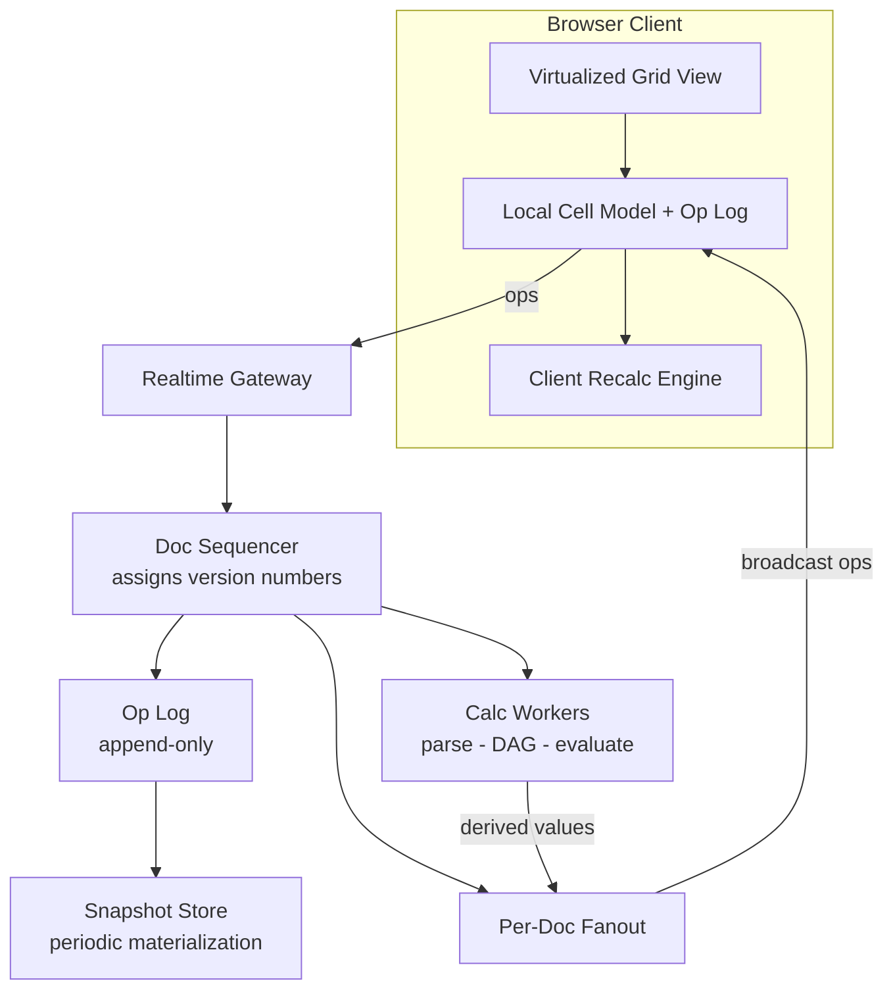
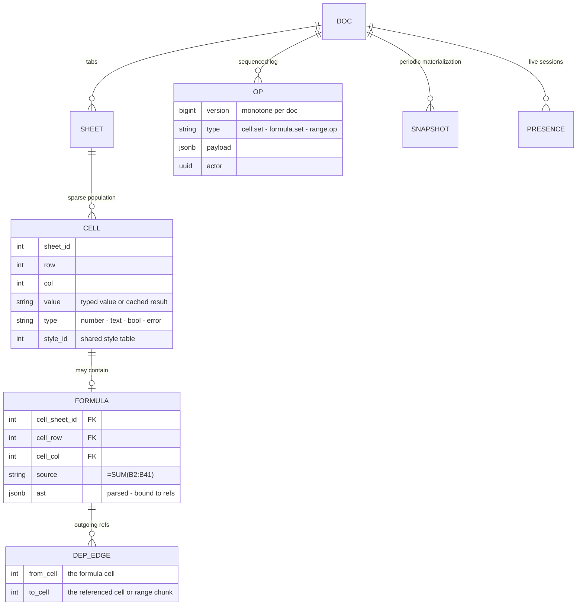
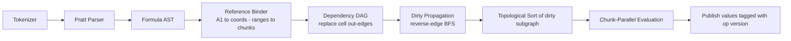

# Case Study: Design a Collaborative Spreadsheet (Google Sheets-Style)

## Overview

A collaborative spreadsheet looks like the [Collaborative Editor (Google Docs)](../real-world/collaborative-editor.md) with a grid, but the grid changes everything: cells have *stable addresses* instead of shifting positions, which dissolves most of the positional-conflict pain that makes text CRDTs hard — and introduces an entirely new subsystem in exchange, the **formula engine**, where one keystroke can trigger recomputation of a dependency graph spanning a million cells. This walkthrough designs both halves: the concurrency layer (ops on a sequenced log, cell-level convergence, presence) and the calculation layer (formulas parsed to ASTs, a dependency DAG, incremental topological evaluation), then budgets latency keystroke-by-keystroke and explains how a 40M-cell sheet stays interactive through virtualization. The document-editing counterpart, OT-vs-CRDT for *text*, lives in the editor case study; this page is the structured-grid version and links back where the reasoning diverges.

## Step 1 — Requirements

### Functional

- A sheet of up to **100K rows × 400 columns** with sparse population (typically < 5% of cells filled); multiple sheets (tabs) per document
- **Formulas** (`=SUMIF(A:A, ">100", B:B)`) referencing single cells, ranges, cross-sheet and cross-file (importrange-style) data; functions spanning math, lookup, text, aggregate; array formulas
- **Concurrent editing** by 2–100 users on one document: cell edits, formatting, range operations (paste, fill-down, sort), comments — all converging without lost updates
- **Presence**: live cursors and selection rectangles per user, plus edit indicators on cells someone is actively typing in
- **Undo/redo per user**: your undo reverts *your* last operation, transformed to not clobber concurrent edits by others
- **Version history**: named versions and restore; the op log is the natural source
- **Offline-tolerant editing (soft requirement)**: brief disconnects must not lose typed input; full offline merge is a CRDT bonus, not a v1 requirement

### Non-Functional

- **Keystroke-to-glass**: local echo of typed characters within one animation frame (< 16 ms) — the spreadsheet must *never* wait on the network to show your own typing
- **Convergence**: all clients agree on the final cell values after the op log settles; no lost updates under concurrent writes to the same cell (last-writer-wins per cell is acceptable and expected by users)
- **Recalculation latency**: a single-cell edit dirties typically 10–1,000 dependent cells; recalc must finish p99 ≤ 50 ms so dependent values update in the same visual beat as the edit
- **Remote edit visibility**: another user's edit appears within ~150 ms p50, ~500 ms p99
- **Scale per document**: the hottest documents have 20–50 concurrent editors and thousands of formula cells recalculating per second; the fleet serves ~10K active documents

## Step 2 — Back-of-Envelope Estimation

| Quantity | Assumption | Result |
|---|---|---|
| Sheet size bound | 100K rows × 400 cols = 40M cells, 2% filled | ~800K populated cells; sparse storage mandatory |
| In-memory model | ~200–400 B per populated cell (value, type, style ref, formula) | 160–320 MB per fully-loaded big sheet → chunked + lazy-load |
| Op rate per doc | hot doc: 20–200 ops/s (typing + formatting); fleet peak ~50K ops/s | Sequencer is per-document, so per-doc throughput is the binding number |
| Op size | cell edit ≈ 40–120 B (coords + value + metadata); range ops decompose to many cell ops | A paste of 5K cells ≈ 500 KB op burst — needs chunking |
| Concurrent editors | median 2–5, hot docs 20–50, cap at ~100 | Fan-out per doc is small: per-doc pub/sub, not a broadcast storm |
| Recalc fan-out | one edit dirties median 10–100 cells, p99 ~10K (a column formula) | Incremental recalc p99 ≤ 50 ms needs chunked, parallel evaluation |
| Full recalc | 1M formulas at ~5–20M cells/s/core | 50–200 ms multi-core — reserved for load and `Ctrl+Shift+F9` |
| Presence | heartbeat 2–5 s per user; cursor moves sampled at ~10 Hz | 50 users → ~200 small messages/s, served from a lossy channel |

The insight to state early: **the edit path and the calculation path have different scaling shapes**. Edits are tiny, frequent, and fan out to few clients; recalculation is bursty, compute-bound, and fans out across the dependency graph. Conflating them — recalc synchronously on the op path — is the classic design error; the budget table later makes the separation explicit.

## Step 3 — API Sketch

Realtime channel (WebSocket, one per client per document):

```text
send { type: "cell.set", sheet: 0, row: 42, col: 3, value: "Q3-2026" }
send { type: "formula.set", ref: "D42", expr: "=SUM(B2:B41)*rate" }
send { type: "range.paste", anchor: "A1", payload: <cells> }   # server decomposes
send { type: "selection", sheet: 0, range: "B2:D8" }           # presence, lossy
recv { type: "op", v: 1042, op: {...} }                        # sequenced ops from everyone
recv { type: "values", updates: [{ref: "D42", value: 1234.5}] } # recalc results
```

REST (document lifecycle, not keystrokes):

```text
POST   /v1/docs                        → create doc
GET    /v1/docs/{id}/snapshot?v=1042   → materialized cells + styles (chunked, gzip)
GET    /v1/docs/{id}/ops?since=1000    → op-log replay for catch-up
POST   /v1/docs/{id}/versions          → named version from current log position
POST   /v1/docs/{id}/recalc            → force full recalc (rare)
```

Two protocol decisions worth defending: (1) **ops are client-intent, values are server-derived** — clients send "set D42 to `=SUM(...)`", the calc engine publishes back "D42 evaluates to 1234.5"; no client re-derives values authoritatively. (2) **presence is a separate, lossy channel** — a dropped cursor-move must never block an edit op; reliability belongs on the op stream only.

## Step 4 — High-Level Architecture



- **Client keeps a local model + unacked op list**: edits apply locally immediately (optimistic), are sent with the client's last seen version, and the server sequences them. Reconciliation mirrors the editor case: if the server's interleaving matches local expectations, nothing happens; where ops from others interleave, the transform/merge rules of Deep Dive 2 resolve it
- **Doc sequencer**: single-writer-per-document ordering (one active sequencer, hot-standby for failover; the doc is the shard key). It assigns a monotone version to each op, appends to the op log, and fans out. No distributed consensus *per keystroke* — the doc-level serial order is the consistency model, same decision as the editor case study
- **Calc workers**: stateless-per-computation services that own the parse → DAG → evaluate pipeline; big docs pin to one worker (cache locality on the DAG), with chunk-parallel evaluation inside. Derived values flow back through the same fan-out as ops, tagged with the op version that caused them
- **Snapshot store**: replaying 2M ops to open a document is unacceptable, so the sequencer materializes a snapshot every ~10K ops (or N minutes); open = latest snapshot + tail ops. The op log + snapshots together form the same append-log-plus-checkpoint structure as event sourcing in [Event Sourcing](../../../backend/patterns/event-sourcing-deep.md)

## Step 5 — Data Model



Design points:

- **The dependency graph is derived, never hand-maintained**: every formula AST contributes edges (formula cell → each referenced cell/range-chunk); setting a cell replaces its out-edges atomically. Store edges *per range chunk* (e.g., a `B2:B41` reference is one edge to a chunk node), not per covered cell — otherwise one `SUM(A:A)` creates 100K edges
- **Values vs formulas are both on the cell**: `value` holds the last computed result (so readers never evaluate), `ast` holds the program. The snapshot stores both; the op log stores only the intent (source string)
- **Styles live in a shared table with per-cell IDs** — 800K cells carrying inline font objects is how memory budgets die; range-style ops (bold a row) set one style ref over a range descriptor, like spans over text in the editor's model
- **Cycles are a schema-level state**: `type = "error"` with a circular-reference marker; the DAG builder refuses to insert the edge that closes a cycle and surfaces the error cell instead of looping forever

## Deep Dive 1 — Formulas as Programs: Parse → DAG → Topological Evaluation

A formula is a little program whose input is the grid and whose output is one cell. Treating it as such — a compiled, graph-connected program — is what separates a spreadsheet that recalculates in milliseconds from one that spins a CPU per keystroke.



- **Parse once, evaluate many**: tokenization and a Pratt/precedence-climbing parse produce an AST stored per formula cell; the AST is re-parsed only when the formula changes. Function names resolve against a table with arity and purity metadata — the metadata matters below
- **Binding turns names into graph structure**: `B2:B41` binds to a range chunk; `Sheet2!A1` crosses the doc-internal sheet boundary; an external file reference becomes an edge to a *cached external value* with its own staleness policy (cross-file recalc is asynchronous by definition)
- **Incremental recalc**: an edit to cell X marks X dirty, walks *reverse* dependency edges (who reads X), and collects the dirty subgraph; a topological sort of that subgraph gives an evaluation order where every formula's inputs are fresh. Median dirty sets are tens of cells → microseconds-to-milliseconds. This is memoized incremental computation — the same shape as build systems (make, Bazel) and incremental compilers
- **Volatility is the leak in the model**: `RAND()`, `NOW()`, `TODAY()` have no stable inputs; they mark their dependents volatile, evaluated once per recalc epoch but *never* trusted as fresh. Real spreadsheets cap how often volatility triggers work; a design that lets `=NOW()` in 50K cells recalc on every keystroke has a self-inflicted DoS
- **Chunk-parallel evaluation**: the dirty subgraph's topological *levels* are independent sets — evaluate each level in parallel across worker threads, with pure functions (no side effects, no ordering dependence) making this safe. Pathological wide-and-shallow graphs (one `SUM(A:A)` over 100K rows) parallelize by chunking the range scan
- **Errors propagate as values**: `#DIV/0!` and circular markers flow down the graph as ordinary values so one broken cell doesn't stall evaluation of independent branches

**What the interviewer is probing:** whether you see that "recalculate the sheet" is really "incrementally maintain a DAG" — and whether you reach for reverse-edge dirty propagation and topological levels without being led there.

## Deep Dive 2 — Concurrent Edits on Ranges: What the Grid Borrows from OT and CRDT

The editor case study explains why *text* needs positional transformation: inserting "ab" at offset 3 shifts every later character. A grid sidesteps this — **cells are addressed by stable coordinates** `(sheet, row, col)` that concurrent edits don't shift. That single property changes the design space:

- **Per-cell convergence is easy**: treat each cell as a register with last-writer-wins, where "last" is the sequencer's per-document version order. Two users typing into the same cell is a deliberate user conflict; LWW per cell matches user expectations (and both ops still appear in the op log/version history). This is why a spreadsheet *can* ship with a simpler model than a text editor: the CRDT machinery needed is closer to an LWW-element-set than to a sequence CRDT — background on both in [CRDTs](../../../distributed/fundamentals/crdts.md) and the deeper treatment in [CRDT Deep Dive](../../../distributed/advanced/crdt-deep.md)
- **Ordering uses the doc's logical clock, not wall time**: the sequencer's monotone version breaks ties; client-side, a hybrid logical clock stamps ops for causal reasoning during reconnects (see [Hybrid Logical Clocks](../../../distributed/advanced/hybrid-logical-clocks.md)). Never `Date.now()` for ordering — two clients' clocks disagree by seconds, and LWW with wall clocks loses edits nondeterministically
- **The hard residue is intentional range ops**: *sort*, *fill-down*, *paste*, *insert-row* are one user gesture that means "apply many primitive writes." The standard resolution: **decompose at commit time** — a sort of 500 rows becomes 500 `cell.set` primitive ops in one atomic op bundle carrying a `range` descriptor, sequenced as one version. If a concurrent edit lands inside the range after decomposition, it merges as a normal cell-level write on top (possibly "unsorting" one cell, which is precisely what a user watching would expect)
- **Row/column insertion is the one true positional hazard**: inserting a row shifts every cell below it, invalidating coordinates held by concurrent ops and formulas alike. Two workable answers: (a) serialize structural ops through the sequencer with an exclusive "structural lock" per sheet (simple; structural ops are rare), or (b) treat rows as stable IDs with a display-order list (a sequence CRDT for the row index; correct offline, heavier everywhere). Production systems overwhelmingly pick (a) and eat the brief block on structural edits
- **Undo is per-user and transformed**: your undo stack holds inverse ops; applying undo emits `inverse(my op N)` through the normal pipeline, so it merges like any other op. Undoing after others edited the same cell reverts your write without erasing theirs — the semantics every user of a real spreadsheet has internalized

**Documents vs structured grid, stated crisply:** a text document's hard problem is *position* (every insert shifts the world), solved with OT transformation or sequence CRDTs; a grid's hard problem is *computation* (edits trigger graph evaluation), which frees concurrency to be cell-level LWW and spends the complexity budget on the formula engine. Same sync spine, different soul.

## Deep Dive 3 — The Keystroke Latency Budget

Budget every millisecond between finger and glass, and between one user's finger and everyone else's screen:

| Stage | Budget p50 | Budget p99 | Notes |
|---|---|---|---|
| Key event → local model apply | < 2 ms | 5 ms | typed text is optimistic; formula parse deferred until Enter |
| Local render (viewport cells) | 8–16 ms | 1 frame | only visible cells render (Deep Dive 4) |
| Local recalc of *dependents of your edit* | < 20 ms | 50 ms | client-side engine evaluates the local dirty subgraph |
| Op encode + WAN uplink | 20–60 ms | 150 ms | one small frame on a persistent WSS |
| Sequencer assign + log append | 2–10 ms | 30 ms | per-doc in-memory ordering + async fsync |
| Fan-out to other clients | 20–60 ms | 150 ms | per-doc pub/sub, ~small N |
| Remote apply + render | < 10 ms | 30 ms | same local path, now with an incoming op |
| **E2E: your edit on my screen** | **~70–150 ms** | **~400 ms** | within a conversational beat |

- **Local echo before ack, always**: the typing user sees characters instantly; the ack arrives tens of ms later and reconciles. If the server reordered relative to a concurrent op, the client transforms against the server's op stream — and because grid ops are cell-addressed, "transformation" is usually a no-op or a cell-level LWW resolution, not the positional dance text needs
- **Recalc has two tiers**: the client engine evaluates small dirty subgraphs locally (the 20 ms tier) so dependent cells update in-beat; the authoritative calc worker re-evaluates and publishes values that override the client's optimistic ones if they differ (rare — determinism means they match). Large dirty sets skip client evaluation entirely and wait for the authoritative result, showing a "calculating" shimmer instead of a wrong number
- **Formula entry is chunked**: while typing `=SUM(B2:B41)*0.2`, each keystroke updates a text buffer; parse-and-bind happens on Enter (or on a debounce during "helper" display). Parsing on every keystroke is a self-inflicted 5 ms tax on the hot path
- **Presence rides a lossy side channel**: cursor positions sampled at ~10 Hz, coalesced server-side, dropped freely under load — a late cursor update is worthless, and backpressure on the *op* channel must never come from the presence channel (the general pattern is [Backpressure](../backpressure.md): separate lanes so congestion in one can't stall the other)

## Deep Dive 4 — Large-Sheet Virtualization

A 40M-cell sheet cannot be in the DOM, and mostly shouldn't be in memory. Virtualization happens at three layers:

- **Render layer — windowed viewport**: render only the ~40×15 visible cells (plus overscan), with sticky headers synthesized from row/column metadata. Scrolling fast means the view *requests* the next window and the framework reuses DOM nodes; this is the standard windowing technique (e.g., TanStack Virtual), but with 2D windowing and a row/column *dual* scroll model that generic list virtualizers don't give you
- **Storage layer — chunked sparse model**: cells live in row-chunks (e.g., 1,000 rows × full width), loaded on demand around the viewport with prefetch; empty chunks are a single "range is empty" record. Populated cells within a chunk are sorted by column index with delta-encoded coordinates — an 800K-cell sheet touches only the handful of chunks the user has visited. Formatting uses span encoding (a style ref covers `A5:K5`), so a fully-styled 100K-row sheet is thousands of style records, not millions
- **Recalc layer — visibility-gated work**: dependent cells outside every loaded chunk evaluate lazily — their values are computed on chunk load from the snapshot's cached values, and full recalc of unvisited regions is deferred until load or an explicit action. The dependency graph may reference 40M cells, but per-keystroke work touches only the loaded working set
- **The persistence interaction**: snapshots materialize the sparse model, not the full grid; a snapshot of an 800K-cell sheet is ~100–300 MB uncompressed → chunked, gzipped, content-addressed blobs with a manifest. Open time = manifest fetch + viewport chunks + tail ops; everything else streams in as the user scrolls
- **Number formatting is part of the model, not the view**: `1234.5` renders as `$1,234.50` — formatting lives in the style table so view virtualization never re-derives it, and copy/paste carries semantic values with formatting rather than display strings

## Deep Dive 5 — Presence, Cursors, and the Concurrency Cap

- **Cursor = (user, sheet, anchor cell, selection range)**, broadcast on the lossy channel with heartbeats; a user is "live" if a heartbeat arrived within 2× interval, and their cursor ages out otherwise. Smooth remote-cursor motion is client-side interpolation between samples — never send mousemove-level rates over the wire
- **Typing indicators per cell** (the little "A is editing" hint) come from the client's optimistic op buffer: "I have unacked ops on D42." It's a claim about intent, not state, which is why it can be sent before the server knows anything
- **Scaling presence past ~50 users**: per-user cursors stop being readable and start being traffic. Real products switch to aggregate presence ("47 others here", a heatmap of active regions, avatars in a tray). The channel stays the same; the *rendering contract* degrades gracefully
- **Concurrent range-edit warning**: when two users' selections overlap and both begin writing, the clients show the overlap (like Docs' "someone is editing this paragraph") — cheap to compute from presence, expensive to apologize for afterward
- **Session join**: a new editor fetches snapshot + tail ops + current presence set; the op log doubles as the audit trail for "who changed B7 last Tuesday" — the same query discipline as [Case Study: Log Analytics](./log-analytics.md), applied to a document instead of a service fleet

## Bottlenecks & Follow-Up Questions

- **Wide dirty propagation**: `=SUM(A:A)` at the top of a column makes every A-column edit dirty the summary, and a *sorting* op dirties thousands of cells at once. Follow-ups: aggregate range nodes (dirty the chunk, re-evaluate the whole chunk once), batch ops by animation frame before recalc, and worker-level memoization of pure subtree results
- **Volatile function storms**: one `NOW()` referenced by 10K cells turns every recalc epoch into a full-graph pass. Follow-ups: volatility quotas per doc, caching `NOW()` per epoch (users expect it anyway), and evaluation-tier limits for deeply chained volatile formulas
- **Snapshot size and open time**: a 2M-op document without snapshots takes minutes to open. Follow-ups: snapshot every ~10K ops, content-addressed chunk blobs, and background "compaction" that folds the log into a new snapshot during idle — the same log/compact rhythm as a log-structured store
- **Cross-file references** (importrange) break the per-doc sequencer model: the value of a cell depends on another document's timeline. Follow-ups: treat external values as cached inputs with a refresh TTL and staleness markers, never as live graph edges — otherwise recalc inherits the availability of every referenced document
- **The 100-editor ceiling**: sequencer fan-out and per-client op-application cost grow linearly with editors. Follow-ups: aggregate presence past ~50 (Deep Dive 5), and if true 500-user co-editing is demanded, shard the *sheet* dimension across sequencers (cross-sheet formulas then cross a soft boundary — measure before promising)
- **Offline merge**: cell-level LWW merges trivially offline, but range ops and row inserts don't. Follow-up: an offline CRDT layer per cell with a sync-and-merge on reconnect (accepting that structural ops serialize through a lock when back online) — the local-first argument is made in Kleppmann's Ink & Switch work below

## Interview Questions

1. **Why does a grid need less conflict-resolution machinery than a text document, and where does it still hurt?** Text inserts shift positions, so every concurrent op must be transformed against every other (OT) or given stable IDs and a sequence CRDT; a grid's cells are addressed by stable coordinates, so per-cell last-writer-wins against a per-document sequencer converges deterministically. The residue: *intentional* range ops (sort, paste, fill) are one gesture meaning many primitive writes — decompose them at commit time into an atomic bundle — and row/column insertion is genuinely positional, so production systems serialize structural ops through a short-lived per-sheet lock rather than build a row-order CRDT.
2. **Walk the formula pipeline and explain why incremental recalculation is correct.** Parse once into an AST (Pratt parser), bind references to cells/range-chunks to build a dependency DAG, and on an edit mark the changed cell dirty, walk reverse edges to collect the dirty subgraph, topologically sort it, and evaluate in order — every formula sees fresh inputs by construction of the topological order. Correctness requires the graph to be a DAG (cycles are rejected and surfaced as error cells) and functions to be pure (deterministic, no I/O), which volatility metadata tracks as the known exception. Median dirty sets are tens of cells, so the whole pass is microseconds-to-milliseconds; pathological wide graphs parallelize across topological levels.
3. **What is the end-to-end latency budget from my keystroke to your screen, and what makes local typing instant?** Local echo is optimistic: the keystroke applies to the local model and renders within one 16 ms frame, and small dirty subgraphs recalculate client-side in < 20 ms, so typing never waits on the network. The network path — op uplink (~20–60 ms), sequencer ordering (~2–10 ms), fan-out (~20–60 ms), remote apply and render (< 10 ms) — lands the edit on other screens at ~70–150 ms p50, ~400 ms p99. Presence rides a separate lossy channel so cursor traffic can never backpressure the op stream.
4. **How does a 40M-cell sheet render and recalculate at interactive speed?** Render is windowed: only the ~40×15 visible cells exist in the DOM, with sticky headers and DOM-node reuse while scrolling. Storage is chunked and sparse: 1,000-row chunks load on demand around the viewport, empty ranges are single records, and styles are span-encoded. Recalc is visibility-gated: the dependency graph may span the whole sheet, but per-keystroke work touches only loaded chunks, and far-away dependents recompute from cached snapshot values when their chunk loads. The unifying principle: the model is sparse and lazy at every layer; the grid's *size* is a bound, not a cost you pay per keystroke.
5. **How do two users' concurrent edits converge, and what ordering does last-writer-wins use?** Every op passes through a per-document sequencer that assigns a monotone version; clients apply ops in version order, so a cell's final value is the write with the highest version — deterministic everywhere, no wall clocks involved. The same versions drive reconnect catch-up (`ops?since=v`), snapshot boundaries, and undo transformation. Two users typing into one cell is a deliberate conflict users expect to resolve by "last one wins," and both ops remain in the log for version history — the audit trail is a free byproduct of the sequencing you needed anyway.
6. **What breaks when a cell references another spreadsheet, and how do you contain it?** A cross-file reference makes your recalc graph depend on another document's sequencer, so its availability and load become yours — a fan-out edge to a system you don't control. Containment: external values are cached inputs with a refresh TTL and explicit staleness markers, refreshed asynchronously, never live graph edges evaluated synchronously per keystroke; refreshes batch through a scheduler so one popular external sheet doesn't get hammered by 10K dependents. The principle to state: dependency graphs may only span what you can transact on atomically — everything else is a cache with a staleness contract.

## Key Takeaways

- The grid's stable cell addresses dissolve text's positional-conflict problem: cell-level LWW over a per-document sequencer converges deterministically, and the complexity budget moves to the formula engine
- Formulas are programs: parse → bind → DAG → reverse-edge dirty propagation → topological evaluation, with purity metadata and cycle rejection as correctness preconditions
- Two recalc tiers: client evaluates small dirty subgraphs in-beat (< 50 ms); the authoritative calc worker publishes values that override optimistic ones — never block keystrokes on the network
- Range ops decompose into atomic bundles of primitive cell writes at commit time; row/column insertion is the one positional hazard, handled with a short-lived structural lock
- Virtualize at three layers — windowed DOM, chunked sparse storage, visibility-gated recalc — so a 40M-cell bound costs nothing until a cell is touched
- Presence is a lossy side lane; op reliability and cursor smoothness must never share a backpressure domain
- The op log is the version history, the audit trail, and the snapshot source in one: append-log-plus-periodic-materialization is the whole persistence story

## References

- crdt.tech — the CRDT research and implementation index; entry point for the convergence machinery: https://crdt.tech/
- Yjs documentation — high-performance CRDT implementation; internal docs explain the per-type model this page borrows from: https://docs.yjs.dev/
- Automerge documentation — local-first CRDT library; the docs on merge semantics inform the offline-merge follow-up: https://automerge.org/docs
- M. Kleppmann & A. R. Beresford, "A Conflict-Free Replicated JSON Datatype," IEEE TPDS 2017 — composing CRDT types, relevant to per-cell register composition: https://arxiv.org/abs/1608.05462
- M. Kleppmann et al., "Local-first Software," Onward! 2019 — the argument for client-authoritative documents and offline merge: https://www.inkandswitch.com/local-first/
- C. Sun & C. Ellis, "Operational Transformation in Real-Time Group Editors: Issues, Algorithms, and Achievements," CSCW 1998 — the canonical OT framing the text-editor counterpart uses (cited by title + venue; no stable public URL)
- M. Kleppmann, "Distributed Systems lecture notes," University of Cambridge — precise consistency and replication definitions behind the sequencer model: https://www.cl.cam.ac.uk/teaching/2122/ConcDisSys/dist-sys-notes.pdf
- TanStack Virtual documentation — windowed/virtualized rendering techniques used at the view layer: https://tanstack.com/virtual/latest
- RFC 6455 — the WebSocket protocol carrying the op and presence channels: https://datatracker.ietf.org/doc/html/rfc6455
- Microsoft, "Excel Recalculation" (Excel developer documentation) — how a production spreadsheet engine describes dependency and recalculation behavior: https://learn.microsoft.com/en-us/office/client-developer/excel/excel-recalculation

## Cross-References

- [Collaborative Editor (Google Docs)](../real-world/collaborative-editor.md) — the text-document counterpart: OT vs CRDT for sequences, and why the grid's problem is different
- [CRDT Deep Dive](../../../distributed/advanced/crdt-deep.md) — the convergence machinery behind cell registers and row-order sequences
- [CRDTs (Fundamentals)](../../../distributed/fundamentals/crdts.md) — the vocabulary: LWW sets, registers, and causality
- [Hybrid Logical Clocks](../../../distributed/advanced/hybrid-logical-clocks.md) — timestamping ops so reconnects and offline edits merge deterministically
- [Rope & Gap Buffer](../../../dsa/chapters/ch101-rope-gap-buffer.md) — the text-side data structures that the grid's chunked model deliberately contrasts with
- [Latency Numbers](../latency-numbers.md) — the constants underlying every budget row in Deep Dive 3
- [Backpressure](../backpressure.md) — separating the op lane from the presence lane so congestion cannot cross domains
- [Consistency Patterns](../consistency-patterns.md) — the eventual-consistency contract that "converges after the op log settles" formalizes
- [WebSocket](../../../networks/http/websocket.md) — the transport carrying ops, values, and presence
- [Event Sourcing](../../../backend/patterns/event-sourcing-deep.md) — the op log + snapshot structure this design reuses for persistence and history
- [Case Study: Log Analytics](./log-analytics.md) — querying the op log as an audit trail
