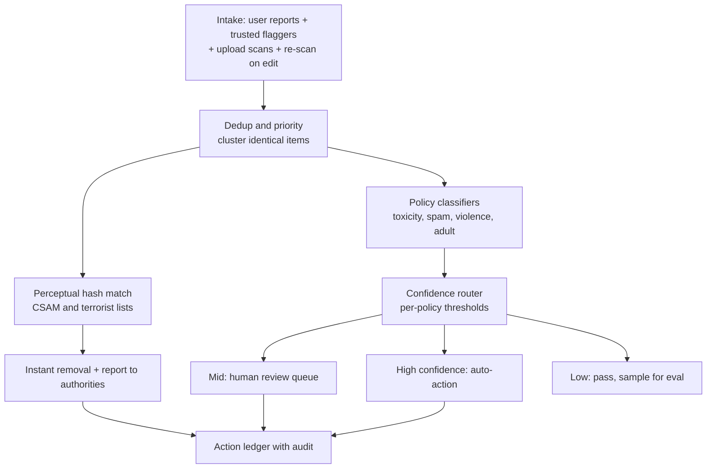
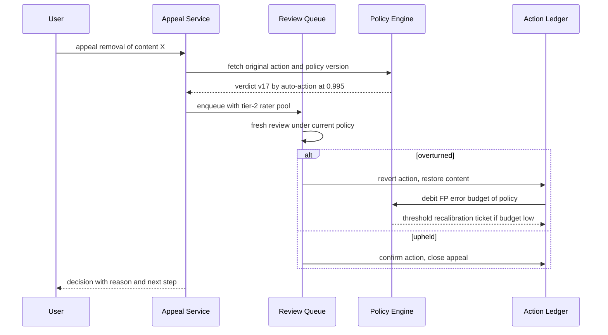

# Case Study: Design a Content Moderation Platform (Trust & Safety Pipeline)

## Overview

This is the design walkthrough for a trust & safety (T&S) pipeline: the machinery that takes user-generated content plus user reports, triages it with ML classifiers and hash matching, routes items to auto-action or human review by confidence, handles appeals against its own mistakes, and satisfies legal takedown clocks. It is a *platform* problem — text, images, video, and live streams each need different detection plumbing — and it is fundamentally adversarial: the input distribution is shifted by people actively evading your classifiers. Note the scope boundary up front: [Guardrails](../../../llm/agentic/guardrails.md) constrains *LLM inputs/outputs/actions* at inference time, and [Agent Safety](../../../ml/agents/safety.md) secures *autonomous agents*; this page is about reviewing and actioning human-created content at platform scale, which is a queueing + classification + policy-engineering problem. It appears as a 45-minute HLD round, often with a follow-up like "what happens when your classifier wrongly bans 10,000 users?"

## Step 1 — Requirements

### Functional

- **Report intake**: users report content/users with a reason code (spam, harassment, violence, sexual content involving minors, self-harm, fraud); trusted-flagger and government-notices enter the same funnel with different SLAs
- **Proactive detection**: classifiers and hash matching scan uploads before and after publication — not everything waits for a report
- **Classifier triage** across policy families: toxicity/harassment, spam/scam, sexual content, violence/incitement, and CSAM via perceptual-hash matching against shared hash lists (PhotoDNA-style)
- **Confidence-based routing**: high confidence → auto-action (remove, label, demote, restrict); mid confidence → human review queue; low confidence → ignore and sample for evaluation
- **Human review tooling**: prioritized queues, policy guidelines attached to each decision, per-policy SLA timers, appeal intake
- **Appeals**: users contest actions; wrongful actions are reverted and feed the error-budget accounting
- **Policy-as-code versioning**: policies and thresholds are versioned artifacts with staged rollout, audit trail, and rollback — like deploys, not like wikis

### Non-Functional

- **Scale**: 500M pieces of content/day across types; 10M reports/day; classifiers must run on ~6K items/s sustained (×3 peak)
- **Takedown SLAs**: legal regimes impose clocks — the EU's Terrorist Content Online Regulation requires removal within **1 hour** of a competent-authority order; DSA-style regimes require "expeditious" notice-and-action handling with strict transparency. SLA timers are a first-class system feature, not a dashboard afterthought
- **Error budgets**: false-positive removals and false-negative survivals are both budgeted per policy; exhausting a budget freezes auto-action for that policy until recalibration
- **Reviewer safety**: exposure limits, wellness escalation, and burnout controls are hard requirements — a review tooling design that ignores them is an incomplete answer
- **Latency**: report → action decision p50 < minutes for fraud/self-harm classes; p99 bounded by queue SLA rather than unbounded backlog

## Step 2 — Back-of-Envelope Estimation

| Quantity | Assumption | Result |
|---|---|---|
| Content created | 500M items/day (text, images, video) | ~5.8K items/s average, 3× peak |
| User reports | 2% of views on 1% of items → 10M/day | ~115 reports/s; dedup to ~4M distinct flagged items |
| Classifier spend | every item scanned at ingest + re-scan on edit | ~6K inference calls/s sustained |
| Violating prevalence | ~0.1% of items (varies 0.01–1% by policy) | ~500K violating items/day |
| Classifier yield | recall 90%, precision 80% | ~562K flagged/day: 450K true + 112K false positives |
| Auto-action share | 60% of flagged resolved above threshold | ~338K auto, ~225K to human queues |
| Reviewer capacity | ~60 items/hour (policy-dependent: 20–150) | 225K/day ÷ 60 = 3,750 reviewer-hours/day ≈ 470 FTE |
| Appeal volume | ~5% of actioned items appealed | ~17K appeals/day, separate queue + different rater pool |

The math to verbalize: **at 0.1% prevalence, even an 80%-precision classifier sends more false positives to humans than a mid-size company employs** — this single computation is why confidence routing, error budgets, and appeal systems exist. It also explains why platforms invest more in raising *precision at fixed recall* on high-volume policies than in chasing the last point of recall on rare ones, and why the CSAM exception matters: hash matching is near-100%-precision by design precisely because that policy cannot afford either error type.

## Step 3 — Intake and Classifier Triage

### The Pipeline Shape



- **Dedup and clustering first**: virality makes thousands of reports point at one item; clustering identical/near-identical content collapses report storms and lets one review verdict action a whole cluster. Near-duplicate detection reuses the same perceptual-hash and embedding machinery as the classifiers themselves
- **Hash matching is a different machine from ML classification**: perceptual hashes (PhotoDNA-style robust signatures; Meta's open-source PDQ for images, TAGS for video) are compared against hash lists shared via NCMEC (child safety) and GIFCT (terrorist content). Matches are near-deterministic — no confidence score needed — because the lists are curated, and the cost of a false positive (wrongly accusing someone of CSAM) is catastrophic
- **Classifier families are per-policy models**, not one giant model: a toxicity classifier (the Jigsaw/Perspective line of work — Wulczyn et al. built the crowd-labeled corpus behind it), spam/scam (gradient-boosted + text models with velocity features), violence/incitement (multimodal), adult content (vision). Each has its own thresholds, precision/recall history, and error budget
- **Re-scan on edit and context change**: content that was fine can become violating as comments arrive or it goes viral; the pipeline subscribes to mutation events, exactly like the CDC-driven index maintenance in a search system

### Queueing and Event Infrastructure

The pipeline's backbone is a log, not a mesh of RPCs — every stage reads and writes events so backpressure, replay, and audit come for free:

```text
topic: content-events        -- create/edit/delete from the product surfaces
topic: reports               -- user reports, trusted-flagger notices, authority orders
topic: classifier-verdicts   -- per-policy scores with model versions (replayable)
topic: actions               -- auto + human verdicts; the durable action ledger
queue: review-queues         -- Redis/Kafka-backed priority queues per policy tier
```

Consumer groups per stage allow independent scaling: classifier consumers lag safely under load because verdicts are timestamped and re-consumable, and a bad model deploy can be re-run by replaying `content-events` against a new model version. Queue depth and consumer lag are the SLO-relevant signals — a moderation platform that cannot answer "how far behind are we per policy tier?" is flying blind exactly when an incident spikes volume. The same event spine later feeds transparency reporting and prevalence sampling, which is why verdict events must carry model version, threshold, and policy version (see [Backpressure](../backpressure.md) for the overload policy design).

## Step 4 — Confidence-Based Routing and Error Budgets

The router is a threshold policy per (policy, content-type, region, account-risk) tuple. Thresholds are *product decisions with engineering discipline*:

| Confidence band | Action | Rationale | Failure mode absorbed |
|---|---|---|---|
| ≥ 0.99 | Auto-action (remove/label/demote) | precision near-perfect on this slice | occasional FP — paid from error budget |
| 0.60 – 0.99 | Human review, priority by reach × severity | human judgment for genuinely ambiguous | queue delay — bounded by SLA |
| < 0.60 | Pass; sample 0.1% for eval and drift detection | recall below this is noise-dominated | recall loss — measured, not ignored |
| Hash-list match | Auto-action immediately | near-zero FP tolerance design | none expected; appeals still open |

Error budgets make thresholds governable (the SRE concept applied to classifiers — see [Google SRE books](https://sre.google/books/)): each policy carries a weekly false-positive allowance, e.g., "≤ 0.5% of auto-removals may be wrongful." Every appeal that overturns an auto-action debits the budget; when exhausted, the router's auto-action arm is disabled for that policy (fall back to human-only) and recalibration becomes an incident with an owner, a fix, and a postmortem. The symmetric budget exists for false negatives — prevalence studies (sampled manual review of "passed" content) estimate missed violations — but its currency is different: FN budget exhaustion triggers model retraining and policy-scope review, not a rollback. Two-sided budgets force the precision/recall trade to be decided *explicitly per policy* rather than drifting with model redeploys.

## Step 5 — Human Review Tooling

Reviewer throughput and wellbeing determine the economics of everything above it.

- **Queue design**: priority = severity × reach × SLA-remaining; CSAM and credible-threat queues route first with dedicated tooling. Each queue entry carries the content, context (thread, account history, cluster siblings), the classifier's rationale, and the *current policy snippet* — reviewers decide against the versioned policy, and the verdict records both content ID and policy version for reproducibility
- **Guidelines as versioned artifacts**: rater guideline documents are numbered, diffable, and linked to training/certification. A policy change is a release: reviewers re-certify on the delta, and decisions made under old versions are re-examinable under appeals (the same philosophy as [Model Registry](../../../ml/mlops/model-registry.md) versioning)
- **Burnout controls are system requirements**: daily exposure caps for graphic content, mandatory rotation off high-severity queues after N minutes, wellness check-ins triggered by exposure counters, and blur-before-click defaults. State this as engineering: exposure counters are a per-reviewer rate-limited resource, implemented exactly like a [Rate Limiter](../rate-limiter.md) — the thing being limited is traumatic-content exposure
- **Throughput honest numbers**: simple spam verdicts can run 100–150 items/hour with good tooling; nuanced harassment or violence cases drop to 20–40/hour. Tooling improvements (pre-fetched context, one-keystroke verdicts, cluster actions) are usually worth more than adding reviewers — the 470-FTE estimate from Step 2 moves 30–50% with tooling quality alone

## Step 6 — Appeals and Policy-as-Code

### Appeal Flow



Design properties the interviewer wants named:

- **Appeals are reviewed by a different pool** than first-pass (second-tier raters, often humans for auto-actioned items), and the original classifier score is shown as context without being a mandate — anchoring is a real failure mode
- **Every overturned auto-action feeds the budget** (Step 4), and recurring FP *clusters* (a meme format, a dialect, a medical term) open recalibration tickets automatically rather than waiting for a human to notice
- **DSA-style regimes make appeals a legal right**: internal appeal within a fixed window (the DSA specifies 6 months for users to appeal), plus out-of-court dispute options and transparency reporting of decision accuracy. The system design consequence is simple: the action ledger must retain enough detail (content, policy version, threshold, reviewer ID, evidence) to re-litigate any decision months later

### Policy-as-Code

Policies ("no coordinated harassment," "no sale of weapons") are encoded as versioned configuration: policy text version + classifier ensemble + thresholds + regional overrides. Treat it like infrastructure:

```text
policy: harassment
  version: 17
  classifiers: [toxicity@8.3, insult@4.1, context@2.7]
  thresholds: { auto_action: 0.99, review: 0.60 }
  regional_overrides: { EU: { takedown_sla: "24h", appeal_window_days: 180 } }
  error_budget: { fp_weekly: 0.5%, fn_action: "retrain trigger" }
  rollout: { canary: 5%, duration_days: 7, owner: ts-policy-oncall }
```

Canary rollout compares the new policy's action rate and FP rate against the old on live traffic (shadow mode first), with automatic rollback on budget breach — the same deployment discipline as model canaries. OPA-style policy engines are the natural implementation substrate for the regional-override and notice-and-action rule evaluation (see [OPA documentation](https://www.openpolicyagent.org/docs/)); the anti-pattern is policies living in reviewer tribal knowledge or in wiki text that no machine can evaluate.

### Action Ledger and Core Entities

The ledger is the system's memory; its schema decides whether appeals, audits, and re-reviews are queries or archaeology:

```text
actions        (id, content_id, policy, policy_version, action, confidence,
                source: auto|human, reviewer_id?, created_at)
appeals        (id, action_id, reason, state, tier, decided_at, outcome)
queues         (policy, tier, priority, sla_deadline, depth_gauge)
content_state  (content_id, status: live|restricted|removed|deleted, region_overrides)
```

`policy_version` on every action row is the property that makes the whole system replayable — re-review jobs after a policy change are a filtered scan plus re-enqueue, not a manual hunt. `content_state` is the serving-side truth the product surfaces read; it changes only through ledger events, so the state and its justifications can never diverge.

## Step 7 — Hard Cases and Metrics

### Context, Memes, and Multilingual Content

- **Context changes meaning**: a slur quoted in a counter-speech post, a news screenshot of violence, a comedy sketch depicting harassment. Architectural answer: classifiers consume context features (thread ancestry, quoted text, account role, caption-OCR for images) rather than raw text alone — and the highest-ambiguity band is precisely the one routed to humans, which is the system working as designed
- **Memes are adversarial re-encodings**: the same violation keeps reappearing with new imagery/text; near-duplicate embeddings (not byte hashes) catch visual templates, and a fast lane exists for "new template" clusters to get human verdicts that then train the next model iteration
- **Multilingual is a resource-allocation problem**: classifier quality degrades in low-resource languages; honest platforms either invest in per-language fine-tuning and raters or throttle policy coverage and *say so* in transparency reports. The failure to design for this is how moderation ends up effectively English-only
- **Live streams are a separate regime**: you cannot "remove" a live broadcast the way you delete a post — the design shifts to low-latency classifiers on frames/audio with a seconds-scale kill switch, which trades precision for reaction time

### Metrics and the Prevalence Problem

| Metric | Measures | Trap |
|---|---|---|
| Precision on actions | share of removals that were correct | overstates quality if you only action easy cases |
| Recall | share of true violations caught | unmeasurable directly — needs prevalence sampling |
| Prevalence | violating share of all content | **the** north-star metric; hard to estimate cheaply |
| Time-to-action | report → decision latency | gaming risk: fast wrong decisions beat slow right ones |
| Appeal overturn rate | FP proxy per policy | lags weeks; appeal rates themselves vary by culture |

The **prevalence problem** is the metric trap interviewers love: removals and precision are measured on *flagged* content, but the real health metric is violating content *in the wild*, which you estimate by randomly sampling unflagged content for expert review. Sampling 0.1% of 500M items/day is still 500K expert judgments/day — so prevalence estimation is itself a sampling-budget design problem (stratify by risk, weight by reach, CI-aware reporting). A platform that reports only "we removed 12M items" without a prevalence estimate is reporting effort, not safety.

### Regional Law Compliance

Legal regimes differ in what they mandate, and the pipeline must absorb them as configuration rather than forks:

- **DSA-style regimes (EU)**: notice-and-action with expeditious handling, a right to internal appeal within a fixed window, statements of reasons for every restriction (machine-readable, feeding the EU transparency database), and stricter obligations for very-large platforms including risk assessments. The engineering residue: per-action reason codes, appeal windows as timers, and transparency reporting as a batch job over the ledger
- **Terrorist-content clocks (EU TCO Regulation)**: removal within 1 hour of a member-state competent-authority order — a hard SLA that requires priority intake lanes for authority notices, on-call escalation, and pre-authorized action templates
- **Jurisdictional scoping**: geoblocking (restrict-by-region) instead of global removal where laws conflict; regional overrides in policy-as-code (Step 6) encode this, and the serving layer enforces it at content delivery, not at deletion
- **Data-protection interactions**: moderation evidence retention (screenshots, model inputs) collides with deletion rights; the resolution is purpose-bound retention schedules stored alongside the ledger, with legal-hold flags winning over user deletion until resolved

## Bottlenecks & Follow-Up Questions

- **Classifier inference cost at 6K calls/s**: follow-up: "GPU budget?" → cascade architecture: cheap strong-signal filters (hash match, regex, velocity) first, big models only on survivors; batch where SLAs allow
- **Queue meltdown during a viral incident**: a political event 100×'s reports on one cluster; answer: cluster-level verdicts collapse the storm, priority re-ranking sheds low-reach items, and pre-arranged surge reviewer rosters (including outsourced partners) absorb the rest
- **Threshold coupling across policies**: demoting for toxicity and removing for violence interact (a demoted item still accumulates reports); answer: policies act through a single action-arbiter so the strongest action wins deterministically and the ledger records each policy's contribution
- **Reviewer attrition**: 30–40% annual attrition is normal in the industry; the burnout controls of Step 5 are also throughput protection — every experienced reviewer lost costs re-training and calibration drift
- **Policy churn**: a world event invalidates 3 policies overnight; answer: policy-as-code with fast canary cycles and a standing emergency-policy lane, plus retroactive re-review jobs over the ledger for items judged under the superseded version
- **Cross-border conflicts**: legal in one region, illegal in another; answer: regional overrides in policy-as-code + geo-scoping at serving, never silent global rules
- **Cross-service action fanout**: one removal must reach search indexes, feeds, CDN caches, notifications, and recommendation candidates; answer: the action ledger is the source of truth and downstream systems subscribe — eventual convergence with a bounded propagation SLO, like deletion propagation in a storage system
- **Trusted-flagger abuse**: a "trusted" source flooding low-quality notices to game SLA priorities; answer: flagger scorecards (precision of past notices) with automatic demotion — SLA lanes are a scarce resource any adversary will probe
- **Audit storage growth**: the ledger retains every verdict forever for appeals and transparency; answer: tier the ledger (hot 90 days, cold object storage after), keep tombstone-level summaries hot, and prove cold-tier retrievability with restore drills — the compliance tail reads old decisions, not old queues

## Interview Questions

1. **Why does CSAM detection use hash matching instead of ML classifiers?** Because both error types are unacceptable and hash matching eliminates one of them: a PhotoDNA-style perceptual hash matches a *curated* list of previously-identified images (verified by human experts and shared via NCMEC), so precision is near-perfect and the decision is auditable — "this image matches hash H in list L." ML classifiers estimate a probability and will always have a nonzero false-positive rate, which is intolerable when a false accusation of CSAM destroys a life and triggers legal exposure. ML still plays a role for never-before-seen CSAM, but its role is to route to humans, not to auto-accuse.
2. **Your classifier precision is 80% at 0.1% prevalence — what does that mean operationally?** Of ~562K flagged items/day, ~112K are false positives that land on real users or reviewer queues; at 60 items/hour that FP stream alone consumes ~1,900 reviewer-hours daily. The operational levers, in order: raise precision on the auto-action band only (the ≥0.99 slice absorbs few FPs), move the review threshold rather than the model when queues overflow, and pay down FP clusters surfaced by appeals. The point interviewers look for: precision at low prevalence cannot be read off a confusion matrix you built on a balanced test set — evaluate on the true, skewed distribution.
3. **Design the error budget for a moderation policy.** Pick the currency per error type: weekly wrongful-removal rate (FP) and weekly missed-violation rate (FN, from prevalence sampling). Set caps per policy severity — e.g., 0.5% FP for spam (cheap to undo), near-zero FP for auto-actioned harassment bans, and no auto-action at all for policies where FPs are irreversible. When a budget is exhausted: disable the automated arm (fail toward human review, the safe degradation), page the policy owner, recalibrate thresholds or roll back the last policy release, and write a postmortem. This is the SRE error-budget loop transplanted to classifiers, and it is what makes threshold changes governable rather than vibes.
4. **What does policy-as-code buy that a wiki of guidelines does not?** Machine evaluability and auditability: thresholds, regional overrides, and rollout state become configuration that the router executes and the ledger records, so any historical action can be replayed under the exact policy version that produced it — which appeals and DSA-style transparency reporting require. It also enables engineering discipline on change: canary rollouts, shadow evaluation against live traffic, automatic rollback on error-budget breach. The wiki remains, but as human-readable documentation *generated from and linked to* the code, never as the source of truth.
5. **How do you handle a meme format that evades classifiers but violates policy?** Detection shifts from content bytes to structure: embedding-based near-duplicate clustering catches new instances of the same visual template even when text changes; the first few human-verdicted examples seed a rapid-response lane that auto-flags cluster members for review; and the labeled cluster becomes training data for the next model refresh. The honest framing: this is an arms race with a measured defender's latency — the goal is bounding time-to-cluster-verdict (minutes, not days), not winning permanently.
6. **How does this platform differ from LLM guardrails, and where do they share machinery?** This platform actions *published human content* against platform policy with legal clocks, appeals, and prevalence obligations; guardrails filter *model inputs/outputs at inference time* with millisecond budgets and no appeal loop — the failure surfaces (a bad answer vs a wrongful ban) and latency regimes are entirely different. Shared machinery: the classifier stacks, threshold-routing patterns, and evaluation discipline (precision/recall, drift monitoring) transfer directly; even LLM-based moderation judges reused here are just classifiers with a different serving contract. Saying which parts transfer and which do not is exactly the scoping judgment the question tests.

## Key Takeaways

- Moderation at scale is a pipeline: dedup/cluster → hash matching → per-policy classifiers → confidence routing → human queues → appeals — each stage exists because the next one's economics demand it
- Confidence bands with per-policy thresholds turn a probabilistic classifier into governable actions; hash matching handles the near-zero-FP-tolerance policies
- Error budgets (FP and FN, separately) are the control loop that ties classifier quality to auto-action privileges — exhausting the budget fails toward human review, not toward silence
- Reviewer economics dominate cost: ~470 FTE for a mid-scale platform is plausible, and tooling plus burnout controls move throughput more than headcount
- Policy-as-code with canary rollout, regional overrides, and a detailed action ledger is what makes appeals, legal takedown clocks, and transparency reporting possible
- Prevalence is the north-star metric and the hardest to measure — sampled expert review of unflagged content, CI-aware, is the only honest estimator
- Scope boundaries matter: this is not LLM guardrails (inference-time, latency-bound) or agent safety (tool/action security), though they share classifier and evaluation machinery

## References

- Wulczyn, Thain, Dixon, "Ex Machina: Personal Attacks Seen at Scale," WWW 2016 — the crowd-labeled toxicity corpus and methodology behind Perspective-style classifiers: https://arxiv.org/abs/1610.08914
- Jigsaw Perspective API documentation — production toxicity-classification API: https://perspectiveapi.com
- Microsoft PhotoDNA — perceptual-hash matching for CSAM detection: https://www.microsoft.com/en-us/photodna
- Meta ThreatExchange — open-source PDQ/TAGS perceptual hashing for image/video hash sharing: https://github.com/facebook/ThreatExchange
- NCMEC CyberTipline — reporting and hash-list infrastructure for child safety: https://report.cybertip.org/
- Open Policy Agent documentation — policy-as-code evaluation engine: https://www.openpolicyagent.org/docs/
- Regulation (EU) 2022/2065 (Digital Services Act) — notice-and-action, appeals, transparency obligations: https://eur-lex.europa.eu/legal-content/EN/TXT/?uri=CELEX%3A32022R2065
- Regulation (EU) 2021/784 (Terrorist Content Online) — the 1-hour takedown obligation for competent-authority orders (cited as regulation; EUR-Lex portal)
- Google SRE books — error budgets, toil, and safe degradation patterns: https://sre.google/books/
- Apache Kafka documentation — the event-log backbone for content events, verdicts, and the action ledger: https://kafka.apache.org/documentation/

## Cross-References

- [LLM: Guardrails](../../../llm/agentic/guardrails.md) — the inference-time sibling: rail types, PII redaction, and latency budgets for model I/O
- [ML: Agent Safety](../../../ml/agents/safety.md) — securing autonomous agents (prompt injection, tool safety), the other half of the trust & safety surface
- [Real-World: Reddit](../real-world/reddit.md) — community-level moderation structures and where platform tooling meets volunteer mods
- [Real-World: YouTube](../real-world/youtube.md) — Content ID and copyright matching, a sibling hash-matching pipeline with different policy economics
- [Design: Rate Limiter](../rate-limiter.md) — the rate-limiting pattern reused for reviewer exposure caps and report-storm control
- [ML: Fraud Detection System Design](../../../ml/system-design/fraud-detection.md) — the adversarial-detection feature/serving stack behind scam and ATO classifiers
- [ML: Model Registry](../../../ml/mlops/model-registry.md) — versioning discipline that policy-as-code and classifier releases inherit
- [Case Study: Social Graph Service](./social-graph-service.md) — the graph queries behind coordinated-behavior and brigading detection
- [Case Study: Dating App](./dating-app.md) — the consumer-facing sibling where profile and chat moderation meet matching abuse
- [References: Distributed Systems Library](../../../references/distributed-systems.md) — verified primary sources for the event-bus and store layers under the pipeline
