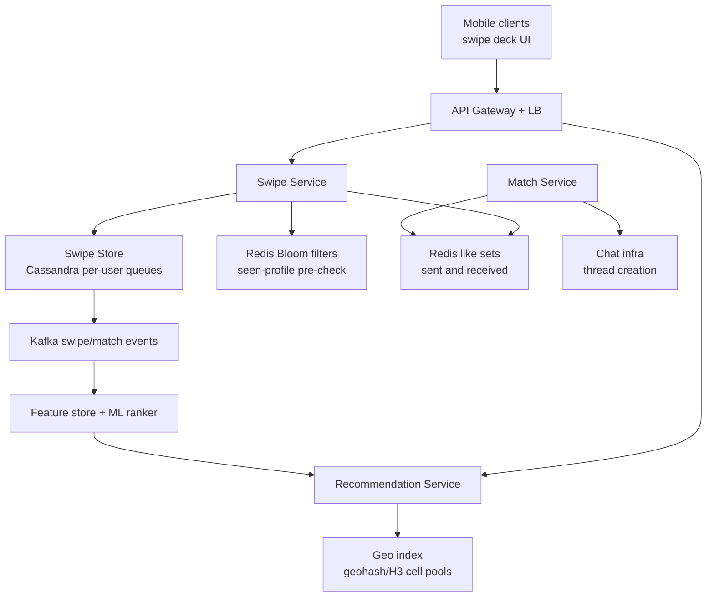
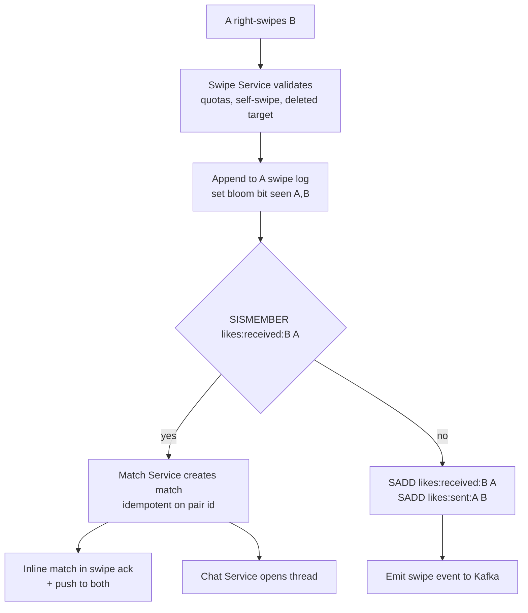
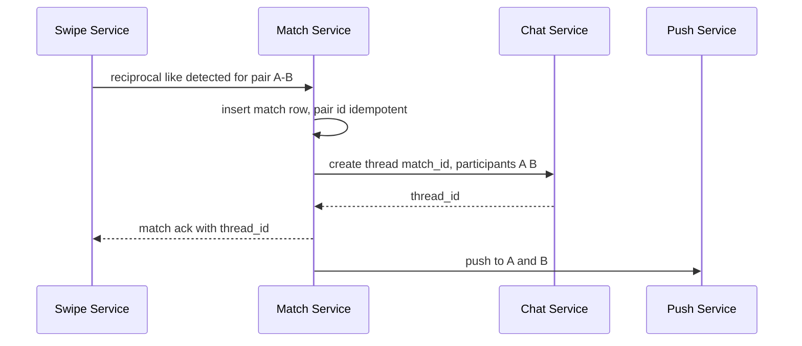

# Case Study: Design a Dating App (Tinder/Bumble HLD)

## Overview

"Design Tinder" is the canonical write-heavy marketplace interview: every session is a stream of swipe writes against a recommendation service that must return fresh, nearby, filter-compatible candidates in under ~150 ms, and the entire product is one hot loop — swipe, recommend, match, chat. This page designs that loop end to end: a write-optimized swipe store with per-user queues, geo-indexed recommendation serving over geohash/H3 cells, reciprocal-like match detection with Redis sets behind a Bloom-filter pre-check, the handoff of matches into messaging infrastructure, and the event pipeline that feeds analytics and ML ranking. It is deliberately different from [How Instagram Works](../real-world/instagram.md): Instagram serves a ranked feed over a durable follow graph where content persists for years; a dating deck is an ephemeral per-session candidate queue where geography is the dominant ranking feature, the social graph is never exposed, and privacy fails closed because a wrongly exposed profile is a safety incident, not a bug report.

## Step 1 — Requirements

### Functional

- Profiles: photos (CDN-served), age, gender, bio, preferences (age range, gender sought, max distance in km)
- Swipe mechanics: right (like), left (pass), with a per-user limit on free likes (e.g., ~100/12 h) that resets — a monetization coupling that also throttles the write path
- **Mutual match**: a match exists only when A likes B *and* B likes A; both users get notified and a chat thread opens
- Recommendation deck: a fresh, ordered list of candidates per session, honoring age/gender/distance filters and never re-showing recently seen profiles
- Blocking and reporting: a block must remove both users from each other's decks, sever any match, and prevent future re-appearance within seconds
- Telemetry: every swipe, deck impression, and match is an event for analytics and ML ranking

### Non-Functional

- **Scale**: ~75M monthly actives (Tinder's publicly reported order of magnitude), ~30M DAU, on the order of 1.6B swipes/day and ~26M matches/day (company-reported figures)
- **Latency**: deck request p99 < 150 ms server-side; swipe ack < 100 ms; match notification push < 2 s
- **Consistency**: a swipe must be durable before ack (users retry angrily); matches are created exactly once per pair; decks may be eventually consistent (a stale deck is survivable, a double-shown profile is annoying but not fatal)
- **Privacy**: profiles are visible only inside the deck pipeline of eligible users — there is no public profile URL; blocks propagate on a priority path
- **Availability**: degrade deck freshness or deck size before failing; swipes buffer client-side on network loss

## Step 2 — Back-of-Envelope Estimation

Derive the write rate first, then show that the serving tier is the read problem. Every swiped card required a profile read, and the loop ratio is what sets cache sizing.

| Quantity | Assumption | Result |
|---|---|---|
| DAU / sessions | 30M DAU × ~10 sessions/day | 300M sessions/day |
| Swipes | ~1.6B/day reported | ~18.5K/s avg, ~90–100K/s evening peak (5×) |
| Right-swipes (likes) | ~1/3 of swipes | ~530M likes/day ≈ 6.1K/s |
| Matches | ~26M/day reported | ~300/s sustained match creation |
| Deck deliveries | 300M sessions × 30 cards | ~9B card reads/day ≈ 100K/s avg, 500K/s peak |
| Read:write ratio | ~50 reads per swipe write (profile, prefs, geo, pool metadata × cards) | ~50:1 — read-dominated serving over a write-heavy store |
| Swipe rows | 1.6B × ~100 B, replication factor 3 | ~480 GB/day raw, ~52 TB/quarter with 90-day TTL |
| Like-set memory | per-user like sets, 90-day TTL | hundreds of bytes to a few KB per user |
| Bloom filters | 50K seen profiles/user at 1% FPR | \\( m \\approx 9.6n \\) bits ≈ 60 KB/user; 75M users ≈ 4.5 GB total |

The two sentences to say out loud: the write path is a flat, append-heavy key-value workload that Cassandra-class stores eat for breakfast, and the hard parts are the **deck read path** (geo + filters + never-reshow at 100K/s) and the **match moment** (a cross-user write that must be exactly-once per pair).

## Step 3 — API Sketch

```text
POST /v1/swipes            body: { target_id, direction: like|pass|super_like }
                           → { ack, match: {match_id, thread_id} | null }
GET  /v1/deck?count=20     → { cards: [{profile_id, name, age, distance_km, photo_urls}], cursor }
GET  /v1/matches           ?cursor= → paginated match list with unread counts
POST /v1/blocks            body: { target_id } → removes deck visibility + matches
POST /v1/reports           body: { target_id, reason } → safety queue
WS   /v1/realtime          → match notifications, chat delivery (owned by chat infra)
```

Decisions worth stating out loud:

- The swipe response carries the match inline — the client should learn "it's a match!" from the swipe ack itself, not from a later push, so the celebratory UI fires at swipe time
- Deck is **stateless and recomputed per request** from a cached cell-level candidate pool; there is no per-user materialized deck to keep coherent
- `direction` is an enum, not a boolean, because super_like is a distinct write with different quotas and event weight

## Step 4 — High-Level Architecture



- **Swipe Service** owns durability: append the swipe, update the Bloom filter, check reciprocity, emit events. It is stateless and shards trivially by `user_id`
- **Recommendation Service** owns the deck: it merges candidate pools from the geo index, applies hard filters (age/gender/distance), applies the never-reshow filter, then ranks
- **Match Service** listens for reciprocal likes and is the only writer of the `matches` table — single-owner writes avoid double-create races (same pattern as the auction room in [Case Study: Live Auction](./live-auction.md))
- **Kafka** decouples the synchronous loop from analytics, ML feature materialization, and notification fanout

## Step 5 — Swipe Store: Write-Heavy Per-User Queues

The store is Cassandra (or DynamoDB — same shape): wide rows partitioned by user, append-only, TTL-managed. Per-user partitioning is the whole trick — a user's swipe history, like set, and pass set are always one partition, so "have I seen this profile?" and "build me my deck diff" are single-partition reads.

```text
swipes (
  user_id        uuid,        -- partition key
  week           int,         -- clustering: bucket to bound partition size
  target_id      uuid,
  direction      tinyint,     -- like | pass | super_like
  created_at     timestamp,
  PRIMARY KEY ((user_id), week, target_id)
) WITH default_time_to_live = 7776000;   -- 90 days

matches (
  pair_id        text,        -- sha256(min(user_a, user_b) + max(user_a, user_b))
  user_a uuid, user_b uuid,
  created_at     timestamp,
  state          tinyint,     -- active | unmatched | blocked
  PRIMARY KEY (pair_id)
)
```

- Partition-per-user-week keeps rows per partition in the low thousands (heavy users: ~500 swipes/day × 7 = 3.5K), safely under compaction and read-latency limits
- Writes are 18.5K/s average with a 5× evening peak — Cassandra absorbs this as coordinated-omit-free, log-structured appends; the ack path is one local quorum write
- The **pass set never needs full durability** — a re-shown profile after a cache miss is a product annoyance, so passes are also mirrored into the Bloom filter where 60 KB/user buys the O(1) negative check that protects the deck path
- Like history is the durable part: it drives match reciprocity for up to 90 days, which is why likes live in Redis sets (hot) *and* Cassandra (system of record)

## Deep Dive 1 — Geo-Indexed Recommendation Serving

Distance is the first-order ranking feature: the deck is "candidates within X km, filtered, then ranked." The index maps a moving user to candidate pools by cell, not by exact coordinates — recomputing "everyone within 4.9 km of me" at 100K deck requests/s is impossible, but reading a **precomputed cell pool** is one Redis GET.

| Encoding | Cell shape | Useful precision | Why it fits (or does not) |
|---|---|---|---|
| Geohash | rectangles | prec 5 ≈ 4.9 km; prec 6 ≈ 1.2 × 0.6 km | prefix-ordered keys, trivial shard layout; uneven cell shapes near edges |
| H3 (Uber) | hexagons | res 7 ≈ 1.2 km edge, ~5.2 km² | uniform neighbor distance, hierarchical `k-ring` expansion, 64-bit cell id |
| S2 | quad tree cells | level 10–12 | best edge/region math; more complex than needed for city-scale decks |

Serving algorithm, expressed as the loop the service actually runs:

```text
deck(user, filters):
  cell  = h3(user.location, res=7)          # ~1.2 km cells
  pool  = cache.get(cell)                   # TTL 15-30 min, refreshed by workers
  for ring in 1..k:                         # expand 6k neighbors until enough
      if len(pool_after_filters) >= 200: break
      pool += cache.get(k_ring(cell, ring))
  cards = [c in pool if age_ok(c) and gender_ok(c) and dist_ok(c)
           and not bloom.seen(user, c.id)]
  return rank(cards)[:20]                   # ML ranker, Deep Dive 4
```

- Cell pools are keyed by `(cell_id, gender_seek, age_band)` — the two hard filters that carve the population — so the per-request filter work shrinks to distance and freshness
- Urban density is extreme: a Manhattan-size pool can hold tens of thousands of actives per cell; rural users expand rings cheaply. This is the same geo-index pattern as [Real-World: Ride Hailing](../real-world/ride-hailing.md), but with denser cells and no driver heartbeat
- Users only update their cell on app open / significant movement, so pool membership churns slowly; the 15–30 min pool TTL bounds staleness
- Distance shown in the UI is a band ("3 km away"), not a survey-grade number — approximate is the product norm and saves per-card distance computation

## Deep Dive 2 — Mutual-Match Detection

Match detection is the intersection of two like sets — but you never need a full intersection. When A likes B, exactly one question matters: **is B in A's received-likes set?** That is a single `SISMEMBER likes:received:{B} A` — O(1) — and only the yes-path creates a match row.



- **Bloom filter pre-check**: the expensive path is not the check itself but the misses — before any set lookup, `bloom.seen(A, B)` eliminates "swiped this person 40 times in a rage" replays and stale-deck reswipes for ~60 KB/user. Bloom filters have false positives only, so a "possibly seen" answer falls through to the authoritative set/Cassandra check (see [Probabilistic Data Structures](../probabilistic-data-structures.md))
- **Hot-user skew**: popular profiles collect thousands of received likes/day. The received set is capped (e.g., 30-day TTL, max ~10K members) and fronted by a per-target Bloom filter — the Bloom pre-check converts 99% of reciprocity probes into one memory probe, which is what keeps the match path O(1) for celebrities of the swipe world
- **Idempotency**: `pair_id = sha256(min(a,b)+max(a,b))` makes match creation idempotent — both users swiping in the same millisecond converge on one row, one thread, one notification pair
- **Unmatch and block** flip `state` and are also single-writer events: they must remove deck visibility in both directions *and* deactivate the chat thread

## Deep Dive 3 — Match Chat: Fanning Into Messaging Infra

A match is the contract between the dating system and the messaging system. The dating side owns: who may talk (the match row is the ACL), thread bootstrap, and unmatch/block semantics. The chat side owns delivery, presence, and history — it must not know what dating is.



- Thread creation is a **synchronous step of match creation** — the swipe ack should carry a usable `thread_id`, so first message latency after "It's a match!" is one RTT, not a bootstrap round trip
- Unread counts, typing indicators, and message delivery are chat-domain concerns; the design seam is "match row = membership + permission," consumed by chat (see [Design: Chat](../chat.md) and [Real-World: Chat System](../real-world/chat-system.md) for the messaging internals)
- Unmatch is a **dating-domain write that deactivates the thread**: the chat system marks the thread read-only for both sides and scrubs it per retention policy; neither user can re-enter
- Message volume is the fraction of matches that chat, not the match rate — 26M matches/day might seed ~26M threads/day but chat QPS is governed by engaged conversations, which the messaging design (fanout, per-user queues, delivery receipts) already handles

## Deep Dive 4 — Event Pipeline for Analytics and ML Ranking

Every swipe, impression, and match is an event on Kafka, and ranking is the consumer that matters most. The deck quality metric is match rate per impression — the product literally trains on its own loop — so the pipeline's correctness (no lost swipes, no double-counted impressions) is a revenue question, not a hygiene one.

- **Raw events**: `swipe`, `deck_impression`, `match`, `message_sent`, `block/report` — partitioned by `user_id` for per-user feature joins, retained 30–90 days
- **Stream processing** (Flink-class) materializes per-user features into the feature store: like rate, pass rate, response time to matches, photo engagement, activity recency. Serving reads these features at deck time; training reads the same store offline — the serving/training consistency argument is the core of [Case Study: ML Feature Store](./feature-store.md)
- **Ranking** is two-stage: cheap hard filters in the serving path (must be exact), then a learned score over the filtered pool (~200–500 candidates) that reorders the final 20. Never put the ML model before the filters — a model that wastes slots on ineligible users burns the most expensive resource in the system, the deck slot
- **Feedback loops are skewed**: popular users appear in many pools, get swiped more, appear more — ranking must explicitly correct exposure (exploration slots, per-candidate impression budgets) or the deck collapses to the same 50 faces for everyone. Tinder's "Smart Photos" (reordering a user's own photos by swipe response) is the canonical example of closing this loop per-user
- **Analytics consumers** (dashboards, cohort funnels, A/B tests) read a warehouse fed by the same stream — one event spine, many consumers, no dual writes

## Deep Dive 5 — Privacy, Blocks, and Abuse Controls

Dating is the highest-stakes privacy surface in consumer social: there is no public profile, and exposure without consent is the failure mode. The design encodes this structurally, not as an afterthought.

- **No direct profile fetch**: the only path to a profile body is "it was in an eligible deck for you" — there is no `GET /profile/{id}` the client can scrape; even matched profile views go through the match-scoped endpoint
- **Blocks are a priority-path write**: on block, both users are removed from each other's cached cell pools within seconds (pool invalidation by user id, not waiting for TTL), the match row flips to `blocked`, the thread is deactivated, and the Bloom filters of both users get the pair — the blocked user must not reappear even via stale pools
- **Report pipeline** feeds a safety queue with full event context (recent swipes, messages, device/session ids); high-severity reports (threats, minors) bypass queues to human review. This is an abuse-detection problem in the same family as the fraud paths in payments, with the same rule: ML scores assist, humans decide
- **Rate limiting** bounds the write path per user (swipe rate, super-like quota, new-account like limits) with the token-bucket machinery in [Rate Limiter](../rate-limiter.md); it doubles as bot throttling
- **Location fuzzing**: stored/served location is quantized to the serving cell (≈1 km for H3 res 7) and never exact; distance bands in the UI prevent triangulation from multiple sightings
- **Ghost/deleted states**: deleted profiles must fall out of pools via the same invalidation channel; a deleted user receiving "someone liked you" notifications is a real production incident class

## Bottlenecks & Follow-Up Questions

- **Super-dense cells** (festivals, dense downtowns): one cell pool becomes the hot key for 100K users. Follow-up: shard pools by `hash(user_id) mod N` sub-pools and merge at read; or downgrade cell precision during detected spikes
- **Bloom filter drift**: filters are rebuilt from Cassandra like/pass logs on rebuild; follow-up: "what if the rebuild lags?" → accept occasional re-shows, never accept false "never seen" (Bloom has no false negatives — rebuilds only shrink)
- **Match notification storms** at peak (~300 matches/s = 600 pushes/s): trivial volume, but push providers rate-limit per app — batch and dedup, prioritize match pushes over marketing
- **Cross-region** travel: user opens the app abroad; home-region pools are useless — decks must be served region-locally, so the geo index is itself multi-region with per-region pools and user profiles replicated (eventually) across regions
- **Super-like abuse / spam accounts**: new accounts are rate-limited and ranked with an exploration budget; device/IP graph features feed the safety pipeline (post-hoc scoring, not inline blocking)
- **10× scale**: the write path scales horizontally by construction; the deck path scales by cell-pool sharding and ranking-stage cost control — the thing to protect is p99 deck latency, not swipe QPS

## Interview Questions

1. **Why per-user queues in Cassandra instead of one global candidate index?** The workload is 1.6B appends/day that are always read back per-user (seen check, history, reciprocity), so partitioning by user makes every hot path single-partition. A global geo index would centralize the hottest data (dense-city cells) and force cross-node writes on every swipe. Geo pools are rebuilt *from* the per-user store by background workers — Cassandra is the truth, the geo pools are a derived cache. This split (write-optimized per-user truth + read-optimized derived pools) is the load-bearing decision.
2. **Walk me through the exact-once match moment.** A's like triggers one probe: `SISMEMBER likes:received:{B} A`. If yes, the Match Service inserts `pair_id = sha256(min+max)` with an idempotency check, opens the chat thread synchronously, returns the match inline in the swipe ack, and emits events. If both swipe concurrently, both inserts race on the same primary key and one wins; the loser reads back the winner's row. Exactly-once at the product level (one match, one thread, two pushes) comes from the single-writer Match Service plus idempotent keys, not from distributed transactions.
3. **Why a Bloom filter pre-check, and what are its failure modes?** The deck path must reject re-shows and re-swipes before touching sets or Cassandra, and at 100K deck requests/s that check is per-card. A 60 KB filter (50K items at 1% FPR, ~9.6 bits/item) answers "definitely not seen" in one memory probe. Failure modes: false positives (→ fall through to the authoritative set, slightly more work, never wrong) and rebuild lag (→ only reduces the filter, so worst case is a re-show, never a missed candidate). Bloom filters have no false negatives, which is the property that makes them safe here.
4. **How do you keep deck latency under 150 ms with geo + filters + ML?** Precompute pools per `(cell, gender_seek, age_band)` with a 15–30 min TTL so the request path is cache reads + set intersections, not geo queries. Hard filters are O(pool) boolean checks on small candidate vectors. The ML ranker sees only the 200–500 post-filter candidates and is itself shallow (feature dot products or a small model served from the feature store). The k-ring expansion is bounded, and the whole serving path is stateless — no per-user deck state to invalidate.
5. **A user blocks a harasser — enumerate everything that must happen and by when.** Within seconds: deck pools invalidated in both directions (priority channel, not TTL), match row → blocked, chat thread deactivated and scrubbed per policy, both users' seen-filters updated so the blocked user cannot reappear through stale caches, and the report (if filed) lands in the safety queue with event context. Blocks are the one path in this system on a strong-consistency-ish fast lane because they are a safety boundary; everything else stays eventual.
6. **Where does this design end and the messaging design begin?** The dating system owns match membership and permissions (the match row), thread bootstrap, and unmatch/block semantics; the messaging system owns delivery, presence, history, and unread counts, consuming "thread created/deactivated" events. Conflating them couples a write-heavy marketplace to a fanout-heavy messaging system with different scaling regimes — the same service-boundary argument as keeping the feed out of the social graph in [Case Study: Social Graph Service](./social-graph-service.md).

## Key Takeaways

- The loop is: swipe (write-heavy, per-user partitioned), deck (read-dominated, ~50:1), match (cross-user exactly-once), chat (a different subsystem) — name the four regimes before designing anything
- Cassandra/DynamoDB with partition-per-user(-week) makes every per-user path single-partition; the geo index is a derived, rebuildable cache, not the system of record
- Deck serving = cached cell pools (geohash/H3) + hard filters + never-reshow (Bloom) + rank last; ML ranks the filtered pool, never before it
- Match detection is one O(1) `SISMEMBER` against the received-likes set behind a Bloom pre-check; `pair_id` hashing makes it idempotent under concurrent mutual swipes
- Blocks and reports are safety boundaries on a priority invalidation path — the only place this eventually-consistent system behaves strongly
- Events are a product asset: the same Kafka spine feeds analytics, the feature store, and the exposure-correcting feedback loop that keeps decks diverse
- Privacy is structural: no direct profile fetch, cell-quantized location, distance bands, and fail-closed visibility defaults

## References

- Apache Cassandra documentation — wide-column store for the append-only swipe log: https://cassandra.apache.org/doc/latest/
- Redis documentation — sets, `SISMEMBER`, and Bloom-filter-based pre-checks: https://redis.io/docs/latest/
- Apache Kafka documentation — the swipe/match/impression event spine: https://kafka.apache.org/documentation/
- Amazon DynamoDB documentation — the equivalent per-user partition design on AWS: https://docs.aws.amazon.com/dynamodb/
- Elasticsearch documentation — the ad-hoc-filter alternative for candidate retrieval: https://www.elastic.co/docs
- H3 — Uber's hexagonal hierarchical geospatial indexing system: https://h3geo.org/
- Bloom, B. H., "Space/Time Trade-offs in Hash Coding with Allowable Errors," Communications of the ACM, 1970 (no URL cited — foundational Bloom filter paper)
- Apache Flink documentation — stream processing for feature materialization: https://nightlies.apache.org/flink/flink-docs-stable/

## Cross-References

- [Case Study: Social Graph Service](./social-graph-service.md) — the sibling that handles like/follow sets at scale; match detection is its intersection problem in miniature
- [Real-World: Instagram](../real-world/instagram.md) — the contrast case: durable follow-graph feed vs ephemeral geo-deck
- [Real-World: Ride Hailing](../real-world/ride-hailing.md) — the same geohash/H3 geo-index machinery under driver/rider matching
- [Design: Chat](../chat.md) and [Real-World: Chat System](../real-world/chat-system.md) — the messaging infra matches fan into
- [Probabilistic Data Structures](../probabilistic-data-structures.md) — the Bloom filter math behind the never-reshow and pre-check layers
- [Rate Limiter](../rate-limiter.md) — swipe quotas and abuse throttling mechanics
- [Case Study: ML Feature Store](./feature-store.md) — serving/training consistency for the ranking features
- [Case Study: Design a CDN](./cdn-service.md) — profile photo and asset delivery at swipe volume
- [References: Distributed Systems Library](../../../references/distributed-systems.md) — verified primary sources for the stores used here
