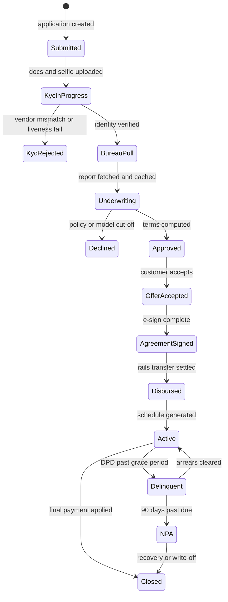
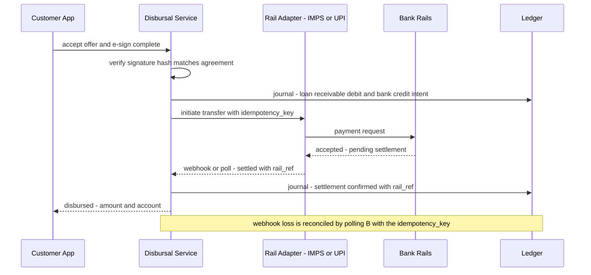

# Case Study: Design a Digital Lending Platform (Loan Origination)

## Overview

This is the 45-minute walkthrough for designing a digital lending stack: an application funnel that turns a signup into a disbursed loan in minutes, KYC with document and liveness checks, credit-bureau pulls against a rate-limited external API, a hybrid underwriting engine (deterministic rules + ML score serving), e-signed loan agreements, disbursal over real payment rails, and then the unglamorous half that actually decides profitability — repayment schedules, NPA classification, collections workflows, and a double-entry ledger. The interview surface is unusually wide because lending is a *lifecycle* system, not a funnel: the disbursement moment is the midpoint of the design, not the finish line. Expect follow-ups on regulatory constraints (consent, fair lending), on ledger correctness, and on fraud rings rather than on scaling numbers.

## Step 1 — Requirements

### Functional

- **Application funnel**: signup, KYC (document upload, liveness selfie, verification vendors), income/employment data capture, consent artifacts for bureau access and data processing
- **Credit assessment**: pull credit bureau report with the applicant's consent; run underwriting rules (policy) and an ML score; return approve/decline/counter-offer (amount, tenor, rate)
- **Agreement**: generate a loan agreement from the approved terms; collect a legally valid e-signature; store the signed artifact immutably
- **Disbursal**: push funds to the customer's bank account via payment rails (UPI/IMPS/NEFT/NACH-style), with idempotent initiation and reconciliation
- **Repayment**: generate amortization schedules, accept payments via mandates and one-off rails, apply them to the schedule (fees → interest → principal), accrue interest daily
- **Delinquency management**: classify accounts by days-past-due (SMA/NPA-style buckets), drive collections workflows (reminders, agent queues, settlements), and report portfolio health
- **Ledger & accounting**: double-entry journal for every money movement; accounts for loan receivable, interest income, fees, provisions; end-of-day reconciliation with bank statements
- **Fraud controls**: device/identity graph checks at application, velocity limits, and ring detection across applications sharing devices, phones, or bank accounts

### Non-Functional

- **Decision latency**: underwriting decision < 3 minutes end-to-end p95 (the funnel converts or dies here); bureau adapter adds a bounded 2–10 s
- **Correctness**: the ledger is append-only and always balances (debits = credits); a repayment applied twice is a regulatory and customer-trust incident, so every money mutation is idempotent
- **Regulatory**: consent artifacts are stored and auditable; bureau access is purpose-bound and logged; fair-lending rules constrain model features and require explainable decline reasons
- **Scale**: 100K applications/day, 3–5% disbursement conversion, ~4K disbursals/day at ~₹80K average ticket → ~₹320 Cr (~$40M) disbursed daily; 500K–1M active loans with daily accrual jobs
- **Availability**: 99.9% funnel; the external bureau is *not* under your SLA, so degradation paths (queueing, rules-only underwriting) are part of the design
- **Auditability**: every decision (approved/declined) reproducible years later — ruleset version, model version, feature values, bureau snapshot all archived per application

## Step 2 — Back-of-Envelope Estimation

| Quantity | Assumption | Result |
|---|---|---|
| Applications | 100K/day, business hours skewed | ~7 apps/s average, 5K/hour peak |
| Funnel conversion | 40% pass KYC, 25% of those disbursed | ~10K bureau pulls/day, ~4K disbursals/day |
| Bureau pull rate | 10K pulls over 12 h ≈ 0.23/s average | burst 20× → contract sized at ~50 TPS with queueing headroom |
| KYC vendor calls | doc OCR + liveness + database checks ≈ 5 calls/app | 500K vendor calls/day — per-vendor circuit breakers required |
| Decision latency budget | 180 s end-to-end | KYC 60 s (parallel), bureau 10 s, rules <100 ms, score <50 ms p99 |
| Disbursal value | 4K/day × ₹80K | ₹32 Cr/day (~$4M) — small value, high count, per-txn idempotency |
| Active loans | 800K, daily interest accrual | 800K accrual rows/day — a batch job, not a stream |
| Repayment transactions | 800K loans × ~1.2 payments/month | ~32K inbound payments/day, mandate-driven on due dates |
| Ledger rows | each disbursal/repayment → 2–6 journal lines | ~500K journal lines/day, append-only, immutable |

The pattern to verbalize: lending is a **low-throughput, high-consequence** money system. The interesting constraints are the external dependencies (bureaus, KYC vendors, payment rails) with hard rate limits and partial failure, and the internal invariant (a balanced ledger) that turns every integration bug into an accounting problem (see [Capacity Planning](../hld/capacity-planning.md) for the estimation method).

## Step 3 — API Sketch

```text
Application and KYC:
  POST /v1/applications                     -> { application_id, state: submitted }
  POST /v1/applications/{id}/documents      -> multipart upload; triggers OCR + face-match + liveness
  POST /v1/applications/{id}/consents       body: { purpose, policy_version, artifact_hash } -> { consent_id }

Decision and offer:
  GET  /v1/applications/{id}/decision       -> { outcome, reasons[], offer: { amount, apr, tenor } }
  POST /v1/offers/{offer_id}/accept         -> { agreement_draft_ref }

Agreement and disbursal:
  POST /v1/agreements/{id}/esign            body: { auth_token, doc_sha256 } -> { signed_ref }
  POST /v1/disbursals                       body: { agreement_ref, idempotency_key, rail } -> { status }

Servicing:
  GET  /v1/loans/{id}/schedule              -> amortization rows with DPD status per installment
  POST /v1/loans/{id}/payments              body: { rail_ref, amount, idem_key } -> { applied: [...] }
```

Four decisions are worth saying out loud. `consents` is a first-class resource because the consent ID threads through the bureau pull, the decision record, and the audit trail. The decision endpoint returns machine-readable `reasons[]` because adverse-action notices are a legal output of the system, not UI copy. `esign` carries the document hash and the authenticated token together, binding signature to exact terms. And disbursals take a client-side idempotency key because rails duplicate deliveries and drop webhooks as a matter of course — the API surface assumes the network is hostile (see [API Idempotency](../../../backend/api/api-idempotency.md)).

## Step 4 — Application Funnel and State Machine



Two modeling decisions matter in discussion. First, **every state transition is an event** (application-service emitting to Kafka with `(application_id, from, to, actor, reason)`) — the funnel is a workflow, and the event log is what makes decisions reproducible and drop-off analytics honest (see [Real-World: Order Management](../real-world/order-management.md) for the same event-sourced lifecycle shape). Second, **declines are terminal but audited**: the declined application retains its consent artifacts, bureau snapshot reference, ruleset version, model version, and feature values, because a fair-lending audit asks "why was this person declined in 2023?" and "no idea" is not an answer. The funnel exposes funnel-wide drop-off metrics per step; the interesting operational number is time-in-state p95 per stage, which is what actually leaks conversion.

## Step 5 — KYC and Onboarding

### Document upload, liveness, and verification vendors

KYC is an orchestration of specialist vendors behind one internal service: document OCR/extraction, face-match between the selfie and the document photo, **liveness detection** (challenge-based or passive), and government-database lookups (e.g., Aadhaar eKYC in India — the [UIDAI](https://uidai.gov.in/) ecosystem; NIST SP 800-63 defines the identity-assurance framing of these proofing levels at [pages.nist.gov/800-63-3](https://pages.nist.gov/800-63-3/)). The KYC service normalizes vendor differences behind a capability interface, so swapping or adding a vendor is configuration, and every vendor call carries a correlation ID for the audit trail. Vendors fail differently — timeouts, soft declines, quota exhaustion — so each adapter gets a circuit breaker, a per-vendor retry budget, and a fallback vendor where regulation permits; when all identity checks degrade, the funnel queues applications rather than approving on trust, because a mis-approved identity is unrecoverable after disbursal.

### Consent artifacts

Consent is first-class data, not a checkbox in the logs: each application stores what was consented (bureau access, data processing, communications), in what language, against which policy version, with the timestamp and a hashed artifact of the presented text. Bureau APIs require the consent reference on every pull, and regulators audit the chain *applicant → consent → pull → decision*, so the artifact IDs thread through every downstream event. The interview-worthy point: consent design predates the first API call — a bureau pull without a resolvable consent artifact is a compliance incident regardless of the technical outcome.

## Step 6 — Credit Bureau Integration

### Rate-limited external API

The bureau is the classic unfriendly dependency: a contract with a hard TPS cap (say 50 TPS), per-call cost, latency variance (2–10 s), and occasional brownouts. The bureau adapter fronts the vendor with a **distributed token bucket** (Redis-backed, see [Rate Limiter](../rate-limiter.md)) so the fleet as a whole never exceeds the contract, a bounded queue that sheds with a clear "underwriting delayed" status rather than unbounded waiting, and a circuit breaker that trips into a **degradation mode**: for thin-file or returning customers, rules-only underwriting proceeds on internal data while the bureau pull is retried asynchronously. Every pull logs the consent reference, purpose code, and request/response hash — bureau access is purpose-bound by regulation, and the log is the proof.

### Caching consented reports

Reports are cached *with consent*, keyed by `(applicant_identity, bureau, purpose)` and versioned by pull date — a re-look during the same application, or a re-check at agreement time, reuses the snapshot instead of re-paying the API and dinging the customer's score with repeated hard inquiries. The adapter is configured, not hand-coded, so the rate-limit numbers are business parameters visible to operations:

```yaml
bureau_adapter:
  contract_tps: 50                          # vendor contract cap
  limiter:
    algorithm: token_bucket                 # Redis-backed, fleet-wide (see Rate Limiter page)
    rate: 50
    burst: 100
    queue_max: 2000                         # bounded; sheds beyond with visible status
  circuit_breaker:
    error_rate_threshold: 20_percent_over_60s
    open_seconds: 120
    degraded_mode: rules_only_for_policy_segments
  cache:
    key: identity_hash + bureau + purpose
    ttl_by_purpose:
      in_application_relook: application_lifetime
      reapplication_after_decline: 14d
      cross_sell_review: 90d
  audit_log: [consent_id, purpose_code, request_hash, response_hash, latency_ms]
```

| Purpose | Cache TTL | Notes |
|---|---|---|
| Same-application re-look (offer changes, agreement re-check) | application lifetime (~7 days) | snapshot is the decision input; freshness is irrelevant within one decision |
| Re-application after decline | 7–30 days | policy decides whether a fresh pull is mandatory for a new decision |
| Line-increase / cross-sell review | 90 days, soft-pull where permitted | product policy; hard vs soft pull is a regulatory distinction |
| Collections re-review | 30 days | used for settlement offers, never for new credit |

The cache stores the parsed report plus the raw vendor payload (for audit re-parsing), encrypted at rest with access logged — a bureau report is among the most sensitive PII the platform holds. Cache hits in steady state run 30–50% in real lending stacks, which is both a cost line and a latency win; the deeper design point is that **the cache key includes purpose**, because using a collections-purpose report for a new credit decision violates the consent it was pulled under.

## Step 7 — Underwriting: Rules Engine and ML Score Serving

Underwriting is deliberately hybrid. The **rules engine** evaluates deterministic, regulator-reviewed policy in-memory (<100 ms): minimum age/income, negative lists, bureau-derived caps (existing obligations vs income), product-specific exposure limits, and jurisdiction rules. The **ML score** (probability of default / expected loss) is served from a feature store — online features read at <10 ms, model inference at <50 ms p99 — with champion/challenger deployment and a hard timeout that falls back to the rules-only decision if the model path degrades (feature-store mechanics in [Case Study: Feature Store](./feature-store.md)). The final decision combines both: a decline can come from policy alone (non-negotiable), while pricing and amount come from risk tiers the model feeds.

Design points that separate senior answers:

- **Explainability is a requirement, not a feature**: every decline emits machine-readable reason codes (which rule fired, or the model's top contributing features), because adverse-action notices are legally mandated in many jurisdictions
- **Fair lending constrains features**: protected attributes and tight proxies are excluded from the model, and decision distributions are monitored across cohorts — this is a governance pipeline, not a one-time audit
- **Decision reproducibility**: the application archives `ruleset_version + model_version + feature_values + bureau_snapshot_ref`, so any decision can be replayed byte-for-byte years later
- **Bureau brownout is a *modeled* state**: policy defines which segments may be decided rules-only, so degradation is a priced risk decision made in advance, not an engineer's improvisation

## Step 8 — Agreement E-Sign and Disbursal via Payment Rails

### E-sign

The approved terms render into an agreement template (versioned legal text with computed tables — amount, rate, tenor, fee schedule), and the customer signs through an e-sign flow that binds **intent + identity + document hash**: an OTP/biometric challenge produces a signed token (JWS per [RFC 7515](https://datatracker.ietf.org/doc/rfc7515/)) over the document's SHA-256 hash and the authenticated identity. The signed artifact and its audit trail (what was displayed, when, to whom, from which device) are stored immutably — e-signature legal weight varies by jurisdiction (e.g., the EU eIDAS tiers for simple/advanced/qualified signatures, [Regulation 910/2014](https://eur-lex.europa.eu/eli/reg/2014/910/oj)), so the platform keeps a jurisdiction-policy table for which signature class each product requires. Disbursal is blocked until the signed hash matches the generated document, which prevents the classic defect of disbursing against terms the customer never saw.

### Disbursal sequence



The rail adapter treats rails as what they are — async systems with duplicate deliveries and lost webhooks. Every transfer carries a client-generated idempotency key (mechanics in [API Idempotency](../../../backend/api/api-idempotency.md)); the ledger records the *intent* and the *settlement* as separate journal events so the books are right even mid-flight; and a reconciliation job polls unsettled intents and matches bank statement lines to journal entries daily, parking exceptions in suspense accounts that have an owner and an SLA (ledger mechanics in [Banking Ledger](../banking-ledger.md) and [Payment System](../payment.md)). Rail choice is per-transaction policy: instant rails (UPI/IMPS) for ticket sizes under their caps, batch rails (NEFT/NACH) otherwise.

## Step 9 — Repayments, Collections, and the Ledger

### Amortization schedules

The schedule is computed at disbursal: for principal \\( P \\), monthly rate \\( r = \text{APR}/12 \\), and tenor \\( n \\) months, the equated monthly installment is

\\[ \mathrm{EMI} = P \cdot \frac{r(1+r)^n}{(1+r)^n - 1} \\]

and each installment splits into interest (opening balance × monthly rate) and principal (EMI minus interest) — an installment is a derived artifact, while the *schedule state* (which installments are paid/pending/overdue) is the authoritative data the payment processor mutates. A worked example makes the mechanics concrete: principal ₹80,000 at 14% APR (monthly rate \\( r = 0.011667 \\)) over 36 months yields an EMI of about ₹2,734:

| Month | Opening balance | Interest | Principal | Closing balance |
|---|---|---|---|---|
| 1 | 80,000.00 | 933.33 | 1,800.67 | 78,199.33 |
| 2 | 78,199.33 | 912.32 | 1,821.68 | 76,377.65 |
| 3 | 76,377.65 | 891.06 | 1,842.94 | 74,534.71 |
| ... | ... | ... | ... | ... |
| 36 | ~2,702.79 | ~31.53 | ~2,702.79 | 0.00 |

Interest share falls monotonically from ~34% of the first installment to ~1% of the last — which is why early prepayment saves the most interest and why the schedule, not the EMI, is the data. Interest accrues daily as a batch job over active loans (800K accrual rows/day is trivially batchable), payments apply in a policy order — fees, then penalties, then interest, then principal — which is itself versioned configuration because regulators and products differ, and prepayment/principal-recast recomputes the tail of the schedule under policy (prepayment penalty or waiver).

### NPA classification and collections

Delinquency classification is a *daily, rule-driven recompute* over days-past-due (DPD), not an event handler — the passage of time is the trigger:

| Bucket | DPD range | Consequence |
|---|---|---|
| Current | 0 | scheduled collections reminders only |
| SMA-0 | 1–30 | reminder escalation, self-serve cure paths |
| SMA-1 | 31–60 | agent queue, restructuring evaluation |
| SMA-2 | 61–90 | intensified outreach, settlement options |
| NPA | >90 | income recognition stops, provisioning rises, recovery/legal workflow |

(Bucket names follow RBI-style IRACP norms — title + venue; provisioning percentages are policy parameters, not design constants.) Collections is a workflow engine, not a queue: each delinquent account gets a strategy (channel cadence, cure offers, settlement ceilings) driven by bucket, balance, and payment history, with every contact attempt and outcome recorded as events that feed both the next-best-action model and the regulatory audit. The strategic point interviewers reward: **collections throughput, not origination, decides portfolio profitability** — the origination funnel is the demo, the SMA/NPA pipeline is the business.

### Double-entry ledger and fraud rings

Every money movement posts an immutable journal: disbursal debits *loan receivable* and credits *bank payout*; each payment credits *loan receivable* and splits across *interest income*, *fee income*, and *principal*; NPA migration posts *provision expense*. The invariant is mechanical — sum of debits equals sum of credits per journal entry, per account, per day — enforced at write time and re-proved by a daily checker over the full journal (the double-entry discipline in depth: [Banking Ledger](../banking-ledger.md); Kleppmann's *Designing Data-Intensive Applications*, 2017, ch. 11 covers the event-log foundations). Balances are projections over the journal, never hand-edited; corrections are reversing entries. The same repayment from Step 9's worked example, with a ₹50 fee, journals as:

```text
Disbursal (idempotency_key = disb_2025_0001):
  DR  loan_receivable:app_88231        80,000.00
  CR  bank_payout_clearing             80,000.00        # intent leg - pending rail settlement
  on settlement webhook (rail_ref IMPSK9931...):
  DR  bank_payout_clearing             80,000.00
  CR  bank_operating_account           80,000.00

EMI 1 received, 2,734.00, applied fees -> interest -> principal:
  CR  bank_collections_clearing         2,734.00
  DR  fee_income                           50.00
  DR  interest_income                     933.33        # 80,000 x 0.011667
  DR  loan_receivable:app_88231         1,750.67
```

Fraud rings are a graph problem over application entities: devices, phones, bank accounts, and ID documents form edges, and rings are dense communities that individually pass per-application checks. Detection runs two loops — a **real-time loop** (velocity features at application time: same device as 12 recent applications, shared bank account across identities) and a **batch loop** (nightly community detection over the entity graph, e.g., Louvain/k-core on ~500M edges, feeding a review queue with case-management tooling). Ring members already disbursed feed a link-based recall job; the tuning constraint is precision over recall, because false-positive blocks of genuine customers are a customer-support and fair-lending cost (see [Real-World: Distributed Lock](../real-world/distributed-lock.md) for coordination primitives and [HLD: Database Design](../hld/database-design.md) for the entity-graph storage options).

## Bottlenecks & Follow-Up Questions

- **Bureau contract saturation**: 50 TPS against 5K/hour application bursts. Follow-up: "what actually happens at the cap?" → the token bucket admits, the queue holds with a visible "decision delayed" status, and policy-defined segments degrade to rules-only — the cap is a *business* parameter negotiated with the vendor, and the architecture's job is to make hitting it boring
- **KYC vendor brownouts**: liveness vendor returns 500s mid-campaign. Follow-up: "approve anyway?" → never; queue with a fallback vendor or expire the application — identity errors are unrecoverable post-disbursal
- **Mandate debit failures**: NACH/UPI AutoPay mandates fail on due dates (insufficient balance). Follow-up: "when do you retry?" → policy-driven retry ladders with per-attempt fees capped by regulation, and the schedule state machine consumes each attempt as an event
- **Ledger drift vs bank statements**: a settlement never confirms. Follow-up: "how is it found?" → the daily reconciler parks it in a suspense account with an owner; suspense balance trends are an operational health metric, not a hidden bucket
- **Model drift**: score quality decays as the portfolio ages. Follow-up: "who notices?" → champion/challenger with stable-population and PSI monitoring; underwriting is a *system* with a governance loop, not a deployed artifact
- **Funnel latency creep**: p95 decision time drifts to 8 minutes. Follow-up: "where does it go?" → per-stage time-in-state tracing; usually one vendor's p99 dominating — the fix is parallelization and timeout discipline, not more servers

## Interview Questions

1. **Why cache bureau reports, and what does consent change about the cache?** Bureau calls are scarce (50 TPS contract), slow (2–10 s), costly, and each hard inquiry can hurt the customer's own credit score — so re-looks within an application (offer changes, agreement re-checks) must reuse a snapshot. Consent changes the cache in two ways: the cache key includes the consented *purpose* (a report pulled for collections cannot serve a new credit decision), and the artifact chain (consent ID → pull ID → cached report ID) must be auditable end-to-end. TTLs are therefore policy per purpose — application lifetime for same-application re-looks, 7–30 days for re-applications, longer for soft-pull product reviews — rather than one global number.
2. **The bureau API is down entirely. What does your platform do in the next hour?** Defined degradation, decided in advance: the adapter's circuit breaker opens, applications matching policy-approved segments (returning customers with clean internal history, thin-file products designed for it) proceed through rules-only underwriting on internal data, and everyone else queues with honest "decision delayed" status instead of timing out. The queue drains automatically when the breaker closes, and the compliance posture is preserved because rules-only decisions carry the same archived inputs and reason codes. What you must not do is silently skip the bureau for applicants who require one — that is a policy exception, not an engineering failover.
3. **How do you guarantee a repayment is never applied twice across rails, mandates, and manual payments?** Every payment enters through one processor with a client-generated idempotency key (mandate ID + due period, rail reference, or operator ID for manual), and the apply step is a conditional transition on the schedule row (`installment: pending → paid`) inside the same transaction as the journal write. Duplicates collapse on the key; conflicting applications (a mandate and a manual payment in the same window) serialize on the row, and the loser becomes a refundable excess rather than a double-apply. Reconciliation is the backstop: daily statement matching catches any rail-level duplicate that slips past, and corrections are reversing journal entries, never edits.
4. **Walk through what the ledger records when a ₹80K loan is disbursed and one EMI is repaid.** Disbursal posts a journal debiting *loan receivable* ₹80,000 and crediting *bank payout* ₹80,000, keyed to the rail's settlement reference; if the rail is mid-flight, the intent leg exists as a pending pair so the books describe reality either way. The EMI repayment splits by policy order — suppose ₹2,000 fee, ₹5,300 interest, ₹12,700 principal on a ₹20,000 EMI — posting one credit from the bank clearing account and four debits (fee income, interest income, loan receivable principal). Each line is immutable, the entry balances by construction, and daily accrual postings move estimated interest into *accrued interest receivable* so income recognition follows the accounting calendar, not the payment calendar.
5. **How do you detect a fraud ring of 40 applications sharing three devices without blocking 400 innocent customers?** Build the entity graph first: devices, phones, bank accounts, and documents as nodes, applications as edges, refreshed in real time for velocity features and nightly for community structure. Rings surface as dense clusters with anomalous internal homogeneity — shared bank accounts are the highest-precision signal, devices the highest-volume — so the real-time loop hard-blocks only on high-precision signals (velocity caps, exact account reuse) while the batch loop routes clusters to human review with the connecting evidence attached. Precision is the tuning target because a false block is a fair-lending and support incident; the metric that matters is reviewer-confirmed ring rate per day, not raw blocks.
6. **Why is NPA classification a daily recompute rather than an event-driven transition?** Because the trigger is the *passage of time*, which produces no event: an account at 89 DPD with no payment becomes NPA-classified at 90 DPD by the calendar, not by anything the customer or system did. A daily batch recomputes DPD per account, applies the bucket table (SMA-0/1/2, NPA at 90+), posts provisioning entries, and emits classification-change events that downstream systems (collections strategy, investor reporting, financial accounting) consume. Event-driven handling still exists *inside* a bucket — payments, promises-to-pay, settlement offers — but bucket boundaries themselves are time-derived, so the batch job is the source of truth and the events are its consequences.

## Key Takeaways

- Lending is a lifecycle system: the design's center of gravity is the disbursed-loan state machine (active → delinquent → NPA → closed), not the application funnel that demos well
- External dependencies (bureau, KYC vendors, rails) define the architecture: token-bucketed adapters, circuit breakers with policy-approved degradation, and idempotent integration are the load-bearing decisions
- Consent artifacts thread through every bureau call and decision record; the cache key includes purpose, and reproducibility (ruleset + model + features + snapshot) is an audit requirement
- Underwriting is hybrid by design — deterministic rules for non-negotiable policy, ML scoring with timeout fallback for pricing and risk tiers, both emitting explainable reason codes
- Money mutations are idempotent, journaled, and double-entry: intent and settlement are separate journal events, reconciliation parks exceptions in owned suspense accounts
- NPA classification is a daily time-driven recompute (DPD buckets) with provisioning consequences; collections is a strategy engine whose throughput decides profitability
- Fraud rings are a graph problem — high-precision real-time signals plus nightly community detection — tuned for precision because false blocks carry fair-lending costs

## References

- NPCI — Unified Payments Interface (UPI) product overview, the disbursement/collection rail context for India-style lending: https://www.npci.org.in/what-we-do/upi/product-overview
- Reserve Bank of India (official site) — Master Direction on Digital Lending and IRACP norm circulars (title + venue): https://www.rbi.org.in/
- NIST SP 800-63-3 — Digital Identity Guidelines (IAL/AAL framing for KYC proofing): https://pages.nist.gov/800-63-3/
- UIDAI — Aadhaar ecosystem and eKYC (official authority): https://uidai.gov.in/
- IETF RFC 7515 — JSON Web Signature (JWS), signing mechanism for agreements and consent tokens: https://datatracker.ietf.org/doc/rfc7515/
- EU Regulation 910/2014 (eIDAS) — e-signature assurance tiers: https://eur-lex.europa.eu/eli/reg/2014/910/oj
- PostgreSQL documentation — conditional updates and row locking behind schedule/payment state transitions: https://www.postgresql.org/docs/current/sql-select.html
- Apache Kafka documentation — event backbone for the application lifecycle and decision archive: https://kafka.apache.org/documentation/
- TigerBeetle documentation — a purpose-built financial accounting database (double-entry journal design reference): https://docs.tigerbeetle.com/
- Kleppmann, *Designing Data-Intensive Applications*, O'Reilly 2017 — ch. 11 (stream processing) and ch. 12 (future of data systems) for event-sourced ledgers (book; no URL)
- Cited by title/venue only (no stable URL): RBI Master Circular on IRACP norms (SMA/NPA classification and provisioning); TransUnion CIBIL / Experian bureau API documentation (vendor-specific)

## Cross-References

- [Case Study: UPI Payments](./upi-payments.md) — the payment-rail internals behind disbursal and mandate collections (present at build time)
- [Real-World: Billing & Metering](../real-world/billing-metering.md) — recurring-charge and mandate-style money flows that repayment schedules reuse
- [Design: Payment System](../payment.md) — authorize/capture, idempotency, and webhook reconciliation shared with disbursal
- [Case Study: Banking Ledger](../banking-ledger.md) — the double-entry journal and balance-projection discipline this page applies
- [Case Study: Feature Store](./feature-store.md) — online/offline feature infrastructure behind ML score serving
- [Real-World: Order Management](../real-world/order-management.md) — the event-sourced lifecycle shape shared by the application state machine
- [Security: Authentication](../../../security/authentication.md) — identity proofing and OTP flows at the KYC boundary
