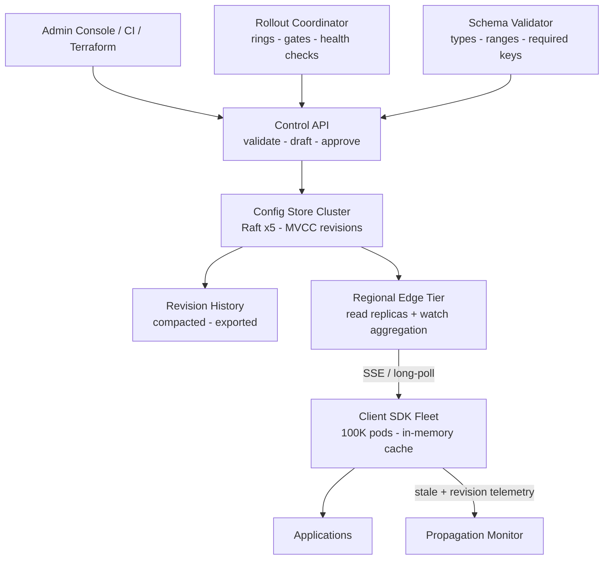
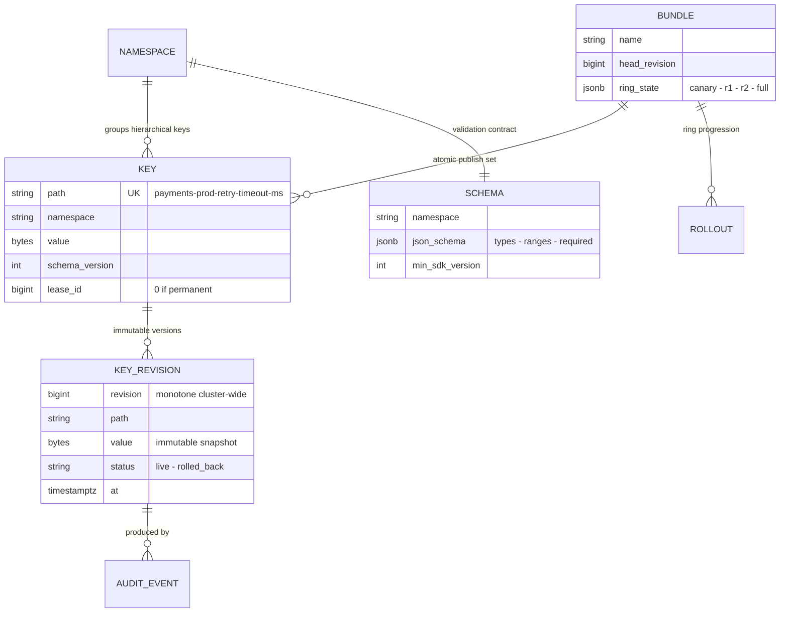
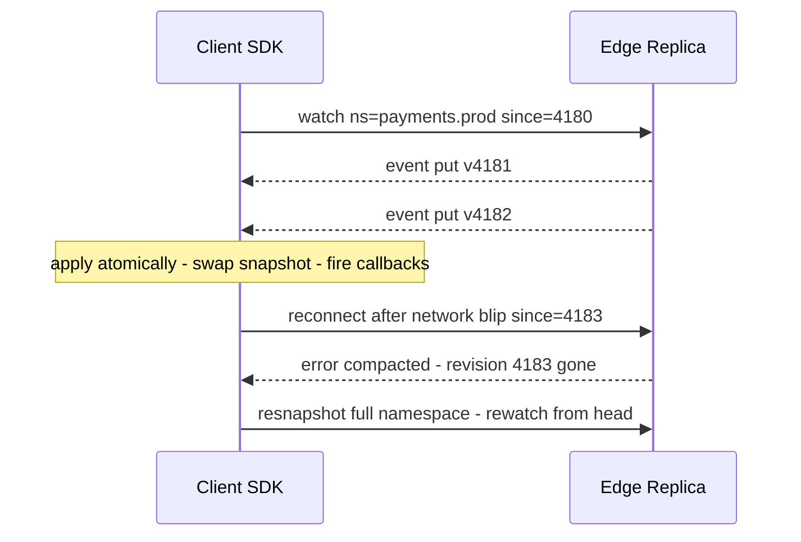
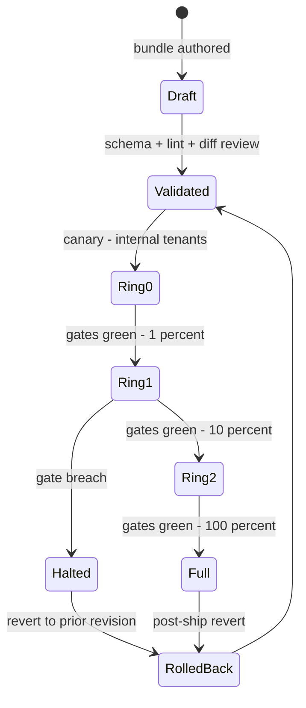

# Case Study: Design a Distributed Configuration Service

## Overview

Every microservices company eventually grows a system whose only job is to hold small, precious data — timeouts, feature toggles, retry policies, connection strings, ring assignments — and make it *everywhere, quickly, and forever* without taking the platform down when it fails. This walkthrough designs that system: a hierarchical, versioned key-value store (the etcd/Consul/Apollo family) fronted by a client-SDK caching layer, with watch-based push, serve-stale reads during partitions, ring-based rollouts, and schema-validated bundles with one-click rollback. The *internals* of the coordination engines this design composes are covered separately — Raft, MVCC, and the watch event history in [etcd Internals](../../../distributed/systems/etcd-internals.md), and the Chubby/Consul design lineage in [Chubby and Consul](../../../distributed/systems/chubby-and-consul.md) — this page is the service you'd build *around* and *on top of* such a cluster. The application-config cousin with per-user targeting is [Case Study: Feature Flag Service](./feature-flag-service.md); the distinction to keep straight is flags decide *behavior per request*, config supplies *parameters per process*.

## Step 1 — Requirements

### Functional

- **Hierarchical keys** organized like a filesystem (`/payments/env/prod/retry-timeout-ms`), grouped into **config bundles** (a set of keys versioned and published atomically — "the payments service's prod config")
- **Reads**: get a key, get a bundle prefix, subscribe (**watch**) to a namespace and receive every change from a given revision onward
- **Writes**: create/update keys through a validation pipeline; compare-and-swap and transactions for multi-key updates; **leases** (TTL-bound keys) for ephemeral coordination values (leader hints, not locks — see [Leases](../../../distributed/advanced/leases.md))
- **Versioning + history**: every write produces an immutable revision; "what was live at 14:03?" is a query; **rollback** is republishing a prior revision, never hand-reverting diffs
- **Rollouts**: publish to rings (canary → internal → 1% → 10% → 100%) with gates between rings, per datacenter/environment
- **Schema validation**: each key path (or bundle) has a schema (types, ranges, enums, required keys); a write that fails validation is rejected before any client sees it
- **Secrets are out of scope**: credentials belong in a vault with different threat model and access patterns — see [Case Study: Secrets Manager](./secrets-manager.md); this service holds *non-secret* parameters and may hold *references* to vault paths

### Non-Functional

- **Read availability over freshness**: during a partition or control-plane outage, clients keep running with the last known config, marked stale — a config outage must never page 200 services; "down = stale, not down" is the contract (the same degraded-mode philosophy as the flag service)
- **Propagation budget**: emergency config change (kill-switch class) reaches 95% of clients in ≤ 10 s; routine publishes ≤ 60 s; bulk non-urgent publishes ≤ 5 min
- **Write latency**: p99 ≤ 50 ms on the control cluster (it's Raft-replicated, fsync-bound — the write path is *slow by design*, see [etcd Internals](../../../distributed/systems/etcd-internals.md))
- **Scale**: 100K client SDK instances (pods), 1M keys across 5K services, read QPS effectively unbounded (absorbed by SDK caches), watch fan-out 100K deliveries per publish worst case
- **Auditability**: every write carries actor, reason, and approval state; the config service is a compliance surface exactly like the flag console

## Step 2 — Back-of-Envelope Estimation

| Quantity | Assumption | Result |
|---|---|---|
| Client population | 100K pods running the SDK, each watching its own namespaces | 100K long-lived watch streams (or ~2K edge proxies aggregating) |
| Read load | 2M logical reads/s if uncached; SDK hit ratio ≥ 99.9% | Origin sees ~2K reads/s — the cache layer is the design, not an optimization |
| Keys + size | 1M keys, avg 2 KB, largest bundle 1 MB; full config per service ≤ 256 KB | Control cluster memory is a non-issue; SDK snapshot size is the real constraint |
| Write load | 5K publishes/day, peak 10–20 writes/s | Trivial TPS — but every write is a validated, Raft-replicated, audited transaction |
| Watch events | worst case one publish touches a bundle with 50K watchers | Fan-out per publish: 50K events in < 10 s → edge-tier aggregation mandatory |
| SDK snapshot | per-service config ~50–256 KB, gzipped ~20–60 KB | Cold start fetch + delta updates; bounded by namespace scoping |
| History | 1M keys × ~50 revisions/day retained 30 days | ~1.5B revision records → MVCC store with compaction (etcd-style) |

The load shape to state: this is a **tiny write path with a brutal fan-out multiplier** — 20 writes/s is nothing until you realize each one may need to reach 100K SDKs in seconds. All design effort goes into the fan-out tree and the client cache, not the store.

## Step 3 — API Sketch

Control plane (human/CI, validated + audited):

```text
PUT  /v2/keys/{path}                  { value, schema_version, reason }     # validate + version
POST /v2/bundles/{name}/publish       { from_draft, target_ring, comment }
POST /v2/bundles/{name}/rollback      { to_revision, comment }
GET  /v2/keys/{path}/history          → immutable revision list with actors
POST /v2/txn                          { compare: [{key,ver}], then: [...] }  # CAS across keys
POST /v2/leases                       { ttl_s }  → lease_id; PUT keys bound to it
```

Data plane (what SDKs speak — deliberately dumb, cacheable, resumable):

```text
GET  /sdk/snapshot?ns=payments.prod&rev=4180   → full namespace snapshot (gzip) or 304
GET  /sdk/events?ns=payments.prod&since=4180   → long-poll: hold until change or 30 s
WSS /sdk/watch?ns=payments.prod&since=4180    → SSE/WS event stream from a revision
```

SDK surface:

```python
cfg = config_client.namespace("payments.prod")   # in-memory, always available
timeout = cfg.get("retry-timeout-ms", default=200)
cfg.on_change("retry-timeout-ms", callback)      # push notification, still local reads
```

The API decision that defines the system: **the read path is a local in-memory dictionary**. `cfg.get` never touches the network; the service's job is keeping that dictionary fresh within the staleness budget — exactly the local-evaluation philosophy of the flag service, applied to config.

## Step 4 — High-Level Architecture



- **Config store cluster**: 3–5 nodes running Raft over an MVCC KV store (you may literally use etcd for the inner ring at moderate scale, or borrow its design at planetary scale). Every mutation = one revision; reads can be linearizable (default, quorum) or serializable-from-replica (for the edge tier). The store keeps revision history with background compaction — the mechanics are in [etcd Internals](../../../distributed/systems/etcd-internals.md)
- **Control API**: the only writer. It owns validation, draft/publish workflow, approvals, and audit; the store never accepts client writes directly — same control/data plane split as the flag service
- **Edge tier**: per-region read replicas that hold a full (or namespace-scoped) copy of recent revisions, serve snapshot GETs, and aggregate watches — 2K edges each carrying ~50–100K client streams. This tier is what turns "100K fans per publish" into "100K fans spread across 2K aggregators." etcd's gRPC proxy and Consul's WAN-federated servers solve the same tiering problem
- **Rollout coordinator**: advances a bundle through rings when gate metrics (SDK version-lag, parse-error rate, app error rate) are green; halts automatically on breach. Ring state is itself config in the store — the system reloads its own control knobs through the mechanism it provides
- **Propagation monitor**: watches *observed* revision lag per SDK (telemetry, not assumptions); the staleness SLO is measured end-to-end, which is the only honest way to claim the budget table below

## Step 5 — Data Model



Design points worth making explicitly:

- **Revisions are cluster-wide and monotone** (etcd's model): a single counter orders every mutation, which gives watches their "replay from revision N" semantics and gives clients a total order for free. Per-key versioning alone can't answer "give me everything that changed since X" in one cursor
- **Bundles are manifests over keys, versioned as a unit**: publishing a bundle = one transaction creating all key revisions atomically. The alternative — services reading 30 keys mid-publish and getting a half-updated mix — is the classic config bug this model exists to kill
- **`SCHEMA` is versioned and pinned by `min_sdk_version`**: a new field type that old SDKs can't parse must be rejected at publish time, not discovered as a parse-error spike at ring 2 (the same SDK-drift gate as the flag compiler)
- **Rollback is a pointer move**: `rollback(to_revision)` publishes a *new* revision whose content equals the old one — history stays append-only, "what was live at T" stays answerable, and the rollback itself is audited like any write

## Deep Dive 1 — Push vs Poll: Watch, Long-Poll, and the Revision Contract

Three delivery mechanisms, one revision contract:

| Mechanism | Freshness | Cost at 100K clients | Failure mode | Used for |
|---|---|---|---|---|
| **Watch stream (SSE/WS)** | ~1–3 s p99 | 2K edge aggregators × 50K local streams | Drop → reconnect with revision cursor; gap → resnapshot | All namespaces by default |
| **Long-poll** (`GET /events?since`) | ~1–5 s | Hold 30 s per request ≈ 3.3K RPS of *held* conns, cheap | Same revision-cursor resync | Fallback when WSS is blocked (corporate proxies) |
| **Scheduled snapshot poll** | ~60 s–5 min | ~1.7K RPS, CDN-cacheable, jittered | Largest staleness window | Cold-start bootstrap, batch systems, CI jobs |



- **Watch semantics are an event log, not a notification**: events carry `(revision, key, type, value)` and are replayable from any surviving revision; a client that saw v4185 then v4183 re-syncs because the cursor makes gaps detectable. This is precisely etcd's watch model (event history from an MVCC revision), and it's why "watch" beats both naive push (unreliable, unresumable) and naive poll (staleness + QPS)
- **Compaction is part of the contract**: history retention is finite (30 days), so an ancient cursor earns a `compacted` error and a full resnapshot. Clients must handle it as a normal path, not an exception — the reconnect state machine is: try resume → resnapshot on compacted → rewatch
- **Thundering herd control**: reconnect backoff with jitter (±20%), long-poll intervals jittered, snapshots served `stale-while-revalidate` at the edge so the store never sees the herd directly. A publish that touches 50K watchers delivers through 2K aggregators in waves, not one blast
- **Idempotent application**: events may be duplicated (at-least-once between edge tiers); applying by revision idempotently (skip if ≤ current) makes duplicates harmless — the same exactly-once-effect-through-idempotency argument as [Idempotency](../../../backend/patterns/idempotency.md)

## Deep Dive 2 — Read Availability During Partitions: Serve-Stale

The CAP question for a config service has an unusually clean answer, because consumers told you what they need: **services would rather run on yesterday's timeout value than crash because the config cluster is unreachable**. Design for AP-on-the-read-path, CP-on-the-write-path:

- **The SDK cache is the availability story**: every namespace lives in process memory, seeded at startup from a snapshot and kept fresh by watch. If the control plane vanishes, `cfg.get` keeps answering from memory indefinitely, with telemetry flipping to `stale=true`. The app's availability is decoupled from the config plane's by construction — the same "down = stale, not down" contract as the flag service
- **Serve-stale has a policy, not an accident**: per namespace, `max_staleness` (e.g., 10 min) after which the SDK logs a breach metric and — for namespaces that opt in — fails closed (refuses to start or reverts to baked-in defaults). Fail-closed is reserved for config whose absence is a security or money hazard (e.g., a fraud-rule threshold); everything else fails open to stale
- **Writes stay CP**: a publish requires a Raft quorum; no quorum, no write — you cannot have two "current" configs. The cluster is small (3–5 nodes) precisely so quorum is cheap and rare to lose. If the store must survive a datacenter loss, the cluster spans zones, not regions, and region-level survival becomes an async-replication + human-promotion story
- **Consistency the SDK promises**: *monotonic reads* (a client never sees revision 4180 after 4181 — the cursor enforces it), *read-your-writes within a session* (a put-ack is followed by the event or applied locally-optimistically), and *bounded staleness* per namespace. It does *not* promise linearizable reads — and shouldn't: a linearizable `cfg.get` per request would put the config cluster on every request's critical path, which is the failure mode the whole design exists to avoid
- **When you truly need a linearizable read** — fencing a resource, claiming a lease-guarded role — you use the store's quorum read or lease machinery directly, not the SDK cache (the token/fencing pattern is in [Leases](../../../distributed/advanced/leases.md)). Config distribution and coordination are different jobs that share a storage engine

## Deep Dive 3 — Rollouts: Rings, Gates, Validation, Rollback



- **Rings are deployment blast-radius control** for data: canary = the config team's own services; ring 1 = 1% of client *SDK instances* (not users — this is per-process config); rings escalate on green gates. Gate metrics are SDK-reported: parse-error rate, schema-rejection count, and the *application* metrics the config plausibly affects (error rate on the owning service). The pattern and its failure taxonomy are the same as [Canary Releases](../../../sre/canary-releases.md) — canary for code, rings for config, and the two compose when a deploy ships a new default that config then overrides
- **Validation happens before any ring moves**: JSON-Schema-style type/range/enum checks, required-key presence, and *semantic lints* ("retry-timeout-ms must be < circuit-breaker budget", "changing this key requires re-approval flag"). Semantic lints encode the postmortem history: every config-caused incident becomes a lint, which is how the validator gets smarter instead of the incident rate staying flat
- **Semantic diff in the review UI**: the reviewer sees "retry-timeout-ms: 200 → 50" next to affected-service counts, not a JSON blob diff. Reviews are the last human gate; the API enforces that prod publishes carry an approval, like the flag service's two-person rule
- **Rollback must be boring**: one API call republishing the prior revision, executed in the ≤ 10 s emergency budget, *no re-validation* (it was valid when it shipped). The path is rehearsed like a fire drill; an untested rollback is a rumor, not a control — and the audit trail makes "who rolled back and why" part of the record, not archaeology
- **Facebook's Gatekeeper** (the reference architecture for config-as-control-plane at scale) adds the refinements worth knowing by name: layered config with fallbacks baked into the binary, and "linking" config to code versions so a rollback of code carries its config — cite it in interviews as the proof this model works at billions of endpoints

## Deep Dive 4 — Caching Layers: SDK → Edge → Cluster

The read path is a four-tier cache hierarchy, each tier with a distinct job:

| Tier | What it holds | Freshness mechanism | Failure behavior |
|---|---|---|---|
| **SDK in-memory** | the namespaces the process subscribed to | watch events, atomic snapshot swap | serves stale forever, marks `stale=true` |
| **SDK disk snapshot** | last known good, per namespace | written on every apply | cold start after restart reads disk before network — a pod restarts with *its last config*, not empty |
| **Edge regional replica** | full or namespace-scoped revision history | streamed from the cluster; serves snapshots + aggregated watches | edge down → clients fall back to long-poll against another region or the cluster |
| **Store cluster (Raft)** | ground truth, MVCC revisions | — | quorum loss → reads may degrade to stale replicas (configurable), writes stop |

- **Atomic snapshot swap**: the SDK builds the new namespace state off to the side and swaps a pointer — readers never observe a half-applied config, and `on_change` callbacks fire after the swap, in revision order. Config application must be transactional from the reader's perspective; a torn read of a 30-key bundle is the bug class this whole design refuses to ship
- **The disk snapshot is underrated**: it turns "pod restart during a config-plane outage" from "boot with baked-in defaults" into "boot with the config you had," which is usually the right answer and costs one file write per apply
- **Edge-tier aggregation is a fan-out amortizer**: 50K SDK streams per region terminate on a handful of edge nodes that each hold one upstream watch per namespace; a publish fans out 1× upstream and 50K× locally. It also localizes flapping clients — 50K reconnecting SDKs hit the edge, not the cluster
- **Cache coherence is by revision, not by TTL**: no tier expires entries on a timer as its primary mechanism; freshness is the watch stream, and TTLs exist only as a safety net (e.g., a client that somehow lost its watch polls every 60 s as a backstop). TTL-primary coherence silently reintroduces the 60-s staleness you built push to remove

## Deep Dive 5 — Consistency Guarantees: How This Compares to etcd, Consul, and Chubby

| System | Write path | Read guarantee (default) | Watch/notify | Session semantics | Best-fit job |
|---|---|---|---|---|---|
| **etcd** | Raft, linearizable | linearizable (serializable optional, cheaper) | event history from revision | leases, txn/CAS | coordination store: K8s objects, leader election |
| **Consul** | Raft | stale-able by default; `consistent` mode requires quorum | blocking queries (long-poll) + watches | sessions, health checks | service discovery + config, DC-federated |
| **ZooKeeper** | ZAB (Raft-like) | sequential; `sync()` forces linearizable at leader | sequential-consistent watches | ephemeral nodes, sessions | coordination primitives, older ecosystem |
| **Chubby** | Paxos | consistent reads at leader; leases for caching | cache callbacks with invalidation | sessions, grace period | locking + name service for a cell |
| **This design** | Raft at control plane | SDK: monotonic + bounded-staleness; store: linearizable | resumable watch from revision | serve-stale policy per namespace | application config distribution at 100K+ endpoints |

- **The honest framing**: etcd/Consul/ZooKeeper are *coordination stores* — small, CP, read-mostly by machines that need truth. This service is a *distribution system* — same storage engine discipline, plus a fan-out tree and client caches tuned so 100K processes never block on it. Using etcd directly as the fleet config service (every pod watching the cluster) fails at ~10–20K clients; the edge tier and SDK caches are what buy two more orders of magnitude
- **Where each guarantee shows up in interviews**: "reads during partition" → serve-stale (this design) vs Consul's stale-by-default mode vs ZooKeeper serving followers; "who decides the order?" → Raft revision (all of them); "what happens when my cursor is too old?" → compaction error + resnapshot (etcd, this design) vs Chubby's lease-based cache invalidation callbacks, which push invalidation instead of requiring replay
- **Chubby's cache callbacks are the interesting contrast**: instead of clients replaying an event log, the *master tracks what each client's cache holds* and invalidates on change, with a grace period bridging session loss. It's push-to-invalidate vs pull-to-resync — Chubby's model assumes small, trusted, leader-close populations; revision-replay assumes the open, geo-distributed one
- **Jepsen's lesson applies to whatever you build**: every one of these systems shipped subtle consistency bugs that partition testing found (the analyses are the evidence — see [Jepsen Analyses](https://jepsen.io/analyses)); a config service's test suite must include "partition the SDK from the edge and assert the staleness/monotonicity contracts," not just unit tests of the happy path

## Bottlenecks & Follow-Up Questions

- **Watch fan-out per publish**: one publish to a namespace with 50K watchers must land in ≤ 10 s; a single-edge bottleneck or a slow consumer on a shared stream delays everyone. Follow-ups: per-namespace stream isolation at the edge, priority lanes for emergency publishes, and backpressure that drops *low-priority* namespaces rather than delaying the kill-switch one (the lane-separation argument from [Backpressure](../backpressure.md))
- **Snapshot bloat**: a service subscribing to `/` — one namespace with 1M keys — turns every cold start into a 100+ MB pull. Follow-ups: namespace scoping enforced at the API (no wildcard subscribes), per-service snapshot manifests, and zstd at the edge; the failure is organizational as much as technical
- **Revision history compaction vs audit**: MVCC history must compact for store health, but compliance wants years. Follow-up: compaction is safe because audit events export to the compliance warehouse (append-only, like the flag service's audit log); the store keeps operational history, the warehouse keeps legal history
- **Multi-region writes**: the single Raft cluster is zone-distributed but region-local; a second region needs its own cluster plus async replication, which forks "current revision" into per-region truths. Follow-up: keep one writable region, replicate read-only, and make the region failover an explicit, rehearsed promotion — don't build multi-master config writes for a load profile of 20 writes/s
- **SDK version drift**: 100K pods means a long tail of SDK versions that must all parse the same events. Follow-up: `min_sdk_version` gating at publish, capability negotiation in the SDK handshake, and telemetry histograms so the gate has real data — the same compiler-gating move as the flag service
- **Config-induced stampedes**: publishing "cache-ttl: 0" or an aggressive poll interval can turn 100K SDKs into a DDoS on a dependency. Follow-ups: per-namespace rate-limit floors the SDK refuses to go below, and publish-time linting that flags knob values outside tested ranges — config can cause incidents, so config needs the same guardrails as code

## Interview Questions

1. **Why a client SDK with a local cache instead of services querying the config service per request?** Per-request reads put the config cluster on every request's critical path and demand linearizable reads at millions of QPS — the most expensive possible design for data that changes 20 times a day. A local dictionary answers in nanoseconds, keeps the application available when the config plane is down (serve-stale is the contract), and converts the hard problem into propagation: getting watch events to 100K in-memory copies within a stated staleness budget. The trade — bounded staleness and snapshot plumbing — is exactly what the budget table governs per change class.
2. **Walk the watch path for an emergency config change and its failure modes.** Control API validates and writes a revision through Raft (p99 ≤ 50 ms); edge replicas stream the event; 2K aggregators fan it out to 50K local SDK streams; each SDK atomically swaps its namespace snapshot and fires callbacks — ~1–5 s end to end. Failure modes: SDK disconnected → reconnects with its revision cursor and resumes; cursor older than compaction → explicit resnapshot-and-rewatch, a normal path; edge partitioned → SDK serves stale and the revision-lag telemetry pages *before* the staleness SLO burns. The kill-switch class of publish rides a priority lane and skips approval queues, because its budget is incident-page-shaped.
3. **What consistency does the SDK actually promise, and why isn't it linearizable reads everywhere?** Monotonic reads (the revision cursor means you never go backwards), read-your-writes within a session after a put-ack, and bounded staleness per namespace with a serve-stale policy. Linearizable reads per request would put a quorum-bound store on the hot path — latency and availability suicide for config. The write path stays CP (Raft quorum, one current config, no split-brain), and when something genuinely needs a linearizable read — fencing, lease claims — it calls the store directly rather than the SDK cache. Separating "config distribution" from "coordination" is the core architectural insight.
4. **How do rollouts prevent a bad config from becoming a fleet-wide incident?** Bundles move through rings — canary, 1%, 10%, 100% — with automated gates on SDK-reported parse errors and owning-service error rates; a breach halts promotion and pages, and rollback republishes the prior revision in the ≤ 10 s emergency budget without re-validation, because it was already valid. Before any ring moves, schema validation plus semantic lints reject impossible values, and the review UI shows a semantic diff with affected-service counts. Every config-caused incident adds a lint, so the validator encodes postmortem history instead of letting the incident rate stay flat.
5. **Compare your watch semantics with etcd's and Chubby's.** etcd (and this design) treats watch as replay of an MVCC event history from a revision cursor: clients resume, detect gaps, and resnapshot when compacted — pull-to-resync. Chubby instead pushes cache invalidations: the master tracks what each client's cache holds and invalidates on change, with lease-based liveness — push-to-invalidate, well-suited to small, trusted, leader-close populations but hard at 100K geo-distributed endpoints. Consul's blocking queries are long-poll in watch's clothing. Same revision-ordering spine in all of them; the difference is who holds the state needed to recover — the client's cursor or the master's cache table.
6. **Why does the design keep 3–5 Raft nodes instead of a bigger, sharded store?** The write load is trivial (peak ~20 writes/s), so there is nothing to shard — the store's job is durability and ordering, and a small Raft group gives fast quorums, cheap elections, and an operational blast radius of five machines. Sharding would buy nothing on capacity and cost a distributed-transaction story for bundle-atomic publishes. Scale lives in the read tiers: SDK caches absorb 99.9% of reads, and the edge tier fans out publishes. If key count ever hurt the single store, the fix is namespace-scoped store instances, not sharding a Raft group — config data partitions cleanly along the same namespace boundary the whole system already speaks.

## Key Takeaways

- A config service is a tiny CP write path (Raft, revisions, ~20 writes/s) attached to an enormous AP read path (SDK caches, 100K processes, 2M logical reads/s) — design them separately
- "Down = stale, not down": the SDK's in-memory and disk snapshots decouple application availability from config-plane availability, with per-namespace serve-stale policies and fail-closed reserved for money/security knobs
- Watch is a resumable event log keyed by a monotone revision — never naive push, never TTL-only polling; compaction-and-resnapshot is a normal path, not an error
- Bundles publish atomically, rollbacks are pointer moves, and history is append-only: "what was live at 14:03?" must be a query forever
- Rollouts are rings with automated gates and a rehearsed ≤ 10 s rollback; semantic lints turn every config incident into a publish-time rejection
- etcd/Consul/Chubby are coordination stores; a config *distribution* system adds the edge tier and SDK caches that scale them two orders of magnitude — know which guarantees you kept and which you traded away
- The staleness budget is a product decision per change class (≤ 10 s emergency, ≤ 60 s routine, ≤ 5 min bulk) and it is *measured* by SDK revision-lag telemetry, not assumed

## References

- etcd documentation — the Raft-backed MVCC KV store and watch model this design composes: https://etcd.io/docs/
- etcd source repository — gRPC proxy (edge-tier aggregation precedent), watch implementation, compaction: https://github.com/etcd-io/etcd
- HashiCorp Consul documentation — blocking queries, consistency modes, sessions, and WAN federation: https://developer.hashicorp.com/consul/docs
- Apache ZooKeeper documentation — znodes, watches, sessions, and the coordination recipes: https://zookeeper.apache.org/doc/current/
- M. Burrows, "The Chubby Lock Service for Loosely-Coupled Distributed Systems," OSDI 2006 — sessions, leases, and cache callbacks: https://research.google/pubs/pub27897/
- P. Hunt, M. Konar, F. Junqueira, B. Reed, "ZooKeeper: Wait-free Coordination for Internet-scale Systems," USENIX ATC 2010: https://www.usenix.org/legacy/event/atc10/tech/full_papers/Hunt.pdf
- D. Ongaro & J. Ousterhout, "In Search of an Understandable Consensus Algorithm (Raft)" — the replication spine of the control cluster: https://raft.github.io/raft.pdf
- Server-Sent Events (WHATWG HTML Living Standard) — the one-way push stream the edge tier uses: https://html.spec.whatwg.org/multipage/server-sent-events.html
- RFC 6455 — WebSocket, the bidirectional alternative for watch streams: https://datatracker.ietf.org/doc/html/rfc6455
- AWS AppConfig user guide — the managed-service expression of validation, deployment strategies, and rollback: https://docs.aws.amazon.com/appconfig/latest/userguide/what-is-appconfig.html
- Apollo Config (open-source configuration service) — hierarchical namespaces, gray releases, and the SDK-cache model in production open source: https://github.com/apolloconfig/apollo
- C. Tang et al., "Holistic Configuration Management at Facebook," SOSP 2015 — Gatekeeper: config as a control plane at billions of endpoints (cited by title + venue; no stable public URL used here)
- Jepsen Analyses — empirical consistency testing of etcd, Consul, ZooKeeper and peers under partitions: https://jepsen.io/analyses

## Cross-References

- [etcd Internals](../../../distributed/systems/etcd-internals.md) — the Raft + MVCC + watch engine at the core of the control cluster
- [Chubby and Consul](../../../distributed/systems/chubby-and-consul.md) — the two historical designs this service descends from, and their session/cache models
- [ZooKeeper Internals](../../../distributed/systems/zookeeper-internals.md) — the third coordination lineage: ephemeral nodes, watches, ZAB
- [Case Study: Feature Flag Service](./feature-flag-service.md) — sibling control plane: per-user targeting vs per-process parameters, shared propagation machinery
- [Case Study: Secrets Manager](./secrets-manager.md) — why credentials do not ride the config plane: different threat model, leases, and audit
- [Consistency Patterns](../consistency-patterns.md) — the vocabulary behind the serve-stale and monotonic-read guarantees
- [Leases](../../../distributed/advanced/leases.md) — TTL-bound keys and fencing tokens for the coordination jobs config deliberately does not do
- [CAP Theorem](../../../distributed/fundamentals/cap.md) — the AP-read/CP-write split this design formalizes
- [Canary Releases](../../../sre/canary-releases.md) — ring rollouts for config compose with canary deploys for code
- [Idempotency](../../../backend/patterns/idempotency.md) — duplicate watch events are harmless because application is revision-idempotent
- [Backpressure](../backpressure.md) — per-namespace lane separation so low-priority config cannot delay the kill switch
