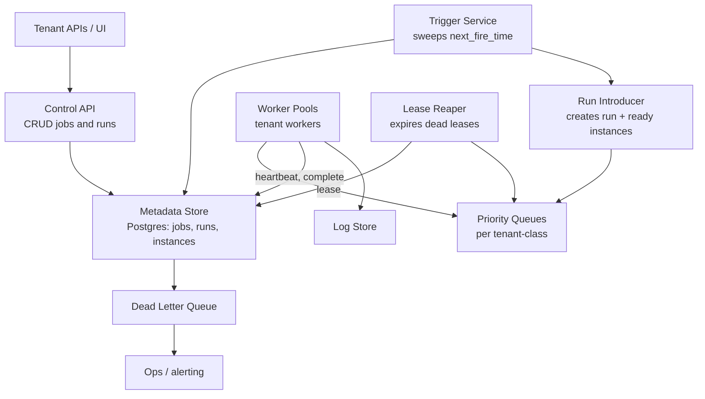
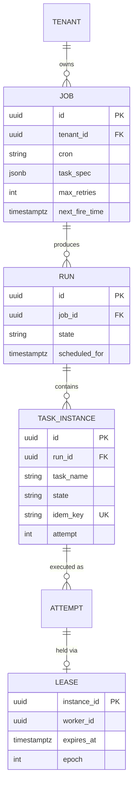
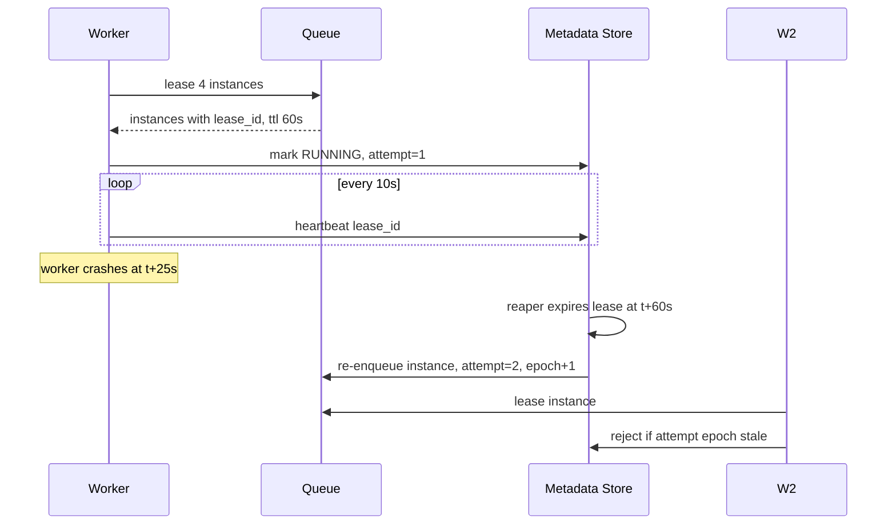
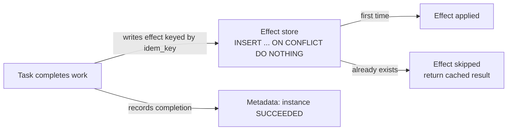

# Case Study: Design a Distributed Task Scheduler (Cron-as-a-Service)

## Overview

"Design Airflow" or "build a cron service for thousands of teams" tests the distributed-systems core: triggering on time, assigning work without duplicates, retrying without storms, and being *fair* between tenants that all want to run at midnight. This walkthrough designs a multi-tenant cron-as-a-service from scratch — DAG specification, lease-based assignment, at-least-once execution with dedup keys, priority + fairness, and the exactly-once illusion — then compares the result against Airflow, Temporal, and Celery. For Airflow's real internals, see [Apache Airflow](../../../data-engineering/airflow.md); for the general orchestration pattern, see [HLD: Workflow Orchestration](../hld/workflow-orchestration.md).

## Step 1 — Requirements

### Functional

- Users submit **jobs**: a cron expression (or one-shot trigger) plus a task spec (container image, command, resources, timeout)
- Jobs declare **DAG dependencies**: task B runs after A succeeds; fan-out/fan-in supported
- Automatic **retries with exponential backoff**; dead-letter queue after max attempts
- Priorities and per-tenant quotas; cancel/pause/resume; manual re-run of a failed run
- Full run history: state, logs, exit codes, timings

### Non-Functional

- **Scale**: 1M scheduled tasks/day (≈12/s avg, 500/s peak at midnight), 10K tenants
- **Trigger accuracy**: start within ±30 s of schedule for 99% of tasks
- **No duplicate concurrent execution** of the same task instance (same run, same task) in steady state
- **At-least-once** execution guarantee; **exactly-once effects** via idempotency keys
- **Bounded skew under load**: overload delays tasks; it never silently drops them
- Availability: scheduler HA — a leader crash must not lose or duplicate a trigger

## Step 2 — Back-of-Envelope Estimation

| Quantity | Assumption | Result |
|---|---|---|
| Trigger evaluation | Sweep every 5 s over active schedules | 1M jobs → scan only "next_fire_time ≤ now" index: ~50 rows/s |
| Task-state writes | 500 tasks/s peak × ~8 state transitions | ~4K writes/s — trivial for Postgres/Cassandra |
| Leases outstanding | Avg task runtime 5 min × 500 tasks/s | ~150K live leases |
| Heartbeats | 150K workers × 1 per 10 s | 15K heartbeats/s — batch into lease updates |
| Log/event volume | 500 tasks/s × 10 KB logs | ~5 MB/s to the log store (see [Log Analytics](./log-analytics.md)) |
| DLQ rate | 0.1% of tasks fail permanently | ~1.2K/day needing human/ops attention |

The insight to state: a scheduler is a **small-state, high-correctness** system. The numbers are tiny; the difficulty is entirely in the invariants (one trigger per fire time, one executor per instance, one terminal state per attempt).

## Step 3 — API Sketch

```text
POST /v1/jobs                    { name, cron, task: { image, cmd, cpu, mem },
                                   depends_on: [], retries: 3, timeout_s, tenant }
POST /v1/jobs/{id}/trigger       → run_id (manual/one-shot)
GET  /v1/runs/{run_id}           → { tasks: [ { name, state, attempts, started_at } ] }
POST /v1/runs/{run_id}/tasks/{name}/cancel
POST /v1/runs/{run_id}/tasks/{name}/retry
GET  /v1/tenants/{t}/dlq         → dead-lettered instances
```

Scheduler-worker protocol (the interesting part — workers pull, the scheduler never pushes into customer networks):

```text
POST /v1/worker/lease      { worker_id, capacity } → [ task_instances... ] each with lease_id, ttl
POST /v1/worker/heartbeat  { lease_id }            → { ok | revoked }
POST /v1/worker/complete   { lease_id, result }    → { ok }
POST /v1/worker/fail       { lease_id, error, retryable }
```

## Step 4 — High-Level Architecture



- **Trigger service** (HA leader or sharded by job hash): every 5 s, `SELECT ... WHERE next_fire_time <= now()`; creates a run with per-task instances in `pending`; advances `next_fire_time` **in the same transaction** so a crashed leader cannot double-fire
- **Queues**: priority queues with per-tenant fairness (Deep Dive 3); the queue may be Postgres `FOR UPDATE SKIP LOCKED` (10K QPS-class), Redis streams, or Kafka per priority class
- **Lease reaper**: moves instances whose lease TTL expired (worker died, network partition) back to `ready` with attempt++ — this is the at-least-once hinge

## Step 5 — Data Model



The `idem_key` is the design centerpiece: `run_id:task_name` — any effect the task produces (rows written, messages sent, files created) must be keyed by it, which is what converts at-least-once execution into exactly-once *effects*.

## Deep Dive 1 — Lease-Based Assignment (the heart of the design)

A lease is a lock with a timeout that the holder must renew. The worker claims an instance for TTL=60 s, heartbeats every 10 s, and the lease row carries an `epoch` that increments on every reassignment.



Rules that make leases safe:

- **Single writer per attempt epoch**: instance is executable only by the holder of the highest epoch lease; stale epochs are rejected on any write
- **TTL >> heartbeat period** (typically 6×) to survive GC pauses and network blips without thrashing reassignment
- **Zombie protection**: a worker that lost its lease (reaper reassigned) may still be running the process; when it calls `complete`, the store rejects it by epoch mismatch. Effects dedup via `idem_key` catches any side effects it already made
- **Bounded duplicate window**: between lease expiry and zombie detection, two workers may run the same instance — at-least-once. You *cannot* eliminate this window without participant cooperation (global fencing tokens, which the task effect layer must honor)

| Assignment model | Duplicates? | Load-aware | Ops complexity | Used by |
|---|---|---|---|---|
| Push to worker | Possible on retry | Hard | Low (needs routing) | Rare; firewalls block it |
| **Lease/pull (above)** | Bounded window | Yes (worker pulls what it can run) | Medium | Airflow Celery/K8s executors, Temporal, SQS-style |
| Static sharding | Rare | Poor under skew | Low | Cron on one box (the thing we're replacing) |

**What the interviewer is probing:** whether you know *why* SQS visibility timeouts, Temporal task queues, and K8s lease objects are all the same pattern — and where the duplicate window lives in each.

## Deep Dive 2 — At-Least-Once + Dedup Keys → the Exactly-Once Illusion



- Attempt 1 writes effect `idem_key` then crashes before completing. Reaper reassigns; attempt 2 re-runs, tries the same effect insert, hits the dedup key, and no-ops. The system performed the work once *in effect* though twice in execution
- The task author must cooperate: side effects must be idempotent or funneled through a dedup layer (transactional outbox; see [API Idempotency](../../../backend/api/api-idempotency.md)). The scheduler's job is to make the *dedup key* first-class, hand it to every task, and document the contract
- Where cooperation is impossible (arbitrary customer code), the service is honest: "at-least-once execution, dedup keys provided, duplicates possible in a crash window." Interviewers reward stating this boundary precisely

## Deep Dive 3 — Priority, Fairness, and Multi-Tenancy

Priority alone breaks multi-tenancy: tenant A's 10K midnight jobs starve tenant B forever. The design is two levels:

- **Between priorities** (per job): critical patches run before reports — strict queues with aging to prevent starvation
- **Between tenants** (per class): weighted fair sharing of worker capacity — weighted deficit round-robin over per-tenant queues; each tenant gets weight w_i of dispatch, with burst allowance when the cluster is idle
- **Per-tenant concurrency caps**: one tenant's 50K-task backfill must not monopolize 500 workers; caps + queueing per tenant, with headroom for interactive triggers
- **Dispatch math**: fair share = `worker_capacity × w_i / Σw`; a tenant exceeding its share queues; when idle capacity exists, work-stealing lets queues borrow

| Mechanism | Protects | Cost | Failure if absent |
|---|---|---|---|
| Job priorities | Latency-sensitive jobs | Starvation risk | Critical tasks wait behind backfills |
| Tenant WFQ | Small tenants | Complexity | One noisy tenant owns the fleet |
| Concurrency caps | The fleet | Queuing delay | Cascading overload (see [Backpressure](../backpressure.md)) |
| Admission control on submits | The scheduler | User friction | Run-creation stampede at midnight |

**What the interviewer is probing:** midnight. Everyone schedules at midnight; the correct answers are smoothing (auto-jitter cron seconds), tenant quotas, and overload behavior *defined in advance*: prefer delaying to dropping, and surface delays as metrics, not surprises.

## Deep Dive 4 — Retries, Backoff, and the DLQ

- Retry policy per task: `max_attempts`, backoff `min(2^attempt × base, cap) ± jitter`, retry on transient classes (timeout, 5xx), fail fast on 4xx-class
- Timeout = wall-clock kill: the reaper reclaims a timed-out lease exactly like a crashed worker (zombie process killed by the worker runtime)
- After `max_attempts`: instance → **DLQ** with the last error, logs, and a one-click replay API. The DLQ is a first-class data structure, not a log line
- Circuit breaking: a task failing 100% across the fleet within minutes is likely systemic (bad deploy, dependency down) — suspend its queue and page, instead of burning attempts fleet-wide
- Run-level semantics: a failed task fails its dependents (`upstream_failed`); siblings may continue if the DAG declares them independent

## Bottlenecks & Follow-Up Questions

- **Metadata store is the bottleneck**: 4K writes/s is fine, but "list all runs for tenant" is not; follow-up: read replicas + pre-aggregated run metrics; run logs to the log store, not the DB
- **Trigger sweep skew at scale**: 1M jobs, one leader; follow-up: shard jobs by hash across trigger nodes, each owning disjoint job ranges, with a global fencing epoch
- **Zombie effects**: duplicate effects from pre-crash work; follow-up: idempotency contract + effect-store dedup + post-hoc reconciliation job comparing effects vs metadata
- **Worker cold start**: midnight burst needs 3× workers; follow-up: warm pools + pre-pulled images (see [Case Study: CI/CD](./ci-cd-system.md) for warm-pool math)
- **Clock skew for cron semantics**: schedule in the tenant's timezone; DST transitions are a product decision ("2:30 AM twice?"), not a systems accident — store UTC + tz, materialize concrete fire times

## Interview Questions

1. **How do you guarantee a cron job fires exactly once at midnight across a fleet of trigger nodes?** Each job has a single owner (sharded by hash) and `next_fire_time` advances in the same transaction that creates the run, so a fire is claimed atomically. A crashed owner's replacement resumes from the stored fire time; double-fires are prevented by the atomic claim, and missed fires by "catch-up" evaluation of overdue fire times. Fencing epochs guard against two owners on the same shard.
2. **Workers run the same task twice after a lease expiry. What did your design promise, and what actually happened?** It promised at-least-once execution with a bounded duplicate window: lease TTL expiry reassigns before the zombie is detected. Effects stay exactly-once only if tasks honor the idem_key contract (dedup insert). The scheduler's responsibility is making dedup keys unavoidable and rejecting stale-epoch completions; the task author's responsibility is idempotent effects. Saying "we have exactly-once" would be the wrong answer.
3. **Why lease/pull instead of pushing tasks to workers?** Customer workers sit behind firewalls/NATs and heterogeneous runtimes; pull decouples scheduler failure from worker failure, gives natural load-awareness (workers take what they can run), and makes backpressure implicit — an overloaded worker simply stops leasing. Push requires the scheduler to track per-worker capacity, which is exactly the state that goes stale.
4. **Design fairness for 10K tenants where one tenant submits a 50K-task backfill at midnight.** Weighted fair queuing between tenants over shared worker pools, per-tenant concurrency caps, and strict priority queues reserved for interactive triggers. The backfill gets its weight, not the whole fleet; aging prevents starvation of low-weight tenants. Add fleet-level admission control so run creation itself can't stampede the metadata store.
5. **When does retry-with-backoff make things worse, and what do you add?** When failures are systemic — a bad deploy or a down dependency — retries become a retry storm amplifying the outage (see [Backpressure](../backpressure.md)). Add circuit breaking: track fleet-wide failure rate per task, suspend the queue at threshold, page, and require explicit resume or a fixed cool-down. Retries are for transient faults; the DLQ plus circuit breaker is for everything else.
6. **Compare your design to Airflow, Temporal, and Celery in one minute.** Airflow: batch DAGs with a scheduler/executor split; strong on backfills and scheduling semantics, weaker on sub-minute and multi-tenant fairness. Temporal: durable workflows as code with event-sourced state — the exactly-once-workflow illusion done properly, at the cost of an SDK contract. Celery: a solid task queue (brokers + workers, retries, rate limits) but no native DAG/cron layer — you build what this design adds. The design here is "Celery mechanics + Airflow semantics + explicit multi-tenancy."

## Key Takeaways

- A scheduler is small-state, high-correctness: the hard parts are trigger claiming, lease fencing, and terminal-state transitions — not throughput
- Lease/pull assignment with epochs and a reaper is the load-aware, firewall-friendly core; the duplicate window it creates is fundamental, not a bug
- Exactly-once is an illusion assembled from at-least-once execution + first-class idempotency keys + effect dedup; state the boundary honestly
- Multi-tenancy needs two levels: priorities for jobs, weighted fair sharing + caps for tenants; midnight is a capacity-planning event
- Retries need jitter, caps, and circuit breaking; the DLQ is a product surface with replay, not a graveyard
- Airflow, Temporal, and Celery each solve a different slice of this design — know which slice your interviewer means

## References

- Apache Airflow documentation — scheduler/executor architecture to compare against: https://airflow.apache.org/docs/
- Temporal documentation — durable execution and task queues: https://docs.temporal.io/
- Celery documentation — worker/broker semantics, retries, rate limits: https://docs.celeryq.dev/
- Apache Kafka documentation — delivery semantics vocabulary for the queue layer: https://kafka.apache.org/documentation/
- Apache ZooKeeper documentation — coordination/leader election for trigger sharding: https://zookeeper.apache.org/doc/current/
- etcd documentation — leases and fencing tokens: https://etcd.io/docs/

## Cross-References

- [Apache Airflow](../../../data-engineering/airflow.md) — the real-world scheduler internals this design abstracts
- [HLD: Workflow Orchestration](../hld/workflow-orchestration.md) — the DAG/execution pattern space
- [Backpressure](../backpressure.md) — overload semantics: delay, don't drop
- [Consistency Patterns](../consistency-patterns.md) — at-least-once vs exactly-once vocabulary
- [Case Study: CI/CD System](./ci-cd-system.md) — warm-pool runners and DAG-shaped builds
- [Case Study: Log Analytics](./log-analytics.md) — where the task logs go and how they're queried
- [Real-World: Billing & Metering](../real-world/billing-metering.md) — multi-tenant usage accounting, the sibling fairness problem
