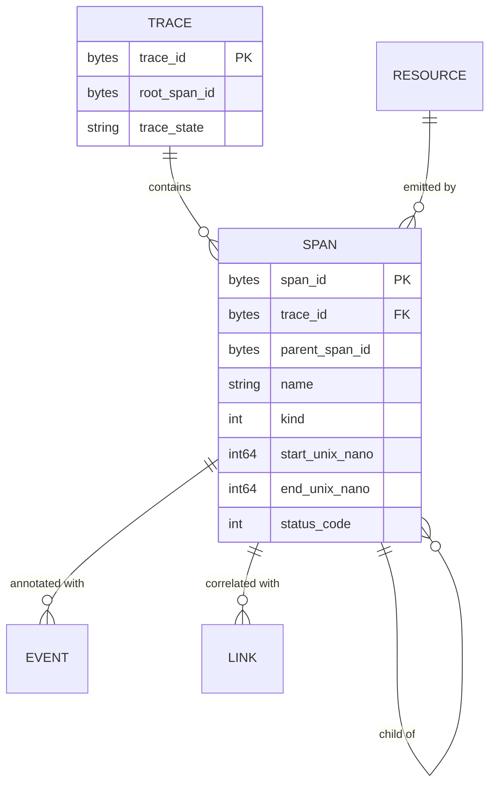
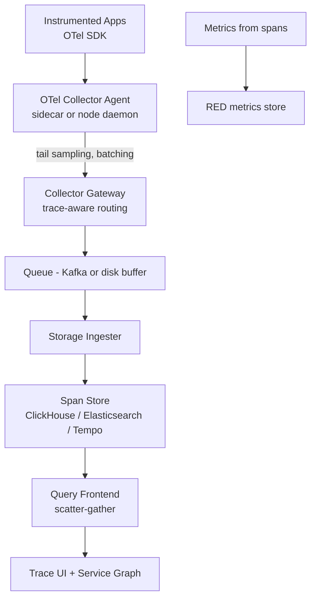
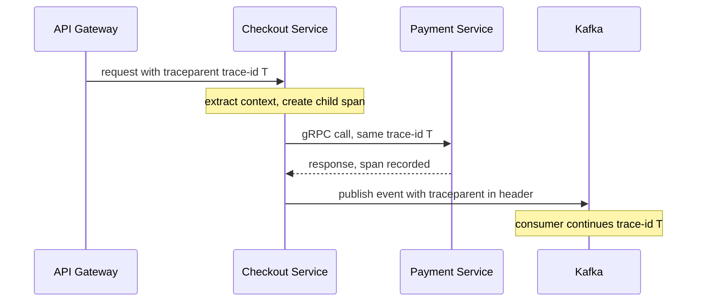

# Case Study: Design a Distributed Tracing System

## Overview

Distributed tracing is the observability pillar that answers "what did *this one request* do across 30 services?" — and designing its backend is an interview about sampling economics, context propagation, and choosing a storage engine. This walkthrough designs the system end-to-end: the trace/span model, W3C Trace Context propagation, head vs tail sampling (the cost-determining decision), span storage across Elasticsearch/Tempo/ClickHouse, service-graph derivation, and adaptive sampling. It complements [HLD: Monitoring & Observability](../hld/monitoring-observability.md), the client-side usage in [Distributed Tracing](../../../backend/observability/distributed-tracing.md), and OpenTelemetry usage in [OpenTelemetry](../../../backend/observability/opentelemetry.md); here you are building the backend those pages assume.

## Step 1 — Requirements

### Functional

- Instrument SDKs record **spans** (operation name, start/duration, status, attributes, events, links) grouped under a **trace**
- Propagate trace context across HTTP, gRPC, and message queues; correlate logs/metrics to traces
- Sampling: keep a configurable fraction of traces, chosen by rules or by outcome
- Query: by trace ID (from an error log), by service/span name/duration/error, over a time range
- Derive a **service graph** (who calls whom, with rates and error rates) and red-metrics (rate/error/duration per service)

### Non-Functional

- **Scale**: 1M requests/s producing ~20 spans/request = 20M spans/s raw; ingesting even 1% is 200K spans/s
- **Latency**: trace searchable within ~60 s of completion (debugging is time-sensitive)
- **Query latency**: trace-by-ID < 1 s; exploratory queries < 5 s p95
- **Retention**: 7–14 days full-fidelity, then aggregated or dropped; tracing storage is the most expensive per byte of the three pillars
- **Overhead**: SDK CPU < 1% and allocation-light at 1M spans/s/node; a tracing outage must never affect the application
- **Completeness**: an unsampled *tail* (errors, SLO violations) must survive with 100% probability

## Step 2 — Back-of-Envelope Estimation

| Quantity | Assumption | Result |
|---|---|---|
| Raw span rate | 1M req/s × 20 spans | 20M spans/s — never store this |
| Head sampling | 1% baseline | 200K spans/s ingested |
| Span size | ~0.5–1 KB serialized (OTLP) | ~100–200 MB/s ingress |
| Compressed on disk | Columnar + zstd ~10× | ~10–20 MB/s ≈ **0.9–1.7 TB/day** |
| 14-day hot retention | 1.7 TB/day × 14 | ~24 TB hot cluster |
| Tail-sampling buffer | Keep 100% for 30 s to decide | 20M spans/s × 30 s in memory = infeasible → trace-aware sharding first |
| Query fanout | 24 TB over 30 nodes | Trace-by-ID hits 1 shard; scans fan out to all |

The numbers make the central trade-off obvious: **at scale you cannot afford to store everything, and you cannot afford to decide what to keep without seeing the whole trace.** Everything in this design flows from that tension.

## Step 3 — API Sketch

Ingest is OTLP (OpenTelemetry protocol); query is trace-store-specific:

```text
POST /v1/traces        OTLP Export trace service (protobuf/gRPC + HTTP/JSON)
  ResourceSpans → ScopeSpans → Spans [
    { trace_id: 16B, span_id: 8B, parent_span_id, name,
      kind: server, start_time_unix_nano, end_time_unix_nano,
      attributes: { http.method, http.route, peer.service, ... },
      status: { code: error }, events: [ exception ] }
  ]

GET  /api/traces/{trace_id}                → full trace tree (by-ID lookup)
POST /api/search                           → { service, span, minDur, maxDur, tags, time }
GET  /api/service-graph?service=checkout   → edges + rates for dependency view
```

Design rules to state: IDs are random 128-bit/64-bit values (never sequential — traces must be uncrawlable and shardable by hash); the SDK never blocks the app on export (batch + retry with drop-oldest); ingestion is at-least-once, so the store dedups identical span IDs.

## Step 4 — The Trace/Span Model



Semantics worth writing down: a span's identity is `trace_id + span_id`; parentage forms a tree (links express DAG correlations like batch consumption); timestamps are nanoseconds but clock skew between hosts is real, so duration is computed *on the emitting host* — the backend never re-derives durations from start times. This detail answers the classic "how do you handle clock skew" follow-up.

## Step 5 — High-Level Architecture



- **Agent collector** (per node/sidecar): batch, compress, retry; first-stage tail sampling rules that are cheap (drop health checks, keep errors)
- **Gateway collector**: *trace-aware* routing — all spans of a trace hash to the same gateway shard, so the shard can make a whole-trace tail-sampling decision with a bounded window (30 s) instead of buffering the world
- **Queue**: absorbs backpressure between gateway and store (see [Backpressure](../backpressure.md)); overflow policy is drop-and-count, because tracing is best-effort by contract
- **Store**: columnar/indexed span store with time-partitioned shards (Deep Dive 3)

## Deep Dive 1 — Propagation: W3C Trace Context

Every hop must carry identity, or the trace shatters. The W3C standard headers:

```text
traceparent: 00-4bf92f3577b34da6a3ce929d0e0e4736-00f067aa0ba902b7-01
             version-traceid-parentid-flags
tracestate:  vendor=opaque-kv   (vendor-specific sampling state)
baggage:     user.zone=eu-1,ab.test=variant-b   (business context, use sparingly)
```

Design points:

- SDKs *inject* on outbound calls and *extract* on inbound; new root spans get a fresh trace_id when headers are absent
- **Queues are hops too**: Kafka/RabbitMQ messages carry the headers as properties, so consumer spans are children of the producer span — this is where half the "broken trace" bugs live
- **Sampling flags propagate**: with head sampling, the upstream's decision (01 = sampled) rides in `traceparent`, so every downstream service agrees on the same fate for the trace — consistency matters more than per-service preferences
- **Baggage** is not a data bus: it adds header bytes to *every* request; routing hints and feature flags are fine, payloads are not



**What the interviewer is probing:** whether you treat propagation as an HTTP-only afterthought. The correct answer covers queues, thread-pool handoffs inside services (context must be explicitly propagated across async boundaries), and proxy/LB header forwarding.

## Deep Dive 2 — Head vs Tail Sampling: The Economic Decision

| Strategy | Decision point | Keeps | Cost | Failure mode |
|---|---|---|---|---|
| Head (probabilistic) | At trace start, propagated flag | Fixed % of all traces | ~Zero (no buffering) | Never sees the 1 slow trace you needed |
| Head (rule-based) | At root span | Errors, specific routes | Low | Rules only see root attributes |
| **Tail (latency/error-driven)** | After trace completes (30 s window) | All errors, slowest X%, fair sample of rest | Buffering + trace-aware routing | Window too short = dropped traces; shard imbalance |
| Adaptive (per-route rates) | Continuous feedback | Coverage proportional to traffic share | Controller + more config | Cold-start routes under-sampled |

The standard production mix: **head-sample at 1–10% baseline + tail-keep 100% of errors and p99+ latency traces + per-route floors** for low-traffic endpoints. Adaptive sampling (Jaeger's controller, or rate-limiting per service+route) equalizes *coverage*: a route with 1 QPS gets a high rate; a route at 50K QPS gets 0.01%, because what you need from high-volume routes is statistics, not every instance.

Economics to state: trace value is logarithmic in volume — the millionth identical successful checkout trace is worthless; the single 12-second outlier is priceless. Budget therefore flows to tail-keeping anomalies, and the buffering cost is contained by trace-aware routing.

**What the interviewer is probing:** can you reason about a *cost allocation* problem, not just architecture — sampling is where tracing designs live or die.

## Deep Dive 3 — Span Storage: Elasticsearch vs ClickHouse vs Tempo

| Store | Index model | Trace-by-ID | Aggregation search | Ops cost | Used by |
|---|---|---|---|---|---|
| Elasticsearch | Inverted index on tags/service | Fast | Excellent (arbitrary field search) | High (JVM, shards, merges) | Jaeger (classic), many SaaS |
| ClickHouse | Columnar + sparse index, tag map column | Very fast (ordered by trace_id) | Very good (scalar scans, topK) | Medium | SigNoz, uptrace, ClickStack |
| Tempo (object store) | Trace-id → block index (parquet per block) | Fast | TraceQL metrics over columnar blocks | Low (object storage, no DB cluster) | Grafana Tempo |

Design reasoning to present: trace-by-ID is a *point lookup on a hash key* — every store handles it; the differentiator is **exploratory search** ("which POST /checkout spans took > 2 s with error=true in eu-west in the last 6 h?"). Inverted indexes make that a query; columnar scans make it a brute-force that is still fast because spans are narrow columns. The storage layout either way: time-partitioned shards, spans sorted/clustered by (service, span_name, time) or by trace_id, replicated ×2, 14-day TTL enforced by partition drop.

ClickHouse sketch (schema intuition, see https://clickhouse.com/docs):

```sql
CREATE TABLE spans (
  ts DateTime, trace_id FixedString(32), span_id FixedString(16),
  parent_id FixedString(16), service LowCardinality(String),
  name LowCardinality(String), kind Enum8, status UInt8,
  duration_ns UInt64, attrs Map(LowCardinality(String), String)
) ENGINE = MergeTree
PARTITION BY toYYYYMMDD(ts)
ORDER BY (service, name, ts);
```

## Deep Dive 4 — Service Graph and Adaptive Sampling Economics

- **Service graph**: the ingester aggregates `client → server` span pairs (shared `peer.service`/client span attributes) into edge counters — RPS, error rate, p50/p99 per edge per minute — stored in the metrics tier, not the trace tier. The dependency map is then a *metrics query*, which is why it stays cheap
- **RED metrics from spans**: every span contributes request count, error count, duration histogram per (service, span_name) — "tracing-grade metrics" that work even for traces that were sampled out
- **Adaptive sampling loop**: controller reads per-route span counts + error rates, adjusts route sample rates toward a global span budget; rates are pushed to SDKs via config (minutes, not seconds — sampling flapping distorts statistics)
- **Cost model to recite**: spans/day × cost/GB stored × days retained + query cluster amortization; a 10× sampling cut saves ~10× of the biggest line item, which is why sampling is the first knob for cost, and storage engine is the second

## Bottlenecks & Follow-Up Questions

- **Gateway shard skew**: one hot trace (huge fan-out) lands on one shard; follow-up: split-by-count overflow, span-count caps (drop children beyond N per trace, with a counter attribute)
- **Cardinality in tags**: `user_id` as a span attribute kills tag indexes; follow-up: attribute allowlists at the collector, high-cardinality tags only in the columnar store's map column
- **Search fanout latency**: exploratory queries scan 30 nodes; follow-up: time-partition pruning first, service/name clustering so most partitions are skipped, per-tenant query budgets
- **SDK overhead**: allocation-heavy span creation at 1M spans/s/node; follow-up: pre-allocated pools, ring buffers, batch export — measure, because the app team will blame you first
- **Multi-tenancy**: one noisy tenant's 500K spans/s; follow-up: per-tenant rate limits at the collector gateway and per-tenant retention, the [backpressure](../backpressure.md) story applied to observability

## Interview Questions

1. **Why is tail sampling expensive, and how does trace-aware routing fix it?** A tail decision needs the whole trace, so without routing every collector would buffer 100% of spans for the decision window. Trace-aware routing hashes trace_id → gateway shard, so each shard sees complete traces and buffers only its share for ~30 s. Cost is now proportional to (peak trace duration × traffic), not cluster-wide buffering — and errors/slow traces still get 100% retention.
2. **How do clock skews between hosts affect your span model?** Cross-host start/end comparisons are unreliable, so duration is computed by the SDK on the emitting host before export; the backend stores (start, duration) and renders the tree from parent links, tolerating children that "start before" parents visually. The alternative — normalizing timestamps server-side — manufactures negative durations and wrong critical paths. Mention NTP discipline as hygiene, not correctness (see [Time Synchronization](../../../networks/advanced/time-synchronization.md)).
3. **Your tracing bill is 5× your metrics bill. Walk through reducing it without losing error coverage.** Keep head baseline at 1%, tail-keep 100% of errors and latency outliers, apply per-route adaptive rates so low-traffic routes keep high coverage while hot routes drop to statistical sampling, cap attributes (drop the 4 KB bodies), and switch storage from ES to columnar/object-store (Tempo/ClickHouse) if index overhead dominates. Expect ~10× reduction; the service graph survives because it's derived from spans pre-sampling.
4. **Why do all spans of a trace carry the same trace_id, and what breaks if sampling decisions differ per service?** The trace_id is the join key across services, queues, and storage shards; per-service sampling decisions would store fragments — a parent existing without children — making every cross-service query a partial lie. The sampled flag in `traceparent` propagates the *first* decision downstream; disagreement is a correctness bug, not a cost optimization.
5. **Where do traces meet logs and metrics concretely in your design?** Trace IDs are injected into log lines at emit time (so error log → trace in one click); spans aggregate into RED metrics per service/route, giving dashboards that link to representative traces; exemplars attach trace_ids to histogram buckets. The three pillars interlock through trace_id, which is why the ID design (random, 128-bit, always present) is a storage decision too.
6. **What's your ingestion backpressure story when the storage cluster is down?** Collector agents buffer to local disk with a bounded ring (minutes of capacity), gateway queues absorb spikes; beyond capacity, drop-and-count with a `dropped_spans_total` metric — never block the application. Tracing is best-effort by contract: a tracing outage must degrade visibility, not take down checkout.

## Key Takeaways

- The trace/span model is simple; the *system* is hard because sampling economics force you to decide what to lose before you know what matters
- Head sampling is free and blind; tail sampling sees everything and costs buffering — production uses head baseline + tail-keep for errors/outliers + adaptive per-route rates
- W3C `traceparent` propagation must cover queues and async handoffs; a shared sampling decision is a correctness requirement
- Store choice is a search-vs-ops trade-off: Elasticsearch for rich inverted-index search, ClickHouse for columnar scan speed, Tempo for object-store economics
- The service graph and RED metrics are aggregates *derived from spans* — they belong in the metrics tier and survive sampling
- Backpressure in tracing means disk-buffered collectors and drop-and-count, never application blocking

## References

- OpenTelemetry documentation — SDKs, OTLP, collector: https://opentelemetry.io/docs/
- OpenTelemetry sampling concepts: https://opentelemetry.io/docs/concepts/sampling/
- W3C Trace Context — traceparent/tracestate: https://www.w3.org/TR/trace-context/
- Jaeger documentation — sampling strategies and architecture: https://www.jaegertracing.io/docs/
- Grafana Tempo documentation — object-storage trace backend: https://grafana.com/docs/tempo/latest/
- ClickHouse documentation — MergeTree engines for span storage: https://clickhouse.com/docs
- Elasticsearch documentation — inverted-index span indexing: https://www.elastic.co/docs
- Sigelman et al., "Dapper, a Large-Scale Distributed Systems Tracing Infrastructure," Google Technical Report, 2010 (also ACM TIS 2010) — cite by title/venue; sampling design originates here

## Cross-References

- [Distributed Tracing (usage)](../../../backend/observability/distributed-tracing.md) — the developer-facing view of the system designed here
- [OpenTelemetry](../../../backend/observability/opentelemetry.md) — SDK/API mechanics and collector config
- [HLD: Monitoring & Observability](../hld/monitoring-observability.md) — where tracing sits among the three pillars
- [Case Study: Metrics Monitoring](./metrics-monitoring.md) — the metrics pillar and RED-method design
- [Case Study: Log Analytics](./log-analytics.md) — the logs pillar and trace-ID correlation
- [Backpressure](../backpressure.md) — the queue/drop contracts used at every ingestion hop
- [Networks: Time Synchronization](../../../networks/advanced/time-synchronization.md) — clock skew, NTP, and why durations are host-computed
