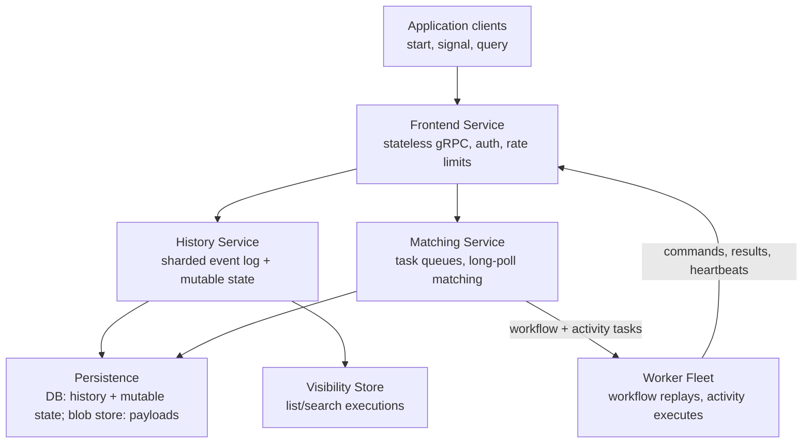
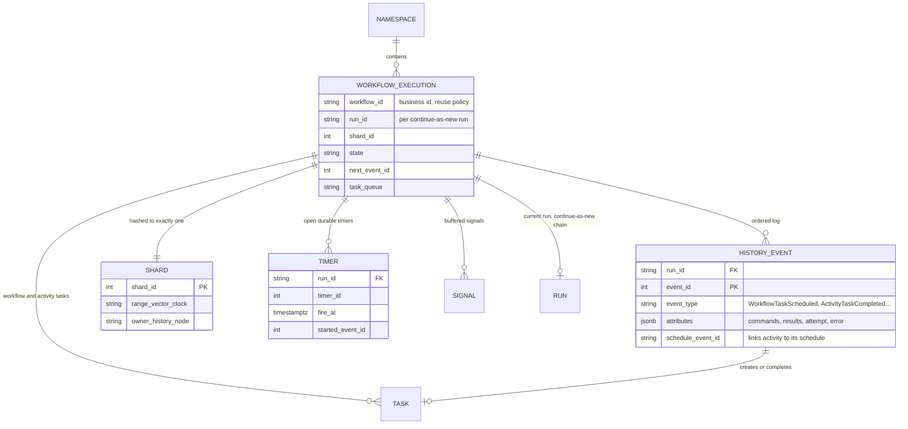
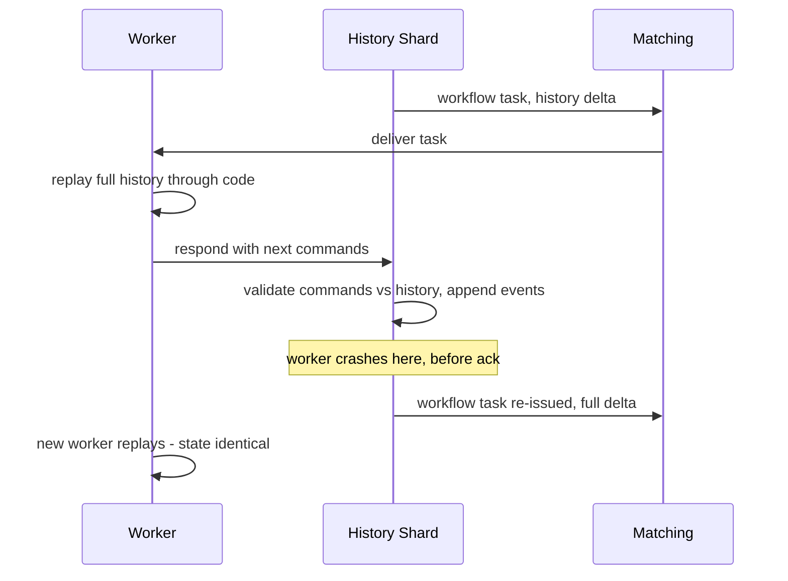
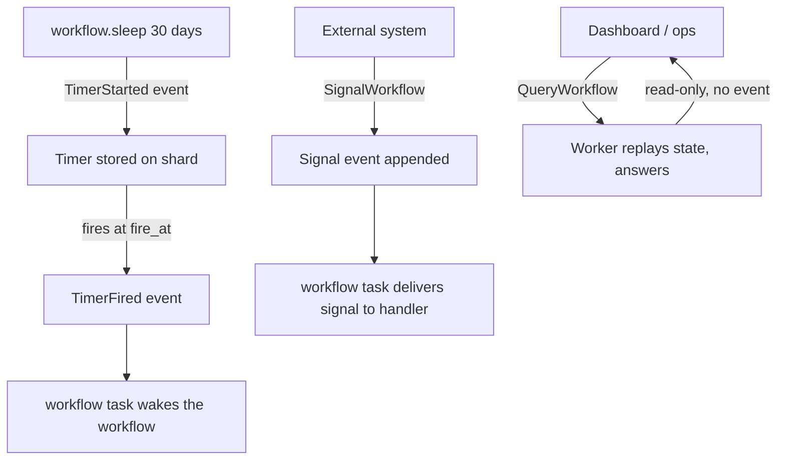

# Case Study: Design a Durable Execution Engine (Temporal/Cadence-Style)

## Overview

"Design Temporal" is the systems-design form of a deceptively small request: "I want a function that keeps running even if the machine running it dies." The engine delivers it by recording every step a workflow takes as events and reconstructing state by deterministic replay — no checkpointed stacks, no saved heaps; the history log *is* the state. This walkthrough designs one end to end: the workflow/activity split, the event-history and replay model, task queues and sticky workers, timers/signals/queries, versioning under live histories, at-least-once execution with idempotency, and history-size management with continue-as-new — closing with the comparison against cron, Airflow, Celery, and Step Functions. The concept-first treatment (why cron+queues collapse, capacity math at 1M workflows, failure-mode catalog) is the sibling page [Workflow Orchestration and Durable Execution](../hld/workflow-orchestration.md); this page is the interview-format build of the same machine, and it is the engine that a pipeline like [Video Transcoding](./video-transcoding-pipeline.md) runs on.

## Step 1 — Requirements

### Functional

- Developers write **workflows** (orchestration code: sequence, fan-out, compensation, waiting) and **activities** (side-effecting units: API calls, DB writes, inference jobs) in ordinary language SDKs — no DSL, no YAML state machine
- Workflows can **wait**: on activity completion, on durable **timers** (seconds to months), on **signals** (async messages from outside), or any combination, while holding no compute
- **Queries**: read-only inspection of a workflow's current state from outside, without affecting execution
- **Child workflows** and cron-style scheduled workflows; per-activity **retry policies** with backoff, caps, and non-retryable error lists
- **Versioning**: workflow code can be fixed and redeployed while thousands of its executions are mid-flight
- Full **history visibility**: for any execution, the ordered event log is the debugging artifact (what ran, what it returned, what it waited for)

### Non-Functional

- **Scale**: 10K workflow starts/s, 1M concurrently open executions, sustained ~1M events/s appended
- **Durability**: no accepted start, signal, or completed-activity result is ever lost — persistence failover delays execution, never drops it
- **Workflow state is exactly-once**: an execution has one authoritative history with one writer at a time; replays reconstruct identical state
- **Activities are at-least-once**: duplicates are possible in a crash window; exactly-once *effects* are the application's job via idempotency keys (the engine supplies the keys)
- **Latency budget**: activity dispatch ~tens of ms p99 (long-poll match); workflow-task turnaround sub-second steady-state; timers fire within ~1 s of schedule under normal load
- **Isolation**: the service planes (API, history, task queues, storage) scale and fail independently; one tenant's 100:1 fan-out must not starve others (per-queue rate limiting)

## Step 2 — Back-of-Envelope Estimation

| Quantity | Assumption | Result |
|---|---|---|
| Event append rate | 1M open executions × ~1 event/s average | ~1M events/s sustained, ~10M/s peak fan-out |
| Events per activity | Scheduled/Started/Completed ×2 (workflow+activity sides) | 6 events/activity → ~160K activity executions/s |
| Events per timer | TimerStarted + TimerFired | 2 events; 100K live timers trivially held |
| History shards | Shard by workflow ID | 4,096 shards → ~250 events/s/shard mean, ~2.4K/s hot-shard peak |
| History storage | ~1 KB/event, 1M events/s | ~1 GB/s ≈ 86 TB/day raw — retention + continue-as-new are not optional |
| Worker fleet | Activity 200 ms avg, 20 slots/worker | 100 exec/s/worker → 1,600 workers at mean, ~3,200 with p99 headroom |
| Workflow-task replays | Sticky-cache miss rate ~2% of workflow tasks | ~2K full replays/s of median 200-event histories — ~400K event reads/s on storage |
| Timer wheel | 1M open executions × 20% with a pending timer | 200K pending timers, ~2.3K firing/s — one in-memory wheel per shard |

The insight to state: the engine is a **write-amplification machine with a single-writer kernel**. Compute (workers) is trivially elastic; the hard parts are the per-execution serialization point (one shard writes one execution's history) and the read path of replay — every design decision defends one of those two.

## Step 3 — API Sketch

Client API (via the frontend gRPC service):

```text
StartWorkflowExecution   { workflow_type, input, task_queue, id, id_reuse_policy }
SignalWithStart          { signal_name, payload, ... }   # start-or-signal, one round trip
SignalWorkflow           { execution, signal_name, payload }   # async append
QueryWorkflow            { execution, query_type }       # read-only, never touches history
GetWorkflowHistory       { execution }                   # the debug artifact
TerminateWorkflow        { execution, reason }
ResetWorkflow            { execution, event_id, reason } # rewind to a pre-break event
```

Worker protocol (long-poll, the worker is *your* compute):

```text
PollWorkflowTaskQueue    { task_queue, identity }  → WorkflowTask { history_delta }
RespondWorkflowTaskCompleted { task_token, commands: [ScheduleActivity, StartTimer,
                               CompleteWorkflow, ContinueAsNew, ...], sticky_attrs }
PollActivityTaskQueue    { task_queue, identity }  → ActivityTask { params, attempt }
RespondActivityTaskCompleted { task_token, result }
RecordActivityHeartbeat  { task_token, details }   # progress + liveness
```

The SDK surface that hides all of the above from the developer:

```python
@workflow.defn
class OrderFulfillment:
    @workflow.run
    async def run(self, order_id: str) -> str:
        payment = await workflow.execute_activity(charge_card, order_id,
                     start_to_close_timeout=timedelta(seconds=30), retry_policy=RETRY)
        await workflow.sleep(timedelta(days=30))          # durable timer, no compute held
        workflow.signal_handler("cancel_requested")       # signal may arrive any time
        return await workflow.execute_activity(ship, order_id,
                     start_to_close_timeout=timedelta(minutes=5))
```

## Step 4 — High-Level Architecture



- **Frontend**: stateless; owns auth, admission, per-namespace rate limits, and routing. Starting an execution is the first event append (`WorkflowExecutionStarted`) — there is no "create then fill in later"
- **History service**: the stateful kernel. Executions hash to **shards**; each shard is a single-writer state machine for all its executions, serializing event appends and advancing mutable state (next event id, open timers, pending signals) transactionally with each append. This is the sharded-single-writer principle from [Database Sharding](../../../dbms/advanced/database-sharding.md) applied to *execution histories*
- **Matching service**: owns task queues (namespaced, optionally partitioned). Long-poll only — the server never pushes to workers, so a dead worker costs nothing and backpressure is workers simply not polling (the same lease/pull logic as [Case Study: Distributed Task Scheduler](./distributed-task-scheduler.md))
- **Persistence**: append-only history rows + per-execution mutable-state rows, on a pluggable store (Cassandra/MySQL/Postgres); payloads above the ~2 MB default limit go to the blob store as references. Append + mutable-state update must be one transaction — the engine's correctness rests on it
- **Visibility store**: search attributes indexed separately so "list running executions for tenant X" never touches the history path

## Step 5 — Data Model



Reading the model the way the engine does:

- **`(workflow_id, run_id)`** identifies an execution; `workflow_id` is the business key with a reuse policy (reject-duplicate is the dedup mechanism for "process this order exactly once" requests — the same idempotency discipline as [API Idempotency](../../../backend/api/api-idempotency.md))
- **`event_id` is a strictly increasing sequence per run** — replay reads events in this order, and the mutable state's `next_event_id` is the transactional heartbeat of progress
- **Activities are linked events**: `ActivityTaskScheduled (event 42) ↔ ActivityTaskStarted/Completed/Failed/Timeout` all back-reference `schedule_event_id = 42`. The DAG is the log — no separate edges table
- **`run_id` chains on continue-as-new**: the execution keeps its `workflow_id` across runs while each run starts a fresh bounded history

## Deep Dive 1 — Event History and Deterministic Replay

Every server-side effect of workflow code goes through commands, and commands become events. The kernel loop:



- **Replay is the resume mechanism**: after any failure, a worker re-executes the workflow function from event 1, but *commands already reflected in history are answered from history* — `ActivityTaskCompleted(event 7)` resolves the first `await execute_activity(...)` locally instead of re-running it. The function "continues" from where it was; only the final, not-yet-recorded commands execute against the world
- **The determinism contract**: workflow code must emit the same command sequence from the same history — no wall-clock reads (engine-provided `workflow.now()`/`sleep`), no external RNG (seeded SDK random), no direct I/O, no raw threads/locks with racing schedules. Enforcement is command matching: a replayed command that doesn't match the next expected event fails the workflow task with a nondeterminism error (the contract and its failure modes are cataloged in [Workflow Orchestration and Durable Execution](../hld/workflow-orchestration.md))
- **Non-determinism lives in activities by construction**: HTTP, DB writes, LLM calls, filesystem — all belong in activities, which run once per attempt *outside* the replay path. The split is not stylistic; it is the replay model's survival condition
- **Crash between append and ack** is safe by direction of truth: the history append is authoritative; the worker's belief about completion is not. The workflow task is re-delivered, replay hits the same events, and the same commands come out — that idempotence of *deriving* commands is why workflow tasks are safe to retry aggressively

## Deep Dive 2 — Task Queues, Sticky Workers, and Backpressure

Two queue families, one matching service:

| Property | Workflow task queue | Activity task queue |
|---|---|---|
| Payload | History delta (small if sticky, full if cold) | Activity input |
| Cost of duplicate delivery | Zero (replay is deterministic) | One duplicate execution (idempotency needed) |
| Rate limiting | Per-queue max QPS at frontend | Per-queue + per-worker slots |
| Routing | Sticky queue preferred, normal queue fallback | Straight long-poll |
| Latency target | Sub-second turnaround | Tens of ms dispatch |

- **Sticky execution**: the worker that most recently executed a workflow caches its in-memory state and keeps a **sticky queue** registration; the next workflow task routes there and ships only the *delta* since the cached event id. On cache miss (worker died, evicted, or after timeout) the task falls back to the normal queue and a fresh worker replays the full history. Sticky caching turns "replay everything" into "replay almost never" while keeping replay as the always-correct fallback — performance optimization, not correctness dependency
- **Long-poll matching**: workers poll with the request held open until a task matches; an overloaded system simply matches slowly, so overload degrades latency rather than generating push-rejections. Per-queue rate limits at the frontend protect the history path from a hot queue's command bursts (per-tenant isolation)
- **Task-queue partitioning**: a task queue can be sharded across matching nodes; partitioning by workflow-id-affinity (for workflow tasks) vs round-robin (for activities) is a tunable — affinity preserves sticky hits, round-robin balances activity load
- **Schedule-to-start timeout** is the queue-health instrument: a workflow task waiting too long means no worker is on that queue (wrong name, dead fleet, version skew) — the engine surfaces it as a workflow-visible timeout rather than a silent backlog, and ops alerts on **queue age**, not depth

## Deep Dive 3 — Timers, Signals, and Queries

Three out-of-band interaction modes with deliberately different semantics:



- **Timers are two events, not threads**: `TimerStarted` is appended and the timer sits in the shard's in-memory wheel, backed by a persisted row; when `fire_at` arrives the shard appends `TimerFired` and a workflow task wakes the code. A history-DB outage stalls firing (nothing can append) — timers are durable, not independent. One worker can await millions of timers because none of them hold compute
- **Signals are async events**: `SignalWorkflow` appends a signal event; the workflow consumes it in a handler at the next workflow task, and un-consumed signals buffer in history (bounded — a signal storm is a history-growth attack; cap and dead-letter). **SignalWithStart** collapses "start if absent, else deliver" into one frontend call — the correct primitive for "ensure the per-customer workflow exists and knows about this event"
- **Queries are read-only and side-effect-free**: the query is routed to a worker holding (or willing to replay) the execution's state; the answer never touches history. This makes queries safe at high frequency and *inconsistent by design* (they may race the last in-flight task) — an important contrast to state-changing interaction, which must be an event
- **Updates** (the newer write-from-outside API) bridge the two: they append events like signals but can return a result to the caller, at the cost of more complex validation — mention it, but signals + queries cover the interview answer

## Deep Dive 4 — Versioning: Changing Code Under Live Histories

The problem is structural: a running workflow replays *its old history through your new binary*. Any code change that alters the command sequence (reordering a timer and an activity, renaming an activity, adding a step) makes replay mismatch and wedges the execution — every retry replays into the same nondeterminism failure.

- **Patching (marker events)** — the fine-grained tool. Guard the changed line with a patch flag; the flag writes a **marker event** into history on first execution:

```python
# deploy 1: old code                       # deploy 2: patched
result = yield wait_for_payment()          if workflow.patched("payment-v2"):
# ...history has TimerStarted(30d)             result = yield charge_card_now()
                                           else:
                                               result = yield wait_for_payment()
```

  On replay, an old execution's history contains no marker → the old branch runs; new executions get the marker → the new branch runs. Three-step retirement: `patched()` until no pre-change executions remain → `deprecate_patch()` (marker still honored) → remove. The marker *is* an event, so versioning is written into the same log it protects
- **Worker versioning (build ids)** — the coarse tool: pin task queues to code revisions so old workers drain old executions and new workers take new starts; used for SDK/language upgrades and sweeping changes where per-line patches are impractical
- **Workflow reset** — the recovery tool: rewind an execution to a pre-break event and replay forward with fixed code. It works precisely because the log is authoritative — a rollback mechanism that only exists in event-sourced execution
- **Cron/scheduled workflows** are the continuing offender: every period spawns executions on whatever code is deployed, so a versioning violation recurs forever — the first place to test patches

## Deep Dive 5 — At-Least-Once + Idempotency, and History Size

- **The honest guarantee**: activities execute **at least once**. A worker that completes the charge and dies before acking produces a retry on another worker — a duplicate charge unless the effect deduplicates. The engine's contract is narrow by design: it supplies `workflow_id + activity_id + attempt` as a ready-made idempotency key and expects effects keyed by it (payment-processor idempotency keys are the canonical case, per [Idempotency](../../../backend/patterns/idempotency.md)). Heartbeat payloads carry partial progress to the next attempt so long activities resume rather than restart
- **Local activities** trade safety for latency (single task, no full event fan-out) — right for cheap/idempotent calls, wrong for payments; name the trade explicitly
- **History size is bounded** because every replay reads the whole log: Temporal warns around 10,240 events and caps around 51,200 per execution (limits from the engine docs, quoted in the sibling page). Designs that would blow past it — per-item loops over a million-row backfill, minute-granularity polling for months — must restructure
- **Continue-as-new** is the bounded-history mechanism: the workflow emits a `ContinueAsNew` command, and the engine starts a *new run* (same `workflow_id`, new `run_id`, fresh history) seeded with the carried-forward state. Semantically it is a tail-recursive fold over the process:

```python
@workflow.defn
class Backfill:
    @workflow.run
    async def run(self, state: BackfillState) -> str:
        processed = 0
        while processed < 5_000:                      # keep this run's history bounded
            await workflow.execute_activity(process_batch, state.cursor)
            state.cursor += BATCH; processed += 1
        if not state.done:
            return await workflow.continue_as_new(state)   # fresh history, same execution
        return "done"
```

- **Retention and archival**: hot history lives in the DB for days-to-weeks (the debug window), then archives to object storage; visibility rows persist independently so "find executions by attribute" outlives the hot log. Storage math from Step 2 (86 TB/day raw at 1M events/s) is the reason retention is a first-class setting, not an ops afterthought

## How It Compares: cron, Airflow, Celery, Step Functions

| Dimension | cron + queue scripts | Apache Airflow | Celery | AWS Step Functions | Temporal/Cadence engine |
|---|---|---|---|---|---|
| Model | Time-triggered jobs | Batch DAG scheduler | Task queue | Declarative JSON state machine | Durable code execution |
| State | Ad hoc DB columns | DB-backed DAG runs | Broker + result backend | Managed state per state | Event history + replay |
| Durable wait (days) | No | No (schedule-level only) | No | Yes (wait states) | Yes (timers as events) |
| Retry | Hand-rolled | Per-task policy | Per-task policy | Per-state, managed | Declarative policy + heartbeats |
| Versioning under live runs | N/A | DAG re-parse hazards | N/A | Version-managed states | Patching, worker versioning, reset |
| Multi-tenancy / isolation | None | Weak | Queue-level | Account-level | Namespaces, per-queue limits |
| Signals/external events | No | Triggers only | Chords/callbacks | Callback patterns | First-class signals/queries |
| Fit | Fire-and-forget scripts | Data pipelines, backfills | Fire-and-forget tasks | Composed managed services | Long-running business processes |

The boundary to state: cron schedules *time*, Airflow schedules *DAGs*, Celery runs *tasks*, Step Functions composes *managed services* — the durable engine runs *your code* durably, which is why it pays for itself exactly when processes are long, stateful, and change frequently, and is over-engineering for fire-and-forget work.

## Bottlenecks & Follow-Up Questions

- **The history DB is the ceiling**: ~1M events/s of appends, each with a mutable-state update in one transaction. Follow-ups: batch command-to-event conversion per task completion, shard-local batching, and blob-store offloading of payloads
- **Hot shards**: hashing by workflow ID balances executions, not load — one tenant with 30% of traffic or one workflow type fanning out 100:1 makes its shard hot. Follow-ups: shard splitting, routing keys that mix tenant + entropy (the Discord lesson in [ID Generation](../hld/id-generation.md) applies verbatim), per-namespace rate limits at the frontend
- **Replay cost on cache miss**: a 5K-event history replayed by a cold worker is a read burst against the persistence layer; a thundering herd of cache misses (worker fleet restart) can overwhelm the DB. Follow-ups: staggered sticky-timeouts, history delta streaming, pre-warming workers per queue
- **Payload bloat**: multi-MB activity results copied into history are a storage and replay tax. Follow-ups: hard payload limits (~2 MB default), blob references, and the discipline that history holds *facts*, not data
- **Signal storms**: one misconfigured producer appending 10K signals/s to a popular execution grows history and starves workflow tasks. Follow-ups: per-execution signal caps, dead-lettering, and funneling fan-in through child workflows
- **Nondeterminism incidents**: a bad deploy wedges every live execution of that workflow type. Follow-ups: the patching protocol, worker versioning, reset as the recovery tool, and pre-deploy replay tests (run new code against recorded histories in CI)

## Interview Questions

1. **Explain deterministic replay — how does a workflow "resume" after its worker dies?** The engine never saved the function's stack; it saved every decision as events. A replacement worker re-runs the workflow code from the start, and each command the code emits is checked against the next event in history: already-recorded activity completions, timer firings, and signals are answered from history (no side effect re-runs), and the first command not yet in history executes for real. The contract is that the same history must produce the same commands — which is why workflow code bans wall-clock reads, external RNG, and direct I/O, and why all side effects live in activities outside the replay path.
2. **Why is at-least-once the activity guarantee, and what makes it feel exactly-once?** A worker can complete a charge and die before its ack reaches the server; the engine cannot distinguish that from a lost attempt, so it retries — by construction, at least once. It feels exactly-once because the engine hands every attempt a stable idempotency key (workflow id + activity id + attempt) and the application keys effects with it: the retried charge hits the same idempotency key at the payment processor and deduplicates. Any design claiming engine-side exactly-once for arbitrary code is lying about the crash window.
3. **You renamed an activity function while 3,000 executions were in flight. What happens, and what are your options?** In-flight executions replay their histories against the new binary and emit the new activity name, which mismatches the old `ActivityTaskScheduled` event — nondeterminism errors, every retry fails identically, and those executions are wedged. Options: patch markers (the old executions take the old branch, new ones the new, retirement in three steps), worker versioning with build-id-pinned queues (old executions drain on old workers), and workflow reset for executions already wedged. The prevention is replay tests in CI: run the new code against recorded histories before it can touch production.
4. **Design the waiting behavior of a 30-day trial workflow. Why is a timer not a sleeping thread?** The workflow awaits `workflow.sleep(30 days)`: the engine appends `TimerStarted`, persists the timer on the owning shard, and the workflow holds zero compute. At `fire_at`, the shard appends `TimerFired` and a workflow task wakes the code on any worker. A million such workflows cost a million timer rows and a wheel per shard — no threads, no memory held, and the timer survives DB failovers (delayed, never lost). A cron job polling daily is the anti-pattern: 30 checks instead of one event, and no way to signal a cancellation mid-wait except polling a flag.
5. **When do you continue-as-new, and what do you lose when you do?** When a run's history approaches the bound (~10K events warning): per-item loops over large backfills, month-long pollers, and high-churn fan-in. Continue-as-new starts a fresh run under the same workflow id, seeded with state you pass explicitly — anything not passed is gone, in-flight timers/signals must be re-established by the new run, and observability must stitch the run chain. The restructure usually improves the design (batch instead of per-item), which is the point: the history bound is a forcing function for bounded, checkpointed iteration.
6. **Position this engine against Airflow and Step Functions in one answer.** Airflow schedules batch DAGs on time — great for data pipelines and backfills, wrong for per-entity business processes with external events and day-long waits. Step Functions composes managed AWS services with a declarative JSON state machine — excellent within that ecosystem, limited in expressiveness and vendor-bound. The durable engine executes arbitrary customer code durably with event-sourced state, signals/queries, and in-place versioning — the right tool when processes are long-running, stateful, and written by application teams. All three are "workflow engines" in marketing; they differ in what is durable and whose code runs.

## Key Takeaways

- Durable execution = append-only event history + deterministic replay; the history is the state, and the determinism contract (no clock/RNG/I/O in workflow code) is its survival condition
- The single-writer shard per execution is the correctness kernel; compute is elastic workers that long-poll — the engine owns serialization, the fleet owns throughput
- Sticky workers make replay rare; replay makes correctness unconditional — a performance optimization layered on the fallback, never the reverse
- Timers are two events, signals are buffered events, queries are eventless reads — three interaction modes with deliberately different semantics and consistency
- Versioning under live histories is inevitable: patch markers write the version decision *into* the history they protect; worker versioning and reset cover the coarse cases
- At-least-once activities + supplied idempotency keys = the exactly-once illusion; bounded history + continue-as-new keeps replay tractable at scale

## References

- Temporal docs: Workflow Definition — determinism constraints, command/event matching: https://docs.temporal.io/workflow-definition
- Temporal docs: Event History — commands-to-events mapping, replay recovery: https://docs.temporal.io/encyclopedia/event-history
- Temporal docs: Continue-As-New — fresh history, same workflow id / new run id: https://docs.temporal.io/workflow-execution/continue-as-new
- Temporal docs: Task Queues — worker long-polling and queue semantics: https://docs.temporal.io/task-queue
- Temporal docs: Architecture — frontend/history/matching/persistence/visibility decomposition: https://docs.temporal.io/encyclopedia/architecture/temporal-architecture
- Temporal docs: Retry Policies and Activity Execution — at-least-once, heartbeats, timeouts: https://docs.temporal.io/encyclopedia/retry-policies
- Temporal docs: Versioning (Python SDK) — patching protocol and history markers: https://docs.temporal.io/develop/python/workflows/versioning
- Cadence Workflow — the Uber Cadence lineage and event-sourced execution model: https://cadenceworkflow.io/
- S. Burckhardt et al., "Durable Functions: Semantics for Stateful Serverless," Proc. ACM Program. Lang. (OOPSLA 2021), DOI [10.1145/3485510](https://doi.org/10.1145/3485510) — record-replay persistence semantics
- AWS Step Functions Developer Guide — the managed state-machine contrast: https://docs.aws.amazon.com/step-functions/latest/dg/welcome.html
- Apache Airflow documentation — the batch-DAG scheduler contrast: https://airflow.apache.org/docs/
- Celery documentation — the task-queue contrast: https://docs.celeryq.dev/

## Cross-References

- [Workflow Orchestration and Durable Execution](../hld/workflow-orchestration.md) — the concept-first twin of this page: why cron+queues collapse, capacity math, failure-mode catalog
- [Event Sourcing](../../../backend/patterns/event-sourcing-deep.md) — the same log-as-state pattern for entity data, replay as read path
- [Saga Pattern](../../../dbms/transactions/saga.md) — compensations the workflow error path encodes; the engine as saga runtime
- [Idempotency](../../../backend/patterns/idempotency.md) — the application-side contract that turns at-least-once into exactly-once effects
- [Database Sharding](../../../dbms/advanced/database-sharding.md) — sharded single-writer execution histories and hot-partition trade-offs
- [Apache Airflow](../../../data-engineering/airflow.md) — the batch scheduling model this engine replaces for process orchestration
- [Argo Workflows](../../../cloud/cicd/argo-workflows.md) — Kubernetes-native DAG execution, the batch-cluster point of the same spectrum
- [Case Study: Distributed Task Scheduler](./distributed-task-scheduler.md) — lease/pull assignment and DLQ mechanics shared by the task-queue layer
- [Case Study: Video Transcoding Pipeline](./video-transcoding-pipeline.md) — a production consumer: per-asset workflows fanning out GPU chunk jobs
