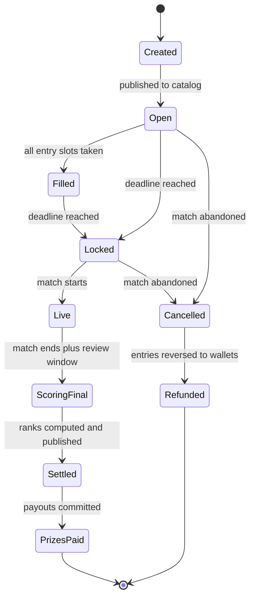
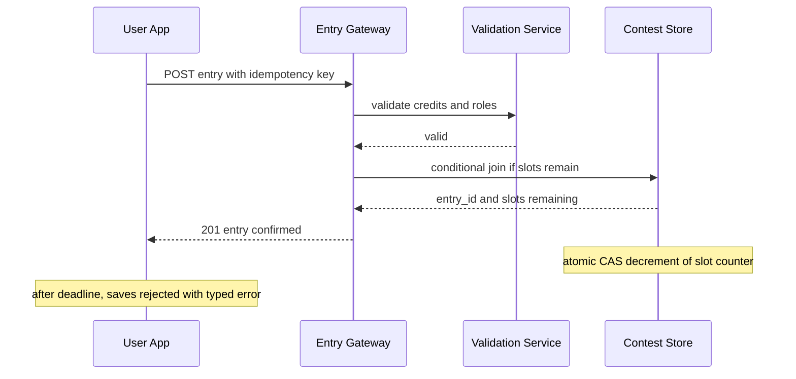
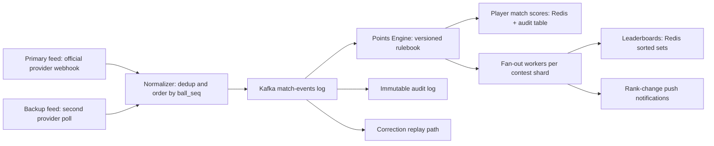

# Case Study: Design a Fantasy Sports Platform (Dream11/FanDuel at Match-Day Scale)

## Overview

A fantasy sports platform lets users assemble virtual teams of real athletes, enter paid contests, and win prize pools based on how those athletes perform in real matches. The system has three unforgiving properties: a **hard deadline write cliff** (60% of team saves arrive in the final hour before lock), a **correctness-critical settlement path** (wrong prize distribution is a regulatory and trust disaster), and a **live scoring fan-out** where one ball-by-ball event must re-rank millions of entries. This page builds the platform in the 45-minute format, using an Indian-context scale — 100M+ registered users, an IPL match pulling tens of millions of teams — and complements the reserved-inventory pattern in [Case Study: Ticketmaster](./ticketmaster.md) with a contest-entry pattern where inventory is elastic but time is not.

## Step 1 — Requirements

### Functional

- Create contests per match: entry fee, prize pool, entry cap, contest type (mega, head-to-head, practice)
- Team building: pick 11 players from both playing sides under credit and role constraints, designate captain (2×) and vice-captain (1.5×)
- Join contests with a saved team; support multiple entries per user in multi-entry contests
- Lock team edits at the match deadline; start live scoring when play begins
- Publish per-contest leaderboards during and after the match
- Settle contests: compute ranks, split prizes for tied ranks, credit winnings to wallets
- Refund entries when a match is cancelled or abandoned

### Non-Functional

- **Scale**: 100M+ registered users platform-wide; a marquee IPL match generates 10M+ contest entries across hundreds of contests, with millions of concurrent team saves in the last hour
- **Write cliff**: a save rate that ramps from ~1K/s to 30K/s in the final 30 minutes before lock; every save must pass validation
- **Latency**: team-save confirmation < 300 ms p99; leaderboard reads < 100 ms p99; live score freshness < 10 s from ball event to points visible
- **Correctness**: a team that passed validation must never be rejected later; settlement ranks must be exactly reproducible from the scoring event log
- **Fairness**: no duplicate players within one team; per-contest entry limits enforced atomically; lineups hidden from other users until deadline
- **Availability**: degrade scoring freshness before degrading team saves; refunds must work even if scoring is down

## Step 2 — Back-of-Envelope Estimation

Work the match-day numbers before drawing boxes. Assumptions are stated so the interviewer can challenge them.

| Quantity | Assumption | Result |
|---|---|---|
| Registered users | 100M platform-wide, 15M active on a marquee match day | 15M DAU |
| Teams saved per hot match | 60% of actives save in final hour: 9M saves / 3600 s | ~2.5K saves/s avg, ~30K/s burst |
| Contest entries | 10M entries across ~500 contests for one match | 20K joins/s peak |
| Team payload | 11 player IDs + captain/vice-captain ≈ 200 B | 30K saves/s ≈ 6 MB/s ingest — trivial bytes, hard validation |
| Live scoring events | Ball events ~1/5 s + milestones; ~500 points-relevant events per match | Tiny volume, high correctness bar |
| Leaderboard reads | 5M users × 1 poll / 5 s during match | ~1M RPS reads — the actual scale problem |
| Leaderboard writes | Per-contest deltas on points change | Batched; largest contest updates 10M-member sorted set |
| Settlement | Rank 10M entries once per contest | One-time sort: ~10M × 16 B keys ≈ manageable, but must be exactly reproducible |

The framing that lands: **the write path is small but validation-heavy, the read path is enormous but derived, and correctness lives in the scoring log**. Bytes are never the constraint — atomic slot counting, validation throughput, and leaderboard fan-out are.

## Step 3 — Contest Lifecycle and State Machine

Every contest is a state machine with a hard clock. All services agree on these states; the deadline transition is enforced by a single lock service, not by each app server deciding locally.



- **Created → Open**: contest catalog (Redis + CDN) lists it; entry slots are counted in the contest store, not in a shared database row that every join would serialize on
- **Filled**: slots exhausted; late arrivals get a "full" response and a nudge to sibling contests — this is elastic inventory, unlike a seat map
- **Locked**: the deadline service fires at match deadline (typically toss time); team edits are rejected with a typed error, and lineup snapshots become immutable
- **ScoringFinal**: a 30–60 minute review window after the match ends during which official corrections are accepted; settlement only starts after this window closes
- **Cancelled/Refunded**: abandonment rules are sport-specific (DLS in cricket, rain rules); refunds are ledger reversals keyed by entry ID, never balance mutations

**What the interviewer is probing:** whether the deadline is a distributed timer problem. It is not — the deadline is a known timestamp; the work is making millions of clients and a thousand services agree on it without a thundering herd of "is it locked yet?" calls.

## Step 4 — Team Selection and Validation

Team validity is a pure function over cached data, which is what makes 30K saves/s feasible. The validator holds the match's player master (player ID, credits, role, real team) in memory; a save costs microseconds of CPU, zero database I/O.

```text
POST /v1/matches/{id}/teams          body: { players[11], captain_id, vice_id, idempotency_key }
POST /v1/contests/{id}/entries       body: { team_id, idempotency_key }
GET  /v1/contests/{id}/leaderboard   query: ?after_rank= for cursor pagination
GET  /v1/matches/{id}/live-points    body: player_id → points delta stream
```

| Rule | Constraint | Enforcement point |
|---|---|---|
| Squad size | exactly 11 players | validator (pure check) |
| Credit budget | total ≤ 100 credits | validator; per-player credits cached per match |
| Role constraints | 1–4 wicketkeepers, 3–6 batters, 1–4 all-rounders, 3–6 bowlers | validator |
| Side constraint | max 7 players from one real team | validator |
| Player uniqueness | no player twice in one team | validator + DB unique index `(team_id, player_id)` |
| Captain distinct | captain ≠ vice-captain | validator |
| Entry cap per user | ≤ N teams per contest (contest config) | atomic slot/CAS check in contest store |
| Deadline | save accepted only in `Open`/`Filled` contest state | lock service; authoritative timestamp from deadline service |

Design decisions worth stating out loud:

- **Validation is stateless; admission is atomic.** A save that fails credit/role checks never touches the contest store. A save that passes performs one conditional decrement of the contest's remaining slots (compare-and-swap on `slots_remaining`), the same discipline as the hold endpoint in [Ticketmaster](./ticketmaster.md)
- **Idempotency key = client-generated per save.** A mobile client on a flaky IPL-network stadium connection will retry; the key collapses retries to one entry (see [API Idempotency](../../../backend/api/api-idempotency.md) and RFC 9110 §9.2.2)
- **Autosave drafts.** The client persists a draft team continuously, so the final save is a small diff. This flattens the write cliff by moving bytes earlier — the atomic join still happens at the deadline moment, but payload assembly and validation warm-up do not
- **Multi-entry contests** enforce per-user entry caps with per-user counters sharded by `(user_id, contest_id)`; the global slot counter is the only contended row, and it is a single CAS cell per contest, trivially cacheable in a dedicated service

### Core Data Model

```text
matches           (id, sport, starts_at, deadline_at, status, feed_provider)
players           (id, match_id, real_team, role, credits, is_playing)
contests          (id, match_id, entry_fee_cents, prize_pool_cents,
                   max_entries, max_per_user, state, rulebook_version)
contest_slots     (contest_id, shard_no, remaining  -- CAS cells)
entries           (id, contest_id, user_id, team_id, joined_at,
                   idempotency_key UNIQUE)
teams             (id, user_id, match_id, captain_id, vice_id)
team_players      (team_id, player_id, UNIQUE(team_id, player_id))
player_scores     (match_id, player_id, points, events_applied_seq)
entry_scores      (contest_id, entry_id, points, updated_seq)
payouts           (contest_id, entry_id, rank, amount_cents,
                   idempotency_key UNIQUE, state)
```

Two uniqueness constraints carry the fairness guarantees: `entries.idempotency_key` makes retries converge to one entry, and `team_players(team_id, player_id)` makes duplicate players impossible even if a validator bug ships. `contest_slots` deliberately splits the slot counter into per-shard CAS cells so the mega contest's join burst does not serialize on one row — the tail of admission is eventually consistent while over-admission stays impossible.

### Wallets and Entry Fees

Entry fees are money movement before they are contest admission, so they follow ledger discipline: `POST entry` first debits the wallet (or authorizes the PSP charge) in a pending state keyed by the same idempotency key as the admission, then the CAS slot decrement runs, then the pending money movement commits. If admission fails (contest full, deadline passed), the pending movement reverses. The ordering matters in exactly one direction: money pends before slots are claimed, never after — otherwise a user can hold a slot the wallet cannot pay for, and the unwinding path is a support-ticket factory. Bonus and cash wallet components settle from separate ledger accounts because their refund rules differ: bonus money often cannot be withdrawn, only replayed into future entries.

## Step 5 — Deadline Lock and the Write Cliff

The final hour before an IPL deadline is the system's defining moment. Traffic shape: a long, calm ramp, then a 10× spike in the last 10 minutes, then absolute silence at the deadline timestamp. The playbook:



- **Pre-scale, don't react.** Capacity for the spike is provisioned from the match calendar hours ahead: validation services are stateless so they scale horizontally; contest stores for the top-N matches are isolated onto dedicated shards so one match cannot melt general traffic (the same isolation lever as the hot-event playbook in [Ticketmaster](./ticketmaster.md))
- **The lock is a service, not a timer per server.** One deadline service publishes the authoritative `locked_at` per match to a pub/sub channel and a versioned config; gateways reject saves locally once their clock passes the published timestamp with a small safety skew (+1 s), eliminating a synchronized stampede of lock-check calls
- **Shed gracefully when slots run out.** A full contest returns sibling-contest suggestions served from cache; the join path for full contests must be cheap, because disappointed users retry
- **After lock, reads dominate.** Lineup snapshots freeze; the "who is in this contest" read path switches to replica caches. The next cliff is scoring, and it is a different machine (Deep Dive below)

**What the interviewer is probing:** what breaks first. Answer: the slot counter for the mega contest (mitigated by CAS + early autosave diffing), then mobile network variability (mitigated by idempotent retries), never raw bytes.

## Step 6 — Live Score Ingestion and the Points Engine

Scores flow from external providers through a one-way pipeline that ends in per-contest leaderboards. The pipeline is event-sourced: the Kafka log of normalized match events is the truth, and every downstream value — player points, leaderboard ranks, settlements — is a deterministic projection of it.



- **Two feeds, one sequence number.** Providers disagree and retry; the normalizer dedups on `(match_id, provider, ball_seq)` and orders strictly. A dropped event is recovered by periodic reconciliation snapshots from the provider, which re-drive any missed deltas through the same log
- **The points engine is a pure function**: normalized event × rulebook version → per-player point deltas. Rulebooks are versioned per match at lock time, so a mid-season rule change can never retroactively alter a live match's math. A 50-run milestone, a wicket, a catch, economy-rate bonuses — each is a row in the rulebook, each maps to a delta
- **Fan-out is per-contest sharded.** One ball event changes ≤ 11 players' points; fan-out workers group affected contests, recompute team-total deltas for affected entries (`SELECT entries containing player X in contest C` served from a precomputed per-contest player→entries index), and issue batched `ZINCRBY` calls on Redis sorted sets. A 10M-entry contest's sorted set is ~1 GB — one Redis shard handles it, with read replicas for poll traffic
- **Corrections are replays, not edits.** When the official scorer fixes a stat 20 minutes later, a correction event enters the same log; the engine recomputes affected player totals and emits *deltas*, positive or negative, so leaderboards can move both directions before finality
- **Freshness budget**: ball event → provider push (2–5 s) → normalize (100 ms) → points + fan-out (1–2 s) ≈ under 10 s end-to-end, comfortably inside the user's tolerance for live sports

**What the interviewer is probing:** whether leaderboards are recomputed or incrementally updated. The honest answer is hybrid: incremental deltas for liveness, with a periodic full rebuild (sorted-set rescan from the player-scores truth) as the self-healing baseline — the same append-log-plus-projection pattern as [Real-World: Billing & Metering](../real-world/billing-metering.md).

## Step 7 — Leaderboards per Contest

Leaderboards are the read monster: ~1M RPS of polls during a live match. The design keeps them a pure derived cache:

- **One Redis sorted set per contest**, member = entry ID, score = team points × 10 (integer math avoids float drift). Rank via `ZREVRANK` is O(log N); a 10M-member set answers a rank query in sub-millisecond
- **Pagination by cursor** (`after_rank`) instead of page numbers — ranks shift every ball, so page-number pagination is both wrong and uncacheable
- **Around-me window**: users want their neighbors, not the top 100. A rank-anchored window (`ZRANGE my_rank-50 my_rank+50`) is one extra query against the same set
- **Poll suppression on the client**: push rank-change notifications for large movements only (entered top 100, prize ranks), and let clients poll at 5 s with jitter. Without jitter, 5M synchronized pollers are a self-inflicted DDoS at every ball boundary
- **Read replicas + local hot cache** for the top-ranks slice, which is the same for everyone and is CDN-cacheable at 1–2 s TTL

| Concern | Mechanism | Consequence |
|---|---|---|
| Rank ties | deterministic tie-break (earlier join time, then entry ID) | settlement reproducibility |
| Stale scores | freshness SLA per match state | acceptable; correctness deferred to settlement |
| Hot contest skew | dedicated Redis shard per mega contest | one contest cannot evict others |
| Correction storms | batch deltas per 2 s window | bounded write amplification |

## Step 8 — Settlement and Prize Distribution

Settlement converts `ScoringFinal` into money movement, which means it inherits ledger discipline: every payout is an idempotent, audited journal entry (see [Banking Ledger](../banking-ledger.md) for the money-movement pattern in depth).

1. **Ranks finalize.** After the review window, the engine emits a final points snapshot per entry. Rank computation re-sorts the sorted set offline (a single `ZREVRANGE` dump or a Spark/Flink batch job for the mega contest) — ranks must be derivable from the event log alone, so disputes can be re-litigated from the log
2. **Ties split prizes.** A rank shared by K entries splits that rank's prize band equally (with rounding residue assigned deterministically, e.g., to the earliest entry ID). The split table is published before the match; settlement only executes it
3. **Payouts are ledger posts**, not wallet updates: `POST payout (contest_id, entry_id, amount_cents)` with idempotency key `(contest_id, entry_id)` — a retried settlement worker converges to one credit, ever
4. **Withdrawals** run KYC/AML checks and per-user daily limits; prize money above thresholds may require tax withholding, which is a compliance service, not a wallet feature
5. **Audits**: every state transition (rank computed, prize assigned, payout posted, payout settled at PSP) is an immutable audit row keyed by contest and entry. The regulator-facing question "why did user X receive ₹12,340?" must be answerable by query, not by archaeology
6. **Refund path**: abandoned matches reverse entry fees through the same ledger with the same idempotency keys — refunds are settlement with a negative prize table, conceptually identical machinery

**What the interviewer is probing:** partial failure. The settlement worker dies after posting 60% of payouts — on restart it re-reads the rank table and re-posts with the same keys; the ledger's uniqueness constraint on the idempotency key makes the remaining 40% the only new work.

## Step 9 — Fairness and Abuse Controls

Fantasy contests are adversarial: the prize pool makes every validation rule a target.

- **Same-player uniqueness per contest**: within a team, `(team_id, player_id)` has a unique index — the validator is not trusted alone. Across a user's multi-entry lineups, diversity rules (e.g., no two entries differing by zero players) are enforced at save time for contests that require it
- **Lineup privacy until deadline**: other users' teams are unreadable before lock; otherwise late entrants copy established lineups. After lock, lineups become public (transparency for trust) — the flip is a privacy boundary at a known timestamp, easy to serve from the frozen snapshot
- **Bot and multi-accounting defenses**: device fingerprinting, per-account-family entry caps (payment instrument + device + address clustering), velocity limits on joins ([Rate Limiter](../rate-limiter.md)), and KYC before large withdrawals. The economics matter: bots that copy winning lineups extract real money, so detection runs offline over the entry graph — users whose entries correlate suspiciously with a small cluster of devices get reviewed before payout, not after
- **Contest configuration guards**: prize pools and entry caps are reviewed configurations with change audits, because a mispriced contest (guaranteed-profitable arbitrage between entry fee and minimum prize) is a self-inflicted loss

### Observability for Match Day

The match calendar makes capacity planning forecastable, so the observability stack is built around it. A per-match dashboard tracks: save rate against the pre-provisioned ceiling, slot-counter CAS failure rate (the retried-join signal), validation rejections grouped by rule (a spike in credit-budget failures usually means a player-pricing data error, not user error), scoring freshness percentile from ball event to leaderboard visibility, and leaderboard poll RPS against replica headroom. Alerts fire on slope rather than absolute value — the write cliff is a known curve, and deviation from the curve is the incident signal. Post-match, the settlement pipeline publishes its own audit metrics: rank-recomputation checksums, payout attempts vs successes, and refund completeness for abandoned matches. A settlement discrepancy discovered first by a user is the most expensive kind, so the pipeline audits itself before prizes become visible.

## Bottlenecks & Follow-Up Questions

- **Mega-contest slot counter**: 10M CAS decrements in the last hour on one counter cell. Follow-up: shard the counter into K sub-counters summed lazily; "full" detection becomes eventual at the tail, acceptable because over-admission is impossible (each shard pre-allocated) and under-admission just fills sibling contests
- **Correction after settlement**: a scorer correction lands post-payout. Follow-up: finality windows plus a prize-adjustment ledger entry; beyond a threshold, insurance-like reserve pools. The design must name the moment truth freezes and never move it silently
- **Feed outage mid-match**: primary provider dies at over 8. Follow-up: reconciliation snapshot replay on recovery, leaderboards marked "stale" in UI, settlement blocked until feeds reconcile — never settle from partial truth
- **Cross-match portfolios**: a user in 50 contests across 5 simultaneous matches wants one live-points view. Follow-up: user-level points projection fed by the same fan-out, secondary to per-contest correctness
- **Second-sport scale-out**: football world cup deadlines in a different time zone. Follow-up: deadline isolation is per-match already; the real cost is rulebook authoring per sport, which is a content problem, not an architecture problem

## Interview Questions

1. **How do you validate 30K team saves per second against credit and role constraints?** The validator is a stateless pure function over an in-memory match cache: player ID → credits, role, real team. Eleven-player checks are microsecond CPU with zero I/O, so a fleet of validators scales linearly and the only serialized resource is the per-contest slot counter, handled with one conditional decrement. Database constraints (`(team_id, player_id)` uniqueness) exist as a backstop, not as the enforcement path — enforcement happens before the write, not during it.
2. **Walk through the deadline write cliff end to end.** Capacity is pre-provisioned from the match calendar; clients autosave drafts continuously so the final save is a small diff carrying an idempotency key; gateways validate statelessly; the contest store performs one CAS slot decrement. The lock timestamp is published once by a deadline service, and gateways reject locally with a +1 s safety skew. After lock, the same gateways switch to serving frozen lineup snapshots from cache. The spike never reaches a shared database.
3. **How does a post-deadline scoring correction propagate without corrupting settlement?** Corrections enter the same Kafka log as original events; the points engine recomputes affected player totals and emits signed deltas, so leaderboards move both directions. Settlement only reads a frozen final snapshot after the review window. A correction after settlement becomes a payout-adjustment ledger entry rather than a recomputation — the design names the truth-freeze moment and treats everything after as an accounting event, not a scoring event.
4. **Design the leaderboard for a 10M-entry contest.** One Redis sorted set per contest (≈1 GB), member = entry ID, score = integer points. `ZREVRANK` for rank, cursor-based windows for neighbors, batched `ZINCRBY` fan-out driven by a precomputed player→entries index so one ball event only touches entries containing the affected players. Read replicas serve the ~1M RPS poll traffic, and a nightly full rebuild from player-score truth is the self-healing baseline. Sharding the set itself is avoided — 10M members is a single-shard-sized problem, and split sets break exact rank.
5. **What makes payouts safe to retry?** Every payout is a ledger post keyed by `(contest_id, entry_id)` with a uniqueness constraint; the settlement worker is at-least-once and idempotency makes it effectively exactly-once. Ranks are recomputable from the scoring event log, tie-splits are deterministic, and every transition is an immutable audit row. The failure mode to narrate is the worker dying mid-batch: on restart it re-posts with the same keys and the ledger absorbs duplicates.
6. **Where does this design differ from a ticketing system?** Ticketmaster sells unique, scarce inventory (one seat, one buyer) so correctness lives in an atomic inventory state machine. Fantasy contests have elastic inventory (millions of entries) but a hard temporal boundary, so correctness lives in atomic admission (slot CAS), immutable snapshots at lock, and a reproducible scoring log. Same family of problems — thundering herd, idempotency, fairness — solved with different invariants.

## Key Takeaways

- Separate the three machines: stateless validation (CPU-bound), atomic admission (CAS slot counters), and derived leaderboards (sorted-set projections) — they fail differently and scale differently
- The deadline is a published timestamp enforced locally by gateways, not a synchronized distributed timer; the write cliff is flattened by autosaved drafts and idempotent final saves
- Live scoring is event-sourced: Kafka match-events log is truth; points, leaderboards, and settlement are deterministic projections that can be replayed and corrected
- Corrections are signed deltas before finality and ledger adjustments after it — name the truth-freeze moment and never move it
- Leaderboards poll traffic (~1M RPS) dwarfs everything else; jitter, cursors, and rank-anchored windows matter more than exotic storage
- Settlement inherits money-movement discipline: idempotent payouts keyed by `(contest, entry)`, deterministic tie-splits, immutable audits
- Fairness is enforced by constraints (uniqueness indexes, entry caps, lineup privacy boundaries) plus offline graph analysis, never by trusting the client or a single validation layer

## References

- Apache Kafka documentation — the match-events log backbone: https://kafka.apache.org/documentation/
- Apache Flink documentation — streaming deltas and batch settlement jobs: https://nightlies.apache.org/flink/flink-docs-stable/
- Redis documentation — sorted sets, ZINCRBY, and replication for leaderboards: https://redis.io/docs/latest/
- Amazon DynamoDB documentation — contest metadata and slot-counter patterns: https://docs.aws.amazon.com/dynamodb/
- RFC 9110 (HTTP Semantics) — idempotent methods and safe retries: https://datatracker.ietf.org/doc/rfc9110/
- Jepsen analyses — what consistency guarantees survive real partitions: https://jepsen.io/analyses
- Google SRE books — overload, load shedding, and capacity planning for event spikes: https://sre.google/books/

## Cross-References

- [Case Study: Ticketmaster](./ticketmaster.md) — the reserved-inventory sibling: waiting rooms, holds, and hot-event isolation
- [Case Study: Stock Exchange Matching Engine](./stock-exchange.md) — feed normalization and deterministic replay under an audit lens
- [Real-World: Billing & Metering](../real-world/billing-metering.md) — append-log + projection pattern reused for points and prizes
- [Design: Rate Limiter](../rate-limiter.md) — join-burst and bot-mitigation controls
- [Banking Ledger](../banking-ledger.md) — the idempotent money-movement discipline settlement depends on
- [API Idempotency](../../../backend/api/api-idempotency.md) — idempotency-key mechanics used by every save and payout
- [HLD: Caching Strategy](../hld/caching-strategy.md) — leaderboard and catalog cache design rules
