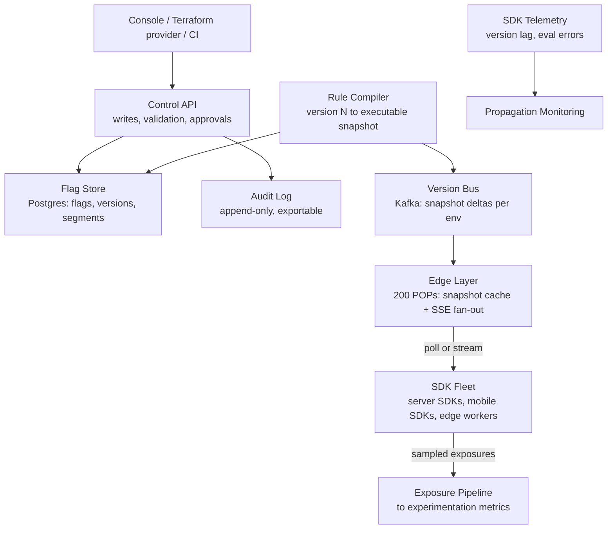
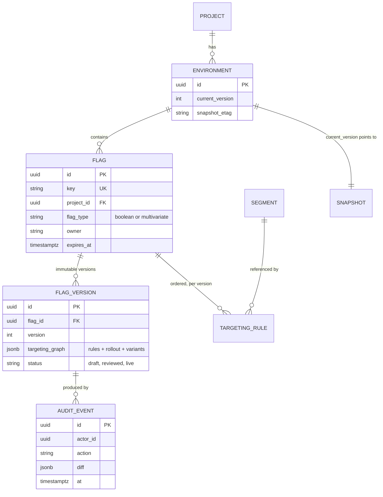
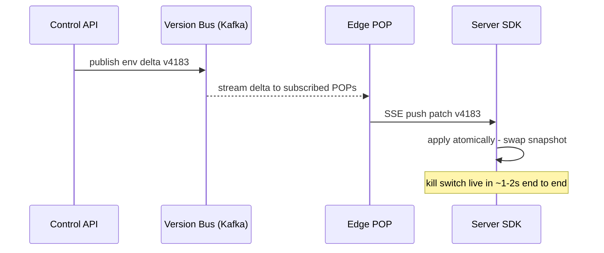
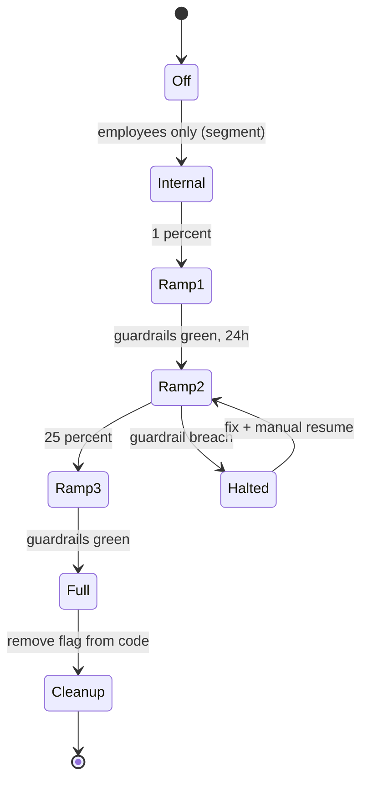

# Case Study: Design a Feature Flag Service (10M Evaluations/sec)

## Overview

"Design LaunchDarkly" or "build the flag infrastructure for 200 microservices and 50M SDK instances" looks like a CRUD app until you multiply: every request in every service, on every device, evaluates dozens of flags, so the evaluation plane sits on the hottest path in the company — and the control plane carries the compliance burden of who can change production behavior. This walkthrough designs the full machine: the flag data model and versioning, the targeting-rule DSL, local-SDK evaluation at 10M RPS, rule propagation via push vs poll, gradual rollouts with guardrail metrics, kill switches, and the audit trail. The toggle *concepts* (flag types, anti-patterns, cleanup) live in [Feature Flags](../../../sre/feature-flags.md); the *statistical* side of experiments (assignment validity, SRM, CUPED) lives in [Experimentation Platform](../real-world/experimentation-platform.md). This page designs the delivery and evaluation infrastructure both of them assume.

## Step 1 — Requirements

### Functional

- Users (developers, PMs) create **flags** with a key, description, owner, tags, and expiry; flags are per-**environment** (dev/staging/prod) and per-**project**
- Two evaluation shapes: **boolean** (on/off) and **multivariate** (variants `control | treatment_a | treatment_b`, each optionally carrying a config payload)
- **Targeting rules**: match on user attributes (country, plan, app_version, arbitrary custom keys) with operators (in, not-in, starts-with, semver-compare, regex); ordered rules, first match wins; fall through to a percentage rollout, then to a default
- **Segments**: named, reusable user sets (beta-testers, enterprise) referenced by many flags
- **Gradual rollout**: deterministic percentage buckets with a ramp schedule (1% → 5% → 25% → 50% → 100%) and stickiness guarantees (a user in the 1% stays in at 25%)
- **Kill switch**: any flag can be forced off globally in ≤5 s without touching the targeting graph
- **Audit log**: immutable record of every change — who, what, when, old value, new value, approval state
- SDKs for server (long-lived, streaming), mobile (poll on foreground), and edge/CDN workers; evaluation context (user, request) supplied by the caller

### Non-Functional

- **Scale**: 10M flag evaluations/s across 50K SDK instances and 200 services — but *zero* synchronous evaluation calls to the service; evaluation is local
- **Local eval latency**: p99 < 1 ms in-process (this is why it's local); API eval path (mobile fallback) p99 < 50 ms
- **Propagation staleness budget**: kill switches ≤5 s p99, rollout changes ≤30 s p99, experiment config ≤5 min (full table in Deep Dive 3)
- **Availability**: evaluation never depends on the control plane — SDKs serve from the last snapshot indefinitely (degraded = stale, not down)
- **Correctness**: same context + same flag version ⇒ same result, everywhere (deterministic bucketing); no flag change is ever lost or partially applied (atomic snapshot versions)
- **Audit/compliance**: every production change attributable, approval-able, and exportable (SOC 2); no PII in flag data (attribute *names* in rules, hashed user keys in telemetry)

## Step 2 — Back-of-Envelope Estimation

| Quantity | Assumption | Result |
|---|---|---|
| Evaluation load | 10M evals/s, all local | 0 RPS to the service — the point of the design |
| SDK population | 50K server instances + 50M mobile/edge devices | Two propagation tiers with different budgets |
| Server snapshot pulls | 50K instances poll every 30 s (or SSE-connected) | ~1.7K RPS steady; SSE replaces this with 50K long-lived connections |
| Snapshot size | 2K active flags/env, avg 1.5 KB compiled rules | ~3 MB raw → ~400 KB gzipped per environment |
| Edge fan-out | Snapshot cached at 200 CDN POPs, hit ratio >99% | Origin sees ~50–500 RPS for pulls; mobile appends on foreground |
| Control-plane writes | 200 flag edits/day, 2K automated rule-matrix syncs/day | Trivial TPS, but every write is a versioned, auditable transaction |
| Audit volume | Every change + every eval *sampling* (~0.1%) | ~5K audit rows/day; eval telemetry sampled to the analytics pipeline |
| Exposures | 1% sampled eval exposures → experimentation pipeline | ~100K events/s peak — see [Log Analytics](./log-analytics.md) |

The insight to state: this is a **read-heavy config distribution system** wearing a product costume. The hard numbers are all about snapshot size and propagation delay, not QPS on the write path — the write path is tiny but must be *bulletproof* (atomic versions, audit, approvals).

## Step 3 — API Sketch

Control plane (REST, human/CI traffic, all writes versioned and audited):

```text
POST   /v2/projects/{p}/envs/{e}/flags          { key, name, variants[], default }
PATCH  /v2/flags/{key}/targeting                { op, rules[], rollout, comment }
POST   /v2/flags/{key}/killswitch               { off: true, reason }   # the 5s path
GET    /v2/flags/{key}/versions                 → immutable version history
POST   /v2/flags/{key}/versions/{v}/approve     { approver }            # 2-person rule
GET    /v2/audit?env=prod&since=...             → change log export
```

Data plane (what SDKs speak — deliberately dumb and cacheable):

```text
GET  /sdk/snapshot?env=prod&v=4182       → full compiled snapshot (gzip), CDN-cached
GET  /sdk/snapshot?env=prod&since=4182   → delta patch (302/empty if current)
GET  /sdk/stream  (SSE)                  → { "patch": {...}, "version": 4183 }
POST /v2/eval/evaluations                → batch eval API (mobile fallback, server-side eval only)
```

SDK surface (the contract that makes local evaluation possible):

```python
ctx = Context(user_id="u9281", country="de", plan="pro", app_version="7.4.1")
variant = client.variation("checkout-flow-v2", ctx, default="control")
value   = client.json_variation("search-ranking-params", ctx, default={})  # config payload
```

## Step 4 — High-Level Architecture



- **Control API**: the only writer. Every mutation produces a new immutable **flag version** (targeting graph serialized as JSON); publication advances the environment's `current_version` pointer in one transaction. Two flags changing concurrently never produce a half-applied snapshot
- **Rule compiler**: takes the version's JSON rules, validates (unknown operators, cyclic segment refs, regex complexity), compiles to the SDK-ready snapshot, and publishes a delta. Compilation is the gate that keeps the evaluation plane dumb and safe
- **Version bus**: Kafka topic per environment carrying deltas in order — the propagation spine. SSE edge nodes and webhook consumers replay by version number, which makes delivery gap-free and idempotent
- **Edge layer**: snapshot GETs are CDN-cacheable (`stale-while-revalidate: 60`); SSE connections per POP subscribe to the env topic. Mobile SDKs poll on app foreground and are served from the CDN, never from origin
- **Exposure pipeline**: SDKs emit sampled evaluation records (flag key, version, variant, bucketing key, timestamp) — the experimentation platform's assignment log (see [Experimentation Platform](../real-world/experimentation-platform.md))

## Step 5 — Data Model



Design points worth making explicitly:

- **Immutable versions + a pointer** (the same event-sourcing discipline as [Event Sourcing](../../../backend/patterns/event-sourcing-deep.md)): evaluation correctness is easy when snapshots can't mutate; rollbacks are pointer moves; audit is a byproduct. Mutating rows in place is the classic mistake — it makes "what was live at 14:03?" unanswerable
- **The targeting graph is data, not code**: `rules: [{attribute, op, values, then}]` stored as JSONB, compiled per version. Anything expressed as a deployed-code path (a lambda per rule) breaks auditability and the SDK snapshot model
- **`expires_at` on every flag**: the enforcement hook for flag-sprawl cleanup — expired release flags page their owner (the registry pattern from [Feature Flags](../../../sre/feature-flags.md), made structural)

## Deep Dive 1 — Evaluation Semantics and Deterministic Bucketing

Evaluation order (SDK, per flag):

1. If flag absent from snapshot → return **default** (type-safe fallback) + emit eval error metric
2. If kill-switched → return the **off variant** immediately (short-circuit; no rule execution)
3. Walk ordered rules: first matching rule returns its variant (rules may reference segments)
4. No rule matched → percentage rollout on the fallthrough, else the default variant

The percentage rollout must be **deterministic and sticky**:

```python
def bucket(flag_key, salt, user_key, total_shards=10000):
    # salted per flag: uncorrelated assignments across flags,
    # sticky per user: same user, same version, same bucket forever
    h = xxhash64(f"{flag_key}.{salt}.{user_key}")
    return h % total_shards

def in_rollout(flag_key, salt, user_key, percentage):
    return bucket(flag_key, salt, user_key) < percentage * 100  # 10k shards
```

- **Salt per flag, not global**: a global hash means a user is "in the first 25%" of *every* flag simultaneously — correlated assignment quietly biases experiments (the assignment-validity concern from the experimentation platform)
- **10K buckets instead of 100**: moving 1% → 2% changes which users are in; fine. But 49% → 50% on a 100-bucket scheme can flip half the treated users mid-experiment; fine-grained buckets keep ramps monotone — each increment only *adds* users
- **Stickiness contract**: bucketing depends only on `(flag_key, salt, user_key)` — never on time, IP, or a load-balanced upstream. The same user gets the same variant on every server, in every region, across restarts
- **Multivariate weights** use the same shard space with contiguous ranges (`control: 0–7999, treatment: 8000–9999`), so weight changes degrade predictably and exposures stay consistent with what the pipeline counted

**What the interviewer is probing:** whether you know that "hash the user id, mod 100" is 90% of the answer and the remaining 10% — salt independence, bucket granularity, default-on-miss — is where correctness leaks.

## Deep Dive 2 — Targeting Rule DSL

A rule is a predicate over the evaluation context, serialized as versioned JSON:

```json
{
  "rollout": { "buckets": 10000, "salt": "v2" },
  "rules": [
    { "ref": "beta-testers", "then": "treatment" },
    { "attribute": "country", "op": "in", "values": ["us", "ca"], "then": "control" },
    { "attribute": "app_version", "op": "semver_lt", "values": ["7.4.0"],
      "then": "legacy" },
    { "attribute": "plan", "op": "in", "values": ["enterprise"], "then": "treatment" }
  ],
  "fallthrough": { "percentage": 25, "on": "treatment", "else": "control" }
}
```

DSL constraints that keep evaluation cheap and safe at 10M RPS:

- **Bounded operator set** (in, not-in, prefix, suffix, semver-compare, regex, is-one-of-segment) — user-supplied predicates (arbitrary JS eval) are a code-execution and DoS hole, and cannot be compiled into an SDK snapshot
- **Regex allow-listing**: each pattern is compiled once at snapshot-build time with a complexity cap (length, no nested quantifiers); ReDoS-prone patterns are rejected at compile time, not discovered at p99
- **Segment references are resolved at compile time**: the snapshot inlines the segment membership (or a compact hash-set filter), so evaluation never makes a lookup; cyclic segment references are a compile error
- **Cost is O(rules per flag)**, and rules per flag is capped (e.g., 100) — with 50 flags evaluated per request, worst case is a few thousand string comparisons per request, microseconds in practice
- **No context mutations, no side effects**: the DSL is a pure function of `(snapshot, context)` — the property that makes evaluation trivially cacheable and replayable

| Rule mechanism | Compile-time cost | Eval cost | Danger if naive |
|---|---|---|---|
| Attribute operator | Validation only | µs | Unbounded ops → DoS |
| Segment ref | Inlined membership | µs (hash lookup) | Runtime join → latency + leak of PII |
| Regex | Compiled + capped | µs | ReDoS at eval time |
| User-supplied code | Impossible in SDK model | — | Code execution, no audit trail |

## Deep Dive 3 — Evaluation at 10M RPS: Push, Poll, and the Staleness Budget

The core move: **evaluation is local; the service only distributes snapshots.** A server SDK holds the full compiled snapshot in memory and answers `variation()` in microseconds — no network on the eval path, ever. Everything else is a cache-coherence problem: how fast can a change in Postgres reach 50K in-memory copies?



Propagation mechanisms and when each is right:

| Mechanism | Freshness | Cost at 50K instances | Failure mode | Used for |
|---|---|---|---|---|
| **SSE/WebSocket push** (server SDKs) | ~1–3 s p99 | 50K long-lived conns, cheap fan-out per POP | Connection drop → resync by version | Rollouts, kill switches |
| **Webhook to edge workers** (CDN/edge SDKs) | ~1–5 s | Push per POP, not per instance | Webhook retries; must be idempotent | Edge/CDN-evaluated flags |
| **Long-poll with version cursor** | ~30 s | 1.7K RPS steady, CDN-absorbed | Stampede on new version → jitter the poll interval | Mobile foreground, server fallback |
| **Scheduled full pull** | ~5 min | ~280 RPS, fully cacheable | Largest window of staleness | Config-payload flags, batch jobs |

The **staleness budget table** — state it as a product decision, not an accident:

| Change class | Budget (p99) | Mechanism | Why |
|---|---|---|---|
| Kill switch / incident flag | ≤5 s | SSE push + `POST /killswitch` bypassing batch | Money-losing or page-causing feature must die now |
| Rollout percentage change | ≤30 s | SSE push | Progression gates and guardrail reactions act on fresh data |
| Experiment variant config | ≤5 min | Poll/long-poll | Statistical pipelines are hourly; 5-min skew is noise |
| Non-urgent config payload | ≤15 min | Scheduled pull | Bandwidth and battery on mobile matter more |

Coherence mechanics:

- Every delta carries the **monotone version number**; an SDK that sees v4185 then v4183 (out-of-order reconnect) applies idempotently and re-syncs on gap — snapshot distribution is a tiny versioned KV log, so the machinery is the same class as config propagation anywhere
- **Thundering herd control**: poll intervals are jittered ±20%; a new snapshot is served `stale-while-revalidate` so the origin never sees 50K simultaneous misses; SSE reconnects use exponential backoff with the version cursor in the reconnect request
- **Degraded mode is defined**: if the edge is unreachable, SDKs keep the last snapshot forever and mark evaluations `stale` in telemetry. A flag service outage degrades *freshness*, never *availability* — say this sentence explicitly; it is the single most important property of the design
- **Kill switches get a dedicated path**: the `killswitch` write skips approval queues, is published with high priority, and SDKs treat `off` as the default-on-error answer. The kill switch is tested (game-day) like a fire alarm, because an untested kill switch is a rumor, not a control

**What the interviewer is probing:** whether you treat "the flag service is down" as a page or a shrug — and whether you can defend the staleness numbers per change class.

## Deep Dive 4 — Gradual Rollouts, Guardrail Metrics, and Auto-Halt

A rollout is a state machine with automated tripwires, not a human clicking 25%:



- **Guardrail metrics** are pre-registered *before* the ramp starts: service-level (p99 latency, error rate of the calls behind the flag), product-level (checkout conversion, session length), and platform-level (crash rate on mobile). Registration matters: metrics added after seeing the data are storytelling, not guardrails
- **Auto-halt contract**: when a guardrail breaches its threshold (e.g., error rate of flag-guarded calls > baseline + 2σ sustained 5 min), the platform flips the flag's kill switch and pages the owner — human reaction time is the p99, so automation is the only honest ≤5 s story. Halt is conservative by design: false alarms cost a ramp step; missed regressions cost customers
- **Interaction with canary deploys**: flags control behavior *within* a deployed version; canaries control the deployment itself (see [Canary Releases](../../../sre/canary-releases.md) — the pattern is the same as the MLOps counterpart in [Shadow Deployments](../../../ml/mlops/shadow.md), where the new path receives traffic but its outcomes are not user-visible yet)
- **Ramp math**: at 1% of 50M users you get ~500K treated users/day — enough for a crash-rate signal (rare events) but too small for conversion metrics; the ramp schedule is therefore metric-dependent and stated per flag (rare-event metrics ramp first, survey-slow metrics ramp last)
- **Cleanup is part of the workflow**: after Full, the flag gets an expiry warning; the flag-removal PR is opened automatically against the code repo (the SDKs can emit the list of `stale` flag keys found by static analysis — the anti-sprawl loop from [Feature Flags](../../../sre/feature-flags.md), automated)

## Deep Dive 5 — Audit, Compliance, and Multi-Tenancy

- **Immutable audit log**: every write produces an audit event (`actor, action, diff, comment, approvals, timestamp`) in an append-only store, exported hourly to the compliance warehouse. Post-incident, the question "which flags changed in the last 24 h?" must be a query, not an archaeology project — the audit log is the flag system's [Case Study: Log Analytics](./log-analytics.md) counterpart
- **Two-person rule on production**: targeting changes to prod require review (or are limited to a pre-approved op-flag allowlist); the API enforces status transitions (`draft → reviewed → live`); CI/Terraform changes carry the PR URL in the audit comment
- **No PII in flag data**: targeting rules contain attribute *names* and segment *definitions*, never user rows; SDK telemetry sends the **hashed bucketing key** (a keyed hash, rotated per environment), not the raw user id. GDPR deletion then needs no flag-system participation — the hash is not linkable
- **RBAC per project/environment**: a developer can flip flags in staging freely; prod targeting requires the `flag-admin` role; segments owned by one team cannot be mutated by another team's flags without an explicit grant — multi-tenancy here is authorization, not throughput
- **Change-limiting as abuse control**: a rogue or buggy automation flipping 500 flags/hour is an incident generator; per-actor rate limits on the control API (the same vocabulary as [Rate Limiter](../rate-limiter.md)) plus change-burst alerting keep the audit log meaningful

## Bottlenecks & Follow-Up Questions

- **Snapshot bloat**: 2K flags ≈ 400 KB gzipped is fine; 20K flags × verbose rules ≈ multi-MB snapshots that slow mobile cold-starts. Follow-ups: per-service flag scoping (SDK subscribes to a namespace, not the whole env), delta-only delivery, and gzip/zstd at the edge
- **Rule evaluation is not the bottleneck — distribution is**: the 10M evals/s are absorbed by 50K processes; the system's real ceiling is SSE fan-out per POP and Kafka throughput. Follow-up: shard the env topic per namespace if one env exceeds ~50 MB/s of deltas
- **Correlated assignments between flags and experiments**: shared salts or shared bucketing keys make "flag treatment" and "experiment treatment" co-occur, biasing both. Follow-up: the layered/mutually-exclusive experiment model owned by the experimentation platform; flags consume its layer assignment
- **SDK drift**: old SDK versions that can't parse new rule operators. Follow-up: compiler refuses operators below the env's minimum SDK version; telemetry tracks SDK-version histogram per service so compiler capability gating has real data
- **Eval exposure volume**: full-fidelity exposure logging is 10M events/s of Kafka traffic. Follow-up: sample (1%), dedupe per (user, flag, version) in the SDK, and rely on the experimentation platform's variance-reduction rather than raw volume
- **Mobile offline users**: no foreground for weeks means weeks-old flags. Follow-up: critical flags ride app-config responses on any API call; push notifications (silent) force a foreground refresh for incident-class changes

## Interview Questions

1. **Why local SDK evaluation instead of calling the flag service per request?** At 10M evals/s the flag service would need to be the most available system in the company — for a lookup that is pure computation over ~3 KB of data. Local evaluation makes the eval path microseconds, removes a dependency from every request, and converts the hard problem into config distribution with a defined staleness budget. The trade is snapshot size and eventual consistency, which is exactly what the budget table governs. Any design that puts the flag service on the synchronous request path fails the availability requirement by construction.
2. **A flag change must reach every server in under 5 seconds. Walk the path and its failure modes.** Control API appends a new version, the compiler publishes a delta to the per-env Kafka topic, edge POPs subscribed over SSE push it to connected SDKs, and the SDK atomically swaps its snapshot — roughly 1–3 s. Failure modes and answers: SDK disconnected → reconnects with its version cursor and re-syncs (gap-free because versions are monotone); POP partitioned → SDKs keep serving stale (budget breach, alert on version-lag telemetry); SDK wedged → version-lag metric pages before the staleness SLO burns. The kill-switch write skips approval and batching because it is the one path with an incident-page budget.
3. **How do percentage rollouts stay deterministic and why does bucket granularity matter?** Bucketing is `hash(flag_key, salt, user_key) mod 10000 < percentage × 100`: deterministic (same input, same result, anywhere), sticky (no time or upstream involvement), and uncorrelated across flags because the salt is per-flag. With only 100 buckets, moving 49% → 50% reassigns roughly half the treated population mid-experiment; with 10K buckets each increment only adds users. Fine granularity also lets the ramp schedule make small, measurable steps where rare-event guardrails are noisy.
4. **What makes the targeting DSL safe to execute 10M times a second inside customers' processes?** It is a bounded operator set over typed attributes, compiled — not interpreted — at snapshot-build time: regexes are complexity-capped at compile time (ReDoS rejected before deployment), segment references are inlined (no runtime lookups, no PII joins), per-flag rule counts are capped, and evaluation is a pure function of (snapshot, context) with no I/O and no user-supplied code. Anything that needs general computation is the wrong abstraction — it belongs in the application behind a boolean flag, not in the DSL.
5. **How do feature flags and the experimentation platform relate without stepping on each other?** Flags are the delivery mechanism; the experimentation platform owns assignment validity and analysis. The interface is the exposure event: the SDK logs (flag, version, variant, hashed key) sampled, and the platform's metrics pipeline consumes them. Assignment collisions are avoided by giving experiments layered, mutually-exclusive bucketing that flags respect; guardrail auto-halt writes to the flag's kill switch, closing the loop from metric breach to production behavior change in seconds. Conflating the two (doing stats inside the flag service) is the common junior mistake.
6. **A postmortem needs "who changed what in prod flags in the last 24 hours." What did your design already guarantee?** Every mutation created an immutable flag version plus an audit event (actor, diff, comment, approvals) in an append-only log, exported to the compliance warehouse hourly; versions are pointer-selected so the exact live snapshot at any timestamp is reconstructible; prod writes enforced the two-person rule and carry PR/CI provenance. The postmortem is a query with a 24 h window — and because versions are immutable, no later change can have falsified it.

## Key Takeaways

- A flag service is a read-heavy config-distribution system: 10M evals/s are absorbed locally by SDKs; the design problem is snapshot size and propagation latency, never eval QPS
- Immutable flag versions + a current-version pointer give correctness, rollback, and audit from one mechanism; mutating flag rows in place forfeits all three
- Propagation is tiered by staleness budget: SSE push (≤5 s) for kill switches and rollouts, long-poll/CDN (≤5 min) for experiment config; "down = stale, not down" is the availability contract
- Deterministic bucketing needs per-flag salt, fine-grained buckets, and no environmental inputs — otherwise rollouts leak correlation into every experiment that shares the machinery
- Guardrail metrics are pre-registered and auto-halt is automated because the honest ≤5 s reaction to a breach cannot be a human's
- Compliance is structural: append-only audit log, two-person prod writes, hashed bucketing keys instead of PII, RBAC per environment

## References

- LaunchDarkly documentation — SDK architecture, streaming vs polling evaluation model: https://docs.launchdarkly.com/
- Unleash documentation — self-hosted flag service, strategy-based targeting, SDK edge mode: https://docs.getunleash.io/
- Flipt documentation — open-source flag evaluation engine, snapshot-based evaluation: https://www.flipt.io/docs
- OpenFeature specification — vendor-neutral flag evaluation API and provider contract: https://openfeature.dev/specification/
- P. Hodgson, "Feature Toggles (aka Feature Flags)" — toggle taxonomy (release, experiment, ops, permission) and management practices: https://martinfowler.com/articles/feature-toggles.html
- D. Tang et al., "Overlapping Experiment Infrastructure: More, Better, Faster Experimentation," KDD 2010 — layered assignment and the flag/experiment boundary: https://research.google.com/pubs/archive/36500.pdf
- C. Tang et al., "Holistic Configuration Management at Facebook," SOSP 2015 — Gatekeeper: gating config distribution at planetary scale (cited by title + venue; no stable public URL used here)
- Apache Kafka documentation — the versioned delta bus used for snapshot propagation: https://kafka.apache.org/documentation/

## Cross-References

- [Feature Flags (Feature Toggles)](../../../sre/feature-flags.md) — toggle types, anti-patterns, and cleanup discipline this service enforces structurally
- [Experimentation Platform](../real-world/experimentation-platform.md) — the assignment/metrics infrastructure consuming this system's exposure log
- [A/B Testing Design for ML](../../../ml/mlops/ab-testing.md) — the statistical machinery the guardrails and rollouts defer to
- [Consistency Patterns](../consistency-patterns.md) — eventual consistency vocabulary behind the staleness budget
- [Rate Limiter](../rate-limiter.md) — control-plane change-rate and abuse limits
- [Case Study: Log Analytics](./log-analytics.md) — where exposure and audit events land and how they're queried
- [Graceful Degradation](../../../backend/patterns/graceful-degradation.md) — kill switches as a degradation mechanism, not a convenience
- [Case Study: CI/CD System](./ci-cd-system.md) — deployment decoupling and the flag-removal automation loop
