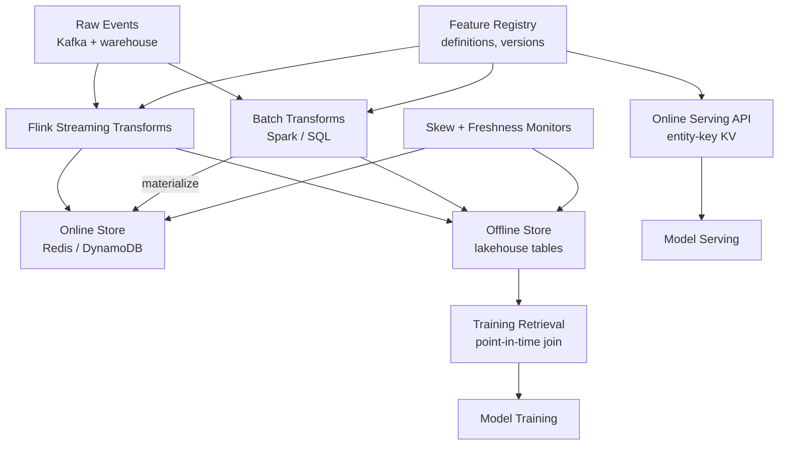
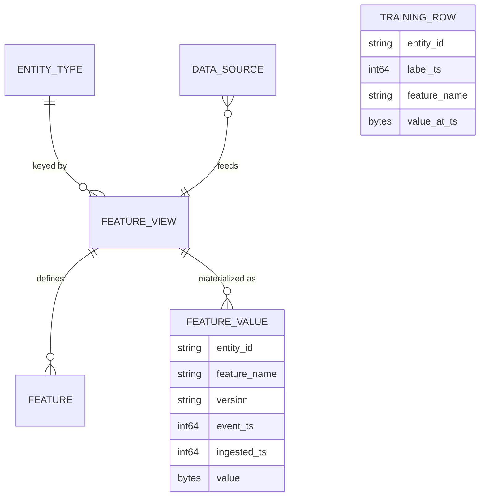
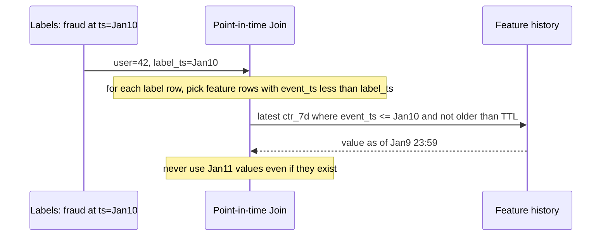
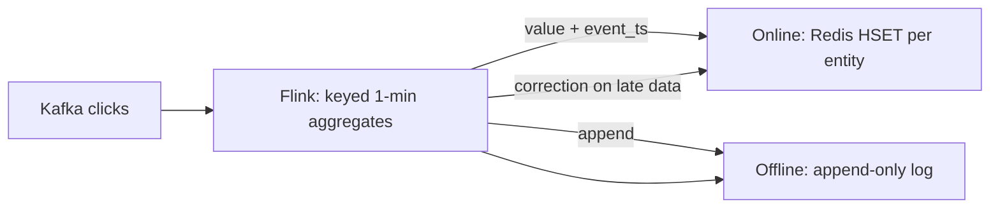

# Case Study: Design an ML Feature Store

## Overview

A feature store is the data infrastructure behind every production ML system: it turns raw events into versioned, reusable features and guarantees the same values a model saw in training are the ones it sees online — at 10 ms latency and millions of lookups per second. This walkthrough designs one in the 45-minute format: the offline/online duality, **point-in-time correctness** (the interview's favorite trap), the entity-keyed online KV store, streaming transforms, and training-serving skew detection. For the concept-level treatment and tool syntax, see [Feature Store Design](../../../ml/system-design/feature-store.md); this page builds the system and defends the trade-offs, in the style of Feast and Tecton ([Feast docs](https://docs.feast.dev/)).

## Step 1 — Requirements

### Functional

- **Define features** declaratively: transformation code + data source + entity (user, item, session) + TTL
- **Materialize**: batch (nightly Spark/warehouse) and streaming (Flink) computation into both stores
- **Training retrieval**: point-in-time correct feature vectors for arbitrary entity/event DataFrames
- **Online serving**: `get_online_features(entity_key, feature_refs)` at p99 < 10 ms
- **Monitoring**: feature freshness, null rates, distribution drift between training and serving

### Non-Functional

- **Scale**: 100M entities, 5K feature definitions, online 50K lookups/s (10 features per lookup = 500K feature reads/s), p99 < 10 ms
- **Offline**: training jobs scan 10–100 TB of feature history; backfills recompute months of features
- **Freshness tiers**: batch features ≤ 24 h stale; streaming features ≤ 1 min
- **Consistency contract**: online values must be a *subset* of what point-in-time training retrieval would have returned — the duality guarantee
- **Isolation**: one team's backfill must not corrupt another team's serving values (versioned feature views)

## Step 2 — Back-of-Envelope Estimation

| Quantity | Assumption | Result |
|---|---|---|
| Online reads | 50K lookups/s × 10 features | 500K KV reads/s — Redis-class, sharded by entity |
| Online writes | 5K updated features/entity-batch/s | ~5M writes/s across 5K features → batch pipelines |
| Streaming features | 2K streaming features, event rate 1M/s | Flink state ~50 GB, dual-write to both stores |
| Offline storage | 100M entities × 5K features × 90-day history | Too big to materialize fully → compute-on-read + materialized hot subset |
| Training retrieval | 1B-row entity DF × 50 features | Point-in-time join is the bottleneck: per-entity as-of merge |
| Online KV size | Hot features only (TTL-trimmed) | 100M × 200 features × 20 B ≈ 400 GB — fits a Redis/DynamoDB cluster |

The framing that lands: **online is small and hot, offline is huge and lazy**. The store's job is keeping the two honest copies of *the same logic*, not the same bytes.

## Step 3 — API Sketch

```python
# Definition (control plane)
@feature_view(entities=[user_id], source=stream("clicks"), ttl=timedelta(days=7))
def user_ctr_7d(df):
    return df.group_by("user_id").agg(
        clicks_7d=("click", "sum"),
        ctr_7d=("clicked", "mean"))

# Training (offline)
training_df = store.get_historical_features(
    entity_df=labels_df,                 # entity_id + event_timestamp
    features=["user_ctr_7d:ctr_7d", "item_emb:v1"],
).to_df()                                # point-in-time correct join

# Serving (online)
vec = store.get_online_features(
    features=["user_ctr_7d:ctr_7d", "item_emb:v1"],
    entity_rows=[{"user_id": 42}],
).to_dict()                              # <10 ms
```

Key API decision: **feature references are versioned** (`item_emb:v1`) — models pin versions so a teammate's "improvement" cannot silently change serving inputs (see [Model Serving](../../../ml/system-design/model-serving.md) for the consumer side).

## Step 4 — High-Level Architecture



- **Registry** is the control plane: every feature view, its code, source, TTL, and owner — no orphan transformations
- **Two stores, one logic**: transformations run in the same (or provably equivalent) engine for batch and streaming; materialization jobs push batch features into online storage
- **Monitors** compare the two stores continuously (Deep Dive 4)

## Step 5 — Data Model



Offline values are an **event-sourced table**: `(entity, feature, version, event_ts, ingested_ts, value)` — appended, never updated. The online store is the *latest event_ts value per (entity, feature, version)*, TTL-trimmed. This is the same dual-representation pattern as the billing ledger in [Real-World: Billing & Metering](../real-world/billing-metering.md): append log + projection.

## Deep Dive 1 — Offline/Online Duality

The promise: the model's serving inputs are drawn from the same population the training rows came from. The mechanisms:

- **One definition, two engines**: the transformation is defined once; batch runs on the warehouse, streaming runs on Flink. Duality breaks when the two engines disagree (different windowing semantics, different null handling) — so the store's contract is *sementic equivalence tests*: replay a window through both engines and diff
- **Materialization pushes batch → online** for features that don't need sub-minute freshness; streaming features write both paths directly (dual-write with the event log as source of truth)
- **On-demand transformations** (computed at request time from online features, e.g., `clicks_7d / views_7d`) must be *deterministic and pure* — they're computed identically in training retrieval, otherwise you've invented skew
- **TTLs are honesty**: a feature older than its TTL returns null online — a stale feature is worse than a missing one, because the model can't tell

| Feature class | Source | Freshness | Store write path |
|---|---|---|---|
| Entity profile (age, plan) | Warehouse | 24 h | Batch materialize |
| Behavioral aggregates (ctr_7d) | Stream | 1 min | Flink dual-write |
| On-demand ratios | Request-time | 0 | Computed identically in retrieval |
| Embeddings (item, user) | Batch ML jobs | 24 h | Batch materialize, versioned |

**What the interviewer is probing:** whether "offline/online" means two codebases to you. The correct answer is one definition + equivalence testing, and the admission that dual-engine drift is the #1 operational bug in real feature stores.

## Deep Dive 2 — Point-in-Time Correctness (Avoiding Leakage)

The trap: joining features to labels using *today's* values. A fraud model trained with `user_ctr_7d` computed as of *now* has seen the future — it will ace offline evaluation and fail in production (data leakage).



Implementation notes to present:

- **Per-entity as-of join**: for each label row, select the latest feature row with `event_ts ≤ label_ts` (and within TTL). On a 1B-row training set this is a sorted merge per entity — the classic "point-in-time join" that Feast and Tecton implement; naive SQL joins are quadratic or wrong
- **Ingestion-time vs event-time**: two clocks exist; training retrieval keys on `event_ts`, but late-arriving data means a value "known at T" may have landed at T+4 h. Backfill/leakage purists use *availability time* (`ingested_ts + materialization lag`) — know both, say when each matters
- **Leakage audit**: any feature whose offline AUC dramatically exceeds online lift is guilty until proven innocent; the fix is retrieval-side, not model-side
- **Entity_df contract**: labels carry `(entity_id, event_timestamp)`; the API *refuses* label frames without timestamps — making leakage a type error, not a discipline

**What the interviewer is probing:** this is the single most-asked feature-store question. Answer with the as-of join mechanics and the two-clocks subtlety, not the buzzword.

## Deep Dive 3 — Streaming Transforms and the Online Store

Streaming features (1-min aggregates) flow Flink → both stores:

- **Flink job**: keyed by entity, windowed aggregates, emitting `(entity, feature, value, event_ts)`; state ~50 GB keyed by entity — RocksDB backend, checkpointed
- **Online store layout**: Redis hash per entity with field-per-feature (`HSET user:42 ctr_7d "0.31" ctr_7d_ts ...`), or DynamoDB item-per-entity. Reads are one `HGETALL`-style call for 10 features — the design keeps p99 < 10 ms at 500K reads/s
- **Sharding**: entity_id hash → Redis cluster shards; hot entities (power users) are the skew risk — replicate hot keys or accept slightly stale cached copies
- **Late data and watermarks**: a 1-min window that closes then receives late events emits a correction; the online store overwrites (last-write-wins by event_ts), the offline log appends both — training retrieval must pick by availability semantics from Deep Dive 2
- **Failure story**: Flink checkpoint + replay from Kafka rebuilds streaming features; batch materialization rebuilds online state for batch features — the stores are caches of deterministic pipelines, which is what makes them safe to lose (see [Stream Processing](../../../data-engineering/stream-processing.md))



## Deep Dive 4 — Training-Serving Skew Checks

Skew = the online distribution differs from training's. Three detection layers:

1. **Schema/value checks**: same feature name, same dtype, same null semantics; a `v2` serving where training used `v1` is caught by version pinning in the registry
2. **Distribution drift**: per-feature PSI/KL between training snapshots and rolling online samples; a paging threshold on PSI > 0.2 for key features (see [Feature Engineering](../../../ml/foundations/feature-engineering.md))
3. **Duality probes**: replay recent online traffic through the offline retrieval path and diff values — catches dual-engine drift (Flink window vs Spark window) that distribution checks alone would blur
- **Freshness SLAs as alerts**: feature age at read time (event_ts → now) exported as a metric; a stale `ctr_7d` silently zeros model quality — alert on age, not on absence (see [Metrics Monitoring](./metrics-monitoring.md))
- **Feature lineage in the registry**: which model consumed which version when — the audit trail for "our model degraded on Tuesday"

| Skew source | Symptom | Detection | Fix |
|---|---|---|---|
| Dual-engine drift | Flink ≠ Spark on same window | Duality probes | Single transform lib / equivalence tests |
| Version mismatch | Serving v2 vs training v1 | Registry pinning | Block unversioned reads |
| Staleness | Feature age > TTL | Age metric alert | Materialization lag fix |
| Late-data handling | Corrections missing online | Replay diff | Last-write-wins by event_ts, both paths |
| On-demand impurity | Non-deterministic transform | Determinism tests | Pure functions only |

## Feast vs Tecton vs Homegrown

| | Feast (open source) | Tecton (commercial) | Homegrown |
|---|---|---|---|
| Definition | Python feature views | Web + code, strong governance | Ad hoc notebooks (the thing to escape) |
| Streaming support | Push sources, limited | First-class Flink-based | Whatever you build |
| Point-in-time join | Yes (offline retrieval) | Yes + managed backfills | You will write it, and debug it for months |
| Cost | Infra you run | License + managed | Engineering time |
| Fit | Small/mid teams, self-host | Large orgs, compliance needs | Rarely, and only at extreme scale |

The interview stance: the *patterns* above are the product; tools differ in how much of the point-in-time join and dual-write plumbing they operate for you.

## Bottlenecks & Follow-Up Questions

- **Hot entity skew**: one user generates 1% of reads; follow-up: hot-key replication, request coalescing, or accept cache staleness
- **Backfill stampede**: recompute 90 days × 5K features; follow-up: incremental backfills keyed by watermark, priority lanes like the [task scheduler](./distributed-task-scheduler.md), and online-store write throttling
- **Cardinality explosion**: session-level entities × features = billions of KV keys; follow-up: TTL discipline, hot-subset materialization, and only materializing features a *serving* model consumes
- **Cross-entity joins online** (user + item features): two lookups per request; follow-up: co-locate item features by popular-item caching, or precompute interaction features
- **Feature explosion governance**: 5K features and growing; follow-up: registry ownership, usage-based deprecation, and the rule that features without consumers after N months are deleted

## Interview Questions

1. **What is point-in-time correctness, and how do you implement it at scale?** Each training row must see feature values as they existed at the label's timestamp — never later. Implementation: features stored as append-only `(entity, feature, version, event_ts, value)` rows; retrieval does a per-entity as-of merge picking the latest `event_ts ≤ label_ts` within TTL. At 1B rows this is a sorted merge join per entity partition, not a correlated subquery. The API should require label timestamps, making leakage a schema error rather than a review catch.
2. **Why do feature stores have two stores, and how do you keep them from diverging?** Offline is huge and scan-friendly (training, backfills); online is small, hot, and keyed (serving at <10 ms). Divergence is prevented by defining transformations once, running batch and streaming through provably equivalent semantics, materializing batch into online on a schedule, and *testing the duality*: replay online traffic through the offline path and diff. Distribution monitors alone hide engine-level drift; probes catch it.
3. **How do streaming features handle late data without corrupting training?** Both stores receive the correction: online overwrites last-write-wins keyed by event_ts, offline appends both the original and correction rows. Training retrieval then applies availability-time semantics — pick the value that was *retrievable* at label time, not the value that was *true*. This two-clock distinction (event time vs availability time) is the difference between honest backfills and accidental leakage.
4. **Design the online store for 500K feature reads/s at p99 < 10 ms.** Redis-cluster (or DynamoDB) with one hash per entity, field-per-feature, sharded by entity hash so a 10-feature lookup is a single hop. Only materialize features that serving models consume (TTL-trimmed), replicate hot entities, and expose the serving API with per-feature versions so reads are pinned. The KV design borrows directly from caching-strategy practice (see [Caching Strategy](../hld/caching-strategy.md)).
5. **A model's offline AUC is 0.92 but online it's worthless. Where do you look first?** Leakage and skew, in order: features joined without point-in-time discipline (offline sees the future), dual-engine drift (training transform ≠ serving transform), version mismatch, and staleness (online features older than TTL returning nulls). The feature store's monitors — duality probes, PSI drift, freshness age — exist precisely to rank these causes in minutes instead of weeks.
6. **When would you NOT use a feature store?** When one team serves one model from one table with no reuse — the store adds dual-write complexity for zero sharing benefit. The value scales with *number of consumers per feature* and *number of models per team*; below ~3 teams or ~10 models, a well-tested SQL + Redis pattern often beats operating Feast/Tecton. Saying this shows judgment beyond resume-driven architecture.

## Key Takeaways

- The feature store is one definition, two materializations: offline (huge, lazy, scan) and online (small, hot, keyed) — duality is the invariant you test
- Point-in-time correctness = per-entity as-of joins over append-only feature history; require label timestamps in the API so leakage becomes a type error
- Two clocks matter: event time for semantics, availability time for honest backfills and late-data handling
- The online store is a TTL-trimmed projection of materialized features — design it for one-hop entity lookups, not flexibility
- Skew detection is layered: version pinning, distribution drift (PSI), duality probes, and freshness-age alerts
- Feast/Tecton differ in how much plumbing they operate; the interview value is in the patterns — as-of joins, dual-write, equivalence tests — not the tool names

## References

- Feast documentation — open-source feature store concepts and point-in-time retrieval: https://docs.feast.dev/
- Tecton — commercial feature platform (concepts and architecture): https://www.tecton.ai/
- Apache Flink documentation — keyed streams, windows, event time: https://nightlies.apache.org/flink/flink-docs-stable/
- Apache Kafka documentation — the event backbone feeding streaming transforms: https://kafka.apache.org/documentation/
- Debezium documentation — CDC as a data source for entity features: https://debezium.io/documentation/
- Sculley et al., "Hidden Technical Debt in Machine Learning Systems," NeurIPS 2015 — the glue-code/CSE problem feature stores address (cite by title/venue)
- Google SRE books — monitoring the freshness and drift signals: https://sre.google/books/

## Cross-References

- [Feature Store Design](../../../ml/system-design/feature-store.md) — the concept-level companion: dual-store architecture and tool comparison
- [Model Serving](../../../ml/system-design/model-serving.md) — the consumer of `get_online_features`
- [Feature Engineering](../../../ml/foundations/feature-engineering.md) — the transformations this infrastructure runs
- [Case Study: Metrics Monitoring](./metrics-monitoring.md) — freshness and drift monitoring built on the metrics pillar
- [Case Study: Distributed Task Scheduler](./distributed-task-scheduler.md) — backfill and materialization workloads
- [HLD: Caching Strategy](../hld/caching-strategy.md) — the online-store design rules (TTL, hot keys, stampedes)
- [Real-World: Billing & Metering](../real-world/billing-metering.md) — the append-log + projection pattern reused here
