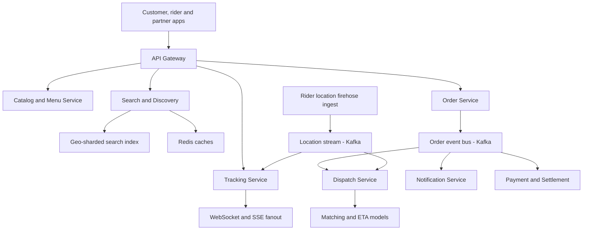
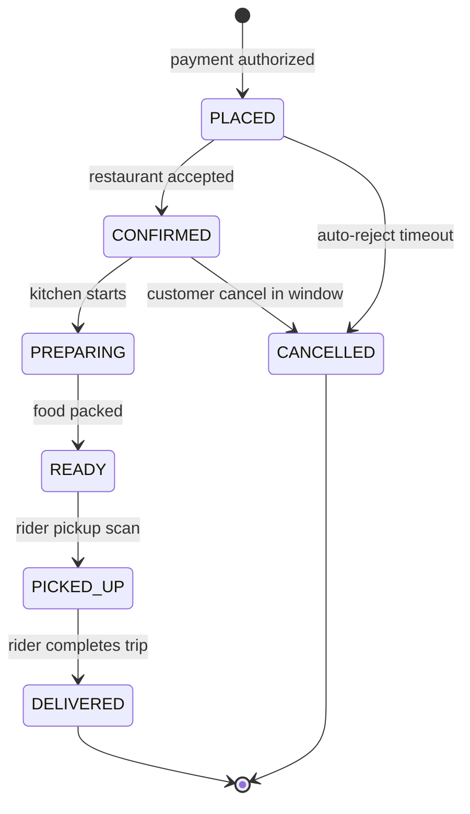
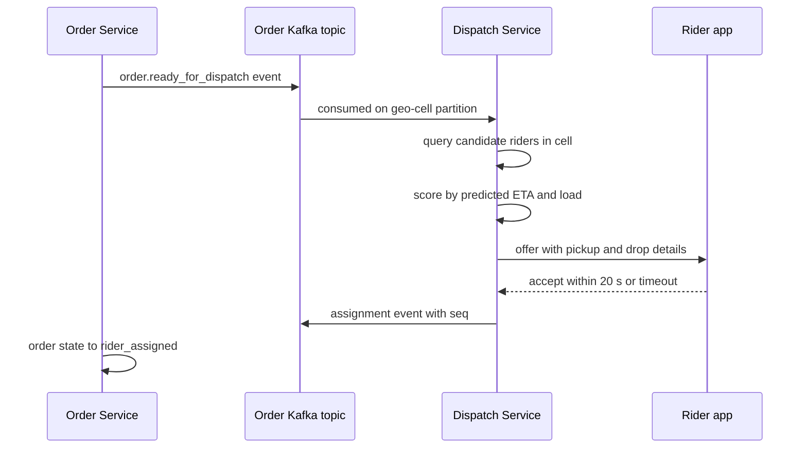

# Case Study: Design a Food Delivery Platform (HLD — Swiggy/Zomato/DoorDash)

## Overview

Food delivery is a three-sided marketplace — customers, restaurants, and riders — where the hard systems problems are **dispatch** (an online assignment problem under a 30–60 s decision SLA), a **rider-location firehose** (hundreds of thousands of moving GPS writes per second), and **live tracking fanout** to millions of watching customers. Publicly reported scale: DoorDash executes ~2B+ orders/year (≈5–6M/day), while Swiggy and Zomato each run on the order of 2M+ orders/day in India, with dinner-hour concurrency 7–10× the daily average. This page is deliberately the **HLD/scale angle**: the low-level class design, state-machine enums, and single-process concurrency for the same product already exist in [LLD: Food Delivery App](../lld/food-delivery.md) — read them as the same problem at different altitudes. It borrows the geo-indexing spine of [Real-World: Ride-Hailing](../real-world/ride-hailing.md) but replaces continuous rides with discrete order hand-offs, which is why its dispatch problem is closer to an auction than to ride matching (see [Case Study: Live Auction Platform](./live-auction.md) for that competitive-load shape).

## Step 1 — Requirements

### Functional

- **Restaurant/catalog**: menus, item availability, prices, veg/non-veg and dietary tags, restaurant open/close state
- **Search & discovery**: query by dish/cuisine/restaurant, ranked by relevance, ETA, distance, rating, and fees; personalized home feed
- **Cart & ordering**: single-restaurant cart, item-level customization, coupons, payment via UPI/cards/wallets
- **Order lifecycle**: restaurant acceptance/rejection, prep tracking, pickup, delivery, cancellation windows
- **Dispatch**: assign riders to orders, with batching (one rider, multiple orders), reassignment, and unassigned-order fallbacks
- **Live tracking**: rider position on a map, ETA countdown, status transitions pushed to the customer
- **Notifications, ratings, reviews, and settlement** of restaurant/rider payouts

### Non-Functional

- **Read-heavy discovery**: 50–100× more browse/search than orders; p99 search < 200 ms
- **Firehose writes**: 300–500K concurrent riders × 1 ping/3–5 s ⇒ ~100K+ location writes/s platform-wide at peak
- **Fanout reads**: ~1M+ concurrent orders × 1–2 watchers × 1 map update/5 s ⇒ ~0.3–0.5M downlink messages/s, coalescable
- **Dispatch latency**: a rider offer must go out within seconds of readiness; total assignment < 60 s including offer timeout
- **ETA honesty**: promised vs actual delivery delta is a product KPI; ETA models feed both UX and dispatch
- **Availability**: discovery may degrade (cached feed), ordering and dispatch must not (money and food in flight)

## Step 2 — Back-of-Envelope Estimation

| Quantity | Assumption | Result |
|---|---|---|
| Orders/day | ~5M/day blended (DoorDash-scale) | ~60 orders/s average |
| Peak factor | 8× at 8 PM dinner window | ~500 orders/s ingress at peak |
| Discovery traffic | 60M MAU, 60 browse events per order | ~30–60K RPS search/catalog reads |
| Rider firehose | 400K active riders × 1 ping/4 s | ~100K writes/s into ingest; Kafka comfortably absorbs (partitioned by geo-cell) |
| Tracking fanout | 1M orders × 1.5 watchers × 1 update/5 s | ~300K msg/s downlink after coalescing (~60 KB/s per 1K watchers raw, far less batched) |
| Catalog size | 200K restaurants × ~50 items | ~10M SKU rows; menu reads are CDN/cache material |
| Dispatch decisions | 500 orders/s × ~10 candidates scored | ~5K score computations/s — trivial CPU, the latency budget is the hard part |

The pattern to verbalize: three different load shapes in one product — **cache-dominated reads** (discovery), **write firehose** (locations), and **latency-critical medium-rate decisions** (dispatch). Each gets a different machine; none gets "one big database".

## Step 3 — API Sketch

```text
GET  /v1/restaurants?lat&lng&radius       → ranked cards (cached per geo-cell)
GET  /v1/restaurants/{id}/menu            → menu with availability flags
POST /v1/cart/validate                    → re-check prices and item availability
POST /v1/orders                           → { order_id, eta_quote, payment_status }
GET  /v1/orders/{id}/track                → { rider_loc, eta_s, state } (or WS/SSE stream)
POST /v1/riders/{id}/location             → internal firehose ingest
POST /v1/riders/{id}/offers/{offer}/accept→ rider accepts or declines assignment
POST /v1/orders/{id}/events               → restaurant/rider state transitions (idempotent)
```

Decisions to call out: order creation is idempotent by client key (a retry must not double-order — see [API Idempotency](../../../backend/api/api-idempotency.md)); `track` exists in both poll and stream flavors because mobile networks drop sockets and polling is the fallback; state transitions arrive as events and must be idempotent at the consumer.

## Step 4 — High-Level Architecture



- **Catalog/Search** are the read plane: geo-sharded Elasticsearch plus Redis per-cell caches; menus are denormalized read models rebuilt from the partner portal's writes
- **Order Service** owns the order state machine (Deep Dive 2) and writes every transition to Kafka — it is the truth, everything else is a projection
- **Dispatch** consumes `ready_for_dispatch` and location streams, runs the assignment loop (Deep Dive 3), and emits assignment events
- **Tracking** subscribes to the location stream and fans out coalesced updates to watchers (Deep Dive 4); **Settlement** consumes completion events for restaurant/rider payouts

## Deep Dive 1 — Restaurant Catalog, Search & Discovery

Discovery is where most engineering hours visibly go wrong in interviews — it is not "one Elasticsearch cluster".

- **Geo-sharding**: restaurants are indexed per H3/GeoHash cell (city → zone → cell); a user query first resolves their cell at zoom-appropriate resolution, then queries that shard. Cross-cell queries (airport borders, cell edges) resolve by querying adjacent cells — H3's hierarchical hexagons make "near me" math honest (https://h3geo.org/)
- **Ranking is a learned function** over candidate features: text/dish relevance, distance, prep-time-derived ETA, rating decay, cuisine diversity, and business-neutral quality signals. Retrieval (cheap filters) is separated from ranking (model scoring on the top few hundred candidates) — the two-stage retrieve-then-rank shape used by every search product
- **Menu availability is hot, tiny, and churny**: item "sold out" flags flip thousands of times per minute platform-wide. Serve menus from a CDN/Redis-backed read model; availability flips propagate as targeted invalidations, and the cart-validate endpoint is the final arbiter — the same "browse cache, claim authoritative" split as [Ticketmaster](./ticketmaster.md)
- **Cache strategy**: per-cell home-feed snapshots with short TTL (60–120 s), user-personalization layered on top, static menu shells with long TTL keyed by menu version. Caching per *geo-cell* rather than per *user* is the move that makes the read plane affordable (see [HLD: Caching Strategy](../hld/caching-strategy.md))

## Step 5 — Data Model

The write-side schema stays relational and boring; every hot read (home feed, tracking, dispatch index) is a derived projection. This is the HLD counterpart of the LLD class diagram — same entities, now partitioned and event-fed.

```sql
CREATE TABLE restaurant (
  id bigint PRIMARY KEY, name text, city_id int,
  lat double precision, lng double precision,
  h3_cell text NOT NULL,               -- denormalized for cell queries
  rating numeric(3,2), is_open boolean NOT NULL,
  menu_version bigint NOT NULL         -- CDN/menu cache busting key
);
CREATE TABLE order (
  id uuid PRIMARY KEY,
  customer_id uuid, restaurant_id bigint, rider_id uuid NULL,
  state text NOT NULL,                 -- state machine value
  eta_quote_s int, placed_at timestamptz,
  amount_paise bigint, idempotency_key uuid UNIQUE
);
CREATE TABLE order_event (             -- event-sourced transitions
  order_id uuid, seq bigint, type text, payload jsonb,
  PRIMARY KEY (order_id, seq)
);
```

Modeling decisions that matter at scale:

- `restaurant.h3_cell` and `order.rider_id` are denormalized deliberately: cell-scoped queries (home feed, rider candidate sets) and order-scoped fanout (tracking) are the two hottest access paths, and neither should join at read time
- `order_event (order_id, seq)` is the ordered timeline every consumer replays; the `order` row is a materialized projection of the latest event, rebuildable at any time — the same log-as-truth stance as the auction room in [live-auction.md](./live-auction.md)
- Ratings, settlement lines, and reviews live in their own stores with their own partitioning; stuffing them into the order row couples write paths that peak at different times
- PII (customer phone, addresses) is isolated in a dedicated service with field-level access control — the marketplace must function for riders and restaurants without exposing it

## Deep Dive 2 — Order Lifecycle State Machine

The LLD page defines the enum; the HLD question is who executes transitions under distribution. The order is an event-sourced aggregate: each transition is an idempotent, ordered event on Kafka, keyed by `order_id`, and every downstream service (dispatch, tracking, settlement, analytics) is a consumer group.



- **Restaurant acceptance has a hard timeout** (~60–120 s): auto-reject with refund keeps the marketplace honest; a "reachable but asleep" restaurant is worse for the product than a fast rejection
- **Cancellation windows shrink as the order progresses**: free before cooking starts, fee after `READY`, impossible after `PICKED_UP` (food is already moving) — encode deadlines per transition in the state machine, not in client logic
- **Idempotent consumers**: a retried `order.picked_up` event must be a no-op the second time; consumers keep `(order_id, event_seq)` dedup state. Ordering per order comes from Kafka partitioning by `order_id` — one partition owns one order's timeline
- **Compensations, not rollbacks**: a post-payment cancel is refund events + inventory-restore events, appended like any other event. This mirrors the saga thinking in [UPI payments](./upi-payments.md): money and food flows converge by compensation, never by distributed rollback

## Deep Dive 3 — Dispatch and Rider Assignment

Dispatch is an **online bipartite assignment problem**: unassigned ready orders on one side, nearby riders on the other, scored by predicted delay. Per-decision, the greedy "nearest rider" is 80% of the value and 5% of the complexity; scale comes from **batching**: collect orders and rider positions in a small window (2–5 s), solve a matching (Hungarian algorithm, \\(O(n^3)\\) on the batch — fine at batch sizes of dozens), or approximate with ML-scored greedy when n is large.



| Strategy | Quality | Compute | Decision latency | Use when |
|---|---|---|---|---|
| Greedy nearest-rider | suboptimal, myopic (ignores rider's next drop) | O(n log n) | < 1 s | baseline, sparse cells |
| Batched matching (Hungarian) | near-optimal global assignment | O(n³) per batch | 2–5 s batch window | default at scale |
| ML scoring + greedy | learns real-world travel/prep times | model inference | < 1 s | production hybrid on top of rules |
| Reassignment / order swap | recovers stuck assignments | event-driven | seconds | post-offer decline cascades |

The subtleties worth naming in an interview:

- **Batching trades seconds for assignment quality**: waiting 3 s collects more co-assignable pairs, which lowers total delivery time by minutes at rush hour — but the wait must be capped and made visible in the ETA quote
- **Batching orders to one rider** (2–3 stops) changes the objective function: minimize *sum of delay to all drops*, not first-leg distance; the rider app sequences stops and the customer ETAs update accordingly
- **ETA prediction feeds assignment**: prep-time models (kitchen load, historical prep by dish, day-of-week), rider travel time (road-network-aware, not straight-line), and current congestion are features; a bad ETA model quietly poisons dispatch because matching optimizes exactly what ETA says
- **Decline handling is the real production problem**: riders decline offers (distance back-home, pay), so every offer has a 15–30 s timeout, an offer-decline model that skips likely decliners, and an escalation path (wider radius, customer-visible "finding a rider" state, finally order cancellation with refund)

## Deep Dive 4 — Live Tracking: The Location Firehose and Geo-Indexing

Rider apps emit GPS every 3–5 s while on-duty. At 400K concurrent riders that is ~100K writes/s — a *firehose*, not a database workload.

- **Ingest**: riders POST batches of pings to edge endpoints; the ingest API validates and produces to Kafka `rider-location` partitioned by **geo-cell** (not rider id), because every consumer of this stream is cell-parallel: dispatch needs riders-in-cell, tracking needs the one rider's line, mapping analytics needs cell aggregates
- **Index**: consumers maintain per-cell rider sets in Redis (GEO structures or H3-keyed sets) refreshed per ping; a dispatch query is then "riders in cell H3:8975 ± neighbors", an O(cells-nearby) lookup rather than a spatial query over a million rows
- **Resolution discipline**: dispatch uses fine cells (resolution 8–9, ≈ hundreds of meters), surge uses coarse cells (resolution 6–7, ≈ kilometers), and analytics aggregates even coarser — one hierarchical index serving three zoom levels is cheaper than three systems (the same trick ride-hailing uses, per [Real-World: Ride-Hailing](../real-world/ride-hailing.md))
- **Downlink fanout**: customer tracking pages subscribe over WebSocket/SSE; the tracking service coalesces per-order updates to ~1 every 5–10 s (customers cannot perceive 1 Hz GPS jitter), and falls back to polling `GET /track` when sockets drop. Slow or expensive consumers get *last-value-wins*, never unbounded queues (see [Backpressure](../backpressure.md))
- **Privacy and lifecycle**: location is collected only during duty windows, retained as coarse history after shift end, and the firehose must handle a rider app killed mid-trip (stale-rider detection: no ping for 30–60 s → mark unavailable for dispatch)

## Deep Dive 5 — Surge, Congestion, and Notifications

Demand spikes (rain, cricket finals, New Year's Eve) break the supply-demand balance that ETAs and dispatch assume. The controls:

- **Cell-level demand forecasting** per time bucket (order volume by cuisine history + weather + events), compared against available rider supply in the same cell
- **Surge fees / rider incentives** applied per H3 cell, not per order: they rebalance supply (riders move toward incentives) and demand (customers defer). Caps and anti-oscillation hysteresis prevent fee ping-pong; the fee is shown *before* checkout, because hidden fees destroy trust
- **Supply pre-positioning beats surge fees when possible**: forecasts that see a stadium empting at 21:40 can push incentives 20 minutes earlier, converting a 3× surge into a mild one — forecast-driven nudges are cheaper for customers and more effective than reactive fees
- **Congestion response in the software**: when the dinner peak pushes Kafka lag, tracking fanout degrades first (coarser updates), discovery caches serve stale-but-alive results, and dispatch decisions keep their latency budget — a deliberate degradation ladder, not random failures ([HLD: Messaging Systems](../hld/messaging-systems.md) covers the queue-backed backbone)
- **Notifications** are event-driven from the order log: order confirmed, rider assigned, arriving-soon — each with channel choice (push, SMS fallback in India for reliability) and per-user batching to avoid alert fatigue ([Design: Notifications](../notifications.md))

## Bottlenecks & Follow-Up Questions

- **Rain-day collapse**: demand 3×, rider supply 50%, travel times 2×. Follow-up: "Your ETA promise was 30 min, actual is 75" → ETA models must include weather as a first-class feature and promise *p90* not mean; over-quoting slightly is a product win
- **Dispatch hot cell**: one stadium cell empties all riders in minutes. Follow-up: dispatch must know rider *post-order intent* (heading home) and pre-position riders via incentive nudges before the event ends
- **Kafka lag on the location topic**: follow-up: location data is **droppable** — consumers skip to latest per rider (last-value-wins); order events are **not** droppable and live on separate topics with ack=all semantics
- **Menu price drift between cache and cart**: follow-up: cart-validate is the arbiter; UI re-prices on mismatch with a confirm dialog — the same cache-then-authority pattern as berth claims
- **Rider app offline in a basement**: follow-up: pings buffer and flush; dispatch treats no-ping riders as unavailable; pickup scans (not GPS) drive the official state transitions, so GPS is optimization, not truth

## Interview Questions

1. **Why batch dispatch assignments instead of greedily matching the moment an order is ready?** Greedy per-order matching ignores the near future: the rider you grab now may be the only rider two orders about to land also need. Batching for 2–5 s collects multiple orders and riders and solves a global assignment (Hungarian on the batch, or ML-scored greedy at larger n), which measurably reduces total customer delay during peaks. The costs — a few seconds of added latency and a more complex service — are paid back by minutes of saved delivery time at rush hour, and the ETA quote can absorb the batch window.
2. **Design the rider-location firehose from pings to the tracking map.** Rider apps batch pings to an ingest API that produces to Kafka partitioned by geo-cell; consumers maintain per-cell rider sets (Redis GEO / H3-keyed) refreshed per ping, so dispatch queries are cell-local. The tracking service subscribes, coalesces per-order updates to one every 5–10 s, and pushes over WebSocket/SSE with polling fallback. The two load facts that drive everything: pings are droppable (last-value-wins per rider), and no consumer ever does a spatial query over the raw firehose — the cell index is the only query surface.
3. **What makes ETA prediction the most important model in the platform?** Because dispatch optimizes whatever ETA says, customers judge the product by the promise, and restaurant ratings absorb the blame. The model must fuse prep time (kitchen load, dish history), rider travel time (road-network, traffic, weather), and batch-sequence effects when a rider carries multiple orders. Production systems quote a conservative percentile, track promise-vs-actual per cell, and feed misses back as training data — an ETA miss is a dispatch bug multiplied across every future assignment.
4. **How does food-delivery dispatch differ from ride-hailing matching?** Rides are continuous exclusive resources: one driver-one rider for a trip duration, and matching is latency-sensitive at trip start. Food orders are discrete hand-offs with a *productive middle state* (rider waits at restaurant while food cooks) and batchable stops, so the assignment problem is richer (multi-stop sequencing, sum-of-delays objective) but more schedulable (you know the restaurant's prep ETA before committing a rider). That is why food delivery can spend seconds on batched matching while ride-hailing must decide in about a second.
5. **Where does this HLD disagree with the LLD food-delivery design, and why is that fine?** The LLD page is a single-process domain model: `DeliveryService.assign_agent` scans an in-memory list and a `Lock` guards state. At scale those become a geo-partitioned dispatch service over Kafka events with per-cell rider indices, and the in-memory locks become idempotent state transitions on an ordered event log. The domain model (Order, Rider, Restaurant, state machine) survives unchanged — that is the point of doing LLD first: the HLD swaps the execution substrate, not the concepts.
6. **Walk through the degradation ladder for a New Year's Eve 10× evening.** Discovery: serve cached per-cell feeds, drop personalization. Ordering: keep the write path but disable non-essential features (scheduled orders, some payment options with high failure rates). Dispatch: widen radius, extend offer timeouts, prioritize orders by food-ready time. Tracking: coarsen updates to 15–20 s and rely on status events over map dots. The ladder is pre-decided per subsystem with explicit SLO trade-offs, because at 10× the question is what to shed, not how to add capacity mid-event.

## Key Takeaways

- Food delivery is three load shapes in one product: **cache-dominated discovery**, a **droppable location firehose**, and **latency-critical dispatch decisions** — give each a different substrate
- Dispatch is an **online bipartite matching problem** made tractable by 2–5 s batching windows; greedy nearest-rider is the baseline, batched matching/ML scoring is the default at scale
- **ETA models are load-bearing**: dispatch optimizes the ETA, customers judge the promise — treat prep-time, travel-time, and congestion features as core infrastructure, not a UI nicety
- Partition the location stream **by geo-cell**, index riders in per-cell structures (H3/Redis GEO), and make every consumer tolerant of dropped pings (last-value-wins)
- The order state machine is event-sourced with **idempotent, per-order-ordered transitions** on Kafka; cancellations are compensating events, never rollbacks
- **Surge works per geo-cell with caps and hysteresis**, moving supply before demand gives up; hidden surge fees and oscillating multipliers are product-destroying
- The HLD complements, not replaces, [LLD: Food Delivery App](../lld/food-delivery.md): same domain model, distribution replaces in-process locks and scans

## References

- Uber H3 — hierarchical hexagonal geospatial indexing used for cells, surge, and partitioning: https://h3geo.org/
- Uber H3 source and bindings: https://github.com/uber/h3
- Google S2 Geometry — spherical indexing alternative for cell coverings: https://s2geometry.io/
- PostGIS — spatial database extension for road-network and polygon workloads: https://postgis.net/documentation/
- Apache Kafka documentation — order events and the location firehose backbone: https://kafka.apache.org/documentation/
- Apache Flink documentation — stream processing for cell-level demand aggregation and surge: https://nightlies.apache.org/flink/flink-docs-stable/
- Redis documentation — GEO sets and coalesced tracking state: https://redis.io/docs/latest/
- RFC 6455 — The WebSocket Protocol powering live tracking fanout: https://datatracker.ietf.org/doc/rfc6455/
- Google SRE books — degradation ladders, overload shedding, and SLO thinking for peak events: https://sre.google/books/

## Cross-References

- [LLD: Food Delivery App](../lld/food-delivery.md) — the class-level design of the same product; this page is the scale/distribution layer above it
- [Real-World: Ride-Hailing](../real-world/ride-hailing.md) — sibling geo-matching system: continuous trips vs discrete order hand-offs
- [Case Study: Live Auction Platform](./live-auction.md) — competitive load and offer-timeout dynamics analogous to rider offers
- [HLD: Messaging Systems](../hld/messaging-systems.md) — the queue-backed event backbone every service here consumes
- [HLD: Caching Strategy](../hld/caching-strategy.md) — per-cell caching, TTLs, and invalidation behind discovery
- [Design: Notifications](../notifications.md) — push/SMS delivery for the order lifecycle events
- [Backend: API Idempotency](../../../backend/api/api-idempotency.md) — idempotent order creation and event consumption
